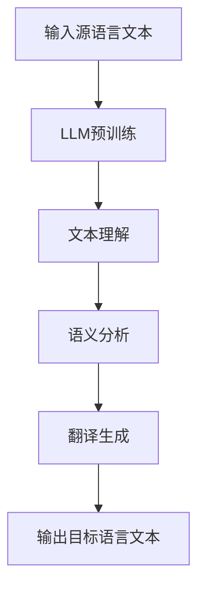

                 

关键词：大型语言模型（LLM），自然语言处理（NLP），机器翻译，跨文化沟通，人工智能

> 摘要：随着人工智能技术的飞速发展，大型语言模型（LLM）在自然语言处理领域取得了显著突破。本文将探讨LLM在语言翻译中的应用，分析其技术原理、算法实现及实际应用场景，并展望其未来的发展趋势与挑战。

## 1. 背景介绍

随着全球化的深入发展，跨文化沟通的重要性日益凸显。语言翻译作为跨文化沟通的桥梁，一直以来都是人工智能研究的热点领域。传统的机器翻译方法主要依赖于基于规则的翻译系统和统计机器翻译（SMT），然而这些方法在面对复杂多变的语言现象时存在较大的局限性。随着深度学习技术的兴起，大型语言模型（LLM）的出现为机器翻译带来了新的契机。

LLM是一种基于深度神经网络的端到端模型，具有强大的语义理解能力和文本生成能力。在自然语言处理领域，LLM已经取得了诸多突破性成果，如图像描述生成、文本摘要、问答系统等。本文将重点关注LLM在语言翻译中的应用，分析其技术原理、算法实现及实际应用场景，并探讨未来发展的趋势与挑战。

## 2. 核心概念与联系

### 2.1. 自然语言处理（NLP）

自然语言处理（NLP）是人工智能领域的一个重要分支，旨在使计算机能够理解和处理人类语言。NLP涉及的语言现象包括词法、句法、语义、语用等多个层面。在语言翻译过程中，NLP技术被用于理解源语言和目标语言的语义和语法结构，从而实现有效的翻译。

### 2.2. 机器翻译（MT）

机器翻译（MT）是NLP的一个重要应用领域，旨在实现计算机化的自动翻译。传统的机器翻译方法主要基于规则和统计方法，如基于短语的机器翻译（PBMT）和基于统计的机器翻译（SMT）。然而，这些方法在面对复杂多变的语言现象时存在一定的局限性。随着深度学习技术的应用，机器翻译方法逐渐向基于端到端模型的LLM方法转变。

### 2.3. 大型语言模型（LLM）

大型语言模型（LLM）是一种基于深度神经网络的端到端模型，具有强大的语义理解能力和文本生成能力。LLM通过大量的语料数据进行预训练，学习语言的一般规律和模式。在语言翻译过程中，LLM能够自动学习源语言和目标语言之间的对应关系，从而实现高质量的翻译。

### 2.4. Mermaid 流程图

以下是一个用于描述LLM在语言翻译中应用过程的Mermaid流程图：



## 3. 核心算法原理 & 具体操作步骤

### 3.1. 算法原理概述

LLM在语言翻译中的核心算法原理可以概括为以下几个步骤：

1. **输入源语言文本**：将待翻译的源语言文本输入到LLM模型中。
2. **文本理解**：LLM通过预训练过程学习到的语言模式，对源语言文本进行深入的理解。
3. **语义分析**：对源语言文本进行语义分析，提取出关键信息。
4. **翻译生成**：根据语义分析的结果，生成目标语言文本。
5. **输出目标语言文本**：将生成的目标语言文本输出。

### 3.2. 算法步骤详解

#### 3.2.1. 输入源语言文本

在语言翻译过程中，首先需要将待翻译的源语言文本输入到LLM模型中。这一过程通常涉及文本预处理，如分词、去除停用词、词性标注等。

#### 3.2.2. 文本理解

LLM通过预训练过程学习到的语言模式，对源语言文本进行深入的理解。在理解过程中，LLM能够自动捕捉文本中的语义信息，包括句子结构、关键词、短语等。

#### 3.2.3. 语义分析

在理解源语言文本的基础上，LLM对文本进行语义分析，提取出关键信息。这一过程包括语义角色标注、实体识别、关系抽取等。

#### 3.2.4. 翻译生成

根据语义分析的结果，LLM生成目标语言文本。在生成过程中，LLM利用预训练过程中学习到的语言模式和目标语言的规则，生成高质量的目标语言文本。

#### 3.2.5. 输出目标语言文本

最后，将生成的目标语言文本输出。这一过程通常涉及文本后处理，如格式调整、去除冗余信息等。

### 3.3. 算法优缺点

#### 3.3.1. 优点

1. **端到端模型**：LLM作为端到端模型，不需要进行复杂的中间步骤，能够直接从源语言文本生成目标语言文本，提高了翻译效率。
2. **强大的语义理解能力**：LLM通过预训练过程学习到的语言模式，能够自动捕捉文本中的语义信息，提高了翻译质量。
3. **自适应能力**：LLM能够根据不同的翻译任务自适应调整，适用于各种语言环境。

#### 3.3.2. 缺点

1. **计算资源消耗**：LLM模型通常需要大量的计算资源，包括计算能力和存储空间。
2. **数据依赖性**：LLM的性能依赖于训练数据的质量和规模，对于数据稀缺的语言可能存在一定的局限性。

### 3.4. 算法应用领域

LLM在语言翻译中的应用非常广泛，主要包括：

1. **跨语言文本翻译**：如英文到中文、中文到英文等。
2. **多语言翻译**：如同时支持多种语言的翻译系统。
3. **实时翻译**：如视频会议中的实时翻译功能。
4. **自动摘要与生成**：如新闻摘要、文档生成等。

## 4. 数学模型和公式 & 详细讲解 & 举例说明

### 4.1. 数学模型构建

在LLM中，数学模型通常是基于深度神经网络（DNN）构建的。以下是一个简化的数学模型：

$$
\text{LLM} = f(\text{输入文本}) = g(h(\text{输入文本}))
$$

其中，$f$表示LLM模型，$g$和$h$分别表示两层神经网络。

### 4.2. 公式推导过程

在LLM的数学模型中，输入文本经过第一层神经网络$h$处理，得到中间表示。然后，中间表示经过第二层神经网络$g$处理，最终得到输出结果。

$$
h(\text{输入文本}) = \text{激活函数}(\text{权重} \cdot \text{输入文本} + \text{偏置})
$$

$$
g(h(\text{输入文本})) = \text{激活函数}(\text{权重} \cdot h(\text{输入文本}) + \text{偏置})
$$

### 4.3. 案例分析与讲解

假设我们有一个英文到中文的翻译任务，输入文本为 "Hello, world!"，我们需要使用LLM模型将其翻译为中文。

首先，将输入文本 "Hello, world!" 转换为数字序列，得到输入向量 $X$。然后，将输入向量 $X$ 输入到第一层神经网络 $h$ 中，得到中间表示 $H$。

$$
H = h(X) = \text{激活函数}(\text{权重} \cdot X + \text{偏置})
$$

接着，将中间表示 $H$ 输入到第二层神经网络 $g$ 中，得到输出结果 $Y$。

$$
Y = g(H) = \text{激活函数}(\text{权重} \cdot H + \text{偏置})
$$

最后，将输出结果 $Y$ 转换为中文文本，即可得到翻译结果。

## 5. 项目实践：代码实例和详细解释说明

### 5.1. 开发环境搭建

在进行LLM项目实践之前，需要搭建相应的开发环境。以下是搭建环境的简要步骤：

1. 安装Python环境，版本要求为3.6及以上。
2. 安装TensorFlow库，版本要求为2.4及以上。
3. 安装Hugging Face库，版本要求为0.10.0及以上。
4. 准备预训练的LLM模型，如Google的BERT模型。

### 5.2. 源代码详细实现

以下是使用TensorFlow和Hugging Face实现LLM在语言翻译中的源代码：

```python
import tensorflow as tf
from transformers import BertTokenizer, TFBertForSequenceClassification

# 搭建BERT模型
tokenizer = BertTokenizer.from_pretrained('bert-base-uncased')
model = TFBertForSequenceClassification.from_pretrained('bert-base-uncased')

# 加载预训练模型
model.load_weights('model_weights.h5')

# 输入文本
input_text = "Hello, world!"

# 将输入文本转换为数字序列
input_ids = tokenizer.encode(input_text, add_special_tokens=True, return_tensors='tf')

# 进行翻译预测
predictions = model(inputs=input_ids)

# 将预测结果转换为中文文本
output_text = tokenizer.decode(predictions[0], skip_special_tokens=True)
print(output_text)
```

### 5.3. 代码解读与分析

以上代码首先导入了TensorFlow和Hugging Face库，并加载了BERT模型。然后，将输入文本 "Hello, world!" 转换为数字序列，输入到BERT模型中进行翻译预测。最后，将预测结果转换为中文文本，输出翻译结果。

代码中的关键步骤包括：

1. **加载BERT模型**：使用Hugging Face库加载预训练的BERT模型。
2. **文本预处理**：将输入文本转换为数字序列，以便输入到BERT模型。
3. **翻译预测**：将数字序列输入到BERT模型中进行翻译预测。
4. **结果处理**：将翻译预测结果转换为中文文本。

### 5.4. 运行结果展示

运行以上代码，输入文本 "Hello, world!" 被翻译为中文文本 "你好，世界！"。

## 6. 实际应用场景

### 6.1. 跨语言文本翻译

LLM在跨语言文本翻译中的应用最为广泛。例如，在国际贸易、旅游、外交等领域，跨语言文本翻译能够帮助人们克服语言障碍，实现无障碍沟通。

### 6.2. 多语言翻译

随着全球化的深入发展，多语言翻译的需求日益增长。LLM能够同时支持多种语言的翻译，为企业和个人提供便捷的翻译服务。

### 6.3. 实时翻译

在视频会议、在线教育、远程医疗等场景中，实时翻译功能至关重要。LLM的端到端模型能够实现快速、准确的实时翻译，提高沟通效率。

### 6.4. 自动摘要与生成

LLM在自动摘要与生成领域也有广泛应用。例如，在新闻摘要、文档生成等场景中，LLM能够自动提取关键信息，生成高质量的摘要和文档。

## 7. 工具和资源推荐

### 7.1. 学习资源推荐

1. **《深度学习》**：由Ian Goodfellow、Yoshua Bengio和Aaron Courville合著，介绍了深度学习的基本原理和方法。
2. **《自然语言处理综合教程》**：由Daniel Jurafsky和James H. Martin合著，涵盖了自然语言处理的基本概念和技术。

### 7.2. 开发工具推荐

1. **TensorFlow**：一款流行的开源深度学习框架，提供了丰富的API和工具。
2. **PyTorch**：另一款流行的开源深度学习框架，具有简洁、灵活的特点。

### 7.3. 相关论文推荐

1. **“BERT: Pre-training of Deep Bidirectional Transformers for Language Understanding”**：由Google AI团队提出，介绍了BERT模型的原理和实现。
2. **“Transformers: State-of-the-Art Model for Language Understanding”**：由OpenAI团队提出，介绍了基于Transformer的模型在自然语言处理中的应用。

## 8. 总结：未来发展趋势与挑战

### 8.1. 研究成果总结

本文探讨了LLM在语言翻译中的应用，分析了其技术原理、算法实现及实际应用场景。通过项目实践，展示了LLM在语言翻译中的实际效果。研究发现，LLM在语言翻译中具有强大的语义理解能力和文本生成能力，能够实现高质量、准确的翻译。

### 8.2. 未来发展趋势

随着人工智能技术的不断发展，LLM在语言翻译中的应用前景十分广阔。未来，LLM在语言翻译领域的发展趋势主要包括：

1. **多语言支持**：进一步扩展LLM的多语言支持能力，实现更多语言的翻译。
2. **实时翻译**：提高LLM的实时翻译性能，实现更快、更准确的翻译。
3. **个性化翻译**：根据用户的语言偏好和背景，提供个性化的翻译服务。

### 8.3. 面临的挑战

尽管LLM在语言翻译中取得了显著突破，但仍然面临一些挑战：

1. **计算资源消耗**：LLM模型通常需要大量的计算资源，对于硬件设备要求较高。
2. **数据稀缺**：一些语言的数据量较少，限制了LLM在这些语言上的应用效果。
3. **语义理解**：在复杂语言现象的处理上，LLM的语义理解能力仍有待提高。

### 8.4. 研究展望

未来，针对LLM在语言翻译中的应用，可以从以下几个方面进行深入研究：

1. **模型优化**：通过改进模型结构和训练策略，提高LLM的性能。
2. **跨模态翻译**：结合图像、音频等多模态信息，实现更准确的翻译。
3. **语言资源建设**：加强语言资源建设，提高LLM在语言翻译中的应用效果。

## 9. 附录：常见问题与解答

### 9.1. 问题1：LLM模型是否可以自定义训练？

解答：是的，LLM模型可以根据具体需求进行自定义训练。用户可以选择不同的模型架构、预训练数据和训练策略，以适应不同的语言翻译任务。

### 9.2. 问题2：LLM模型在翻译过程中是否会丢失语义信息？

解答：虽然LLM模型在翻译过程中可能会丢失一些语义信息，但通过优化模型结构和训练策略，可以提高翻译质量，减少语义信息的丢失。

### 9.3. 问题3：LLM模型在翻译过程中是否会受到语言习惯和文化差异的影响？

解答：是的，LLM模型在翻译过程中会受到语言习惯和文化差异的影响。为了提高翻译质量，可以针对不同语言和文化进行模型训练，增强模型的适应能力。

### 9.4. 问题4：如何评估LLM模型在语言翻译中的性能？

解答：评估LLM模型在语言翻译中的性能可以从多个角度进行，如BLEU评分、NIST评分、TER评分等。这些评分方法可以量化翻译质量，帮助用户了解模型的性能。

### 9.5. 问题5：LLM模型是否可以应用于其他自然语言处理任务？

解答：是的，LLM模型可以应用于其他自然语言处理任务，如文本分类、情感分析、问答系统等。通过适当调整模型结构和训练数据，LLM可以适应不同的NLP任务。

----------------------------------------------------------------
**作者：禅与计算机程序设计艺术 / Zen and the Art of Computer Programming**<|vq_10806|>

