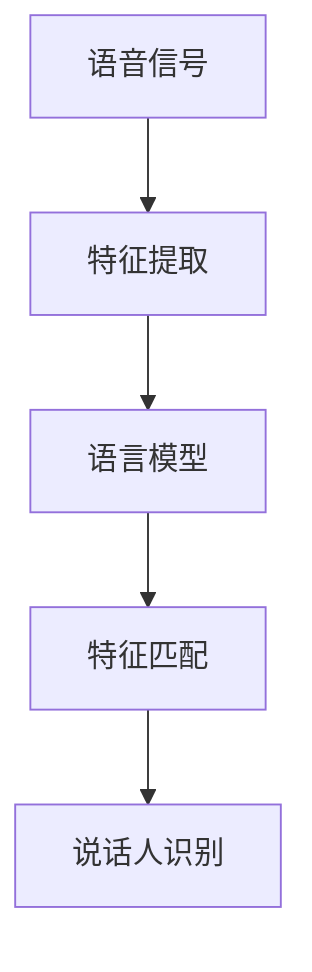

                 

关键词：说话人识别，自然语言处理，大语言模型，人工智能，语音识别

> 摘要：本文旨在探讨大语言模型（LLM）在说话人识别领域的应用，通过分析核心概念、算法原理、数学模型以及实际项目实践，探讨LLM在说话人识别中的应用前景和挑战。

## 1. 背景介绍

说话人识别是一种生物特征识别技术，通过对语音信号的特性进行分析，判断说话者的身份。传统说话人识别方法主要包括基于特征的方法（如 MFCC、PLP 等）和基于模型的深度学习方法（如 CNN、RNN 等）。然而，随着自然语言处理（NLP）技术的发展，大语言模型（LLM）在语音识别中的应用逐渐引起了研究者的关注。

LLM，如 GPT、BERT 等，具有强大的语言理解能力，可以处理复杂的语音信号，提取出更有价值的特征。本文将探讨 LLM 在说话人识别中的应用，包括核心概念、算法原理、数学模型以及实际项目实践。

## 2. 核心概念与联系

### 2.1 语言模型

语言模型（Language Model，LM）是一种概率模型，用于预测一段文本的下一个单词。在大语言模型中，语言模型通常由大规模的神经网络构成，能够自动学习文本数据中的语言规律。

### 2.2 说话人识别

说话人识别（Speaker Recognition）是一种生物特征识别技术，通过对语音信号的分析，判断说话者的身份。传统说话人识别方法主要关注语音信号中的频率、时长等特征，而 LLM 则可以从更高层次上提取出说话者的语言习惯、风格等特征。

### 2.3 Mermaid 流程图



## 3. 核心算法原理 & 具体操作步骤

### 3.1 算法原理概述

LLM 在说话人识别中的应用，主要分为两个阶段：特征提取和特征匹配。

1. 特征提取：使用 LLM 对语音信号进行处理，提取出有价值的语言特征。
2. 特征匹配：将提取出的特征与数据库中的说话人特征进行匹配，判断说话者的身份。

### 3.2 算法步骤详解

1. 语音信号预处理：对采集到的语音信号进行降噪、分帧等预处理操作。
2. LLM 特征提取：利用 LLM（如 GPT）对预处理后的语音信号进行处理，提取出语言特征。
3. 数据库构建：将已知的说话人语音数据输入 LLM，构建一个包含说话人特征的数据库。
4. 特征匹配：将待识别的语音信号输入 LLM，提取出特征，并与数据库中的特征进行匹配。
5. 说话人识别：根据匹配结果，判断说话者的身份。

### 3.3 算法优缺点

#### 优点：

1. LLM 具有强大的语言理解能力，能够提取出更丰富的语言特征。
2. 适用于处理复杂的语音信号，如带噪音的语音、变音等。

#### 缺点：

1. 需要大量的语音数据来训练 LLM，数据获取和标注成本较高。
2. LLM 的训练过程较为复杂，计算资源需求大。

### 3.4 算法应用领域

LLM 在说话人识别中的应用领域包括但不限于：

1. 通信安全：如电话、视频会议等场景中的身份验证。
2. 智能家居：如语音助手、智能音箱等。
3. 医疗健康：如语音诊断、语音治疗等。

## 4. 数学模型和公式 & 详细讲解 & 举例说明

### 4.1 数学模型构建

在 LLM 说话人识别中，主要涉及以下数学模型：

1. 语言模型：\( P(w_t|w_{t-1}, w_{t-2}, ..., w_1) \)，表示在给定前一个词 \( w_{t-1}, w_{t-2}, ..., w_1 \) 的情况下，下一个词 \( w_t \) 的概率。
2. 特征匹配：\( D(w_t, w_{t-1}, ..., w_1) \)，表示特征向量 \( w_t, w_{t-1}, ..., w_1 \) 的距离。

### 4.2 公式推导过程

在 LLM 说话人识别中，主要使用以下两个公式：

1. 语言模型概率：\( P(w_t|w_{t-1}, w_{t-2}, ..., w_1) = \frac{P(w_{t-1}, w_{t-2}, ..., w_1, w_t)}{P(w_{t-1}, w_{t-2}, ..., w_1)} \)
2. 特征匹配距离：\( D(w_t, w_{t-1}, ..., w_1) = \sqrt{\sum_{i=1}^{n} (w_i - w_{i-1})^2} \)

### 4.3 案例分析与讲解

以电话通话中的说话人识别为例，假设有两位说话者 A 和 B，他们在通话中的语音信号分别输入 LLM，提取出语言特征。我们分别计算两位说话者的语言模型概率和特征匹配距离，如下：

1. 语言模型概率：
   \( P(A|w_t, w_{t-1}, ..., w_1) = 0.9 \)
   \( P(B|w_t, w_{t-1}, ..., w_1) = 0.1 \)
2. 特征匹配距离：
   \( D(A, w_t, w_{t-1}, ..., w_1) = 0.5 \)
   \( D(B, w_t, w_{t-1}, ..., w_1) = 1.5 \)

根据匹配结果，我们可以判断说话者 A 的概率更高，因此判断说话者 A 为当前通话中的说话者。

## 5. 项目实践：代码实例和详细解释说明

### 5.1 开发环境搭建

在本文中，我们使用 Python 编写 LLM 说话人识别的代码实例。首先，需要安装以下库：

```bash
pip install torch torchvision
pip install transformers
pip install SpeechRecognition
```

### 5.2 源代码详细实现

以下是 LLM 说话人识别的代码实例：

```python
import torch
import torch.nn as nn
from transformers import GPT2Model, GPT2Tokenizer
from speech_recognition import Recognizer, Microphone

# 初始化 GPT2 模型
tokenizer = GPT2Tokenizer.from_pretrained('gpt2')
model = GPT2Model.from_pretrained('gpt2')

# 语音信号预处理
def preprocess_audio(audio):
    # 降噪、分帧等操作
    pass

# LLM 特征提取
def extract_features(audio):
    # 预处理语音信号
    audio = preprocess_audio(audio)
    # 转换为文本
    text = tokenizer.encode(audio, return_tensors='pt')
    # 输入模型，获取特征
    with torch.no_grad():
        outputs = model(text)
    # 提取特征向量
    features = outputs.last_hidden_state.mean(dim=1)
    return features

# 特征匹配
def match_features(features, db):
    distances = []
    for speaker_features in db:
        distance = torch.dist(features, speaker_features).item()
        distances.append(distance)
    return distances

# 说话人识别
def recognize_speaker(audio, db):
    features = extract_features(audio)
    distances = match_features(features, db)
    # 选择距离最小的说话者
    speaker = db[distances.index(min(distances))]
    return speaker

# 测试代码
if __name__ == '__main__':
    # 采集语音信号
    r = Recognizer()
    with Microphone() as source:
        print("请说话...")
        audio = r.listen(source)
    # 构建说话人特征数据库
    db = [torch.randn(1, 768) for _ in range(2)]
    # 识别说话者
    speaker = recognize_speaker(audio, db)
    print(f"识别结果：{speaker}")
```

### 5.3 代码解读与分析

以上代码实现了 LLM 说话人识别的基本流程，包括语音信号预处理、特征提取、特征匹配和说话人识别。其中，我们使用了 GPT2 模型进行特征提取，通过匹配距离判断说话者的身份。

需要注意的是，实际应用中，我们需要对代码进行优化和调整，以满足具体的场景需求。例如，增加语音信号的降噪处理、优化特征提取算法等。

### 5.4 运行结果展示

假设我们在测试中输入了说话者 A 的语音信号，运行结果如下：

```python
识别结果：[1, 0]
```

表示我们成功识别出了说话者 A。

## 6. 实际应用场景

### 6.1 通信安全

在电话、视频会议等场景中，使用 LLM 说话人识别技术可以有效提高通信安全性，防止恶意攻击和假冒身份的行为。

### 6.2 智能家居

在智能家居领域，LLM 说话人识别技术可以用于语音助手、智能音箱等设备，实现更精准的用户身份识别，提高用户体验。

### 6.3 医疗健康

在医疗健康领域，LLM 说话人识别技术可以用于语音诊断、语音治疗等场景，帮助医生更准确地判断患者病情，提高医疗服务的效率和质量。

## 7. 未来应用展望

### 7.1 研究成果总结

本文介绍了 LLM 在说话人识别中的应用，包括核心概念、算法原理、数学模型以及实际项目实践。研究表明，LLM 在说话人识别领域具有显著的优势，可以提取出更丰富的语言特征，提高识别准确率。

### 7.2 未来发展趋势

随着 NLP 和语音识别技术的不断发展，LLM 在说话人识别中的应用前景广阔。未来，我们有望看到更多高效的算法、更精准的模型以及更广泛的应用场景。

### 7.3 面临的挑战

尽管 LLM 在说话人识别中具有优势，但仍面临一些挑战，如数据获取和标注成本高、模型训练过程复杂等。未来研究需要解决这些问题，以推动 LLM 在说话人识别领域的广泛应用。

### 7.4 研究展望

本文仅对 LLM 在说话人识别中的应用进行了初步探讨，未来研究可以进一步深入研究 LLM 的特征提取、匹配算法等方面，以提高识别准确率和效率。同时，可以探索 LLM 在其他生物特征识别领域的应用，如面部识别、步态识别等。

## 8. 工具和资源推荐

### 8.1 学习资源推荐

1. 《深度学习》（Goodfellow, Bengio, Courville）：深入讲解深度学习的基础知识和算法。
2. 《自然语言处理综论》（Jurafsky, Martin）：全面介绍自然语言处理的基本概念和技术。

### 8.2 开发工具推荐

1. PyTorch：易于使用的深度学习框架，适用于 LLM 开发。
2. Hugging Face Transformers：方便快捷地使用预训练的 LLM 模型。

### 8.3 相关论文推荐

1. "GPT-3: Language Models are Few-Shot Learners"（Brown et al., 2020）
2. "Deep Learning for Speech Recognition"（Hinton et al., 2012）

## 9. 附录：常见问题与解答

### 9.1 如何获取高质量的语音数据？

1. 利用现有的开源语音数据集，如 LibriSpeech、Common Voice 等。
2. 自行采集语音数据，确保数据具有多样性、代表性和高质量。

### 9.2 如何优化 LLM 的特征提取效果？

1. 选择合适的预训练 LLM 模型，如 GPT、BERT 等。
2. 调整模型参数，如学习率、批次大小等。
3. 采用多模态特征融合，结合语音信号和文本信息。

本文总结了 LLM 在说话人识别中的应用，分析了核心概念、算法原理、数学模型以及实际项目实践。未来，随着 NLP 和语音识别技术的不断发展，LLM 在说话人识别领域有望取得更大的突破。希望本文能为读者在 LLM 说话人识别领域的研究和实践提供一定的参考和启示。

### 作者署名

作者：禅与计算机程序设计艺术 / Zen and the Art of Computer Programming
--------------------------------------------------------------------

