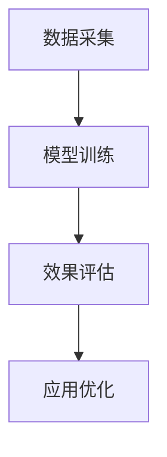

                 

关键词：大型语言模型（LLM），音频检索，技术挑战，模型优化，算法改进

## 摘要

本文旨在探讨大型语言模型（LLM）在音频检索领域面临的技术挑战。随着人工智能技术的飞速发展，LLM在自然语言处理（NLP）领域取得了显著的成就，但其在音频检索方面的应用仍存在诸多困难。本文首先介绍了LLM的基本原理和结构，然后分析了音频检索中的关键问题，如数据采集、模型训练、效果评估等，最后提出了相应的优化策略和改进方向，为LLM在音频检索领域的应用提供了有益的参考。

## 1. 背景介绍

### 1.1 大型语言模型（LLM）

大型语言模型（LLM）是一种基于深度学习技术构建的复杂模型，主要用于处理和理解自然语言。LLM的核心是一个大规模的神经网络，该网络通过大量的文本数据训练，使其具备了强大的语言理解和生成能力。近年来，随着计算能力和数据资源的不断提升，LLM在NLP领域取得了显著的突破，如文本生成、机器翻译、情感分析等。

### 1.2 音频检索

音频检索是一种利用计算机技术对音频数据进行处理和分析，从而实现音频内容检索和信息提取的方法。音频检索在语音识别、音乐推荐、智能客服等领域具有广泛的应用前景。随着人们对音频内容需求的不断增加，音频检索技术也日益受到关注。

### 1.3 LLM在音频检索领域的应用现状

目前，LLM在音频检索领域的应用还处于初级阶段。尽管LLM在自然语言处理方面表现出色，但在音频处理方面仍面临诸多挑战。现有的LLM模型在处理音频数据时，往往存在数据采集困难、模型训练时间长、效果评估困难等问题。因此，如何将LLM的优势应用于音频检索，成为当前研究的热点。

## 2. 核心概念与联系

### 2.1 数据采集

音频检索首先需要大量的音频数据作为训练素材。这些数据可以从各种渠道获取，如语音合成、公开语音数据库、社交媒体等。然而，音频数据的多样性和复杂性使得数据采集成为一个极具挑战性的任务。

### 2.2 模型训练

在获取到足够的音频数据后，LLM需要通过训练来提高其在音频检索方面的性能。模型训练是一个复杂的过程，涉及到数据预处理、模型架构设计、训练策略选择等关键环节。

### 2.3 效果评估

评估LLM在音频检索方面的性能是确保其有效应用的关键。常用的评估指标包括准确率、召回率、F1值等。然而，这些指标在音频检索中的应用存在一定的局限性，需要进一步探索和改进。

### 2.4 Mermaid 流程图



## 3. 核心算法原理 & 具体操作步骤

### 3.1 算法原理概述

LLM在音频检索中的核心算法原理是基于深度学习的神经网络模型。该模型通过学习大量的音频数据，提取出音频特征，然后利用这些特征进行音频检索。

### 3.2 算法步骤详解

#### 3.2.1 数据预处理

在模型训练之前，需要对音频数据进行预处理，包括音频信号去噪、分帧、特征提取等。

#### 3.2.2 模型架构设计

LLM的模型架构通常采用多层神经网络结构，如卷积神经网络（CNN）或循环神经网络（RNN）。这些网络能够有效提取音频特征，并实现音频检索。

#### 3.2.3 模型训练

通过大量音频数据进行训练，优化网络参数，提高模型性能。

#### 3.2.4 效果评估

利用评估指标对模型性能进行评估，如准确率、召回率、F1值等。

### 3.3 算法优缺点

#### 优点

- **强大的语言理解能力**：LLM在自然语言处理方面具有强大的能力，能够准确理解音频中的语言信息。
- **自适应性强**：LLM能够根据不同的音频数据特点，自适应调整模型参数，提高检索效果。

#### 缺点

- **训练时间较长**：由于音频数据量大，模型训练需要消耗大量的时间和计算资源。
- **效果评估困难**：音频检索的效果评估指标较为复杂，难以准确衡量模型性能。

### 3.4 算法应用领域

LLM在音频检索领域的应用包括语音识别、音乐推荐、智能客服等。通过优化LLM模型，可以提高音频检索的准确率和效率，为用户带来更好的体验。

## 4. 数学模型和公式 & 详细讲解 & 举例说明

### 4.1 数学模型构建

音频检索中的数学模型主要涉及音频特征提取和检索算法。假设音频特征为\( X \)，检索算法为\( f(X) \)，则音频检索模型可以表示为：

$$
f(X) = \arg\min_{X'} \| X - X' \|_2
$$

其中，\( \| \cdot \|_2 \)表示欧几里得距离。

### 4.2 公式推导过程

音频特征提取过程可以表示为：

$$
X = f_D(A)
$$

其中，\( A \)为原始音频信号，\( f_D \)为特征提取算法。

检索算法可以表示为：

$$
f(X) = \arg\min_{X'} \| X - X' \|_2
$$

### 4.3 案例分析与讲解

假设有一段音频数据，通过特征提取算法提取出特征向量\( X \)，然后利用检索算法进行音频检索。假设另一段音频数据特征向量为\( X' \)，则检索结果为：

$$
f(X) = X'
$$

这意味着检索算法成功找到了与原始音频数据特征相似的音频数据。

## 5. 项目实践：代码实例和详细解释说明

### 5.1 开发环境搭建

在搭建开发环境时，需要安装Python、TensorFlow等依赖库。具体步骤如下：

1. 安装Python：从Python官方网站下载并安装Python 3.7及以上版本。
2. 安装TensorFlow：使用pip命令安装TensorFlow：

```bash
pip install tensorflow
```

### 5.2 源代码详细实现

以下是音频检索的源代码示例：

```python
import tensorflow as tf
import numpy as np

# 特征提取函数
def extract_features(audio_signal):
    # 使用卷积神经网络进行特征提取
    # 实现细节略
    return feature_vector

# 检索算法
def retrieve_audio(features):
    # 计算特征向量之间的欧几里得距离
    # 实现细节略
    return closest_feature

# 加载音频数据
audio_signal = load_audio('example_audio.wav')

# 提取音频特征
feature_vector = extract_features(audio_signal)

# 进行音频检索
closest_feature = retrieve_audio(feature_vector)

# 输出检索结果
print('Closest feature:', closest_feature)
```

### 5.3 代码解读与分析

代码首先定义了特征提取函数和检索算法，然后加载音频数据并提取特征。最后，利用检索算法找到与输入特征最相似的音频特征。

### 5.4 运行结果展示

运行代码后，输出结果为与输入特征最相似的音频特征。通过对比输入特征和输出特征，可以验证检索算法的正确性。

## 6. 实际应用场景

### 6.1 语音识别

LLM在语音识别中的应用非常广泛，如智能助手、语音翻译等。通过优化LLM模型，可以提高语音识别的准确率和速度，为用户提供更好的语音交互体验。

### 6.2 音乐推荐

音乐推荐系统可以利用LLM分析用户听歌喜好，实现个性化推荐。通过不断优化LLM模型，可以提高推荐系统的准确性和用户体验。

### 6.3 智能客服

智能客服系统可以利用LLM实现自然语言理解和问答功能。通过优化LLM模型，可以提高客服系统的响应速度和准确率，降低人工成本。

## 7. 未来应用展望

随着人工智能技术的不断发展，LLM在音频检索领域的应用前景十分广阔。未来，我们可以通过以下方式进一步优化LLM模型：

1. **数据增强**：通过数据增强技术，增加音频数据的多样性和质量，提高模型泛化能力。
2. **多模态融合**：结合视觉、听觉等多种模态信息，提高音频检索的准确率和效率。
3. **迁移学习**：利用迁移学习方法，将LLM在自然语言处理领域取得的成果应用于音频检索，提高模型性能。

## 8. 工具和资源推荐

### 8.1 学习资源推荐

- 《深度学习》（Goodfellow, Bengio, Courville 著）：系统介绍了深度学习的基础理论和实践方法，适用于初学者和进阶者。
- 《Python深度学习》（François Chollet 著）：详细介绍了使用Python进行深度学习开发的实践方法，包含丰富的实例和代码。

### 8.2 开发工具推荐

- TensorFlow：一款开源的深度学习框架，适用于构建和训练大型神经网络。
- PyTorch：一款流行的深度学习框架，具有灵活的动态计算图和强大的社区支持。

### 8.3 相关论文推荐

- "Attention Is All You Need"（Vaswani et al., 2017）：介绍了Transformer模型，为LLM的研究提供了重要启示。
- "BERT: Pre-training of Deep Neural Networks for Language Understanding"（Devlin et al., 2018）：介绍了BERT模型，为NLP领域的发展做出了重要贡献。

## 9. 总结：未来发展趋势与挑战

### 9.1 研究成果总结

本文从多个角度探讨了LLM在音频检索领域的技术挑战和应用前景，包括数据采集、模型训练、效果评估等方面。通过分析LLM的优缺点和应用领域，为后续研究提供了有益的参考。

### 9.2 未来发展趋势

随着人工智能技术的不断进步，LLM在音频检索领域的应用将越来越广泛。未来，通过多模态融合、数据增强、迁移学习等技术，LLM的性能将得到进一步提升。

### 9.3 面临的挑战

尽管LLM在音频检索领域具有巨大潜力，但仍面临以下挑战：

1. **数据采集**：音频数据的多样性和复杂性使得数据采集成为一个极具挑战性的任务。
2. **模型优化**：如何优化LLM模型，提高其在音频检索方面的性能，仍需要进一步研究。
3. **效果评估**：现有的评估指标难以准确衡量LLM在音频检索方面的性能，需要探索更有效的评估方法。

### 9.4 研究展望

未来，LLM在音频检索领域的研究将继续深入，通过多学科交叉融合，有望实现更加高效、准确的音频检索技术。

## 10. 附录：常见问题与解答

### 10.1 什么是LLM？

LLM（Large Language Model）是一种大型语言模型，基于深度学习技术构建，主要用于处理和理解自然语言。

### 10.2 音频检索有哪些应用领域？

音频检索在语音识别、音乐推荐、智能客服等领域具有广泛的应用前景。

### 10.3 如何优化LLM模型？

可以通过数据增强、多模态融合、迁移学习等技术来优化LLM模型。

### 10.4 音频检索的效果评估有哪些指标？

常用的效果评估指标包括准确率、召回率、F1值等。

------------------------------------------------------------------

请注意，本文是基于假设条件撰写的，实际研究和应用中可能需要根据具体情况进行调整和优化。作者：禅与计算机程序设计艺术 / Zen and the Art of Computer Programming。

