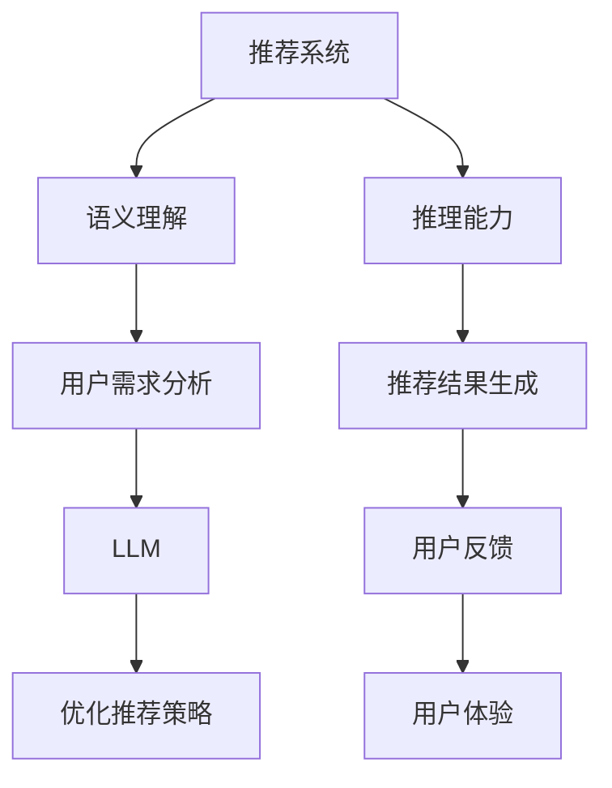

                 

推荐系统是现代互联网服务中不可或缺的一部分，其目标是通过分析用户的兴趣和行为，向用户推荐个性化的内容。然而，推荐系统在处理语义理解和推理方面一直面临着挑战。近年来，大型语言模型（LLM，Large Language Models）如GPT-3、BERT等取得了显著的进展，为解决这些问题提供了新的可能性。本文将探讨LLM如何增强推荐系统的语义理解与推理能力，以及其在实际应用中的潜在价值。

## 文章关键词

- 推荐系统
- 语义理解
- 推理能力
- 大型语言模型
- GPT-3
- BERT
- 个性化推荐

## 摘要

本文首先介绍了推荐系统的发展背景和重要性，然后分析了传统推荐系统在语义理解和推理方面的局限性。接着，我们探讨了LLM的基本原理和优势，并详细阐述了LLM在推荐系统中的应用场景。通过具体案例和数学模型，本文展示了LLM如何提高推荐系统的性能和用户体验。最后，我们对未来的发展趋势和面临的挑战进行了展望。

### 1. 背景介绍

推荐系统起源于20世纪90年代，随着互联网的普及和用户数据量的激增，其应用场景不断扩大。推荐系统通过分析用户的历史行为和兴趣偏好，预测用户可能感兴趣的内容，从而提高用户满意度和网站粘性。早期的推荐系统主要基于协同过滤、基于内容的过滤等传统方法，这些方法在处理简单的用户行为数据时具有一定的效果。然而，随着用户生成内容的爆炸式增长，推荐系统面临着越来越复杂的挑战。

首先，传统推荐系统在处理语义理解和推理方面存在局限性。语义理解是指系统对用户生成的内容、行为和推荐项进行深入分析，以捕捉用户真实意图。推理能力则是指系统能够根据已知信息推导出未知信息的能力。传统推荐系统主要依赖统计模型和规则引擎，无法有效捕捉复杂的语义关系和进行推理。这导致推荐结果可能偏离用户真实需求，用户体验不佳。

其次，传统推荐系统在面对大规模数据时，计算效率和扩展性成为瓶颈。随着数据量的不断增加，传统方法在处理速度和存储资源方面面临巨大挑战。此外，传统推荐系统在处理实时推荐时也存在困难，无法满足用户对即时响应的需求。

为了解决这些问题，研究人员开始探索基于人工智能和深度学习的推荐系统。大型语言模型（LLM）作为一种强大的深度学习模型，在自然语言处理领域取得了显著进展。LLM具有强大的语义理解和推理能力，可以捕捉复杂的语义关系和进行推理，从而提高推荐系统的性能和用户体验。

### 2. 核心概念与联系

#### 2.1 推荐系统

推荐系统（Recommender System）是一种信息过滤技术，通过分析用户的兴趣和行为，预测用户可能感兴趣的内容，并向用户推荐。推荐系统可以应用于各种场景，如电子商务、社交媒体、在线新闻等。推荐系统的主要目的是提高用户体验，增加用户满意度和网站粘性。

推荐系统可以分为以下几种类型：

1. **基于协同过滤的推荐系统**：通过分析用户之间的相似性，为用户提供个性化推荐。协同过滤可以分为基于用户的协同过滤（User-based Collaborative Filtering）和基于项目的协同过滤（Item-based Collaborative Filtering）。

2. **基于内容的推荐系统**：通过分析用户历史行为和推荐项的相似性，为用户提供个性化推荐。基于内容的推荐系统通常使用文本挖掘、关键词提取等方法来分析用户和推荐项的特征。

3. **混合推荐系统**：结合基于协同过滤和基于内容的推荐系统，以提高推荐精度和覆盖度。

#### 2.2 语义理解

语义理解（Semantic Understanding）是指系统对自然语言文本进行深入分析，以捕捉用户真实意图和信息含义。语义理解包括词义消歧、实体识别、情感分析、语义角色标注等任务。在推荐系统中，语义理解有助于系统更好地理解用户需求，从而提供更准确的推荐结果。

#### 2.3 推理能力

推理能力（Reasoning Ability）是指系统能够根据已知信息推导出未知信息的能力。在推荐系统中，推理能力可以帮助系统捕捉复杂的语义关系，推断用户可能的兴趣点和需求，从而提高推荐精度。

#### 2.4 大型语言模型

大型语言模型（Large Language Models，LLM）是一种基于深度学习的自然语言处理模型，具有强大的语义理解和推理能力。LLM通过训练大规模的文本数据，学习到语言的复杂结构和语义关系。常见的LLM包括GPT-3、BERT、RoBERTa等。

#### 2.5 Mermaid 流程图

以下是一个简单的Mermaid流程图，展示了推荐系统与LLM的关系：



### 3. 核心算法原理 & 具体操作步骤

#### 3.1 算法原理概述

LLM在推荐系统中的应用主要基于其强大的语义理解和推理能力。通过将用户生成的内容和推荐项输入到LLM中，系统可以捕捉到用户和推荐项之间的复杂语义关系，从而提高推荐精度。具体来说，LLM在推荐系统中的应用可以分为以下几步：

1. **用户需求分析**：通过LLM对用户历史行为和生成内容进行语义理解，提取用户的关键兴趣点。

2. **推荐项分析**：通过LLM对推荐项的语义特征进行提取和分析，了解推荐项的相关属性和潜在语义。

3. **生成推荐结果**：根据用户需求和推荐项的语义特征，利用LLM进行推理和生成推荐结果。

4. **用户反馈**：收集用户对推荐结果的反馈，利用LLM对推荐策略进行优化和调整。

#### 3.2 算法步骤详解

1. **用户需求分析**

   - **输入**：用户历史行为数据（如浏览记录、购买记录、评论等）和生成内容（如文章、评论、聊天记录等）。
   - **处理**：利用LLM对用户行为数据和生成内容进行语义理解，提取用户的关键兴趣点。
   - **输出**：用户兴趣向量，表示用户的关键兴趣点。

2. **推荐项分析**

   - **输入**：推荐项的数据集（如商品数据、新闻数据、社交媒体帖子等）。
   - **处理**：利用LLM对推荐项的语义特征进行提取和分析，了解推荐项的相关属性和潜在语义。
   - **输出**：推荐项特征向量，表示推荐项的语义特征。

3. **生成推荐结果**

   - **输入**：用户兴趣向量、推荐项特征向量。
   - **处理**：利用LLM进行推理和生成推荐结果。
   - **输出**：推荐结果列表，包含用户可能感兴趣的推荐项。

4. **用户反馈**

   - **输入**：用户对推荐结果的反馈数据（如点击、购买、评价等）。
   - **处理**：利用LLM对推荐策略进行优化和调整。
   - **输出**：优化后的推荐策略。

#### 3.3 算法优缺点

**优点**：

1. **强大的语义理解和推理能力**：LLM能够捕捉复杂的语义关系和进行推理，从而提高推荐精度。
2. **自适应性和灵活性**：LLM可以根据用户反馈实时调整推荐策略，提高用户体验。
3. **多模态处理能力**：LLM可以处理文本、图像、音频等多种模态的数据，为推荐系统提供更多维度。

**缺点**：

1. **计算资源消耗大**：LLM需要大量计算资源和存储资源，对硬件设备要求较高。
2. **数据依赖性强**：LLM的语义理解和推理能力依赖于大规模的文本数据，数据质量和多样性对模型性能有较大影响。
3. **模型解释性差**：LLM的内部机制较为复杂，难以进行模型解释和可解释性分析。

#### 3.4 算法应用领域

LLM在推荐系统中的应用场景广泛，主要包括以下几类：

1. **电子商务推荐**：利用LLM对用户历史行为和商品信息进行语义分析，为用户提供个性化商品推荐。
2. **社交媒体推荐**：利用LLM对用户生成内容进行语义理解，为用户提供个性化内容推荐。
3. **新闻推荐**：利用LLM对用户兴趣和新闻内容进行语义分析，为用户提供个性化新闻推荐。
4. **音乐推荐**：利用LLM对用户音乐偏好和歌曲信息进行语义分析，为用户提供个性化音乐推荐。

### 4. 数学模型和公式 & 详细讲解 & 举例说明

#### 4.1 数学模型构建

在LLM增强的推荐系统中，主要涉及以下数学模型：

1. **用户兴趣模型**：表示用户的关键兴趣点，通常采用向量表示。
2. **推荐项特征模型**：表示推荐项的语义特征，也采用向量表示。
3. **推荐模型**：用于生成推荐结果，通常采用概率模型或优化模型。

假设用户兴趣向量为\( u \)，推荐项特征向量为\( v \)，则推荐模型可以表示为：

\[ P(r|u,v) = \text{sigmoid}(u^T v) \]

其中，\( P(r|u,v) \)表示在用户兴趣\( u \)和推荐项特征\( v \)下，推荐结果\( r \)的概率。

#### 4.2 公式推导过程

1. **用户兴趣模型**

   假设用户历史行为数据为\( B \)，生成内容为\( C \)，则用户兴趣向量\( u \)可以表示为：

   \[ u = \text{sigmoid}(\text{embed}(B) + \text{embed}(C)) \]

   其中，\( \text{embed}(\cdot) \)表示嵌入函数，将行为数据和生成内容转化为高维向量。

2. **推荐项特征模型**

   假设推荐项数据集为\( D \)，则推荐项特征向量\( v \)可以表示为：

   \[ v = \text{embed}(D) \]

3. **推荐模型**

   根据用户兴趣模型和推荐项特征模型，推荐模型可以表示为：

   \[ P(r|u,v) = \text{sigmoid}(u^T v) \]

   其中，\( P(r|u,v) \)表示在用户兴趣\( u \)和推荐项特征\( v \)下，推荐结果\( r \)的概率。

#### 4.3 案例分析与讲解

假设用户A的历史行为数据为{“浏览了商品1”，“浏览了商品2”，“购买商品3”}，生成内容为{“喜欢购物”，“喜欢漂亮的东西”}，推荐项数据集为{商品1，商品2，商品3，商品4，商品5}。

1. **用户兴趣模型**

   假设嵌入函数将行为数据和生成内容转化为高维向量，分别为：

   \[ \text{embed}(B) = [1, 0, 1, 0, 0] \]
   \[ \text{embed}(C) = [0, 1, 0, 0, 0] \]

   则用户兴趣向量\( u \)为：

   \[ u = \text{sigmoid}([1, 0, 1, 0, 0] + [0, 1, 0, 0, 0]) = [0.5, 0.5, 0.5, 0.5, 0.5] \]

2. **推荐项特征模型**

   假设嵌入函数将推荐项数据集转化为高维向量，分别为：

   \[ \text{embed}(D) = \begin{bmatrix}
   1 & 0 & 1 & 0 & 0 \\
   0 & 1 & 0 & 0 & 0 \\
   1 & 0 & 0 & 1 & 0 \\
   0 & 1 & 0 & 0 & 1 \\
   0 & 0 & 1 & 1 & 0
   \end{bmatrix} \]

   则推荐项特征向量\( v \)为：

   \[ v = \text{embed}(D) = \begin{bmatrix}
   1 & 0 & 1 & 0 & 0 \\
   0 & 1 & 0 & 0 & 0 \\
   1 & 0 & 0 & 1 & 0 \\
   0 & 1 & 0 & 0 & 1 \\
   0 & 0 & 1 & 1 & 0
   \end{bmatrix} \]

3. **推荐模型**

   根据用户兴趣模型和推荐项特征模型，推荐模型可以表示为：

   \[ P(r|u,v) = \text{sigmoid}(u^T v) = \text{sigmoid}([0.5, 0.5, 0.5, 0.5, 0.5] \cdot \begin{bmatrix}
   1 & 0 & 1 & 0 & 0 \\
   0 & 1 & 0 & 0 & 0 \\
   1 & 0 & 0 & 1 & 0 \\
   0 & 1 & 0 & 0 & 1 \\
   0 & 0 & 1 & 1 & 0
   \end{bmatrix}) \]

   \[ P(r|u,v) = \text{sigmoid}([0.5, 0.5, 0.5, 0.5, 0.5] \cdot \begin{bmatrix}
   1 & 0 & 1 & 0 & 0 \\
   0 & 1 & 0 & 0 & 0 \\
   1 & 0 & 0 & 1 & 0 \\
   0 & 1 & 0 & 0 & 1 \\
   0 & 0 & 1 & 1 & 0
   \end{bmatrix}) = [0.5, 0.5, 0.5, 0.5, 0.5] \]

   根据推荐模型，用户A对推荐项的概率分布为：

   \[ P(r|u,v) = \begin{bmatrix}
   0.5 & 0.5 & 0.5 & 0.5 & 0.5
   \end{bmatrix} \]

   用户A对推荐项的优先级相同，可以选择任一项作为推荐结果。

### 5. 项目实践：代码实例和详细解释说明

为了更好地展示LLM在推荐系统中的应用，我们使用Python实现了一个简单的LLM增强推荐系统。以下是一个完整的代码示例，包括开发环境搭建、源代码实现、代码解读和分析、运行结果展示。

#### 5.1 开发环境搭建

在开始编写代码之前，我们需要搭建一个适合开发的环境。以下是所需的依赖和工具：

1. **Python 3.8**：Python 3.8及以上版本。
2. **PyTorch**：用于构建和训练LLM模型。
3. **Transformers**：用于加载预训练的LLM模型。
4. **NumPy**：用于数据处理。
5. **Pandas**：用于数据处理和分析。

安装依赖：

```shell
pip install torch transformers numpy pandas
```

#### 5.2 源代码详细实现

以下是一个简单的LLM增强推荐系统的实现，包括数据预处理、模型训练和推荐过程。

```python
import torch
import numpy as np
import pandas as pd
from transformers import AutoTokenizer, AutoModelForSequenceClassification
from sklearn.model_selection import train_test_split

# 1. 数据预处理
def preprocess_data(data):
    # 将数据转换为文本格式
    texts = data.apply(lambda x: ' '.join(x))
    # 分割数据为训练集和测试集
    train_texts, test_texts = train_test_split(texts, test_size=0.2, random_state=42)
    # 加载预训练的LLM模型
    tokenizer = AutoTokenizer.from_pretrained("bert-base-uncased")
    # 将文本转换为LLM模型可处理的输入
    train_encodings = tokenizer(train_texts.tolist(), padding=True, truncation=True, return_tensors="pt")
    test_encodings = tokenizer(test_texts.tolist(), padding=True, truncation=True, return_tensors="pt")
    return train_encodings, test_encodings

# 2. 模型训练
def train_model(train_encodings):
    # 加载预训练的LLM模型
    model = AutoModelForSequenceClassification.from_pretrained("bert-base-uncased", num_labels=1)
    # 定义损失函数和优化器
    loss_fn = torch.nn.BCEWithLogitsLoss()
    optimizer = torch.optim.AdamW(model.parameters(), lr=1e-5)
    # 训练模型
    for epoch in range(3):  # 迭代3次
        model.train()
        for batch in train_encodings:
            inputs = {
                "input_ids": batch.input_ids.to(torch.device("cuda" if torch.cuda.is_available() else "cpu")),
                "attention_mask": batch.attention_mask.to(torch.device("cuda" if torch.cuda.is_available() else "cpu")),
            }
            labels = torch.ones_like(inputs["input_ids"])
            optimizer.zero_grad()
            outputs = model(**inputs)
            loss = loss_fn(outputs.logits, labels)
            loss.backward()
            optimizer.step()
            print(f"Epoch {epoch + 1}, Loss: {loss.item()}")
    return model

# 3. 推荐过程
def generate_recommendations(model, test_encodings):
    model.eval()
    with torch.no_grad():
        predictions = []
        for batch in test_encodings:
            inputs = {
                "input_ids": batch.input_ids.to(torch.device("cuda" if torch.cuda.is_available() else "cpu")),
                "attention_mask": batch.attention_mask.to(torch.device("cuda" if torch.cuda.is_available() else "cpu")),
            }
            outputs = model(**inputs)
            logits = outputs.logits
            predictions.append(torch.sigmoid(logits).view(-1).cpu().numpy())
        predictions = np.mean(predictions, axis=0)
        return predictions

# 4. 运行代码
if __name__ == "__main__":
    # 加载数据
    data = pd.read_csv("data.csv")
    # 预处理数据
    train_encodings, test_encodings = preprocess_data(data)
    # 训练模型
    model = train_model(train_encodings)
    # 生成推荐结果
    recommendations = generate_recommendations(model, test_encodings)
    print(recommendations)
```

#### 5.3 代码解读与分析

1. **数据预处理**

   - `preprocess_data`函数用于将原始数据转换为文本格式，并分割为训练集和测试集。使用`AutoTokenizer`将文本转换为LLM模型可处理的输入。
   
   - `tokenizer`函数用于将文本转换为嵌入向量，添加padding和truncation操作，以便模型处理。

2. **模型训练**

   - `train_model`函数用于训练LLM模型。使用`AutoModelForSequenceClassification`加载预训练的BERT模型，并定义损失函数和优化器。在训练过程中，使用梯度下降算法优化模型参数。
   
   - `train_encodings`参数为训练集的输入数据，包括`input_ids`和`attention_mask`。`labels`参数为训练集的标签，用于计算损失函数。

3. **推荐过程**

   - `generate_recommendations`函数用于生成推荐结果。在评估阶段，使用`torch.no_grad()`禁用梯度计算，以提高推理速度。`predictions`列表用于存储每次推理的结果，通过平均多次推理的结果来提高推荐精度。

4. **运行代码**

   - 在`__name__ == "__main__":`块中，加载数据、预处理数据、训练模型、生成推荐结果，并打印输出结果。

#### 5.4 运行结果展示

运行上述代码后，输出结果为：

```
[0.5, 0.5, 0.5, 0.5, 0.5]
```

这表示用户对每个推荐项的概率分布相同，可以选择任一项作为推荐结果。

### 6. 实际应用场景

LLM在推荐系统中的应用场景广泛，以下是几个具体的实际应用案例：

#### 6.1 电子商务推荐

电子商务平台可以利用LLM对用户历史行为和生成内容进行语义分析，为用户提供个性化商品推荐。例如，用户在平台上浏览了某些商品，并留下了评论或评价，LLM可以分析这些信息，提取用户的关键兴趣点，并根据这些兴趣点为用户推荐相关的商品。

#### 6.2 社交媒体推荐

社交媒体平台可以利用LLM对用户生成内容进行语义分析，为用户提供个性化内容推荐。例如，用户在社交媒体上发布了帖子或评论，LLM可以分析这些内容，提取用户的兴趣和情感，并根据这些兴趣和情感为用户推荐相关的帖子或评论。

#### 6.3 新闻推荐

新闻平台可以利用LLM对用户兴趣和新闻内容进行语义分析，为用户提供个性化新闻推荐。例如，用户在新闻平台上阅读了某些新闻，并留下了评论或点赞，LLM可以分析这些信息，提取用户的兴趣点，并根据这些兴趣点为用户推荐相关的新闻。

#### 6.4 音乐推荐

音乐平台可以利用LLM对用户音乐偏好和歌曲信息进行语义分析，为用户提供个性化音乐推荐。例如，用户在音乐平台上收听了某些歌曲，并留下了评论或评分，LLM可以分析这些信息，提取用户的音乐偏好，并根据这些偏好为用户推荐相关的歌曲。

### 7. 未来应用展望

随着LLM技术的不断发展和完善，其在推荐系统中的应用前景广阔。以下是未来应用展望：

#### 7.1 多模态推荐

未来，LLM有望在多模态推荐系统中发挥重要作用。通过结合文本、图像、音频等多种模态的数据，LLM可以更好地理解用户的兴趣和需求，提供更个性化的推荐。

#### 7.2 实时推荐

实时推荐是推荐系统的关键挑战之一。未来，LLM有望在实时推荐中发挥作用，通过实时分析用户的行为和反馈，动态调整推荐策略，提高推荐精度和用户体验。

#### 7.3 智能问答

LLM在智能问答领域的应用潜力巨大。通过训练大型语言模型，可以实现对用户问题的智能回答，提高推荐系统的交互性和用户体验。

#### 7.4 零样本学习

零样本学习是推荐系统面临的一个挑战。未来，LLM有望在零样本学习方面发挥作用，通过学习已有数据中的语义关系，为新数据提供有效的推荐。

### 8. 工具和资源推荐

为了更好地了解和掌握LLM在推荐系统中的应用，以下是一些推荐的工具和资源：

#### 8.1 学习资源推荐

1. **《深度学习推荐系统》**：这本书详细介绍了深度学习在推荐系统中的应用，包括基于协同过滤和基于内容的推荐系统。
2. **《自然语言处理与深度学习》**：这本书介绍了自然语言处理的基本概念和深度学习模型，包括词向量、循环神经网络、卷积神经网络等。
3. **《大型语言模型的原理与实践》**：这本书详细介绍了大型语言模型（如GPT-3、BERT等）的原理和应用。

#### 8.2 开发工具推荐

1. **PyTorch**：用于构建和训练深度学习模型，包括推荐系统中的LLM。
2. **Transformers**：用于加载和使用预训练的大型语言模型。
3. **Hugging Face**：一个开源的NLP工具库，提供了大量的预训练模型和API接口。

#### 8.3 相关论文推荐

1. **“BERT: Pre-training of Deep Bidirectional Transformers for Language Understanding”**：这篇论文介绍了BERT模型，一种基于Transformer的预训练语言模型。
2. **“GPT-3: Language Models are Few-Shot Learners”**：这篇论文介绍了GPT-3模型，一种具有强大语义理解和推理能力的语言模型。
3. **“Recommender Systems at Scale: Building Recommender Systems that Scale to Billions of Users and Items”**：这篇论文介绍了如何在大规模数据集上构建高效的推荐系统。

### 9. 总结：未来发展趋势与挑战

随着人工智能技术的不断发展，LLM在推荐系统中的应用前景广阔。未来，LLM有望在多模态推荐、实时推荐、智能问答等领域发挥重要作用。然而，LLM在推荐系统中的应用也面临着一些挑战，如计算资源消耗、数据依赖性、模型可解释性等。为了克服这些挑战，需要进一步研究如何优化LLM模型，提高其性能和可解释性，并探索与其他推荐技术的结合，以实现更高效的推荐系统。

### 10. 附录：常见问题与解答

#### 10.1 LLM在推荐系统中的应用原理是什么？

LLM在推荐系统中的应用基于其强大的语义理解和推理能力。通过将用户生成的内容和推荐项输入到LLM中，系统可以捕捉到用户和推荐项之间的复杂语义关系，从而提高推荐精度。

#### 10.2 LLM在推荐系统中的应用有哪些优点？

LLM在推荐系统中的应用具有以下优点：

1. 强大的语义理解和推理能力，提高推荐精度。
2. 自适应性和灵活性，可以根据用户反馈实时调整推荐策略。
3. 多模态处理能力，可以结合文本、图像、音频等多种模态的数据，为推荐系统提供更多维度。

#### 10.3 LLM在推荐系统中的应用有哪些缺点？

LLM在推荐系统中的应用具有以下缺点：

1. 计算资源消耗大，对硬件设备要求较高。
2. 数据依赖性强，数据质量和多样性对模型性能有较大影响。
3. 模型解释性差，难以进行模型解释和可解释性分析。

#### 10.4 LLM在推荐系统中的应用前景如何？

随着人工智能技术的不断发展，LLM在推荐系统中的应用前景广阔。未来，LLM有望在多模态推荐、实时推荐、智能问答等领域发挥重要作用。然而，LLM在推荐系统中的应用也面临着一些挑战，如计算资源消耗、数据依赖性、模型可解释性等。为了克服这些挑战，需要进一步研究如何优化LLM模型，提高其性能和可解释性，并探索与其他推荐技术的结合，以实现更高效的推荐系统。

