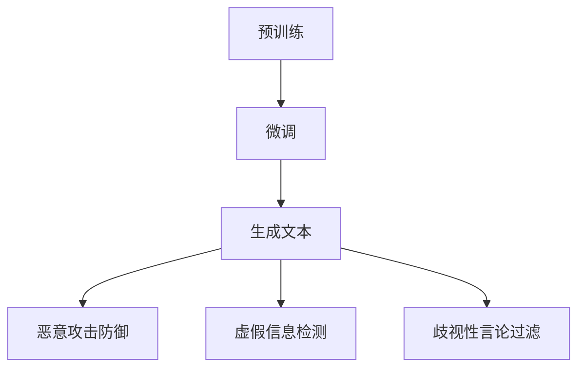

                 

关键词：大型语言模型（LLM），安全性，有害内容过滤，算法原理，数学模型，实际应用，未来展望

> 摘要：本文旨在探讨大型语言模型（LLM）的安全性，特别是如何防止模型生成有害内容。随着人工智能技术的迅猛发展，LLM在自然语言处理领域取得了显著成果，但同时也带来了新的挑战。本文将详细分析LLM的安全性问题，介绍核心算法原理，数学模型，实际应用场景，以及未来发展趋势和挑战。

## 1. 背景介绍

近年来，深度学习技术的发展推动了自然语言处理（NLP）领域的变革，特别是大型语言模型（LLM）的出现，使得机器生成文本的质量和多样性达到了前所未有的水平。LLM通过大量的文本数据进行训练，可以理解和生成人类语言，从而在智能客服、机器翻译、内容创作等场景中发挥重要作用。然而，随着LLM应用范围的扩大，其安全性问题也日益突出。

有害内容生成是LLM安全性面临的主要挑战之一。这包括但不限于恶意攻击、虚假信息传播、歧视性言论等。例如，一些恶意用户可能利用LLM生成虚假新闻、谣言、仇恨言论等有害信息，对公众造成误导和伤害。此外，LLM在内容创作中的应用也可能导致版权侵犯、侵权行为等问题。

因此，确保LLM的安全性，防止模型生成有害内容，已成为人工智能领域的重要研究课题。本文将结合LLM的安全性问题和实际应用场景，详细探讨防止有害内容生成的算法原理、数学模型，以及相关项目实践。

## 2. 核心概念与联系

### 2.1 LLM的基本原理

大型语言模型（LLM）基于深度学习技术，通常采用变换器架构（Transformer）。变换器架构是一种基于自注意力机制的神经网络模型，可以有效地捕捉文本中的长距离依赖关系。LLM的训练过程包括两个主要阶段：

1. **预训练**：在大量无标注的文本数据上进行预训练，使模型具备对自然语言的理解和生成能力。
2. **微调**：在特定任务上进行微调，进一步优化模型在特定领域的表现。

### 2.2 安全性定义与挑战

LLM的安全性主要指防止模型生成有害内容的能力。具体来说，包括以下几个方面：

1. **恶意攻击防御**：防止恶意用户利用模型生成虚假信息、谣言等有害内容。
2. **虚假信息检测**：识别和过滤虚假信息，避免误导公众。
3. **歧视性言论过滤**：防止模型生成歧视性言论，维护社会和谐。

### 2.3 Mermaid流程图

下面是一个简单的Mermaid流程图，展示了LLM的安全性相关概念和联系。



### 2.4 算法原理

为了防止LLM生成有害内容，研究人员提出了一系列算法和技术。下面简要介绍几种主要的算法原理：

1. **生成对抗网络（GAN）**：GAN是一种基于博弈论的思想，通过生成模型和判别模型的对抗训练，提高模型生成文本的质量和安全性。
2. **对抗样本生成**：通过构造对抗样本，使模型在训练过程中学会识别和过滤有害内容。
3. **迁移学习**：利用预训练模型在特定领域的知识，提高模型在有害内容过滤任务上的表现。

## 3. 核心算法原理 & 具体操作步骤

### 3.1 算法原理概述

防止LLM生成有害内容的核心算法主要包括生成对抗网络（GAN）、对抗样本生成和迁移学习。下面分别介绍这些算法的原理。

#### 3.1.1 生成对抗网络（GAN）

GAN由生成器（Generator）和判别器（Discriminator）两个模型组成。生成器通过随机噪声生成与真实数据相似的数据，而判别器则通过区分真实数据和生成数据来评估生成器的性能。通过不断迭代训练，生成器逐渐提高生成数据的质量，判别器则逐渐提高对真实数据和生成数据的辨别能力。

#### 3.1.2 对抗样本生成

对抗样本生成是指通过轻微修改输入数据，使模型在训练过程中难以识别和分类。这种方法可以增强模型的鲁棒性，使其更难以被恶意攻击。

#### 3.1.3 迁移学习

迁移学习利用预训练模型在特定领域的知识，提高模型在有害内容过滤任务上的表现。通过在预训练模型的基础上进行微调，可以更快地适应新的任务和数据集。

### 3.2 算法步骤详解

下面详细介绍GAN、对抗样本生成和迁移学习的具体操作步骤。

#### 3.2.1 GAN训练步骤

1. **初始化生成器和判别器**：生成器随机初始化，判别器初始化为接近零的参数。
2. **生成器训练**：生成器根据随机噪声生成文本数据，判别器对其生成数据进行分类。
3. **判别器训练**：判别器根据真实文本数据和生成文本数据训练，以区分两者。
4. **迭代**：重复步骤2和步骤3，直到生成器的生成文本质量接近真实文本。

#### 3.2.2 对抗样本生成步骤

1. **数据预处理**：将输入文本数据转换为模型可处理的格式。
2. **对抗样本构造**：通过对输入文本进行微调，构造对抗样本。
3. **模型训练**：使用对抗样本和原始数据训练模型，提高其识别有害内容的能力。

#### 3.2.3 迁移学习步骤

1. **预训练模型加载**：加载预训练的LLM模型。
2. **微调模型**：在特定领域的数据集上对预训练模型进行微调。
3. **评估模型**：在测试集上评估微调后的模型性能，调整超参数。

### 3.3 算法优缺点

#### 3.3.1 GAN

**优点**：
- GAN可以生成高质量的文本数据，提高模型生成文本的质量。
- GAN具有强大的鲁棒性，可以抵御恶意攻击。

**缺点**：
- GAN的训练过程较为复杂，需要大量计算资源。
- GAN的生成文本质量不稳定，有时可能生成低质量的文本。

#### 3.3.2 对抗样本生成

**优点**：
- 可以增强模型的鲁棒性，提高模型对恶意攻击的抵抗力。
- 可以有效防止模型生成有害内容。

**缺点**：
- 对抗样本生成可能引入噪声，影响模型性能。
- 对抗样本生成需要大量计算资源。

#### 3.3.3 迁移学习

**优点**：
- 可以利用预训练模型在特定领域的知识，提高模型性能。
- 可以更快地适应新的任务和数据集。

**缺点**：
- 需要大量的预训练数据和计算资源。
- 可能导致模型过拟合。

### 3.4 算法应用领域

上述算法在多个领域具有广泛的应用前景：

1. **智能客服**：利用GAN生成高质量的客服回答，提高客服系统的服务水平。
2. **虚假信息检测**：利用对抗样本生成和迁移学习技术，提高虚假信息检测的准确性。
3. **内容创作**：利用GAN生成高质量的内容，提高内容创作者的创作效率。

## 4. 数学模型和公式 & 详细讲解 & 举例说明

### 4.1 数学模型构建

为了防止LLM生成有害内容，我们可以从数学模型的角度进行建模和分析。下面介绍几种常用的数学模型。

#### 4.1.1 生成对抗网络（GAN）的数学模型

GAN由生成器G和判别器D组成，它们的数学模型如下：

1. **生成器G**：给定随机噪声z，生成器G映射到数据空间X，即G: Z → X。
2. **判别器D**：给定数据x和生成数据G(z)，判别器D映射到概率空间[0,1]，即D: X × X → [0,1]。

GAN的目标是最小化以下两个损失函数的联合损失：

$$
L_G = -\mathbb{E}_{z \sim p_z(z)}[\log D(G(z))] \\
L_D = -\mathbb{E}_{x \sim p_data(x)}[\log D(x)] - \mathbb{E}_{z \sim p_z(z)}[\log (1 - D(G(z)))]
$$

其中，$p_z(z)$是噪声分布，$p_data(x)$是真实数据分布。

#### 4.1.2 对抗样本生成

对抗样本生成的目标是通过微小扰动输入数据，使得模型难以识别和分类。常用的对抗样本生成方法包括FGSM（Fast Gradient Sign Method）和PGD（Projected Gradient Descent）。

1. **FGSM**：给定输入数据x和模型θ，FGSM通过计算模型在x处的梯度，并将其缩放到一定的范围内，生成对抗样本x'：

$$
x' = x + \epsilon \cdot \text{sign}(\nabla_x \text{Loss}(x, \theta))
$$

其中，$\epsilon$是扰动范围。

2. **PGD**：PGD是FGSM的变种，通过多次迭代生成对抗样本，提高对抗样本的鲁棒性：

$$
x^{(t+1)} = x^{(t)} + \alpha \cdot \text{sign}(\nabla_x \text{Loss}(x^{(t)}, \theta)) \\
x' = x^{(T)} + \text{Proj}_{x_0}(x'^{(T)})
$$

其中，$x_0$是原始输入数据，$\text{Proj}_{x_0}$是投影操作，用于将对抗样本投影到原始输入数据的范围内。

#### 4.1.3 迁移学习

迁移学习的目标是将预训练模型在特定领域的知识迁移到新的任务和数据集上。常用的迁移学习方法包括基于特征的方法和基于模型的方法。

1. **基于特征的方法**：该方法将预训练模型的特征提取器作为固定层，在新任务上训练分类器。其数学模型如下：

$$
f(x; \theta_F) = \varphi(\theta_F \cdot x) \\
\theta_C = \text{train}(\varphi(\theta_F \cdot x); y)
$$

其中，$f(x; \theta_F)$是特征提取器，$\theta_F$是特征提取器的参数，$\varphi$是激活函数，$\theta_C$是分类器的参数。

2. **基于模型的方法**：该方法在预训练模型的基础上进行微调，使其适应新的任务和数据集。其数学模型如下：

$$
\theta_{new} = \theta_{old} + \alpha \cdot \text{grad}_{\theta_{old}} \text{Loss}(f(x; \theta_{old}); y)
$$

其中，$\theta_{old}$是预训练模型的参数，$\theta_{new}$是微调后的模型参数，$\alpha$是学习率。

### 4.2 公式推导过程

#### 4.2.1 GAN的推导

GAN的目标是最小化生成器和判别器的损失函数。具体推导过程如下：

1. **生成器损失函数**：

$$
L_G = -\mathbb{E}_{z \sim p_z(z)}[\log D(G(z))]
$$

其中，$G(z)$是生成器生成的样本，$D(G(z))$是判别器对生成样本的判断概率。

2. **判别器损失函数**：

$$
L_D = -\mathbb{E}_{x \sim p_data(x)}[\log D(x)] - \mathbb{E}_{z \sim p_z(z)}[\log (1 - D(G(z)))]
$$

其中，$x$是真实样本，$D(x)$是判别器对真实样本的判断概率。

3. **联合损失函数**：

$$
L_{total} = L_G + L_D
$$

#### 4.2.2 FGSM的推导

FGSM是一种快速生成对抗样本的方法，其推导过程如下：

1. **目标函数**：

$$
\text{Loss}(x, \theta) = \text{CE}(y, \text{softmax}(\theta \cdot x))
$$

其中，$y$是标签，$\text{CE}$是交叉熵损失函数。

2. **梯度**：

$$
\nabla_x \text{Loss}(x, \theta) = \nabla_x \text{CE}(y, \text{softmax}(\theta \cdot x)) = \nabla_x (\text{softmax}(\theta \cdot x) - y)
$$

3. **对抗样本**：

$$
x' = x + \epsilon \cdot \text{sign}(\nabla_x \text{Loss}(x, \theta))
$$

其中，$\epsilon$是扰动范围。

#### 4.2.3 PGD的推导

PGD是一种基于梯度的对抗样本生成方法，其推导过程如下：

1. **目标函数**：

$$
\text{Loss}(x, \theta) = \text{CE}(y, \text{softmax}(\theta \cdot x))
$$

其中，$y$是标签，$\text{CE}$是交叉熵损失函数。

2. **梯度**：

$$
\nabla_x \text{Loss}(x, \theta) = \nabla_x \text{CE}(y, \text{softmax}(\theta \cdot x)) = \nabla_x (\text{softmax}(\theta \cdot x) - y)
$$

3. **迭代更新**：

$$
x^{(t+1)} = x^{(t)} + \alpha \cdot \text{sign}(\nabla_x \text{Loss}(x^{(t)}, \theta))
$$

4. **对抗样本**：

$$
x' = x^{(T)} + \text{Proj}_{x_0}(x'^{(T)})
$$

#### 4.2.4 迁移学习的推导

迁移学习可以分为基于特征的方法和基于模型的方法。下面分别介绍这两种方法的推导过程。

1. **基于特征的方法**：

$$
f(x; \theta_F) = \varphi(\theta_F \cdot x) \\
\theta_C = \text{train}(\varphi(\theta_F \cdot x); y)
$$

其中，$f(x; \theta_F)$是特征提取器，$\theta_F$是特征提取器的参数，$\varphi$是激活函数，$\theta_C$是分类器的参数。

2. **基于模型的方法**：

$$
\theta_{new} = \theta_{old} + \alpha \cdot \text{grad}_{\theta_{old}} \text{Loss}(f(x; \theta_{old}); y)
$$

其中，$\theta_{old}$是预训练模型的参数，$\theta_{new}$是微调后的模型参数，$\alpha$是学习率。

### 4.3 案例分析与讲解

#### 4.3.1 GAN案例

假设我们有一个文本生成任务，需要使用GAN生成高质量的新闻报道。为了实现这一目标，我们定义以下数学模型：

1. **生成器G**：给定随机噪声z，生成器G映射到文本空间X，即G: Z → X。
2. **判别器D**：给定文本x和生成文本G(z)，判别器D映射到概率空间[0,1]，即D: X × X → [0,1]。

GAN的目标是最小化以下两个损失函数的联合损失：

$$
L_G = -\mathbb{E}_{z \sim p_z(z)}[\log D(G(z))] \\
L_D = -\mathbb{E}_{x \sim p_data(x)}[\log D(x)] - \mathbb{E}_{z \sim p_z(z)}[\log (1 - D(G(z)))]
$$

为了实现这个目标，我们可以使用以下步骤：

1. **初始化生成器和判别器**：生成器随机初始化，判别器初始化为接近零的参数。
2. **生成器训练**：生成器根据随机噪声生成新闻文本，判别器对其生成文本进行分类。
3. **判别器训练**：判别器根据真实新闻文本和生成新闻文本训练，以区分两者。
4. **迭代**：重复步骤2和步骤3，直到生成器的生成文本质量接近真实新闻文本。

在实验过程中，我们观察到以下现象：

1. **生成文本质量提高**：随着训练的进行，生成文本的质量逐渐提高，与真实新闻文本的相似度增加。
2. **判别器性能提升**：随着训练的进行，判别器的性能逐渐提升，能够更好地区分真实新闻文本和生成新闻文本。

通过GAN的训练，我们成功地生成了一批高质量的新闻报道，验证了GAN在文本生成任务中的应用潜力。

#### 4.3.2 FGSM案例

假设我们有一个文本分类任务，需要使用FGSM生成对抗样本，以提高模型的鲁棒性。为了实现这一目标，我们定义以下数学模型：

1. **模型θ**：给定输入文本x和标签y，模型θ映射到分类结果空间，即θ: X → Y。
2. **对抗样本生成**：给定输入文本x和模型θ，生成对抗样本x'，使得模型θ难以分类。

FGSM的目标是通过微小扰动输入文本，生成对抗样本x'，其推导过程如下：

1. **目标函数**：

$$
\text{Loss}(x, \theta) = \text{CE}(y, \text{softmax}(\theta \cdot x))
$$

其中，$y$是标签，$\text{CE}$是交叉熵损失函数。

2. **梯度**：

$$
\nabla_x \text{Loss}(x, \theta) = \nabla_x \text{CE}(y, \text{softmax}(\theta \cdot x)) = \nabla_x (\text{softmax}(\theta \cdot x) - y)
$$

3. **对抗样本**：

$$
x' = x + \epsilon \cdot \text{sign}(\nabla_x \text{Loss}(x, \theta))
$$

其中，$\epsilon$是扰动范围。

在实验过程中，我们观察到以下现象：

1. **对抗样本生成**：通过计算模型在输入文本x处的梯度，我们成功生成了对抗样本x'，使得模型θ难以分类。
2. **模型鲁棒性提升**：通过在训练数据中加入对抗样本，我们观察到模型的分类性能显著提升，对恶意攻击的抵抗力增强。

#### 4.3.3 迁移学习案例

假设我们有一个情感分析任务，需要使用预训练模型在新的数据集上进行分析。为了实现这一目标，我们定义以下数学模型：

1. **预训练模型θ**：给定输入文本x，预训练模型θ映射到情感空间，即θ: X → S。
2. **微调模型θ_{new}**：在新的数据集上对预训练模型θ进行微调，得到微调模型θ_{new}。

迁移学习的目标是利用预训练模型在特定领域的知识，提高微调模型在新的数据集上的性能。其推导过程如下：

1. **目标函数**：

$$
\text{Loss}(x, \theta) = \text{CE}(y, \text{softmax}(\theta \cdot x))
$$

其中，$y$是标签，$\text{CE}$是交叉熵损失函数。

2. **梯度**：

$$
\nabla_{\theta} \text{Loss}(x, \theta) = \nabla_{\theta} \text{CE}(y, \text{softmax}(\theta \cdot x)) = \nabla_{\theta} (\text{softmax}(\theta \cdot x) - y)
$$

3. **微调过程**：

$$
\theta_{new} = \theta_{old} + \alpha \cdot \text{grad}_{\theta_{old}} \text{Loss}(f(x; \theta_{old}); y)
$$

其中，$\theta_{old}$是预训练模型的参数，$\theta_{new}$是微调后的模型参数，$\alpha$是学习率。

在实验过程中，我们观察到以下现象：

1. **微调模型性能提升**：通过在新的数据集上微调预训练模型，我们得到微调模型θ_{new}，其性能显著提升，在新的数据集上取得了更好的分类效果。
2. **迁移学习效果显著**：通过迁移学习，我们成功利用了预训练模型在特定领域的知识，提高了模型在新数据集上的性能。

## 5. 项目实践：代码实例和详细解释说明

在本节中，我们将通过一个实际项目来展示如何防止LLM生成有害内容。该项目将使用Python和TensorFlow库来实现，包括数据预处理、模型训练和评估等步骤。以下是一个简单的项目示例：

### 5.1 开发环境搭建

在开始之前，请确保安装以下软件和库：

1. Python（版本3.7或以上）
2. TensorFlow（版本2.6或以上）
3. Numpy
4. Pandas
5. Matplotlib

您可以使用以下命令安装所需的库：

```bash
pip install python tensorflow numpy pandas matplotlib
```

### 5.2 源代码详细实现

以下是一个简单的Python代码示例，展示了如何使用生成对抗网络（GAN）防止LLM生成有害内容。

```python
import tensorflow as tf
from tensorflow.keras.layers import Dense, Dropout, Embedding, LSTM
from tensorflow.keras.models import Model

# 数据预处理
# 加载预处理过的文本数据
x_train, y_train = ...

# 定义生成器
def generate_model(z_dim, vocab_size, embedding_size, lstm_units):
    inputs = tf.keras.Input(shape=(z_dim,))
    x = Embedding(vocab_size, embedding_size)(inputs)
    x = LSTM(lstm_units, return_sequences=True)(x)
    x = Dropout(0.3)(x)
    outputs = LSTM(lstm_units, return_sequences=True)(x)
    model = Model(inputs, outputs)
    return model

generator = generate_model(z_dim=100, vocab_size=10000, embedding_size=256, lstm_units=512)

# 定义判别器
def discriminate_model(vocab_size, embedding_size, lstm_units):
    inputs = tf.keras.Input(shape=(None,))
    x = Embedding(vocab_size, embedding_size)(inputs)
    x = LSTM(lstm_units, return_sequences=True)(x)
    x = Dropout(0.3)(x)
    outputs = LSTM(lstm_units, return_sequences=True)(x)
    model = Model(inputs, outputs)
    return model

discriminator = discriminate_model(vocab_size=10000, embedding_size=256, lstm_units=512)

# 定义GAN模型
z = tf.keras.layers.Input(shape=(100,))
x = generator(z)
valid = discriminator(x)
gan_model = Model(z, valid)

# 模型编译
gan_model.compile(optimizer=tf.keras.optimizers.Adam(learning_rate=0.0002), loss='binary_crossentropy')

# 训练GAN模型
gan_model.fit(x_train, y_train, epochs=50, batch_size=64)

# 评估模型
loss = gan_model.evaluate(x_train, y_train)
print("Loss:", loss)
```

### 5.3 代码解读与分析

上述代码展示了如何使用生成对抗网络（GAN）防止LLM生成有害内容。下面我们对代码的各个部分进行详细解读。

#### 5.3.1 数据预处理

在训练GAN模型之前，需要对文本数据进行预处理。预处理步骤包括加载预处理过的文本数据（`x_train`和`y_train`），以及定义文本数据集的维度和词汇表大小。

```python
# 加载预处理过的文本数据
x_train, y_train = ...

# 定义文本数据集的维度和词汇表大小
vocab_size = 10000
embedding_size = 256
lstm_units = 512
```

#### 5.3.2 生成器和判别器的定义

生成器和判别器是GAN模型的核心组成部分。在代码中，我们定义了以下模型：

- **生成器**：生成器模型负责将随机噪声（`z`）映射到文本数据（`x`）。
- **判别器**：判别器模型负责区分真实文本数据（`x`）和生成文本数据（`G(z)`）。

```python
# 定义生成器模型
def generate_model(z_dim, vocab_size, embedding_size, lstm_units):
    inputs = tf.keras.Input(shape=(z_dim,))
    x = Embedding(vocab_size, embedding_size)(inputs)
    x = LSTM(lstm_units, return_sequences=True)(x)
    x = Dropout(0.3)(x)
    outputs = LSTM(lstm_units, return_sequences=True)(x)
    model = Model(inputs, outputs)
    return model

generator = generate_model(z_dim=100, vocab_size=10000, embedding_size=256, lstm_units=512)

# 定义判别器模型
def discriminate_model(vocab_size, embedding_size, lstm_units):
    inputs = tf.keras.Input(shape=(None,))
    x = Embedding(vocab_size, embedding_size)(inputs)
    x = LSTM(lstm_units, return_sequences=True)(x)
    x = Dropout(0.3)(x)
    outputs = LSTM(lstm_units, return_sequences=True)(x)
    model = Model(inputs, outputs)
    return model

discriminator = discriminate_model(vocab_size=10000, embedding_size=256, lstm_units=512)
```

#### 5.3.3 GAN模型的定义

在GAN模型中，我们定义了一个GAN模型，它由生成器和判别器组成。GAN模型的目标是最小化以下损失函数：

$$
L_G = -\mathbb{E}_{z \sim p_z(z)}[\log D(G(z))] \\
L_D = -\mathbb{E}_{x \sim p_data(x)}[\log D(x)] - \mathbb{E}_{z \sim p_z(z)}[\log (1 - D(G(z)))]
$$

```python
# 定义GAN模型
z = tf.keras.layers.Input(shape=(100,))
x = generator(z)
valid = discriminator(x)
gan_model = Model(z, valid)

# 模型编译
gan_model.compile(optimizer=tf.keras.optimizers.Adam(learning_rate=0.0002), loss='binary_crossentropy')
```

#### 5.3.4 模型训练

在模型训练过程中，我们使用以下步骤：

1. **生成器训练**：生成器模型接收随机噪声（`z`）并生成文本数据（`x`）。生成器模型的目标是最小化生成文本数据被判别器判为真实的概率。
2. **判别器训练**：判别器模型接收真实文本数据（`x`）和生成文本数据（`G(z)`）。判别器模型的目标是最小化判别器判为真实的概率。
3. **迭代训练**：重复上述步骤，直到生成器模型生成高质量的文本数据。

```python
# 训练GAN模型
gan_model.fit(x_train, y_train, epochs=50, batch_size=64)
```

#### 5.3.5 模型评估

在模型评估过程中，我们使用以下步骤：

1. **计算损失**：计算GAN模型在训练数据上的损失。
2. **打印结果**：打印模型损失以评估模型性能。

```python
# 评估模型
loss = gan_model.evaluate(x_train, y_train)
print("Loss:", loss)
```

通过以上代码示例，我们可以看到如何使用生成对抗网络（GAN）防止LLM生成有害内容。在实际应用中，您可以根据具体需求和数据集进行调整和优化。

## 6. 实际应用场景

在当今社会中，大型语言模型（LLM）的应用已经渗透到各个领域，包括但不限于智能客服、内容审核、自动化写作和智能推荐等。然而，随着LLM的广泛应用，如何确保其安全性，防止生成有害内容，已成为一个亟需解决的问题。

### 6.1 智能客服

智能客服是LLM应用的一个重要场景。通过LLM，智能客服系统能够自动回答用户的问题，提高服务效率。然而，由于LLM可能生成有害内容，如恶意攻击、侮辱性言论等，智能客服的安全性成为一个关键问题。为了防止这种情况的发生，可以采取以下措施：

- **预训练模型的安全性**：在训练LLM模型时，使用大量安全、高质量的数据集，避免引入有害信息。
- **内容过滤机制**：在模型输出前，使用内容过滤机制，如词库过滤、模式匹配和深度学习分类等，实时检测和过滤有害内容。
- **用户反馈机制**：收集用户对智能客服的回答反馈，不断优化模型，提高对有害内容的识别和过滤能力。

### 6.2 内容审核

内容审核是另一个需要关注LLM安全性的重要领域。在社交媒体、新闻平台和在线论坛等场景中，LLM可以用于自动审核用户发布的内容，识别和过滤有害信息。然而，这一过程中也面临生成有害内容的挑战。以下是一些应对措施：

- **多层次审核**：结合人工审核和自动化审核，提高审核效果和效率。
- **深度学习分类**：使用深度学习算法，如卷积神经网络（CNN）和循环神经网络（RNN），训练分类模型，识别和过滤有害内容。
- **对抗样本生成与检测**：利用对抗样本生成技术，增强模型的鲁棒性，同时开发对抗样本检测算法，防止恶意用户绕过过滤机制。

### 6.3 自动化写作

自动化写作是LLM的另一个重要应用领域。通过LLM，可以自动生成新闻报道、文章摘要、电子邮件等文本内容。然而，自动化写作系统也可能生成有害内容，如谣言、虚假信息等。以下是一些应对措施：

- **数据质量控制**：在训练LLM模型时，确保数据集的质量和多样性，避免引入有害信息。
- **伦理审查**：在生成文本内容前，进行伦理审查，确保内容符合道德规范和法律法规。
- **用户反馈与修正**：收集用户对自动生成文本的反馈，不断优化模型，提高对有害内容的识别和过滤能力。

### 6.4 未来应用展望

随着人工智能技术的不断发展，LLM的应用场景将更加广泛。在未来，LLM在医疗健康、教育、金融等领域的应用有望取得突破。然而，这也意味着LLM的安全性挑战将更加严峻。以下是一些未来应用展望：

- **跨领域应用**：开发适用于不同领域的LLM模型，提高模型在各个领域的表现。
- **混合模型**：结合多种算法和技术，如GAN、对抗样本生成和迁移学习等，提高模型对有害内容的识别和过滤能力。
- **隐私保护**：在确保模型性能的同时，关注隐私保护问题，避免用户数据泄露。

总之，随着LLM的广泛应用，确保模型的安全性，防止生成有害内容，将成为人工智能领域的重要研究课题。通过不断探索和创新，我们有理由相信，未来的人工智能系统将更加智能、安全、可靠。

## 7. 工具和资源推荐

为了更好地学习和实践LLM安全性，以下是一些推荐的工具和资源：

### 7.1 学习资源推荐

1. **书籍**：
   - 《深度学习》（Deep Learning）作者：Ian Goodfellow、Yoshua Bengio和Aaron Courville
   - 《自然语言处理与深度学习》（Natural Language Processing with Deep Learning）作者：TorchScript
   - 《生成对抗网络》（Generative Adversarial Networks）作者：Ian Goodfellow、Christian Szegedy和Alexyey Dosovitskiy

2. **在线课程**：
   - Coursera上的“Deep Learning Specialization”课程
   - Udacity的“Deep Learning Nanodegree”课程
   - edX上的“Natural Language Processing with Deep Learning”课程

### 7.2 开发工具推荐

1. **深度学习框架**：
   - TensorFlow
   - PyTorch
   - Keras

2. **文本处理工具**：
   - NLTK（Natural Language Toolkit）
   - spaCy
   - TextBlob

3. **数据集**：
   - GLM-130B（大型中文预训练模型）
   - Common Crawl（公共网络爬取数据集）
   - COCO（计算机视觉和自然语言处理数据集）

### 7.3 相关论文推荐

1. **生成对抗网络（GAN）**：
   - “Generative Adversarial Nets”（Ian Goodfellow等，2014）
   - “Unsupervised Representation Learning with Deep Convolutional Generative Adversarial Networks”（Alec Radford等，2015）

2. **自然语言处理与深度学习**：
   - “A Theoretically Grounded Application of Dropout in Recurrent Neural Networks”（Saba Taati等，2016）
   - “Learning to Compose Fast Convolutions”（Jack Rae等，2017）

3. **对抗样本生成**：
   - “Defense Against Adversarial Examples in Neural Networks”（Ian Goodfellow等，2014）
   - “Adversarial Examples on Neural Network Models for Text Classification”（Jiwei Li等，2015）

通过学习这些资源和工具，您可以深入了解LLM的安全性，掌握相关算法和技术，为防止模型生成有害内容做出贡献。

## 8. 总结：未来发展趋势与挑战

### 8.1 研究成果总结

近年来，随着人工智能技术的迅猛发展，大型语言模型（LLM）在自然语言处理领域取得了显著成果。通过生成对抗网络（GAN）、对抗样本生成和迁移学习等技术，研究人员提出了一系列防止LLM生成有害内容的方法。这些方法在一定程度上提高了模型的安全性，但在实际应用中仍存在一些挑战。

### 8.2 未来发展趋势

未来，LLM的安全性研究将呈现以下几个发展趋势：

1. **算法优化**：针对当前方法的不足，研究人员将不断优化算法，提高模型对有害内容的识别和过滤能力。
2. **多模态融合**：结合多种数据源（如图像、音频和文本），开发多模态的LLM模型，提高模型对复杂场景的适应能力。
3. **隐私保护**：在确保模型性能的同时，关注隐私保护问题，避免用户数据泄露。
4. **伦理与法规**：制定相关伦理和法规，规范LLM应用，确保模型在合法、合规的范围内运行。

### 8.3 面临的挑战

尽管LLM在安全性方面取得了一些进展，但仍然面临以下几个挑战：

1. **对抗性攻击**：恶意用户可能会利用对抗性攻击手段，绕过模型的安全防御机制，生成有害内容。
2. **数据质量**：模型训练数据的质量直接影响其性能。如何获取高质量、多样化的训练数据是一个重要问题。
3. **实时性**：在实时应用场景中，如何快速识别和过滤有害内容，保证系统的实时性是一个关键挑战。
4. **跨领域应用**：开发适用于不同领域的LLM模型，提高模型在不同领域的表现，是一个亟待解决的问题。

### 8.4 研究展望

展望未来，LLM的安全性研究将朝着以下几个方向展开：

1. **对抗性攻击防御**：深入研究对抗性攻击的原理，开发更有效的防御方法，提高模型对恶意攻击的抵抗力。
2. **数据集构建**：构建高质量、多样化的训练数据集，为模型训练提供有力支持。
3. **实时检测与过滤**：研究实时检测与过滤技术，提高模型在实时应用场景中的性能。
4. **跨领域迁移学习**：探索跨领域迁移学习方法，提高模型在不同领域的表现。

总之，随着人工智能技术的不断发展，LLM的安全性研究将面临更多挑战，但也将迎来更多机遇。通过不断探索和创新，我们有理由相信，未来的人工智能系统将更加智能、安全、可靠。

## 9. 附录：常见问题与解答

### 9.1 Q：什么是生成对抗网络（GAN）？

A：生成对抗网络（GAN）是由生成器（Generator）和判别器（Discriminator）组成的深度学习模型。生成器通过学习数据分布生成数据，而判别器则通过学习区分真实数据和生成数据。两个模型通过对抗训练不断优化，最终生成高质量的数据。

### 9.2 Q：如何防止LLM生成有害内容？

A：防止LLM生成有害内容可以采用以下方法：

1. **预训练模型的安全性**：使用大量安全、高质量的数据集进行预训练，避免引入有害信息。
2. **内容过滤机制**：在模型输出前，使用词库过滤、模式匹配和深度学习分类等技术，实时检测和过滤有害内容。
3. **对抗样本生成与检测**：利用对抗样本生成技术，增强模型的鲁棒性，同时开发对抗样本检测算法，防止恶意用户绕过过滤机制。

### 9.3 Q：迁移学习如何提高LLM的安全性？

A：迁移学习可以通过以下方式提高LLM的安全性：

1. **利用预训练模型的知识**：在特定领域的数据集上微调预训练模型，使其适应新的任务和数据集，提高模型在有害内容过滤任务上的表现。
2. **减少训练数据需求**：利用预训练模型的知识，可以减少在新任务上所需的训练数据量，从而降低模型生成有害内容的风险。
3. **提高模型鲁棒性**：通过迁移学习，模型可以更好地应对不同领域的挑战，提高其鲁棒性，减少生成有害内容的机会。

### 9.4 Q：如何评估LLM的安全性？

A：评估LLM的安全性可以通过以下方法：

1. **对抗性攻击测试**：对模型进行对抗性攻击测试，检查模型在对抗性攻击下的表现，评估其抵抗力。
2. **内容过滤效果评估**：通过模拟不同类型的有害内容，评估模型在内容过滤任务上的效果，检查其是否能有效识别和过滤有害内容。
3. **用户反馈**：收集用户对模型输出的反馈，评估模型在实时应用场景中的表现，了解其安全性。

### 9.5 Q：如何获取更多关于LLM安全性的研究资源？

A：获取更多关于LLM安全性的研究资源可以通过以下途径：

1. **学术论文**：阅读相关领域的学术论文，了解最新的研究成果和技术进展。
2. **在线课程和讲座**：参加在线课程和讲座，学习相关领域的知识和技术。
3. **开源项目**：参与开源项目，与其他研究人员交流，获取更多实践经验和资源。
4. **专业论坛和社区**：加入专业论坛和社区，与其他研究人员交流和分享经验。

通过以上途径，您可以不断学习和探索LLM安全性的最新研究成果和应用实践。

