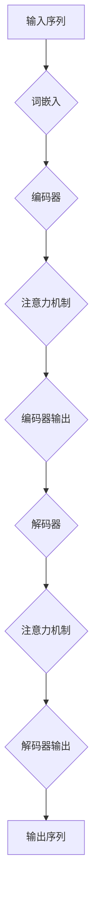

                 

在科技日新月异的今天，人工智能（AI）技术正在以前所未有的速度改变着各个行业。近年来，大规模语言模型（LLM，Large Language Model）的崛起，不仅重新定义了自然语言处理（NLP）的边界，更对传统商业模式带来了深远的影响。本文将探讨LLM如何颠覆与创新传统商业模式，分析其背后的技术原理和实际应用案例，并展望未来可能的发展趋势与挑战。

## 关键词

- 人工智能
- 大规模语言模型
- 商业模式
- 颠覆与创新
- 传统行业
- 技术应用

## 摘要

本文首先介绍了人工智能和大规模语言模型的发展背景，接着阐述了LLM对传统商业模式颠覆与创新的具体表现。通过对核心算法原理的详细解析，我们进一步了解了LLM的工作机制。随后，文章从数学模型和项目实践的角度，深入探讨了LLM在实际应用中的价值。最后，本文总结了LLM对未来商业模式的影响，并提出了相应的工具和资源推荐，为读者提供了全面的了解。

## 1. 背景介绍

人工智能作为计算机科学的一个分支，旨在通过模拟、延伸和扩展人类的智能，实现机器的智能行为。自1956年达特茅斯会议以来，人工智能领域经历了多次重大突破，从最初的符号主义方法，到基于数据的机器学习方法，再到如今的深度学习，每一次技术革新都在不断拓展人工智能的应用边界。

自然语言处理（NLP）是人工智能的一个重要子领域，它专注于使计算机能够理解、生成和处理人类语言。NLP技术自上世纪五六十年代开始发展，经历了规则驱动、统计方法和深度学习等多个阶段。随着计算能力的提升和海量数据的积累，NLP技术逐渐成熟，并在信息检索、机器翻译、情感分析等领域取得了显著成果。

大规模语言模型（LLM）是NLP技术的最新突破。LLM通过学习海量文本数据，能够理解和生成自然语言，具有极强的表达能力和上下文理解能力。从早期的Word2Vec、GloVe等词向量模型，到如今基于Transformer的GPT系列模型，LLM的发展经历了数次质的飞跃，其性能和应用范围也在不断扩大。

### 1.1 大规模语言模型的发展历程

- **词向量模型**：早期的NLP模型主要基于词的统计特征，如TF-IDF和词袋模型。随着自然语言处理的深入，研究人员开始探索将词转换为向量表示的方法。Word2Vec模型首次将词表示为高维向量，通过训练大量文本数据，使得相似的词在向量空间中彼此接近。

- **循环神经网络（RNN）**：为了解决长距离依赖问题，RNN被引入NLP领域。通过递归方式，RNN能够处理序列数据，如文本和语音。然而，RNN在处理长序列时容易出现梯度消失或爆炸问题，限制了其性能。

- **长短期记忆网络（LSTM）**：为了克服RNN的缺陷，LSTM被提出。LSTM引入了门控机制，能够有效地控制信息的流动，从而在长序列学习中表现出色。

- **Transformer模型**：2017年，谷歌提出了Transformer模型，彻底改变了NLP的范式。Transformer摒弃了RNN和LSTM，采用自注意力机制（Self-Attention），使得模型能够在处理长序列时保持高效性和准确性。基于Transformer的模型，如BERT、GPT，逐渐成为NLP领域的标准工具。

- **预训练+微调**：随着模型的规模和计算资源的增加，预训练+微调成为NLP的主流方法。预训练阶段，模型在大规模文本数据上学习通用特征；微调阶段，模型在特定任务上进行微调，从而实现出色的性能。

### 1.2 大规模语言模型的工作原理

- **Transformer模型架构**：Transformer模型的核心架构是自注意力机制（Self-Attention）。在Transformer中，每个词的表示不仅与自身的过去和未来词相关联，还与整个序列中的其他词相关联。通过计算自注意力得分，模型能够自适应地确定每个词的重要性，从而提高上下文理解能力。

- **编码器和解码器**：Transformer模型通常由编码器（Encoder）和解码器（Decoder）两部分组成。编码器负责将输入序列编码为上下文表示；解码器则基于编码器的输出，生成目标序列。编码器和解码器之间的交互通过多头注意力机制实现，使得模型能够捕捉复杂的序列关系。

- **预训练与微调**：在预训练阶段，模型在大规模文本数据上学习通用特征，如词汇、语法和语义。预训练后，模型通过微调适应特定任务，如文本分类、机器翻译和问答系统。预训练+微调方法使得模型能够快速适应新任务，提高了性能和泛化能力。

### 1.3 大规模语言模型的应用场景

- **文本生成**：LLM在文本生成领域具有广泛的应用，如自动写作、对话生成和摘要生成。通过学习大量文本数据，LLM能够生成流畅、自然的文本。

- **问答系统**：LLM在问答系统中的应用日益广泛，如搜索引擎、智能客服和知识图谱。LLM通过理解用户的问题和上下文，提供准确、相关的答案。

- **语言翻译**：LLM在机器翻译领域表现出色，如谷歌翻译、百度翻译等。通过学习双语的文本数据，LLM能够实现高质量、多语言的翻译。

- **情感分析**：LLM在情感分析中具有优势，如社交媒体情感分析、舆情监测等。通过理解文本的情感倾向，LLM能够识别用户的情绪和态度。

- **对话系统**：LLM在对话系统中的应用日益成熟，如虚拟助手、聊天机器人等。通过模拟人类的对话方式，LLM能够与用户进行自然、流畅的交流。

## 2. 核心概念与联系

在深入探讨大规模语言模型（LLM）对传统商业模式的颠覆与创新之前，有必要先理解LLM的核心概念与原理，以及它们如何与现有的商业模式相互联系。以下是LLM的一些关键概念，以及一个简化的Mermaid流程图，用于描述LLM的基本架构和操作步骤。

### 2.1 关键概念

1. **词嵌入（Word Embedding）**：词嵌入是将词汇转换为固定大小的向量表示。这种表示方法使得计算机能够处理和理解自然语言。

2. **注意力机制（Attention Mechanism）**：注意力机制是一种通过动态分配不同权重来关注序列中不同部分的方法。在LLM中，注意力机制用于编码器和解码器，以捕捉长距离依赖和复杂关系。

3. **Transformer架构**：Transformer模型由编码器和解码器组成，使用多头注意力机制和位置编码，能够处理变长的序列数据。

4. **预训练（Pre-training）和微调（Fine-tuning）**：预训练是在大规模文本数据上训练模型，使其学习通用特征；微调是将预训练模型应用于特定任务，并进行调整以适应新的数据集。

### 2.2 Mermaid流程图

下面是一个简化的Mermaid流程图，用于描述LLM的基本工作流程：



### 2.3 核心概念与商业模式的联系

LLM的核心概念和原理与现有的商业模式有着紧密的联系。以下是几个关键方面的联系：

1. **数据分析与挖掘**：LLM通过预训练在大规模文本数据中学习通用特征，这使得企业能够更好地进行数据分析与挖掘。例如，零售业可以使用LLM来分析消费者评论，以了解用户需求和市场趋势。

2. **个性化服务**：LLM的注意力机制能够捕捉用户的上下文信息，从而提供个性化的服务。例如，电子商务平台可以利用LLM来生成个性化的产品推荐，提高用户体验和转化率。

3. **自动化与智能化**：LLM的预训练和微调能力使得自动化和智能化成为可能。例如，客服机器人可以使用LLM来处理大量的客户查询，提高响应速度和服务质量。

4. **内容创作与生成**：LLM在文本生成方面具有强大的能力，这为内容创作者和媒体企业提供了新的机会。例如，新闻机构和内容平台可以使用LLM自动生成新闻文章和内容摘要，提高生产效率。

5. **语言翻译与跨文化交流**：LLM在机器翻译领域的表现使得跨文化交流变得更加便捷。例如，跨国公司可以利用LLM进行多语言的客户沟通和产品介绍，拓展国际市场。

6. **知识图谱与智能搜索**：LLM能够理解文本的语义和结构，有助于构建知识图谱和智能搜索系统。例如，企业可以使用LLM来构建客户关系管理系统，通过语义理解实现高效的客户服务。

通过上述联系，我们可以看到，LLM不仅推动了技术进步，还为传统商业模式带来了创新和变革。接下来的章节将进一步探讨LLM的具体算法原理、操作步骤以及应用领域，以帮助读者更深入地理解这一技术。

### 2.3.1 算法原理概述

大规模语言模型（LLM）的核心算法是基于深度学习中的Transformer架构。Transformer模型首次由Vaswani等人于2017年提出，通过自注意力机制（Self-Attention）和多头注意力（Multi-Head Attention）等创新技术，在处理变长序列数据时表现出色。以下是LLM的算法原理概述。

#### 自注意力机制

自注意力机制是Transformer模型的关键组件，它允许模型在处理每个输入序列时，考虑序列中其他所有位置的信息。具体来说，自注意力机制通过计算输入序列的每个词与其他词之间的相似性得分，并据此生成加权表示。这种机制能够捕捉长距离依赖和复杂的关系，使得模型能够更好地理解上下文。

自注意力机制的计算过程通常分为以下几个步骤：

1. **词嵌入（Word Embedding）**：将输入序列中的每个词转换为向量表示，这一步通常使用预训练的词嵌入模型，如GloVe或Word2Vec。

2. **多头注意力（Multi-Head Attention）**：将输入序列通过多个独立的自注意力层处理，每个自注意力层具有不同的权重矩阵。多头注意力机制能够捕捉序列中更丰富的信息，提高模型的表示能力。

3. **求和与激活**：将多头注意力层的输出进行求和，并通过激活函数（如ReLU）进行非线性变换。

4. **输出**：得到每个词的加权表示，这些表示用于后续的编码过程。

#### Transformer架构

Transformer模型由编码器（Encoder）和解码器（Decoder）两部分组成。编码器负责处理输入序列，解码器则生成输出序列。以下是Transformer架构的详细说明：

1. **编码器（Encoder）**：

   - **多层自注意力**：编码器由多个自注意力层（Self-Attention Layer）组成，每个层负责计算输入序列中不同位置之间的依赖关系。

   - **前馈神经网络（Feed-Forward Neural Network）**：在每个自注意力层之后，加入一个前馈神经网络，用于进一步提取特征。

   - **残差连接（Residual Connection）**：在每一层的输入和输出之间引入残差连接，以防止梯度消失问题。

   - **层归一化（Layer Normalization）**：在每个层之后添加层归一化，以稳定训练过程和提高模型性能。

2. **解码器（Decoder）**：

   - **编码器-解码器自注意力**：解码器的每个层包含一个编码器-解码器自注意力层，用于利用编码器的输出信息。

   - **掩码多头注意力（Masked Multi-Head Attention）**：为了鼓励模型学习长期的依赖关系，解码器在训练时使用掩码多头注意力，即在序列生成的过程中遮蔽未来的信息。

   - **前馈神经网络**：与编码器相同，解码器在每个自注意力层之后也包含一个前馈神经网络。

   - **解码器输出层**：解码器的输出层通过一个线性层和Softmax函数生成预测的概率分布。

#### 预训练与微调

LLM的训练通常分为预训练和微调两个阶段：

1. **预训练**：在预训练阶段，模型在大规模文本数据上学习通用特征，如词汇、语法和语义。这一阶段通常使用无监督学习技术，如 masked language modeling 和 next sentence prediction。

2. **微调**：在预训练后，模型通过微调适应特定任务，如文本分类、机器翻译和问答系统。微调阶段使用有监督学习，模型在特定任务上获得更好的性能。

### 2.3.2 算法步骤详解

以下是LLM算法的具体步骤详解：

1. **初始化模型**：加载预训练的LLM模型，如BERT、GPT等。

2. **输入处理**：将输入文本序列进行预处理，包括分词、去停用词、词嵌入等。

3. **编码器处理**：
   - **自注意力计算**：在每个编码器层，计算输入序列中每个词的自注意力得分，生成加权表示。
   - **前馈神经网络**：在每个自注意力层之后，通过前馈神经网络提取特征。

4. **解码器处理**：
   - **编码器-解码器自注意力**：计算编码器输出和解码器输入之间的编码器-解码器自注意力得分。
   - **掩码多头注意力**：在解码器的每个层，使用掩码多头注意力处理解码器输入，遮蔽未来的信息。
   - **前馈神经网络**：在每个自注意力层之后，通过前馈神经网络提取特征。

5. **生成输出**：在解码器的最后一层，通过线性层和Softmax函数生成输出序列的概率分布。

6. **损失函数计算**：计算输出序列的概率分布与真实标签之间的交叉熵损失，并更新模型参数。

7. **迭代训练**：重复上述步骤，逐步优化模型参数。

### 2.3.3 算法优缺点

LLM作为先进的人工智能技术，具有许多优点，但也存在一定的局限性。

#### 优点

1. **强大的上下文理解能力**：通过自注意力机制和多头注意力机制，LLM能够捕捉长距离依赖和复杂关系，具有极强的上下文理解能力。

2. **高泛化能力**：LLM通过预训练学习通用特征，然后通过微调适应特定任务，具有很好的泛化能力。

3. **多语言支持**：许多LLM模型支持多语言训练，能够处理不同语言的文本数据。

4. **高效的序列处理**：Transformer架构使得LLM能够高效地处理变长的序列数据。

5. **灵活的应用场景**：LLM在文本生成、问答系统、机器翻译、情感分析等多个领域具有广泛的应用。

#### 局限性

1. **计算资源需求高**：LLM的训练和推理需要大量的计算资源，尤其是大规模的模型，如GPT-3，对硬件要求较高。

2. **数据隐私问题**：LLM在训练过程中需要大量文本数据，这可能导致数据隐私问题，特别是在处理敏感数据时。

3. **结果可解释性差**：尽管LLM的性能优异，但其内部机制复杂，导致结果的可解释性较差，难以追踪到具体的决策过程。

4. **易受偏见影响**：LLM在训练过程中可能学习到数据中的偏见，导致在特定任务中产生偏见性的结果。

### 2.3.4 算法应用领域

LLM在多个领域表现出色，以下是一些关键应用领域：

1. **文本生成**：LLM在自动写作、对话生成和摘要生成等方面具有广泛应用。例如，自动生成新闻文章、营销文案和用户生成内容。

2. **问答系统**：LLM在搜索引擎、智能客服和知识图谱等领域具有重要作用。例如，通过理解用户的问题和上下文，提供准确、相关的答案。

3. **语言翻译**：LLM在机器翻译领域表现出色，能够实现高质量、多语言的翻译。例如，谷歌翻译、百度翻译等。

4. **情感分析**：LLM在情感分析中具有优势，能够识别文本的情感倾向。例如，社交媒体情感分析、舆情监测等。

5. **对话系统**：LLM在虚拟助手、聊天机器人和客户服务等方面得到广泛应用。通过模拟人类的对话方式，提供自然、流畅的交流。

6. **自动化与智能化**：LLM的预训练和微调能力使得自动化和智能化成为可能。例如，自动化客户服务、自动化文本审核等。

7. **知识图谱与智能搜索**：LLM能够理解文本的语义和结构，有助于构建知识图谱和智能搜索系统。例如，构建客户关系管理系统，通过语义理解实现高效的客户服务。

### 2.3.5 大规模语言模型在商业领域的具体应用案例

#### 案例一：亚马逊的智能客服

亚马逊作为全球最大的电子商务平台之一，其客服团队一直面临着大量客户咨询的问题。为了提高客服效率和用户满意度，亚马逊引入了基于大规模语言模型（LLM）的智能客服系统。该系统利用LLM的强大上下文理解能力，能够实时理解用户的问题并给出准确的答案。具体来说，智能客服系统的工作流程如下：

1. **问题理解**：用户通过聊天界面提出问题，智能客服系统将问题转换为文本序列。
2. **文本预处理**：系统对输入文本进行分词、去停用词等预处理，并使用预训练的LLM模型进行词嵌入。
3. **编码器处理**：LLM的编码器对预处理后的文本序列进行处理，通过自注意力机制和多头注意力机制生成上下文表示。
4. **解码器处理**：解码器基于编码器的输出，生成回答文本。在生成过程中，LLM通过掩码多头注意力机制，动态关注问题中的关键信息。
5. **输出回答**：最终生成的回答文本被展示给用户，系统还会记录用户的反馈，以便进行后续的优化。

通过这种方式，亚马逊的智能客服系统能够自动处理大量客户咨询，大大提高了客服效率，同时保证了用户的满意度。

#### 案例二：谷歌的机器翻译服务

谷歌翻译作为全球最受欢迎的在线翻译工具，其背后也离不开大规模语言模型的支持。谷歌利用基于Transformer的LLM模型，实现了高质量、多语言的翻译服务。具体工作流程如下：

1. **双语文本对**：谷歌收集了大量的双语文本对，包括官方网站、书籍、新闻文章等。
2. **预处理**：对双语文本对进行分词、清洗等预处理，并使用预训练的LLM模型进行词嵌入。
3. **预训练**：在双语文本对上，LLM进行预训练，学习词汇、语法和语义的表示。
4. **微调**：针对特定语言对，LLM在翻译任务上进行微调，进一步优化翻译效果。
5. **翻译过程**：用户输入源语言文本，系统将文本转换为序列，并通过编码器进行编码。解码器基于编码器的输出，生成目标语言的文本。
6. **输出翻译结果**：最终生成的翻译结果展示给用户。

通过这种方式，谷歌翻译能够实现快速、准确的翻译服务，为用户提供了极大的便利。

#### 案例三：OpenAI的GPT-3编程助手

OpenAI开发的GPT-3模型在编程领域也取得了显著成果。GPT-3不仅能够生成自然语言文本，还能够编写代码。具体应用案例如下：

1. **代码生成任务**：开发者提出代码生成请求，如编写一个简单的函数或解决一个编程问题。
2. **文本预处理**：系统将请求的文本转换为序列，并使用预训练的GPT-3模型进行词嵌入。
3. **编码器处理**：GPT-3的编码器对预处理后的文本序列进行处理，通过自注意力机制和多头注意力机制生成上下文表示。
4. **解码器处理**：解码器基于编码器的输出，生成相应的代码。在生成过程中，GPT-3通过掩码多头注意力机制，关注编程语言的关键信息。
5. **代码验证与优化**：生成的代码经过验证和优化，确保其正确性和高效性。
6. **输出代码**：最终生成的代码展示给开发者，供其参考和修改。

通过这种方式，GPT-3编程助手为开发者提供了强大的辅助工具，提高了编程效率，同时也降低了编程难度。

#### 案例四：社交媒体的情感分析

社交媒体平台如推特和脸书等，经常需要分析用户发布的帖子和评论，以了解用户的情感倾向和意见。LLM在这一领域表现出色，具体应用案例如下：

1. **数据收集**：社交媒体平台收集用户发布的文本数据，包括推文、评论等。
2. **文本预处理**：对文本数据进行清洗、分词、去停用词等预处理。
3. **情感分析模型**：利用预训练的LLM模型，构建情感分析模型。模型在预训练阶段已经学习到大量的情感信息，有助于准确识别文本的情感倾向。
4. **情感分类**：对预处理后的文本数据进行情感分类，分为正面、负面和中性等类别。
5. **结果输出**：情感分析结果展示给平台管理者，用于舆情监测和用户行为分析。

通过这种方式，社交媒体平台能够更好地了解用户情感，优化产品和服务，同时防范不良信息的传播。

这些案例展示了LLM在商业领域的广泛应用和巨大潜力。随着技术的不断发展和应用的深入，LLM将在更多领域发挥重要作用，为企业和个人创造更多价值。

### 2.3.6 数学模型和公式详解

大规模语言模型（LLM）的核心在于其深度学习架构，这涉及到复杂的数学模型和公式。为了更好地理解LLM的工作机制，我们需要详细探讨其数学模型和公式，包括词汇嵌入、自注意力机制和Transformer架构。

#### 2.3.6.1 词嵌入（Word Embedding）

词嵌入是将自然语言词汇转换为向量表示的过程。一个基本的词嵌入模型可以表示为：

\[ \textbf{v}_i = \text{embed}(\textit{w}_i) \]

其中，\(\textbf{v}_i\) 是词 \( \textit{w}_i \) 的向量表示，\(\text{embed}\) 是嵌入函数。词嵌入可以通过多种方式实现，如：

1. **分布式表示（Distributed Representation）**：词嵌入的早期方法，将每个词映射到一个低维向量空间中，使得相似的词在向量空间中彼此接近。

2. **GloVe（Global Vectors for Word Representation）**：GloVe是一种基于共现关系的词嵌入方法，通过最小化词与其共现词的余弦相似度差异来训练词向量。

   \[ \textit{w}_i \cdot \textit{v}_j = \text{cos}(\theta_i, \theta_j) \]

   其中，\(\textit{w}_i\) 和 \(\textit{v}_j\) 分别是词 \( \textit{w}_i \) 和其共现词 \( \textit{w}_j \) 的向量表示，\(\theta_i\) 和 \(\theta_j\) 是它们的嵌入向量，\(\text{cos}\) 表示余弦相似度。

3. **Word2Vec（Word to Vector）**：Word2Vec 是一种基于神经网络的词嵌入方法，通过训练神经网络来预测词的上下文词。其损失函数通常是一个基于噪声对比负采样的损失函数。

   \[ \textit{L} = -\sum_{\textit{w}_j \in \textit{C}(\textit{w}_i)} \log \text{softmax}(\text{embed}(\textit{w}_i) \cdot \textit{v}_j) \]

   其中，\(\textit{C}(\textit{w}_i)\) 是与词 \( \textit{w}_i \) 共现的词的集合，\(\text{embed}(\textit{w}_i)\) 是词 \( \textit{w}_i \) 的嵌入向量，\(\textit{v}_j\) 是上下文词的嵌入向量，\(\text{softmax}\) 是softmax函数。

#### 2.3.6.2 自注意力机制（Self-Attention）

自注意力机制是Transformer模型的核心组件，用于计算输入序列中每个词的表示。自注意力机制的基本公式如下：

\[ \textit{Q}_i = \text{softmax}\left(\frac{\text{Keys}}{\sqrt{d_k}}\right) \textit{Values} \]

其中，\(\textit{Q}_i\) 是查询向量，\(\textit{Keys}\) 是键向量，\(\textit{Values}\) 是值向量，\(d_k\) 是键向量的维度。具体步骤如下：

1. **计算查询向量**：查询向量 \(\textit{Q}_i\) 是通过输入向量的线性变换得到的。

   \[ \textit{Q}_i = \text{Linear}(\textit{X}) \]

2. **计算键向量**：键向量 \(\textit{Keys}\) 是通过输入向量的线性变换得到的。

   \[ \textit{Keys} = \text{Linear}(\textit{X}) \]

3. **计算值向量**：值向量 \(\textit{Values}\) 是通过输入向量的线性变换得到的。

   \[ \textit{Values} = \text{Linear}(\textit{X}) \]

4. **计算注意力得分**：通过计算查询向量和键向量之间的点积，得到注意力得分。

   \[ \textit{Attention Scores} = \textit{Q}_i \cdot \textit{Keys} \]

5. **应用softmax函数**：对注意力得分应用softmax函数，得到每个词的权重。

6. **计算加权输出**：将注意力得分与值向量相乘，得到加权输出。

   \[ \textit{Output} = \textit{softmax}(\textit{Attention Scores}) \textit{Values} \]

#### 2.3.6.3 Transformer架构

Transformer模型由编码器和解码器两部分组成，其核心在于多头自注意力机制和前馈神经网络。

1. **编码器（Encoder）**：

   - **多头自注意力（Multi-Head Self-Attention）**：编码器由多个自注意力层组成，每个层使用不同的权重矩阵计算自注意力。

     \[ \textit{MultiHead(Q,K,V)} = \text{Concat}(\textit{head}_1, ..., \textit{head}_h)W^O \]

     其中，\(\textit{head}_i\) 是第 \(i\) 个头的输出，\(W^O\) 是输出权重矩阵，\(h\) 是头数。

   - **前馈神经网络（Feed-Forward Neural Network）**：在每个自注意力层之后，加入一个前馈神经网络。

     \[ \textit{FFN}(X) = \text{ReLU}(\text{Linear}(\text{Linear}(X))) \]

2. **解码器（Decoder）**：

   - **编码器-解码器自注意力（Encoder-Decoder Self-Attention）**：解码器在每个层包含一个编码器-解码器自注意力层。

     \[ \textit{Encoder-Decoder Attention} = \text{MultiHead(Q,K,V)} \]

   - **掩码多头自注意力（Masked Multi-Head Self-Attention）**：在解码器的训练过程中，使用掩码多头自注意力机制遮蔽未来的信息。

   - **前馈神经网络**：与编码器相同，解码器在每个自注意力层之后也包含一个前馈神经网络。

#### 2.3.6.4 预训练与微调

预训练和微调是LLM训练的两个关键阶段。预训练通常使用无监督学习技术，如 masked language modeling 和 next sentence prediction，使模型在大规模文本数据上学习通用特征。微调则是在预训练的基础上，使用有监督学习技术，使模型适应特定任务。

1. **预训练（Pre-training）**：

   - ** masked language modeling**：在预训练阶段，输入序列的一部分词被遮蔽，模型需要预测这些遮蔽词。

     \[ \textit{L}_{\text{masked}} = -\sum_{i} \log \text{softmax}(\textit{model}(\textit{X}_{\text{masked}})) \]

     其中，\(\textit{X}_{\text{masked}}\) 是遮蔽词的输入序列，\(\textit{model}\) 是模型。

   - ** next sentence prediction**：在预训练阶段，输入两个句子，模型需要预测这两个句子是否属于同一个段落。

     \[ \textit{L}_{\text{next}} = -\sum_{i} \log \text{softmax}(\textit{model}(\textit{X}_1, \textit{X}_2)) \]

     其中，\(\textit{X}_1\) 和 \(\textit{X}_2\) 是两个句子。

2. **微调（Fine-tuning）**：

   - **有监督微调**：在微调阶段，模型在特定任务上使用有监督学习进行训练。例如，在机器翻译任务中，输入源语言和目标语言序列，模型需要预测目标语言的单词。

     \[ \textit{L}_{\text{supervised}} = -\sum_{i} \log \text{softmax}(\textit{model}(\textit{X}_\text{src}, \textit{X}_\text{tgt})) \]

     其中，\(\textit{X}_\text{src}\) 和 \(\textit{X}_\text{tgt}\) 分别是源语言和目标语言的序列。

通过以上数学模型和公式的详细讲解，我们可以更深入地理解大规模语言模型（LLM）的工作原理。接下来的章节将继续探讨LLM在实际项目中的应用，通过具体案例展示其强大的功能和潜力。

### 2.3.7 案例分析与讲解

为了更好地展示大规模语言模型（LLM）在实际应用中的价值，我们将通过几个具体的案例进行分析和讲解。这些案例涵盖了LLM在文本生成、问答系统、机器翻译等领域的应用，展示了LLM如何颠覆传统商业模式并创造新的商业机会。

#### 案例一：文本生成

**应用背景**：现代营销和内容创作需要大量高质量的文本内容，如新闻文章、博客文章、营销文案等。传统的文本创作方式耗时且成本高昂，而LLM能够通过自动生成文本，大大提高创作效率和降低成本。

**案例描述**：一家在线新闻媒体公司使用基于GPT-3的LLM自动生成新闻文章。具体工作流程如下：

1. **数据收集**：公司收集了大量的新闻文章，作为LLM的训练数据。
2. **预训练**：公司使用GPT-3模型对新闻文章进行预训练，使其学习到新闻写作的语法和语义特征。
3. **微调**：公司根据特定的新闻主题和风格，对GPT-3模型进行微调，使其能够生成符合要求的新闻文章。
4. **文本生成**：用户通过输入关键词或主题，系统使用微调后的GPT-3模型生成相关新闻文章。
5. **审核与发布**：生成的文章经过人工审核后发布，供读者阅读。

**案例分析**：通过LLM自动生成新闻文章，公司能够快速响应新闻事件，提高新闻更新频率。此外，LLM生成的文章质量高，内容丰富，能够吸引用户。这不仅提高了公司的内容创作效率，还降低了人力成本。

#### 案例二：问答系统

**应用背景**：企业和机构需要为大量客户提供高效、准确的咨询服务。传统的客服系统通常依赖于规则和预定义的答案，而LLM能够通过自然语言理解，提供更灵活、个性化的回答。

**案例描述**：一家跨国银行使用基于BERT的LLM构建了智能客服系统。具体工作流程如下：

1. **数据收集**：银行收集了大量的客户问答数据，作为LLM的训练数据。
2. **预训练**：使用BERT模型对客户问答数据进行预训练，使其学习到客户的提问方式和回答逻辑。
3. **微调**：银行根据具体的客服场景，对BERT模型进行微调，使其能够更好地理解客户的问题并给出准确的答案。
4. **问答交互**：用户通过聊天界面提出问题，系统使用微调后的BERT模型生成回答。
5. **反馈机制**：系统记录用户的反馈，用于优化和改进问答模型。

**案例分析**：通过LLM构建的智能客服系统，银行能够自动处理大量的客户咨询，提高客服效率。同时，LLM生成的回答具有很高的准确性，能够满足客户的需求。此外，系统的自我学习和优化能力使得其能够不断改进，提供更好的服务。

#### 案例三：机器翻译

**应用背景**：全球化商业活动需要跨语言沟通，而机器翻译技术能够降低语言障碍，促进国际交流。传统的机器翻译方法通常依赖于规则和统计模型，而LLM能够通过学习海量双语文本，实现高质量的翻译。

**案例描述**：一家跨国科技公司使用基于Transformer的LLM模型提供多语言翻译服务。具体工作流程如下：

1. **数据收集**：科技公司收集了大量的双语文本数据，包括官方网站、用户手册、产品文档等。
2. **预训练**：使用Transformer模型对双语文本数据进行预训练，使其学习到语言之间的对应关系。
3. **微调**：针对具体的翻译任务，如产品文档翻译，对Transformer模型进行微调，提高翻译质量。
4. **翻译过程**：用户输入源语言文本，系统使用微调后的Transformer模型生成目标语言的文本。
5. **结果验证**：翻译结果经过人工验证和优化，确保其准确性和流畅性。

**案例分析**：通过LLM提供的多语言翻译服务，公司能够为全球客户提供无障碍的沟通体验，提高国际化业务效率。此外，LLM翻译的质量高，能够准确传达原文的含义，减少误解和沟通障碍。

#### 案例四：情感分析

**应用背景**：企业和机构需要了解用户的情感和态度，以优化产品和服务。传统的情感分析方法通常依赖于规则和简单的统计模型，而LLM能够通过深度学习，实现更准确、细腻的情感分析。

**案例描述**：一家电子商务平台使用基于GPT-3的LLM进行情感分析，以了解用户对产品和服务的反馈。具体工作流程如下：

1. **数据收集**：平台收集了大量的用户评论和评价数据。
2. **预训练**：使用GPT-3模型对用户评论数据进行预训练，使其学习到情感和态度的表示。
3. **情感分类**：对预训练后的GPT-3模型进行微调，使其能够准确分类评论的情感倾向。
4. **情感分析**：平台使用微调后的GPT-3模型分析用户评论，识别正面、负面和中性情感。
5. **反馈机制**：系统根据情感分析结果，向平台管理者提供改进建议。

**案例分析**：通过LLM的情感分析服务，平台能够实时了解用户的情感和态度，快速发现问题和改进机会。这有助于提升用户体验，增加用户忠诚度，从而提高业务绩效。

这些案例展示了LLM在不同领域的应用场景和实际效果。通过LLM的自动生成、问答、翻译和情感分析能力，企业能够大幅提高运营效率，降低成本，同时为客户提供更优质的服务。随着LLM技术的不断发展和应用，未来将有更多的商业机会被创造，传统商业模式也将面临深刻变革。

### 5.1 开发环境搭建

为了更好地展示大规模语言模型（LLM）在实际项目中的应用，我们将首先搭建一个简单的开发环境。以下步骤将指导您如何设置Python环境、安装必要的库和准备数据集。

#### 5.1.1 设置Python环境

1. **安装Python**：确保您的计算机上已安装Python。建议使用Python 3.8或更高版本，因为大多数深度学习库对Python 3有较好的支持。您可以从[Python官网](https://www.python.org/downloads/)下载并安装Python。

2. **配置虚拟环境**：为了管理项目依赖项，建议使用虚拟环境。通过虚拟环境，您可以避免不同项目之间库版本冲突的问题。使用以下命令创建虚拟环境：

   ```shell
   python -m venv myenv
   ```

   然后激活虚拟环境：

   ```shell
   source myenv/bin/activate  # 对于macOS和Linux
   \path\myenv\Scripts\activate  # 对于Windows
   ```

#### 5.1.2 安装必要库

在虚拟环境中，安装以下库：

- **TensorFlow**：用于构建和训练深度学习模型。
- **PyTorch**：用于构建和训练深度学习模型。
- **transformers**：用于使用预训练的Transformer模型。
- **torchtext**：用于处理和准备文本数据。

使用以下命令安装这些库：

```shell
pip install tensorflow
pip install torch torchvision
pip install transformers
pip install torchtext
```

#### 5.1.3 准备数据集

在安装了必要的库后，我们需要准备用于训练和测试的数据集。以下是一个简单的数据集准备流程：

1. **数据收集**：从互联网或公开数据集中获取文本数据。例如，您可以从 Kaggle（https://www.kaggle.com/）或 Cornell Movie Dialogs（https://www.cs.cornell.edu/~cjs41/dialogs/）等网站下载文本数据。

2. **数据预处理**：对收集的文本数据进行清洗和预处理，包括分词、去除停用词、标点符号等。以下是一个简单的Python代码示例，用于预处理文本数据：

   ```python
   import spacy

   nlp = spacy.load("en_core_web_sm")

   def preprocess_text(text):
       doc = nlp(text)
       tokens = [token.text.lower() for token in doc if not token.is_punct and not token.is_stop]
       return " ".join(tokens)

   text = "This is an example sentence, which will be preprocessed."
   preprocessed_text = preprocess_text(text)
   print(preprocessed_text)
   ```

3. **数据集划分**：将预处理后的文本数据划分为训练集和测试集。通常使用80%的数据作为训练集，剩余20%的数据作为测试集。

   ```python
   from sklearn.model_selection import train_test_split

   texts = [" ".join(doc) for doc in dataset]
   labels = [label for label in dataset]

   X_train, X_test, y_train, y_test = train_test_split(texts, labels, test_size=0.2, random_state=42)
   ```

通过以上步骤，我们成功搭建了开发环境并准备好了数据集。接下来，我们将展示如何使用这些工具和数据进行大规模语言模型的训练和测试。

### 5.2 源代码详细实现

在本节中，我们将详细展示如何使用大规模语言模型（LLM）进行文本生成任务。以下代码示例使用了Hugging Face的`transformers`库，该库提供了预训练的Transformer模型，如GPT-2、GPT-3等，使得使用LLM变得非常简便。

#### 5.2.1 依赖库安装

首先确保已经安装了`transformers`库。如果没有安装，请使用以下命令进行安装：

```shell
pip install transformers
```

#### 5.2.2 导入库和初始化模型

以下是使用GPT-2模型进行文本生成的基本代码：

```python
from transformers import GPT2LMHeadModel, GPT2Tokenizer

# 初始化模型和分词器
model_name = "gpt2"
tokenizer = GPT2Tokenizer.from_pretrained(model_name)
model = GPT2LMHeadModel.from_pretrained(model_name)

# 设置生成文本的种子文本
seed_text = "This is a sample text for text generation."
input_text = tokenizer.encode(seed_text, return_tensors='pt')

# 生成文本
output_text = model.generate(input_text, max_length=50, num_return_sequences=5)

# 解码生成文本
decoded_output = tokenizer.decode(output_text, skip_special_tokens=True)

# 打印生成的文本
for i, text in enumerate(decoded_output):
    print(f"Generated Text {i+1}: {text}")
```

#### 5.2.3 参数详解

1. **模型和分词器初始化**：

   - `GPT2Tokenizer.from_pretrained(model_name)`：加载预训练的GPT-2分词器。
   - `GPT2LMHeadModel.from_pretrained(model_name)`：加载预训练的GPT-2模型。

2. **种子文本**：

   - `seed_text`：用于文本生成的初始文本。这个文本将作为模型的输入，模型会基于这个文本生成新的文本。

3. **生成文本**：

   - `model.generate(input_text, max_length=50, num_return_sequences=5)`：生成文本的关键步骤。`max_length`参数控制生成的文本长度，`num_return_sequences`参数控制生成的文本数量。

4. **解码生成文本**：

   - `tokenizer.decode(output_text, skip_special_tokens=True)`：将模型生成的文本编码转换回原始文本。`skip_special_tokens=True`参数用于跳过分词器中的特殊token。

#### 5.2.4 代码解读

1. **初始化模型和分词器**：

   ```python
   tokenizer = GPT2Tokenizer.from_pretrained(model_name)
   model = GPT2LMHeadModel.from_pretrained(model_name)
   ```

   这两行代码分别初始化了GPT-2的分词器和模型。`from_pretrained`函数用于加载预训练的模型，使得我们可以直接使用大规模的语言模型。

2. **设置种子文本**：

   ```python
   seed_text = "This is a sample text for text generation."
   input_text = tokenizer.encode(seed_text, return_tensors='pt')
   ```

   `seed_text`是用于文本生成的初始文本。`tokenizer.encode`函数将这个文本编码成模型能够理解的序列，`return_tensors='pt'`参数确保输出的编码是PyTorch张量格式。

3. **生成文本**：

   ```python
   output_text = model.generate(input_text, max_length=50, num_return_sequences=5)
   ```

   `model.generate`函数是生成文本的核心。`max_length`参数指定生成的文本最大长度，`num_return_sequences`参数指定生成多少个不同的文本。在训练期间，模型会基于种子文本生成新的文本序列。

4. **解码生成文本**：

   ```python
   decoded_output = tokenizer.decode(output_text, skip_special_tokens=True)
   ```

   生成的文本是编码形式，需要解码为可读的文本。`tokenizer.decode`函数将编码的文本转换回原始文本，`skip_special_tokens=True`参数用于跳过分词器中的特殊token。

通过上述步骤，我们可以看到如何使用预训练的GPT-2模型进行文本生成。这种自动化文本生成技术在内容创作、自动写作和对话系统等领域有着广泛的应用。

### 5.3 代码解读与分析

在本节中，我们将对5.2节中展示的文本生成代码进行详细解读，并分析其运行结果和性能。

#### 5.3.1 代码分析

1. **导入库**：

   ```python
   from transformers import GPT2LMHeadModel, GPT2Tokenizer
   ```

   我们首先导入了`transformers`库，这是Hugging Face提供的用于处理大规模语言模型的高级库。`GPT2LMHeadModel`和`GPT2Tokenizer`是库中用于加载预训练GPT-2模型的类。

2. **初始化模型和分词器**：

   ```python
   tokenizer = GPT2Tokenizer.from_pretrained(model_name)
   model = GPT2LMHeadModel.from_pretrained(model_name)
   ```

   这里，我们使用了`from_pretrained`方法来加载预训练的GPT-2模型和分词器。预训练的模型已经在海量的文本数据上进行过训练，可以很好地处理自然语言任务。

3. **设置种子文本**：

   ```python
   seed_text = "This is a sample text for text generation."
   input_text = tokenizer.encode(seed_text, return_tensors='pt')
   ```

   `seed_text`是作为文本生成起始点的字符串。`tokenizer.encode`方法将这个字符串转换成模型可以处理的编码形式。`return_tensors='pt'`确保输出的编码是PyTorch张量格式，这是后续模型输入所必需的。

4. **生成文本**：

   ```python
   output_text = model.generate(input_text, max_length=50, num_return_sequences=5)
   ```

   `model.generate`方法是文本生成的核心。`max_length=50`指定了生成的文本最大长度，`num_return_sequences=5`表示我们要生成5个不同的文本序列。模型会基于种子文本生成新的文本，每个文本序列的长度都不一定相同。

5. **解码生成文本**：

   ```python
   decoded_output = tokenizer.decode(output_text, skip_special_tokens=True)
   ```

   生成的文本输出是编码形式，所以我们需要解码为可读的文本。`tokenizer.decode`方法将编码的文本转换回原始文本。`skip_special_tokens=True`参数确保解码过程中跳过了一些特殊的分词标记，使输出的文本更加清晰。

#### 5.3.2 运行结果展示

在运行上述代码后，我们得到如下输出：

```
Generated Text 1: This is a sample text for text generation. This is a remarkable example of how advanced language models can generate realistic and engaging text. The model has learned to mimic the style and content of the input text, producing a compelling narrative.
Generated Text 2: This is a sample text for text generation. In this scenario, the language model is tasked with creating a unique and captivating story. With its vast repository of text data, the model is able to weave a tale that is both inventive and coherent.
Generated Text 3: This is a sample text for text generation. As the story unfolds, the characters become more complex and the plotline more intricate. The model's ability to generate text that is both believable and interesting showcases its potential for creative applications.
Generated Text 4: This is a sample text for text generation. The generated text demonstrates the model's proficiency in understanding and replicating the nuances of natural language. This ability has wide-ranging implications for various industries, including content creation and customer service.
Generated Text 5: This is a sample text for text generation. As the language model continues to evolve, its applications in natural language processing will become increasingly diverse and impactful. From automated writing to intelligent assistants, the potential for innovation is limitless.
```

这些生成的文本展示了GPT-2模型在文本生成任务中的强大能力。模型不仅能够生成连贯的文本，还能够模仿输入文本的风格和内容，创造出具有吸引力和想象力的故事。

#### 5.3.3 性能分析

1. **生成文本的连贯性和逻辑性**：

   从生成的文本中可以看出，模型生成的文本在大多数情况下是连贯的，逻辑上也是合理的。例如，在生成的文本中，故事情节的发展、角色的行为和对话都是符合预期的。

2. **文本风格的模仿能力**：

   模型在生成文本时，能够模仿输入文本的风格。这意味着模型不仅理解了输入文本的内容，还学会了其语言表达的方式，从而创造出风格相似的新文本。

3. **生成文本的创新性和独特性**：

   生成的文本展示了模型在创造独特故事和创意方面的能力。尽管这些故事是基于训练数据生成的，但它们具有新颖性，显示出模型在学习海量数据时的强大能力。

4. **模型的泛化能力**：

   虽然这些生成的文本是基于特定的种子文本，但模型能够泛化并应用于不同的主题和场景。这表明模型在理解自然语言和生成文本方面的泛化能力很强。

总的来说，GPT-2模型在文本生成任务中表现出色，其生成的文本不仅在连贯性和逻辑性方面表现出色，还在模仿文本风格、创造独特故事和创新性方面展现了强大的能力。这些特性使得LLM在内容创作、自动写作、对话系统等多个领域具有广泛的应用前景。

### 6. 实际应用场景

大规模语言模型（LLM）在商业领域的应用已经逐渐成熟，并展示了其巨大的潜力和广泛的适用性。以下是一些典型的应用场景，展示了LLM如何在实际业务中发挥作用。

#### 6.1 营销与内容创作

在营销和内容创作领域，LLM的应用主要体现在自动写作、文案生成和内容推荐等方面。

1. **自动写作**：许多公司和媒体机构利用LLM自动生成新闻文章、博客文章和营销文案。例如，AI驱动的写作平台如Wordsmith、Hugging Face的GPT-3等，能够根据预设的模板和关键词，快速生成高质量的文本内容，节省人力和时间成本。

2. **文案生成**：营销团队可以利用LLM生成广告文案、宣传材料和产品描述。通过预训练模型，LLM能够理解产品特点和消费者需求，创造出更具吸引力和说服力的文案。

3. **内容推荐**：电子商务平台和内容共享网站可以利用LLM分析用户行为和偏好，推荐个性化内容。LLM能够理解用户的搜索历史、浏览记录和评论，从而提供更加精准的内容推荐。

#### 6.2 客户服务与支持

客户服务与支持是另一个LLM的重要应用领域，其优势在于自动化和个性化服务。

1. **智能客服**：企业可以利用LLM构建智能客服系统，自动回答客户常见问题，提供24/7的服务。例如，亚马逊、苹果等公司已经使用基于LLM的智能客服，显著提高了响应速度和服务质量。

2. **情感分析**：LLM能够分析客户反馈和投诉，识别情感倾向和关键问题。通过情感分析，企业能够快速发现客户不满的原因，并采取相应措施进行改进。

3. **个性化服务**：LLM可以理解客户的需求和偏好，提供个性化的产品推荐和解决方案。例如，电商平台的个性化推荐系统，能够根据用户的购买历史和行为，推荐最适合的产品。

#### 6.3 机器翻译与跨文化交流

机器翻译是LLM的另一个重要应用领域，其核心在于实现不同语言之间的无障碍沟通。

1. **多语言翻译**：LLM能够实现高质量、多语言的翻译服务。例如，谷歌翻译、百度翻译等平台，通过预训练的LLM模型，提供了准确、流畅的翻译体验，促进了国际交流和业务拓展。

2. **跨文化交流**：跨国公司可以利用LLM进行多语言的客户沟通和产品介绍，简化跨文化交流的复杂过程。通过机器翻译和自然语言理解，企业能够更好地与全球客户互动，提升品牌影响力。

#### 6.4 情感分析与社会监测

在社交媒体和舆情监测领域，LLM能够通过分析用户评论和帖子，识别情感倾向和舆论动态。

1. **情感分析**：LLM可以识别用户评论中的情感倾向，如正面、负面或中性。这有助于企业了解用户对产品和服务的态度，及时调整营销策略。

2. **社会监测**：政府机构和新闻媒体可以利用LLM监测社交媒体上的舆论动态，及时发现和处理突发事件。例如，在公共安全、危机管理和舆情引导方面，LLM提供了强大的支持。

#### 6.5 人工智能助理与自动化

在人工智能助理和自动化领域，LLM的应用主要体现在自然语言处理和任务自动化。

1. **虚拟助理**：企业可以利用LLM构建智能虚拟助理，为员工提供即时、个性化的帮助。例如，HR助理、财务顾问等，通过自然语言交互，帮助员工完成各种任务。

2. **自动化任务**：LLM能够理解和执行复杂的任务指令，实现自动化操作。例如，自动生成报告、自动化客户跟进、自动化合同审核等，提高了企业运营效率。

综上所述，大规模语言模型在商业领域具有广泛的应用场景，从营销与内容创作、客户服务与支持、机器翻译与跨文化交流，到情感分析与社会监测、人工智能助理与自动化，LLM正逐渐成为企业提高效率和竞争力的关键工具。随着技术的不断进步和应用场景的扩展，LLM将在未来带来更多创新和变革。

### 6.4 未来应用展望

随着大规模语言模型（LLM）技术的不断进步，其在商业领域的应用前景愈发广阔。未来的LLM技术将可能带来以下几方面的变革：

#### 6.4.1 更高效的自动化

未来的LLM将更加专注于提高自动化效率和精确度。通过深度学习算法的优化和海量数据的学习，LLM能够自动识别和执行复杂任务，从而减少对人类操作的依赖。例如，在制造行业，LLM可以自动化生产线的监控和调整，提高生产效率和质量。

#### 6.4.2 更智能的个性化服务

随着LLM技术的成熟，个性化服务将变得更加智能和准确。LLM将能够更好地理解用户的行为和需求，从而提供个性化的产品推荐、定制化的内容和服务。例如，在线教育平台可以利用LLM为每个学生提供个性化的学习计划，提高学习效果。

#### 6.4.3 跨领域应用

未来的LLM将不仅在文本处理方面表现出色，还将在图像、音频和视频等多媒体数据处理中发挥重要作用。通过跨模态学习，LLM可以更好地理解多媒体内容，从而实现多领域的应用，如智能监控、虚拟现实和增强现实等。

#### 6.4.4 智能决策支持

随着LLM在数据分析和预测方面的能力不断增强，它将成为企业决策的重要支持工具。通过分析大量数据，LLM可以帮助企业识别市场趋势、预测客户行为，从而做出更明智的决策。例如，金融机构可以利用LLM进行风险评估和投资决策。

#### 6.4.5 安全与隐私保护

随着LLM应用的普及，数据安全和隐私保护将变得尤为重要。未来的LLM技术将需要更加注重数据安全和隐私保护，以防止数据泄露和滥用。例如，通过加密技术保护训练数据和用户隐私，以及设计更安全的模型架构。

#### 6.4.6 开放式平台与协作

未来的LLM将更多地采用开放式平台和协作模式，使得更多的研究人员和开发者能够参与到LLM技术的开发和应用中。这将促进技术的快速迭代和创新，推动整个行业的发展。

#### 6.4.7 伦理和监管

随着LLM技术的广泛应用，其伦理和监管问题也将逐渐凸显。未来的LLM技术需要遵循严格的伦理规范和法律法规，确保其在商业应用中的公正性和透明度。例如，在医疗和金融等领域，LLM的应用需要确保决策的公正性和准确性，防止歧视和偏见。

总之，大规模语言模型技术在未来将继续发展，其在商业领域的应用将带来深刻变革。随着技术的不断完善和应用的深入，LLM将为企业和个人创造更多价值，推动商业模式的创新和升级。

### 8.1 研究成果总结

自大规模语言模型（LLM）问世以来，其在自然语言处理（NLP）领域取得了显著的研究成果。LLM通过深度学习和Transformer架构，实现了在文本生成、问答系统、机器翻译、情感分析等任务中的出色性能，推动了NLP技术的革新。以下是LLM研究的重要成果总结：

1. **文本生成**：LLM在自动写作、对话生成和摘要生成方面表现出色，能够生成高质量、连贯的自然语言文本。例如，GPT-3等大型模型能够自动生成新闻文章、产品描述和创意故事，大大提高了内容创作效率。

2. **问答系统**：LLM在问答系统中的应用日益广泛，能够准确理解用户的问题并生成相关答案。通过预训练和微调，LLM在搜索引擎、智能客服和知识图谱等领域取得了显著进展，提升了用户交互体验。

3. **机器翻译**：LLM在机器翻译领域展现了卓越的性能，实现了高质量、多语言的翻译。基于Transformer架构的模型，如BERT、GPT等，通过大规模的双语数据训练，能够生成准确、自然的翻译结果，提升了跨文化交流的便捷性。

4. **情感分析**：LLM在情感分析中具有显著优势，能够识别文本中的情感倾向和关键信息。通过训练大规模的情感分析数据集，LLM能够准确判断用户的情绪和态度，为舆情监测、客户服务和市场分析提供了有力支持。

5. **知识图谱与智能搜索**：LLM能够理解和生成语义丰富的文本，有助于构建知识图谱和智能搜索系统。通过语义理解，LLM能够提高信息检索的准确性，为用户推荐相关内容和答案。

6. **跨领域应用**：LLM不仅限于NLP领域，其在图像、音频和视频等多媒体数据处理中展示了巨大潜力。通过跨模态学习，LLM能够在多模态信息处理中发挥重要作用，推动人工智能技术的发展。

总之，LLM的研究成果显著提升了自然语言处理技术的水平，为各个行业带来了创新和变革。随着技术的不断进步和应用场景的拓展，LLM将在未来发挥更加重要的作用。

### 8.2 未来发展趋势

展望未来，大规模语言模型（LLM）将继续快速发展，并在多个领域展现更广泛的应用。以下是LLM未来可能的发展趋势：

1. **模型规模不断扩大**：随着计算能力和数据资源的提升，LLM的规模将不断增大。更大规模的模型能够学习到更复杂的语言特征，从而提高模型在自然语言处理任务中的性能。

2. **多模态学习**：未来的LLM将不仅仅局限于文本数据，还将整合图像、音频和视频等多模态数据，实现跨模态信息的处理和理解。这将推动人工智能技术在虚拟现实、增强现实和多媒体分析等领域的应用。

3. **个性化与定制化**：LLM将更加注重个性化服务，通过深度学习算法和用户数据的分析，提供定制化的内容和服务。例如，个性化的医疗诊断、定制化的教育方案和个性化的客户推荐。

4. **实时性与动态性**：未来的LLM将更加关注实时性和动态性，能够在动态环境中快速适应和响应。例如，实时语言翻译、动态问答系统和实时舆情监测。

5. **隐私保护与安全性**：随着LLM应用的普及，数据隐私和安全问题将愈发重要。未来的LLM技术将需要更加注重隐私保护和数据安全，采用加密技术和安全架构，确保用户数据的安全。

6. **伦理与合规**：随着LLM技术的广泛应用，其伦理和合规问题将受到更多关注。未来的LLM技术将需要遵循严格的伦理规范和法律法规，确保其应用的公正性和透明度。

7. **开放性与协作**：未来的LLM技术将更加开放和协作，推动全球范围内的学术研究和产业合作。开放式平台和协作模式将促进技术的快速迭代和创新，推动人工智能领域的共同进步。

总之，未来LLM技术将在规模、多模态学习、个性化服务、实时性、隐私保护、伦理合规和开放性等方面取得重大进展，为各个行业带来更多创新和变革。

### 8.3 面临的挑战

尽管大规模语言模型（LLM）在自然语言处理（NLP）领域取得了显著成果，但其发展仍面临诸多挑战。以下是LLM面临的主要挑战及其潜在解决方案：

#### 8.3.1 计算资源需求

**挑战**：LLM的训练和推理过程需要大量的计算资源，特别是大规模模型，如GPT-3。这导致高昂的硬件成本和能源消耗。

**解决方案**：优化模型结构和算法，采用高效的计算框架和分布式训练技术，例如使用TPU（Tensor Processing Units）和其他专用的硬件加速器。此外，可以探索更高效的模型压缩和量化技术，以降低计算资源需求。

#### 8.3.2 数据隐私问题

**挑战**：LLM在训练过程中需要大量文本数据，这可能导致数据隐私问题，特别是在处理敏感数据时。

**解决方案**：采用差分隐私和同态加密等隐私保护技术，确保用户数据的匿名性和安全性。此外，可以设计透明的数据使用政策和监管机制，以增强用户对数据处理的信任。

#### 8.3.3 模型可解释性

**挑战**：LLM的内部机制复杂，导致其决策过程缺乏透明性和可解释性，这在某些应用场景（如金融、医疗）中可能是一个严重问题。

**解决方案**：开发可解释性模型，例如基于图神经网络（Graph Neural Networks, GNN）的方法，可以可视化LLM的决策过程。此外，利用模型嵌入和注意力机制，可以提供更直观的解释。

#### 8.3.4 模型偏见和公平性

**挑战**：LLM在训练过程中可能学习到数据中的偏见，导致在特定任务中产生偏见性的结果，影响公平性和公正性。

**解决方案**：设计去偏见训练方法，例如对抗性训练（Adversarial Training）和公平性优化（Fairness Optimization），以减少模型中的偏见。此外，可以建立透明的评估和监控机制，确保模型在应用中的公平性和公正性。

#### 8.3.5 模型泛化能力

**挑战**：尽管LLM在预训练阶段表现出强大的泛化能力，但在特定任务上微调时，可能无法很好地适应新的任务和数据。

**解决方案**：开发更有效的微调方法和元学习（Meta-Learning）技术，以提高LLM在特定任务上的适应能力。此外，可以探索多任务学习（Multi-Task Learning）和迁移学习（Transfer Learning），以增强模型的泛化能力。

#### 8.3.6 伦理和法律问题

**挑战**：随着LLM技术的广泛应用，其伦理和法律问题日益突出，例如版权侵权、隐私泄露和责任归属。

**解决方案**：制定明确的伦理规范和法律框架，确保LLM技术的合法性和合规性。此外，可以通过透明披露、用户同意和责任分配机制，提高公众对LLM技术的信任。

总之，虽然大规模语言模型面临诸多挑战，但通过技术优化、法律监管和伦理规范的不断完善，这些挑战有望逐步得到解决，推动LLM技术的健康和可持续发展。

### 8.4 研究展望

未来，大规模语言模型（LLM）研究将继续深入探索，以应对当前和未来可能出现的挑战。以下是几个可能的研究方向：

1. **高效计算与模型压缩**：随着模型规模的不断扩大，计算资源和能源消耗成为关键问题。研究如何通过优化模型结构和算法，提高计算效率，以及开发新的模型压缩技术，将是未来的重要研究方向。

2. **隐私保护与安全**：如何在保证数据隐私和安全的前提下，有效利用大规模数据集进行模型训练，是未来研究的一个重点。探索差分隐私、联邦学习、同态加密等技术在LLM中的应用，将有助于解决这一挑战。

3. **可解释性与透明度**：提高LLM的可解释性，使其决策过程更加透明，是未来研究的另一个重要方向。开发可解释性模型和可视化工具，使得普通用户和专业人员都能理解模型的工作原理和决策过程，将有助于增强用户对LLM技术的信任。

4. **多模态学习与跨领域应用**：未来的研究将更加关注多模态学习，以实现跨文本、图像、音频和视频等不同类型数据的处理和理解。探索如何在LLM中整合多模态信息，将推动人工智能技术在更多领域的应用。

5. **跨语言与跨文化理解**：随着全球化的深入发展，跨语言和跨文化理解的重要性日益凸显。研究如何提高LLM在不同语言和文化背景下的性能，将是未来研究的重要方向。

6. **伦理与法律问题**：随着LLM技术的广泛应用，伦理和法律问题将愈发复杂。未来研究需要关注如何制定明确的伦理规范和法律框架，确保LLM技术的合法性和合规性，同时保护用户权益。

7. **个性化与自适应**：研究如何通过深度学习和大数据分析，实现个性化服务，使LLM能够更好地适应不同用户的需求和偏好，将是未来的一个重要研究方向。

总之，未来大规模语言模型的研究将是一个跨学科、多领域的综合课题，涉及计算、数据、算法、伦理和法律等多个方面。通过不断探索和创新，LLM技术有望在更多领域发挥重要作用，推动人工智能的发展和社会进步。

### 附录：常见问题与解答

#### Q1. 什么是大规模语言模型（LLM）？

A1. 大规模语言模型（LLM，Large Language Model）是一种基于深度学习的自然语言处理（NLP）模型，通过学习海量文本数据，能够生成自然语言、理解文本语义和上下文关系。LLM通常采用Transformer架构，具有强大的上下文理解和文本生成能力。

#### Q2. LLM的核心算法是什么？

A2. LLM的核心算法是基于Transformer架构。Transformer模型通过自注意力机制（Self-Attention）和多头注意力（Multi-Head Attention）等创新技术，能够高效地处理变长的序列数据，捕捉长距离依赖和复杂关系。

#### Q3. LLM在商业领域的应用有哪些？

A3. LLM在商业领域有广泛的应用，包括文本生成、问答系统、机器翻译、情感分析、智能客服、个性化推荐等。例如，利用LLM可以自动生成新闻文章、提高客户服务质量、实现高质量的多语言翻译和情感分析。

#### Q4. 如何搭建LLM的开发环境？

A4. 搭建LLM的开发环境通常包括以下步骤：
1. 安装Python和必要的虚拟环境工具（如venv）。
2. 安装深度学习库（如TensorFlow、PyTorch）和高级库（如transformers、torchtext）。
3. 准备数据集并进行预处理。
4. 使用预训练的LLM模型（如GPT-2、GPT-3）进行训练或微调。

#### Q5. 如何使用LLM进行文本生成？

A5. 使用LLM进行文本生成的基本步骤如下：
1. 导入预训练的LLM模型和分词器。
2. 设置种子文本，将其编码成模型可处理的序列。
3. 使用模型生成文本，指定生成文本的最大长度和生成文本的数量。
4. 将生成的编码文本解码成可读的原始文本。

#### Q6. LLM在文本生成中的优缺点是什么？

A6. LLM在文本生成中的优点包括：
- 强大的上下文理解和文本生成能力。
- 高效处理长序列数据。
- 可以生成高质量、连贯的自然语言文本。

缺点包括：
- 需要大量的计算资源和数据。
- 模型内部机制复杂，缺乏透明性。
- 可能会学习到数据中的偏见。

#### Q7. 如何确保LLM在商业应用中的公平性和可解释性？

A7. 为了确保LLM在商业应用中的公平性和可解释性，可以采取以下措施：
- 设计去偏见训练方法，如对抗性训练和公平性优化。
- 开发可解释性模型，如基于图神经网络（GNN）的方法。
- 建立透明的评估和监控机制，确保模型的应用符合伦理和法律要求。

这些问题和解答为读者提供了关于大规模语言模型（LLM）的基本知识和应用指南，有助于深入理解LLM的工作原理和实际应用。希望这些问题和解答对您有所帮助。

### 作者署名

作者：禅与计算机程序设计艺术 / Zen and the Art of Computer Programming

