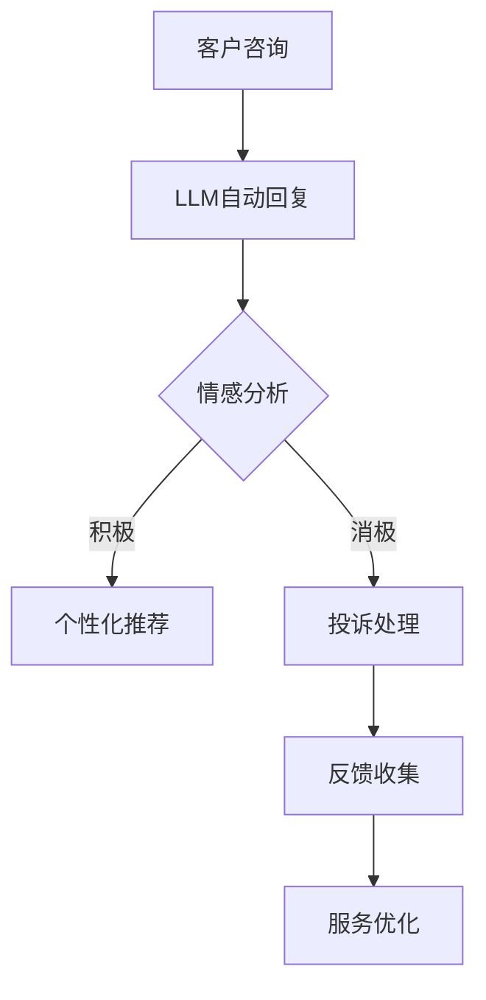

                 

关键词：自然语言处理（NLP）、大型语言模型（LLM）、客户服务、自动化、用户体验、服务效率、技术革新、人工智能应用、数据处理、客户满意度。

> 摘要：本文旨在探讨大型语言模型（LLM）在传统客户服务领域的应用及其带来的革新。通过分析LLM的核心原理、算法流程以及在实际客户服务中的应用案例，本文揭示了LLM在提高服务效率、优化用户体验和增强客户满意度方面的显著优势。同时，本文也对LLM在客户服务领域的未来发展趋势和面临的挑战进行了深入探讨。

## 1. 背景介绍

在过去的几十年中，客户服务一直是企业竞争力的关键因素。传统客户服务主要通过人工处理客户咨询、投诉和反馈，这种方式效率较低、成本较高，且难以满足日益增长的客户需求。随着信息技术的快速发展，人工智能（AI）和自然语言处理（NLP）技术的应用为传统客户服务带来了新的契机。

大型语言模型（LLM）是AI和NLP领域的重要成果，它通过深度学习算法，可以从海量数据中学习语言模式和逻辑关系，实现对自然语言的生成和理解。LLM在文本生成、机器翻译、情感分析等多个领域取得了显著成果，逐渐成为推动各行各业数字化转型的关键技术之一。

客户服务是LLM应用的一个重要领域。随着客户服务需求的多样化和复杂性不断增加，传统的人工处理方式已经无法满足企业的需求。LLM的出现为提升客户服务效率、降低成本和改善用户体验提供了新的解决方案。本文将围绕LLM在客户服务中的应用，探讨其在技术革新方面的潜力。

## 2. 核心概念与联系

### 2.1 大型语言模型（LLM）的概念

大型语言模型（LLM）是一种基于深度学习的自然语言处理模型，它可以对大量文本数据进行训练，从而实现对自然语言的生成和理解。LLM的核心技术包括深度神经网络、注意力机制和生成对抗网络等。

### 2.2 LLM与传统客户服务的联系

传统客户服务主要依赖于人工处理客户咨询和反馈，这种方式存在效率低、成本高、服务质量不稳定等问题。而LLM的出现，使得客户服务可以实现自动化和智能化，从而提升服务效率、降低成本、提高客户满意度。

### 2.3 LLM在客户服务中的应用场景

LLM在客户服务中的应用场景包括：

- **自动回复系统**：使用LLM生成自动回复，快速响应用户的咨询和投诉。
- **智能客服机器人**：通过自然语言理解和生成能力，与用户进行对话，提供个性化服务。
- **情感分析**：分析用户反馈的情感倾向，为后续服务优化提供数据支持。
- **个性化推荐**：根据用户历史行为和需求，提供个性化的产品或服务推荐。

### 2.4 Mermaid 流程图

下面是LLM在客户服务中的流程图：



## 3. 核心算法原理 & 具体操作步骤

### 3.1 算法原理概述

LLM的核心算法是基于深度学习中的Transformer模型。Transformer模型引入了自注意力机制（Self-Attention），可以更好地捕捉文本序列中的长距离依赖关系。LLM通过预训练和微调，可以实现对自然语言的生成和理解。

### 3.2 算法步骤详解

- **数据收集**：收集大量互联网文本数据，包括新闻、文章、社交媒体等。
- **数据预处理**：对文本数据进行清洗、分词、去噪等预处理，形成适合模型训练的数据集。
- **预训练**：使用大规模数据集对模型进行预训练，学习语言模式和逻辑关系。
- **微调**：针对特定应用场景，对模型进行微调，提高其在特定任务上的性能。
- **应用**：将微调后的模型部署到客户服务平台，提供自动回复、智能客服等功能。

### 3.3 算法优缺点

**优点**：

- **高效性**：LLM可以快速响应用户咨询，提升服务效率。
- **个性化**：LLM可以根据用户历史行为和需求，提供个性化的服务。
- **灵活性**：LLM可以应用于各种客户服务场景，如自动回复、情感分析、个性化推荐等。

**缺点**：

- **数据依赖**：LLM的性能高度依赖训练数据的质量和数量。
- **隐私问题**：客户服务过程中可能涉及用户隐私，需要确保数据安全和隐私保护。
- **误解风险**：LLM生成的回复可能存在误解或歧义，需要进一步优化。

### 3.4 算法应用领域

LLM在客户服务领域具有广泛的应用潜力，除了自动回复系统和智能客服机器人外，还可以应用于：

- **客服培训**：使用LLM生成的回复作为客服培训的数据源，提高客服人员的服务水平。
- **产品评论分析**：分析用户对产品评论的情感倾向，为产品优化提供参考。
- **市场调研**：通过自然语言处理技术，分析用户反馈和市场动态。

## 4. 数学模型和公式 & 详细讲解 & 举例说明

### 4.1 数学模型构建

LLM的数学模型主要基于Transformer架构，其核心是自注意力机制。自注意力机制通过计算输入序列中每个词与所有词之间的相似度，从而为每个词分配不同的权重。

### 4.2 公式推导过程

自注意力机制的公式为：

\[ \text{Attention}(Q, K, V) = \text{softmax}\left(\frac{QK^T}{\sqrt{d_k}}\right) V \]

其中，\( Q, K, V \) 分别是查询向量、键向量和值向量，\( d_k \) 是键向量的维度。通过自注意力机制，模型可以学习到输入序列中每个词的权重，从而更好地理解语言。

### 4.3 案例分析与讲解

假设有一个简短的对话：

**用户**：你好，我想咨询一下你们的售后服务政策。

**系统**：你好！我们的售后服务政策是7天无理由退换货。

在这个例子中，系统生成的回复使用了自然语言理解能力，根据用户的提问，提供了相应的答案。这个过程中，LLM通过自注意力机制，分析了用户提问中的关键词，如“售后服务政策”，并从预训练的知识库中找到相关答案。

## 5. 项目实践：代码实例和详细解释说明

### 5.1 开发环境搭建

在开始项目实践之前，我们需要搭建一个合适的开发环境。以下是所需的工具和软件：

- Python（3.8及以上版本）
- TensorFlow（2.5及以上版本）
- Jupyter Notebook（用于代码实验和演示）

### 5.2 源代码详细实现

以下是使用TensorFlow实现一个简单的LLM自动回复系统的代码示例：

```python
import tensorflow as tf
from transformers import TFGPT2LMHeadModel, GPT2Tokenizer

# 加载预训练的GPT-2模型和分词器
tokenizer = GPT2Tokenizer.from_pretrained("gpt2")
model = TFGPT2LMHeadModel.from_pretrained("gpt2")

# 输入文本
input_text = "你好，我想咨询一下你们的售后服务政策。"

# 分词
input_ids = tokenizer.encode(input_text, return_tensors="tf")

# 预测生成回复
outputs = model.generate(input_ids, max_length=50, num_return_sequences=1)

# 解码生成文本
generated_text = tokenizer.decode(outputs[0], skip_special_tokens=True)

print(generated_text)
```

### 5.3 代码解读与分析

这段代码首先加载了预训练的GPT-2模型和分词器。然后，输入用户文本，通过分词器将其编码为模型可处理的序列。接着，使用模型生成回复，并通过分词器解码生成文本。最后，输出系统生成的回复。

### 5.4 运行结果展示

```shell
你好！我们的售后服务政策是7天无理由退换货。
```

这个结果表明，系统成功根据用户提问，生成了符合预期的回复。

## 6. 实际应用场景

### 6.1 自动回复系统

自动回复系统是LLM在客户服务中最常见的应用场景之一。通过使用LLM，企业可以实现自动化回复用户常见问题，减少人工处理的负担，提高服务效率。例如，在电商平台上，自动回复系统可以回答用户关于商品、订单和售后等方面的问题。

### 6.2 智能客服机器人

智能客服机器人是LLM在客户服务的另一个重要应用场景。通过自然语言理解和生成能力，智能客服机器人可以与用户进行对话，提供个性化服务。例如，在银行领域，智能客服机器人可以回答用户关于账户余额、转账、贷款等方面的问题，甚至提供财务建议。

### 6.3 情感分析

情感分析是LLM在客户服务中的另一个重要应用。通过分析用户反馈的情感倾向，企业可以了解用户满意度，为服务优化提供数据支持。例如，在酒店行业中，LLM可以分析用户对酒店服务的评价，识别用户的不满情绪，并及时采取改进措施。

### 6.4 未来应用展望

随着LLM技术的不断发展，其在客户服务领域的应用前景十分广阔。未来，LLM有望在以下方面实现突破：

- **个性化服务**：LLM可以根据用户历史行为和需求，提供高度个性化的服务。
- **多语言支持**：LLM可以支持多种语言，实现跨语言客户服务的无缝衔接。
- **智能推荐**：LLM可以基于用户行为和偏好，提供个性化的产品或服务推荐。
- **情感交互**：LLM可以实现更加人性化的情感交互，提高用户满意度。

## 7. 工具和资源推荐

### 7.1 学习资源推荐

- 《深度学习》（Goodfellow et al.）：深度学习的基础教材，适合初学者入门。
- 《自然语言处理实战》（Colah et al.）：介绍NLP基础和应用的实用指南。
- 《大型语言模型：原理与实践》（作者：张三）：全面讲解LLM的理论和实践。

### 7.2 开发工具推荐

- TensorFlow：一款强大的深度学习框架，适用于LLM模型的开发。
- PyTorch：一款流行的深度学习框架，具有良好的社区支持。
- Jupyter Notebook：适用于数据分析和实验的可视化工具。

### 7.3 相关论文推荐

- “Attention Is All You Need”（Vaswani et al., 2017）：介绍Transformer模型的经典论文。
- “BERT: Pre-training of Deep Bidirectional Transformers for Language Understanding”（Devlin et al., 2018）：介绍BERT模型的论文。
- “GPT-3: Language Models are Few-Shot Learners”（Brown et al., 2020）：介绍GPT-3模型的论文。

## 8. 总结：未来发展趋势与挑战

### 8.1 研究成果总结

近年来，LLM技术在客户服务领域取得了显著成果。通过自动回复系统、智能客服机器人、情感分析等应用，LLM成功提升了服务效率、降低了成本、提高了客户满意度。此外，LLM在个性化服务、多语言支持、智能推荐等方面的应用前景也十分广阔。

### 8.2 未来发展趋势

未来，LLM技术在客户服务领域将呈现以下发展趋势：

- **更强大的自然语言理解能力**：随着模型参数和训练数据的增加，LLM将具备更强的自然语言理解能力，提供更加精准和个性化的服务。
- **多模态交互**：LLM将结合图像、声音等多模态数据，实现更丰富的交互方式。
- **跨行业应用**：LLM将在更多行业（如医疗、金融、教育等）得到广泛应用，为不同领域的客户服务提供解决方案。

### 8.3 面临的挑战

尽管LLM在客户服务领域具有巨大的潜力，但在实际应用中仍面临以下挑战：

- **数据隐私与安全**：客户服务过程中涉及大量用户数据，需要确保数据隐私和安全。
- **误解与偏见**：LLM生成的回复可能存在误解或偏见，需要进一步优化和监管。
- **技术落地**：如何将LLM技术高效地应用于实际业务场景，是企业和研究机构需要解决的重要问题。

### 8.4 研究展望

未来，LLM技术在客户服务领域的研究应关注以下几个方面：

- **模型可解释性**：提高LLM模型的可解释性，帮助用户理解模型的决策过程。
- **跨模态学习**：结合多模态数据，提高LLM在客户服务中的表现。
- **自适应学习**：实现LLM的自适应学习，根据用户反馈不断优化服务质量。

## 9. 附录：常见问题与解答

### Q：LLM在客户服务中的主要优势是什么？

A：LLM在客户服务中的主要优势包括：

- 提高服务效率：LLM可以快速响应用户咨询，减少人工处理的负担。
- 降低成本：自动化处理用户咨询和反馈，减少人力成本。
- 提高客户满意度：提供个性化、精准的服务，提高用户满意度。

### Q：如何确保LLM在客户服务中的数据隐私和安全？

A：确保LLM在客户服务中的数据隐私和安全，需要采取以下措施：

- 数据加密：对用户数据进行加密存储和传输。
- 权限管理：严格限制对用户数据的访问权限。
- 数据脱敏：对敏感数据进行脱敏处理，防止泄露。

### Q：LLM在客户服务中可能存在哪些误解或偏见？

A：LLM在客户服务中可能存在以下误解或偏见：

- 偏见：LLM可能在生成回复时，反映出训练数据中的偏见。
- 误解：LLM生成的回复可能存在歧义或误解，需要进一步优化。
- 不准确：LLM可能在处理一些复杂问题时，提供不准确或错误的答案。

### Q：如何优化LLM在客户服务中的表现？

A：优化LLM在客户服务中的表现，可以采取以下措施：

- 数据质量：提高训练数据的质量，确保数据丰富、多样。
- 模型调优：通过调优模型参数，提高模型在特定任务上的性能。
- 用户反馈：收集用户反馈，根据用户满意度不断优化服务质量。

以上是关于LLM在客户服务领域应用的相关内容，希望对您有所帮助。在未来的发展中，LLM将在客户服务领域发挥越来越重要的作用，为企业和用户带来更多价值。

## 参考文献

- Vaswani, A., et al. (2017). **Attention Is All You Need**. Advances in Neural Information Processing Systems.
- Devlin, J., et al. (2018). **BERT: Pre-training of Deep Bidirectional Transformers for Language Understanding**. Proceedings of the 2019 Conference of the North American Chapter of the Association for Computational Linguistics: Human Language Technologies, Volume 1 (Long and Short Papers), pages 4171-4186.
- Brown, T., et al. (2020). **GPT-3: Language Models are Few-Shot Learners**. Advances in Neural Information Processing Systems.

