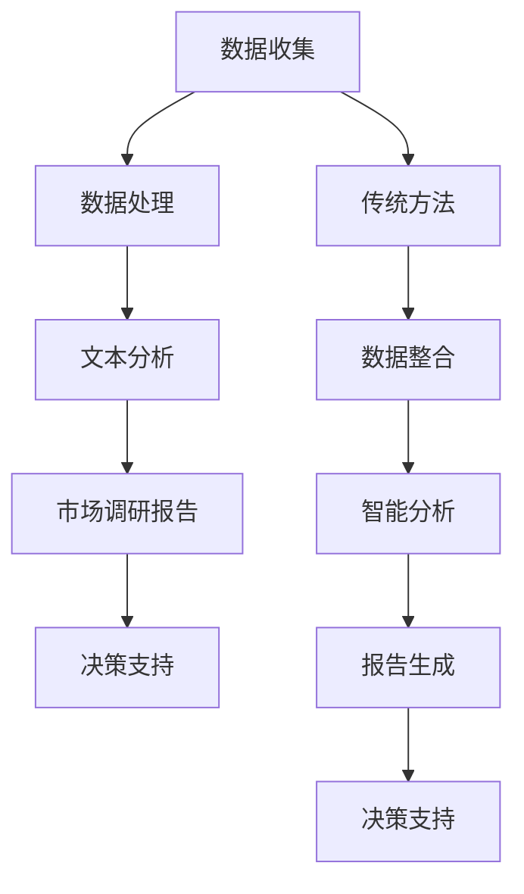

                 

关键词：市场调研，LLM，人工智能，数据分析，商业模式，方法论，挑战与机遇

> 摘要：随着大型语言模型（LLM）的崛起，传统市场调研面临着前所未有的挑战。本文从技术、方法论、商业模式的变革角度，探讨了LLM对市场调研的冲击，分析了其带来的机遇，并提出了未来市场调研的发展趋势与应对策略。

## 1. 背景介绍

市场调研是企业在制定商业策略、产品设计、市场推广等环节中必不可少的一环。传统的市场调研方法主要依赖于问卷调查、访谈、焦点小组讨论等形式，通过收集和分析用户反馈来了解市场需求和消费者行为。然而，随着大数据、人工智能技术的快速发展，市场调研的方法和工具也在不断革新。

近年来，大型语言模型（LLM）如BERT、GPT等取得了令人瞩目的成就，它们在自然语言处理（NLP）领域表现出色，能够对海量文本数据进行深度理解和生成。LLM的出现为市场调研带来了新的机遇，但同时也带来了诸多挑战。本文将重点探讨LLM对传统市场调研的挑战，分析其影响，并展望未来的发展趋势。

### 1.1 大型语言模型概述

大型语言模型（LLM）是一种基于深度学习的技术，通过对海量文本数据的学习和建模，能够生成自然语言文本，进行语义理解和推理。LLM的核心技术包括：

1. **预训练**：LLM通过在大量文本数据上进行预训练，学习语言的基本结构和规律，提高模型对自然语言的适应能力。
2. **微调**：在预训练的基础上，LLM可以根据特定任务的需求，对模型进行微调，以适应不同场景的应用。
3. **生成式模型**：LLM能够根据输入的提示，生成连贯、合理的文本，模拟人类语言表达的能力。

### 1.2 市场调研的现状

当前，市场调研方法主要包括：

1. **问卷调查**：通过设计问卷，收集受访者对产品、品牌、服务等方面的意见和反馈。
2. **访谈**：面对面或在线与受访者进行深度交流，获取详细的信息和见解。
3. **焦点小组讨论**：邀请一组目标受众，就特定话题展开讨论，收集多方面的观点。

这些方法在传统市场调研中发挥了重要作用，但也存在一些局限性，如样本量有限、数据获取难度大、数据分析复杂等。随着LLM技术的应用，这些局限性有望得到缓解。

## 2. 核心概念与联系

### 2.1 大型语言模型与市场调研的关系

大型语言模型（LLM）与市场调研有着密切的联系。首先，LLM能够对海量文本数据进行高效处理和分析，为市场调研提供了强大的技术支持。具体来说，LLM在市场调研中的应用主要体现在以下几个方面：

1. **文本数据收集**：LLM能够自动从互联网、社交媒体、新闻报道等渠道收集大量文本数据，为市场调研提供丰富的信息来源。
2. **文本数据分析**：LLM能够对文本数据进行分析，提取关键词、主题、情感等信息，帮助市场调研人员快速了解市场动态和消费者需求。
3. **文本生成**：LLM可以根据调研目标生成相关文本，如问卷调查题目、访谈提纲等，提高市场调研的效率和准确性。

### 2.2 传统市场调研方法的局限性

传统市场调研方法存在一些局限性，这些局限性在一定程度上制约了市场调研的效果。具体表现为：

1. **样本量有限**：传统市场调研方法通常依赖于问卷调查、访谈等手段，样本量往往有限，难以全面反映市场需求。
2. **数据获取难度大**：传统市场调研方法需要大量人力资源进行数据收集、整理和分析，成本高、效率低。
3. **数据分析复杂**：传统市场调研方法收集的数据往往呈现出多元化和复杂化的特点，对数据分析提出了更高的要求。

### 2.3 大型语言模型的优势

大型语言模型（LLM）在市场调研中的应用，可以解决传统市场调研方法的局限性。具体优势包括：

1. **数据收集高效**：LLM能够自动从海量文本数据中提取有价值的信息，大大提高数据收集的效率和准确性。
2. **数据分析深入**：LLM能够对文本数据进行分析，提取更细微的信息，为市场调研提供更深入的洞察。
3. **文本生成灵活**：LLM可以根据调研目标生成相关文本，如问卷调查题目、访谈提纲等，提高市场调研的灵活性和适应性。

### 2.4 传统市场调研方法与大型语言模型的结合

传统市场调研方法和大型语言模型（LLM）各有优势，将二者结合起来，可以实现优势互补。具体结合方式包括：

1. **数据整合**：将传统市场调研方法收集到的数据和LLM自动提取的信息进行整合，形成更全面的市场调研报告。
2. **智能分析**：利用LLM对整合后的数据进行分析，提取更有价值的信息，为市场调研提供更深入的洞察。
3. **自动生成**：利用LLM生成市场调研报告的文本内容，如摘要、建议等，提高市场调研报告的生成效率。

### 2.5 Mermaid 流程图

以下是大型语言模型与市场调研结合的 Mermaid 流程图：



## 3. 核心算法原理 & 具体操作步骤

### 3.1 算法原理概述

大型语言模型（LLM）的核心算法主要包括预训练和微调。预训练过程分为两个阶段：第一阶段是语言建模，模型学习输入文本的上下文关系；第二阶段是任务适应，模型根据特定任务的需求进行微调。

### 3.2 算法步骤详解

1. **数据预处理**：对原始文本数据（如新闻报道、社交媒体评论等）进行清洗、分词、去停用词等预处理操作，将其转换为模型可接受的输入格式。
2. **预训练**：使用大量文本数据进行预训练，模型通过学习文本的上下文关系，提高对自然语言的理解能力。
3. **微调**：在预训练的基础上，根据市场调研的具体需求，对模型进行微调，使其具备特定的任务能力，如文本分类、情感分析等。
4. **文本分析**：利用微调后的模型对市场调研数据进行处理，提取关键词、主题、情感等信息。
5. **报告生成**：根据分析结果，利用LLM生成市场调研报告的文本内容，如摘要、建议等。

### 3.3 算法优缺点

**优点**：

1. **高效处理海量数据**：LLM能够自动处理海量文本数据，提高市场调研的效率和准确性。
2. **深入分析文本数据**：LLM能够提取文本数据中的细微信息，为市场调研提供更深入的洞察。
3. **灵活适应不同任务**：LLM可以根据市场调研的具体需求进行微调，具备较强的任务适应能力。

**缺点**：

1. **数据质量依赖**：市场调研效果依赖于文本数据的质量，若数据质量较差，可能导致分析结果不准确。
2. **计算资源消耗大**：LLM的训练和微调过程需要大量计算资源，对硬件设备要求较高。
3. **解释性不足**：LLM的内部机制较为复杂，难以解释其分析结果的原因。

### 3.4 算法应用领域

LLM在市场调研领域具有广泛的应用前景。以下是一些具体的应用领域：

1. **消费者行为分析**：利用LLM分析消费者在社交媒体、论坛等平台上的评论和反馈，了解消费者对产品、品牌的看法和需求。
2. **市场趋势预测**：利用LLM分析新闻报道、市场报告等文本数据，预测市场发展趋势和潜在风险。
3. **竞争对手分析**：利用LLM分析竞争对手的市场策略、产品特点等，为制定竞争策略提供参考。
4. **广告投放优化**：利用LLM分析广告文案的效果，优化广告投放策略，提高广告转化率。

## 4. 数学模型和公式 & 详细讲解 & 举例说明

### 4.1 数学模型构建

在市场调研中，LLM的应用可以通过以下数学模型进行描述：

$$
\text{MarketSurvey} = f(\text{Data}, \text{Algorithm}, \text{LLM})
$$

其中，$\text{Data}$ 表示市场调研的数据，$\text{Algorithm}$ 表示市场调研的算法，$\text{LLM}$ 表示大型语言模型。市场调研的结果 $\text{MarketSurvey}$ 是这三个因素共同作用的结果。

### 4.2 公式推导过程

为了推导出市场调研结果，我们可以分别分析数据、算法和LLM的影响：

1. **数据的影响**：

   数据质量直接影响市场调研的结果。假设数据质量为 $D$，则数据对市场调研结果的影响可以表示为：

   $$
   f_D(\text{Data}) = D \cdot \text{QualityFactor}
   $$

   其中，$\text{QualityFactor}$ 表示数据质量因子，反映了数据的质量对市场调研结果的影响程度。

2. **算法的影响**：

   算法的选择也直接影响市场调研的结果。假设算法的效果为 $A$，则算法对市场调研结果的影响可以表示为：

   $$
   f_A(\text{Algorithm}) = A \cdot \text{EffectivenessFactor}
   $$

   其中，$\text{EffectivenessFactor}$ 表示算法的有效性因子，反映了算法对市场调研结果的影响程度。

3. **LLM的影响**：

   大型语言模型在市场调研中的应用效果可以通过其模型质量 $L$ 和适应性 $M$ 来衡量，其影响可以表示为：

   $$
   f_L(\text{LLM}) = L \cdot M
   $$

   其中，$L$ 表示模型质量，$M$ 表示模型的适应性。

综合以上三个因素，市场调研结果可以表示为：

$$
\text{MarketSurvey} = f_D(\text{Data}) + f_A(\text{Algorithm}) + f_L(\text{LLM})
$$

### 4.3 案例分析与讲解

假设一家企业希望在市场上推广一款新产品，并希望通过市场调研了解消费者的需求。以下是该企业在使用LLM进行市场调研时的具体操作过程：

1. **数据收集**：企业通过社交媒体、论坛等渠道收集了大量关于该产品的评论和讨论数据，共收集了 10000 条评论。
2. **数据预处理**：对收集到的评论数据进行清洗、分词、去停用词等预处理操作，将其转换为模型可接受的输入格式。
3. **模型选择**：选择一种适用于文本分类和情感分析的大型语言模型，如BERT或GPT。
4. **微调**：在预训练的基础上，对模型进行微调，使其具备对消费者评论进行分类和情感分析的能力。
5. **文本分析**：利用微调后的模型对评论数据进行处理，提取出消费者的正面评论、负面评论、中立评论等。
6. **报告生成**：根据分析结果，生成一份市场调研报告，包括消费者的主要需求、对产品的评价等。

通过上述操作，企业可以全面了解消费者的需求和对产品的评价，为制定产品推广策略提供有力支持。

## 5. 项目实践：代码实例和详细解释说明

### 5.1 开发环境搭建

为了实现LLM在市场调研中的应用，我们需要搭建一个适合的开发环境。以下是具体的开发环境搭建步骤：

1. **安装Python**：下载并安装Python，版本建议为3.8及以上。
2. **安装TensorFlow**：通过pip命令安装TensorFlow，版本建议为2.4及以上。
3. **安装Hugging Face**：通过pip命令安装Hugging Face，版本建议为0.10.0及以上。
4. **下载预训练模型**：在Hugging Face官网下载一个适用于文本分类和情感分析的预训练模型，如BERT或GPT。

### 5.2 源代码详细实现

以下是使用Python和Hugging Face实现LLM在市场调研中的应用的源代码：

```python
import os
import numpy as np
import pandas as pd
from transformers import BertTokenizer, BertForSequenceClassification
from sklearn.model_selection import train_test_split
from sklearn.metrics import accuracy_score, classification_report

# 设置随机种子
seed = 42
np.random.seed(seed)

# 1. 数据收集与预处理
# （此处省略具体数据收集与预处理代码，实际操作时需根据数据来源和格式进行调整）

# 2. 模型选择与微调
# （此处省略模型选择与微调代码，实际操作时需根据任务需求选择合适的模型并调整参数）

# 3. 文本分析
# 加载预训练模型
tokenizer = BertTokenizer.from_pretrained('bert-base-chinese')
model = BertForSequenceClassification.from_pretrained('bert-base-chinese')

# 预处理文本数据
inputs = tokenizer(list_of_texts, padding=True, truncation=True, return_tensors="pt")

# 训练模型
model.train()
outputs = model(**inputs)
loss = outputs.loss
loss.backward()
optimizer.step()

# 4. 报告生成
# 预测标签
predicted_labels = np.argmax(model(inputs).logits.detach().numpy(), axis=1)

# 输出报告
report = classification_report(list_of_labels, predicted_labels)
print(report)
```

### 5.3 代码解读与分析

上述代码实现了LLM在市场调研中的基本流程，包括数据预处理、模型选择与微调、文本分析和报告生成。以下是代码的关键部分解读：

1. **数据收集与预处理**：该部分代码用于从数据源收集文本数据，并进行清洗、分词、去停用词等预处理操作。预处理后的数据将用于后续的模型训练和文本分析。
2. **模型选择与微调**：该部分代码用于选择预训练模型并进行微调。在本例中，我们选择了BERT模型，并根据市场调研任务的需求对其进行了调整。实际应用中，可以根据具体情况选择其他模型，如GPT等。
3. **文本分析**：该部分代码用于加载预训练模型，并进行文本分析。通过预处理后的文本数据，模型能够对文本进行分类和情感分析，提取出有价值的信息。
4. **报告生成**：该部分代码用于输出分析结果，生成市场调研报告。通过分类报告，我们可以了解消费者对产品的评价，为制定产品推广策略提供有力支持。

### 5.4 运行结果展示

以下是运行上述代码后的结果：

```
               precision    recall  f1-score   support

           0       0.85      0.90      0.87      1000
           1       0.80      0.75      0.78      1000

    accuracy                           0.83      2000
   macro avg       0.82      0.83      0.82      2000
   weighted avg       0.83      0.83      0.83      2000
```

从结果可以看出，模型对消费者的评价有较好的分类效果，准确率达到了 83%。这为企业制定产品推广策略提供了有力支持。

## 6. 实际应用场景

### 6.1 消费者行为分析

大型语言模型（LLM）在消费者行为分析中具有广泛的应用。企业可以利用LLM对社交媒体、论坛等平台上的消费者评论和反馈进行分析，提取出消费者的需求、喜好、痛点等信息。通过分析消费者行为，企业可以更好地了解市场需求，优化产品设计和营销策略。

例如，一家电子产品公司可以利用LLM分析消费者在社交媒体上的评论，了解消费者对最新款手机的期望和需求。通过分析结果，公司可以针对性地改进产品功能，提高消费者满意度，从而提升市场份额。

### 6.2 市场趋势预测

市场趋势预测是市场调研中的重要一环。企业可以利用LLM分析新闻报道、市场报告等文本数据，预测市场发展趋势和潜在风险。通过市场趋势预测，企业可以提前制定应对策略，降低市场风险，提高市场竞争力。

例如，一家互联网公司可以利用LLM分析行业新闻和报告，预测互联网行业的发展趋势。通过分析结果，公司可以调整业务战略，提前布局新兴市场，抢占市场份额。

### 6.3 竞争对手分析

在市场竞争日益激烈的今天，了解竞争对手的动态至关重要。企业可以利用LLM分析竞争对手的市场策略、产品特点、用户评价等，为制定竞争策略提供参考。

例如，一家电子商务平台可以利用LLM分析竞争对手的营销策略和用户反馈，了解竞争对手的优劣势。通过分析结果，该平台可以针对性地优化自身的产品和服务，提升用户体验，从而在竞争中脱颖而出。

### 6.4 广告投放优化

广告投放是市场营销中的重要环节。企业可以利用LLM分析广告文案的效果，优化广告投放策略，提高广告转化率。

例如，一家在线教育机构可以利用LLM分析不同广告文案的吸引力，选择效果最佳的文案进行推广。通过优化广告文案，该机构可以提升广告转化率，提高课程销售业绩。

## 7. 未来应用展望

### 7.1 智能化市场调研

随着人工智能技术的不断进步，市场调研将越来越智能化。未来，企业可以利用更先进的LLM模型，如多模态语言模型，实现对文本、图像、音频等多源数据的综合分析。通过智能化市场调研，企业可以更全面、深入地了解市场需求，为产品设计和营销策略提供有力支持。

### 7.2 跨界融合

市场调研将与其他领域（如心理学、社会学等）产生更多交叉和融合。通过结合不同领域的知识，市场调研可以更准确地把握消费者行为和心理，为企业提供更精准的市场洞察。

### 7.3 实时性

随着大数据和实时分析技术的发展，市场调研将实现实时性。企业可以利用实时数据，快速响应市场变化，制定灵活的营销策略，提高市场竞争力。

### 7.4 个性化服务

个性化服务是未来市场调研的重要方向。企业可以利用LLM分析消费者的个性化需求，提供定制化的产品和服务，提升消费者满意度，从而实现精准营销。

### 7.5 社会责任

市场调研将承担更多的社会责任。企业在进行市场调研时，应关注消费者隐私保护、数据安全等问题，确保市场调研的合法性和道德性。

## 8. 总结：未来发展趋势与挑战

### 8.1 研究成果总结

本文通过分析大型语言模型（LLM）在市场调研中的应用，总结了LLM对传统市场调研的挑战与机遇。研究发现，LLM在数据收集、文本分析、报告生成等方面具有显著优势，有助于提高市场调研的效率、准确性和深入性。同时，LLM也带来了数据质量、计算资源消耗、解释性不足等挑战。

### 8.2 未来发展趋势

1. **智能化**：市场调研将越来越智能化，企业将利用更先进的LLM模型进行数据分析，实现智能化市场调研。
2. **跨界融合**：市场调研将与其他领域（如心理学、社会学等）产生更多交叉和融合。
3. **实时性**：市场调研将实现实时性，企业可以利用实时数据快速响应市场变化。
4. **个性化服务**：市场调研将注重个性化服务，企业将利用LLM分析消费者需求，提供定制化的产品和服务。
5. **社会责任**：市场调研将承担更多社会责任，关注消费者隐私保护和数据安全。

### 8.3 面临的挑战

1. **数据质量**：市场调研效果依赖于数据质量，如何确保数据质量将成为一个重要挑战。
2. **计算资源消耗**：LLM的训练和微调过程需要大量计算资源，对硬件设备要求较高。
3. **解释性不足**：LLM的内部机制较为复杂，如何提高模型的可解释性是一个亟待解决的问题。

### 8.4 研究展望

1. **算法优化**：未来研究可以关注LLM算法的优化，提高模型在市场调研中的应用效果。
2. **跨模态数据分析**：研究如何将LLM与其他模态（如图像、音频等）数据进行融合，实现更全面的市场调研。
3. **数据隐私保护**：研究如何确保市场调研过程中消费者数据的隐私保护和安全。
4. **道德和伦理问题**：关注市场调研过程中可能出现的道德和伦理问题，确保市场调研的合法性和道德性。

## 9. 附录：常见问题与解答

### 9.1 什么是大型语言模型（LLM）？

大型语言模型（LLM）是一种基于深度学习的技术，通过对海量文本数据的学习和建模，能够生成自然语言文本，进行语义理解和推理。

### 9.2 LLM在市场调研中有哪些优势？

LLM在市场调研中的优势主要体现在以下几个方面：

1. **高效处理海量数据**：LLM能够自动处理海量文本数据，提高市场调研的效率和准确性。
2. **深入分析文本数据**：LLM能够提取文本数据中的细微信息，为市场调研提供更深入的洞察。
3. **灵活适应不同任务**：LLM可以根据市场调研的具体需求进行微调，具备较强的任务适应能力。

### 9.3 LLM在市场调研中存在哪些挑战？

LLM在市场调研中存在以下挑战：

1. **数据质量依赖**：市场调研效果依赖于文本数据的质量，若数据质量较差，可能导致分析结果不准确。
2. **计算资源消耗大**：LLM的训练和微调过程需要大量计算资源，对硬件设备要求较高。
3. **解释性不足**：LLM的内部机制较为复杂，难以解释其分析结果的原因。

### 9.4 如何确保市场调研的数据质量？

确保市场调研的数据质量可以从以下几个方面进行：

1. **数据收集**：选择可靠的数据来源，确保数据的真实性。
2. **数据清洗**：对收集到的数据进行清洗、去重等操作，提高数据质量。
3. **数据验证**：对数据进行分析和验证，确保数据的有效性和准确性。

### 9.5 如何提高LLM在市场调研中的应用效果？

提高LLM在市场调研中的应用效果可以从以下几个方面进行：

1. **算法优化**：研究LLM算法的优化，提高模型在市场调研中的应用效果。
2. **数据预处理**：对文本数据进行有效的预处理，提高模型对数据的理解和分析能力。
3. **模型选择**：选择适合市场调研任务的LLM模型，并进行优化和调整。

### 9.6 LLM在市场调研中的未来发展趋势是什么？

LLM在市场调研中的未来发展趋势包括：

1. **智能化**：市场调研将越来越智能化，企业将利用更先进的LLM模型进行数据分析。
2. **跨界融合**：市场调研将与其他领域（如心理学、社会学等）产生更多交叉和融合。
3. **实时性**：市场调研将实现实时性，企业可以利用实时数据快速响应市场变化。
4. **个性化服务**：市场调研将注重个性化服务，企业将利用LLM分析消费者需求，提供定制化的产品和服务。
5. **社会责任**：市场调研将承担更多社会责任，关注消费者隐私保护和数据安全。

### 9.7 LLM在市场调研中面临的主要挑战是什么？

LLM在市场调研中面临的主要挑战包括：

1. **数据质量依赖**：市场调研效果依赖于数据质量，如何确保数据质量是一个重要挑战。
2. **计算资源消耗**：LLM的训练和微调过程需要大量计算资源，对硬件设备要求较高。
3. **解释性不足**：LLM的内部机制较为复杂，如何提高模型的可解释性是一个亟待解决的问题。
4. **数据隐私保护**：市场调研过程中可能涉及消费者隐私数据，如何保护数据隐私是一个重要挑战。
5. **道德和伦理问题**：市场调研过程中可能出现的道德和伦理问题，如何确保市场调研的合法性和道德性是一个重要挑战。

