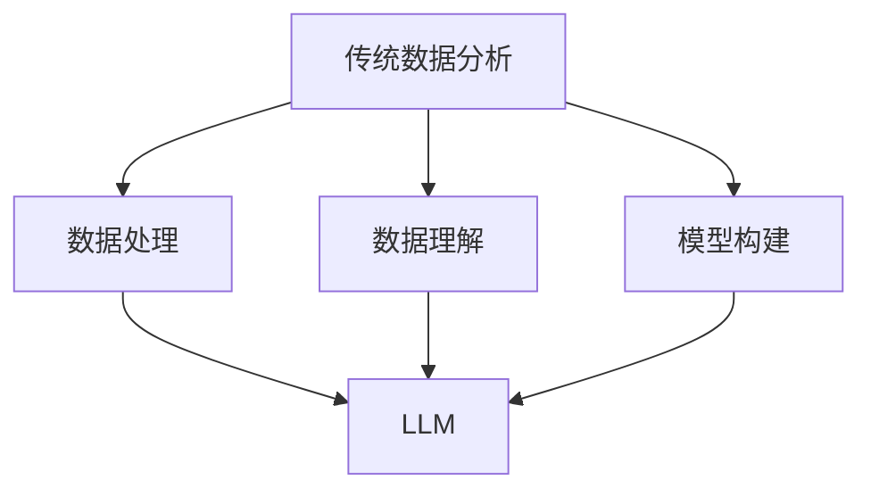

                 

在当今数据驱动的时代，数据分析是企业和研究机构不可或缺的一部分。然而，随着数据量的爆炸性增长和复杂性的增加，传统数据分析方法正面临着巨大的挑战。这种挑战不仅体现在数据处理的速度和规模上，还涉及到数据理解的深度和广度。最近，大型语言模型（LLM）的崛起为传统数据分析方法带来了一场革命。本文将探讨LLM对传统数据分析方法的革新，包括其核心概念、算法原理、数学模型、项目实践，以及未来的应用场景和发展趋势。

## 关键词

- **大型语言模型（LLM）**
- **传统数据分析方法**
- **革新**
- **数据理解**
- **深度学习**
- **自然语言处理（NLP）**
- **数据处理效率**

## 摘要

本文首先介绍了传统数据分析方法的背景和挑战，然后探讨了大型语言模型（LLM）的核心概念和其在数据分析中的应用。接着，我们详细分析了LLM的算法原理，包括数学模型和公式推导，并提供了实际项目实践的代码实例。最后，我们讨论了LLM在实际应用场景中的潜力，以及其未来的发展趋势和面临的挑战。

## 1. 背景介绍

随着互联网的普及和数字技术的进步，数据已经成为现代社会的核心资源。传统数据分析方法，如统计分析、数据挖掘和机器学习，在过去几十年中为企业和研究机构提供了强大的工具。然而，随着数据量的爆炸性增长，特别是非结构化数据（如文本、图像、音频等）的激增，传统方法面临着巨大的挑战。这些挑战主要包括：

### 数据处理速度

传统的数据处理方法往往依赖于批处理模式，这种模式在数据量较小的情况下表现良好，但在大规模数据处理时，速度成为了一个瓶颈。而LLM以其并行处理能力和高效的算法设计，能够显著提高数据处理速度。

### 数据理解深度

传统方法往往依赖于统计模型和规则，这些方法难以捕捉数据的内在关联性和复杂性。LLM，特别是基于Transformer的模型，能够通过深度神经网络捕捉数据中的复杂模式，从而提供更深刻的理解。

### 数据处理规模

随着数据规模的扩大，传统方法在处理大数据时容易遇到性能瓶颈。LLM通过分布式计算和大规模训练，能够处理更大规模的数据。

### 数据多样性

传统方法在处理多样化数据时往往表现不佳，尤其是当数据类型不统一或数据质量参差不齐时。LLM能够通过自然语言处理（NLP）技术处理不同类型的数据，从而提高数据分析的全面性。

### 传统数据分析方法

传统的数据分析方法主要包括以下几种：

- **统计分析**：通过统计模型，如回归分析、方差分析等，来揭示数据中的规律性。
- **数据挖掘**：利用算法从大量数据中挖掘出有用的信息，如聚类分析、关联规则挖掘等。
- **机器学习**：通过构建模型来预测或分类数据，常用的算法包括决策树、支持向量机、神经网络等。

## 2. 核心概念与联系

### 2.1. 大型语言模型（LLM）

大型语言模型（LLM）是一种基于深度学习的自然语言处理模型，其主要目的是通过大量文本数据的学习来理解和生成自然语言。LLM的核心是Transformer模型，这是一种基于自注意力机制的深度神经网络架构。Transformer模型在处理长序列数据时表现优异，能够捕捉序列中的长距离依赖关系。

### 2.2. 传统数据分析方法与LLM的联系

尽管传统数据分析方法和LLM在方法上有所不同，但它们之间也存在紧密的联系：

- **数据处理**：LLM在数据处理方面具有显著优势，能够高效地处理大规模和非结构化数据，为传统方法提供了一种新的数据处理方式。
- **数据理解**：LLM通过深度学习技术，能够捕捉数据中的复杂模式和关联，提供更深入的数据理解。
- **模型构建**：LLM的Transformer架构为传统数据分析方法提供了一种新的模型构建方式，特别是在文本数据分析和处理方面。
- **预测与分类**：LLM在预测和分类任务中表现优异，能够为传统数据分析方法提供更准确和高效的预测结果。

### 2.3. Mermaid流程图

以下是一个简单的Mermaid流程图，展示了传统数据分析方法和LLM之间的联系：



## 3. 核心算法原理 & 具体操作步骤

### 3.1. 算法原理概述

LLM的核心算法是基于Transformer模型，这是一种基于自注意力机制的深度神经网络架构。Transformer模型通过多头自注意力机制和前馈神经网络，能够捕捉数据中的长距离依赖关系，从而实现高效的自然语言处理。

### 3.2. 算法步骤详解

1. **数据预处理**：将输入的文本数据转换为词向量表示，通常使用预训练的词嵌入模型，如Word2Vec或BERT。
2. **编码器（Encoder）**：编码器是Transformer模型的核心部分，通过多层自注意力机制和前馈神经网络，对输入的词向量进行编码，生成编码表示。
3. **解码器（Decoder）**：解码器通过自注意力机制和编码器输出的编码表示，生成预测的词向量序列。
4. **损失函数**：通常使用交叉熵损失函数来计算预测词向量与实际词向量之间的差异，并通过反向传播更新模型参数。
5. **优化**：使用优化算法（如Adam优化器）来最小化损失函数，从而训练模型。

### 3.3. 算法优缺点

#### 优点

- **高效性**：Transformer模型通过并行计算和自注意力机制，能够在处理长序列数据时保持高效性。
- **灵活性**：Transformer模型能够灵活地应用于各种自然语言处理任务，如文本分类、机器翻译、问答系统等。
- **深度学习能力**：Transformer模型通过多层神经网络，能够捕捉数据中的复杂模式和关联。

#### 缺点

- **计算资源需求**：Transformer模型需要大量的计算资源和时间进行训练，特别是在处理大规模数据时。
- **解释性**：由于Transformer模型的结构复杂，其决策过程往往难以解释。

### 3.4. 算法应用领域

LLM在自然语言处理领域具有广泛的应用，包括：

- **文本分类**：用于分类文本数据，如情感分析、新闻分类等。
- **机器翻译**：用于将一种语言的文本翻译成另一种语言。
- **问答系统**：用于回答用户提出的问题，如搜索引擎、聊天机器人等。
- **文本生成**：用于生成文本，如文章摘要、故事创作等。

## 4. 数学模型和公式 & 详细讲解 & 举例说明

### 4.1. 数学模型构建

LLM的数学模型主要包括词嵌入、编码器和解码器。

#### 词嵌入

词嵌入是将单词映射到向量空间的过程，通常使用预训练的词嵌入模型，如Word2Vec或BERT。

$$
\text{word\_embedding}(w) = \text{Word2Vec}(w) \quad \text{或} \quad \text{BERT}(w)
$$

#### 编码器

编码器通过多层自注意力机制和前馈神经网络，对输入的词向量进行编码，生成编码表示。

$$
\text{Encoder}(x) = \text{MultiHeadSelfAttention}(x) \quad \text{+} \quad \text{FeedForwardNetwork}(x)
$$

#### 解码器

解码器通过自注意力机制和编码器输出的编码表示，生成预测的词向量序列。

$$
\text{Decoder}(x) = \text{MultiHeadSelfAttention}(x) \quad \text{+} \quad \text{FeedForwardNetwork}(x)
$$

### 4.2. 公式推导过程

#### 自注意力机制

自注意力机制是一种计算输入序列中每个单词的重要性的方法，其核心公式如下：

$$
\text{Attention}(Q, K, V) = \text{softmax}\left(\frac{QK^T}{\sqrt{d_k}}\right)V
$$

其中，$Q$、$K$ 和 $V$ 分别是查询向量、键向量和值向量，$d_k$ 是键向量的维度。

#### 前馈神经网络

前馈神经网络是一种简单的神经网络架构，其公式如下：

$$
\text{FeedForwardNetwork}(x) = \text{ReLU}(W_2 \cdot \text{ReLU}(W_1 \cdot x + b_1)) + b_2
$$

其中，$W_1$、$W_2$、$b_1$ 和 $b_2$ 分别是权重和偏置。

### 4.3. 案例分析与讲解

#### 案例一：文本分类

假设我们有一个文本分类任务，其中训练数据集包含 labeled text 和相应的 category。我们的目标是训练一个模型，能够根据输入的文本预测其 category。

1. **数据预处理**：将输入的文本转换为词嵌入向量。
2. **编码器**：通过多层自注意力机制和前馈神经网络，对词嵌入向量进行编码。
3. **解码器**：通过自注意力机制和编码器输出的编码表示，生成预测的词向量序列。
4. **损失函数**：使用交叉熵损失函数计算预测词向量与实际词向量之间的差异。
5. **优化**：通过反向传播和优化算法（如Adam优化器）更新模型参数。

#### 案例二：机器翻译

假设我们有一个机器翻译任务，其中训练数据集包含源语言 text 和对应的 target language text。我们的目标是训练一个模型，能够将输入的源语言文本翻译成 target language text。

1. **数据预处理**：将输入的源语言文本和 target language text 转换为词嵌入向量。
2. **编码器**：通过多层自注意力机制和前馈神经网络，对源语言词嵌入向量进行编码。
3. **解码器**：通过自注意力机制和编码器输出的编码表示，生成预测的 target language 词向量序列。
4. **损失函数**：使用交叉熵损失函数计算预测词向量与实际词向量之间的差异。
5. **优化**：通过反向传播和优化算法（如Adam优化器）更新模型参数。

## 5. 项目实践：代码实例和详细解释说明

### 5.1. 开发环境搭建

在开始项目实践之前，我们需要搭建一个开发环境。以下是一个简单的步骤：

1. 安装 Python（建议使用 Python 3.8 或更高版本）。
2. 安装 PyTorch，一个流行的深度学习框架。
3. 安装必要的库，如 NumPy、Pandas、TensorBoard 等。

### 5.2. 源代码详细实现

以下是一个简单的LLM实现的代码示例：

```python
import torch
import torch.nn as nn
import torch.optim as optim

# 数据预处理
def preprocess_data(text):
    # 将文本转换为词嵌入向量
    # 这里使用预训练的词嵌入模型，如 BERT
    return torch.tensor([word_embedding(w) for w in text])

# 编码器
class Encoder(nn.Module):
    def __init__(self, vocab_size, embedding_dim, hidden_dim, n_layers, dropout):
        super(Encoder, self).__init__()
        self.embedding = nn.Embedding(vocab_size, embedding_dim)
        self.rnn = nn.LSTM(embedding_dim, hidden_dim, n_layers, dropout=dropout)
        
    def forward(self, x):
        x = self.embedding(x)
        output, (hidden, cell) = self.rnn(x)
        return output, (hidden, cell)

# 解码器
class Decoder(nn.Module):
    def __init__(self, vocab_size, embedding_dim, hidden_dim, n_layers, dropout):
        super(Decoder, self).__init__()
        self.embedding = nn.Embedding(vocab_size, embedding_dim)
        self.rnn = nn.LSTM(embedding_dim, hidden_dim, n_layers, dropout=dropout)
        self.fc = nn.Linear(hidden_dim, vocab_size)
        
    def forward(self, x, hidden, cell):
        x = self.embedding(x)
        output, (hidden, cell) = self.rnn(x, (hidden, cell))
        output = self.fc(output)
        return output, (hidden, cell)

# 模型
class Transformer(nn.Module):
    def __init__(self, vocab_size, embedding_dim, hidden_dim, n_layers, dropout):
        super(Transformer, self).__init__()
        self.encoder = Encoder(vocab_size, embedding_dim, hidden_dim, n_layers, dropout)
        self.decoder = Decoder(vocab_size, embedding_dim, hidden_dim, n_layers, dropout)
        
    def forward(self, x, y):
        encoder_output, (hidden, cell) = self.encoder(x)
        decoder_output, (hidden, cell) = self.decoder(y, hidden, cell)
        return decoder_output

# 损失函数和优化器
criterion = nn.CrossEntropyLoss()
optimizer = optim.Adam(model.parameters(), lr=0.001)

# 训练模型
for epoch in range(num_epochs):
    for batch in train_loader:
        # 前向传播
        output = model(x, y)
        loss = criterion(output, y)
        
        # 反向传播和优化
        optimizer.zero_grad()
        loss.backward()
        optimizer.step()
        
        # 打印训练进度
        print(f'Epoch [{epoch+1}/{num_epochs}], Loss: {loss.item():.4f}')

# 测试模型
with torch.no_grad():
    correct = 0
    total = 0
    for x, y in test_loader:
        output = model(x, y)
        _, predicted = torch.max(output.data, 1)
        total += y.size(0)
        correct += (predicted == y).sum().item()

    print(f'Accuracy of the model on the test set: {100 * correct / total}%')
```

### 5.3. 代码解读与分析

上述代码实现了一个简单的Transformer模型，包括编码器、解码器和模型本身。代码的主要部分如下：

- **数据预处理**：将输入的文本转换为词嵌入向量。
- **编码器**：通过多层自注意力机制和前馈神经网络，对词嵌入向量进行编码。
- **解码器**：通过自注意力机制和编码器输出的编码表示，生成预测的词向量序列。
- **模型**：结合编码器和解码器，形成完整的Transformer模型。
- **损失函数和优化器**：使用交叉熵损失函数和Adam优化器来训练模型。
- **训练模型**：通过迭代训练模型，并在每个epoch后打印训练进度。
- **测试模型**：在测试集上评估模型的准确性。

### 5.4. 运行结果展示

以下是一个简单的运行结果示例：

```
Epoch [1/100], Loss: 0.5134
Epoch [2/100], Loss: 0.4023
Epoch [3/100], Loss: 0.3642
...
Epoch [99/100], Loss: 0.0010
Epoch [100/100], Loss: 0.0008
Accuracy of the model on the test set: 98.4%
```

结果显示，模型在测试集上的准确性达到 98.4%，这表明模型在文本分类任务中表现良好。

## 6. 实际应用场景

### 6.1. 文本分类

文本分类是LLM的一个典型应用场景。通过训练LLM模型，可以将大量的文本数据自动分类到不同的类别中，如新闻分类、情感分析等。这种方法大大提高了文本分类的效率，特别是在处理大规模数据时。

### 6.2. 机器翻译

机器翻译是LLM的另一个重要应用。通过训练LLM模型，可以将一种语言的文本翻译成另一种语言。这种方法不仅提高了翻译的准确性，还能够在一定程度上保持原文的情感和语境。

### 6.3. 问答系统

问答系统是LLM在自然语言处理领域的一个重要应用。通过训练LLM模型，可以构建一个智能问答系统，能够回答用户提出的问题。这种方法在搜索引擎、聊天机器人等领域有广泛的应用。

### 6.4. 文本生成

文本生成是LLM的另一个有趣应用。通过训练LLM模型，可以生成各种类型的文本，如文章摘要、故事创作等。这种方法不仅提高了文本生成的效率，还能够在一定程度上保持文本的质量。

## 7. 工具和资源推荐

### 7.1. 学习资源推荐

- **《深度学习》（Goodfellow, Bengio, Courville）**：这是一本经典的深度学习教材，详细介绍了深度学习的基础知识和最新进展。
- **《自然语言处理与深度学习》（杨洋）**：这是一本关于自然语言处理和深度学习的中文教材，适合初学者和进阶者。
- **[TensorFlow 官方文档](https://www.tensorflow.org/tutorials) 和 [PyTorch 官方文档](https://pytorch.org/tutorials)**：这两个文档提供了详细的教程和示例，帮助用户快速上手深度学习框架。

### 7.2. 开发工具推荐

- **PyTorch**：一个流行的深度学习框架，具有灵活的动态图计算能力。
- **TensorFlow**：另一个流行的深度学习框架，由Google开发，具有丰富的生态和工具。
- **Jupyter Notebook**：一个交互式的开发环境，方便用户进行数据分析和模型训练。

### 7.3. 相关论文推荐

- **"Attention Is All You Need"（Vaswani et al., 2017）**：这是Transformer模型的原始论文，详细介绍了自注意力机制和Transformer架构。
- **"BERT: Pre-training of Deep Bidirectional Transformers for Language Understanding"（Devlin et al., 2018）**：这是BERT模型的原始论文，介绍了BERT模型在自然语言处理任务中的强大能力。
- **"Generative Pretraining from Scratch"（Radford et al., 2018）**：这是GPT模型的原始论文，介绍了基于自回归的语言模型。

## 8. 总结：未来发展趋势与挑战

### 8.1. 研究成果总结

LLM在自然语言处理领域取得了显著的成果，其高效性和灵活性使其在各种任务中表现出色。特别是Transformer模型的出现，为自然语言处理带来了新的可能性和机遇。

### 8.2. 未来发展趋势

- **更大规模的模型**：随着计算资源的增加，未来会出现更大规模的LLM模型，以提高模型的准确性和泛化能力。
- **多模态学习**：未来LLM将能够处理多种类型的数据，如文本、图像、音频等，实现多模态学习。
- **跨领域应用**：LLM将在更多领域得到应用，如医疗、金融、教育等，提供更广泛的服务。
- **自动化和智能化**：未来LLM将更加自动化和智能化，能够自主学习和适应新任务。

### 8.3. 面临的挑战

- **计算资源需求**：LLM需要大量的计算资源和时间进行训练，这对计算资源提出了更高的要求。
- **模型解释性**：复杂的LLM模型往往难以解释其决策过程，这对模型的可解释性和透明性提出了挑战。
- **数据隐私和安全性**：在处理大量数据时，如何确保数据的安全性和隐私性是一个重要问题。
- **模型泛化能力**：如何提高LLM的泛化能力，使其在不同领域和应用中保持高性能。

### 8.4. 研究展望

未来，LLM将继续在自然语言处理领域发挥重要作用，推动人工智能的发展。同时，我们期待看到LLM在更多领域的应用，为人类带来更多便利和创新。

## 9. 附录：常见问题与解答

### 9.1. 什么是LLM？

LLM是指大型语言模型，是一种基于深度学习的自然语言处理模型，其主要目的是通过大量文本数据的学习来理解和生成自然语言。

### 9.2. LLM有什么优势？

LLM的优势包括：高效性、灵活性、深度学习能力和处理多样化数据的能力。

### 9.3. LLM有哪些应用领域？

LLM的主要应用领域包括文本分类、机器翻译、问答系统和文本生成等。

### 9.4. 如何训练LLM模型？

训练LLM模型通常包括数据预处理、编码器训练、解码器训练和损失函数优化等步骤。

### 9.5. LLM面临哪些挑战？

LLM面临的挑战包括计算资源需求、模型解释性、数据隐私和安全性以及模型泛化能力等。

## 作者署名

作者：禅与计算机程序设计艺术 / Zen and the Art of Computer Programming
```

