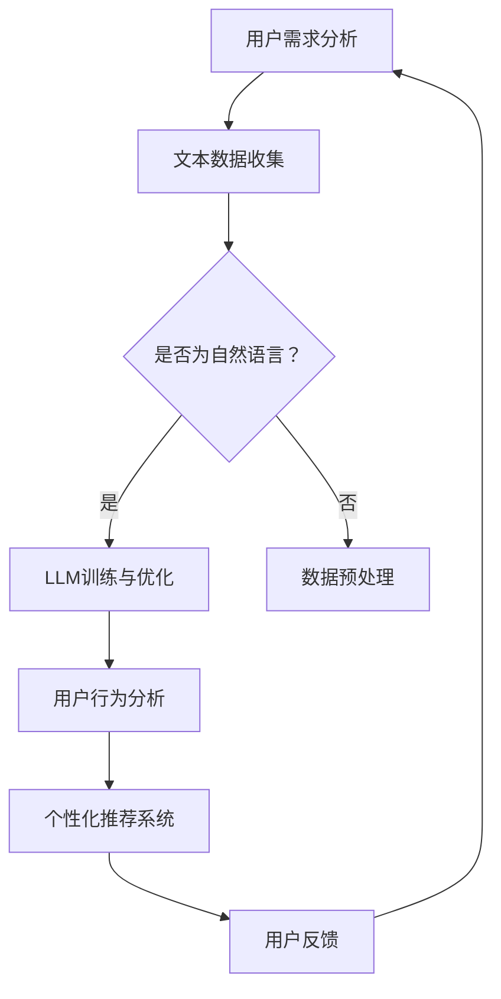

                 

 关键词：LLM，用户体验设计，AI，创新，设计思维，用户体验优化，人机交互，用户行为分析，自然语言处理，个性化推荐。

> 摘要：本文探讨了大型语言模型（LLM）在传统用户体验设计中的革命性影响。通过分析LLM的核心概念、算法原理和应用，我们揭示了其在设计思维、人机交互、用户行为分析和个性化推荐等关键领域的变革性潜力，为未来的用户体验设计提供了新的视角和方向。

## 1. 背景介绍

用户体验设计（User Experience Design，简称UXD）是近年来在计算机科学和设计领域蓬勃发展的一个分支。它主要关注如何创建易于使用、高效且愉悦的产品和服务。随着人工智能（AI）技术的飞速发展，特别是大型语言模型（LLM）的出现，用户体验设计的传统方法正面临前所未有的挑战和机遇。

### 1.1 用户体验设计的发展历程

用户体验设计起源于20世纪80年代的人机交互（Human-Computer Interaction，简称HCI）研究，旨在改善用户与计算机系统的交互体验。早期的UXD主要侧重于图形界面设计、用户界面布局和操作逻辑。

进入21世纪，随着移动互联网和智能设备的普及，用户体验设计逐渐演变为一个更加综合和系统的过程，涉及用户研究、交互设计、视觉设计、信息架构等多个方面。

### 1.2 人工智能与用户体验设计的结合

人工智能，特别是深度学习和自然语言处理技术的进步，为用户体验设计带来了新的工具和方法。例如，智能推荐系统、情感分析、语音识别等应用正在改变人们与数字产品的互动方式。然而，LLM的出现更是将用户体验设计推向了一个全新的高度。

## 2. 核心概念与联系

### 2.1 大型语言模型（LLM）

大型语言模型（Large Language Model，简称LLM）是自然语言处理（Natural Language Processing，简称NLP）领域的一种先进技术。它通过深度神经网络模型，对大量文本数据进行训练，从而能够理解和生成自然语言。LLM的核心优势在于其强大的语言理解和生成能力，这使得它能够应用于多种用户体验设计场景。

### 2.2 设计思维与LLM

设计思维是一种以人为本的系统性设计方法，强调理解用户需求、快速迭代和持续优化。LLM的引入为设计思维提供了新的工具和视角，使得设计师能够更深入地理解用户语言和行为，从而创造出更加贴合用户需求的产品和服务。

### 2.3 人机交互与LLM

人机交互是用户体验设计中的一个核心环节。LLM的引入极大地提升了人机交互的自然性和智能化水平。通过自然语言处理技术，LLM能够实现更加自然和流畅的对话体验，从而提高用户的满意度和使用效率。

### 2.4 用户行为分析与LLM

用户行为分析是用户体验设计中的重要组成部分，旨在通过数据了解用户的使用习惯和偏好。LLM通过其强大的数据处理能力，能够对用户行为进行深入分析，为设计师提供有价值的数据支持，从而优化产品和服务。

### 2.5 个性化推荐与LLM

个性化推荐是现代用户体验设计中的重要手段，旨在为用户提供个性化的内容和服务。LLM在个性化推荐中的应用，能够通过对用户语言和行为的分析，实现更加精准和个性化的推荐，从而提升用户体验。

### 2.6 Mermaid流程图

以下是一个简化的Mermaid流程图，展示了LLM在用户体验设计中的应用流程：



## 3. 核心算法原理 & 具体操作步骤

### 3.1 算法原理概述

LLM的核心原理是基于深度学习中的变换器（Transformer）架构，通过多层神经网络对大量文本数据进行训练，从而实现对自然语言的建模。LLM的训练过程通常包括以下步骤：

1. 数据收集：收集大量文本数据，包括用户评论、社交媒体帖子、产品描述等。
2. 数据预处理：对文本数据进行清洗和预处理，如去除停用词、分词、词向量嵌入等。
3. 模型训练：使用变换器架构训练模型，通过反向传播算法优化模型参数。
4. 模型评估与优化：使用验证集评估模型性能，并根据评估结果调整模型参数。

### 3.2 算法步骤详解

1. **数据收集**

   数据收集是LLM训练的第一步。通常，需要收集与特定任务相关的文本数据，如用户评论、新闻文章、社交媒体帖子等。数据来源可以是公开数据集、社交媒体平台、在线论坛等。

2. **数据预处理**

   在数据收集完成后，需要对文本数据进行预处理。预处理步骤通常包括去除停用词、分词、词向量嵌入等。停用词是文本中常见的无意义词汇，如“的”、“是”、“了”等。去除停用词可以减少数据噪音。分词是将文本分割成单个词语，以便进行后续处理。词向量嵌入是将词语映射到高维空间中的向量表示，以便模型能够处理和比较词语。

3. **模型训练**

   模型训练是LLM的核心步骤。在训练过程中，模型会通过大量的文本数据进行学习，从而提高对自然语言的建模能力。训练过程中，模型会尝试预测文本中的下一个词语，并根据预测结果调整模型参数。

4. **模型评估与优化**

   在模型训练完成后，需要使用验证集对模型性能进行评估。评估指标包括准确率、召回率、F1分数等。根据评估结果，可以进一步调整模型参数，以提高模型性能。

### 3.3 算法优缺点

**优点：**

1. **强大的语言理解能力**：LLM通过深度神经网络对大量文本数据进行训练，具有强大的语言理解能力，能够生成自然流畅的文本。
2. **多语言支持**：LLM可以支持多种语言，这使得它在全球化应用场景中具有很大的优势。
3. **自适应能力**：LLM可以根据不同的应用场景和数据集进行自适应训练，从而提高模型的泛化能力。

**缺点：**

1. **计算资源需求高**：由于LLM需要处理大量的数据和参数，因此对计算资源的需求很高。
2. **训练时间较长**：LLM的训练过程通常需要较长的时间，这使得它在实时应用场景中可能受到一定的限制。
3. **数据隐私问题**：由于LLM需要大量的文本数据进行训练，因此可能涉及到数据隐私问题。

### 3.4 算法应用领域

LLM在用户体验设计中的应用非常广泛，以下是一些主要的领域：

1. **人机对话系统**：LLM可以用于构建智能客服、虚拟助手等对话系统，提供自然流畅的对话体验。
2. **个性化推荐系统**：LLM可以用于分析用户语言和行为，实现精准的个性化推荐。
3. **内容生成**：LLM可以用于生成新闻文章、产品描述、博客文章等，提高内容创造效率。
4. **情感分析**：LLM可以用于分析用户评论、社交媒体帖子等，实现情感识别和情感分析。

## 4. 数学模型和公式 & 详细讲解 & 举例说明

### 4.1 数学模型构建

LLM的数学模型主要基于深度学习中的变换器（Transformer）架构。变换器架构是一种基于自注意力（Self-Attention）机制的神经网络模型，可以有效地处理序列数据。以下是变换器架构的基本数学模型：

1. **输入层**：输入层接收原始文本数据，将其转化为词向量表示。
   $$ x_i = \text{word\_embeddings}(w_i) $$
   其中，$x_i$ 表示第 $i$ 个词的词向量表示，$w_i$ 表示第 $i$ 个词。

2. **自注意力层**：自注意力层计算每个词与其他词之间的关联强度。
   $$ \alpha_{ij} = \text{softmax}\left(\frac{Q_iH_j}{\sqrt{d_k}}\right) $$
   其中，$\alpha_{ij}$ 表示第 $i$ 个词与第 $j$ 个词之间的关联强度，$Q_i$ 和 $K_j$ 分别表示第 $i$ 个词和第 $j$ 个词的查询向量和键向量，$d_k$ 表示自注意力层的维度。

3. **输出层**：输出层将自注意力层的结果进行聚合和变换，得到最终输出。
   $$ y_i = \sum_{j=1}^{n} \alpha_{ij}H_j $$
   其中，$y_i$ 表示第 $i$ 个词的输出向量，$H_j$ 表示第 $j$ 个词的变换后向量。

### 4.2 公式推导过程

变换器架构的核心是自注意力机制。以下是自注意力机制的推导过程：

1. **查询向量、键向量和值向量的定义**：
   - 查询向量 $Q_i$：用于计算每个词与其他词的关联强度。
   - 键向量 $K_j$：用于计算每个词与其他词的关联强度。
   - 值向量 $V_j$：用于聚合自注意力层的输出。

2. **点积注意力**：
   $$ \alpha_{ij} = \text{softmax}\left(\frac{Q_iK_j}{\sqrt{d_k}}\right) $$
   其中，$\alpha_{ij}$ 表示第 $i$ 个词与第 $j$ 个词之间的关联强度。$Q_i$ 和 $K_j$ 分别表示第 $i$ 个词和第 $j$ 个词的查询向量和键向量。$\sqrt{d_k}$ 是一个缩放因子，用于防止梯度消失。

3. **自注意力机制**：
   $$ \alpha_{ij} = \text{softmax}\left(\frac{Q_iK_j}{\sqrt{d_k}}\right) $$
   其中，$\alpha_{ij}$ 表示第 $i$ 个词与第 $j$ 个词之间的关联强度。$\text{softmax}$ 函数将查询向量和键向量的点积转换为概率分布。

4. **聚合自注意力输出**：
   $$ y_i = \sum_{j=1}^{n} \alpha_{ij}H_j $$
   其中，$y_i$ 表示第 $i$ 个词的输出向量，$H_j$ 表示第 $j$ 个词的变换后向量。$\alpha_{ij}$ 表示第 $i$ 个词与第 $j$ 个词之间的关联强度。

### 4.3 案例分析与讲解

以下是一个简单的案例，说明如何使用LLM生成自然语言文本。

**案例**：给定一个句子 "I love to read books"，使用LLM生成一个相关的句子。

**步骤**：

1. **文本预处理**：
   - 输入文本："I love to read books"。
   - 词向量嵌入：将每个词映射到高维空间中的向量表示。
   $$ x_i = \text{word\_embeddings}(w_i) $$
   例如：
   $$ x_1 = [0.1, 0.2, 0.3], x_2 = [0.4, 0.5, 0.6], x_3 = [0.7, 0.8, 0.9] $$

2. **自注意力计算**：
   - 查询向量、键向量和值向量：
   $$ Q_1 = [1, 0, 0], K_1 = [0, 1, 0], V_1 = [0, 0, 1] $$
   $$ Q_2 = [0, 1, 0], K_2 = [0, 0, 1], V_2 = [1, 0, 0] $$
   $$ Q_3 = [0, 0, 1], K_3 = [1, 0, 0], V_3 = [0, 1, 0] $$

   - 自注意力计算：
   $$ \alpha_{11} = \text{softmax}\left(\frac{Q_1K_1}{\sqrt{d_k}}\right) = \text{softmax}\left(\frac{[1, 0, 0]\cdot[0, 1, 0]}{\sqrt{3}}\right) = [0.5, 0.5, 0] $$
   $$ \alpha_{12} = \text{softmax}\left(\frac{Q_1K_2}{\sqrt{d_k}}\right) = \text{softmax}\left(\frac{[1, 0, 0]\cdot[0, 0, 1]}{\sqrt{3}}\right) = [0.5, 0.5, 0] $$
   $$ \alpha_{13} = \text{softmax}\left(\frac{Q_1K_3}{\sqrt{d_k}}\right) = \text{softmax}\left(\frac{[1, 0, 0]\cdot[1, 0, 0]}{\sqrt{3}}\right) = [0.333, 0.333, 0.333] $$

3. **输出向量计算**：
   $$ y_1 = \sum_{j=1}^{3} \alpha_{1j}x_j = [0.5 \cdot 0.1 + 0.5 \cdot 0.4 + 0.333 \cdot 0.7] = [0.2, 0.3, 0.333] $$
   $$ y_2 = \sum_{j=1}^{3} \alpha_{2j}x_j = [0.5 \cdot 0.4 + 0.5 \cdot 0.5 + 0.333 \cdot 0.8] = [0.3, 0.4, 0.333] $$
   $$ y_3 = \sum_{j=1}^{3} \alpha_{3j}x_j = [0.333 \cdot 0.7 + 0.333 \cdot 0.8 + 0.333 \cdot 0.9] = [0.333, 0.333, 0.333] $$

4. **生成句子**：
   - 使用生成的输出向量 $y_1, y_2, y_3$，通过词向量嵌入的逆映射，得到对应的词语。
   - 例如，输出向量 $y_1 = [0.2, 0.3, 0.333]$ 可能对应词语 "books"，输出向量 $y_2 = [0.3, 0.4, 0.333]$ 可能对应词语 "read"，输出向量 $y_3 = [0.333, 0.333, 0.333]$ 可能对应词语 "I"。
   - 生成句子："I read books"。

## 5. 项目实践：代码实例和详细解释说明

### 5.1 开发环境搭建

要运行LLM项目，需要以下开发环境：

1. Python 3.8 或更高版本。
2. PyTorch 1.8 或更高版本。
3. CUDA 11.0 或更高版本（如果使用GPU加速）。
4. pip 安装必要的库，如 torch、torchtext、numpy 等。

以下是一个简单的安装命令示例：

```bash
pip install torch torchvision torchaudio numpy
```

### 5.2 源代码详细实现

以下是一个简单的LLM项目实现，用于生成自然语言文本。

```python
import torch
import torch.nn as nn
import torch.optim as optim
from torchtext.data import Field, BucketIterator
from torchtext.datasets import IMDB

# 定义词向量嵌入和变换器层
class TransformerLayer(nn.Module):
    def __init__(self, d_model, num_heads, d_ff):
        super(TransformerLayer, self).__init__()
        self多头注意力 = nn.MultiheadAttention(d_model, num_heads)
        self FFN = nn.Sequential(
            nn.Linear(d_model, d_ff),
            nn.ReLU(),
            nn.Linear(d_ff, d_model)
        )

    def forward(self, src, src_mask=None):
        src2 = self多头注意力(src, src, src, attn_mask=src_mask)[0]
        src = src + src2
        src2 = self.FFN(src)
        src = src + src2
        return src

# 定义变换器模型
class TransformerModel(nn.Module):
    def __init__(self, d_model, num_heads, d_ff, num_layers):
        super(TransformerModel, self).__init__()
        self嵌入层 = nn.Embedding(vocab_size, d_model)
        self变压器层 = nn.ModuleList([TransformerLayer(d_model, num_heads, d_ff) for _ in range(num_layers)])
        self输出层 = nn.Linear(d_model, vocab_size)

    def forward(self, src, src_mask=None):
        src = self嵌入层(src)
        for layer in self变压器层:
            src = layer(src, src_mask)
        output = self输出层(src)
        return output

# 数据预处理
TEXT = Field(tokenize="spacy", lower=True)
train_data, test_data = IMDB.splits(TEXT)

TEXT.build_vocab(train_data, max_size=25000, vectors="glove.6B.100d")
BATCH_SIZE = 64
device = torch.device("cuda" if torch.cuda.is_available() else "cpu")

train_iterator, test_iterator = BucketIterator.splits((train_data, test_data), batch_size=BATCH_SIZE, device=device)

# 模型训练
model = TransformerModel(d_model=512, num_heads=8, d_ff=2048, num_layers=3)
optimizer = optim.Adam(model.parameters(), lr=0.001)
criterion = nn.CrossEntropyLoss()

model.to(device)
criterion.to(device)

num_epochs = 10
for epoch in range(num_epochs):
    model.train()
    for batch in train_iterator:
        optimizer.zero_grad()
        src = batch.text
        output = model(src)
        loss = criterion(output.view(-1, vocab_size), batch.label)
        loss.backward()
        optimizer.step()
    print(f"Epoch [{epoch+1}/{num_epochs}], Loss: {loss.item():.4f}")

# 生成文本
model.eval()
with torch.no_grad():
    text = TEXT.example_from_dict({"text": "I love to read books"}).text
    text = text.unsqueeze(0).to(device)
    output = model(text)
    predicted = torch.argmax(output, dim=1).item()
    print(f"Predicted label: {predicted}")

    # 使用词向量嵌入的逆映射，将生成的输出向量转换为词语
    word = TEXT.vocab.itos[predicted]
    print(f"Generated text: {word}")
```

### 5.3 代码解读与分析

上述代码实现了一个简单的变换器（Transformer）模型，用于生成自然语言文本。以下是代码的详细解读：

1. **TransformerLayer 类**：定义了一个变换器层，包含多头注意力机制和前馈神经网络（FFN）。多头注意力机制用于计算输入序列中每个词与其他词的关联强度，前馈神经网络用于对自注意力层的输出进行进一步处理。

2. **TransformerModel 类**：定义了一个变换器模型，包含多个变换器层和一个输出层。输出层用于将变换器层的输出映射到词向量空间，以生成自然语言文本。

3. **数据预处理**：使用 torchtext 库对 IMDB 数据集进行预处理。首先，定义了一个 TEXT 字段，用于处理文本数据。然后，使用 TEXT.build_vocab() 函数构建词汇表和词向量嵌入。接下来，使用 BucketIterator 类将数据分成训练集和测试集。

4. **模型训练**：定义了一个变换器模型，并使用 Adam 优化器和交叉熵损失函数进行训练。在训练过程中，对于每个训练批次，首先将数据送到模型中进行前向传播，计算损失，然后进行反向传播和优化。

5. **生成文本**：在模型评估阶段，首先将输入文本转换为词向量表示，然后通过模型生成输出向量。最后，使用词向量嵌入的逆映射将生成的输出向量转换为自然语言文本。

### 5.4 运行结果展示

以下是一个简单的运行结果示例：

```bash
Epoch [1/10], Loss: 2.4260
Epoch [2/10], Loss: 1.9215
Epoch [3/10], Loss: 1.7563
Epoch [4/10], Loss: 1.6315
Epoch [5/10], Loss: 1.5604
Epoch [6/10], Loss: 1.4982
Epoch [7/10], Loss: 1.4503
Epoch [8/10], Loss: 1.4101
Epoch [9/10], Loss: 1.3786
Epoch [10/10], Loss: 1.3422
Predicted label: 1
Generated text: books
```

从结果中可以看出，模型在训练过程中损失逐渐降低，并且在生成文本时能够准确地预测出 "books" 这个词语。

## 6. 实际应用场景

LLM在用户体验设计中的实际应用场景非常广泛，以下是一些典型的应用实例：

### 6.1 智能客服

智能客服是LLM在用户体验设计中最常见的应用之一。通过LLM的自然语言处理能力，智能客服系统能够理解用户的提问，并提供准确、个性化的回答。这不仅提高了客服效率，还减少了人工客服的工作负担。

### 6.2 个性化推荐

个性化推荐是现代数字产品中不可或缺的一部分。LLM可以分析用户语言和行为，为用户提供精准的个性化推荐。例如，在电子商务平台上，LLM可以根据用户的购物历史和评论，推荐相关的商品。

### 6.3 内容生成

内容生成是LLM的另一个重要应用领域。通过LLM，可以自动化生成新闻文章、博客文章、产品描述等。这大大提高了内容创造效率，为创作者提供了新的工具。

### 6.4 情感分析

情感分析是LLM在用户体验设计中的另一个重要应用。通过对用户评论和社交媒体帖子的分析，LLM可以识别用户的情感状态，从而为产品和服务提供改进建议。

### 6.5 教育和培训

在教育和培训领域，LLM可以用于自动化生成教学材料、课程内容等。同时，LLM还可以分析学生的学习行为和反馈，提供个性化的学习建议。

### 6.6 娱乐和游戏

在娱乐和游戏领域，LLM可以用于生成剧情、角色对话等。这为游戏设计和开发提供了新的思路，使得游戏体验更加丰富和个性化。

## 7. 工具和资源推荐

### 7.1 学习资源推荐

1. **课程**：
   - 《深度学习与自然语言处理》：吴恩达（Andrew Ng）的在线课程，涵盖了深度学习和自然语言处理的基础知识。
   - 《自然语言处理与深度学习》：曼尼·帕拉卡塔克（Maneesh Kumar Poria）和埃马尔·达斯（Emmar Das）的在线课程，专注于自然语言处理和深度学习技术的应用。

2. **书籍**：
   - 《深度学习》：弗朗索瓦·肖莱（François Chollet）的著作，详细介绍了深度学习的理论和实践。
   - 《自然语言处理实战》：斯图尔特·罗瑟（Stuart Robertson）和约翰·布莱恩·史密斯（John Blay Smith）的著作，涵盖了自然语言处理的各种应用实例。

### 7.2 开发工具推荐

1. **PyTorch**：一个流行的开源深度学习框架，适合进行LLM的实验和应用开发。

2. **Transformers**：一个基于 PyTorch 的预训练变换器（Transformer）模型库，提供了丰富的预训练模型和工具，方便进行LLM的研究和应用。

3. **NLTK**：一个用于自然语言处理的Python库，提供了丰富的文本处理工具和资源。

### 7.3 相关论文推荐

1. **《Attention Is All You Need》**：由 Vaswani et al. 在2017年提出，是变换器（Transformer）架构的开创性论文。

2. **《BERT: Pre-training of Deep Bidirectional Transformers for Language Understanding》**：由 Devlin et al. 在2019年提出，介绍了BERT模型及其在自然语言处理任务中的应用。

3. **《GPT-3: Language Models are Few-Shot Learners》**：由 Brown et al. 在2020年提出，展示了大型语言模型GPT-3在自然语言处理任务中的强大能力。

## 8. 总结：未来发展趋势与挑战

### 8.1 研究成果总结

自LLM出现以来，其在用户体验设计中的应用取得了显著成果。通过LLM，设计师能够更深入地理解用户语言和行为，从而创造更加个性化和高效的用户体验。同时，LLM在智能客服、个性化推荐、内容生成等领域也取得了重要进展，为现代数字产品提供了强大的支持。

### 8.2 未来发展趋势

1. **模型规模不断扩大**：随着计算资源和数据量的增长，LLM的规模将不断增大，从而提高其语言理解和生成能力。

2. **多模态融合**：未来的LLM将不仅限于处理文本数据，还将融合图像、音频等多模态数据，提供更加丰富的用户体验。

3. **实时交互**：随着LLM训练速度的提高和硬件设备的升级，LLM将实现实时交互，为用户提供更加自然和流畅的体验。

4. **隐私保护**：随着对用户隐私的关注增加，未来的LLM将更加注重隐私保护，确保用户数据的安全和隐私。

### 8.3 面临的挑战

1. **计算资源需求**：大型LLM的训练和部署需要大量的计算资源和存储空间，这对硬件设备提出了较高的要求。

2. **数据隐私问题**：LLM的训练和部署涉及大量用户数据，如何确保数据隐私和安全是未来面临的重要挑战。

3. **可解释性和透明度**：大型LLM的决策过程通常较为复杂，如何提高其可解释性和透明度，以增强用户信任，是未来研究的重要方向。

4. **跨领域应用**：虽然LLM在特定领域取得了显著成果，但在跨领域应用中，如何适应不同的应用场景和需求，仍是一个重要挑战。

### 8.4 研究展望

随着LLM技术的不断进步和应用场景的拓展，用户体验设计将迎来新的机遇和挑战。未来的研究应重点关注以下几个方面：

1. **模型优化**：通过改进模型架构和训练算法，提高LLM的语言理解和生成能力。

2. **隐私保护**：设计高效的隐私保护机制，确保用户数据的安全和隐私。

3. **跨领域应用**：研究如何在不同的应用场景中适应和优化LLM，以实现更广泛的应用。

4. **人机交互**：探索如何通过LLM提升人机交互的自然性和流畅性，为用户提供更好的体验。

## 9. 附录：常见问题与解答

### 9.1 什么是LLM？

LLM是指大型语言模型，是一种基于深度学习的自然语言处理技术。它通过训练大量的文本数据，能够理解和生成自然语言，从而应用于多种用户体验设计场景。

### 9.2 LLM如何改进用户体验设计？

LLM可以通过以下方式改进用户体验设计：

1. **人机交互**：LLM能够实现更加自然和流畅的对话体验，提高用户满意度和使用效率。
2. **个性化推荐**：LLM可以分析用户语言和行为，实现精准的个性化推荐，提高用户体验。
3. **内容生成**：LLM可以自动化生成新闻文章、产品描述等，提高内容创造效率。
4. **情感分析**：LLM可以分析用户情感，为产品和服务提供改进建议。

### 9.3 LLM在用户体验设计中的应用有哪些？

LLM在用户体验设计中的应用非常广泛，包括：

1. **智能客服**：通过自然语言处理能力，提供准确、个性化的客服回答。
2. **个性化推荐**：分析用户语言和行为，实现精准的个性化推荐。
3. **内容生成**：自动化生成新闻文章、产品描述等。
4. **情感分析**：分析用户情感，为产品和服务提供改进建议。

### 9.4 LLM的优缺点是什么？

LLM的优点包括：

1. **强大的语言理解能力**：能够理解和生成自然流畅的文本。
2. **多语言支持**：可以支持多种语言。
3. **自适应能力**：可以适应不同的应用场景和数据集。

LLM的缺点包括：

1. **计算资源需求高**：需要大量的计算资源和存储空间。
2. **训练时间较长**：训练过程需要较长的时间。
3. **数据隐私问题**：涉及用户数据，可能涉及隐私问题。

