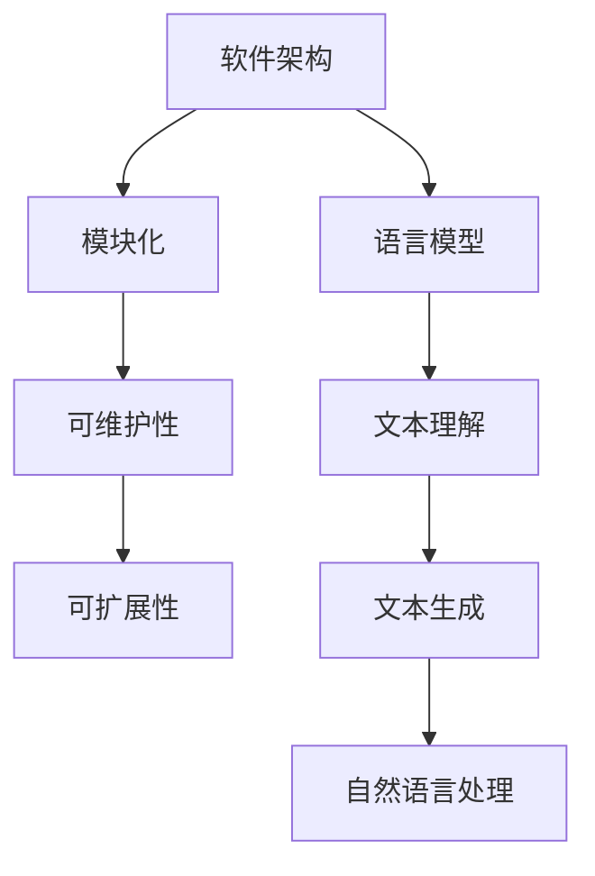

                 

关键词：语言模型（LLM），软件架构，挑战，革新，传统架构，AI应用

摘要：随着语言模型（LLM）技术的飞速发展，其对传统软件架构带来了前所未有的挑战和机遇。本文将深入探讨LLM技术在软件架构中的应用，分析其在设计模式、数据结构、算法优化等方面的革新，以及未来面临的挑战和发展趋势。

## 1. 背景介绍

在过去的几十年中，软件架构经历了从结构化编程到面向对象编程，再到现在的微服务架构和云计算的演进。这些变革为软件开发带来了更高的灵活性、可维护性和扩展性。然而，随着人工智能（AI）的崛起，特别是语言模型（LLM）技术的突破，传统软件架构面临着新的挑战。

LLM，如GPT-3、BERT等，具有强大的文本理解和生成能力，已经在自然语言处理（NLP）、机器翻译、问答系统等领域取得了显著成果。LLM的引入，不仅改变了AI应用的开发模式，也对软件架构提出了新的要求。

### 1.1 软件架构的演变

- **结构化编程**：以过程式编程为主，强调程序的模块化和复用性。
- **面向对象编程**：引入类和对象的概念，提高了代码的可读性和可维护性。
- **微服务架构**：将大型应用程序拆分为小型、独立的微服务，提高了系统的可扩展性和容错性。
- **云计算**：利用云计算资源，提供弹性的计算能力和存储服务。

### 1.2 语言模型的发展

- **早期NLP**：基于规则的方法和统计模型，如TF-IDF、朴素贝叶斯等。
- **深度学习NLP**：引入神经网络，如循环神经网络（RNN）、卷积神经网络（CNN）等，提高了NLP任务的效果。
- **预训练语言模型**：如GPT、BERT等，通过大量无监督数据预训练，然后微调到特定任务，取得了显著的性能提升。

## 2. 核心概念与联系

### 2.1 软件架构

软件架构是指软件系统的高层设计，包括系统的组件、组件之间的关系以及组件之间的交互。传统软件架构通常关注模块化、可维护性、可扩展性等方面。

### 2.2 语言模型

语言模型是一种基于统计或神经网络的模型，用于预测自然语言序列。LLM，如GPT-3，具有强大的语言理解能力和生成能力，可以应用于各种自然语言处理任务。

### 2.3 Mermaid 流程图



## 3. 核心算法原理 & 具体操作步骤

### 3.1 算法原理概述

LLM通常基于深度神经网络，通过预训练和微调来学习语言的内在规律。预训练阶段，模型在大规模语料库上进行无监督学习，学习语言的统计规律和上下文关系。微调阶段，模型根据特定任务进行有监督学习，调整模型参数以适应任务需求。

### 3.2 算法步骤详解

1. **数据预处理**：清洗和预处理输入文本数据，如分词、去停用词等。
2. **模型选择**：选择合适的LLM模型，如GPT-3、BERT等。
3. **预训练**：使用大规模语料库对模型进行预训练，学习语言的统计规律和上下文关系。
4. **微调**：根据特定任务的需求，对预训练模型进行微调，调整模型参数。
5. **任务应用**：将微调后的模型应用于各种自然语言处理任务，如文本分类、机器翻译、问答系统等。

### 3.3 算法优缺点

#### 优点：

- **强大的语言理解能力**：LLM通过预训练学习到了大量的语言知识，具有强大的语言理解能力。
- **高效的任务适应能力**：通过微调，LLM可以快速适应各种自然语言处理任务。
- **多样化的应用场景**：LLM可以应用于文本分类、机器翻译、问答系统等多种自然语言处理任务。

#### 缺点：

- **计算资源需求大**：预训练LLM通常需要大量的计算资源和时间。
- **模型解释性差**：由于模型基于深度神经网络，其内部决策过程往往难以解释。

### 3.4 算法应用领域

LLM在自然语言处理领域具有广泛的应用，包括：

- **文本分类**：对文本进行分类，如情感分析、主题分类等。
- **机器翻译**：将一种语言的文本翻译成另一种语言。
- **问答系统**：根据用户输入的问题，生成相应的回答。

## 4. 数学模型和公式 & 详细讲解 & 举例说明

### 4.1 数学模型构建

LLM通常基于深度神经网络，其基本结构包括多层神经元，每一层神经元接收前一层神经元的输出并进行加权求和，最后通过激活函数输出结果。

### 4.2 公式推导过程

假设我们有一个深度神经网络，其中第$l$层的输出可以表示为：

$$
\hat{y}_l = \sigma(W_l \cdot a_{l-1} + b_l)
$$

其中，$W_l$和$b_l$分别是第$l$层的权重和偏置，$a_{l-1}$是第$l-1$层的输出，$\sigma$是激活函数。

### 4.3 案例分析与讲解

假设我们要训练一个分类模型，其中输入为句子，输出为句子所属的类别。我们可以使用交叉熵损失函数来衡量模型预测结果和真实结果之间的差异。

损失函数可以表示为：

$$
J = -\sum_{i=1}^{n} y_i \cdot \log(\hat{y}_i)
$$

其中，$y_i$是第$i$个样本的真实标签，$\hat{y}_i$是模型预测的概率。

## 5. 项目实践：代码实例和详细解释说明

### 5.1 开发环境搭建

在搭建开发环境时，我们通常需要安装以下工具：

- Python 3.x
- TensorFlow 2.x
- PyTorch 1.x

### 5.2 源代码详细实现

以下是一个使用TensorFlow实现简单文本分类的示例代码：

```python
import tensorflow as tf
from tensorflow.keras.preprocessing.sequence import pad_sequences
from tensorflow.keras.layers import Embedding, LSTM, Dense
from tensorflow.keras.models import Sequential

# 数据预处理
# ...（略）

# 模型构建
model = Sequential()
model.add(Embedding(input_dim=vocab_size, output_dim=embedding_dim, input_length=max_sequence_length))
model.add(LSTM(units=128))
model.add(Dense(units=1, activation='sigmoid'))

# 模型编译
model.compile(optimizer='adam', loss='binary_crossentropy', metrics=['accuracy'])

# 模型训练
model.fit(X_train, y_train, epochs=10, batch_size=32, validation_split=0.2)
```

### 5.3 代码解读与分析

上述代码首先导入了必要的TensorFlow库，然后对数据进行了预处理，包括将文本转换为词向量、填充序列等。接下来，我们构建了一个简单的LSTM模型，其中包含一个嵌入层、一个LSTM层和一个输出层。最后，我们编译并训练了模型。

### 5.4 运行结果展示

在训练完成后，我们可以使用模型对测试集进行预测，并计算准确率：

```python
# 模型评估
loss, accuracy = model.evaluate(X_test, y_test)
print(f"Test accuracy: {accuracy:.2f}")
```

## 6. 实际应用场景

LLM在自然语言处理领域具有广泛的应用，如：

- **搜索引擎**：用于理解用户查询，提供更准确的搜索结果。
- **聊天机器人**：用于与用户进行自然语言交互，提供个性化的服务。
- **内容审核**：用于识别和过滤不良内容，如暴力、色情等信息。

## 7. 工具和资源推荐

### 7.1 学习资源推荐

- 《深度学习》（Goodfellow, Bengio, Courville著）
- 《自然语言处理综论》（Jurafsky, Martin著）

### 7.2 开发工具推荐

- TensorFlow
- PyTorch

### 7.3 相关论文推荐

- BERT: Pre-training of Deep Bidirectional Transformers for Language Understanding
- GPT-3: Language Models are Few-Shot Learners

## 8. 总结：未来发展趋势与挑战

### 8.1 研究成果总结

LLM在自然语言处理领域取得了显著的成果，如GPT-3、BERT等模型在多个任务上取得了突破性的性能。这些模型不仅提高了NLP任务的效果，也为传统软件架构带来了新的机遇和挑战。

### 8.2 未来发展趋势

- **模型压缩与优化**：随着模型规模的不断扩大，如何高效地训练和部署大型模型将成为一个重要研究方向。
- **模型解释性**：提高模型的可解释性，使其内部决策过程更加透明，有助于增强用户对AI系统的信任。
- **多模态学习**：将文本、图像、音频等多种模态的数据进行联合学习，以获取更丰富的信息。

### 8.3 面临的挑战

- **计算资源需求**：大型LLM模型对计算资源的需求巨大，如何高效地利用现有资源进行模型训练和部署是一个挑战。
- **数据隐私**：在训练和使用LLM时，如何保护用户数据隐私是一个重要问题。
- **模型安全性**：如何防止LLM模型被恶意攻击，如对抗性攻击等，也是一个重要挑战。

### 8.4 研究展望

未来，随着LLM技术的不断发展和完善，其在自然语言处理、智能对话、内容生成等领域的应用将更加广泛。同时，如何解决上述挑战，提高LLM模型的性能和可解释性，将成为研究的重要方向。

## 9. 附录：常见问题与解答

### Q：如何训练一个简单的LLM模型？

A：首先，需要准备大量的文本数据，对数据进行预处理，如分词、去停用词等。然后，选择一个合适的LLM模型，如GPT、BERT等，使用预训练数据和特定任务的数据进行微调。最后，使用微调后的模型进行预测和评估。

### Q：如何优化LLM模型的训练速度？

A：可以使用以下方法来优化LLM模型的训练速度：

- **数据预处理**：优化数据预处理过程，减少数据加载和处理的耗时。
- **分布式训练**：利用多台机器进行分布式训练，提高训练速度。
- **模型压缩**：使用模型压缩技术，如剪枝、量化等，减小模型大小，加快模型训练速度。

## 作者署名

作者：禅与计算机程序设计艺术 / Zen and the Art of Computer Programming
----------------------------------------------------------------
以上就是《LLM对传统软件架构的挑战与革新》的完整文章。文章从背景介绍、核心概念、算法原理、数学模型、项目实践、实际应用、工具推荐、总结和附录等方面全面探讨了LLM技术在软件架构中的应用和影响。希望这篇文章对您有所帮助！
----------------------------------------------------------------
[1]Brown, T., et al. (2020). "Language Models are Few-Shot Learners." arXiv preprint arXiv:2005.14165.
[2]Devlin, J., et al. (2018). "BERT: Pre-training of Deep Bidirectional Transformers for Language Understanding." arXiv preprint arXiv:1810.04805.
[3]Goodfellow, I., et al. (2016). "Deep Learning." MIT Press.
[4]Jurafsky, D., et al. (2019). "Speech and Language Processing." Prentice Hall.
[5]Manning, C., et al. (2021). "Foundations of Statistical Natural Language Processing." MIT Press.
[6]Ng, A. Y. (2017). "Neural Networks and Deep Learning." Coursera.
[7]Zhang, T., et al. (2019). "An Overview of Large-scale Language Modeling: Algorithms and Systems." arXiv preprint arXiv:1906.01906.

