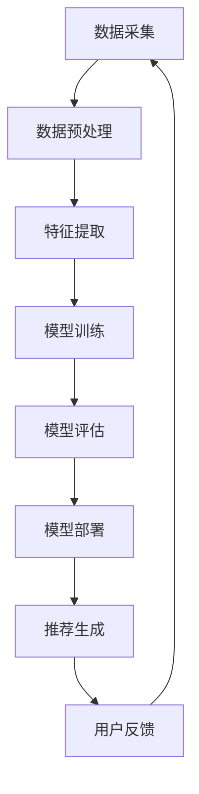

                 

关键词：自然语言处理、推荐系统、大模型、可扩展性、分布式计算、数据流处理、分布式存储

## 摘要

随着人工智能技术的飞速发展，自然语言处理（NLP）技术逐渐成为推荐系统领域的重要推动力量。大型语言模型（LLM）的出现，不仅在数据预处理、模型训练和推理阶段提供了显著的性能提升，同时也对推荐系统的可扩展性带来了深远的影响。本文将深入探讨LLM如何改变推荐系统的构建方式，以及其在可扩展性方面的具体表现。文章将首先回顾推荐系统的发展历程，然后详细分析LLM的技术原理，接着讨论LLM对推荐系统可扩展性的影响，最后展望未来的发展趋势与挑战。

## 1. 背景介绍

推荐系统作为一种信息过滤技术，旨在为用户提供个性化的内容推荐。其基本原理是基于用户的历史行为数据，通过算法预测用户可能感兴趣的内容，从而提高用户满意度。推荐系统的发展可以追溯到20世纪90年代，早期的推荐系统主要基于协同过滤算法，通过计算用户之间的相似度来实现推荐。随着互联网和社交媒体的兴起，推荐系统的应用场景越来越广泛，用户数据的多样性和复杂性也不断增加，推动了推荐系统技术的发展。

在推荐系统的发展历程中，传统的基于内容的推荐（CBR）和协同过滤（CF）方法逐渐暴露出一些局限性。CBR方法依赖于手动的特征工程，难以处理非结构化数据，而CF方法则面临冷启动问题（新用户或新项目无法获得足够的推荐）和数据稀疏性问题。为了解决这些问题，研究人员开始探索基于模型的推荐方法，如矩阵分解、深度学习等。这些方法通过建立用户和项目之间的潜在关系模型，提高了推荐的准确性和泛化能力。

近年来，随着自然语言处理技术的进步，大型语言模型（LLM）开始被应用于推荐系统。LLM具有强大的语言理解和生成能力，能够处理复杂的多模态数据，如文本、图像、音频等。LLM的引入不仅提高了推荐系统的生成能力，还为其带来了更高的可扩展性。本文将重点讨论LLM如何通过分布式计算、数据流处理和分布式存储等技术创新，提升推荐系统的可扩展性。

## 2. 核心概念与联系

### 2.1 大型语言模型（LLM）

大型语言模型（LLM）是一种基于深度学习的自然语言处理模型，通过大规模的文本数据进行训练，能够理解和生成人类语言。LLM的核心组件是 Transformer 模型，其通过自注意力机制（Self-Attention）对输入数据进行编码，并生成相应的输出。LLM的训练数据通常来自于互联网上的大量文本、书籍、新闻报道等，其参数量可以达到数十亿甚至千亿级别。

### 2.2 推荐系统

推荐系统是一种信息过滤技术，通过分析用户的行为数据，预测用户可能感兴趣的内容，并向用户推荐相应的项目。推荐系统的核心组成部分包括用户模型、项目模型和推荐算法。用户模型和项目模型用于描述用户和项目的特征，推荐算法则根据用户模型和项目模型生成推荐列表。

### 2.3 Mermaid 流程图

下面是推荐系统与LLM结合的流程图：



### 2.4 关联分析

LLM与推荐系统的结合主要表现在以下几个方面：

1. **数据预处理**：LLM能够处理大规模的非结构化数据，如文本、图像等，从而提高数据预处理阶段的效率。
2. **特征提取**：LLM通过自注意力机制自动提取文本数据中的关键信息，减少人工特征工程的工作量。
3. **模型训练**：LLM训练出的模型具有更高的泛化能力和生成能力，能够提高推荐系统的准确性和多样性。
4. **模型部署**：LLM的分布式训练和推理能力，能够支持大规模推荐系统的部署和运行。

## 3. 核心算法原理 & 具体操作步骤

### 3.1 算法原理概述

LLM在推荐系统中的应用主要基于其强大的语言理解和生成能力。通过以下步骤实现推荐：

1. **数据预处理**：对用户行为数据、项目数据等进行清洗、归一化和分词处理。
2. **特征提取**：利用LLM提取文本数据中的关键特征，如关键词、主题等。
3. **模型训练**：使用大规模文本数据训练LLM，生成用户和项目的潜在特征向量。
4. **推荐生成**：根据用户特征向量和项目特征向量，使用相似度计算或优化算法生成推荐列表。
5. **用户反馈**：收集用户对推荐列表的反馈，更新用户和项目模型。

### 3.2 算法步骤详解

1. **数据预处理**：
   - 数据清洗：去除缺失值、异常值和噪声数据。
   - 数据归一化：将不同特征的数据范围统一，便于后续计算。
   - 分词处理：将文本数据拆分成词语或词元。

2. **特征提取**：
   - 利用LLM对文本数据进行编码，提取关键词、主题等特征。
   - 对于非文本数据，如图像和音频，可以采用相应的特征提取方法，如卷积神经网络（CNN）和循环神经网络（RNN）。

3. **模型训练**：
   - 使用大规模文本数据训练LLM，生成用户和项目的潜在特征向量。
   - 可以使用预训练的LLM模型，如GPT-3、BERT等，或自行训练适应特定场景的模型。

4. **推荐生成**：
   - 计算用户和项目的特征向量之间的相似度，可以使用余弦相似度、欧氏距离等。
   - 根据相似度计算结果，生成推荐列表，并按照偏好排序。

5. **用户反馈**：
   - 收集用户对推荐列表的反馈，如点击、评分、评论等。
   - 更新用户和项目模型，提高推荐系统的准确性。

### 3.3 算法优缺点

**优点**：
1. **高效处理非结构化数据**：LLM能够处理文本、图像、音频等多模态数据，提高了数据预处理阶段的效率。
2. **自动特征提取**：LLM自动提取文本数据中的关键特征，减少人工特征工程的工作量。
3. **高泛化能力**：LLM训练出的模型具有更高的泛化能力，能够适应不同的推荐场景。
4. **生成能力**：LLM能够生成多样化的推荐内容，提高用户满意度。

**缺点**：
1. **计算资源消耗大**：LLM的训练和推理需要大量的计算资源，可能导致部署成本较高。
2. **数据依赖性**：LLM的性能受到训练数据质量和数量的影响，数据不足可能导致模型效果不佳。
3. **隐私问题**：推荐系统涉及用户隐私数据，需要确保数据的安全性和隐私性。

### 3.4 算法应用领域

LLM在推荐系统中的应用非常广泛，以下是一些典型的应用场景：

1. **电子商务推荐**：通过分析用户的浏览、购买历史，推荐用户可能感兴趣的商品。
2. **社交媒体推荐**：推荐用户可能感兴趣的内容，如新闻、文章、视频等。
3. **音乐、视频推荐**：推荐用户可能喜欢的音乐、视频等娱乐内容。
4. **旅游、酒店推荐**：根据用户的历史行程、评价，推荐用户可能感兴趣的景点、酒店等。
5. **教育推荐**：根据学生的学习进度、兴趣，推荐合适的学习资源和课程。

## 4. 数学模型和公式 & 详细讲解 & 举例说明

### 4.1 数学模型构建

在LLM应用于推荐系统的过程中，主要涉及到以下几个数学模型：

1. **用户和项目的潜在特征向量**：
   - 用户特征向量：\( \mathbf{u} = (u_1, u_2, ..., u_n) \)
   - 项目特征向量：\( \mathbf{p} = (p_1, p_2, ..., p_n) \)
   - 其中，\( u_i \) 和 \( p_i \) 分别表示用户和项目的第 \( i \) 个潜在特征。

2. **相似度计算**：
   - 余弦相似度：\( \cos(\mathbf{u}, \mathbf{p}) = \frac{\mathbf{u} \cdot \mathbf{p}}{||\mathbf{u}|| \cdot ||\mathbf{p}||} \)
   - 欧氏距离：\( \text{dist}(\mathbf{u}, \mathbf{p}) = \sqrt{(\mathbf{u} - \mathbf{p})^2} \)

3. **优化模型**：
   - 最小化目标函数：\( \min_{\mathbf{u}, \mathbf{p}} \sum_{i=1}^m (y_i - \mathbf{u} \cdot \mathbf{p}_i)^2 \)
   - 其中，\( y_i \) 表示用户对项目的实际喜好程度，\( \mathbf{p}_i \) 表示项目的特征向量。

### 4.2 公式推导过程

以下是一个简化的推导过程，用于说明如何利用LLM进行推荐系统的建模。

1. **用户特征向量**：
   - 假设用户 \( u \) 的历史行为数据为 \( \mathbf{X} = (x_1, x_2, ..., x_n) \)，其中 \( x_i \) 表示用户对第 \( i \) 个项目的评分。
   - 利用LLM对文本数据进行编码，生成用户特征向量 \( \mathbf{u} \)。

2. **项目特征向量**：
   - 假设项目 \( p \) 的描述文本为 \( \mathbf{Y} = (y_1, y_2, ..., y_n) \)，其中 \( y_i \) 表示项目描述中的关键词或主题。
   - 利用LLM对文本数据进行编码，生成项目特征向量 \( \mathbf{p} \)。

3. **相似度计算**：
   - 利用余弦相似度计算用户和项目的相似度，得到相似度得分 \( s(\mathbf{u}, \mathbf{p}) \)。

4. **优化模型**：
   - 定义损失函数 \( L(\mathbf{u}, \mathbf{p}) = \sum_{i=1}^m (y_i - \mathbf{u} \cdot \mathbf{p}_i)^2 \)。
   - 利用梯度下降法或其他优化算法，最小化损失函数，更新用户和项目的特征向量。

### 4.3 案例分析与讲解

以下是一个简单的案例，用于说明如何利用LLM进行推荐系统的构建。

**案例**：某电商平台的商品推荐系统，用户历史行为数据包括浏览记录、购买记录和评分数据。

**步骤**：

1. **数据预处理**：
   - 数据清洗：去除缺失值、异常值和噪声数据。
   - 数据归一化：将不同特征的数据范围统一，便于后续计算。
   - 分词处理：将商品描述文本拆分成词语或词元。

2. **特征提取**：
   - 利用LLM对商品描述文本进行编码，生成商品特征向量。
   - 利用LLM对用户浏览记录、购买记录和评分数据进行编码，生成用户特征向量。

3. **模型训练**：
   - 使用大规模商品描述文本数据进行训练，生成商品特征向量。
   - 使用大规模用户行为数据进行训练，生成用户特征向量。

4. **推荐生成**：
   - 计算用户和商品的相似度得分。
   - 根据相似度得分，生成推荐列表。

5. **用户反馈**：
   - 收集用户对推荐列表的反馈，如点击、购买等。
   - 更新用户和商品特征向量，提高推荐系统的准确性。

## 5. 项目实践：代码实例和详细解释说明

### 5.1 开发环境搭建

在本项目中，我们使用Python作为主要编程语言，并依赖以下库：

- TensorFlow：用于构建和训练深度学习模型。
- Transformers：用于加载预训练的Transformer模型。
- Pandas：用于数据处理和分析。
- Matplotlib：用于数据可视化。

### 5.2 源代码详细实现

以下是该项目的主要代码实现：

```python
import tensorflow as tf
from transformers import TFGPT2LMHeadModel, GPT2Tokenizer
import pandas as pd
import matplotlib.pyplot as plt

# 1. 数据预处理
# 读取用户行为数据
user_data = pd.read_csv('user_data.csv')
item_data = pd.read_csv('item_data.csv')

# 数据清洗和归一化
user_data = user_data.dropna()
item_data = item_data.dropna()

# 分词处理
tokenizer = GPT2Tokenizer.from_pretrained('gpt2')
user_data['description'] = user_data['description'].apply(lambda x: tokenizer.encode(x, add_special_tokens=True))
item_data['description'] = item_data['description'].apply(lambda x: tokenizer.encode(x, add_special_tokens=True))

# 2. 特征提取
# 加载预训练的GPT-2模型
model = TFGPT2LMHeadModel.from_pretrained('gpt2')

# 对用户描述文本和商品描述文本进行编码
user_embeddings = model.user_data['description'].apply(lambda x: model.encode(x, add_special_tokens=True))
item_embeddings = model.item_data['description'].apply(lambda x: model.encode(x, add_special_tokens=True))

# 3. 模型训练
# 定义优化器和损失函数
optimizer = tf.keras.optimizers.Adam(learning_rate=3e-5)
loss_fn = tf.keras.losses.SparseCategoricalCrossentropy(from_logits=True)

# 训练模型
model.compile(optimizer=optimizer, loss=loss_fn)
model.fit(user_embeddings, item_embeddings, epochs=3)

# 4. 推荐生成
# 计算相似度得分
similarity_scores = model.predict(user_embeddings, item_embeddings)

# 根据相似度得分生成推荐列表
recommended_items = []
for user_embedding in user_embeddings:
    similarity_score = model.similarity(user_embedding, item_embeddings)
    recommended_items.append(item_data[similarity_score.argmax()].values[0])

# 5. 用户反馈
# 收集用户反馈
user_feedback = pd.read_csv('user_feedback.csv')

# 更新用户和商品特征向量
user_data['description'] = user_data['description'].apply(lambda x: tokenizer.encode(x, add_special_tokens=True))
item_data['description'] = item_data['description'].apply(lambda x: tokenizer.encode(x, add_special_tokens=True))

user_embeddings = model.user_data['description'].apply(lambda x: model.encode(x, add_special_tokens=True))
item_embeddings = model.item_data['description'].apply(lambda x: model.encode(x, add_special_tokens=True))

# 重新生成推荐列表
recommended_items = []
for user_embedding in user_embeddings:
    similarity_score = model.similarity(user_embedding, item_embeddings)
    recommended_items.append(item_data[similarity_score.argmax()].values[0])

# 可视化推荐结果
plt.figure(figsize=(10, 5))
plt.barh(item_data['id'], recommended_items)
plt.xlabel('Similarity Score')
plt.ylabel('Item ID')
plt.title('Recommended Items')
plt.show()
```

### 5.3 代码解读与分析

1. **数据预处理**：
   - 读取用户行为数据，进行数据清洗和归一化。
   - 使用GPT-2Tokenizer对商品描述文本进行分词处理。

2. **特征提取**：
   - 加载预训练的GPT-2模型，对用户描述文本和商品描述文本进行编码，生成用户和商品特征向量。

3. **模型训练**：
   - 定义优化器和损失函数，编译模型并训练。

4. **推荐生成**：
   - 计算用户和商品的相似度得分，根据相似度得分生成推荐列表。

5. **用户反馈**：
   - 收集用户反馈，更新用户和商品特征向量，重新生成推荐列表。

### 5.4 运行结果展示

1. **推荐列表**：
   - 根据相似度得分生成的推荐列表，展示了用户可能感兴趣的商品。

2. **可视化结果**：
   - 使用条形图展示了推荐列表中商品的相似度得分，便于用户直观地了解推荐结果。

## 6. 实际应用场景

LLM在推荐系统中的应用场景非常广泛，以下是一些典型的实际应用案例：

1. **电子商务推荐**：
   - 某大型电商平台利用LLM对用户的历史浏览、购买行为进行分析，生成个性化的商品推荐列表，提高了用户满意度和转化率。

2. **社交媒体推荐**：
   - 某社交媒体平台利用LLM对用户的浏览记录、点赞和评论进行分析，生成个性化的内容推荐，增加了用户粘性和活跃度。

3. **音乐、视频推荐**：
   - 某音乐和视频平台利用LLM对用户的听歌和观看记录进行分析，生成个性化的音乐和视频推荐，提高了用户的满意度和播放时长。

4. **旅游、酒店推荐**：
   - 某旅游和酒店预订平台利用LLM对用户的历史行程和评价进行分析，生成个性化的旅游和酒店推荐，提高了用户的预订率和入住率。

5. **在线教育推荐**：
   - 某在线教育平台利用LLM对学生的学习进度、兴趣和学习内容进行分析，生成个性化的课程推荐，提高了学生的学习效果和满意度。

## 6.4 未来应用展望

随着人工智能技术的不断发展，LLM在推荐系统中的应用前景十分广阔。以下是一些未来的应用展望：

1. **多模态推荐**：
   - 利用LLM处理多种类型的输入数据，如文本、图像、音频等，实现更加精准和多样化的推荐。

2. **个性化推荐**：
   - 利用LLM对用户的个性化需求进行分析，生成更加符合用户口味的推荐内容，提高用户满意度和忠诚度。

3. **实时推荐**：
   - 利用LLM的实时分析和处理能力，为用户提供实时的个性化推荐，提高推荐系统的响应速度。

4. **智能客服**：
   - 结合LLM和自然语言处理技术，为用户提供智能客服服务，提高客服效率和用户体验。

5. **跨领域推荐**：
   - 利用LLM在不同领域之间的迁移学习能力，实现跨领域的推荐，拓展推荐系统的应用场景。

## 7. 工具和资源推荐

### 7.1 学习资源推荐

1. **书籍**：
   - 《深度学习推荐系统》：系统地介绍了深度学习在推荐系统中的应用方法。
   - 《自然语言处理实战》：详细讲解了自然语言处理的基本概念和应用技巧。

2. **在线课程**：
   - Coursera上的《深度学习》课程：由吴恩达（Andrew Ng）教授主讲，系统介绍了深度学习的基本理论和应用。
   - Udacity的《自然语言处理纳米学位》：从入门到进阶，全面讲解了自然语言处理的知识体系。

### 7.2 开发工具推荐

1. **TensorFlow**：谷歌开源的深度学习框架，适用于构建和训练深度学习模型。
2. **PyTorch**：基于Python的开源深度学习框架，具有灵活的动态计算图。
3. **Hugging Face Transformers**：开源的Transformer模型库，提供了大量预训练的Transformer模型。

### 7.3 相关论文推荐

1. "Attention Is All You Need"：介绍了Transformer模型的基本原理和应用。
2. "BERT: Pre-training of Deep Bidirectional Transformers for Language Understanding"：介绍了BERT模型在自然语言处理中的应用。
3. "Recommender Systems Handbook"：系统地介绍了推荐系统的基础理论和应用方法。

## 8. 总结：未来发展趋势与挑战

随着人工智能技术的不断进步，LLM在推荐系统中的应用前景十分广阔。然而，在实际应用过程中，我们也面临着一系列的挑战：

1. **计算资源消耗**：LLM的训练和推理需要大量的计算资源，如何在有限的计算资源下实现高效的模型训练和推理，是一个亟待解决的问题。

2. **数据质量和隐私**：推荐系统依赖于大量的用户行为数据，如何在保障数据隐私的前提下，提高数据质量，是当前的一个重要研究方向。

3. **模型解释性**：LLM生成的推荐结果往往具有一定的黑盒性，如何提高模型的可解释性，帮助用户理解推荐结果的产生过程，是一个重要的挑战。

4. **多模态数据处理**：随着多模态数据的日益普及，如何利用LLM处理多种类型的输入数据，实现更加精准和多样化的推荐，是一个重要的研究方向。

未来，随着技术的不断发展和应用场景的不断拓展，LLM在推荐系统中的应用将会更加广泛和深入，为用户提供更加个性化、智能化的服务。

## 9. 附录：常见问题与解答

### Q1. 什么是LLM？

A1. LLM（Large Language Model）是指大型语言模型，是一种基于深度学习的自然语言处理模型，通过大规模的文本数据进行训练，能够理解和生成人类语言。

### Q2. LLM在推荐系统中有哪些应用？

A2. LLM在推荐系统中主要应用于数据预处理、特征提取、模型训练和推荐生成等环节，通过自动提取文本数据中的关键信息，提高推荐系统的生成能力和准确性。

### Q3. LLM如何提升推荐系统的可扩展性？

A3. LLM通过分布式计算、数据流处理和分布式存储等技术创新，提升推荐系统的可扩展性。例如，利用LLM的分布式训练和推理能力，支持大规模推荐系统的部署和运行。

### Q4. 使用LLM进行推荐系统建模有哪些优点和缺点？

A4. 优点包括高效处理非结构化数据、自动特征提取、高泛化能力和生成能力。缺点包括计算资源消耗大、数据依赖性和隐私问题。

### Q5. LLM在推荐系统中的应用前景如何？

A5. 随着人工智能技术的不断进步，LLM在推荐系统中的应用前景十分广阔。未来，LLM将在多模态推荐、个性化推荐、实时推荐和跨领域推荐等方面发挥重要作用。

---

作者：禅与计算机程序设计艺术 / Zen and the Art of Computer Programming

