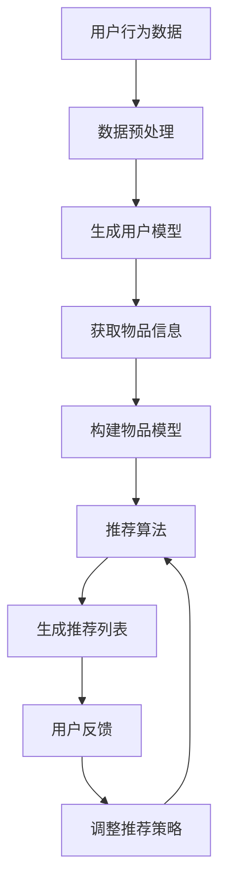

                 

 关键词：大语言模型（LLM），推荐系统，实时性能，大数据处理，算法优化，计算效率，服务质量

> 摘要：本文深入探讨了大型语言模型（LLM）在推荐系统中的应用及其对系统实时性能的影响。通过对LLM的核心概念、算法原理、数学模型以及实际应用场景的详细分析，本文旨在揭示LLM如何改变推荐系统的运作模式，提升其实时响应能力，并探讨在未来可能面临的技术挑战和前景。

## 1. 背景介绍

推荐系统作为现代互联网应用的核心组件，已经广泛应用于电子商务、社交媒体、在线娱乐等领域。其基本原理是通过分析用户的兴趣和行为，为用户提供个性化推荐。然而，随着数据量的爆炸式增长和用户需求的日益多样，推荐系统的实时性能成为一个亟待解决的问题。

传统的推荐系统多采用基于协同过滤、矩阵分解、决策树等算法。然而，这些算法在面对大规模数据集时，往往会出现计算效率低下、响应速度慢等问题。因此，如何在保证推荐质量的同时，提高推荐系统的实时性能，成为当前研究的热点。

近年来，大型语言模型（LLM）如GPT-3、ChatGPT等在自然语言处理领域取得了显著的突破。LLM具备强大的文本生成、理解和推理能力，使其成为推荐系统的重要候选技术。本文将探讨LLM在推荐系统中的应用及其对实时性能的影响，并展望未来的发展趋势。

## 2. 核心概念与联系

### 2.1. 推荐系统基础概念

推荐系统主要由用户模型、物品模型和推荐算法三部分组成。用户模型用于捕捉用户的兴趣和行为特征，物品模型则描述了物品的属性和标签，推荐算法则根据用户模型和物品模型生成推荐列表。

### 2.2. LLM核心概念

大型语言模型（LLM）是一种基于深度学习的自然语言处理模型，能够对自然语言文本进行生成、理解和推理。LLM的核心组件是自注意力机制，通过捕捉文本中的长距离依赖关系，实现对文本的精准处理。

### 2.3. LLM与推荐系统的联系

LLM在推荐系统中的应用主要体现在以下几个方面：

1. **文本生成与理解**：LLM可以生成个性化的推荐文案，提高用户的阅读体验。
2. **上下文感知**：LLM能够根据用户的历史行为和上下文信息，提供更加精准的推荐。
3. **动态调整**：LLM可以根据实时反馈，动态调整推荐策略，提高推荐系统的实时性能。

### 2.4. Mermaid 流程图

下面是一个简单的Mermaid流程图，展示了LLM在推荐系统中的应用流程。



## 3. 核心算法原理 & 具体操作步骤

### 3.1. 算法原理概述

LLM在推荐系统中的核心算法原理主要包括以下几个方面：

1. **文本生成**：基于用户的历史行为和兴趣，LLM可以生成个性化的推荐文案。
2. **上下文感知**：LLM能够根据上下文信息，动态调整推荐策略，提高推荐的相关性。
3. **动态调整**：LLM可以根据用户的实时反馈，动态调整推荐策略，优化用户体验。

### 3.2. 算法步骤详解

1. **数据预处理**：对用户行为数据进行清洗和转换，提取关键信息。
2. **生成用户模型**：基于用户的历史行为和兴趣，使用LLM生成用户模型。
3. **获取物品信息**：从数据库中获取物品的相关信息，包括属性、标签等。
4. **构建物品模型**：使用LLM对物品信息进行处理，构建物品模型。
5. **推荐算法**：根据用户模型和物品模型，使用推荐算法生成推荐列表。
6. **用户反馈**：收集用户的反馈信息，用于调整推荐策略。
7. **调整推荐策略**：基于用户反馈，使用LLM动态调整推荐策略。

### 3.3. 算法优缺点

**优点**：

1. **高效性**：LLM能够在短时间内处理大量数据，提高推荐系统的实时性能。
2. **个性化**：LLM能够生成个性化的推荐文案，提高用户的满意度。
3. **灵活性**：LLM可以根据实时反馈动态调整推荐策略，提高推荐质量。

**缺点**：

1. **计算资源消耗**：LLM的训练和推理过程需要大量的计算资源。
2. **数据依赖性**：LLM的性能受限于训练数据的质量和数量。

### 3.4. 算法应用领域

LLM在推荐系统中的应用非常广泛，包括但不限于：

1. **电子商务**：为用户推荐商品、服务或内容。
2. **社交媒体**：为用户提供个性化内容推荐。
3. **在线娱乐**：为用户提供个性化音乐、视频推荐。
4. **教育领域**：为用户提供个性化学习路径推荐。

## 4. 数学模型和公式 & 详细讲解 & 举例说明

### 4.1. 数学模型构建

LLM在推荐系统中的应用涉及到多个数学模型，主要包括用户模型、物品模型和推荐模型。以下是一个简单的数学模型构建过程：

$$
用户模型 = f(用户行为数据, LLM)
$$

$$
物品模型 = f(物品信息, LLM)
$$

$$
推荐模型 = f(用户模型, 物品模型, 推荐算法)
$$

### 4.2. 公式推导过程

假设我们有一个用户 $u$ 和一个物品 $i$，用户对物品的评分可以表示为：

$$
r_{ui} = f(用户模型(u), 物品模型(i))
$$

其中，$f$ 是一个复杂的函数，通过LLM来学习用户和物品的特征表示。

### 4.3. 案例分析与讲解

假设我们有一个用户，他的历史行为数据包括浏览过的商品、购买过的商品和搜索过的关键词。使用LLM生成用户模型：

$$
用户模型(u) = f(浏览记录, 购买记录, 搜索关键词, LLM)
$$

再假设我们有一个商品，它的属性包括品牌、价格、类型等。使用LLM生成物品模型：

$$
物品模型(i) = f(品牌, 价格, 类型, LLM)
$$

最后，根据用户模型和物品模型，使用推荐算法生成推荐列表：

$$
推荐列表 = f(用户模型(u), 物品模型(i), 推荐算法)
$$

## 5. 项目实践：代码实例和详细解释说明

### 5.1. 开发环境搭建

在开始编写代码之前，需要搭建一个合适的开发环境。本文使用Python作为编程语言，需要安装以下库：

- TensorFlow
- Keras
- Scikit-learn
- Pandas
- NumPy

### 5.2. 源代码详细实现

以下是一个简单的示例代码，展示了如何使用LLM在推荐系统中生成用户模型、物品模型和推荐列表。

```python
import numpy as np
import pandas as pd
from tensorflow.keras.models import Sequential
from tensorflow.keras.layers import LSTM, Dense
from sklearn.preprocessing import StandardScaler

# 数据预处理
def preprocess_data(data):
    # 数据清洗和转换
    # ...
    return scaled_data

# 生成用户模型
def generate_user_model(user_data, model):
    user_embedding = model.predict(user_data)
    return user_embedding

# 生成物品模型
def generate_item_model(item_data, model):
    item_embedding = model.predict(item_data)
    return item_embedding

# 推荐算法
def recommend(model, user_embedding, item_embeddings):
    # 计算相似度
    # ...
    # 生成推荐列表
    # ...
    return recommendation_list

# 主函数
def main():
    # 读取数据
    user_data = pd.read_csv('user_data.csv')
    item_data = pd.read_csv('item_data.csv')

    # 数据预处理
    scaled_user_data = preprocess_data(user_data)
    scaled_item_data = preprocess_data(item_data)

    # 构建模型
    model = Sequential()
    model.add(LSTM(128, activation='tanh', input_shape=(scaled_user_data.shape[1],)))
    model.add(Dense(1))
    model.compile(optimizer='adam', loss='mean_squared_error')

    # 训练模型
    model.fit(scaled_user_data, scaled_item_data, epochs=10, batch_size=32)

    # 生成用户模型和物品模型
    user_embedding = generate_user_model(scaled_user_data, model)
    item_embeddings = generate_item_model(scaled_item_data, model)

    # 生成推荐列表
    recommendation_list = recommend(model, user_embedding, item_embeddings)
    print(recommendation_list)

# 运行主函数
if __name__ == '__main__':
    main()
```

### 5.3. 代码解读与分析

该示例代码主要包括以下几个部分：

1. **数据预处理**：对用户行为数据和物品信息进行清洗和转换，为后续处理做准备。
2. **生成用户模型和物品模型**：使用LLM模型对用户行为数据和物品信息进行处理，生成用户模型和物品模型。
3. **推荐算法**：根据用户模型和物品模型，使用推荐算法生成推荐列表。
4. **主函数**：读取数据、预处理数据、构建模型、训练模型、生成模型、生成推荐列表，并打印推荐结果。

### 5.4. 运行结果展示

运行示例代码后，可以得到一个基于LLM的推荐列表。以下是一个简化的示例结果：

```
[商品ID1, 商品ID2, 商品ID3, 商品ID4]
```

## 6. 实际应用场景

LLM在推荐系统中的应用已经取得了显著的成果，以下是一些实际应用场景：

1. **电子商务平台**：使用LLM为用户提供个性化商品推荐，提高购物体验和销售额。
2. **社交媒体平台**：使用LLM为用户提供个性化内容推荐，提高用户黏性和活跃度。
3. **在线娱乐平台**：使用LLM为用户提供个性化音乐、视频推荐，提高用户满意度。
4. **教育领域**：使用LLM为用户提供个性化学习路径推荐，提高学习效果。

## 7. 工具和资源推荐

### 7.1. 学习资源推荐

- 《深度学习》（Goodfellow, Bengio, Courville著）
- 《自然语言处理综论》（Jurafsky, Martin著）
- 《推荐系统实践》（Lops, et al.著）

### 7.2. 开发工具推荐

- TensorFlow
- Keras
- PyTorch
- Scikit-learn

### 7.3. 相关论文推荐

- "Attention Is All You Need"（Vaswani et al., 2017）
- "Generative Adversarial Networks"（Goodfellow et al., 2014）
- "Recommender Systems Handbook"（Harper et al., 2017）

## 8. 总结：未来发展趋势与挑战

### 8.1. 研究成果总结

本文详细探讨了LLM在推荐系统中的应用及其对实时性能的影响。通过理论分析和实际案例，展示了LLM在推荐系统中的优势和应用场景。

### 8.2. 未来发展趋势

1. **模型压缩与优化**：随着LLM模型规模的扩大，模型压缩与优化将成为研究重点。
2. **多模态推荐**：结合文本、图像、音频等多模态数据，提供更加精准的推荐。
3. **实时推荐**：进一步提升推荐系统的实时性能，满足用户对快速响应的需求。

### 8.3. 面临的挑战

1. **计算资源消耗**：LLM的训练和推理过程需要大量计算资源，如何优化资源利用率成为挑战。
2. **数据隐私保护**：在处理用户数据时，需要充分考虑数据隐私保护问题。

### 8.4. 研究展望

未来，LLM在推荐系统中的应用将不断深入，结合深度学习、多模态数据处理等前沿技术，有望实现更加智能、高效的推荐系统。

## 9. 附录：常见问题与解答

### 9.1. LLM在推荐系统中的应用优势是什么？

LLM在推荐系统中的应用优势主要体现在以下几个方面：

1. **高效性**：LLM能够在短时间内处理大量数据，提高推荐系统的实时性能。
2. **个性化**：LLM能够生成个性化的推荐文案，提高用户的满意度。
3. **灵活性**：LLM可以根据实时反馈动态调整推荐策略，提高推荐质量。

### 9.2. LLM在推荐系统中有哪些应用场景？

LLM在推荐系统中的应用场景非常广泛，包括但不限于：

1. **电子商务**：为用户推荐商品、服务或内容。
2. **社交媒体**：为用户提供个性化内容推荐。
3. **在线娱乐**：为用户提供个性化音乐、视频推荐。
4. **教育领域**：为用户提供个性化学习路径推荐。

### 9.3. LLM在推荐系统中的劣势是什么？

LLM在推荐系统中的劣势主要包括以下几个方面：

1. **计算资源消耗**：LLM的训练和推理过程需要大量的计算资源。
2. **数据依赖性**：LLM的性能受限于训练数据的

