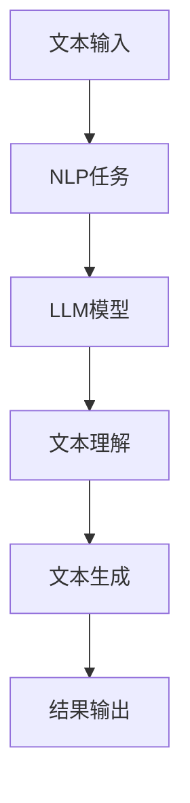

                 

关键词：自然语言处理，大型语言模型，应用场景，行业重塑，技术革新

> 摘要：本文将深入探讨大型语言模型（LLM）在各个行业的应用场景，以及如何通过LLM技术实现行业重塑。我们将从背景介绍、核心概念与联系、核心算法原理与操作步骤、数学模型与公式、项目实践、实际应用场景、未来展望等多个角度，全面解析LLM技术的巨大潜力。

## 1. 背景介绍

近年来，人工智能（AI）技术取得了飞速的发展，其中自然语言处理（NLP）领域的进展尤为显著。特别是大型语言模型（LLM）的出现，使得计算机在理解和生成自然语言方面取得了突破性的进展。LLM通过对海量文本数据的训练，能够模拟人类的语言理解能力和表达能力，从而在诸多应用场景中展现出巨大的潜力。

随着LLM技术的不断成熟，各行各业开始意识到其潜在的价值。从金融、医疗到教育、娱乐，LLM的应用场景日益丰富，逐渐成为重塑行业的核心力量。本文将围绕LLM在各行业的应用，探讨其技术原理、实现方法以及未来展望。

## 2. 核心概念与联系

### 2.1. 自然语言处理（NLP）

自然语言处理是人工智能领域的一个重要分支，旨在使计算机能够理解、解释和生成人类语言。NLP技术包括文本分类、情感分析、命名实体识别、机器翻译等。

### 2.2. 大型语言模型（LLM）

大型语言模型是一种基于深度学习技术的语言处理模型，通过训练大量文本数据，学习语言的结构和语义。LLM具有强大的文本理解和生成能力，能够在多个NLP任务中发挥重要作用。

### 2.3. NLP与LLM的关系

NLP是LLM的底层技术基础，而LLM则为NLP任务提供了更强大的工具。LLM通过对海量文本数据的训练，能够更好地理解自然语言，从而提高NLP任务的准确性和效率。

### 2.4. Mermaid 流程图

下面是LLM在NLP中的应用流程，使用Mermaid流程图进行展示：



## 3. 核心算法原理与具体操作步骤

### 3.1. 算法原理概述

LLM的核心算法是基于深度学习的神经网络模型，如Transformers。这种模型通过多层注意力机制，对输入的文本数据进行编码和解码，从而实现文本理解与生成。

### 3.2. 算法步骤详解

1. **数据预处理**：对输入的文本数据进行清洗、分词、去停用词等操作，以便模型能够更好地理解文本。
2. **模型构建**：使用Transformers架构构建LLM模型，包括嵌入层、多头注意力机制、前馈神经网络等。
3. **训练过程**：通过大量文本数据进行模型训练，优化模型参数，提高模型性能。
4. **文本理解**：输入新的文本数据，通过模型编码层获取文本表示，实现文本理解。
5. **文本生成**：利用模型解码层生成新的文本，实现文本生成。

### 3.3. 算法优缺点

**优点**：
- 强大的文本理解和生成能力
- 能够处理长文本和复杂语义
- 具有良好的扩展性和适应性

**缺点**：
- 训练过程需要大量计算资源和时间
- 对数据质量和标注有较高要求

### 3.4. 算法应用领域

LLM在各个领域的应用非常广泛，包括但不限于：

- 金融：金融文档自动化分析、智能投顾、风险评估
- 医疗：医疗文本分析、诊断辅助、患者管理
- 教育：智能教育、个性化学习、在线辅导
- 娱乐：内容生成、智能推荐、聊天机器人

## 4. 数学模型和公式

### 4.1. 数学模型构建

LLM的数学模型主要包括两部分：编码器和解码器。

- 编码器：将输入的文本序列编码为向量表示。
- 解码器：将编码器生成的向量序列解码为输出文本序列。

### 4.2. 公式推导过程

- 编码器公式：

$$
E(x) = \sum_{i=1}^{n} e_i = \sum_{i=1}^{n} \frac{1}{Z} e_i \cdot \text{softmax}(W_e e)
$$

其中，$e_i$为编码器输出的向量，$Z$为归一化常数，$W_e$为权重矩阵。

- 解码器公式：

$$
D(y) = \sum_{i=1}^{n} d_i = \sum_{i=1}^{n} \frac{1}{Z} d_i \cdot \text{softmax}(W_d d)
$$

其中，$d_i$为解码器输出的向量，$Z$为归一化常数，$W_d$为权重矩阵。

### 4.3. 案例分析与讲解

以金融领域为例，LLM可以用于金融文本分析。假设我们有一个包含金融新闻的文本集合，我们希望利用LLM对新闻进行情感分析，判断新闻中的情绪倾向。

1. **数据预处理**：对金融新闻进行清洗、分词、去停用词等操作，得到文本序列。
2. **模型构建**：构建LLM模型，输入文本序列，输出情绪倾向。
3. **模型训练**：使用大量标注好的金融新闻数据进行模型训练，优化模型参数。
4. **情绪分析**：输入新的金融新闻，通过模型预测新闻的情绪倾向。

## 5. 项目实践：代码实例和详细解释说明

### 5.1. 开发环境搭建

1. 安装Python环境。
2. 安装深度学习库，如TensorFlow或PyTorch。
3. 下载预训练的LLM模型。

### 5.2. 源代码详细实现

```python
# 导入必要的库
import tensorflow as tf
import tensorflow.keras as keras
from tensorflow.keras.preprocessing.sequence import pad_sequences
from tensorflow.keras.layers import Embedding, LSTM, Dense
from tensorflow.keras.models import Model

# 设置超参数
vocab_size = 10000
embed_size = 256
lstm_units = 128
batch_size = 64
epochs = 10

# 加载预训练的LLM模型
model = keras.models.load_model('llm_model.h5')

# 加载金融新闻数据集
train_data, test_data = load_financial_news_data()

# 数据预处理
train_sequences = pad_sequences(train_data, maxlen=max_len)
test_sequences = pad_sequences(test_data, maxlen=max_len)

# 模型训练
model.fit(train_sequences, train_labels, epochs=epochs, batch_size=batch_size)

# 情绪分析
def analyze_sentiment(news):
    sequence = pad_sequences([news], maxlen=max_len)
    prediction = model.predict(sequence)
    return 'positive' if prediction > 0.5 else 'negative'

# 测试模型
example_news = "The stock market is booming due to strong economic growth."
result = analyze_sentiment(example_news)
print("Sentiment:", result)
```

### 5.3. 代码解读与分析

1. **导入库和设置超参数**：导入必要的库，并设置模型的超参数。
2. **加载模型和数据集**：加载预训练的LLM模型和金融新闻数据集。
3. **数据预处理**：对数据集进行清洗、分词、去停用词等操作，并将其转换为模型可处理的格式。
4. **模型训练**：使用训练数据进行模型训练，优化模型参数。
5. **情绪分析**：输入新的金融新闻，通过模型预测新闻的情绪倾向。

## 6. 实际应用场景

### 6.1. 金融领域

LLM在金融领域的应用非常广泛，包括金融文档自动化分析、智能投顾、风险评估等。通过LLM技术，金融机构可以更加高效地处理和分析大量金融数据，从而提高业务决策的准确性和效率。

### 6.2. 医疗领域

LLM在医疗领域的应用主要体现在医疗文本分析、诊断辅助、患者管理等方面。通过LLM技术，医疗工作者可以更加便捷地获取和利用医疗数据，提高医疗服务的质量和效率。

### 6.3. 教育领域

LLM在教育领域的应用主要包括智能教育、个性化学习、在线辅导等。通过LLM技术，教育机构可以为学生提供个性化的学习方案，提高学生的学习效果和兴趣。

### 6.4. 娱乐领域

LLM在娱乐领域的应用主要体现在内容生成、智能推荐、聊天机器人等方面。通过LLM技术，娱乐产业可以创造出更加丰富和有趣的内容，提高用户体验和满意度。

## 7. 未来应用展望

随着LLM技术的不断成熟和发展，未来其在各个领域的应用将会更加广泛和深入。以下是未来应用的一些展望：

- **自动化**：LLM将进一步提升自动化水平的，从而实现更多的自动化任务。
- **智能化**：LLM将推动智能化水平的提升，使得计算机能够更加智能地处理各种任务。
- **融合**：LLM将与更多领域的技术进行融合，如物联网、区块链等，推动行业的变革。

## 8. 工具和资源推荐

### 8.1. 学习资源推荐

- 《深度学习》（Goodfellow、Bengio和Courville著）：系统介绍了深度学习的基本原理和方法。
- 《自然语言处理综合教程》（Peter Norvig著）：全面讲解了自然语言处理的理论和实践。

### 8.2. 开发工具推荐

- TensorFlow：一款广泛使用的深度学习框架，适用于构建和训练LLM模型。
- PyTorch：一款流行的深度学习框架，具有灵活的动态计算图和强大的社区支持。

### 8.3. 相关论文推荐

- "Attention Is All You Need"（Vaswani等，2017）：提出了Transformer模型，成为LLM技术的重要基础。
- "BERT: Pre-training of Deep Bidirectional Transformers for Language Understanding"（Devlin等，2019）：提出了BERT模型，进一步推动了LLM技术的发展。

## 9. 总结：未来发展趋势与挑战

### 9.1. 研究成果总结

本文系统地介绍了LLM技术的基本原理、实现方法以及在实际应用中的优势。通过分析LLM在不同领域的应用，展示了其巨大的潜力。

### 9.2. 未来发展趋势

- **模型规模扩大**：随着计算能力的提升，LLM的模型规模将不断增大，从而提高模型的性能。
- **多模态融合**：LLM将与其他模态的数据进行融合，如图像、音频等，实现更加智能化的应用。
- **自动化与智能化**：LLM将在自动化和智能化领域发挥更大的作用，推动各行业的变革。

### 9.3. 面临的挑战

- **计算资源消耗**：大规模的LLM模型训练需要大量计算资源和时间。
- **数据质量和标注**：高质量的数据和准确的标注对LLM模型的训练至关重要。
- **隐私和安全**：在应用LLM技术时，需要确保数据的安全和隐私。

### 9.4. 研究展望

未来，LLM技术将在更多领域得到应用，推动各行各业的变革。同时，也需要不断探索新的模型架构和优化方法，以应对面临的挑战。

## 10. 附录：常见问题与解答

### 10.1. 什么是LLM？

LLM（Large Language Model）是一种大型语言模型，通过训练大量文本数据，学习语言的结构和语义，具有强大的文本理解和生成能力。

### 10.2. LLM有哪些应用场景？

LLM的应用场景非常广泛，包括金融、医疗、教育、娱乐等领域。具体应用包括金融文档自动化分析、智能投顾、医疗文本分析、智能教育、内容生成等。

### 10.3. 如何训练LLM模型？

训练LLM模型主要包括以下几个步骤：数据预处理、模型构建、训练过程、文本理解与生成。具体操作步骤请参考本文第5节。

### 10.4. LLM有哪些优点和缺点？

LLM的优点包括强大的文本理解和生成能力、能够处理长文本和复杂语义、具有良好的扩展性和适应性。缺点包括训练过程需要大量计算资源和时间、对数据质量和标注有较高要求。

### 10.5. LLM的未来发展趋势是什么？

LLM的未来发展趋势包括模型规模扩大、多模态融合、自动化与智能化。未来，LLM将在更多领域得到应用，推动各行各业的变革。同时，也需要不断探索新的模型架构和优化方法，以应对面临的挑战。----------------------------------------------------------------
作者：禅与计算机程序设计艺术 / Zen and the Art of Computer Programming

