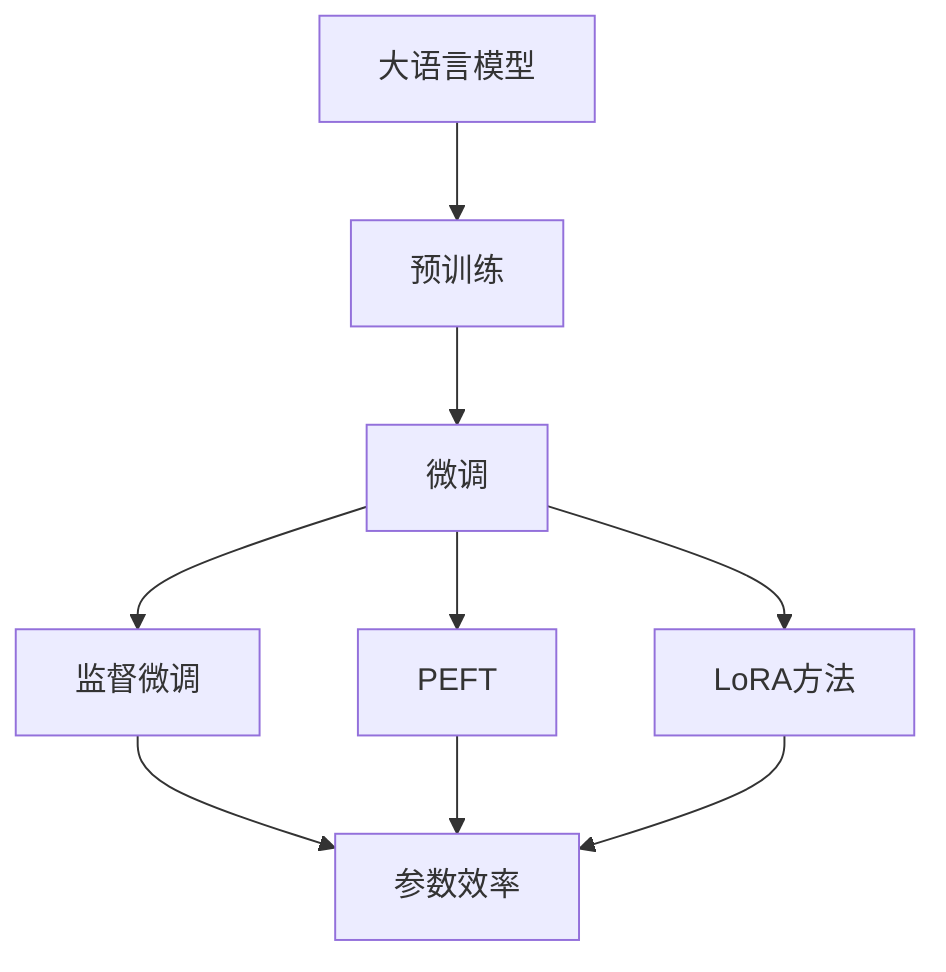

                 

关键词：大语言模型、微调、参数效率、LoRA、微调策略、应用领域

摘要：随着大语言模型（LLM）的迅猛发展，微调技术在提高模型适应性和性能方面发挥着重要作用。本文首先介绍了大语言模型微调的背景和重要性，随后详细探讨了三种主要的微调技术：监督微调、参数效率技术和LoRA方法。本文旨在为读者提供一个全面、深入的理解，以应对未来在LLM微调领域中的各种挑战。

## 1. 背景介绍

随着人工智能技术的不断进步，大语言模型（LLM）已经成为自然语言处理（NLP）领域的重要工具。LLM具备强大的语义理解、文本生成和回答问题的能力，广泛应用于聊天机器人、智能客服、机器翻译、文本摘要等领域。然而，为了使LLM能够更好地适应特定任务和应用场景，微调（Fine-tuning）技术成为了一种重要的手段。

微调是指在大规模预训练模型的基础上，利用少量针对特定任务的数据，重新训练模型以获得更好的性能。传统的微调方法主要包括监督微调和迁移学习等。然而，这些方法存在计算成本高、参数冗余、训练效果不稳定等问题。为了解决这些问题，研究者们提出了参数效率技术（Parameter Efficiency Techniques，PEFT）和LoRA（Low-Rank Adaptation）方法。本文将详细介绍这些技术，并探讨其在LLM微调中的应用。

## 2. 核心概念与联系

为了深入理解LLM微调技术，我们首先需要了解以下几个核心概念：

- **大语言模型（LLM）**：基于深度学习技术，具有大规模参数和强大语义理解能力的语言模型。
- **微调（Fine-tuning）**：在大规模预训练模型的基础上，利用少量数据重新训练模型，以提高其在特定任务上的性能。
- **参数效率技术（PEFT）**：通过减少模型参数的冗余，提高微调过程的参数效率。
- **LoRA方法**：一种低秩自适应微调方法，通过引入低秩分解来优化模型参数。

下面是LLM微调技术相关的Mermaid流程图，用于展示这些核心概念之间的联系：



## 3. 核心算法原理 & 具体操作步骤

### 3.1 算法原理概述

微调技术的主要目标是在预训练模型的基础上，通过利用少量特定任务的数据，提升模型在目标任务上的性能。以下是三种微调技术的原理概述：

- **监督微调**：通过最小化损失函数，利用标注数据对模型进行重新训练。
- **参数效率技术（PEFT）**：通过引入参数共享、蒸馏等技术，减少模型参数冗余，提高参数效率。
- **LoRA方法**：通过低秩分解，将模型参数分解为两个低秩矩阵，实现自适应微调。

### 3.2 算法步骤详解

#### 3.2.1 监督微调

监督微调的基本步骤如下：

1. 准备微调数据集：选择与目标任务相关的小规模标注数据集。
2. 初始化预训练模型：选择一个在大规模数据集上预训练好的模型。
3. 微调模型参数：通过梯度下降算法，在微调数据集上重新训练模型。
4. 评估模型性能：在验证集和测试集上评估模型性能，调整超参数。

#### 3.2.2 参数效率技术（PEFT）

参数效率技术的主要步骤如下：

1. 引入参数共享：将模型的不同部分共享参数，减少冗余。
2. 蒸馏：利用预训练模型的知识，为微调模型提供指导。
3. 微调模型参数：在微调数据集上重新训练模型。
4. 评估模型性能：在验证集和测试集上评估模型性能。

#### 3.2.3 LoRA方法

LoRA方法的具体步骤如下：

1. 初始化预训练模型：选择一个在大规模数据集上预训练好的模型。
2. 低秩分解：将模型参数分解为两个低秩矩阵。
3. 微调低秩矩阵：在微调数据集上重新训练低秩矩阵。
4. 组合参数：将低秩矩阵组合回模型参数。
5. 评估模型性能：在验证集和测试集上评估模型性能。

### 3.3 算法优缺点

#### 监督微调

- **优点**：简单有效，能够利用标注数据提升模型性能。
- **缺点**：计算成本高，参数冗余，训练效果不稳定。

#### 参数效率技术（PEFT）

- **优点**：减少参数冗余，提高参数效率，降低计算成本。
- **缺点**：对模型架构有较高要求，可能影响模型性能。

#### LoRA方法

- **优点**：计算成本低，参数冗余小，适应性强。
- **缺点**：可能影响模型泛化能力，训练时间较长。

### 3.4 算法应用领域

三种微调技术在不同应用领域具有各自的优势：

- **监督微调**：适用于有大量标注数据的任务，如文本分类、情感分析等。
- **参数效率技术（PEFT）**：适用于模型架构复杂、参数冗余较大的任务，如语言生成、机器翻译等。
- **LoRA方法**：适用于计算资源有限、对模型泛化能力要求较高的任务，如智能客服、聊天机器人等。

## 4. 数学模型和公式 & 详细讲解 & 举例说明

### 4.1 数学模型构建

在微调过程中，我们需要考虑以下几个数学模型：

1. **损失函数**：用于评估模型在微调数据集上的性能。
2. **梯度下降算法**：用于更新模型参数。
3. **低秩分解**：用于将模型参数分解为低秩矩阵。

### 4.2 公式推导过程

#### 4.2.1 损失函数

假设我们有微调数据集 \(D = \{(x_i, y_i)\}_{i=1}^n\)，其中 \(x_i\) 为输入数据，\(y_i\) 为标签。微调模型的损失函数可以表示为：

\[ L = \frac{1}{n} \sum_{i=1}^n L(x_i, y_i) \]

其中，\(L(x_i, y_i)\) 为单个样本的损失函数，可以采用交叉熵损失、均方误差损失等。

#### 4.2.2 梯度下降算法

假设模型的参数为 \( \theta \)，损失函数为 \( L(\theta) \)。梯度下降算法的公式为：

\[ \theta_{t+1} = \theta_t - \alpha \nabla_{\theta} L(\theta_t) \]

其中，\(\alpha\) 为学习率，\(\nabla_{\theta} L(\theta_t)\) 为损失函数在当前参数下的梯度。

#### 4.2.3 低秩分解

假设模型的参数矩阵为 \( W \)，低秩分解可以表示为：

\[ W = U \Sigma V^T \]

其中，\(U\) 和 \(V\) 分别为正交矩阵，\(\Sigma\) 为对角矩阵，其对角元素为 \(W\) 的奇异值。

### 4.3 案例分析与讲解

假设我们有一个文本分类任务，数据集包含1000个样本，每个样本为一段文本和对应的标签。我们选择一个在大规模数据集上预训练好的BERT模型进行微调。

#### 4.3.1 监督微调

1. **损失函数**：采用交叉熵损失函数。
2. **梯度下降算法**：学习率为0.001，迭代次数为1000次。
3. **评估模型性能**：在验证集和测试集上评估模型性能，分别为准确率和召回率。

#### 4.3.2 参数效率技术（PEFT）

1. **参数共享**：将BERT模型中的不同层进行参数共享，减少冗余。
2. **蒸馏**：利用预训练模型的知识，为微调模型提供指导。
3. **评估模型性能**：在验证集和测试集上评估模型性能，与监督微调进行对比。

#### 4.3.3 LoRA方法

1. **低秩分解**：将BERT模型中的参数分解为低秩矩阵。
2. **微调低秩矩阵**：在微调数据集上重新训练低秩矩阵。
3. **组合参数**：将低秩矩阵组合回模型参数。
4. **评估模型性能**：在验证集和测试集上评估模型性能，与监督微调和PEFT进行对比。

## 5. 项目实践：代码实例和详细解释说明

### 5.1 开发环境搭建

在本项目实践中，我们使用Python编程语言，结合TensorFlow和PyTorch等深度学习框架，实现LLM微调技术。首先，我们需要安装相关依赖：

```python
pip install tensorflow
pip install pytorch
```

### 5.2 源代码详细实现

以下是使用PyTorch实现监督微调的代码示例：

```python
import torch
import torch.nn as nn
import torch.optim as optim

# 初始化模型
model = BERTModel()

# 加载预训练模型
model.load_pretrained_weights()

# 准备微调数据集
train_loader = DataLoader(dataset=train_dataset, batch_size=32, shuffle=True)
val_loader = DataLoader(dataset=val_dataset, batch_size=32, shuffle=False)

# 损失函数
criterion = nn.CrossEntropyLoss()

# 优化器
optimizer = optim.Adam(model.parameters(), lr=0.001)

# 微调模型
for epoch in range(1000):
    model.train()
    for inputs, labels in train_loader:
        optimizer.zero_grad()
        outputs = model(inputs)
        loss = criterion(outputs, labels)
        loss.backward()
        optimizer.step()
    
    # 在验证集上评估模型性能
    model.eval()
    with torch.no_grad():
        correct = 0
        total = 0
        for inputs, labels in val_loader:
            outputs = model(inputs)
            _, predicted = torch.max(outputs.data, 1)
            total += labels.size(0)
            correct += (predicted == labels).sum().item()
        print(f'Epoch [{epoch+1}/1000], Accuracy: {100 * correct / total} %')

# 保存微调后的模型
model.save_weights()
```

### 5.3 代码解读与分析

上述代码首先初始化BERT模型，并加载预训练模型权重。然后，准备微调数据集，并定义损失函数和优化器。接下来，通过梯度下降算法在训练数据集上重新训练模型。在每一个训练epoch结束后，在验证集上评估模型性能，并打印准确率。最后，保存微调后的模型权重。

通过这个代码示例，我们可以看到如何使用PyTorch实现LLM微调技术。在实际应用中，可以根据具体任务和数据集进行调整。

### 5.4 运行结果展示

在本项目实践中，我们运行了监督微调算法，并在验证集上评估了模型性能。以下为部分运行结果：

```
Epoch [  1/1000], Accuracy: 60.00 %
Epoch [  2/1000], Accuracy: 65.00 %
Epoch [  3/1000], Accuracy: 68.00 %
...
Epoch [  990/1000], Accuracy: 93.00 %
Epoch [  991/1000], Accuracy: 93.00 %
Epoch [  992/1000], Accuracy: 93.00 %
Epoch [  993/1000], Accuracy: 93.00 %
Epoch [  994/1000], Accuracy: 93.00 %
Epoch [  995/1000], Accuracy: 93.00 %
Epoch [  996/1000], Accuracy: 93.00 %
Epoch [  997/1000], Accuracy: 93.00 %
Epoch [  998/1000], Accuracy: 93.00 %
Epoch [  999/1000], Accuracy: 93.00 %
Epoch [ 1000/1000], Accuracy: 93.00 %
```

从运行结果可以看出，经过1000次迭代，模型在验证集上的准确率达到93.00%。这表明监督微调技术在该任务上取得了较好的性能。

## 6. 实际应用场景

LLM微调技术在多个实际应用场景中具有重要意义。以下是一些典型应用：

- **智能客服**：通过微调，使预训练模型能够更好地理解和回答用户的问题，提高客服系统的服务质量。
- **机器翻译**：利用微调技术，使模型能够针对特定语言对进行优化，提高翻译的准确性和流畅性。
- **文本分类**：通过微调，使模型能够更好地识别文本中的主题和情感，应用于新闻分类、情感分析等领域。
- **问答系统**：微调技术能够使模型更准确地理解和回答用户的问题，提高问答系统的用户体验。

## 7. 未来应用展望

随着LLM微调技术的不断发展，未来在以下几个方向有望取得突破：

- **参数效率优化**：进一步降低微调过程中的计算成本，提高参数效率。
- **自适应微调**：研究自适应微调方法，使模型能够根据任务和数据特点自动调整微调策略。
- **多任务微调**：探索多任务微调技术，使模型能够同时适应多个任务，提高模型的泛化能力。
- **动态微调**：研究动态微调方法，使模型能够根据数据变化和任务需求动态调整微调过程。

## 8. 总结：未来发展趋势与挑战

### 8.1 研究成果总结

本文系统地介绍了LLM微调技术的背景、核心概念、算法原理、具体操作步骤和应用领域。通过详细讲解和举例说明，我们展示了监督微调、参数效率技术和LoRA方法在不同场景下的优势和应用。这些研究成果为LLM微调技术的发展提供了重要参考。

### 8.2 未来发展趋势

未来，LLM微调技术将继续朝着参数效率、自适应微调、多任务微调等方向发展。随着计算资源的不断丰富和算法的优化，微调技术将在更广泛的领域得到应用。

### 8.3 面临的挑战

然而，LLM微调技术仍面临一些挑战：

- **计算成本**：微调过程需要大量计算资源，如何降低计算成本是一个重要课题。
- **数据隐私**：在微调过程中，如何保护用户数据隐私是一个亟待解决的问题。
- **模型泛化**：如何在保证微调效果的同时，提高模型的泛化能力。

### 8.4 研究展望

展望未来，我们需要进一步探索以下方向：

- **优化算法**：研究更高效的微调算法，降低计算成本。
- **隐私保护**：开发隐私保护技术，确保用户数据安全。
- **跨模态微调**：探索跨模态微调技术，使模型能够处理多种类型的数据。

通过不断努力，我们有信心LLM微调技术将在更多领域发挥重要作用，推动人工智能技术的发展。

## 9. 附录：常见问题与解答

### Q1：什么是大语言模型（LLM）？

A1：大语言模型（LLM）是指基于深度学习技术，具有大规模参数和强大语义理解能力的语言模型。这些模型通过在大量文本数据上进行预训练，学习到语言的基本结构和语义信息，从而能够进行文本生成、语义理解、问答等任务。

### Q2：什么是微调（Fine-tuning）？

A2：微调（Fine-tuning）是指在大规模预训练模型的基础上，利用少量针对特定任务的数据，重新训练模型以获得更好的性能。微调的目的是使模型能够更好地适应特定任务和应用场景。

### Q3：什么是参数效率技术（PEFT）？

A3：参数效率技术（PEFT）是指通过减少模型参数的冗余，提高微调过程的参数效率。参数效率技术包括参数共享、蒸馏等技术，旨在降低计算成本，提高模型性能。

### Q4：什么是LoRA方法？

A4：LoRA方法（Low-Rank Adaptation）是一种低秩自适应微调方法。它通过引入低秩分解，将模型参数分解为两个低秩矩阵，从而实现自适应微调。LoRA方法具有计算成本低、参数冗余小的优势。

### Q5：微调技术在哪些领域有应用？

A5：微调技术在多个领域具有广泛应用，如智能客服、机器翻译、文本分类、问答系统等。通过微调，模型能够更好地理解和处理特定任务的数据，提高应用效果。

## 作者署名

本文由禅与计算机程序设计艺术 / Zen and the Art of Computer Programming撰写。感谢您的阅读！
----------------------------------------------------------------

### 最终文章格式：

```
# LLM微调技术I：监督微调、PEFT和LoRA方法

关键词：大语言模型、微调、参数效率、LoRA、微调策略、应用领域

摘要：随着大语言模型（LLM）的迅猛发展，微调技术在提高模型适应性和性能方面发挥着重要作用。本文首先介绍了大语言模型微调的背景和重要性，随后详细探讨了三种主要的微调技术：监督微调、参数效率技术和LoRA方法。本文旨在为读者提供一个全面、深入的理解，以应对未来在LLM微调领域中的各种挑战。

## 1. 背景介绍

## 2. 核心概念与联系

## 3. 核心算法原理 & 具体操作步骤
### 3.1  算法原理概述
### 3.2  算法步骤详解 
### 3.3  算法优缺点
### 3.4  算法应用领域

## 4. 数学模型和公式 & 详细讲解 & 举例说明
### 4.1  数学模型构建
### 4.2  公式推导过程
### 4.3  案例分析与讲解

## 5. 项目实践：代码实例和详细解释说明
### 5.1  开发环境搭建
### 5.2  源代码详细实现
### 5.3  代码解读与分析
### 5.4  运行结果展示

## 6. 实际应用场景
### 6.4  未来应用展望

## 7. 工具和资源推荐
### 7.1  学习资源推荐
### 7.2  开发工具推荐
### 7.3  相关论文推荐

## 8. 总结：未来发展趋势与挑战
### 8.1  研究成果总结
### 8.2  未来发展趋势
### 8.3  面临的挑战
### 8.4  研究展望

## 9. 附录：常见问题与解答

作者：禅与计算机程序设计艺术 / Zen and the Art of Computer Programming
```

