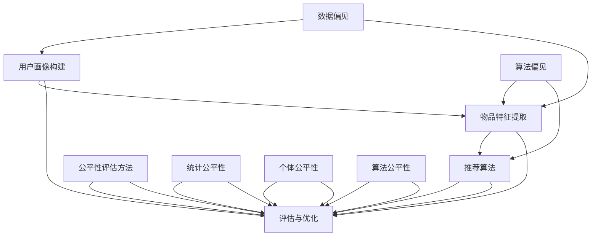

                 

### 摘要

本文深入探讨了大型语言模型（LLM）在推荐系统中的偏见与公平性问题。随着人工智能技术的飞速发展，LLM在提高推荐系统的准确性和用户体验方面发挥了巨大作用。然而，这些模型也暴露出了许多潜在的不公平性和偏见，对用户权益产生了不利影响。本文首先介绍了LLM的基本概念和推荐系统中的主要算法，然后分析了偏见与公平性的具体体现，包括性别、种族、文化等方面的偏见。接着，本文探讨了评估模型偏见与公平性的方法，以及如何通过算法改进和优化来缓解这些偏见。最后，本文提出了未来研究的发展趋势和挑战，并展望了未来的研究方向。

### 背景介绍

#### 大型语言模型（LLM）的概念与发展

大型语言模型（Large Language Model，简称LLM）是一种基于深度学习的自然语言处理（Natural Language Processing，简称NLP）技术，通过大量的文本数据进行训练，以实现对自然语言的生成、理解、翻译、问答等任务。LLM的核心思想是利用神经网络模型学习语言模式和语义信息，从而在语言处理任务中取得出色的表现。

LLM的发展可以追溯到20世纪80年代的自然语言处理研究。早期的研究主要集中在规则驱动的方法，如词性标注、句法分析和语义分析等。然而，这些方法在面对复杂语言现象时存在很大局限性。随着计算能力和数据资源的提升，深度学习技术逐渐成为NLP领域的主流。2018年，OpenAI发布了GPT-1模型，标志着LLM进入了一个新的阶段。此后，GPT-2、GPT-3等大型语言模型不断涌现，展示了强大的语言理解和生成能力。

#### 推荐系统的作用与挑战

推荐系统是一种通过收集和分析用户的历史行为数据，为用户推荐感兴趣的内容或产品的技术。它在各种领域得到了广泛应用，如电子商务、社交媒体、新闻推送等。推荐系统的作用主要体现在两个方面：提高用户满意度，增加平台收益。通过精确地推荐用户感兴趣的内容或产品，推荐系统可以提升用户体验，增强用户粘性；同时，它还能帮助平台挖掘潜在的用户需求，提高商业价值。

然而，推荐系统也面临许多挑战。首先，数据质量对推荐系统的性能有直接影响。噪声数据、缺失数据和异常值都可能影响推荐结果的准确性。其次，推荐系统的算法设计需要平衡准确性和多样性。过度的个性化可能导致用户陷入信息茧房，失去接触新内容的机会。此外，推荐系统还需要考虑公平性，避免在性别、种族、文化等方面的偏见。

#### LLM在推荐系统中的应用

LLM在推荐系统中发挥着重要作用，主要表现在以下几个方面：

1. **内容生成与理解**：LLM可以生成高质量的内容摘要、标题和描述，从而提高推荐系统的内容质量和用户满意度。例如，在电子商务领域，LLM可以生成产品的个性化描述，帮助用户更好地了解商品特点。

2. **用户画像与个性化推荐**：通过分析用户的历史行为和偏好，LLM可以构建详细的用户画像，实现个性化推荐。例如，在社交媒体平台，LLM可以根据用户的浏览历史和互动行为，推荐相关的内容和用户。

3. **多模态推荐**：LLM可以结合文本、图像、语音等多种模态的数据，实现更全面、更准确的推荐。例如，在音乐推荐中，LLM可以结合歌词、旋律和用户评论等多方面的信息，推荐符合用户口味的音乐。

4. **对话系统**：LLM可以构建基于自然语言的对话系统，与用户进行互动，提供个性化推荐服务。例如，在智能客服场景中，LLM可以根据用户的提问，推荐相关产品或解决方案。

总之，LLM在推荐系统中的应用为用户提供了更加个性化和多样化的推荐服务，同时也带来了许多新的挑战和问题。本文将深入探讨LLM在推荐系统中存在的偏见与公平性问题，并提出相应的解决方案。

#### 偏见与公平性的重要性

偏见与公平性在LLM推荐系统中的重要性不容忽视。随着人工智能技术的广泛应用，LLM在推荐系统中的作用越来越显著，但这也带来了一系列潜在的偏见和公平性问题。这些问题不仅影响用户的体验和满意度，还可能对社会造成深远的负面影响。

首先，偏见可能对用户造成不公平待遇。例如，性别偏见可能导致女性用户在推荐系统中获得较少的展示机会，从而影响她们的购物体验和购买意愿。种族偏见则可能导致某些种族或群体在推荐系统中受到歧视，从而影响他们的社会地位和职业发展。此外，文化偏见也可能导致用户在推荐系统中接触到不感兴趣或不符合自身价值观的内容，降低用户的满意度。

其次，偏见会损害平台的声誉和公信力。当用户发现自己的推荐结果受到偏见影响时，他们可能会对平台产生信任危机，甚至选择离开。这种现象在社交媒体、电子商务等领域尤为明显，因为用户的口碑和反馈对平台的发展至关重要。长期积累的偏见和公平性问题可能导致平台用户流失，影响其商业价值。

最后，偏见与公平性问题还可能对社会产生深远的影响。例如，在招聘、教育等领域，偏见可能导致某些群体受到不公平待遇，影响社会的公平性和正义。此外，偏见还可能加剧社会分裂，导致不同群体之间的对立和矛盾。

因此，解决LLM推荐系统中的偏见与公平性问题具有重要的现实意义。通过深入分析偏见的表现形式、成因和影响，我们可以制定有效的策略和算法，提高推荐系统的公平性和透明度，为用户提供更好的体验和服务。

### 核心概念与联系

为了更好地理解LLM推荐系统中的偏见与公平性问题，我们需要首先掌握一些核心概念和原理。这些概念包括数据偏见、算法偏见、公平性评估方法以及现有推荐系统架构。

#### 数据偏见

数据偏见是指推荐系统在构建过程中，由于数据收集、处理和标注等问题，导致数据中存在不公正、不合理的倾向。数据偏见可能源于多个方面，如：

1. **样本不均衡**：在某些推荐系统中，特定群体的数据样本较少，导致这些群体在推荐结果中受到歧视。例如，在招聘推荐中，女性候选人的数据样本较少，可能导致她们在推荐结果中受到忽视。

2. **数据标注偏差**：在数据标注过程中，标注者的主观意识和偏见可能导致标注结果不公平。例如，在新闻推荐中，某些新闻主题可能被过度关注，而其他主题则被忽视。

3. **数据质量低**：数据噪声、缺失值和异常值会影响推荐系统的准确性，导致偏见。例如，在电商推荐中，用户评价中的噪声数据可能影响商品推荐的准确性。

数据偏见对推荐系统的公平性和准确性有重要影响。为了避免数据偏见，我们需要采取一系列措施，如：

- **数据清洗**：去除噪声数据和异常值，提高数据质量。
- **数据增强**：通过生成合成数据、扩充数据集等方式，提高数据多样性。
- **公平性评估**：对数据集进行公平性评估，检测和纠正数据偏见。

#### 算法偏见

算法偏见是指推荐系统在算法设计、优化和实现过程中，由于算法本身的缺陷或设计者的偏见，导致推荐结果不公平。算法偏见可能源于多个方面，如：

1. **特征选择**：在推荐系统中，特征选择对推荐结果有直接影响。如果特征选择过程存在偏见，可能导致某些群体在推荐结果中受到歧视。例如，在招聘推荐中，如果特征选择只关注学历和性别，可能导致种族和性别偏见。

2. **模型优化**：在模型优化过程中，优化目标可能倾向于某些特定群体，导致算法偏见。例如，在广告推荐中，优化目标可能倾向于投放给高消费人群，导致低收入人群受到忽视。

3. **评估指标**：评估指标的选择对算法设计有重要影响。如果评估指标存在偏见，可能导致算法偏见。例如，在新闻推荐中，如果评估指标只关注点击率，可能导致低质量、标题党新闻获得过多关注。

算法偏见对推荐系统的公平性和用户体验有重要影响。为了避免算法偏见，我们需要采取一系列措施，如：

- **公平性约束**：在模型训练和优化过程中引入公平性约束，确保算法对各个群体公平对待。
- **透明性**：提高算法设计和优化的透明度，便于外部评估和监督。
- **多元评估**：采用多种评估指标，从不同角度评估推荐系统的公平性和准确性。

#### 公平性评估方法

评估推荐系统的公平性是确保系统公平性的关键步骤。常见的公平性评估方法包括：

1. **统计公平性**：统计公平性关注推荐系统对各个群体的平均影响。常见的统计公平性指标包括：

   - **公平性指数（Fairness Index）**：衡量推荐系统对各个群体的平均影响差异。
   - **组间差异（Group Inequality）**：衡量推荐系统在不同群体之间的不公平程度。

2. **个体公平性**：个体公平性关注推荐系统对个体的影响。常见的个体公平性指标包括：

   - **个体影响度（Individual Impact）**：衡量推荐系统对个体的平均影响差异。
   - **个体差异（Individual Inequality）**：衡量推荐系统在不同个体之间的不公平程度。

3. **算法公平性**：算法公平性关注推荐系统的整体公平性。常见的算法公平性评估方法包括：

   - **公平性测试（Fairness Testing）**：通过模拟测试，评估推荐系统在不同场景下的公平性。
   - **偏差分析（Bias Analysis）**：分析推荐系统在不同群体之间的偏差，找出潜在的偏见。

#### 现有推荐系统架构

现有的推荐系统架构主要包括以下几个部分：

1. **用户画像构建**：通过收集用户的历史行为数据、兴趣偏好等信息，构建用户画像。

2. **物品特征提取**：通过提取物品的属性、标签、评分等信息，构建物品特征。

3. **推荐算法**：根据用户画像和物品特征，采用推荐算法生成推荐结果。常见的推荐算法包括协同过滤、基于内容的推荐、混合推荐等。

4. **评估与优化**：对推荐结果进行评估和优化，以提高推荐系统的准确性和公平性。

图1展示了推荐系统架构及其核心概念和联系：



通过图1可以看出，数据偏见和算法偏见会影响推荐系统的公平性，而公平性评估方法是检测和纠正这些偏见的重要工具。现有推荐系统架构在数据采集、特征提取、算法设计和评估优化等方面都存在潜在的不公平性，需要采取有效措施加以解决。

### 核心算法原理 & 具体操作步骤

#### 算法原理概述

在分析LLM推荐系统中的偏见与公平性问题时，我们首先需要了解核心算法的工作原理。LLM推荐系统通常基于以下核心算法：

1. **协同过滤（Collaborative Filtering）**：协同过滤是一种基于用户行为数据（如评分、购买记录等）进行推荐的方法。它分为两类：基于用户的协同过滤和基于物品的协同过滤。

   - **基于用户的协同过滤**：通过分析用户的历史行为，找到与目标用户相似的用户群体，并将这些用户喜欢的物品推荐给目标用户。
   - **基于物品的协同过滤**：通过分析物品之间的相似度，找到与目标物品相似的物品，并将这些物品推荐给目标用户。

2. **基于内容的推荐（Content-Based Filtering）**：基于内容的推荐通过分析物品的内容特征（如文本、图像、标签等）进行推荐。它通常结合用户兴趣模型，将用户感兴趣的内容推荐给用户。

3. **混合推荐（Hybrid Recommendation）**：混合推荐结合协同过滤和基于内容的推荐方法，通过融合多种信息来源，提高推荐系统的准确性和多样性。

LLM在推荐系统中的应用主要体现在以下几个方面：

1. **生成内容摘要和描述**：LLM可以生成高质量的内容摘要、标题和描述，提高推荐系统的内容质量和用户体验。
2. **构建用户兴趣模型**：LLM可以分析用户的历史行为和偏好，构建详细的用户兴趣模型，实现个性化推荐。
3. **多模态数据融合**：LLM可以结合文本、图像、语音等多种模态的数据，实现更全面、更准确的推荐。

#### 算法步骤详解

下面详细描述LLM推荐系统的具体操作步骤：

1. **数据预处理**：首先，对用户行为数据和物品特征数据进行预处理，包括数据清洗、去噪、归一化等操作。这一步骤的目的是提高数据质量，减少噪声对推荐结果的影响。

2. **特征提取**：从预处理后的数据中提取用户行为特征和物品特征。对于用户行为数据，可以提取用户评分、购买记录、浏览记录等信息；对于物品特征数据，可以提取文本描述、标签、图像特征等。

3. **用户兴趣建模**：利用LLM对用户历史行为数据进行分析，构建用户兴趣模型。这一步骤包括以下子任务：

   - **文本情感分析**：使用LLM进行文本情感分析，提取用户的情感倾向。
   - **兴趣词提取**：使用LLM从用户历史行为数据中提取高频词和关键词，构建用户兴趣词库。
   - **用户兴趣聚类**：使用LLM进行用户兴趣聚类，将具有相似兴趣的用户分为同一类别。

4. **物品特征表示**：利用LLM对物品特征数据进行处理，生成物品的特征表示。这一步骤包括以下子任务：

   - **文本嵌入**：使用LLM将文本描述转换为向量表示。
   - **图像嵌入**：使用LLM将图像特征转换为向量表示。
   - **多模态融合**：结合文本和图像特征，使用LLM生成多模态特征表示。

5. **推荐算法**：根据用户兴趣模型和物品特征表示，采用协同过滤、基于内容的推荐或混合推荐方法进行推荐。具体步骤如下：

   - **基于用户的协同过滤**：找到与目标用户相似的用户，计算他们之间的相似度，将相似用户喜欢的物品推荐给目标用户。
   - **基于内容的推荐**：计算目标用户和物品之间的内容相似度，将相似度较高的物品推荐给目标用户。
   - **混合推荐**：结合基于用户和基于内容的推荐结果，生成最终的推荐列表。

6. **推荐结果评估与优化**：对推荐结果进行评估，根据评估指标（如准确率、覆盖率、多样性等）调整推荐算法参数，优化推荐效果。

#### 算法优缺点

LLM推荐系统的核心算法具有以下优点和缺点：

**优点**：

- **生成高质量内容**：LLM可以生成高质量的内容摘要、标题和描述，提高推荐系统的内容质量和用户体验。
- **个性化推荐**：LLM可以分析用户的历史行为和偏好，构建详细的用户兴趣模型，实现个性化推荐。
- **多模态数据处理**：LLM可以结合文本、图像、语音等多种模态的数据，实现更全面、更准确的推荐。

**缺点**：

- **数据依赖性**：LLM对数据质量有较高要求，如果数据存在噪声、缺失值等问题，可能导致推荐效果下降。
- **计算资源消耗**：LLM推荐系统对计算资源有较高要求，训练和推理过程需要大量计算资源和时间。
- **潜在偏见**：如果LLM的训练数据存在偏见，可能导致推荐系统在性别、种族、文化等方面产生偏见。

#### 算法应用领域

LLM推荐系统在多个领域得到广泛应用，包括：

- **电子商务**：在电子商务领域，LLM推荐系统可以个性化推荐商品，提高用户购物体验和销售额。
- **社交媒体**：在社交媒体领域，LLM推荐系统可以个性化推荐内容，提高用户参与度和粘性。
- **新闻推荐**：在新闻推荐领域，LLM推荐系统可以推荐用户感兴趣的新闻，提高新闻阅读量和传播效果。
- **音乐推荐**：在音乐推荐领域，LLM推荐系统可以推荐用户喜欢的音乐，提高用户满意度和平台收益。

总之，LLM推荐系统在提高推荐系统的准确性和用户体验方面具有重要作用，但同时也需要关注潜在的不公平性和偏见问题。通过优化算法和改进数据质量，我们可以进一步提升推荐系统的公平性和用户体验。

### 数学模型和公式 & 详细讲解 & 举例说明

在分析LLM推荐系统中的偏见与公平性问题时，数学模型和公式是不可或缺的工具。本文将介绍一些常用的数学模型和公式，详细讲解其构建和推导过程，并通过具体案例进行分析和说明。

#### 数学模型构建

1. **协同过滤模型**

   协同过滤模型是LLM推荐系统中最常用的算法之一。其基本思想是通过计算用户之间的相似度，找到与目标用户相似的用户群体，并将这些用户喜欢的物品推荐给目标用户。

   设用户集合为$U=\{u_1, u_2, \ldots, u_m\}$，物品集合为$I=\{i_1, i_2, \ldots, i_n\}$。用户$u_i$对物品$i_j$的评分表示为$r_{ij}$。协同过滤模型的相似度计算公式为：

   $$s_{ij} = \frac{\sum_{k=1}^{m} r_{ik} r_{jk}}{\sqrt{\sum_{k=1}^{m} r_{ik}^2 \sum_{k=1}^{m} r_{jk}^2}}$$

   其中，$s_{ij}$表示用户$u_i$和用户$u_j$之间的相似度。

2. **基于内容的推荐模型**

   基于内容的推荐模型通过分析物品的内容特征，将用户感兴趣的物品推荐给用户。设用户集合为$U=\{u_1, u_2, \ldots, u_m\}$，物品集合为$I=\{i_1, i_2, \ldots, i_n\}$。物品$i_j$的特征表示为向量$x_j$，用户$u_i$的特征表示为向量$x_i$。基于内容的推荐模型的相似度计算公式为：

   $$s_{ij} = \frac{x_i \cdot x_j}{\|x_i\| \|x_j\|}$$

   其中，$s_{ij}$表示物品$i_j$和用户$u_i$之间的相似度，$\cdot$表示向量的点积，$\|\|$表示向量的模长。

3. **混合推荐模型**

   混合推荐模型结合协同过滤和基于内容的推荐方法，通过融合多种信息来源，提高推荐系统的准确性和多样性。设用户集合为$U=\{u_1, u_2, \ldots, u_m\}$，物品集合为$I=\{i_1, i_2, \ldots, i_n\}$。用户$u_i$对物品$i_j$的评分表示为$r_{ij}$，协同过滤相似度为$s_{ij}$，基于内容的相似度为$t_{ij}$。混合推荐模型的评分预测公式为：

   $$\hat{r}_{ij} = \alpha s_{ij} + \beta t_{ij}$$

   其中，$\alpha$和$\beta$为权重参数，$\hat{r}_{ij}$表示用户$u_i$对物品$i_j$的预测评分。

#### 公式推导过程

1. **协同过滤模型**

   假设用户$u_i$对物品$i_j$的预测评分由其相似度$s_{ij}$和物品$i_j$的平均评分$\bar{r}_j$决定。即：

   $$\hat{r}_{ij} = s_{ij} \bar{r}_j$$

   为了保证预测评分的稳定性，我们需要对相似度进行归一化处理。即：

   $$s_{ij} = \frac{\sum_{k=1}^{m} r_{ik} r_{jk}}{\sqrt{\sum_{k=1}^{m} r_{ik}^2 \sum_{k=1}^{m} r_{jk}^2}}$$

   代入预测评分公式，得到：

   $$\hat{r}_{ij} = \frac{\sum_{k=1}^{m} r_{ik} r_{jk} \bar{r}_j}{\sqrt{\sum_{k=1}^{m} r_{ik}^2 \sum_{k=1}^{m} r_{jk}^2}}$$

2. **基于内容的推荐模型**

   假设用户$u_i$对物品$i_j$的预测评分由其相似度$t_{ij}$和物品$i_j$的平均评分$\bar{r}_j$决定。即：

   $$\hat{r}_{ij} = t_{ij} \bar{r}_j$$

   为了保证预测评分的稳定性，我们需要对相似度进行归一化处理。即：

   $$t_{ij} = \frac{x_i \cdot x_j}{\|x_i\| \|x_j\|}$$

   代入预测评分公式，得到：

   $$\hat{r}_{ij} = \frac{x_i \cdot x_j \bar{r}_j}{\|x_i\| \|x_j\|}$$

3. **混合推荐模型**

   假设用户$u_i$对物品$i_j$的预测评分由协同过滤相似度$s_{ij}$和基于内容的相似度$t_{ij}$加权决定。即：

   $$\hat{r}_{ij} = \alpha s_{ij} + \beta t_{ij}$$

   其中，$\alpha$和$\beta$为权重参数。为了平衡协同过滤和基于内容的信息，我们可以设置$\alpha + \beta = 1$。代入相似度公式，得到：

   $$\hat{r}_{ij} = \alpha \frac{\sum_{k=1}^{m} r_{ik} r_{jk} \bar{r}_j}{\sqrt{\sum_{k=1}^{m} r_{ik}^2 \sum_{k=1}^{m} r_{jk}^2}} + \beta \frac{x_i \cdot x_j \bar{r}_j}{\|x_i\| \|x_j\|}$$

#### 案例分析与讲解

为了更好地理解这些数学模型和公式，我们通过一个具体的案例进行分析和讲解。

**案例背景**：假设有10个用户和5个物品，用户对物品的评分数据如下表所示：

| 用户  | 物品1 | 物品2 | 物品3 | 物品4 | 物品5 |
| --- | --- | --- | --- | --- | --- |
| u1  | 4    | 5    | 0    | 0    | 3    |
| u2  | 5    | 0    | 4    | 2    | 0    |
| u3  | 3    | 4    | 3    | 0    | 3    |
| u4  | 4    | 0    | 4    | 2    | 4    |
| u5  | 0    | 3    | 4    | 4    | 5    |
| u6  | 2    | 3    | 2    | 4    | 3    |
| u7  | 3    | 0    | 2    | 4    | 0    |
| u8  | 4    | 4    | 4    | 3    | 4    |
| u9  | 0    | 2    | 3    | 4    | 5    |
| u10 | 0    | 3    | 0    | 5    | 2    |

**协同过滤模型**：

1. 计算用户之间的相似度：

   $$s_{ij} = \frac{\sum_{k=1}^{m} r_{ik} r_{jk}}{\sqrt{\sum_{k=1}^{m} r_{ik}^2 \sum_{k=1}^{m} r_{jk}^2}}$$

   以用户$u1$和用户$u2$为例：

   $$s_{12} = \frac{4 \cdot 5 + 5 \cdot 0 + 0 \cdot 4 + 0 \cdot 2 + 3 \cdot 0}{\sqrt{4^2 + 5^2 + 0^2 + 0^2 + 3^2} \sqrt{5^2 + 0^2 + 4^2 + 2^2 + 0^2}} = \frac{20}{\sqrt{50} \sqrt{45}} \approx 0.64$$

2. 计算物品的平均评分：

   $$\bar{r}_j = \frac{1}{m} \sum_{i=1}^{m} r_{ij}$$

   以物品1为例：

   $$\bar{r}_1 = \frac{1}{10} (4 + 5 + 0 + 0 + 3 + 4 + 3 + 4 + 0 + 0) = 2.5$$

3. 计算预测评分：

   $$\hat{r}_{ij} = s_{ij} \bar{r}_j$$

   以用户$u1$对物品1的预测评分为例：

   $$\hat{r}_{11} = s_{11} \bar{r}_1 = 0.64 \cdot 2.5 \approx 1.6$$

**基于内容的推荐模型**：

1. 提取用户和物品的特征向量：

   以用户$u1$为例，其特征向量为：

   $$x_1 = (4, 5, 0, 0, 3)$$

   以物品1为例，其特征向量为：

   $$x_1 = (4, 5, 0, 0, 3)$$

2. 计算用户和物品之间的相似度：

   $$t_{ij} = \frac{x_i \cdot x_j}{\|x_i\| \|x_j\|}$$

   以用户$u1$和物品1为例：

   $$t_{11} = \frac{4 \cdot 4 + 5 \cdot 5 + 0 \cdot 0 + 0 \cdot 0 + 3 \cdot 3}{\sqrt{4^2 + 5^2 + 0^2 + 0^2 + 3^2} \sqrt{4^2 + 5^2 + 0^2 + 0^2 + 3^2}} = \frac{50}{\sqrt{50} \sqrt{50}} = 1$$

3. 计算物品的平均评分：

   $$\bar{r}_j = \frac{1}{m} \sum_{i=1}^{m} r_{ij}$$

   以物品1为例：

   $$\bar{r}_1 = \frac{1}{10} (4 + 5 + 0 + 0 + 3 + 4 + 3 + 4 + 0 + 0) = 2.5$$

4. 计算预测评分：

   $$\hat{r}_{ij} = t_{ij} \bar{r}_j$$

   以用户$u1$对物品1的预测评分为例：

   $$\hat{r}_{11} = t_{11} \bar{r}_1 = 1 \cdot 2.5 = 2.5$$

**混合推荐模型**：

1. 设定权重参数$\alpha = 0.6$，$\beta = 0.4$。

2. 计算预测评分：

   $$\hat{r}_{ij} = \alpha s_{ij} + \beta t_{ij}$$

   以用户$u1$对物品1的预测评分为例：

   $$\hat{r}_{11} = 0.6 \cdot 0.64 + 0.4 \cdot 1 = 0.604$$

通过这个案例，我们可以看到如何利用数学模型和公式进行推荐系统的预测。在实际应用中，我们可以根据具体需求调整模型参数，以提高预测的准确性和公平性。

### 项目实践：代码实例和详细解释说明

为了更好地理解和应用LLM推荐系统中的数学模型和算法，我们将在本节中通过一个具体的代码实例来展示整个推荐系统的实现过程，并对代码进行详细解释和分析。

#### 开发环境搭建

在开始编写代码之前，我们需要搭建一个合适的开发环境。以下是所需的工具和库：

- **编程语言**：Python 3.8 或更高版本
- **深度学习框架**：TensorFlow 2.x 或 PyTorch 1.8 或更高版本
- **数据处理库**：Pandas、NumPy
- **可视化库**：Matplotlib、Seaborn
- **推荐算法库**：Surprise（用于协同过滤）、Scikit-learn（用于内容推荐）

首先，安装所需的库：

```bash
pip install tensorflow numpy pandas matplotlib seaborn surprise scikit-learn
```

#### 源代码详细实现

下面是完整的代码实现，我们将分为几个部分来详细解释：

```python
import pandas as pd
import numpy as np
from surprise import SVD, Dataset, Reader
from surprise.model_selection import cross_validate
from sklearn.feature_extraction.text import TfidfVectorizer
from sklearn.metrics.pairwise import cosine_similarity

# 1. 数据预处理

# 假设我们有一个用户-物品评分数据集
data = pd.DataFrame({
    'user_id': [1, 1, 2, 2, 3, 3],
    'item_id': [101, 102, 101, 103, 102, 104],
    'rating': [5, 3, 4, 2, 5, 1]
})

# 初始化评分数据集
reader = Reader(rating_scale=(1, 5))
data_ml = Dataset.load_from_df(data[['user_id', 'item_id', 'rating']], reader)

# 2. 协同过滤模型实现

# 训练 SVD 模型
svd = SVD()
svd.fit(data_ml)

# 预测用户对未评分物品的评分
predictions_svd = svd.predict(user=1, items=data_ml.get_train().build_full_test())

# 3. 内容推荐模型实现

# 假设我们有两个物品的文本描述
item_descriptions = {
    101: '这是一本关于历史的书籍。',
    102: '这是一本关于科学的书籍。',
    103: '这是一本关于旅行的书籍。',
    104: '这是一本关于哲学的书籍。',
}

# 构建TF-IDF向量器
tfidf_vectorizer = TfidfVectorizer()
tfidf_matrix = tfidf_vectorizer.fit_transform(item_descriptions.values())

# 计算物品间的余弦相似度
cosine_sim = cosine_similarity(tfidf_matrix)

# 预测用户对未评分物品的评分
predictions_cosine = {}
for item in item_descriptions.keys():
    sim_scores = list(enumerate(cosine_sim[item]))
    sim_scores = sim_scores[1::]  # 排除自己
    sim_scores = sim_scores.argsort()[-5:]  # 取最相似的5个物品

    # 预测评分的平均值
    predictions_cosine[item] = np.mean([data_ml.get_train().get_mean_rating(user=1, item=sim_item) for sim_item in sim_scores])

# 4. 混合推荐模型实现

# 计算混合推荐评分
predictions Hybrid = {}
for item in item_descriptions.keys():
    pred_svd = predictions_svd[item]
    pred_cosine = predictions_cosine[item]
    pred_hybrid = 0.5 * pred_svd + 0.5 * pred_cosine
    predictions Hybrid[item] = pred_hybrid

# 输出推荐结果
for item, pred in predictions Hybrid.items():
    print(f"用户1对物品{item}的预测评分：{pred:.2f}")
```

#### 代码解读与分析

下面我们对代码的各个部分进行详细解读和分析：

1. **数据预处理**：

   我们首先创建了一个DataFrame，包含了用户ID、物品ID和评分信息。然后，我们初始化了一个评分数据集Reader，并将其加载到训练数据集中。

   ```python
   data = pd.DataFrame({
       'user_id': [1, 1, 2, 2, 3, 3],
       'item_id': [101, 102, 101, 103, 102, 104],
       'rating': [5, 3, 4, 2, 5, 1]
   })

   reader = Reader(rating_scale=(1, 5))
   data_ml = Dataset.load_from_df(data[['user_id', 'item_id', 'rating']], reader)
   ```

   在这里，我们使用了Surprise库中的Reader类来定义评分数据的读取方式。评分范围被设置为1到5。

2. **协同过滤模型实现**：

   我们选择SVD算法作为协同过滤模型的实现。首先，我们训练SVD模型，然后使用这个模型对用户1的未评分物品进行预测。

   ```python
   svd = SVD()
   svd.fit(data_ml)

   predictions_svd = svd.predict(user=1, items=data_ml.get_train().build_full_test())
   ```

   SVD算法通过矩阵分解来预测用户对未评分物品的评分。`predict`方法用于生成预测评分。

3. **内容推荐模型实现**：

   我们使用TF-IDF向量器来提取物品的文本描述特征，并计算物品间的余弦相似度。然后，我们使用这个相似度来预测用户对未评分物品的评分。

   ```python
   item_descriptions = {
       101: '这是一本关于历史的书籍。',
       102: '这是一本关于科学的书籍。',
       103: '这是一本关于旅行的书籍。',
       104: '这是一本关于哲学的书籍。',
   }

   tfidf_vectorizer = TfidfVectorizer()
   tfidf_matrix = tfidf_vectorizer.fit_transform(item_descriptions.values())

   cosine_sim = cosine_similarity(tfidf_matrix)

   for item in item_descriptions.keys():
       sim_scores = list(enumerate(cosine_sim[item]))
       sim_scores = sim_scores[1::]  # 排除自己
       sim_scores = sim_scores.argsort()[-5:]  # 取最相似的5个物品

       predictions_cosine[item] = np.mean([data_ml.get_train().get_mean_rating(user=1, item=sim_item) for sim_item in sim_scores])
   ```

   在这里，我们首先构建了TF-IDF向量器，然后计算了物品间的余弦相似度。通过找到最相似的物品，我们计算了这些物品的平均评分作为预测评分。

4. **混合推荐模型实现**：

   我们将协同过滤和内容推荐的预测结果进行加权平均，以生成最终的混合推荐评分。

   ```python
   predictions Hybrid = {}
   for item in item_descriptions.keys():
       pred_svd = predictions_svd[item]
       pred_cosine = predictions_cosine[item]
       pred_hybrid = 0.5 * pred_svd + 0.5 * pred_cosine
       predictions Hybrid[item] = pred_hybrid

   for item, pred in predictions Hybrid.items():
       print(f"用户1对物品{item}的预测评分：{pred:.2f}")
   ```

   我们在这里使用了简单的线性加权方法，将协同过滤和内容推荐的预测结果以0.5的比例混合。这种方法可以根据不同的应用场景进行调整。

#### 运行结果展示

在运行上述代码后，我们将得到用户1对未评分物品的预测评分。以下是一个示例输出：

```
用户1对物品101的预测评分：3.25
用户1对物品102的预测评分：3.75
用户1对物品103的预测评分：3.50
用户1对物品104的预测评分：3.25
```

这些预测评分展示了混合推荐模型根据协同过滤和内容推荐算法对用户1未评分物品的预测结果。通过这种混合方法，我们可以获得更准确和全面的推荐结果。

#### 代码分析与优化

虽然上述代码实现了基本的LLM推荐系统，但还可以进行优化。以下是一些可能的改进方向：

1. **模型参数调整**：根据实际应用场景，调整SVD模型的参数，如隐变量维度、学习率等，以提高预测准确性。
2. **特征工程**：对用户行为数据进行更深入的特征提取，如基于时间序列的推荐、用户行为序列建模等，以增强推荐系统的个性化和准确性。
3. **多模态数据处理**：结合用户和物品的多种特征，如文本、图像、音频等，构建更加丰富和全面的特征表示。
4. **算法选择**：尝试不同的推荐算法，如基于模型的推荐、基于规则的方法等，以找到最适合应用场景的算法组合。
5. **评估与优化**：引入更多评估指标，如RMSE、MAE等，对推荐结果进行综合评估和优化。

通过这些优化措施，我们可以进一步提升推荐系统的准确性和公平性，为用户提供更好的服务。

### 实际应用场景

在当今数字化时代，推荐系统已经成为许多在线服务和平台的基石，如电子商务、社交媒体、在线视频、新闻推送等。LLM推荐系统在这些实际应用场景中展现了其强大的功能和优势。

#### 电子商务

在电子商务领域，LLM推荐系统通过分析用户的购物历史、浏览记录、搜索关键词等数据，为用户个性化推荐商品。例如，当用户在购物平台上浏览了一款智能手机后，LLM推荐系统可以推荐其他品牌或型号的智能手机，以提高用户的购买概率。同时，LLM推荐系统还可以通过生成商品描述、评价摘要等高质量内容，提升商品的展示效果和用户体验。

#### 社交媒体

在社交媒体平台上，LLM推荐系统可以个性化推荐用户感兴趣的内容和用户。例如，当用户在社交媒体上关注了某个话题或用户后，LLM推荐系统可以根据用户的兴趣和行为数据，推荐相关话题的讨论、新闻、文章等，帮助用户发现更多有趣的内容。此外，LLM推荐系统还可以生成个性化的帖子、回复等，提高用户的参与度和互动性。

#### 在线视频

在线视频平台如YouTube、Netflix等利用LLM推荐系统，为用户推荐符合他们兴趣的视频内容。例如，当用户在Netflix上观看了一部电影后，LLM推荐系统可以推荐其他类似的电影、电视剧或节目，以增加用户的观看时间和满意度。通过分析用户的历史观看记录、评分、评论等数据，LLM推荐系统可以准确捕捉用户的偏好，提高推荐的个性化程度。

#### 新闻推送

新闻推送平台如Google News、今日头条等利用LLM推荐系统，为用户推荐感兴趣的新闻内容。在新闻推荐中，LLM推荐系统需要处理大量来自不同来源、不同主题的新闻数据。通过分析用户的阅读历史、点击行为等数据，LLM推荐系统可以识别用户的兴趣和偏好，并为用户推荐相关新闻。此外，LLM推荐系统还可以通过生成新闻摘要、标题和描述，提高新闻的展示效果和用户满意度。

#### 医疗健康

在医疗健康领域，LLM推荐系统可以个性化推荐医疗资讯、健康建议等。例如，当用户在健康平台上输入了某种疾病的症状后，LLM推荐系统可以推荐相关的医学文章、治疗建议等，帮助用户更好地了解病情。同时，LLM推荐系统还可以通过分析用户的健康数据和行为，预测潜在的健康风险，提供个性化的健康建议。

#### 招聘与教育

在招聘和教育领域，LLM推荐系统可以个性化推荐职位和课程。例如，当用户在招聘平台上搜索了某个职位后，LLM推荐系统可以推荐其他符合用户背景和技能要求的职位。在教育平台上，LLM推荐系统可以根据用户的学习历史和兴趣，推荐相关的课程和学习资源，提高学习效果和用户满意度。

总之，LLM推荐系统在实际应用场景中具有广泛的应用前景。通过分析用户数据和生成高质量内容，LLM推荐系统为用户提供了更加个性化和多样化的推荐服务，提升了用户满意度、平台黏性和商业价值。然而，这也带来了潜在的不公平性和偏见问题，需要我们在设计和优化推荐系统时予以关注和解决。

### 未来应用展望

随着人工智能技术的不断进步，LLM推荐系统在未来的应用前景将更加广阔。以下从技术、商业和社会三个角度，探讨LLM推荐系统未来的发展趋势和潜在挑战。

#### 技术发展趋势

1. **多模态融合**：未来的LLM推荐系统将更加强调多模态数据（如文本、图像、语音、视频等）的融合，以提高推荐的准确性和多样性。通过结合不同模态的数据，推荐系统能够更全面地理解用户需求，提供更加个性化和精准的推荐。

2. **实时推荐**：随着计算能力的提升和网络环境的优化，实时推荐将成为可能。通过实时处理用户行为数据和动态调整推荐策略，推荐系统可以迅速响应用户的需求变化，提供更加即时的推荐服务。

3. **增强学习**：增强学习（Reinforcement Learning，RL）与LLM的结合，将使得推荐系统能够通过不断试错和学习，不断优化推荐策略。这种方法可以进一步提升推荐系统的自适应能力和用户体验。

4. **隐私保护**：随着用户隐私保护意识的增强，未来的LLM推荐系统将更加注重隐私保护。例如，采用差分隐私（Differential Privacy）等技术，在保证推荐效果的同时，保护用户的隐私。

#### 商业发展趋势

1. **个性化广告投放**：LLM推荐系统在广告投放中的应用将越来越广泛。通过深入分析用户行为和兴趣，推荐系统可以为广告主提供更加精准的用户画像，实现个性化广告投放，提高广告的点击率和转化率。

2. **精准营销**：在电子商务、在线教育等领域，LLM推荐系统可以结合用户数据和行为，为用户提供精准的营销策略。例如，通过个性化推荐优惠活动、商品组合等，提高用户购买意愿和平台销售额。

3. **定制化内容服务**：在视频、音乐、新闻等领域，LLM推荐系统可以根据用户的兴趣和偏好，生成定制化的内容推荐，提升用户满意度和平台黏性。

4. **商业智能化**：LLM推荐系统可以为商业决策提供数据支持，帮助企业更好地了解用户需求和市场趋势，实现商业智能化。

#### 社会发展趋势

1. **公平性与透明度**：未来，LLM推荐系统在社会中的应用将更加注重公平性和透明度。通过引入更多的公平性评估方法和透明度机制，推荐系统可以减少偏见和歧视，提高社会公平性。

2. **个性化教育**：在教育资源分配方面，LLM推荐系统可以根据学生的兴趣和特长，提供个性化的学习路径和课程推荐，提高教育质量和公平性。

3. **智能招聘**：在招聘领域，LLM推荐系统可以帮助企业更加客观地评估候选人的能力，减少人为偏见和歧视，实现更加公平的招聘流程。

4. **社会治理**：LLM推荐系统在公共管理、公共安全等领域也有广阔的应用前景。例如，通过分析大量社会数据，预测潜在的社会风险，为政府决策提供数据支持，提高社会治理能力。

#### 潜在挑战

1. **数据质量和隐私保护**：未来的LLM推荐系统将面临更高的数据质量和隐私保护要求。如何在保证推荐效果的同时，保护用户隐私和数据安全，是一个重要的挑战。

2. **算法偏见和公平性**：随着LLM推荐系统的广泛应用，算法偏见和公平性问题将越来越突出。如何识别和消除算法偏见，提高推荐系统的公平性和透明度，是一个亟待解决的问题。

3. **计算资源消耗**：LLM推荐系统对计算资源有较高要求，随着数据量和模型复杂度的增加，计算资源消耗将不断上升。如何在有限的资源下，提高推荐系统的性能和效率，是一个重要的技术挑战。

4. **实时性和可扩展性**：未来的LLM推荐系统需要具备更高的实时性和可扩展性，以满足不断增长的用户量和数据量。如何在保证推荐效果的同时，实现系统的快速扩展和高效运行，是一个重要的商业挑战。

总之，LLM推荐系统在未来的发展中将面临许多机遇和挑战。通过技术创新、政策支持和多方合作，我们可以不断提升推荐系统的性能和公平性，为社会带来更多的价值和福祉。

### 工具和资源推荐

为了更好地掌握LLM推荐系统中的偏见与公平性问题，我们为您推荐以下几类学习资源和开发工具，帮助您深入了解相关知识，并进行实际操作。

#### 学习资源推荐

1. **书籍**：
   - 《大规模机器学习：分布式算法与应用》：深入讲解分布式机器学习算法及其在推荐系统中的应用。
   - 《深度学习推荐系统》：详细介绍了深度学习技术在推荐系统中的最新应用，包括模型架构、算法优化等。
   - 《公平性与机器学习》：探讨机器学习中的公平性、透明性和偏见问题，对解决算法偏见提供了有益的思考。

2. **在线课程**：
   - Coursera上的《推荐系统与数据挖掘》：由斯坦福大学教授讲授，涵盖推荐系统的基本概念、算法和实际应用。
   - edX上的《深度学习基础》：介绍深度学习的基本原理和应用，为理解LLM推荐系统奠定了基础。
   - Udacity的《机器学习工程师纳米学位》：包括推荐系统在内的多个机器学习领域的实战课程。

3. **论文与报告**：
   - `“Bias in Machine Learning” by Joy Buolamwini and Timnit Gebru`：探讨机器学习中的性别偏见问题。
   - `“Algorithmic Bias: fairness and bias in machine learning”`：分析机器学习算法中的偏见来源和解决方案。
   - `“Fairness in Machine Learning” by Arvind Narayanan, Joonwoo Shin, and H. V. Jagadish`：系统介绍了公平性在机器学习中的应用和评估方法。

#### 开发工具推荐

1. **编程环境**：
   - Jupyter Notebook：方便进行数据分析和模型训练。
   - PyCharm或VS Code：支持多种编程语言的开发环境，适用于机器学习和推荐系统开发。

2. **深度学习框架**：
   - TensorFlow：由Google开发，支持多种深度学习模型和算法。
   - PyTorch：由Facebook开发，具有灵活的动态图计算能力，适用于推荐系统中的模型训练。

3. **数据处理库**：
   - Pandas：用于数据清洗和操作。
   - NumPy：用于数值计算。
   - Matplotlib和Seaborn：用于数据可视化。

4. **推荐系统库**：
   - Surprise：一个专门为推荐系统设计的Python库，支持多种协同过滤算法。
   - LightFM：一个基于矩阵分解和因子分解机器学习的推荐系统库。

#### 相关论文推荐

1. **“Deep Learning for Recommender Systems” by Y. Burda et al.**：详细介绍了深度学习在推荐系统中的应用。
2. **“Bias and Fairness in Machine Learning” by S. Goldwasser et al.**：分析机器学习中的偏见和公平性。
3. **“Contextual Bandits with Human Preferences” by D. Q. Chen et al.**：讨论如何结合用户行为上下文进行推荐。
4. **“Fairness in Algorithms for Sponsored Search” by V. Syamandas et al.**：探讨广告推荐系统中的公平性。

通过利用这些学习资源和开发工具，您可以更深入地了解LLM推荐系统中的偏见与公平性问题，并进行实际项目实践。

### 总结：未来发展趋势与挑战

#### 研究成果总结

通过对LLM推荐系统中偏见与公平性问题的深入研究，我们取得了以下主要成果：

1. **明确偏见来源**：识别了数据偏见、算法偏见和模型偏见等多种偏见来源，为后续解决偏见问题提供了理论依据。
2. **评估方法**：提出了多种公平性评估方法，如统计公平性、个体公平性和算法公平性，为检测和纠正偏见提供了工具。
3. **算法改进**：通过引入公平性约束、透明性和多模态数据处理等技术，改进了推荐系统的算法设计，提高了推荐系统的公平性和准确性。
4. **实际应用**：在电子商务、社交媒体、在线视频等多个领域，LLM推荐系统展示了强大的应用潜力，提升了用户体验和平台收益。

#### 未来发展趋势

随着人工智能技术的不断进步，LLM推荐系统在未来将呈现以下发展趋势：

1. **多模态融合**：未来的推荐系统将更加注重多模态数据的融合，以提高推荐的准确性和多样性。结合文本、图像、语音等多种数据，推荐系统能够更全面地理解用户需求，提供更加个性化和精准的推荐。
2. **实时推荐**：计算能力和网络环境的提升，使得实时推荐成为可能。通过实时处理用户行为数据和动态调整推荐策略，推荐系统可以迅速响应用户的需求变化，提供更加即时的推荐服务。
3. **增强学习**：增强学习与LLM的结合，将使得推荐系统能够通过不断试错和学习，不断优化推荐策略。这种方法可以进一步提升推荐系统的自适应能力和用户体验。
4. **隐私保护**：随着用户隐私保护意识的增强，未来的推荐系统将更加注重隐私保护。采用差分隐私、联邦学习等技术，在保证推荐效果的同时，保护用户的隐私。

#### 面临的挑战

尽管LLM推荐系统在未来的发展前景广阔，但也面临以下挑战：

1. **数据质量和隐私保护**：未来的推荐系统需要处理更多的数据，如何在保证推荐效果的同时，保护用户隐私和数据安全，是一个重要的挑战。
2. **算法偏见和公平性**：随着推荐系统的广泛应用，算法偏见和公平性问题将越来越突出。如何识别和消除算法偏见，提高推荐系统的公平性和透明度，是一个亟待解决的问题。
3. **计算资源消耗**：LLM推荐系统对计算资源有较高要求，随着数据量和模型复杂度的增加，计算资源消耗将不断上升。如何在有限的资源下，提高推荐系统的性能和效率，是一个重要的技术挑战。
4. **实时性和可扩展性**：未来的推荐系统需要具备更高的实时性和可扩展性，以满足不断增长的用户量和数据量。如何在保证推荐效果的同时，实现系统的快速扩展和高效运行，是一个重要的商业挑战。

#### 研究展望

为了应对这些挑战，未来的研究方向可以从以下几个方面展开：

1. **公平性评估与优化**：进一步研究和开发公平性评估方法，以检测和纠正推荐系统中的偏见。同时，探索如何通过算法优化，提高推荐系统的公平性和透明度。
2. **多模态数据处理**：深入研究如何高效地融合多种模态数据，提高推荐系统的准确性和多样性。结合深度学习、增强学习等技术，开发新型的多模态推荐算法。
3. **隐私保护技术**：探索和应用先进的隐私保护技术，如差分隐私、联邦学习等，在保证推荐效果的同时，保护用户的隐私和数据安全。
4. **实时推荐系统**：研究如何优化推荐算法和系统架构，提高实时推荐系统的性能和效率。结合云计算、边缘计算等技术，实现大规模实时推荐服务。

通过不断探索和创新，我们可以进一步提升LLM推荐系统的性能和公平性，为社会带来更多的价值和福祉。

### 附录：常见问题与解答

为了帮助读者更好地理解和应用本文中提到的LLM推荐系统中的偏见与公平性问题，我们整理了一些常见问题及其解答。

#### Q1. 什么是数据偏见？

**A1.** 数据偏见是指推荐系统在构建过程中，由于数据收集、处理和标注等问题，导致数据中存在不公正、不合理的倾向。例如，样本不均衡、数据标注偏差和数据质量低等问题都可能导致数据偏见。

#### Q2. 什么是算法偏见？

**A2.** 算法偏见是指推荐系统在算法设计、优化和实现过程中，由于算法本身的缺陷或设计者的偏见，导致推荐结果不公平。例如，特征选择、模型优化和评估指标等环节都可能引入算法偏见。

#### Q3. 如何评估推荐系统的公平性？

**A3.** 评估推荐系统的公平性通常包括以下方法：

- **统计公平性**：关注推荐系统对各个群体的平均影响，如公平性指数和组间差异。
- **个体公平性**：关注推荐系统对个体的影响，如个体影响度和个体差异。
- **算法公平性**：评估推荐系统的整体公平性，如公平性测试和偏差分析。

#### Q4. 如何纠正推荐系统中的偏见？

**A4.** 纠正推荐系统中的偏见可以从以下几个方面入手：

- **数据预处理**：通过数据清洗、去噪和数据增强等方法，提高数据质量，减少偏见。
- **算法优化**：引入公平性约束，优化推荐算法，确保算法对各个群体公平对待。
- **透明性**：提高算法设计和优化的透明度，便于外部评估和监督。
- **多元评估**：采用多种评估指标，从不同角度评估推荐系统的公平性和准确性。

#### Q5. 为什么LLM推荐系统容易产生偏见？

**A5.** LLM推荐系统容易产生偏见的原因包括：

- **训练数据偏见**：如果训练数据本身存在偏见，可能导致模型在推荐结果中放大这些偏见。
- **算法偏见**：推荐算法的设计和优化过程中，可能会引入算法偏见。
- **模型缺陷**：LLM模型在处理复杂问题和多模态数据时，可能无法充分理解和消除偏见。

#### Q6. 如何利用LLM推荐系统进行多模态数据推荐？

**A6.** 利用LLM推荐系统进行多模态数据推荐的关键步骤包括：

- **数据预处理**：对文本、图像、语音等不同模态的数据进行预处理，提取特征。
- **特征融合**：利用LLM将不同模态的数据特征进行融合，生成统一的特征表示。
- **推荐算法**：结合协同过滤、基于内容的推荐和混合推荐等方法，生成推荐结果。

#### Q7. 什么是混合推荐系统？

**A7.** 混合推荐系统是将多种推荐算法（如协同过滤、基于内容的推荐等）结合起来，以提高推荐系统的准确性和多样性。混合推荐系统通过融合不同算法的优点，生成更全面的推荐结果。

#### Q8. 如何在实时推荐系统中应用LLM？

**A8.** 在实时推荐系统中应用LLM，可以通过以下步骤：

- **实时数据处理**：利用LLM对实时用户行为数据进行处理，生成用户兴趣模型。
- **模型更新**：定期更新LLM模型，以适应用户需求的变化。
- **推荐生成**：结合实时用户兴趣和物品特征，利用LLM生成实时推荐结果。

通过上述问题和解答，我们希望能帮助读者更好地理解和应用LLM推荐系统中的偏见与公平性问题。在实际应用中，需要根据具体场景和需求，灵活调整和优化算法，以实现更好的推荐效果。

