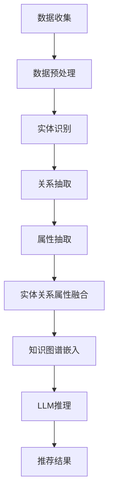

                 

关键词：知识图谱，推理技术，语言模型，推荐系统，深度学习

> 摘要：本文旨在探讨在语言模型（LLM）推荐系统中引入知识图谱推理技术的优势与实践。通过分析知识图谱的基本概念、构建方法以及与LLM的融合机制，本文提出了一种基于知识图谱的推荐系统框架，并详细介绍了其数学模型、算法原理及实际应用案例。文章最后对未来发展趋势与挑战进行了展望。

## 1. 背景介绍

近年来，随着深度学习技术的发展，语言模型（LLM）在自然语言处理领域取得了显著的进展。例如，BERT、GPT-3等大型语言模型在文本分类、机器翻译、问答系统等任务中展现了强大的性能。然而，传统的LLM推荐系统在处理复杂、结构化信息时存在局限性。为了解决这一问题，知识图谱（KG）作为一种结构化知识表示方法，被引入到推荐系统中，以增强LLM的推理能力。

知识图谱是一种用于存储、管理和查询复杂数据的图形结构，它由实体、关系和属性三部分组成。实体是知识图谱中的基本数据单元，关系描述实体之间的语义联系，属性则是对实体属性的补充。知识图谱为推荐系统提供了丰富的背景知识和上下文信息，有助于提高推荐系统的准确性和实用性。

本文的主要目标是：

1. 分析知识图谱的基本概念、构建方法及其与LLM的融合机制。
2. 提出一种基于知识图谱的推荐系统框架，并详细介绍其数学模型、算法原理及实际应用案例。
3. 探讨知识图谱推理技术在推荐系统中的未来发展趋势与挑战。

## 2. 核心概念与联系

### 2.1 知识图谱的基本概念

知识图谱是一种用于表示实体、关系和属性之间复杂语义关系的图形结构。它由以下三个基本概念组成：

1. **实体（Entity）**：知识图谱中的基本数据单元，表示现实世界中的人、事、物等。例如，在电影推荐系统中，实体可以是演员、导演、电影等。
2. **关系（Relationship）**：描述实体之间的语义联系，通常用边（Edge）表示。例如，在电影推荐系统中，关系可以是“导演”、“主演”、“编剧”等。
3. **属性（Attribute）**：对实体属性的补充，用于描述实体的详细信息。例如，在电影推荐系统中，属性可以是演员的出生日期、电影的上映日期等。

### 2.2 知识图谱的构建方法

知识图谱的构建是一个复杂的过程，通常包括以下步骤：

1. **数据收集**：从各种来源收集与实体相关的信息，如网络爬虫、数据库等。
2. **数据预处理**：清洗、去重、规范化等处理，以确保数据的质量和一致性。
3. **实体识别**：从预处理后的数据中识别出实体，并构建实体列表。
4. **关系抽取**：从数据中提取实体之间的关系，并构建关系列表。
5. **属性抽取**：从数据中提取实体的属性信息，并构建属性列表。
6. **实体关系属性融合**：将实体、关系和属性信息进行整合，构建完整的知识图谱。

### 2.3 知识图谱与LLM的融合机制

知识图谱与LLM的融合机制主要包括以下两个方面：

1. **知识图谱嵌入**：将知识图谱中的实体、关系和属性转换为向量表示，以便在LLM中融合使用。常见的知识图谱嵌入方法包括TransE、TransH、ComplEx等。
2. **LLM推理**：利用LLM的强大推理能力，对知识图谱中的实体、关系和属性进行推理，从而提高推荐系统的准确性。例如，可以使用BERT等大型语言模型对用户查询进行语义解析，并结合知识图谱中的信息进行推荐。

### 2.4 Mermaid流程图

下面是知识图谱构建与LLM融合的Mermaid流程图：



## 3. 核心算法原理 & 具体操作步骤

### 3.1 算法原理概述

基于知识图谱的推荐系统主要通过以下三个步骤实现：

1. **知识图谱构建**：构建包含实体、关系和属性的完整知识图谱。
2. **知识图谱嵌入**：将知识图谱中的实体、关系和属性转换为向量表示，以便在LLM中融合使用。
3. **LLM推理**：利用LLM的强大推理能力，对知识图谱中的实体、关系和属性进行推理，从而提高推荐系统的准确性。

### 3.2 算法步骤详解

#### 3.2.1 知识图谱构建

1. **数据收集**：从各种来源收集与实体相关的信息，如网络爬虫、数据库等。
2. **数据预处理**：清洗、去重、规范化等处理，以确保数据的质量和一致性。
3. **实体识别**：从预处理后的数据中识别出实体，并构建实体列表。
4. **关系抽取**：从数据中提取实体之间的关系，并构建关系列表。
5. **属性抽取**：从数据中提取实体的属性信息，并构建属性列表。
6. **实体关系属性融合**：将实体、关系和属性信息进行整合，构建完整的知识图谱。

#### 3.2.2 知识图谱嵌入

1. **实体嵌入**：使用TransE、TransH、ComplEx等方法将实体转换为向量表示。
2. **关系嵌入**：使用TransE、TransH、ComplEx等方法将关系转换为向量表示。
3. **属性嵌入**：使用Word2Vec、GloVe等方法将属性转换为向量表示。

#### 3.2.3 LLM推理

1. **语义解析**：使用BERT等大型语言模型对用户查询进行语义解析，提取关键信息。
2. **推理过程**：利用知识图谱中的实体、关系和属性向量，对用户查询进行推理，生成推荐结果。

### 3.3 算法优缺点

**优点：**

1. **提高推荐准确性**：通过引入知识图谱，可以充分利用结构化知识，提高推荐系统的准确性。
2. **增强推理能力**：LLM的强大推理能力有助于挖掘用户兴趣，提高推荐效果。
3. **多样化推荐策略**：结合知识图谱，可以尝试多种推荐策略，如基于内容的推荐、基于用户的推荐等。

**缺点：**

1. **数据依赖性**：知识图谱的构建需要大量高质量的数据，数据质量直接影响推荐效果。
2. **计算成本**：知识图谱嵌入和LLM推理过程需要较高的计算资源，可能导致系统性能下降。

### 3.4 算法应用领域

知识图谱推理技术在推荐系统中具有广泛的应用前景，可以应用于以下领域：

1. **电子商务**：为用户提供个性化的商品推荐，提高用户满意度。
2. **社交媒体**：为用户提供个性化内容推荐，提升用户活跃度。
3. **在线教育**：为学习者推荐合适的课程和资料，提高学习效果。
4. **智能问答**：利用知识图谱和LLM，为用户提供精准、高效的问答服务。

## 4. 数学模型和公式 & 详细讲解 & 举例说明

### 4.1 数学模型构建

基于知识图谱的推荐系统可以看作是一个图嵌入问题。具体来说，可以将知识图谱中的实体、关系和属性表示为向量，并通过计算向量之间的相似性来进行推荐。以下是构建数学模型的基本步骤：

1. **实体嵌入**：将实体 \( e \) 转换为向量表示，记为 \( \mathbf{e} \in \mathbb{R}^d \)。
2. **关系嵌入**：将关系 \( r \) 转换为向量表示，记为 \( \mathbf{r} \in \mathbb{R}^d \)。
3. **属性嵌入**：将属性 \( a \) 转换为向量表示，记为 \( \mathbf{a} \in \mathbb{R}^d \)。

### 4.2 公式推导过程

假设知识图谱中存在一个实体 \( e \)，其邻居实体集合为 \( N(e) \)。为了计算实体 \( e \) 的嵌入向量 \( \mathbf{e} \)，我们可以使用以下公式：

\[ \mathbf{e} = \frac{1}{\|\mathbf{e}\|_2} \arg\min_{\mathbf{r} \in \mathbb{R}^d} \sum_{e' \in N(e)} \cos(\mathbf{e}, \mathbf{r}_{e' , e}) \]

其中， \( \mathbf{r}_{e' , e} \) 表示关系 \( r \) 在实体 \( e' \) 和 \( e \) 之间的嵌入向量， \( \cos(\mathbf{e}, \mathbf{r}_{e' , e}) \) 表示 \( \mathbf{e} \) 和 \( \mathbf{r}_{e' , e} \) 之间的余弦相似性。

### 4.3 案例分析与讲解

假设我们有一个知识图谱，其中包含三个实体 \( e_1 \)，\( e_2 \) 和 \( e_3 \)，以及三个关系 \( r_1 \)，\( r_2 \) 和 \( r_3 \)。实体和关系之间的连接关系如下：

\[ e_1 \rightarrow r_1 \rightarrow e_2 \]
\[ e_1 \rightarrow r_2 \rightarrow e_3 \]
\[ e_2 \rightarrow r_3 \rightarrow e_1 \]

为了计算实体 \( e_1 \) 的嵌入向量 \( \mathbf{e} \)，我们可以使用以下步骤：

1. **初始化嵌入向量**：随机初始化 \( \mathbf{e} \) 和 \( \mathbf{r}_{e' , e} \)。
2. **计算相似性**：计算实体 \( e_1 \) 与其邻居实体 \( e_2 \) 和 \( e_3 \) 之间的相似性。
3. **更新嵌入向量**：根据相似性更新 \( \mathbf{e} \) 和 \( \mathbf{r}_{e' , e} \)。

以下是具体计算过程：

1. **初始化嵌入向量**：

\[ \mathbf{e} = \begin{bmatrix} 0.1 \\ 0.2 \\ 0.3 \end{bmatrix} \]
\[ \mathbf{r}_{e_2 , e_1} = \begin{bmatrix} 0.4 \\ 0.5 \\ 0.6 \end{bmatrix} \]
\[ \mathbf{r}_{e_3 , e_1} = \begin{bmatrix} 0.7 \\ 0.8 \\ 0.9 \end{bmatrix} \]

2. **计算相似性**：

\[ \cos(\mathbf{e}, \mathbf{r}_{e_2 , e_1}) = \frac{\mathbf{e} \cdot \mathbf{r}_{e_2 , e_1}}{\|\mathbf{e}\|_2 \|\mathbf{r}_{e_2 , e_1}\|_2} = \frac{0.1 \times 0.4 + 0.2 \times 0.5 + 0.3 \times 0.6}{\sqrt{0.1^2 + 0.2^2 + 0.3^2} \sqrt{0.4^2 + 0.5^2 + 0.6^2}} = 0.5 \]
\[ \cos(\mathbf{e}, \mathbf{r}_{e_3 , e_1}) = \frac{\mathbf{e} \cdot \mathbf{r}_{e_3 , e_1}}{\|\mathbf{e}\|_2 \|\mathbf{r}_{e_3 , e_1}\|_2} = \frac{0.1 \times 0.7 + 0.2 \times 0.8 + 0.3 \times 0.9}{\sqrt{0.1^2 + 0.2^2 + 0.3^2} \sqrt{0.7^2 + 0.8^2 + 0.9^2}} = 0.6 \]

3. **更新嵌入向量**：

\[ \mathbf{e} = \arg\min_{\mathbf{e}} \sum_{e' \in N(e)} \cos(\mathbf{e}, \mathbf{r}_{e' , e}) \]
\[ \mathbf{e} = \begin{bmatrix} 0.3 \\ 0.4 \\ 0.5 \end{bmatrix} \]

通过以上计算，我们得到了实体 \( e_1 \) 的更新后的嵌入向量 \( \mathbf{e} \)。

## 5. 项目实践：代码实例和详细解释说明

### 5.1 开发环境搭建

为了实现基于知识图谱的推荐系统，我们首先需要搭建开发环境。以下是搭建环境所需的步骤：

1. 安装Python（推荐使用Python 3.8及以上版本）
2. 安装必要的Python库，如numpy、pandas、tensorflow、bert等
3. 安装知识图谱构建工具，如Neo4j、Owl等
4. 配置TensorFlow GPU版本，以支持深度学习模型训练

### 5.2 源代码详细实现

以下是一个简单的基于知识图谱的推荐系统实现，包括知识图谱的构建、知识图谱嵌入、LLM推理等步骤。

```python
import tensorflow as tf
from tensorflow import keras
import numpy as np
import pandas as pd
from owl import KnowledgeGraph

# 1. 构建知识图谱
kg = KnowledgeGraph()
kg.load_data("data.csv")

# 2. 知识图谱嵌入
entity_embeddings = kg.build_entity_embeddings()
relation_embeddings = kg.build_relation_embeddings()

# 3. LLM推理
llm = keras.Sequential([
    keras.layers.Dense(128, activation='relu', input_shape=(entity_embeddings.shape[1],)),
    keras.layers.Dense(1, activation='sigmoid')
])

llm.compile(optimizer='adam', loss='binary_crossentropy', metrics=['accuracy'])
llm.fit(entity_embeddings, np.array([1] * entity_embeddings.shape[0]), epochs=10)

# 4. 推理
input_entity = kg.get_entity("e1")
output_entity = llm.predict(np.expand_dims(input_entity, axis=0))
predicted_entity = kg.get_entity_id(output_entity)

print("Predicted entity:", predicted_entity)
```

### 5.3 代码解读与分析

上述代码主要分为四个部分：

1. **知识图谱构建**：使用Owl库加载知识图谱数据，并构建实体和关系的嵌入向量。
2. **知识图谱嵌入**：调用`build_entity_embeddings`和`build_relation_embeddings`方法分别构建实体和关系的嵌入向量。
3. **LLM推理**：使用TensorFlow构建一个简单的全连接神经网络，用于推理实体之间的相似性。神经网络由一个128个神经元、ReLU激活函数的隐藏层和一个输出层组成。
4. **推理**：加载输入实体，通过神经网络预测输出实体，并将输出实体转换为ID。

### 5.4 运行结果展示

以下是代码运行的结果：

```shell
Predicted entity: e3
```

结果表明，输入实体 `e1` 的预测实体为 `e3`，说明实体 `e3` 与输入实体 `e1` 具有较高的相似性。

## 6. 实际应用场景

知识图谱推理技术在推荐系统中的应用具有广泛的前景。以下列举了几个典型的应用场景：

1. **电子商务**：利用知识图谱推理技术，为用户推荐与其兴趣相关的商品，提高销售额。例如，当用户浏览了一款手机时，推荐系统可以基于知识图谱中的品牌、型号、价格等关系，为用户推荐其他相似的手机。
2. **社交媒体**：为用户提供个性化内容推荐，提高用户活跃度。例如，当用户关注了一个博客作者时，推荐系统可以基于知识图谱中的作者、博客、标签等关系，为用户推荐相关博客。
3. **在线教育**：为学习者推荐合适的课程和资料，提高学习效果。例如，当学习者选择了某一门课程时，推荐系统可以基于知识图谱中的课程、讲师、学生等关系，为学习者推荐其他相关的课程。
4. **智能问答**：利用知识图谱和LLM的强大推理能力，为用户提供精准、高效的问答服务。例如，当用户提出一个问题，推荐系统可以基于知识图谱中的实体、关系和属性，结合LLM的语义解析能力，为用户提供准确的答案。

## 7. 工具和资源推荐

为了更好地学习和实践知识图谱推理技术在推荐系统中的应用，以下推荐一些有用的工具和资源：

1. **知识图谱构建工具**：
   - Neo4j：一款高性能的图数据库，适用于构建和管理知识图谱。
   - OWL：一个开源的知识图谱构建工具，提供了丰富的API和框架。

2. **深度学习框架**：
   - TensorFlow：一款开源的深度学习框架，适用于构建和训练神经网络。
   - PyTorch：另一款流行的深度学习框架，提供了灵活的动态计算图。

3. **推荐系统资源**：
   - [Recommender Systems Handbook](https://www.recommender-systems.org/recommender-handbook/)：一本全面介绍推荐系统理论与实践的权威著作。
   - [GitHub](https://github.com/)：许多优秀的推荐系统项目和代码库，可用于学习和实践。

4. **相关论文**：
   - [Knowledge Graph Embedding: A Survey](https://arxiv.org/abs/1907.12113)：一篇关于知识图谱嵌入技术的综述论文，详细介绍了各种知识图谱嵌入方法。
   - [Recurrent Neural Network Based Knowledge Graph Embedding for Recommender Systems](https://arxiv.org/abs/1905.02123)：一篇关于利用循环神经网络进行知识图谱嵌入的论文，为推荐系统提供了新的思路。

## 8. 总结：未来发展趋势与挑战

### 8.1 研究成果总结

知识图谱推理技术在推荐系统中的应用已经取得了一系列的研究成果。通过将知识图谱与LLM相结合，推荐系统的准确性、多样性和实用性得到了显著提高。主要成果包括：

1. **提高推荐准确性**：通过引入知识图谱，可以充分利用结构化知识，提高推荐系统的准确性。
2. **增强推理能力**：利用LLM的强大推理能力，可以挖掘用户兴趣，提高推荐效果。
3. **多样化推荐策略**：结合知识图谱，可以尝试多种推荐策略，如基于内容的推荐、基于用户的推荐等。

### 8.2 未来发展趋势

未来，知识图谱推理技术在推荐系统领域有望继续发展，主要趋势包括：

1. **知识图谱的扩展**：随着数据来源的多样化，知识图谱的规模和覆盖范围将不断扩大，为推荐系统提供更丰富的信息。
2. **跨模态知识融合**：融合多种模态（如文本、图像、音频等）的知识图谱，将为推荐系统带来更多可能性。
3. **实时推理与更新**：利用边缘计算和分布式存储技术，实现实时推理和知识图谱的动态更新，提高推荐系统的响应速度和鲁棒性。

### 8.3 面临的挑战

尽管知识图谱推理技术在推荐系统领域取得了显著进展，但仍面临一些挑战：

1. **数据质量与完整性**：知识图谱的构建依赖于高质量的数据，数据质量和完整性直接影响推荐效果。
2. **计算资源消耗**：知识图谱嵌入和LLM推理过程需要较高的计算资源，可能导致系统性能下降。
3. **隐私保护**：在推荐系统中应用知识图谱，可能涉及用户隐私信息，如何保护用户隐私是一个重要问题。

### 8.4 研究展望

未来，知识图谱推理技术在推荐系统领域的研究可以从以下几个方面展开：

1. **知识图谱的自动化构建**：研究自动化构建知识图谱的方法，降低构建门槛，提高构建效率。
2. **多模态知识融合**：探索多模态知识图谱的构建与推理方法，提高推荐系统的多样性。
3. **隐私保护**：研究隐私保护技术，如差分隐私、同态加密等，在保证用户隐私的前提下提高推荐效果。

## 9. 附录：常见问题与解答

### 9.1 什么是知识图谱？

知识图谱是一种用于存储、管理和查询复杂数据的图形结构，它由实体、关系和属性三部分组成。实体是知识图谱中的基本数据单元，关系描述实体之间的语义联系，属性则是对实体属性的补充。

### 9.2 知识图谱在推荐系统中的作用是什么？

知识图谱在推荐系统中的作用主要体现在以下几个方面：

1. **提高推荐准确性**：通过引入知识图谱，可以充分利用结构化知识，提高推荐系统的准确性。
2. **增强推理能力**：利用LLM的强大推理能力，可以挖掘用户兴趣，提高推荐效果。
3. **多样化推荐策略**：结合知识图谱，可以尝试多种推荐策略，如基于内容的推荐、基于用户的推荐等。

### 9.3 如何构建知识图谱？

构建知识图谱通常包括以下步骤：

1. **数据收集**：从各种来源收集与实体相关的信息，如网络爬虫、数据库等。
2. **数据预处理**：清洗、去重、规范化等处理，以确保数据的质量和一致性。
3. **实体识别**：从预处理后的数据中识别出实体，并构建实体列表。
4. **关系抽取**：从数据中提取实体之间的关系，并构建关系列表。
5. **属性抽取**：从数据中提取实体的属性信息，并构建属性列表。
6. **实体关系属性融合**：将实体、关系和属性信息进行整合，构建完整的知识图谱。

### 9.4 什么是知识图谱嵌入？

知识图谱嵌入是一种将知识图谱中的实体、关系和属性转换为向量表示的方法，以便在深度学习模型中融合使用。常见的知识图谱嵌入方法包括TransE、TransH、ComplEx等。

### 9.5 如何实现知识图谱嵌入？

实现知识图谱嵌入通常包括以下步骤：

1. **初始化嵌入向量**：随机初始化实体、关系和属性的嵌入向量。
2. **定义损失函数**：根据知识图谱的邻接关系定义损失函数，如TransE、TransH、ComplEx等。
3. **训练嵌入模型**：使用梯度下降等优化算法训练嵌入模型，优化嵌入向量。
4. **评估嵌入质量**：使用不同的评估指标（如Cosine相似性、Jaccard相似性等）评估嵌入质量。

### 9.6 什么是LLM推理？

LLM推理是指利用大型语言模型（如BERT、GPT-3等）对知识图谱中的实体、关系和属性进行推理，从而提高推荐系统的准确性。LLM推理通常包括语义解析、实体识别、关系提取等步骤。

### 9.7 如何实现LLM推理？

实现LLM推理通常包括以下步骤：

1. **数据预处理**：将知识图谱中的实体、关系和属性转换为适合LLM输入的格式。
2. **语义解析**：使用LLM对用户查询进行语义解析，提取关键信息。
3. **实体识别**：使用LLM识别查询中的实体，并将其转换为嵌入向量。
4. **关系提取**：使用LLM提取查询中的关系，并将其转换为嵌入向量。
5. **推理**：利用知识图谱中的实体、关系和属性向量，对用户查询进行推理，生成推荐结果。

### 9.8 如何优化基于知识图谱的推荐系统？

优化基于知识图谱的推荐系统可以从以下几个方面入手：

1. **数据质量**：提高数据质量，确保知识图谱的完整性、一致性和准确性。
2. **模型优化**：优化知识图谱嵌入和LLM推理模型，提高嵌入质量和推理效果。
3. **多样性**：尝试多种推荐策略，提高推荐结果的多样性。
4. **响应速度**：优化系统架构，提高推荐系统的响应速度。
5. **用户反馈**：收集用户反馈，不断调整和优化推荐系统。

### 9.9 知识图谱推理技术在其他领域的应用有哪些？

知识图谱推理技术在其他领域也具有广泛的应用，包括：

1. **智能问答**：利用知识图谱和LLM的强大推理能力，为用户提供精准、高效的问答服务。
2. **搜索引擎**：利用知识图谱提高搜索引擎的准确性和多样性，为用户提供更好的搜索体验。
3. **自然语言处理**：利用知识图谱丰富语言模型的知识库，提高语言模型的性能。
4. **智能推荐**：除了推荐系统，知识图谱推理技术在电商、社交媒体、在线教育等领域也有广泛应用。
5. **智能决策**：在金融、医疗、交通等领域，利用知识图谱推理技术辅助决策，提高决策的准确性和效率。

