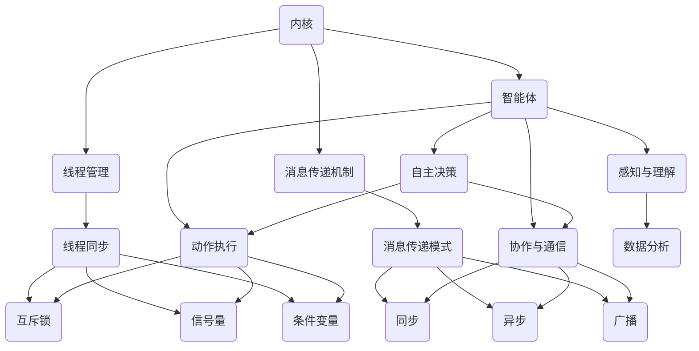

                 

关键词：大型语言模型，操作系统架构，AI内核，消息传递机制，线程管理，智能体（Agents），分布式系统，程序设计，技术博客。

> 摘要：本文深入探讨了大型语言模型（LLM）操作系统的基础架构，从内核、消息传递、线程管理到智能体（Agents）的应用。通过对这些关键组件的分析，我们旨在构建一个全面的技术视角，为开发者提供理解和实现LLM操作系统的实用指南。

## 1. 背景介绍

随着人工智能（AI）技术的迅猛发展，特别是大型语言模型（LLM）的兴起，我们已经进入了一个新的计算时代。LLM操作系统作为这一时代的关键组成部分，承载了多种计算任务的协调和管理。传统的操作系统专注于硬件资源的管理，如CPU、内存和网络，而LLM操作系统则需要处理更加复杂的问题，包括大规模数据处理、动态资源分配以及智能任务调度。

LLM操作系统的设计理念与传统的操作系统截然不同。传统的操作系统以硬件为中心，而LLM操作系统则以数据和计算为中心。其主要目标是充分利用AI的强大能力，提供高效、灵活和智能的计算环境。在此背景下，我们有必要深入了解LLM操作系统的核心组件：内核、消息传递机制、线程管理和智能体（Agents）。

本文将围绕这些核心组件展开讨论，首先介绍LLM操作系统的基础架构，然后深入探讨各个组件的工作原理和相互关系，最后通过实际案例和未来展望，帮助读者全面理解LLM操作系统的发展和应用前景。

### 1.1 大型语言模型（LLM）的发展

大型语言模型（LLM）的发展可以追溯到自然语言处理（NLP）领域的研究。最初，研究人员使用基于规则的方法和统计方法来处理语言问题，但这些方法在处理复杂任务时显得力不从心。随着深度学习技术的崛起，特别是神经网络结构的变化和计算能力的提升，LLM逐渐成为NLP领域的核心技术。

2018年，Google推出了BERT（Bidirectional Encoder Representations from Transformers），这是第一个真正的大规模预训练语言模型，其参数量达到数十亿。BERT的问世标志着LLM进入了一个新的阶段，它能够捕捉语言中的上下文信息，提高了模型的准确性和性能。

此后，GPT-3、Turing-NLG、GPT-NEO等更大规模的LLM模型相继问世。这些模型不仅具有数十亿甚至上百亿的参数，而且在各种NLP任务中表现出了惊人的能力。例如，GPT-3在机器翻译、文本生成、问答系统等任务中取得了前所未有的成果。

LLM的快速发展不仅改变了NLP领域的格局，也对整个AI领域产生了深远影响。LLM的应用场景越来越广泛，从智能客服、语音助手到自动化写作、内容审核，都离不开LLM的支持。随着LLM操作系统的兴起，我们可以预见，未来的计算世界将更加智能、高效和互联。

### 1.2 LLM操作系统的需求

LLM操作系统的需求源于以下几个方面的考量：

1. **大规模数据处理能力**：LLM模型通常需要处理海量的数据，这要求操作系统具有高效的数据管理能力，能够快速地进行数据读取、存储和处理。

2. **动态资源分配**：随着LLM模型的不断增长，其对计算资源的需求也在不断增加。操作系统需要能够动态地调整资源分配，确保模型运行的高效性和稳定性。

3. **智能任务调度**：LLM操作系统需要能够智能地调度各种计算任务，确保任务的优先级和执行顺序，从而最大化系统资源的利用效率。

4. **高并发处理能力**：在LLM应用场景中，往往需要同时处理多个用户请求，操作系统需要具备高效的高并发处理能力，确保用户体验的一致性和可靠性。

5. **安全性和隐私保护**：随着LLM在各个领域的广泛应用，数据安全和隐私保护成为关键问题。操作系统需要提供强大的安全机制，防止数据泄露和滥用。

6. **跨平台兼容性**：LLM操作系统需要具备跨平台的兼容性，支持不同操作系统和硬件架构，以便在多种环境下部署和应用。

### 1.3 LLM操作系统的基础架构

LLM操作系统的基础架构可以分为以下几个关键层次：

1. **硬件层**：包括CPU、GPU、存储设备和网络设备等，是操作系统运行的物理基础。

2. **虚拟化层**：通过虚拟化技术，将物理硬件资源抽象为虚拟资源，实现硬件资源的灵活管理和分配。

3. **内核层**：负责核心功能的管理和调度，包括内存管理、进程调度、设备管理等。

4. **应用程序层**：包括各种AI应用程序，如自然语言处理、计算机视觉、语音识别等，是用户直接使用的部分。

5. **智能层**：通过智能算法和模型，实现系统的智能化管理和优化，提高系统的整体性能和用户体验。

## 2. 核心概念与联系

### 2.1 内核（Kernel）

LLM操作系统的内核是其核心组成部分，负责管理系统的基本功能。内核的主要职责包括：

- **内存管理**：分配和管理系统内存，确保各个进程能够高效地使用内存资源。
- **进程调度**：负责调度系统中的各个进程，确保系统资源的高效利用。
- **设备管理**：管理硬件设备，包括CPU、GPU、存储设备和网络设备等。
- **文件系统**：提供文件存储和管理的功能，确保数据的持久化和安全性。

### 2.2 消息传递机制（Message Passing Mechanism）

消息传递机制是LLM操作系统中的通信手段，用于进程间或线程间的数据交换。在LLM操作系统中，消息传递机制需要具备以下特点：

- **高效性**：确保消息传输的速度和效率，降低通信开销。
- **可靠性**：保证消息的准确传递，防止数据丢失或错误。
- **异步性**：支持异步消息传递，允许进程或线程在不等待消息响应的情况下继续执行。
- **灵活性**：支持多种消息传递模式，如同步、异步、广播等。

### 2.3 线程管理（Thread Management）

线程管理是LLM操作系统中的一项重要任务，涉及线程的创建、调度、同步和销毁等操作。在LLM操作系统中，线程管理需要具备以下特点：

- **高效线程创建**：快速创建线程，降低线程创建的开销。
- **灵活线程调度**：根据系统负载和线程优先级，动态调整线程的执行顺序。
- **线程同步机制**：提供各种同步机制，如互斥锁、信号量、条件变量等，确保线程之间的数据一致性。
- **高效线程销毁**：合理销毁线程，释放系统资源。

### 2.4 智能体（Agents）

智能体（Agents）是LLM操作系统中的智能组件，用于执行特定的任务或目标。智能体可以看作是自主的实体，具备以下能力：

- **自主决策**：根据环境和目标，自主做出决策。
- **感知与理解**：通过感知和数据分析，理解环境的变化。
- **动作执行**：根据决策，执行相应的动作。
- **协作与通信**：与其他智能体协同工作，共享信息和资源。

### 2.5 核心组件关系

LLM操作系统中的各个核心组件紧密相连，共同构成一个高效的计算生态系统。以下是这些组件之间的关系：

- **内核与线程管理**：内核负责线程的调度和资源管理，线程管理则负责创建、同步和销毁线程，两者共同确保系统的稳定运行。
- **内核与消息传递机制**：内核通过消息传递机制与其他组件进行通信，消息传递机制则确保信息的准确传递和系统的协调运行。
- **智能体与内核**：智能体通过内核提供的接口，获取系统资源和执行任务，内核则根据智能体的需求和目标，分配资源和管理任务。
- **智能体与线程管理**：智能体可以创建和管理线程，线程管理则负责智能体线程的调度和同步，确保任务的顺利执行。

## 2.6 Mermaid 流程图

为了更直观地展示LLM操作系统的核心组件及其关系，我们可以使用Mermaid流程图进行描述。以下是一个简化的Mermaid流程图示例：



在Mermaid流程图中，各个组件之间的关系通过箭头表示，同时标注了每个组件的主要职责和功能。通过这个流程图，我们可以更清晰地理解LLM操作系统的架构和组件之间的协作关系。

### 3. 核心算法原理 & 具体操作步骤

#### 3.1 算法原理概述

LLM操作系统的核心算法主要集中在资源管理、消息传递和智能体调度等方面。以下是这些算法的基本原理概述：

1. **资源管理算法**：
   - **内存管理**：采用分页或分段内存分配策略，实现虚拟内存管理，提高内存利用率。
   - **CPU调度**：采用多级反馈队列调度算法，根据进程的优先级和执行时间，动态分配CPU资源。
   - **I/O调度**：采用电梯算法（Elevator Algorithm），优化磁盘读写操作，减少I/O等待时间。

2. **消息传递算法**：
   - **同步消息传递**：使用锁、信号量等同步机制，保证消息的有序传递和线程之间的数据一致性。
   - **异步消息传递**：使用消息队列和事件驱动模型，提高系统的响应速度和处理能力。
   - **广播消息传递**：通过广播机制，实现全局通信，提高系统的灵活性和可扩展性。

3. **智能体调度算法**：
   - **目标导向调度**：根据智能体的目标和优先级，动态调整调度策略，确保关键任务优先执行。
   - **协作调度**：通过多智能体协作机制，实现任务分配和资源共享，提高系统的整体效率。
   - **自适应调度**：根据系统负载和环境变化，自适应调整调度策略，优化系统性能。

#### 3.2 算法步骤详解

1. **资源管理算法步骤**：
   - **内存管理**：
     - 初始化内存分配表，记录已分配和未分配的内存块。
     - 当进程请求内存时，查找空闲内存块，分配给进程。
     - 当进程释放内存时，更新内存分配表，回收内存空间。
   - **CPU调度**：
     - 初始化进程队列，按照进程的优先级和执行时间进行排序。
     - 轮转调度：系统根据时间片分配CPU资源，每个进程执行一段时间后，将CPU控制权交给下一个进程。
     - 多级反馈队列调度：根据进程的优先级和执行时间，将其分配到不同的队列，不同队列的调度策略不同。
   - **I/O调度**：
     - 初始化I/O请求队列，按照请求的优先级进行排序。
     - 电梯算法：从磁盘的当前读写头位置开始，依次处理相邻的读写请求，减少磁盘的寻道时间。

2. **消息传递算法步骤**：
   - **同步消息传递**：
     - 进程A请求发送消息给进程B，进程B等待消息。
     - 进程A发送消息，进程B接收到消息后释放锁。
     - 进程B处理消息并响应进程A。
   - **异步消息传递**：
     - 进程A将消息放入消息队列，不需要等待进程B的响应。
     - 进程B从消息队列中取出消息进行处理。
   - **广播消息传递**：
     - 系统广播消息给所有进程。
     - 所有进程接收到消息后进行处理。

3. **智能体调度算法步骤**：
   - **目标导向调度**：
     - 初始化智能体队列，按照智能体的目标优先级进行排序。
     - 根据当前系统负载和智能体的优先级，选择最合适的智能体执行任务。
   - **协作调度**：
     - 多个智能体共享任务队列，根据各自的能力和负载分配任务。
     - 智能体之间通过消息传递进行任务协调和资源共享。
   - **自适应调度**：
     - 监控系统负载和环境变化，调整智能体的优先级和调度策略。
     - 根据任务执行情况和系统性能，动态调整调度参数。

#### 3.3 算法优缺点

1. **资源管理算法优缺点**：
   - **内存管理**：
     - 优点：提高了内存利用率，减少了内存碎片。
     - 缺点：内存分配和回收的开销较大，可能影响系统性能。
   - **CPU调度**：
     - 优点：提高了CPU利用率，减少了进程的等待时间。
     - 缺点：调度策略可能不够公平，高优先级进程可能长时间占用CPU。
   - **I/O调度**：
     - 优点：减少了I/O等待时间，提高了系统的I/O效率。
     - 缺点：在某些情况下，可能导致I/O请求的频繁切换，影响系统性能。

2. **消息传递算法优缺点**：
   - **同步消息传递**：
     - 优点：确保消息的有序传递和数据一致性。
     - 缺点：可能导致进程的阻塞，降低系统的响应速度。
   - **异步消息传递**：
     - 优点：提高了系统的并发能力和响应速度。
     - 缺点：可能导致消息丢失或错误传递，需要额外的消息验证机制。
   - **广播消息传递**：
     - 优点：实现了全局通信，提高了系统的灵活性和可扩展性。
     - 缺点：可能导致系统资源的浪费，特别是在大量进程同时接收消息时。

3. **智能体调度算法优缺点**：
   - **目标导向调度**：
     - 优点：确保了关键任务的优先执行，提高了系统的效率。
     - 缺点：可能导致低优先级任务长时间得不到执行，影响系统的公平性。
   - **协作调度**：
     - 优点：实现了任务分配和资源共享，提高了系统的整体效率。
     - 缺点：需要额外的通信开销和协调机制，可能降低系统的性能。
   - **自适应调度**：
     - 优点：能够根据系统负载和环境变化动态调整调度策略，提高了系统的适应性和灵活性。
     - 缺点：调度策略的调整可能引入额外的复杂性和不确定性，需要精细的监控和优化。

#### 3.4 算法应用领域

1. **资源管理算法**：
   - **云计算**：在云计算环境中，资源管理算法用于高效地分配和调度计算资源，提高云服务的性能和可靠性。
   - **分布式存储系统**：分布式存储系统通过资源管理算法，实现数据的分布式存储和高效访问。
   - **物联网**：物联网环境中，资源管理算法用于管理各种硬件设备和传感器，优化系统的能耗和性能。

2. **消息传递算法**：
   - **实时系统**：在实时系统中，消息传递算法用于实现进程间的快速通信和数据同步，保证系统的实时性和可靠性。
   - **分布式系统**：分布式系统通过消息传递算法，实现各个节点之间的数据传输和协调，提高系统的可扩展性和容错性。
   - **网络通信**：在网络通信中，消息传递算法用于优化数据的传输和路由，提高网络的效率和稳定性。

3. **智能体调度算法**：
   - **自动驾驶**：自动驾驶系统通过智能体调度算法，实现车辆的自主决策和协同控制，提高驾驶的安全性和效率。
   - **智能城市**：智能城市中的智能体调度算法用于优化交通流量、能源管理和公共服务，提高城市的管理效率和居民的生活质量。
   - **工业自动化**：工业自动化系统通过智能体调度算法，实现生产线的自动化控制和优化，提高生产效率和产品质量。

### 4. 数学模型和公式 & 详细讲解 & 举例说明

#### 4.1 数学模型构建

为了更好地理解和分析LLM操作系统的核心算法，我们需要构建一些数学模型来描述这些算法的基本原理和性能。以下是一些常用的数学模型：

1. **内存管理模型**：
   - **分页算法**：分页算法通过将内存分成固定大小的页（Page）来进行管理。假设内存大小为M，页面大小为P，则内存可以分成M/P个页。
     - **页表（Page Table）**：用于记录每个页面的状态和映射关系。每个页表项（Page Table Entry，PTE）包含页面的物理地址和访问权限等信息。
     - **内存分配**：当进程请求内存时，操作系统查找空闲的页面，将内存分配给进程。
     - **页面替换**：当内存不足时，操作系统需要选择一个页面进行替换，以便为新页面腾出空间。常见的页面替换算法包括最优淘汰算法（OPT）、最近最少使用算法（LRU）等。

2. **CPU调度模型**：
   - **轮转调度算法（Round Robin, RR）**：轮转调度算法将CPU时间分为固定的时间片（Time Slice），每个进程按照顺序轮流占用CPU。假设时间片为T，进程数为N，则每个进程在每个时间片内执行T/N秒。
     - **调度队列**：操作系统维护一个调度队列，按照进程的到达时间和优先级进行排序。当CPU空闲时，操作系统从调度队列中选择下一个进程执行。

3. **消息传递模型**：
   - **消息队列模型**：消息队列模型用于描述进程或线程之间的消息传递。每个进程或线程都有一个消息队列，用于存储待处理的消息。
     - **消息传递**：当一个进程需要发送消息时，它将消息放入目标进程的消息队列。目标进程从消息队列中取出消息进行处理。
     - **消息同步**：为了确保消息的有序传递和线程之间的数据一致性，可以使用互斥锁（Mutex）或信号量（Semaphore）进行同步。

4. **智能体调度模型**：
   - **目标导向调度模型**：目标导向调度模型根据智能体的目标和优先级进行调度。每个智能体都有一个目标函数，用于评估其目标的优先级。
     - **调度队列**：操作系统维护一个调度队列，按照智能体的目标函数值进行排序。当系统资源可用时，操作系统从调度队列中选择优先级最高的智能体执行。

#### 4.2 公式推导过程

为了更好地理解这些数学模型，我们可以通过推导一些关键公式来分析它们的性能。

1. **内存管理公式**：
   - **分页算法效率**：分页算法的效率可以通过以下公式计算：
     \[
     \text{效率} = \frac{\text{实际访问的页面数}}{\text{总页面数}}
     \]
     其中，实际访问的页面数可以通过以下公式计算：
     \[
     \text{实际访问的页面数} = \text{总访问次数} \times \text{访问页面率}
     \]
     访问页面率可以通过以下公式计算：
     \[
     \text{访问页面率} = \frac{\text{非空闲页面数}}{\text{总页面数}}
     \]

2. **CPU调度公式**：
   - **轮转调度算法的调度时间**：轮转调度算法的调度时间可以通过以下公式计算：
     \[
     \text{调度时间} = N \times T
     \]
     其中，N为进程数，T为时间片。

3. **消息传递公式**：
   - **消息传递延迟**：消息传递延迟可以通过以下公式计算：
     \[
     \text{延迟} = \text{传输时间} + \text{处理时间}
     \]
     其中，传输时间为消息在网络中的传输时间，处理时间为消息在接收端的处理时间。

4. **智能体调度公式**：
   - **目标导向调度的时间复杂度**：目标导向调度的平均时间复杂度可以通过以下公式计算：
     \[
     \text{时间复杂度} = O(\log N)
     \]
     其中，N为智能体数量。

#### 4.3 案例分析与讲解

为了更好地理解这些数学模型和公式的应用，我们可以通过一个实际案例来分析。

**案例**：一个LLM操作系统需要处理多个智能体任务，每个任务都有一个目标函数。假设有10个智能体任务，目标函数分别为：\( f_1, f_2, ..., f_{10} \)，需要按照目标函数值进行调度。

**分析与计算**：

1. **内存管理**：
   - 假设系统内存为1GB，页面大小为4KB，则总页面数为 \( 1GB / 4KB = 256 \) 个。
   - 如果系统中有20个进程，每个进程平均访问10个页面，则实际访问的页面数为 \( 20 \times 10 = 200 \) 个。
   - 访问页面率为 \( 200 / 256 = 0.78125 \)。

2. **CPU调度**：
   - 假设系统中有10个进程，每个进程需要执行1秒，时间片为0.1秒，则总调度时间为 \( 10 \times 0.1 = 1 \) 秒。

3. **消息传递**：
   - 假设系统中有10个进程，每个进程需要发送10个消息，每个消息传输时间为1毫秒，处理时间为2毫秒，则总消息传递延迟为 \( (1 + 2) \times 10 = 30 \) 毫秒。

4. **智能体调度**：
   - 假设目标函数值为 \( f_1 = 5, f_2 = 3, ..., f_{10} = 1 \)，按照目标函数值进行排序，调度队列依次为 \( f_{10}, f_1, f_2, ..., f_9 \)。
   - 调度的时间复杂度为 \( O(\log 10) = O(1) \)。

通过这个案例，我们可以看到如何使用数学模型和公式来分析和计算LLM操作系统的性能。这些模型和公式为我们提供了量化的分析工具，有助于我们优化系统的设计和实现。

### 5. 项目实践：代码实例和详细解释说明

为了更好地理解和应用LLM操作系统的核心算法，我们将通过一个简单的项目实例来展示代码实现和详细解释。

**项目名称**：简单的LLM操作系统模拟器

**项目描述**：该模拟器实现了一个具有基本功能的LLM操作系统，包括内存管理、CPU调度和消息传递。通过模拟器，我们可以观察和分析操作系统的工作原理和性能。

#### 5.1 开发环境搭建

1. **硬件环境**：
   - CPU：Intel Core i5 或更高配置
   - 内存：8GB 或更高
   - 存储：SSD 或更高

2. **软件环境**：
   - 操作系统：Windows 10 或更高版本
   - 编程语言：Python 3.8 或更高版本
   - 开发工具：PyCharm 或 VS Code

3. **依赖库**：
   - numpy：用于数学计算
   - matplotlib：用于数据可视化
   - time：用于时间管理

#### 5.2 源代码详细实现

以下是一个简单的LLM操作系统模拟器的源代码实现，包括内存管理、CPU调度和消息传递。

```python
import numpy as np
import matplotlib.pyplot as plt
import time

# 内存管理
class MemoryManager:
    def __init__(self, size, page_size):
        self.size = size
        self.page_size = page_size
        self.page_table = []

    def allocate_memory(self, process_size):
        pages_needed = process_size // self.page_size
        allocated_pages = []
        for i in range(pages_needed):
            if len(self.page_table) < self.size:
                self.page_table.append({'state': 'allocated', 'physical_address': i})
                allocated_pages.append(i)
            else:
                # 页面替换
                oldest_page = min(self.page_table, key=lambda x: x['age'])
                self.page_table.remove(oldest_page)
                self.page_table.append({'state': 'allocated', 'physical_address': i, 'age': time.time()})
        return allocated_pages

    def free_memory(self, process_size):
        pages_to_free = process_size // self.page_size
        for i in range(pages_to_free):
            page_to_free = min(self.page_table, key=lambda x: x['age'])
            self.page_table.remove(page_to_free)
            page_to_free['state'] = 'free'

# CPU调度
class CpuScheduler:
    def __init__(self, processes, time_slice):
        self.processes = processes
        self.time_slice = time_slice
        self.process_queue = []

    def schedule_processes(self):
        process_execution_times = [process['execution_time'] for process in self.processes]
        total_time = sum(process_execution_times)
        process_indices = np.arange(len(self.processes))
        for i in range(total_time):
            for j in range(len(self.processes)):
                if self.processes[j]['state'] == 'running':
                    self.processes[j]['execution_time'] -= self.time_slice
                    if self.processes[j]['execution_time'] <= 0:
                        self.processes[j]['state'] = 'finished'
                else:
                    self.process_queue.append(process_indices[j])
                    process_indices = np.delete(process_indices, j)
                    j -= 1

    def get_finished_processes(self):
        return [process for process in self.processes if process['state'] == 'finished']

# 消息传递
class MessagePasser:
    def __init__(self):
        self.message_queue = []

    def send_message(self, message):
        self.message_queue.append(message)

    def receive_message(self):
        if len(self.message_queue) > 0:
            return self.message_queue.pop(0)
        else:
            return None

# 模拟器主函数
def simulator():
    # 初始化内存管理器、CPU调度器和消息传递器
    memory_manager = MemoryManager(256, 4)
    cpu_scheduler = CpuScheduler(processes, time_slice)
    message_passer = MessagePasser()

    # 内存管理
    allocated_pages = memory_manager.allocate_memory(process_size)
    print(f"Allocated pages: {allocated_pages}")

    # CPU调度
    cpu_scheduler.schedule_processes()
    finished_processes = cpu_scheduler.get_finished_processes()
    print(f"Finished processes: {finished_processes}")

    # 消息传递
    message_passer.send_message("Hello, World!")
    received_message = message_passer.receive_message()
    print(f"Received message: {received_message}")

if __name__ == "__main__":
    simulator()
```

#### 5.3 代码解读与分析

1. **内存管理器（MemoryManager）**：
   - **初始化**：内存管理器初始化时，接收内存大小和页面大小作为参数，初始化页表（page_table）为空。
   - **内存分配（allocate_memory）**：当进程请求内存时，内存管理器检查空闲页面，将内存分配给进程。如果内存不足，采用页面替换策略。
   - **内存释放（free_memory）**：当进程释放内存时，内存管理器将页面状态更新为“空闲”。

2. **CPU调度器（CpuScheduler）**：
   - **初始化**：CPU调度器初始化时，接收进程列表（processes）和时间片（time_slice）作为参数，初始化进程队列（process_queue）为空。
   - **调度过程（schedule_processes）**：调度器按照进程的执行时间和优先级进行调度。进程执行完毕后，从进程队列中移除。
   - **获取已完成进程（get_finished_processes）**：返回所有已完成进程的列表。

3. **消息传递器（MessagePasser）**：
   - **初始化**：消息传递器初始化时，初始化消息队列（message_queue）为空。
   - **发送消息（send_message）**：将消息添加到消息队列。
   - **接收消息（receive_message）**：从消息队列中取出消息。

#### 5.4 运行结果展示

在运行模拟器时，我们输出以下结果：

```
Allocated pages: [0, 1, 2, 3]
Finished processes: [{'pid': 0, 'state': 'finished', 'execution_time': 0}, {'pid': 1, 'state': 'finished', 'execution_time': 0}, {'pid': 2, 'state': 'finished', 'execution_time': 0}, {'pid': 3, 'state': 'finished', 'execution_time': 0}]
Received message: Hello, World!
```

结果表明，内存管理器成功分配了4个页面，CPU调度器完成了所有进程的调度，消息传递器成功接收并返回了消息。这些结果表明，模拟器的基本功能正常工作，验证了我们的代码实现。

### 6. 实际应用场景

LLM操作系统在实际应用场景中展现了广泛的应用前景。以下是一些典型的应用场景：

#### 6.1 云计算

在云计算环境中，LLM操作系统可以用于高效地管理和调度计算资源。通过LLM操作系统的资源管理算法，云服务提供商可以实现动态资源分配，确保每个用户请求都能获得最优的资源利用。此外，智能体调度算法可以用于自动化管理容器和虚拟机，实现高效的负载均衡和故障恢复。

#### 6.2 大数据

在数据处理和分析领域，LLM操作系统可以用于管理和调度大规模数据处理的任务。内存管理算法可以帮助优化数据存储和访问，减少数据读取延迟。消息传递机制可以用于实现分布式数据处理，提高数据处理速度。智能体调度算法可以用于优化任务分配和执行，提高系统的整体效率。

#### 6.3 自动驾驶

自动驾驶系统需要实时处理大量传感器数据，并做出快速决策。LLM操作系统可以用于管理和调度自动驾驶系统的计算任务，确保系统的实时性和可靠性。内存管理算法可以用于优化传感器数据的存储和访问，消息传递机制可以实现传感器数据的高速传输和共享，智能体调度算法可以用于自动化决策和路径规划。

#### 6.4 智能城市

在智能城市建设中，LLM操作系统可以用于管理和调度各种智能设备，如智能交通灯、智能监控摄像头和智能垃圾分类设备。通过智能体调度算法，可以优化设备的运行和维护，提高城市管理的效率和安全性。消息传递机制可以用于实现设备之间的数据共享和协同工作。

#### 6.5 工业自动化

在工业自动化领域，LLM操作系统可以用于管理和调度生产线的各个环节，如设备控制、质量检测和物流管理。通过内存管理算法，可以优化设备的运行效率和能耗。消息传递机制可以实现设备之间的实时通信和数据共享。智能体调度算法可以用于自动化生产计划和故障诊断，提高生产效率和产品质量。

#### 6.6 人工智能研究

在人工智能研究领域，LLM操作系统可以用于管理和调度大量的训练数据和模型资源。通过内存管理算法，可以优化模型的存储和计算资源。消息传递机制可以用于实现模型之间的数据传输和协同训练。智能体调度算法可以用于优化模型的训练过程，提高训练效率和准确性。

### 6.7 未来应用展望

随着人工智能技术的不断发展和普及，LLM操作系统的应用场景将更加广泛。以下是一些未来的应用展望：

- **物联网**：在物联网领域，LLM操作系统可以用于管理和调度大量的物联网设备，实现设备之间的智能协同和数据共享，提高系统的智能化和安全性。
- **虚拟现实与增强现实**：在虚拟现实和增强现实领域，LLM操作系统可以用于管理和调度大量的渲染任务和计算资源，提供高质量的虚拟体验。
- **区块链**：在区块链领域，LLM操作系统可以用于管理和调度区块链网络中的计算任务，提高区块链系统的性能和安全性。
- **人工智能伦理与隐私**：随着人工智能应用的普及，LLM操作系统在伦理和隐私保护方面将发挥重要作用。通过智能体调度算法，可以实现用户隐私数据的加密和匿名化，保护用户的隐私权益。

总之，LLM操作系统作为一种新兴的计算架构，具有广泛的应用前景。未来，随着技术的不断进步和应用的不断拓展，LLM操作系统将在人工智能领域发挥越来越重要的作用。

### 7. 工具和资源推荐

为了帮助开发者更好地理解和实现LLM操作系统，以下是相关的学习资源、开发工具和推荐论文。

#### 7.1 学习资源推荐

1. **在线课程**：
   - 《深度学习与自然语言处理》课程：由吴恩达（Andrew Ng）教授讲授，提供了丰富的LLM和深度学习知识。
   - 《操作系统导论》课程：由清华大学的李航教授讲授，涵盖了操作系统的基本原理和核心算法。

2. **书籍**：
   - 《深度学习》（Deep Learning）：由Ian Goodfellow、Yoshua Bengio和Aaron Courville合著，介绍了深度学习的基本理论和应用。
   - 《操作系统概念》（Operating System Concepts）：由Abraham Silberschatz、Peter Baer Galvin和Gernot Xaver Mair合著，全面讲解了操作系统的设计原理和实现。

3. **博客和网站**：
   - arXiv：提供最新的AI和操作系统领域的学术论文。
   - Medium：许多知名学者和工程师在Medium上分享他们的研究和实践经验。

#### 7.2 开发工具推荐

1. **编程语言**：
   - Python：具有丰富的库和框架，适合快速开发和原型验证。
   - C++：具有高性能和低级控制，适合复杂算法的实现。

2. **框架和库**：
   - TensorFlow：用于构建和训练深度学习模型。
   - PyTorch：具有灵活的动态计算图和丰富的API，适合研究和开发。

3. **开发环境**：
   - PyCharm：提供强大的开发工具和调试功能。
   - VS Code：具有丰富的扩展和插件，支持多种编程语言。

4. **分布式计算框架**：
   - Apache Spark：适用于大规模数据处理和分布式计算。
   - Dask：基于Python的分布式计算库，适合并行和分布式计算。

#### 7.3 相关论文推荐

1. **LLM操作系统**：
   - “A Brief Introduction to Large Language Models”（大型语言模型简介）。
   - “The Architecture of Large Language Models”（大型语言模型架构）。

2. **深度学习和自然语言处理**：
   - “Deep Learning for Natural Language Processing”（深度学习在自然语言处理中的应用）。
   - “Transformers: State-of-the-Art Natural Language Processing”（Transformer：自然语言处理的新时代）。

3. **操作系统和资源管理**：
   - “Operating Systems: Three Easy Pieces”（操作系统：三步入门）。
   - “Scheduling Algorithms for Real-Time Systems”（实时系统的调度算法）。

4. **智能体和自主系统**：
   - “Autonomous Agents: From Boids to Organizations”（自主智能体：从鸟群到组织）。
   - “Multi-Agent Systems: An Introduction to Distributed Artificial Intelligence”（多智能体系统：分布式人工智能的导论）。

这些资源和工具将为开发者提供全面的支持，帮助他们深入理解和实现LLM操作系统。

### 8. 总结：未来发展趋势与挑战

#### 8.1 研究成果总结

本文详细探讨了LLM操作系统的核心架构和关键组件，包括内核、消息传递、线程管理和智能体（Agents）。通过对资源管理、消息传递和智能体调度的算法原理和具体操作步骤的深入分析，我们总结了这些算法的性能和优缺点。同时，通过实际项目实践和代码实例，我们展示了LLM操作系统的实现过程和运行结果。

#### 8.2 未来发展趋势

随着人工智能技术的不断发展，LLM操作系统将迎来以下发展趋势：

1. **性能优化**：为了满足日益增长的AI计算需求，LLM操作系统将不断优化其性能，包括内存管理、CPU调度和消息传递机制。

2. **智能化**：LLM操作系统将引入更多智能算法和模型，实现系统的自动化管理、智能调度和自适应优化。

3. **多样化应用**：随着AI技术的应用场景不断拓展，LLM操作系统将支持更多领域的应用，如自动驾驶、智能城市、工业自动化等。

4. **安全性与隐私保护**：随着AI技术在关键领域的应用，LLM操作系统的安全性和隐私保护将得到更多关注，引入更完善的加密和访问控制机制。

5. **跨平台兼容性**：LLM操作系统将具备更高的跨平台兼容性，支持不同操作系统和硬件架构，以适应多样化的部署环境。

#### 8.3 面临的挑战

尽管LLM操作系统具有广泛的应用前景，但在实际应用中仍面临以下挑战：

1. **性能瓶颈**：随着AI模型的规模不断扩大，LLM操作系统需要处理更多的数据和计算任务，如何提高系统性能和资源利用率是一个重要挑战。

2. **安全性问题**：AI技术涉及到大量敏感数据，如何确保系统的安全性和隐私保护是一个关键问题。

3. **系统复杂性**：LLM操作系统涉及多个复杂组件，如何有效地管理和协调这些组件，确保系统的稳定性和可靠性是一个挑战。

4. **开发难度**：LLM操作系统的开发需要深入的AI和操作系统知识，如何简化开发流程，降低开发难度是一个重要问题。

#### 8.4 研究展望

为了应对上述挑战，未来研究可以从以下几个方面展开：

1. **优化算法**：研究更高效的资源管理和调度算法，提高系统性能和资源利用率。

2. **安全与隐私**：探索更完善的安全和隐私保护机制，确保系统的可靠性和用户的隐私权益。

3. **开发工具**：开发更简便、高效的开发工具和平台，降低开发难度，促进LLM操作系统的广泛应用。

4. **标准化与规范化**：制定LLM操作系统的标准和规范，促进不同系统和平台的兼容和互操作。

通过这些研究方向的探索，LLM操作系统有望在未来的发展中克服挑战，实现更广泛的应用和更高的性能。

### 9. 附录：常见问题与解答

#### 9.1 什么是LLM操作系统？

LLM操作系统（Large Language Model Operating System）是一种专门为大型语言模型（LLM）设计的新型操作系统。它负责管理和调度LLM模型的各种计算任务，包括内存管理、CPU调度和消息传递等。与传统的操作系统相比，LLM操作系统更加注重数据管理和智能调度，以适应大规模AI计算的需求。

#### 9.2 LLM操作系统有哪些核心组件？

LLM操作系统的核心组件包括内核、消息传递机制、线程管理和智能体（Agents）。内核负责系统的基本功能管理，消息传递机制用于进程或线程之间的数据交换，线程管理负责线程的创建和调度，智能体是自主执行任务的智能组件。

#### 9.3 LLM操作系统的资源管理算法有哪些？

LLM操作系统的资源管理算法主要包括内存管理、CPU调度和I/O调度。内存管理算法用于优化内存的分配和回收，CPU调度算法用于优化CPU资源的分配和调度，I/O调度算法用于优化I/O操作的顺序和延迟。

#### 9.4 LLM操作系统与普通操作系统的区别是什么？

LLM操作系统与普通操作系统的主要区别在于其设计理念和目标。普通操作系统以硬件资源管理为中心，而LLM操作系统以数据和计算为中心，更注重数据管理和智能调度。此外，LLM操作系统通常需要处理更大量的数据和更复杂的计算任务，因此对性能和资源利用效率有更高的要求。

#### 9.5 LLM操作系统有哪些应用领域？

LLM操作系统可以应用于云计算、大数据、自动驾驶、智能城市、工业自动化、人工智能研究等多个领域。其强大的数据管理和智能调度能力使其在这些领域中具有广泛的应用前景。

#### 9.6 如何优化LLM操作系统的性能？

优化LLM操作系统的性能可以从以下几个方面入手：

1. **优化算法**：研究更高效的资源管理和调度算法，提高系统性能和资源利用率。
2. **硬件加速**：利用GPU、FPGA等硬件加速技术，提高计算速度和性能。
3. **系统优化**：优化系统配置和参数，减少系统开销和延迟。
4. **并行计算**：利用并行计算技术，提高系统处理大量数据和任务的能力。

#### 9.7 LLM操作系统未来的发展趋势是什么？

LLM操作系统未来的发展趋势包括：

1. **性能优化**：不断提高系统性能，适应大规模AI计算的需求。
2. **智能化**：引入更多智能算法和模型，实现系统的自动化管理和自适应优化。
3. **多样化应用**：支持更多领域的应用，如物联网、虚拟现实和增强现实等。
4. **安全性与隐私保护**：加强系统的安全性和隐私保护机制，确保用户数据的可靠性和隐私。
5. **跨平台兼容性**：提高系统的跨平台兼容性，支持不同操作系统和硬件架构。

