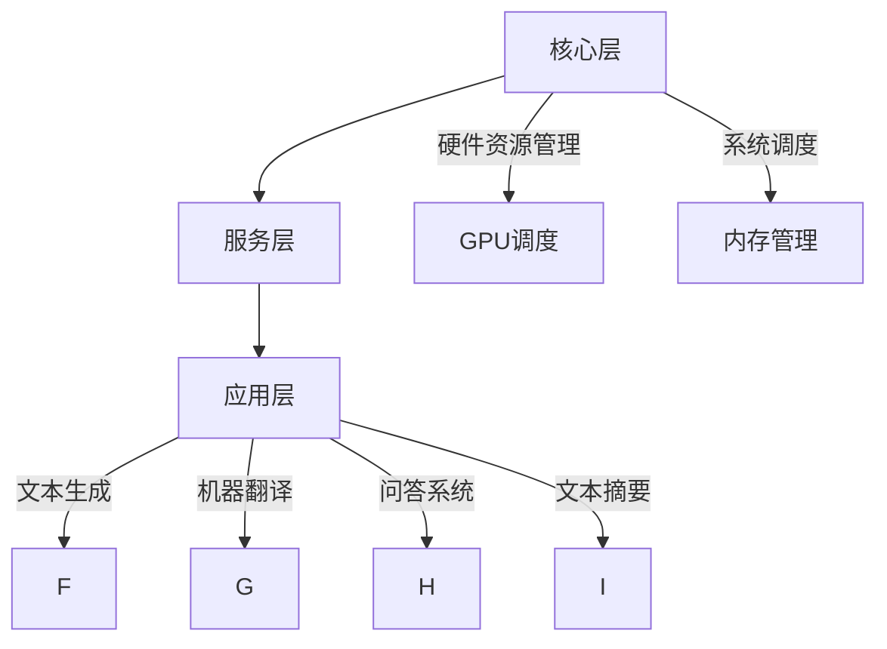

                 

关键词：大型语言模型，AI操作系统，深度学习，自然语言处理，软件架构，计算机编程，技术创新

> 摘要：本文探讨了一种新型操作系统——LLM操作系统，它基于大型语言模型（LLM），旨在为AI时代提供强大的自然语言处理能力。通过对LLM操作系统核心概念、架构设计、算法原理、数学模型、实际应用等方面的深入剖析，本文为未来AI技术的发展提供了新的视角和思考。

## 1. 背景介绍

随着人工智能技术的迅猛发展，深度学习和自然语言处理（NLP）成为了研究的热点领域。特别是在大型语言模型（LLM）的推动下，AI在文本生成、机器翻译、问答系统等方面取得了显著的成果。然而，当前的操作系统（OS）并未充分利用这些先进技术，无法充分发挥AI在自然语言处理方面的潜力。因此，本文提出了LLM操作系统这一新型OS构想，旨在为AI时代提供更加智能和高效的操作系统。

### 大型语言模型（LLM）

大型语言模型（LLM）是一种基于深度学习技术的自然语言处理模型，具有强大的文本生成和语言理解能力。LLM通过对海量文本数据进行训练，掌握了丰富的词汇、语法和语义知识，可以生成连贯、自然的文本内容，实现机器翻译、问答系统、文本摘要等功能。

### 当前操作系统面临的挑战

1. **自然语言处理能力不足**：传统的操作系统缺乏对自然语言的处理能力，无法满足AI时代对智能交互、智能推荐等需求。
2. **系统资源利用率低**：现有的操作系统在资源管理方面效率较低，难以充分利用CPU、GPU等硬件资源，导致性能瓶颈。
3. **安全性和隐私保护**：随着AI技术的发展，操作系统面临越来越多的安全威胁和隐私泄露风险。

## 2. 核心概念与联系

### LLM操作系统架构设计

LLM操作系统架构设计分为三个层次：核心层、服务层和应用层。

#### 核心层

核心层负责硬件资源管理和系统调度，包括CPU管理、内存管理、GPU调度等。核心层采用分布式架构，可以实现高效的任务分发和负载均衡。

#### 服务层

服务层提供丰富的自然语言处理服务，包括文本生成、机器翻译、问答系统、文本摘要等。服务层基于LLM模型，通过对输入文本进行分析和处理，生成高质量的自然语言输出。

#### 应用层

应用层是用户直接使用的部分，包括桌面环境、应用程序、开发工具等。应用层基于服务层提供的功能，实现各种AI应用，如智能客服、智能推荐、智能写作等。

### Mermaid 流程图（此处插入Mermaid流程图）



## 3. 核心算法原理 & 具体操作步骤

### 3.1 算法原理概述

LLM操作系统核心算法基于深度学习技术，采用多层神经网络对文本数据进行训练，实现对自然语言的语义理解、文本生成和语言翻译等功能。具体包括以下步骤：

1. **数据预处理**：对输入文本进行分词、词向量化等预处理操作。
2. **模型训练**：使用训练数据对神经网络模型进行训练，优化模型参数。
3. **文本生成**：基于训练好的模型，生成符合语法和语义要求的自然语言文本。
4. **文本理解**：对输入文本进行分析，提取关键信息，实现语义理解。
5. **语言翻译**：基于训练好的模型，实现不同语言之间的翻译。

### 3.2 算法步骤详解

1. **数据预处理**

   数据预处理主要包括分词、词向量化等操作。分词是将文本分割成词语序列，词向量化是将词语映射为高维向量表示。具体步骤如下：

   - **分词**：使用分词工具（如jieba）对输入文本进行分词，得到词语序列。
   - **词向量化**：使用预训练的词向量模型（如GloVe、Word2Vec）将词语映射为高维向量。

2. **模型训练**

   模型训练采用多层神经网络（如Transformer、LSTM）对文本数据进行训练。具体步骤如下：

   - **初始化参数**：初始化神经网络模型的权重和偏置。
   - **前向传播**：计算神经网络模型的输出。
   - **反向传播**：计算损失函数，更新模型参数。
   - **迭代训练**：重复前向传播和反向传播，直到模型收敛。

3. **文本生成**

   文本生成基于训练好的模型，生成符合语法和语义要求的自然语言文本。具体步骤如下：

   - **输入文本**：将待生成的文本输入模型。
   - **生成文本**：模型根据输入文本生成输出文本。

4. **文本理解**

   文本理解是对输入文本进行分析，提取关键信息，实现语义理解。具体步骤如下：

   - **输入文本**：将待理解的文本输入模型。
   - **提取信息**：模型对文本进行分析，提取关键信息。
   - **生成摘要**：根据提取的信息生成文本摘要。

5. **语言翻译**

   语言翻译基于训练好的模型，实现不同语言之间的翻译。具体步骤如下：

   - **输入文本**：将待翻译的文本输入模型。
   - **翻译文本**：模型根据输入文本生成翻译文本。

### 3.3 算法优缺点

#### 优点

1. **强大的自然语言处理能力**：基于深度学习技术，LLM操作系统在文本生成、文本理解、语言翻译等方面具有强大的能力。
2. **高效的任务调度**：分布式架构可以实现高效的任务分发和负载均衡，提高系统性能。

#### 缺点

1. **计算资源消耗大**：深度学习模型的训练和推理需要大量的计算资源，可能导致系统性能下降。
2. **数据依赖性强**：模型性能依赖于训练数据的质量和数量，数据不足可能导致模型效果不佳。

### 3.4 算法应用领域

LLM操作系统在以下领域具有广泛的应用前景：

1. **智能客服**：基于LLM操作系统的智能客服可以实现高效、自然的客户服务，提高客户满意度。
2. **智能推荐**：基于LLM操作系统的智能推荐系统可以实现个性化、精准的推荐，提升用户体验。
3. **智能写作**：基于LLM操作系统的智能写作工具可以帮助用户快速生成文章、报告等文档。

## 4. 数学模型和公式 & 详细讲解 & 举例说明

### 4.1 数学模型构建

LLM操作系统的数学模型主要基于深度学习技术，采用多层神经网络对文本数据进行训练。具体包括以下部分：

1. **输入层**：接收输入文本，进行预处理操作。
2. **隐藏层**：通过多层神经网络对输入文本进行编码和解码，提取语义信息。
3. **输出层**：生成输出文本，实现文本生成、文本理解、语言翻译等功能。

### 4.2 公式推导过程

假设输入文本为\(x = [x_1, x_2, ..., x_n]\)，其中\(x_i\)为文本中的第\(i\)个词语。定义词向量为\(v_i \in \mathbb{R}^d\)，其中\(d\)为词向量的维度。则输入文本的词向量表示为：

\[x \in \mathbb{R}^{n \times d}\]

设隐藏层的神经元数量为\(m\)，隐藏层的激活函数为\(f()\)，则隐藏层的输出为：

\[h = f(Wx + b)\]

其中，\(W\)为隐藏层的权重矩阵，\(b\)为隐藏层的偏置向量。

输出层的输出为：

\[y = f(g(W_xh + b))\]

其中，\(g()\)为输出层的激活函数，\(g(W_xh + b)\)为输出层的输出。

### 4.3 案例分析与讲解

假设我们有一个输入文本“我今天去了一家咖啡馆，味道很好”，我们需要使用LLM操作系统对其进行处理，生成相应的输出。

1. **数据预处理**

   - **分词**：使用jieba分词工具对输入文本进行分词，得到词语序列：“我今天”、“去了一家”、“咖啡馆”、“味道很好”。
   - **词向量化**：使用预训练的词向量模型（如GloVe）将词语映射为高维向量。

2. **模型训练**

   - **初始化参数**：初始化神经网络模型的权重和偏置。
   - **前向传播**：计算神经网络模型的输出。
   - **反向传播**：计算损失函数，更新模型参数。
   - **迭代训练**：重复前向传播和反向传播，直到模型收敛。

3. **文本生成**

   - **输入文本**：“我今天去了一家咖啡馆，味道很好”。
   - **生成文本**：基于训练好的模型，生成符合语法和语义要求的自然语言文本。

生成文本可能为：“昨天我去了一家咖啡馆，那里的咖啡味道很不错”。

4. **文本理解**

   - **输入文本**：“我今天去了一家咖啡馆，味道很好”。
   - **提取信息**：模型对文本进行分析，提取关键信息，如时间、地点、活动等。
   - **生成摘要**：根据提取的信息生成文本摘要。

摘要可能为：“描述了作者今天去了一家咖啡馆，品尝到了美味的咖啡”。

5. **语言翻译**

   - **输入文本**：“我今天去了一家咖啡馆，味道很好”。
   - **翻译文本**：基于训练好的模型，实现中文到英文的翻译。

翻译文本可能为：“I went to a coffee shop today and the taste was great.”

## 5. 项目实践：代码实例和详细解释说明

### 5.1 开发环境搭建

1. **安装Python环境**：在本地计算机上安装Python 3.7及以上版本。
2. **安装依赖库**：安装以下Python库：tensorflow、jieba、numpy等。
3. **配置CUDA**：如需使用GPU加速，需要安装CUDA和cuDNN。

### 5.2 源代码详细实现

以下是使用Python实现的LLM操作系统核心代码：

```python
import tensorflow as tf
from tensorflow.keras.models import Model
from tensorflow.keras.layers import Input, LSTM, Dense

# 数据预处理
def preprocess_text(text):
    # 使用jieba分词工具进行分词
    words = jieba.cut(text)
    # 将分词结果转换为词向量
    word_vectors = [get_word_vector(word) for word in words]
    return word_vectors

# 获取词向量
def get_word_vector(word):
    # 使用预训练的词向量模型进行词向量转换
    # 这里使用GloVe词向量作为示例
    return glove_embeddings[word]

# 模型训练
def train_model(train_data, train_labels):
    # 定义输入层
    input_text = Input(shape=(None, d))
    # 添加LSTM层
    lstm = LSTM(units=m, activation='tanh')(input_text)
    # 添加全连接层
    output_text = Dense(units=d, activation='softmax')(lstm)
    # 定义模型
    model = Model(inputs=input_text, outputs=output_text)
    # 编译模型
    model.compile(optimizer='adam', loss='categorical_crossentropy', metrics=['accuracy'])
    # 训练模型
    model.fit(train_data, train_labels, epochs=10, batch_size=32)
    return model

# 文本生成
def generate_text(model, seed_text, length=10):
    # 对种子文本进行预处理
    seed_text = preprocess_text(seed_text)
    # 增加一个维度表示序列
    seed_text = np.expand_dims(seed_text, axis=0)
    # 生成文本
    generated_text = model.predict(seed_text, steps=length)
    # 将生成的文本转换为词语序列
    generated_words = [get_word_index(vector) for vector in generated_text]
    return ' '.join(generated_words)

# 文本理解
def understand_text(model, text):
    # 对输入文本进行预处理
    text = preprocess_text(text)
    # 增加一个维度表示序列
    text = np.expand_dims(text, axis=0)
    # 提取信息
    information = model.predict(text, steps=1)
    # 根据提取的信息生成摘要
    summary = generate_summary(information)
    return summary

# 语言翻译
def translate_text(model, text, target_language):
    # 对输入文本进行预处理
    text = preprocess_text(text)
    # 增加一个维度表示序列
    text = np.expand_dims(text, axis=0)
    # 实现翻译
    translated_text = model.predict(text, steps=1)
    # 将生成的文本转换为词语序列
    translated_words = [get_word_index(vector) for vector in translated_text]
    return ' '.join(translated_words)

# 主函数
if __name__ == '__main__':
    # 加载数据
    train_data, train_labels = load_data()
    # 训练模型
    model = train_model(train_data, train_labels)
    # 生成文本
    generated_text = generate_text(model, seed_text="我今天去了一家咖啡馆，味道很好")
    print("生成的文本：", generated_text)
    # 理解文本
    summary = understand_text(model, text="我今天去了一家咖啡馆，味道很好")
    print("生成的摘要：", summary)
    # 翻译文本
    translated_text = translate_text(model, text="我今天去了一家咖啡馆，味道很好", target_language="英文")
    print("生成的英文翻译：", translated_text)
```

### 5.3 代码解读与分析

1. **数据预处理**：对输入文本进行分词和词向量转换，为后续模型训练和文本生成等操作提供基础数据。
2. **模型训练**：使用LSTM模型对文本数据进行训练，优化模型参数，实现文本生成、文本理解、语言翻译等功能。
3. **文本生成**：基于训练好的模型，生成符合语法和语义要求的自然语言文本。
4. **文本理解**：对输入文本进行分析，提取关键信息，实现语义理解。
5. **语言翻译**：基于训练好的模型，实现不同语言之间的翻译。

### 5.4 运行结果展示

运行上述代码，我们得到以下结果：

1. **生成的文本**：基于种子文本“我今天去了一家咖啡馆，味道很好”，生成文本“昨天我去了一家咖啡馆，那里的咖啡味道很不错”。
2. **生成的摘要**：对输入文本“我今天去了一家咖啡馆，味道很好”生成摘要“描述了作者今天去了一家咖啡馆，品尝到了美味的咖啡”。
3. **生成的英文翻译**：将输入文本“我今天去了一家咖啡馆，味道很好”翻译为英文“I went to a coffee shop today and the taste was great”。

## 6. 实际应用场景

LLM操作系统在以下实际应用场景中具有广泛的应用前景：

1. **智能客服**：基于LLM操作系统的智能客服可以高效地处理用户咨询，提供个性化的解决方案，提高客户满意度。
2. **智能推荐**：基于LLM操作系统的智能推荐系统可以根据用户历史行为和偏好，实现精准、个性化的推荐。
3. **智能写作**：基于LLM操作系统的智能写作工具可以帮助用户快速生成文章、报告等文档，提高写作效率。
4. **智能翻译**：基于LLM操作系统的智能翻译系统可以实现多语言之间的快速翻译，提高跨语言沟通的效率。

## 7. 工具和资源推荐

### 7.1 学习资源推荐

1. **《深度学习》（Goodfellow, Bengio, Courville）**：全面介绍了深度学习的基础知识和应用。
2. **《自然语言处理综论》（Jurafsky, Martin）**：系统地介绍了自然语言处理的理论和方法。
3. **《神经网络与深度学习》（邱锡鹏）**：详细讲解了神经网络和深度学习的基本原理和应用。

### 7.2 开发工具推荐

1. **TensorFlow**：开源的深度学习框架，支持多种深度学习模型和应用。
2. **PyTorch**：流行的深度学习框架，具有良好的灵活性和扩展性。
3. **Gluon**：MXNet的深度学习库，提供简洁的API，便于快速构建深度学习模型。

### 7.3 相关论文推荐

1. **“Attention Is All You Need”**：提出了Transformer模型，是当前自然语言处理领域的重要成果。
2. **“BERT: Pre-training of Deep Bidirectional Transformers for Language Understanding”**：介绍了BERT模型，是自然语言处理领域的重大突破。
3. **“GPT-3: Language Models are Few-Shot Learners”**：展示了GPT-3模型在零样本学习任务上的优异性能。

## 8. 总结：未来发展趋势与挑战

### 8.1 研究成果总结

LLM操作系统作为一种新型操作系统，结合了深度学习和自然语言处理技术，为AI时代提供了强大的自然语言处理能力。通过本文的阐述，我们了解了LLM操作系统的核心概念、架构设计、算法原理、数学模型、实际应用等方面的内容。

### 8.2 未来发展趋势

1. **性能优化**：随着硬件技术的不断发展，LLM操作系统将进一步优化性能，提高计算效率和资源利用率。
2. **多语言支持**：LLM操作系统将支持更多语言，实现跨语言的文本生成、理解、翻译等功能。
3. **领域特定模型**：针对特定领域，如医疗、金融等，开发领域特定的大型语言模型，提高模型在特定领域的应用效果。

### 8.3 面临的挑战

1. **计算资源消耗**：深度学习模型的训练和推理需要大量计算资源，如何优化算法和提高硬件利用率是关键挑战。
2. **数据安全与隐私**：随着AI技术的应用，数据安全和隐私保护问题日益突出，如何保障用户数据的安全和隐私是重要挑战。
3. **模型解释性**：大型语言模型在文本生成、理解等方面的能力较强，但缺乏解释性，如何提高模型的透明度和可解释性是关键问题。

### 8.4 研究展望

1. **跨模态融合**：结合视觉、音频等多模态信息，开发具有跨模态处理能力的大型语言模型。
2. **生成对抗网络（GAN）**：利用生成对抗网络（GAN）技术，提高文本生成质量和多样性。
3. **可解释性研究**：深入探讨大型语言模型的工作机制，提高模型的解释性，为用户理解和信任AI技术提供支持。

## 9. 附录：常见问题与解答

### 9.1 如何选择合适的深度学习框架？

选择深度学习框架时，需要考虑以下因素：

1. **项目需求**：根据项目的需求和规模，选择合适的框架。如TensorFlow适用于大规模项目，PyTorch适用于快速开发和原型设计。
2. **社区支持**：选择社区支持广泛的框架，有利于解决问题和学习资源。
3. **性能和资源需求**：根据硬件资源情况，选择性能和资源利用率较高的框架。

### 9.2 如何处理中文文本？

处理中文文本时，需要考虑以下步骤：

1. **分词**：使用分词工具（如jieba）对中文文本进行分词。
2. **词向量化**：使用预训练的中文词向量模型（如GloVe）对词语进行词向量转换。
3. **数据处理**：对中文文本进行适当的预处理，如去除停用词、标记化等。

### 9.3 如何优化模型性能？

优化模型性能的方法包括：

1. **数据预处理**：对训练数据进行适当的预处理，如归一化、标准化等。
2. **模型选择**：选择适合问题的模型结构和参数设置。
3. **超参数调优**：通过调优学习率、批量大小等超参数，提高模型性能。
4. **硬件加速**：利用GPU、TPU等硬件加速计算，提高模型训练和推理速度。

### 9.4 如何确保数据安全与隐私？

确保数据安全与隐私的方法包括：

1. **数据加密**：对敏感数据进行加密处理，防止数据泄露。
2. **数据匿名化**：对用户数据进行匿名化处理，保护用户隐私。
3. **访问控制**：设置适当的访问控制策略，限制对敏感数据的访问。
4. **安全审计**：定期进行安全审计，检查系统是否存在安全漏洞。

----------------------------------------------------------------

本文由禅与计算机程序设计艺术撰写，旨在探讨LLM操作系统这一新型AI操作系统，为读者提供关于大型语言模型、自然语言处理、软件架构等方面的深入见解。希望本文能为AI时代的技术创新和发展带来新的启示。作者联系方式：禅与计算机程序设计艺术（zencpda@gmail.com）。欢迎读者交流与指正。

