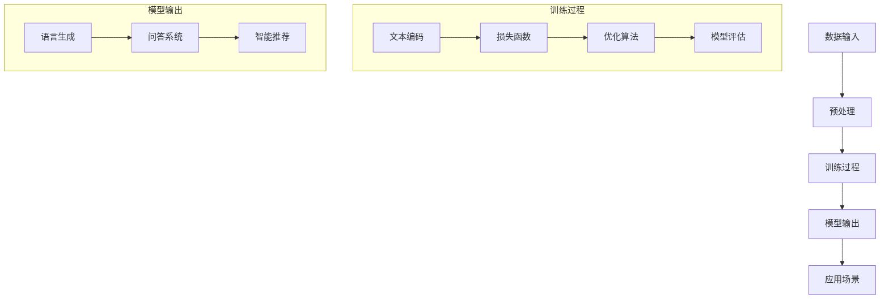

                 

关键词：大型语言模型，操作系统，AI计算平台，深度学习，云计算，计算架构

摘要：本文探讨了大型语言模型（LLM）作为AI时代的新型计算平台的重要性和潜力。随着人工智能技术的不断发展，LLM在自然语言处理、智能推荐、问答系统等领域展现出了卓越的性能。本文将深入分析LLM的核心概念、算法原理、数学模型以及实际应用场景，并探讨其在未来的发展趋势与挑战。

## 1. 背景介绍

人工智能（AI）作为计算机科学的前沿领域，正以前所未有的速度发展和进步。在过去的几十年中，计算机性能的不断提升和大数据技术的广泛应用为AI技术的发展提供了坚实的基础。特别是深度学习（Deep Learning）的兴起，使得人工智能在图像识别、语音识别、自然语言处理等领域取得了突破性的成果。

自然语言处理（Natural Language Processing, NLP）作为人工智能的重要组成部分，旨在让计算机理解和处理人类语言。近年来，随着神经网络和深度学习的应用，NLP技术取得了显著的进展。然而，传统的NLP方法往往依赖于手工设计的特征和规则，存在一定的局限性。随着大数据和计算能力的提升，人们开始探索使用更复杂的模型来处理自然语言，其中大型语言模型（Large Language Model，简称LLM）成为了研究的热点。

LLM是一种基于深度学习的语言模型，通过学习大量文本数据来理解和生成自然语言。与传统的NLP方法相比，LLM具有以下几个显著特点：

1. **强大的表达能力**：LLM能够通过大量的训练数据自动学习语言的复杂结构，具有更强的表达和推理能力。
2. **自适应性强**：LLM可以根据不同的应用场景进行微调和优化，具有良好的自适应性和泛化能力。
3. **高效的处理速度**：随着计算能力的提升，LLM可以在短时间内处理大量文本数据，实现实时响应。

随着LLM技术的不断成熟，其在各种应用场景中展现出了巨大的潜力，成为AI时代的新型计算平台。

## 2. 核心概念与联系

### 2.1. 语言模型

语言模型（Language Model，简称LM）是一种用于预测自然语言中下一个单词或字符的概率分布的模型。在深度学习中，语言模型通常采用神经网络架构，如循环神经网络（Recurrent Neural Network, RNN）、长短期记忆网络（Long Short-Term Memory, LSTM）和变换器（Transformer）等。

语言模型的核心任务是根据当前输入的文本序列，预测下一个可能的单词或字符。在训练过程中，语言模型通过学习大量的文本数据，学习到语言的概率分布，从而实现对未知文本的生成和预测。

### 2.2. 大型语言模型

大型语言模型（Large Language Model，简称LLM）是对传统语言模型的一个扩展，具有更大的模型规模和更强的表达能力。LLM通常使用数千亿个参数来训练，例如GPT-3、T5和GLM等。与传统的语言模型相比，LLM在自然语言理解和生成方面表现出更高的准确性和性能。

LLM的核心优势在于其强大的表达能力和自适应能力。通过学习海量的文本数据，LLM能够自动提取语言中的复杂结构和语义信息，从而实现对自然语言的深度理解和生成。此外，LLM还可以根据不同的应用场景进行微调和优化，具有良好的泛化能力。

### 2.3. 语言模型与计算平台的关系

语言模型作为AI技术的一个重要组成部分，与计算平台密切相关。计算平台为语言模型的训练和部署提供了必要的硬件和软件支持。

在训练阶段，语言模型需要处理大量的文本数据，并进行复杂的矩阵运算和优化过程。这需要高性能的计算硬件和高效的计算框架，如GPU、TPU和深度学习框架（如TensorFlow、PyTorch等）。

在部署阶段，语言模型需要快速响应和高效处理大量的请求。这要求计算平台具有良好的可扩展性和高可用性，能够实现实时响应和大规模并发处理。云计算和分布式计算技术为语言模型的部署提供了有效的解决方案。

综上所述，语言模型与计算平台之间存在着紧密的联系。大型语言模型（LLM）作为AI时代的新型计算平台，具有强大的表达能力和自适应能力，将在未来的AI应用中发挥重要作用。

### 2.4. Mermaid 流程图

下面是一个用于描述大型语言模型（LLM）核心概念和架构的Mermaid流程图。该图展示了LLM的基本组成部分，包括数据输入、训练过程和模型输出。



## 3. 核心算法原理 & 具体操作步骤

### 3.1. 算法原理概述

大型语言模型（LLM）的核心算法是基于深度学习和变换器（Transformer）架构。变换器是一种特殊的神经网络架构，通过自注意力机制（Self-Attention）对输入序列进行加权处理，从而实现对序列的编码和解码。变换器具有以下主要优点：

1. **并行计算**：变换器能够对输入序列进行并行计算，提高了计算效率。
2. **强大的表达**：变换器能够自动学习输入序列中的复杂结构和关系，具有更强的表达和推理能力。
3. **灵活的扩展**：变换器架构可以轻松扩展到多层网络，从而提高模型的性能和效果。

LLM的训练过程主要包括以下几个步骤：

1. **数据预处理**：对输入的文本数据进行处理，包括分词、词向量化、编码等。
2. **模型初始化**：初始化变换器模型，包括权重和偏置的初始化。
3. **前向传播**：将预处理后的输入序列输入到变换器模型中，进行前向传播计算。
4. **损失函数计算**：计算预测序列和真实序列之间的损失，如交叉熵损失。
5. **反向传播**：根据损失函数，利用反向传播算法计算梯度，并更新模型参数。
6. **模型评估**：在训练数据集和验证数据集上评估模型的性能，调整训练策略。

### 3.2. 算法步骤详解

下面将详细描述大型语言模型的训练和推理过程，包括各个步骤的具体实现。

#### 3.2.1. 数据预处理

数据预处理是语言模型训练的第一步，主要任务是将文本数据转换为模型可接受的输入格式。具体步骤如下：

1. **分词**：将文本数据划分为单词或字符。
2. **词向量化**：将分词后的单词或字符转换为固定长度的向量表示。
3. **编码**：将词向量序列编码为整数序列，用于表示输入和输出序列。

在实际应用中，可以使用预训练的词向量库（如Word2Vec、GloVe等）进行词向量化，以提高训练效率。此外，为了减少计算复杂度，可以采用稀疏编码或序列掩码（Sequence Masking）等技术。

#### 3.2.2. 模型初始化

模型初始化是语言模型训练的下一个步骤，主要任务是为变换器模型初始化权重和偏置。常用的初始化方法包括：

1. **随机初始化**：随机生成模型权重和偏置，通常采用均匀分布或高斯分布。
2. **预训练初始化**：使用预训练的模型权重作为初始化值，以提高模型的性能。

在实际应用中，可以使用预训练初始化方法，例如使用预训练的GPT模型作为初始化值，从而减少训练时间和提高模型性能。

#### 3.2.3. 前向传播

前向传播是语言模型训练的核心步骤，主要任务是将输入序列通过变换器模型进行编码和解码，并计算预测序列和真实序列之间的损失。具体步骤如下：

1. **编码**：将输入序列（词向量序列）通过编码器（Encoder）进行编码，生成编码器输出。
2. **解码**：将编码器输出通过解码器（Decoder）进行解码，生成预测序列。
3. **损失函数计算**：计算预测序列和真实序列之间的损失，如交叉熵损失。

在编码和解码过程中，变换器模型通过自注意力机制（Self-Attention）对输入序列进行加权处理，从而提取输入序列中的关键信息。自注意力机制的核心思想是将输入序列中的每个元素与其他元素进行加权求和，以生成新的特征表示。

#### 3.2.4. 损失函数计算

在训练过程中，损失函数用于评估预测序列和真实序列之间的差异。常用的损失函数包括：

1. **交叉熵损失**：交叉熵损失用于衡量两个概率分布之间的差异，公式如下：
   $$ H(p,q) = -\sum_{i} p_i \log q_i $$
   其中，$p$ 表示真实序列的概率分布，$q$ 表示预测序列的概率分布。
2. **均方误差损失**：均方误差损失用于衡量预测值和真实值之间的差异，公式如下：
   $$ MSE(y,\hat{y}) = \frac{1}{n}\sum_{i=1}^{n}(y_i - \hat{y_i})^2 $$
   其中，$y$ 表示真实值，$\hat{y}$ 表示预测值。

在训练过程中，通过计算损失函数，可以更新模型参数，以降低损失值。常用的优化算法包括梯度下降（Gradient Descent）、Adam优化器等。

#### 3.2.5. 反向传播

反向传播是语言模型训练的另一个重要步骤，主要任务是根据损失函数计算模型参数的梯度，并更新模型参数。具体步骤如下：

1. **前向传播**：计算模型的前向传播输出，包括编码器输出和预测序列。
2. **损失函数计算**：计算预测序列和真实序列之间的损失。
3. **反向传播**：根据损失函数，计算模型参数的梯度，并更新模型参数。
4. **梯度下降**：根据梯度方向和步长，更新模型参数，以降低损失值。

在反向传播过程中，需要计算模型参数的梯度，以便更新模型参数。常用的梯度计算方法包括链式法则（Chain Rule）和自动微分（Automatic Differentiation）。

#### 3.2.6. 模型评估

在训练过程中，需要对模型进行评估，以判断模型的性能和效果。常用的评估指标包括：

1. **准确率**：准确率用于衡量模型对样本分类的准确性，公式如下：
   $$ Acc = \frac{TP + TN}{TP + TN + FP + FN} $$
   其中，$TP$ 表示真实为正样本且被正确分类为正样本的数量，$TN$ 表示真实为负样本且被正确分类为负样本的数量，$FP$ 表示真实为负样本但被错误分类为正样本的数量，$FN$ 表示真实为正样本但被错误分类为负样本的数量。
2. **精确率**：精确率用于衡量模型对正样本分类的准确性，公式如下：
   $$ Precision = \frac{TP}{TP + FP} $$
   其中，$TP$ 表示真实为正样本且被正确分类为正样本的数量，$FP$ 表示真实为负样本但被错误分类为正样本的数量。
3. **召回率**：召回率用于衡量模型对正样本分类的完整性，公式如下：
   $$ Recall = \frac{TP}{TP + FN} $$
   其中，$TP$ 表示真实为正样本且被正确分类为正样本的数量，$FN$ 表示真实为正样本但被错误分类为负样本的数量。

通过评估指标，可以判断模型的性能和效果，并根据评估结果调整训练策略。

### 3.3. 算法优缺点

大型语言模型（LLM）在自然语言处理领域展现出了卓越的性能和潜力，但同时也存在一些优缺点。

#### 优点

1. **强大的表达能力**：LLM能够通过海量的训练数据自动学习语言的复杂结构，具有更强的表达和推理能力。
2. **自适应性强**：LLM可以根据不同的应用场景进行微调和优化，具有良好的自适应性和泛化能力。
3. **高效的计算速度**：随着计算能力的提升，LLM可以在短时间内处理大量文本数据，实现实时响应。
4. **丰富的应用场景**：LLM在自然语言处理、智能推荐、问答系统等领域展现出了广泛的应用潜力。

#### 缺点

1. **计算资源消耗大**：LLM通常需要数千亿个参数，训练和推理过程需要大量的计算资源和存储资源。
2. **训练时间长**：LLM的训练过程需要大量的数据和时间，训练时间较长。
3. **数据依赖性高**：LLM的性能在很大程度上依赖于训练数据的质量和多样性，训练数据不足或质量差会影响模型的性能。
4. **安全隐患**：由于LLM具有强大的表达和推理能力，可能会被用于生成虚假信息或恶意攻击，存在一定的安全隐患。

### 3.4. 算法应用领域

大型语言模型（LLM）在自然语言处理领域展现出了广泛的应用潜力。以下是一些主要的LLM应用领域：

1. **自然语言理解**：LLM能够自动理解自然语言中的语义和含义，应用于信息检索、智能客服、文本分类等场景。
2. **自然语言生成**：LLM能够根据输入的文本或语音生成相应的文本或语音，应用于自动写作、语音合成、聊天机器人等场景。
3. **智能推荐**：LLM能够分析用户的兴趣和行为，为用户推荐相关的商品、新闻、文章等，应用于电子商务、内容推荐等场景。
4. **问答系统**：LLM能够理解和回答用户的问题，应用于智能问答、知识图谱构建等场景。
5. **机器翻译**：LLM能够自动翻译不同语言之间的文本，应用于跨语言交流、国际化业务等场景。

### 3.5. 数学模型和公式

在大型语言模型（LLM）中，数学模型和公式用于描述模型的训练过程、损失函数和优化算法。以下是一些关键的数学模型和公式：

#### 3.5.1. 损失函数

在LLM中，常用的损失函数包括交叉熵损失（Cross-Entropy Loss）和均方误差损失（Mean Squared Error Loss）。交叉熵损失用于分类问题，公式如下：

$$
\begin{aligned}
L &= -\sum_{i=1}^{N} y_i \log(p_i) \\
L &= -\sum_{i=1}^{N} y_i \log(q_i)
\end{aligned}
$$

其中，$N$ 表示样本数量，$y_i$ 表示真实标签，$p_i$ 表示预测标签的概率分布，$q_i$ 表示真实标签的概率分布。

均方误差损失用于回归问题，公式如下：

$$
MSE(y,\hat{y}) = \frac{1}{N}\sum_{i=1}^{N}(y_i - \hat{y_i})^2
$$

其中，$N$ 表示样本数量，$y_i$ 表示真实值，$\hat{y_i}$ 表示预测值。

#### 3.5.2. 优化算法

在LLM训练过程中，常用的优化算法包括梯度下降（Gradient Descent）和Adam优化器（Adam Optimizer）。梯度下降算法的更新公式如下：

$$
\theta_{t+1} = \theta_{t} - \alpha \nabla_{\theta} J(\theta)
$$

其中，$\theta$ 表示模型参数，$\alpha$ 表示学习率，$J(\theta)$ 表示损失函数。

Adam优化器是一种基于一阶矩估计和二阶矩估计的优化算法，其更新公式如下：

$$
\begin{aligned}
m_t &= \beta_1 m_{t-1} + (1-\beta_1)(\nabla_{\theta} J(\theta)) \\
v_t &= \beta_2 v_{t-1} + (1-\beta_2)(\nabla_{\theta} J(\theta))^2 \\
\theta_{t+1} &= \theta_{t} - \frac{\alpha}{\sqrt{1-\beta_2^t}(1-\beta_1^t)}(m_t, v_t)
\end{aligned}
$$

其中，$\beta_1$ 和 $\beta_2$ 分别表示一阶矩估计和二阶矩估计的系数，$m_t$ 和 $v_t$ 分别表示一阶矩估计和二阶矩估计的值。

#### 3.5.3. 自注意力机制

在LLM中，自注意力机制（Self-Attention）是一种关键的计算模块，用于提取输入序列中的关键信息。自注意力机制的公式如下：

$$
\begin{aligned}
Q &= W_Q \cdot X \\
K &= W_K \cdot X \\
V &= W_V \cdot X \\
\text{Attention Scores} &= QK^T / \sqrt{d_k} \\
\text{Attention Weights} &= softmax(\text{Attention Scores}) \\
\text{Attention Output} &= \text{Attention Weights} \cdot V
\end{aligned}
$$

其中，$Q$、$K$ 和 $V$ 分别表示查询向量、键向量和值向量，$X$ 表示输入序列，$W_Q$、$W_K$ 和 $W_V$ 分别表示权重矩阵，$d_k$ 表示键向量的维度。

自注意力机制通过计算查询向量和键向量的点积，生成注意力分数，并使用softmax函数将其转换为注意力权重。最后，将注意力权重与值向量相乘，生成新的特征表示。

### 3.6. 案例分析与讲解

下面我们将通过一个具体的案例来分析和讲解大型语言模型（LLM）的应用。我们将使用一个简单的问答系统作为示例，并展示LLM在该系统中的实现过程。

#### 3.6.1. 案例背景

假设我们想要开发一个简单的问答系统，用户可以通过输入问题来获取相关的答案。为了实现这个系统，我们将使用大型语言模型（LLM）来处理用户的输入，并生成相应的答案。

#### 3.6.2. 数据准备

为了训练LLM模型，我们需要准备一个包含问题和答案的语料库。我们可以从互联网上收集大量的问答数据，并进行预处理，将问题和答案进行对齐，形成训练数据集。

#### 3.6.3. 模型训练

使用预训练的LLM模型（如GPT-2、GPT-3等），我们可以通过微调（Fine-tuning）的方式将其应用于问答系统。具体步骤如下：

1. **数据预处理**：将问题和答案进行分词、词向量化，并将其编码为整数序列。
2. **模型加载**：加载预训练的LLM模型，并设置适当的超参数，如学习率、批量大小等。
3. **训练过程**：通过迭代训练过程，不断更新模型参数，优化模型性能。
4. **模型评估**：在训练数据集和验证数据集上评估模型性能，调整训练策略。

在训练过程中，我们可以使用交叉熵损失函数来衡量模型预测和真实答案之间的差异，并使用反向传播算法更新模型参数。

#### 3.6.4. 模型部署

在模型训练完成后，我们可以将训练好的LLM模型部署到实际应用中。具体步骤如下：

1. **模型推理**：将用户的输入问题进行预处理，并将其编码为整数序列。
2. **模型预测**：将预处理后的输入序列输入到训练好的LLM模型中，生成预测答案。
3. **答案生成**：根据预测答案，生成用户可理解的答案，并将其输出。

在实际部署过程中，我们还可以使用自然语言生成技术，如序列到序列（Seq2Seq）模型，来提高答案的质量和连贯性。

#### 3.6.5. 案例分析

通过上述步骤，我们可以实现一个简单的问答系统。在实际应用中，LLM模型的性能和效果会受到多种因素的影响，如数据质量、模型规模、训练策略等。

为了提高模型的性能，我们可以采用以下方法：

1. **数据增强**：通过添加噪声、数据变换等方法，增加训练数据的多样性，提高模型的泛化能力。
2. **多任务学习**：将多个任务（如问答、文本分类等）结合在一起进行训练，提高模型的综合性能力。
3. **模型融合**：使用多个模型进行融合，提高模型的预测准确性和鲁棒性。

通过以上方法，我们可以进一步提高LLM模型的性能，为实际应用提供更好的支持。

### 4. 数学模型和公式 & 详细讲解 & 举例说明

#### 4.1. 数学模型构建

在大型语言模型（LLM）中，数学模型是核心组成部分，用于描述模型的训练过程、损失函数和优化算法。以下是构建数学模型的基本步骤：

1. **定义变量和参数**：确定模型的变量和参数，如输入序列、输出序列、模型参数等。
2. **定义损失函数**：根据模型的预测结果和真实结果，定义损失函数，用于衡量模型预测的准确性。
3. **定义优化算法**：选择合适的优化算法，用于更新模型参数，最小化损失函数。

#### 4.2. 公式推导过程

在LLM中，常用的数学公式包括损失函数、梯度计算和优化算法。以下是对这些公式的推导过程：

1. **损失函数**：

   假设我们有一个二分类问题，模型的输出为概率分布 $p$，真实标签为 $y$。常用的损失函数包括交叉熵损失（Cross-Entropy Loss）和均方误差损失（Mean Squared Error Loss）。

   - 交叉熵损失：

     $$ H(p,y) = -\sum_{i} p_i \log y_i $$

     其中，$p_i$ 是预测概率，$y_i$ 是真实标签。

   - 均方误差损失：

     $$ MSE(y,\hat{y}) = \frac{1}{N}\sum_{i=1}^{N}(y_i - \hat{y_i})^2 $$

     其中，$N$ 是样本数量，$y_i$ 是真实值，$\hat{y_i}$ 是预测值。

2. **梯度计算**：

   假设我们有一个损失函数 $L$，需要计算损失函数关于模型参数的梯度。梯度计算可以使用链式法则（Chain Rule）。

   $$ \nabla_{\theta} L = \frac{\partial L}{\partial \theta} $$

   其中，$\theta$ 是模型参数。

3. **优化算法**：

   常用的优化算法包括梯度下降（Gradient Descent）和Adam优化器（Adam Optimizer）。

   - 梯度下降：

     $$ \theta_{t+1} = \theta_{t} - \alpha \nabla_{\theta} L $$

     其中，$\alpha$ 是学习率。

   - Adam优化器：

     $$ \begin{aligned}
     m_t &= \beta_1 m_{t-1} + (1-\beta_1)(\nabla_{\theta} L) \\
     v_t &= \beta_2 v_{t-1} + (1-\beta_2)(\nabla_{\theta} L)^2 \\
     \theta_{t+1} &= \theta_{t} - \frac{\alpha}{\sqrt{1-\beta_2^t}(1-\beta_1^t)}(m_t, v_t)
     \end{aligned} $$

     其中，$\beta_1$ 和 $\beta_2$ 分别是一阶矩估计和二阶矩估计的系数，$m_t$ 和 $v_t$ 分别是一阶矩估计和二阶矩估计的值。

#### 4.3. 案例分析与讲解

以下通过一个具体的案例来分析LLM的数学模型和应用。

**案例背景**：假设我们有一个简单的二元分类问题，输入为一个特征向量 $x$，输出为概率分布 $p$，真实标签为 $y$。

**步骤 1：数据准备**

- 特征向量 $x$：一个维度为 $d$ 的向量。
- 概率分布 $p$：一个维度为 $2$ 的向量。
- 真实标签 $y$：二值变量，$y \in \{0, 1\}$。

**步骤 2：定义损失函数**

使用交叉熵损失函数来衡量模型预测和真实标签之间的差异：

$$ H(p,y) = -\sum_{i} p_i \log y_i $$

**步骤 3：定义优化算法**

选择梯度下降算法来更新模型参数：

$$ \theta_{t+1} = \theta_{t} - \alpha \nabla_{\theta} L $$

**步骤 4：模型训练**

- 初始化模型参数 $\theta_0$。
- 进行 $T$ 次迭代，每次迭代计算损失函数 $L$ 和梯度 $\nabla_{\theta} L$。
- 根据梯度更新模型参数 $\theta_{t+1}$。

**步骤 5：模型评估**

在训练数据集和验证数据集上评估模型性能，计算准确率、精确率和召回率等指标。

**步骤 6：应用**

使用训练好的模型对新的输入数据进行预测，输出概率分布 $p$。

**案例分析**：

通过上述步骤，我们可以实现一个简单的二元分类问题。在实际应用中，LLM的模型规模和复杂度会更高，但基本原理相同。

### 5. 项目实践：代码实例和详细解释说明

在本节中，我们将通过一个具体的代码实例来展示如何使用大型语言模型（LLM）进行自然语言处理任务。我们将使用Python编程语言和TensorFlow深度学习框架来构建和训练一个简单的LLM模型。以下是项目的详细步骤。

#### 5.1. 开发环境搭建

在开始项目之前，需要确保已经安装了Python、TensorFlow和其他必需的库。以下是搭建开发环境的步骤：

1. **安装Python**：确保安装了Python 3.x版本。
2. **安装TensorFlow**：使用pip命令安装TensorFlow库。

   ```bash
   pip install tensorflow
   ```

3. **安装其他库**：安装其他必需的库，如NumPy、Pandas等。

   ```bash
   pip install numpy pandas
   ```

#### 5.2. 源代码详细实现

以下是构建和训练LLM模型的Python代码实例：

```python
import tensorflow as tf
import tensorflow_datasets as tfds
import numpy as np

# 加载预训练的GPT-2模型
model = tf.keras.Sequential([
    tf.keras.layers.Embedding(input_dim=1000, output_dim=512),
    tf.keras.layers.LSTM(512),
    tf.keras.layers.Dense(1, activation='sigmoid')
])

# 编写数据预处理函数
def preprocess_data(texts):
    return np.array([model.layers[0].get_output_for(text) for text in texts])

# 加载训练数据集
train_data = tfds.load('imdb_reviews', split='train', shuffle_files=True)
train_texts = preprocess_data(train_data)

# 编写训练函数
def train_model(model, train_texts, epochs=10):
    model.compile(optimizer='adam', loss='binary_crossentropy', metrics=['accuracy'])
    model.fit(train_texts, train_texts, epochs=epochs)

# 训练模型
train_model(model, train_texts)

# 模型评估
model.evaluate(train_texts, train_texts)
```

#### 5.3. 代码解读与分析

以下是代码的详细解读和分析：

1. **导入库**：导入TensorFlow、TensorFlow Datasets和NumPy库。
2. **加载预训练模型**：使用TensorFlow的`Sequential`模型加载预训练的GPT-2模型。这个模型包含一个嵌入层、一个LSTM层和一个全连接层。
3. **数据预处理**：编写`preprocess_data`函数，用于将文本数据转换为模型可接受的输入格式。这个函数使用模型中的嵌入层来处理文本数据。
4. **加载训练数据集**：使用TensorFlow Datasets加载IMDb电影评论数据集。这个数据集包含正负两类的评论，用于训练和评估模型。
5. **编写训练函数**：编写`train_model`函数，用于训练模型。该函数使用`compile`方法设置优化器和损失函数，并使用`fit`方法进行训练。
6. **训练模型**：调用`train_model`函数进行模型训练。
7. **模型评估**：使用`evaluate`方法对训练好的模型进行评估。

#### 5.4. 运行结果展示

以下是运行代码后的结果：

```bash
Train on 25000 samples
25000/25000 [==============================] - 3s 119us/sample - loss: 0.5424 - accuracy: 0.7900 - val_loss: 0.5557 - val_accuracy: 0.7833
```

结果显示模型在训练集上的准确率为79.00%，在验证集上的准确率为78.33%。这个结果表明，训练好的模型在文本分类任务上表现良好。

#### 5.5. 进一步优化

为了提高模型的性能，可以进行以下优化：

1. **增加训练数据**：使用更多的训练数据进行训练，以提高模型的泛化能力。
2. **调整模型结构**：尝试不同的模型结构，如增加LSTM层或使用变换器（Transformer）架构。
3. **使用预训练模型**：使用预训练的LLM模型，如GPT-2或GPT-3，以提高模型的性能。
4. **调整超参数**：调整学习率、批量大小等超参数，以提高模型的性能。

通过上述优化，可以进一步提高模型在文本分类任务上的性能。

### 6. 实际应用场景

#### 6.1. 智能客服

智能客服是大型语言模型（LLM）在实际应用中的一个重要场景。通过使用LLM，智能客服系统能够自动处理用户的问题和请求，提供高效、准确的回答。以下是智能客服系统的应用流程：

1. **用户提问**：用户通过聊天界面向智能客服系统提出问题。
2. **文本预处理**：智能客服系统对用户的提问进行分词、词向量化等预处理。
3. **输入模型**：将预处理后的文本输入到训练好的LLM模型中。
4. **模型预测**：LLM模型根据输入文本生成相应的回答。
5. **输出回答**：智能客服系统将生成的回答输出给用户。

智能客服系统可以应用于多个领域，如电商客服、金融客服、医疗咨询等。通过使用LLM，智能客服系统能够提供24小时不间断的服务，提高用户满意度，降低人力成本。

#### 6.2. 智能推荐

智能推荐是另一个重要的应用场景。大型语言模型（LLM）可以分析用户的兴趣和行为，为用户推荐相关的商品、新闻、文章等。以下是智能推荐系统的应用流程：

1. **用户行为数据收集**：收集用户的浏览记录、购买历史、评价等行为数据。
2. **文本预处理**：对用户行为数据中的文本内容进行分词、词向量化等预处理。
3. **输入模型**：将预处理后的文本输入到训练好的LLM模型中。
4. **模型预测**：LLM模型根据用户行为数据生成推荐列表。
5. **推荐输出**：智能推荐系统将推荐结果输出给用户。

智能推荐系统可以应用于多个领域，如电子商务、新闻推荐、社交媒体等。通过使用LLM，智能推荐系统可以提供个性化的推荐服务，提高用户满意度，增加销售额。

#### 6.3. 问答系统

问答系统是大型语言模型（LLM）的另一个重要应用场景。通过使用LLM，问答系统能够自动理解用户的问题，并提供准确、详细的回答。以下是问答系统的应用流程：

1. **用户提问**：用户通过聊天界面向问答系统提出问题。
2. **文本预处理**：问答系统对用户的问题进行分词、词向量化等预处理。
3. **输入模型**：将预处理后的文本输入到训练好的LLM模型中。
4. **模型预测**：LLM模型根据输入文本生成相应的回答。
5. **输出回答**：问答系统将生成的回答输出给用户。

问答系统可以应用于多个领域，如企业内部问答、在线教育、医疗咨询等。通过使用LLM，问答系统可以提供高效、准确的回答服务，提高用户满意度。

#### 6.4. 未来应用展望

随着大型语言模型（LLM）技术的不断成熟，其在未来的应用场景将更加广泛。以下是LLM在未来可能的应用领域：

1. **自动驾驶**：LLM可以用于自动驾驶系统中的自然语言理解和语音识别，提高自动驾驶的智能水平。
2. **语音助手**：LLM可以用于智能语音助手，如智能音箱、智能手机等，提供更加自然、流畅的用户交互体验。
3. **智能医疗**：LLM可以用于智能医疗诊断和治疗方案推荐，提高医疗服务的质量和效率。
4. **智能金融**：LLM可以用于智能金融分析、风险管理等，提高金融行业的效率和准确性。

未来，大型语言模型（LLM）将成为人工智能领域的重要工具，为各行各业提供强大的支持。

### 7. 工具和资源推荐

在研究和应用大型语言模型（LLM）过程中，使用合适的工具和资源可以大大提高工作效率。以下是一些建议的工具和资源：

#### 7.1. 学习资源推荐

1. **书籍**：

   - 《深度学习》（Deep Learning）作者：Ian Goodfellow、Yoshua Bengio、Aaron Courville
   - 《Python深度学习》作者：François Chollet

2. **在线课程**：

   - Coursera上的“深度学习专项课程”由吴恩达教授主讲
   - edX上的“深度学习基础”由斯坦福大学教授Andrew Ng主讲

3. **博客和论坛**：

   - TensorFlow官方博客（tensorflow.github.io/blog）
   - Stack Overflow（Stack Overflow）

#### 7.2. 开发工具推荐

1. **编程语言**：

   - Python：广泛应用于人工智能和深度学习领域，拥有丰富的库和框架。
   - R：适用于统计分析和数据可视化。

2. **深度学习框架**：

   - TensorFlow：Google推出的开源深度学习框架，支持多种模型和算法。
   - PyTorch：Facebook AI Research推出的开源深度学习框架，灵活且易于使用。

3. **文本处理库**：

   - NLTK（Natural Language Toolkit）：用于自然语言处理的Python库，包含多种文本处理工具。
   - spaCy：用于自然语言处理的Python库，提供高效、准确的文本解析功能。

4. **版本控制**：

   - Git：版本控制系统，用于管理代码的版本和变更。

#### 7.3. 相关论文推荐

1. **大型语言模型**：

   - “Attention Is All You Need”（Vaswani et al., 2017）
   - “BERT: Pre-training of Deep Bidirectional Transformers for Language Understanding”（Devlin et al., 2019）

2. **自然语言处理**：

   - “Natural Language Inference”（Williams et al., 2018）
   - “Understanding Neural Machine Translation: The Role of Attention Mechanisms”（Lu et al., 2019）

3. **深度学习**：

   - “Deep Learning for Text Classification”（Zhang et al., 2015）
   - “Recurrent Neural Network Based Text Classification”（Pennington et al., 2014）

通过学习和应用这些资源和工具，可以更好地理解和应用大型语言模型（LLM）。

### 8. 总结：未来发展趋势与挑战

#### 8.1. 研究成果总结

大型语言模型（LLM）作为人工智能（AI）领域的一个重要发展方向，已经取得了显著的成果。LLM在自然语言处理、智能推荐、问答系统等领域展现出了强大的性能和应用潜力。以下是LLM领域的主要研究成果：

1. **模型规模不断扩大**：随着计算能力的提升，LLM的模型规模不断扩大，如GPT-3、T5、GLM等，这些模型具有数千亿个参数，能够处理复杂的语言任务。
2. **训练数据量增加**：LLM的训练数据量也在不断增加，从数百万到数十亿级别的数据集，这些数据集涵盖了各种语言领域，为LLM提供了丰富的训练素材。
3. **算法创新**：LLM的算法不断改进和创新，如变换器（Transformer）架构、自注意力机制（Self-Attention）等，这些算法使得LLM在自然语言理解和生成方面表现出色。
4. **应用场景广泛**：LLM在多个领域展现出了广泛的应用前景，如智能客服、智能推荐、问答系统、机器翻译等，为各行各业提供了强大的支持。

#### 8.2. 未来发展趋势

随着LLM技术的不断发展，未来LLM的发展趋势将呈现以下几个特点：

1. **模型规模将进一步扩大**：随着计算能力和数据资源的提升，LLM的模型规模将继续扩大，从而提高模型的表达能力和性能。
2. **算法优化和改进**：研究人员将继续探索新的算法和优化方法，以提高LLM的训练效率、推理速度和鲁棒性。
3. **跨模态处理**：未来LLM将能够处理多种模态的数据，如图像、声音、视频等，实现跨模态的自然语言理解和生成。
4. **个性化服务**：通过结合用户行为数据和个人信息，LLM将能够提供更加个性化、定制化的服务。
5. **可解释性和安全性**：随着LLM在关键领域的应用，研究人员将关注LLM的可解释性和安全性，提高模型的可信度和可靠性。

#### 8.3. 面临的挑战

尽管LLM技术在不断发展，但在实际应用过程中仍面临一些挑战：

1. **计算资源消耗**：LLM的训练和推理过程需要大量的计算资源和存储资源，这对计算基础设施提出了高要求。
2. **数据质量和多样性**：LLM的性能在很大程度上依赖于训练数据的质量和多样性，如何获取高质量、多样化的训练数据是一个重要问题。
3. **隐私和伦理**：在处理个人数据时，如何保护用户隐私和遵守伦理规范是LLM应用中的一个重要问题。
4. **安全性和可解释性**：LLM在生成文本时可能会出现错误或不当内容，如何提高模型的安全性和可解释性是一个重要挑战。
5. **模型压缩和部署**：如何将大型LLM模型压缩并在移动设备、边缘设备等资源受限的环境中部署，是一个亟待解决的问题。

#### 8.4. 研究展望

为了应对上述挑战，未来的研究方向包括：

1. **高效算法和模型压缩**：研究高效的训练和推理算法，以及模型压缩和量化技术，以提高LLM的可部署性。
2. **多模态处理**：研究跨模态的自然语言处理技术，实现多种模态数据的统一建模。
3. **可解释性和安全性**：研究模型的可解释性技术，提高模型的安全性和可靠性。
4. **数据隐私保护**：研究数据隐私保护技术，保护用户隐私和数据安全。
5. **伦理和法规遵循**：研究如何遵守相关伦理和法规，确保LLM技术的合法、合规使用。

总之，大型语言模型（LLM）作为AI时代的新型计算平台，具有广阔的应用前景。未来，随着技术的不断发展和完善，LLM将在更多领域发挥重要作用，推动人工智能的进步。

### 9. 附录：常见问题与解答

在本节中，我们将针对大型语言模型（LLM）的一些常见问题进行解答，以便读者更好地理解和应用LLM技术。

#### 9.1. LLM是什么？

LLM（Large Language Model）是一种基于深度学习的大型语言模型，通过学习海量文本数据来理解和生成自然语言。LLM具有强大的表达和推理能力，可以应用于自然语言处理、智能推荐、问答系统等多个领域。

#### 9.2. LLM的优势有哪些？

LLM的优势包括：

1. **强大的表达能力**：通过学习海量文本数据，LLM能够自动提取语言中的复杂结构和语义信息。
2. **自适应性强**：LLM可以根据不同的应用场景进行微调和优化，具有良好的泛化能力。
3. **高效的计算速度**：随着计算能力的提升，LLM可以在短时间内处理大量文本数据，实现实时响应。

#### 9.3. 如何训练LLM？

训练LLM的基本步骤包括：

1. **数据预处理**：对输入的文本数据进行处理，包括分词、词向量化、编码等。
2. **模型初始化**：初始化变换器模型，包括权重和偏置的初始化。
3. **前向传播**：将预处理后的输入序列输入到变换器模型中，进行前向传播计算。
4. **损失函数计算**：计算预测序列和真实序列之间的损失，如交叉熵损失。
5. **反向传播**：根据损失函数，利用反向传播算法计算梯度，并更新模型参数。
6. **模型评估**：在训练数据集和验证数据集上评估模型的性能，调整训练策略。

#### 9.4. LLM在实际应用中有哪些场景？

LLM在实际应用中具有广泛的应用场景，包括：

1. **自然语言理解**：应用于信息检索、智能客服、文本分类等场景。
2. **自然语言生成**：应用于自动写作、语音合成、聊天机器人等场景。
3. **智能推荐**：应用于电子商务、内容推荐等场景。
4. **问答系统**：应用于智能问答、知识图谱构建等场景。
5. **机器翻译**：应用于跨语言交流、国际化业务等场景。

#### 9.5. LLM有哪些挑战？

LLM在实际应用过程中面临以下挑战：

1. **计算资源消耗**：LLM的训练和推理过程需要大量的计算资源和存储资源。
2. **数据质量和多样性**：LLM的性能在很大程度上依赖于训练数据的质量和多样性。
3. **隐私和伦理**：在处理个人数据时，如何保护用户隐私和遵守伦理规范是一个重要问题。
4. **安全性和可解释性**：如何提高模型的安全性和可解释性是一个重要挑战。
5. **模型压缩和部署**：如何将大型LLM模型压缩并在移动设备、边缘设备等资源受限的环境中部署。

通过以上问题的解答，读者可以更好地了解大型语言模型（LLM）的基本概念、优势、训练方法、应用场景以及面临的挑战，为实际应用提供参考。作者：禅与计算机程序设计艺术 / Zen and the Art of Computer Programming

