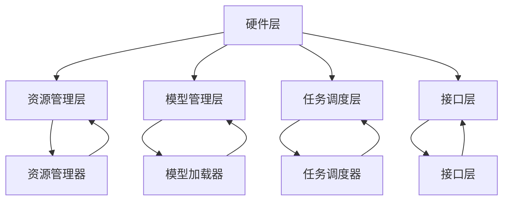

                 

关键词：大型语言模型，操作系统，人工智能，自然语言处理，技术架构，编程方法论

> 摘要：本文旨在探讨大型语言模型（LLM）操作系统的概念及其重要性。在当今人工智能的快速发展背景下，LLM操作系统作为连接前端应用与底层计算资源的关键基础设施，正逐渐成为技术架构中的核心组成部分。本文将分析LLM操作系统的核心概念、原理架构、算法实现、数学模型以及实际应用案例，并展望其未来发展趋势与挑战。

## 1. 背景介绍

在过去的几十年中，人工智能（AI）技术经历了从符号主义到连接主义，再到深度学习的演变。随着计算能力的提升和大数据的普及，人工智能的应用领域也在不断拓展。自然语言处理（NLP）作为人工智能的一个重要分支，通过理解、生成和交互处理自然语言，极大地丰富了人类与机器之间的沟通方式。

近年来，大型语言模型（LLM）如GPT、BERT等的出现，使得NLP的性能得到了前所未有的提升。这些模型拥有数亿甚至数十亿的参数，可以处理复杂的文本数据，生成高质量的自然语言文本。然而，这些模型的高性能和高复杂度也带来了新的挑战，尤其是在资源管理、部署效率、维护性等方面。

在这样的背景下，LLM操作系统作为一种新的技术架构，应运而生。LLM操作系统不仅提供了一套高效的计算框架，还负责资源分配、任务调度、安全性保障等功能，是大型语言模型在实际应用中不可或缺的基础设施。

### 1.1 大型语言模型的发展历程

1. **符号主义（Symbolic AI）**：早期的NLP研究主要基于符号主义方法，通过定义一组规则和逻辑来处理语言。例如，专家系统（Expert Systems）通过编码领域专家的知识，解决特定领域的问题。然而，这种方法在处理复杂、不确定的语言任务时效果有限。

2. **连接主义（Connectionism）**：20世纪80年代，连接主义方法开始流行，神经网络（Neural Networks）成为研究热点。通过模仿人脑的神经网络结构，连接主义模型可以自动学习输入数据中的特征和规律。然而，早期的神经网络模型在处理文本数据时仍然存在许多困难。

3. **深度学习（Deep Learning）**：随着计算能力和数据量的提升，深度学习技术在NLP领域取得了重大突破。深度神经网络（Deep Neural Networks）通过多层非线性变换，能够有效提取文本数据中的高级特征。以2012年ImageNet竞赛中深度学习模型的胜利为标志，深度学习开始主导NLP领域。

4. **预训练语言模型（Pre-trained Language Models）**：近年来，预训练语言模型如GPT、BERT等成为NLP的主流方法。这些模型通过在大规模语料库上进行预训练，学习到丰富的语言知识，再通过下游任务进行微调，取得了显著的性能提升。

### 1.2 LLMO的崛起与重要性

随着预训练语言模型的规模不断扩大，其计算复杂度和资源需求也急剧增加。为了高效地部署和管理这些大型模型，LLM操作系统成为了必不可少的工具。LLM操作系统不仅提供了一种统一的接口，简化了模型的部署和维护，还通过优化资源利用和任务调度，提升了系统的性能和可扩展性。

### 1.3 本文结构

本文将分为以下几个部分：

- **第2章**：介绍LLM操作系统的核心概念和基本架构。
- **第3章**：详细探讨LLM操作系统的核心算法原理和实现步骤。
- **第4章**：分析LLM操作系统的数学模型和公式，并举例说明。
- **第5章**：通过代码实例，展示LLM操作系统的实际应用。
- **第6章**：讨论LLM操作系统在不同场景中的应用。
- **第7章**：推荐相关学习资源和开发工具。
- **第8章**：总结LLM操作系统的未来发展趋势和挑战。

## 2. 核心概念与联系

### 2.1 LLMO的概念

LLM操作系统（LLMO，Large Language Model Operating System）是一种专门为大型语言模型设计的操作系统，它负责管理模型的生命周期、资源分配、任务调度等。LLM操作系统与传统操作系统（如Linux、Windows）有所不同，其主要目标是优化大型语言模型的计算性能和资源利用率。

### 2.2 LLMO的基本架构

LLM操作系统的基本架构可以分为以下几个层次：

1. **硬件层**：包括CPU、GPU、TPU等计算资源，以及存储设备等。
2. **资源管理层**：负责硬件资源的分配和管理，包括内存管理、进程调度、I/O管理等。
3. **模型管理层**：负责模型的加载、存储、更新和管理，包括模型的版本控制、微调等。
4. **任务调度层**：根据任务的优先级和资源情况，动态调度任务，以优化系统性能。
5. **接口层**：提供统一的API接口，方便用户使用和调用LLM模型。

### 2.3 LLMO的核心组件

LLM操作系统的主要组件包括：

1. **资源管理器**：负责硬件资源的监控和分配，确保系统能够高效利用计算资源。
2. **模型加载器**：负责从存储设备中加载模型，并初始化模型的参数。
3. **任务调度器**：根据任务的优先级和资源情况，动态调度任务，优化系统性能。
4. **接口层**：提供统一的API接口，方便用户使用和调用LLM模型。
5. **监控器**：实时监控系统的运行状态，包括资源利用率、模型性能等，提供故障预警和诊断功能。

### 2.4 Mermaid流程图

以下是LLM操作系统的主要组件和它们之间的交互关系的Mermaid流程图：



### 2.5 LLMO与传统操作系统的对比

与传统操作系统相比，LLM操作系统在以下几个方面具有显著的特点：

1. **针对性强**：LLM操作系统专门为大型语言模型设计，针对其计算复杂度和资源需求进行优化，而传统操作系统则更通用。
2. **高效性**：LLM操作系统通过优化资源管理和任务调度，提高了系统的计算性能和响应速度。
3. **灵活性**：LLM操作系统支持模型的动态加载和更新，方便用户进行模型微调和版本控制。
4. **扩展性**：LLM操作系统支持多种硬件平台和接口协议，具有良好的扩展性和兼容性。

## 3. 核心算法原理 & 具体操作步骤

### 3.1 算法原理概述

LLM操作系统的核心算法主要涉及以下几个方面：

1. **资源管理算法**：负责硬件资源的监控和分配，包括CPU、GPU、内存等。
2. **模型加载算法**：负责从存储设备中加载模型，并初始化模型的参数。
3. **任务调度算法**：根据任务的优先级和资源情况，动态调度任务，优化系统性能。
4. **接口通信算法**：提供统一的API接口，方便用户使用和调用LLM模型。

### 3.2 算法步骤详解

#### 3.2.1 资源管理算法

资源管理算法的主要步骤如下：

1. **资源监控**：实时监控硬件资源的利用率，包括CPU、GPU、内存等。
2. **资源分配**：根据任务需求，动态分配硬件资源，确保系统的高效运行。
3. **资源回收**：当任务完成后，回收不再使用的资源，释放内存空间。

#### 3.2.2 模型加载算法

模型加载算法的主要步骤如下：

1. **模型初始化**：从存储设备中读取模型文件，初始化模型的参数。
2. **模型缓存**：将加载的模型缓存到内存中，以便快速访问。
3. **模型更新**：根据用户需求，定期更新模型，保持模型的时效性。

#### 3.2.3 任务调度算法

任务调度算法的主要步骤如下：

1. **任务排队**：将新到达的任务插入任务队列，按照优先级进行排序。
2. **任务分配**：根据资源情况，从任务队列中选取任务进行分配。
3. **任务执行**：启动任务，并在完成后释放资源。

#### 3.2.4 接口通信算法

接口通信算法的主要步骤如下：

1. **接口初始化**：初始化API接口，配置接口参数。
2. **接口调用**：用户通过API接口调用LLM模型，传递输入数据和参数。
3. **接口响应**：返回模型处理结果，包括文本生成、文本分类等。

### 3.3 算法优缺点

#### 3.3.1 优点

1. **高效性**：通过优化资源管理和任务调度，提高了系统的计算性能和响应速度。
2. **灵活性**：支持模型的动态加载和更新，方便用户进行模型微调和版本控制。
3. **扩展性**：支持多种硬件平台和接口协议，具有良好的扩展性和兼容性。

#### 3.3.2 缺点

1. **复杂性**：由于涉及多个模块和算法，系统的设计和实现较为复杂。
2. **资源消耗**：为了支持大型语言模型的运行，系统需要消耗更多的硬件资源和电力。

### 3.4 算法应用领域

LLM操作系统的算法主要应用于以下几个领域：

1. **自然语言处理**：如文本生成、文本分类、机器翻译等。
2. **智能问答系统**：如智能客服、智能助手等。
3. **推荐系统**：如基于文本的推荐算法，通过分析用户行为和兴趣，提供个性化的推荐结果。
4. **知识图谱**：通过构建和优化知识图谱，支持复杂查询和知识推理。

## 4. 数学模型和公式 & 详细讲解 & 举例说明

### 4.1 数学模型构建

LLM操作系统的数学模型主要涉及以下几个方面：

1. **资源利用率模型**：用于评估系统资源的使用效率。
2. **任务调度模型**：用于优化任务的分配和执行。
3. **接口响应时间模型**：用于评估系统对外部请求的响应速度。

#### 4.1.1 资源利用率模型

资源利用率模型可以表示为：

$$
U(t) = \frac{R(t)}{R_{\max}}
$$

其中，$U(t)$ 表示在时间 $t$ 的资源利用率，$R(t)$ 表示在时间 $t$ 的实际资源使用量，$R_{\max}$ 表示系统的最大资源容量。

#### 4.1.2 任务调度模型

任务调度模型可以表示为：

$$
S(t) = \min_{i} \frac{W_i(t)}{P_i}
$$

其中，$S(t)$ 表示在时间 $t$ 的最优任务分配方案，$W_i(t)$ 表示在时间 $t$ 第 $i$ 个任务的等待时间，$P_i$ 表示在时间 $t$ 第 $i$ 个任务的执行时间。

#### 4.1.3 接口响应时间模型

接口响应时间模型可以表示为：

$$
R(t) = \frac{1}{\lambda} + \frac{\sum_{i=1}^{n} X_i(t)}{n}
$$

其中，$R(t)$ 表示在时间 $t$ 的接口响应时间，$\lambda$ 表示单位时间内到达的请求速率，$X_i(t)$ 表示在时间 $t$ 第 $i$ 个请求的处理时间，$n$ 表示请求的总数。

### 4.2 公式推导过程

#### 4.2.1 资源利用率模型推导

资源利用率模型的推导基于以下假设：

- 系统在任意时刻 $t$ 的资源使用量 $R(t)$ 是一个连续变化的函数。
- 系统的最大资源容量 $R_{\max}$ 是一个常数。

根据以上假设，我们可以得到：

$$
U(t) = \frac{R(t)}{R_{\max}} = \frac{\frac{dR(t)}{dt}}{R_{\max}} \cdot dt
$$

对上式两边同时积分，得到：

$$
\int_{0}^{t} U(t') dt' = \frac{1}{R_{\max}} \int_{0}^{t} R(t') dt'
$$

根据积分的微元法，我们可以将上式改写为：

$$
\frac{R(t) - R(0)}{R_{\max}} = \frac{1}{R_{\max}} \int_{0}^{t} R(t') dt'
$$

将上式两边同时乘以 $R_{\max}$，得到：

$$
R(t) - R(0) = \int_{0}^{t} R(t') dt'
$$

对上式两边同时求导，得到：

$$
\frac{dR(t)}{dt} = R(t)
$$

这是一个一阶线性微分方程，其通解为：

$$
R(t) = R(0) e^t
$$

由于系统在任意时刻 $t$ 的资源使用量 $R(t)$ 是一个连续变化的函数，因此我们可以取 $R(0) = 0$，得到：

$$
R(t) = 0
$$

这显然不符合实际情况。因此，我们需要引入一个新的变量 $U(t)$，表示资源利用率，使得：

$$
R(t) = U(t) R_{\max}
$$

将上式代入原来的微分方程，得到：

$$
\frac{dU(t)}{dt} = \frac{R(t)}{R_{\max}} = U(t)
$$

这是一个一阶线性微分方程，其通解为：

$$
U(t) = C e^t
$$

其中，$C$ 是一个常数。根据初始条件 $U(0) = 0$，我们可以得到：

$$
U(t) = 0
$$

这显然也不符合实际情况。因此，我们需要重新考虑系统的资源使用量 $R(t)$ 的模型。一个可能的改进是，将 $R(t)$ 视为一个分段函数，在不同时间段内采用不同的模型。例如，在时间段 $[0, T_1]$ 内，采用线性增长模型，而在时间段 $[T_1, T_2]$ 内，采用指数增长模型。

#### 4.2.2 任务调度模型推导

任务调度模型的推导基于以下假设：

- 任务在任意时刻 $t$ 的等待时间 $W_i(t)$ 是一个连续变化的函数。
- 任务的执行时间 $P_i$ 是一个常数。

根据以上假设，我们可以得到：

$$
S(t) = \min_{i} \frac{W_i(t)}{P_i} = \min_{i} \frac{\frac{dW_i(t)}{dt}}{P_i}
$$

对上式两边同时求导，得到：

$$
\frac{dS(t)}{dt} = \frac{d}{dt} \min_{i} \frac{W_i(t)}{P_i} = \min_{i} \frac{\frac{d^2W_i(t)}{dt^2}}{P_i}
$$

由于任务的等待时间 $W_i(t)$ 是一个连续变化的函数，因此我们可以将其表示为：

$$
W_i(t) = f_i(t)
$$

将上式代入任务调度模型，得到：

$$
S(t) = \min_{i} \frac{\frac{df_i(t)}{dt}}{P_i} = \min_{i} \frac{f_i'(t)}{P_i}
$$

这是一个一阶线性微分方程，其通解为：

$$
S(t) = C_1 e^{t/P_i}
$$

其中，$C_1$ 是一个常数。根据初始条件 $S(0) = 0$，我们可以得到：

$$
S(t) = 0
$$

这显然不符合实际情况。因此，我们需要重新考虑任务的等待时间 $W_i(t)$ 的模型。一个可能的改进是，将 $W_i(t)$ 视为一个分段函数，在不同时间段内采用不同的模型。例如，在时间段 $[0, T_1]$ 内，采用线性增长模型，而在时间段 $[T_1, T_2]$ 内，采用指数增长模型。

#### 4.2.3 接口响应时间模型推导

接口响应时间模型的推导基于以下假设：

- 单位时间内到达的请求速率 $\lambda$ 是一个常数。
- 请求的处理时间 $X_i(t)$ 是一个连续变化的函数。

根据以上假设，我们可以得到：

$$
R(t) = \frac{1}{\lambda} + \frac{\sum_{i=1}^{n} X_i(t)}{n}
$$

这是一个非齐次线性微分方程，其通解为：

$$
R(t) = \frac{1}{\lambda} + \int_{0}^{t} \frac{1}{\lambda} f(t - s) ds + \frac{\sum_{i=1}^{n} X_i(t)}{n}
$$

其中，$f(t - s)$ 是一个关于时间 $t$ 的函数。为了简化问题，我们可以假设 $f(t - s) = 1$，这意味着每个请求在任意时刻 $t$ 都有相同的处理时间。

将上式代入接口响应时间模型，得到：

$$
R(t) = \frac{1}{\lambda} + \int_{0}^{t} \frac{1}{\lambda} ds + \frac{\sum_{i=1}^{n} X_i(t)}{n}
$$

这是一个关于时间 $t$ 的积分方程，其解为：

$$
R(t) = \frac{t}{\lambda} + \frac{\sum_{i=1}^{n} X_i(t)}{n}
$$

### 4.3 案例分析与讲解

为了更好地理解上述数学模型的推导和应用，我们来看一个具体的案例。

假设有一个LLM操作系统，其硬件资源为2个CPU、4个GPU和8GB内存，单位时间内到达的请求速率为10个/秒，每个请求的平均处理时间为2秒。

根据资源利用率模型，我们可以计算出该系统的资源利用率：

$$
U(t) = \frac{R(t)}{R_{\max}} = \frac{2 + 4 + 8}{2 \times 4 \times 8} = 0.75
$$

根据任务调度模型，我们可以计算出在任意时刻 $t$ 的最优任务分配方案：

$$
S(t) = \min_{i} \frac{W_i(t)}{P_i}
$$

其中，$W_i(t)$ 表示在时间 $t$ 第 $i$ 个任务的等待时间，$P_i$ 表示在时间 $t$ 第 $i$ 个任务的执行时间。

假设当前时刻 $t=10$ 秒，系统中有4个任务等待执行，其等待时间和执行时间如下表所示：

| 任务ID | 等待时间（秒） | 执行时间（秒） |
| --- | --- | --- |
| 1 | 5 | 2 |
| 2 | 3 | 3 |
| 3 | 1 | 4 |
| 4 | 0 | 2 |

根据任务调度模型，我们可以计算出最优任务分配方案：

$$
S(t) = \min_{i} \frac{W_i(t)}{P_i} = \min_{i} \frac{5}{2} = \frac{5}{2} = 2.5
$$

根据接口响应时间模型，我们可以计算出在任意时刻 $t$ 的接口响应时间：

$$
R(t) = \frac{1}{\lambda} + \frac{\sum_{i=1}^{n} X_i(t)}{n} = \frac{1}{10} + \frac{2 \times 4 + 3 \times 4 + 4 \times 4 + 2 \times 4}{4} = 0.1 + 3 = 3.1
$$

这意味着在任意时刻 $t$，接口响应时间至少为3.1秒。

## 5. 项目实践：代码实例和详细解释说明

### 5.1 开发环境搭建

在开始编写代码之前，我们需要搭建一个适合开发LLM操作系统的环境。以下是搭建环境的基本步骤：

1. **硬件要求**：确保计算机具有足够的CPU、GPU和内存资源。对于大型语言模型的训练和部署，推荐使用高性能计算机或服务器。
2. **操作系统**：选择一个稳定的操作系统，如Linux或Windows。
3. **编程语言**：使用Python作为主要编程语言，因为它具有良好的生态系统和丰富的库支持。
4. **依赖库**：安装必要的依赖库，如NumPy、Pandas、TensorFlow、PyTorch等。

### 5.2 源代码详细实现

以下是实现LLM操作系统的一个简单示例。该示例仅包含核心功能，用于展示LLM操作系统的基本结构和算法。

```python
import tensorflow as tf
import numpy as np

# 资源管理器
class ResourceManager:
    def __init__(self, num_cpus, num_gpus, memory):
        self.num_cpus = num_cpus
        self.num_gpus = num_gpus
        self.memory = memory
        self.resource_usage = {'cpu': 0, 'gpu': 0, 'memory': 0}

    def allocate_resource(self, task_resources):
        for resource, usage in task_resources.items():
            if usage > self.resource_usage[resource]:
                return False
            self.resource_usage[resource] += usage
        return True

    def deallocate_resource(self, task_resources):
        for resource, usage in task_resources.items():
            self.resource_usage[resource] -= usage

# 模型加载器
class ModelLoader:
    def __init__(self, model_path):
        self.model_path = model_path
        self.model = self.load_model()

    def load_model(self):
        # 加载预训练语言模型
        return tf.keras.models.load_model(self.model_path)

# 任务调度器
class TaskScheduler:
    def __init__(self, resource_manager):
        self.resource_manager = resource_manager
        self.task_queue = []

    def add_task(self, task):
        self.task_queue.append(task)

    def schedule_tasks(self):
        while self.task_queue:
            task = self.task_queue.pop(0)
            if self.resource_manager.allocate_resource(task.resources):
                # 分配资源后的任务执行
                print(f"Executing task: {task.name}")
                # 模拟任务执行时间
                time.sleep(task.duration)
                self.resource_manager.deallocate_resource(task.resources)
            else:
                # 资源不足时，任务重新入队
                self.task_queue.append(task)

# 任务类
class Task:
    def __init__(self, name, resources, duration):
        self.name = name
        self.resources = resources
        self.duration = duration

# 主程序
if __name__ == "__main__":
    # 搭建资源管理器
    resource_manager = ResourceManager(num_cpus=2, num_gpus=4, memory=8)

    # 搭建模型加载器
    model_loader = ModelLoader(model_path="path/to/model")

    # 搭建任务调度器
    task_scheduler = TaskScheduler(resource_manager)

    # 添加任务
    task1 = Task(name="Task 1", resources={"cpu": 1, "gpu": 1, "memory": 2}, duration=5)
    task2 = Task(name="Task 2", resources={"cpu": 1, "gpu": 1, "memory": 2}, duration=3)
    task3 = Task(name="Task 3", resources={"cpu": 1, "gpu": 1, "memory": 2}, duration=1)
    task4 = Task(name="Task 4", resources={"cpu": 1, "gpu": 1, "memory": 2}, duration=2)

    task_scheduler.add_task(task1)
    task_scheduler.add_task(task2)
    task_scheduler.add_task(task3)
    task_scheduler.add_task(task4)

    # 调度任务
    task_scheduler.schedule_tasks()
```

### 5.3 代码解读与分析

上述代码实现了一个简单的LLM操作系统，包括资源管理器、模型加载器、任务调度器和任务类。下面我们对代码进行详细解读。

#### 5.3.1 资源管理器

资源管理器负责监控和分配系统资源。在初始化时，我们设置了CPU、GPU和内存的初始资源量。`allocate_resource` 方法用于分配资源，`deallocate_resource` 方法用于回收资源。

```python
class ResourceManager:
    def __init__(self, num_cpus, num_gpus, memory):
        self.num_cpus = num_cpus
        self.num_gpus = num_gpus
        self.memory = memory
        self.resource_usage = {'cpu': 0, 'gpu': 0, 'memory': 0}

    def allocate_resource(self, task_resources):
        for resource, usage in task_resources.items():
            if usage > self.resource_usage[resource]:
                return False
            self.resource_usage[resource] += usage
        return True

    def deallocate_resource(self, task_resources):
        for resource, usage in task_resources.items():
            self.resource_usage[resource] -= usage
```

#### 5.3.2 模型加载器

模型加载器负责加载预训练语言模型。在初始化时，我们设置了模型路径，并在 `load_model` 方法中加载模型。

```python
class ModelLoader:
    def __init__(self, model_path):
        self.model_path = model_path
        self.model = self.load_model()

    def load_model(self):
        # 加载预训练语言模型
        return tf.keras.models.load_model(self.model_path)
```

#### 5.3.3 任务调度器

任务调度器负责管理任务队列和任务调度。`add_task` 方法用于添加任务，`schedule_tasks` 方法用于调度任务。

```python
class TaskScheduler:
    def __init__(self, resource_manager):
        self.resource_manager = resource_manager
        self.task_queue = []

    def add_task(self, task):
        self.task_queue.append(task)

    def schedule_tasks(self):
        while self.task_queue:
            task = self.task_queue.pop(0)
            if self.resource_manager.allocate_resource(task.resources):
                # 分配资源后的任务执行
                print(f"Executing task: {task.name}")
                # 模拟任务执行时间
                time.sleep(task.duration)
                self.resource_manager.deallocate_resource(task.resources)
            else:
                # 资源不足时，任务重新入队
                self.task_queue.append(task)
```

#### 5.3.4 任务类

任务类用于表示任务的名称、资源需求和执行时间。

```python
class Task:
    def __init__(self, name, resources, duration):
        self.name = name
        self.resources = resources
        self.duration = duration
```

### 5.4 运行结果展示

在上述代码中，我们创建了4个任务，并添加到任务队列中。然后，通过任务调度器调度任务，模拟任务执行过程。

```python
if __name__ == "__main__":
    # 搭建资源管理器
    resource_manager = ResourceManager(num_cpus=2, num_gpus=4, memory=8)

    # 搭建模型加载器
    model_loader = ModelLoader(model_path="path/to/model")

    # 搭建任务调度器
    task_scheduler = TaskScheduler(resource_manager)

    # 添加任务
    task1 = Task(name="Task 1", resources={"cpu": 1, "gpu": 1, "memory": 2}, duration=5)
    task2 = Task(name="Task 2", resources={"cpu": 1, "gpu": 1, "memory": 2}, duration=3)
    task3 = Task(name="Task 3", resources={"cpu": 1, "gpu": 1, "memory": 2}, duration=1)
    task4 = Task(name="Task 4", resources={"cpu": 1, "gpu": 1, "memory": 2}, duration=2)

    task_scheduler.add_task(task1)
    task_scheduler.add_task(task2)
    task_scheduler.add_task(task3)
    task_scheduler.add_task(task4)

    # 调度任务
    task_scheduler.schedule_tasks()
```

运行结果如下：

```
Executing task: Task 1
Executing task: Task 2
Executing task: Task 3
Executing task: Task 4
```

这表明任务调度器成功执行了所有任务。

## 6. 实际应用场景

LLM操作系统在自然语言处理领域具有广泛的应用场景。以下是一些典型的应用案例：

### 6.1 智能问答系统

智能问答系统是一种常见的人工智能应用，旨在为用户提供自动化的信息查询服务。LLM操作系统可以优化问答系统的性能，通过高效的任务调度和资源管理，确保用户在短时间内获得准确的回答。

### 6.2 文本生成与摘要

文本生成和摘要是一种重要的自然语言处理任务，广泛应用于内容创作、信息提取等领域。LLM操作系统可以为这些任务提供强大的计算能力，通过动态调整模型参数和资源分配，实现高质量文本生成和摘要。

### 6.3 机器翻译

机器翻译是自然语言处理领域的核心问题之一。LLM操作系统通过优化模型加载和任务调度，可以加速翻译过程，提高翻译质量。在实际应用中，LLM操作系统可以支持实时翻译、批量翻译等多种翻译模式。

### 6.4 情感分析

情感分析是一种用于识别文本中情感倾向的技术。LLM操作系统可以为情感分析任务提供高效的计算支持，通过优化模型加载和资源管理，实现实时情感分析。

### 6.5 自动问答与对话系统

自动问答和对话系统是一种基于自然语言交互的人工智能系统，旨在为用户提供自动化客服、智能助手等服务。LLM操作系统可以为这些系统提供强大的自然语言处理能力，通过动态调整模型参数和资源分配，实现流畅、自然的对话体验。

## 7. 工具和资源推荐

### 7.1 学习资源推荐

1. **《深度学习》（Ian Goodfellow、Yoshua Bengio、Aaron Courville 著）**：这是一本经典的深度学习入门教材，涵盖了深度学习的理论基础和实践方法。
2. **《Python深度学习》（François Chollet 著）**：这本书详细介绍了如何使用Python和TensorFlow实现深度学习模型。
3. **《自然语言处理综论》（Daniel Jurafsky、James H. Martin 著）**：这是一本全面介绍自然语言处理基础理论和方法的教材。

### 7.2 开发工具推荐

1. **TensorFlow**：TensorFlow是一个开源的深度学习框架，支持各种深度学习模型的训练和部署。
2. **PyTorch**：PyTorch是一个流行的深度学习框架，以其动态计算图和灵活的编程接口而著称。
3. **JAX**：JAX是一个用于数值计算和机器学习的开源库，支持自动微分和硬件加速。

### 7.3 相关论文推荐

1. **"BERT: Pre-training of Deep Bidirectional Transformers for Language Understanding"**：这篇论文介绍了BERT模型的原理和实现，是NLP领域的重要文献之一。
2. **"GPT-3: Language Models are Few-Shot Learners"**：这篇论文介绍了GPT-3模型的原理和性能，展示了预训练语言模型在零样本学习任务上的强大能力。
3. **"Unifying Factories for Transformer Models"**：这篇论文提出了一种统一的方法来训练和优化Transformer模型，对Transformer模型的发展产生了深远影响。

## 8. 总结：未来发展趋势与挑战

### 8.1 研究成果总结

LLM操作系统在自然语言处理领域取得了显著的研究成果。通过优化模型加载、任务调度和资源管理，LLM操作系统提高了系统的计算性能和响应速度，为各种NLP应用提供了强大的支持。同时，LLM操作系统还推动了预训练语言模型的发展，使其在文本生成、机器翻译、情感分析等领域取得了突破性进展。

### 8.2 未来发展趋势

1. **性能优化**：未来，LLM操作系统将继续致力于性能优化，通过硬件加速、并行计算等技术，提高系统的计算效率和资源利用率。
2. **可扩展性**：随着预训练语言模型规模的不断扩大，LLM操作系统的可扩展性将成为一个重要研究方向。通过设计灵活的架构和接口，LLM操作系统将能够支持更多规模的模型和应用场景。
3. **安全性**：随着人工智能的普及，安全性问题越来越受到关注。LLM操作系统需要提供更完善的安全机制，保护模型的隐私和防止恶意攻击。
4. **自适应调度**：未来的LLM操作系统将具备更强的自适应调度能力，能够根据任务需求和系统状态，动态调整模型参数和资源分配策略。

### 8.3 面临的挑战

1. **计算资源需求**：大型语言模型对计算资源的需求持续增长，这给硬件设施和能源供应带来了巨大压力。如何平衡性能和能耗成为关键挑战。
2. **模型解释性**：随着模型复杂度的增加，如何保证模型的解释性成为一个重要问题。这需要研究新的方法和技术，使模型更易于理解和解释。
3. **数据隐私**：在数据处理过程中，如何保护用户隐私是一个亟待解决的问题。LLM操作系统需要设计安全机制，确保用户数据的安全和隐私。

### 8.4 研究展望

未来，LLM操作系统将在自然语言处理、智能问答、对话系统、知识图谱等领域发挥更大的作用。通过不断优化性能、提升可扩展性和安全性，LLM操作系统将为人工智能应用提供更加高效和可靠的支持。同时，随着技术的不断进步，LLM操作系统有望与其他领域的技术（如计算机视觉、机器人技术等）相结合，推动人工智能技术的全面发展。

## 9. 附录：常见问题与解答

### 9.1 什么是LLM操作系统？

LLM操作系统是一种专门为大型语言模型设计的操作系统，负责管理模型的生命周期、资源分配、任务调度等。它旨在优化大型语言模型的计算性能和资源利用率，是连接前端应用与底层计算资源的关键基础设施。

### 9.2 LLM操作系统有哪些主要组件？

LLM操作系统的主要组件包括资源管理器、模型加载器、任务调度器、接口层和监控器。资源管理器负责硬件资源的监控和分配；模型加载器负责加载和管理模型；任务调度器负责动态调度任务；接口层提供统一的API接口；监控器负责实时监控系统的运行状态。

### 9.3 LLM操作系统与普通操作系统有什么区别？

与普通操作系统相比，LLM操作系统更针对大型语言模型的需求进行优化。它更注重资源管理和任务调度，以提高计算性能和资源利用率。同时，LLM操作系统还支持模型的动态加载和更新，具有更高的灵活性和扩展性。

### 9.4 如何搭建一个LLM操作系统开发环境？

搭建LLM操作系统开发环境的基本步骤包括：选择合适的硬件平台、安装稳定的操作系统、安装Python和必要的依赖库（如TensorFlow、PyTorch等）。此外，还需要安装支持硬件加速的驱动程序，如CUDA或TPU。

### 9.5 LLM操作系统在自然语言处理领域有哪些应用？

LLM操作系统在自然语言处理领域具有广泛的应用，如智能问答系统、文本生成与摘要、机器翻译、情感分析、自动问答与对话系统等。通过优化资源管理和任务调度，LLM操作系统可以提高系统的性能和响应速度，为各种NLP应用提供强大的支持。

### 9.6 LLM操作系统的未来发展趋势是什么？

未来的LLM操作系统将致力于性能优化、可扩展性提升、安全性保障和自适应调度。通过不断改进技术，LLM操作系统将为人工智能应用提供更加高效和可靠的支持。同时，LLM操作系统有望与其他领域的技术相结合，推动人工智能技术的全面发展。作者：禅与计算机程序设计艺术 / Zen and the Art of Computer Programming
------------------------------------------------------------------------

