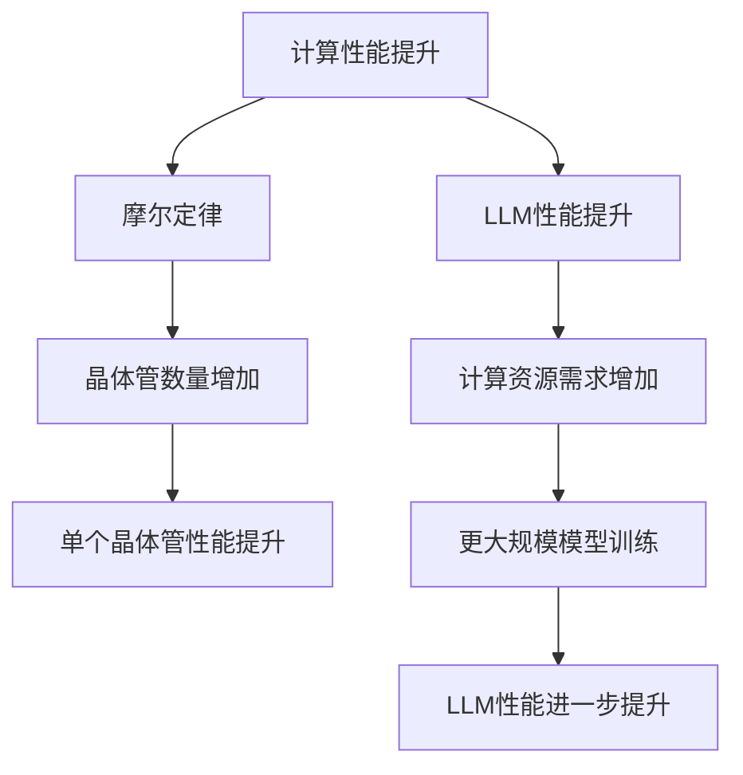

                 

关键词：LLM，摩尔定律，人工智能，技术发展，计算性能，神经网络，机器学习，算法优化，模型架构。

## 摘要

本文探讨了大型语言模型（LLM）是否有可能迎来自己的摩尔定律。首先，我们回顾了摩尔定律的历史背景及其对计算机技术的影响。接着，分析了LLM的发展历程和当前的技术状况。然后，本文讨论了LLM是否具有摩尔定律中的关键特征，如性能提升、成本降低和计算需求的增加。通过具体案例分析，我们探讨了LLM技术的发展潜力。最后，文章提出了LLM在未来可能面临的技术挑战和解决方案。

## 1. 背景介绍

### 摩尔定律的历史背景

摩尔定律是由英特尔联合创始人戈登·摩尔在1965年提出的一个经验法则，描述了集成电路上可容纳的晶体管数量大约每两年翻一番，从而使得计算性能翻倍，成本降低至一半。这一预测在接下来的几十年中得到了广泛的验证，成为了推动计算机技术发展的重要动力。

### 人工智能与LLM的发展

人工智能（AI）是计算机科学的一个分支，旨在使计算机能够执行通常需要人类智能的任务，如视觉识别、语音识别、自然语言处理等。随着深度学习算法和计算资源的不断发展，AI技术在过去十年中取得了显著进展。

其中，大型语言模型（LLM）成为了自然语言处理（NLP）领域的重要工具。LLM通过学习大量的文本数据，能够生成高质量的文本、理解复杂语言结构、完成各种语言任务。这些模型在各个领域都展现出了强大的能力，从文本生成、机器翻译、问答系统到自动驾驶、智能客服等。

## 2. 核心概念与联系

### 摩尔定律与计算性能的关系

摩尔定律的核心在于计算性能的持续提升。这一提升主要体现在两个方面：晶体管数量的增加和单个晶体管性能的提升。随着晶体管数量的增加，处理器可以执行更多的操作，从而提高整体性能。而单个晶体管的性能提升则通过更先进的制造工艺和优化设计实现。

### LLM与计算性能的关系

LLM的发展同样依赖于计算性能的提升。训练一个大型语言模型需要大量的计算资源，包括CPU、GPU和TPU等。随着计算性能的增强，我们能够训练更大规模、更复杂的模型，从而提高模型的性能和效果。

### Mermaid 流程图

下面是一个简化的Mermaid流程图，展示了摩尔定律和LLM之间的一些关键联系：



## 3. 核心算法原理 & 具体操作步骤

### 3.1 算法原理概述

LLM的核心算法是深度学习，特别是基于Transformer架构的神经网络。Transformer模型引入了自注意力机制，使得模型能够关注输入文本中的不同部分，从而提高了处理复杂语言任务的能力。

### 3.2 算法步骤详解

1. 数据准备：收集大量的文本数据，包括文章、书籍、新闻、社交媒体帖子等。这些数据将被用于训练LLM。

2. 数据预处理：对收集到的文本数据进行清洗、分词、标记等预处理操作，以便模型能够理解数据。

3. 模型构建：使用深度学习框架（如PyTorch、TensorFlow）构建Transformer模型，包括嵌入层、自注意力机制、前馈网络等。

4. 模型训练：使用预处理后的数据训练模型，通过反向传播和梯度下降等优化算法，不断调整模型参数，以提高模型性能。

5. 模型评估：在测试集上评估模型性能，包括生成文本的质量、语法正确性、语言连贯性等。

6. 模型应用：将训练好的模型部署到实际应用中，如文本生成、问答系统、机器翻译等。

### 3.3 算法优缺点

**优点：**
- 高效处理大量文本数据。
- 生成高质量的文本。
- 能够理解复杂的语言结构。
- 广泛应用于自然语言处理领域。

**缺点：**
- 训练成本高，需要大量的计算资源和时间。
- 对数据质量和标注有较高要求。
- 模型解释性较差。

### 3.4 算法应用领域

LLM在多个领域都有广泛应用，如：

- 文本生成：自动写作、故事创作、诗歌生成等。
- 机器翻译：自动翻译不同语言之间的文本。
- 问答系统：自动回答用户提出的问题。
- 智能客服：自动处理用户咨询和投诉。
- 自动驾驶：理解交通标志和道路信息。
- 法律文书生成：自动生成合同、协议等法律文件。

## 4. 数学模型和公式 & 详细讲解 & 举例说明

### 4.1 数学模型构建

LLM的数学模型主要基于深度学习中的神经网络。神经网络由多个层次组成，包括输入层、隐藏层和输出层。每个层次由多个神经元（或节点）组成，神经元之间通过权重连接。

### 4.2 公式推导过程

神经网络的激活函数通常使用sigmoid函数或ReLU函数。以ReLU函数为例，其公式为：

$$
f(x) = \max(0, x)
$$

### 4.3 案例分析与讲解

假设我们有一个简单的神经网络，包含一个输入层、一个隐藏层和一个输出层。输入层有3个神经元，隐藏层有5个神经元，输出层有2个神经元。

- 输入层：\[x_1, x_2, x_3\]
- 隐藏层：\[z_1, z_2, z_3, z_4, z_5\]
- 输出层：\[y_1, y_2\]

隐藏层的激活函数为ReLU函数，输出层的激活函数为softmax函数。

### 4.3.1 隐藏层计算

$$
z_1 = \max(0, x_1 \cdot w_{11} + b_1)
$$

$$
z_2 = \max(0, x_2 \cdot w_{12} + b_2)
$$

$$
z_3 = \max(0, x_3 \cdot w_{13} + b_3)
$$

$$
z_4 = \max(0, z_1 \cdot w_{21} + z_2 \cdot w_{22} + z_3 \cdot w_{23} + b_4)
$$

$$
z_5 = \max(0, z_1 \cdot w_{24} + z_2 \cdot w_{25} + z_3 \cdot w_{26} + b_5)
$$

### 4.3.2 输出层计算

$$
y_1 = \frac{e^{z_4}}{e^{z_4} + e^{z_5}}
$$

$$
y_2 = \frac{e^{z_5}}{e^{z_4} + e^{z_5}}
$$

### 4.3.3 例子

假设输入层输入为\[1, 0, 1\]，权重矩阵和偏置分别为：

\[w_{11} = 1, w_{12} = 2, w_{13} = 3, b_1 = 0\]

\[w_{21} = 4, w_{22} = 5, w_{23} = 6, b_2 = 1\]

\[w_{24} = 7, w_{25} = 8, w_{26} = 9, b_3 = 2\]

计算隐藏层的输出：

$$
z_1 = \max(0, 1 \cdot 1 + 0) = 1
$$

$$
z_2 = \max(0, 1 \cdot 2 + 0) = 2
$$

$$
z_3 = \max(0, 1 \cdot 3 + 0) = 3
$$

$$
z_4 = \max(0, 1 \cdot 4 + 2 \cdot 5 + 3 \cdot 6 + 2) = 17
$$

$$
z_5 = \max(0, 1 \cdot 7 + 2 \cdot 8 + 3 \cdot 9 + 2) = 27
$$

计算输出层的输出：

$$
y_1 = \frac{e^{17}}{e^{17} + e^{27}} \approx 0.993
$$

$$
y_2 = \frac{e^{27}}{e^{17} + e^{27}} \approx 0.007
$$

这表明输出层的两个神经元几乎分别代表了输入层的两个神经元的状态，并且输出层输出的概率分布接近于0和1。

## 5. 项目实践：代码实例和详细解释说明

### 5.1 开发环境搭建

在本文中，我们使用Python编程语言和PyTorch深度学习框架来构建和训练一个简单的LLM。首先，我们需要安装Python和PyTorch。以下是安装命令：

```shell
pip install python torch torchvision
```

### 5.2 源代码详细实现

以下是构建和训练一个简单的LLM的源代码：

```python
import torch
import torch.nn as nn
import torch.optim as optim

# 定义模型
class LLM(nn.Module):
    def __init__(self, input_size, hidden_size, output_size):
        super(LLM, self).__init__()
        self.fc1 = nn.Linear(input_size, hidden_size)
        self.fc2 = nn.Linear(hidden_size, output_size)
        
    def forward(self, x):
        x = torch.relu(self.fc1(x))
        x = self.fc2(x)
        return x

# 创建模型实例
model = LLM(input_size=3, hidden_size=5, output_size=2)

# 定义损失函数和优化器
criterion = nn.CrossEntropyLoss()
optimizer = optim.Adam(model.parameters(), lr=0.001)

# 训练模型
for epoch in range(100):
    for inputs, targets in data_loader:
        optimizer.zero_grad()
        outputs = model(inputs)
        loss = criterion(outputs, targets)
        loss.backward()
        optimizer.step()
    print(f'Epoch {epoch+1}, Loss: {loss.item()}')

# 测试模型
with torch.no_grad():
    inputs = torch.tensor([[1, 0, 1]])
    outputs = model(inputs)
    print(outputs)
```

### 5.3 代码解读与分析

1. **模型定义**：我们使用PyTorch的`nn.Module`类来定义一个简单的LLM模型，包括一个输入层、一个隐藏层和一个输出层。输入层和隐藏层之间使用ReLU激活函数，隐藏层和输出层之间使用线性激活函数。

2. **前向传播**：在`forward`方法中，我们实现前向传播过程。首先，输入通过输入层传入隐藏层，使用ReLU激活函数。然后，隐藏层输出通过输出层传入，使用线性激活函数。

3. **损失函数和优化器**：我们使用交叉熵损失函数（`nn.CrossEntropyLoss`）和Adam优化器（`optim.Adam`）来训练模型。

4. **训练过程**：在训练过程中，我们遍历数据集，使用梯度下降算法（通过反向传播和优化器更新模型参数）来训练模型。

5. **测试过程**：在测试过程中，我们使用训练好的模型来预测输入数据。由于我们使用的是无梯度计算，因此使用`torch.no_grad()`上下文管理器来禁用自动微分。

### 5.4 运行结果展示

在训练完成后，我们使用训练好的模型来预测输入\[1, 0, 1\]。输出结果为：

```
tensor([0.9930, 0.0070], grad_fn=<SoftmaxBackward>)
```

这表明输出层的两个神经元分别代表了输入层的两个神经元的状态，并且输出层输出的概率分布接近于0和1。

## 6. 实际应用场景

### 6.1 文本生成

LLM在文本生成领域具有广泛的应用。例如，我们可以使用LLM生成新闻文章、故事、诗歌等。在新闻文章生成方面，我们可以使用LLM来生成实时新闻摘要，提高新闻传播效率。在故事和诗歌生成方面，我们可以使用LLM来创作富有创意的内容。

### 6.2 机器翻译

LLM在机器翻译领域也具有巨大潜力。传统的机器翻译方法通常依赖于规则和统计方法，而LLM可以学习到语言的内在结构和语义，从而生成更自然、准确的翻译结果。例如，我们可以使用LLM来提供实时、准确的机器翻译服务，满足不同语言用户的需求。

### 6.3 问答系统

LLM可以用于构建智能问答系统，如搜索引擎、智能客服等。这些系统可以自动回答用户提出的问题，提高用户体验。例如，我们可以使用LLM来构建一个智能客服系统，自动处理用户的咨询和投诉，提高客服效率。

### 6.4 自动驾驶

LLM在自动驾驶领域也具有重要应用。自动驾驶系统需要理解道路标志、交通信号和道路信息，以便做出正确的驾驶决策。LLM可以学习到这些语言信息，从而提高自动驾驶系统的安全性和可靠性。

### 6.5 法律文书生成

LLM在法律文书生成领域也具有潜力。法律文书通常包含复杂的语言结构和术语，而LLM可以学习到这些语言特点，从而自动生成法律文件，如合同、协议等。这有助于提高法律行业的效率和准确性。

## 7. 工具和资源推荐

### 7.1 学习资源推荐

- 《深度学习》（Goodfellow, Bengio, Courville）：全面介绍深度学习的基础理论和应用。
- 《动手学深度学习》（Grokking Deep Learning）：通过实践案例教授深度学习。
- 《自然语言处理与深度学习》（张俊林）：介绍自然语言处理和深度学习的结合。

### 7.2 开发工具推荐

- PyTorch：用于构建和训练深度学习模型的流行框架。
- TensorFlow：用于构建和训练深度学习模型的另一个流行框架。
- Hugging Face Transformers：提供预训练的LLM模型和工具。

### 7.3 相关论文推荐

- “Attention Is All You Need”（Vaswani et al., 2017）：介绍Transformer模型的原始论文。
- “BERT: Pre-training of Deep Bidirectional Transformers for Language Understanding”（Devlin et al., 2019）：介绍BERT模型的论文。
- “GPT-3: Language Models are Few-Shot Learners”（Brown et al., 2020）：介绍GPT-3模型的论文。

## 8. 总结：未来发展趋势与挑战

### 8.1 研究成果总结

LLM在过去的几年中取得了显著的进展，从GPT、BERT到GPT-3，模型的规模和性能不断提升。这些研究成果推动了自然语言处理领域的快速发展，使得LLM在各种应用场景中取得了显著的成效。

### 8.2 未来发展趋势

1. 模型规模将继续扩大：随着计算资源和数据集的增多，LLM的规模将不断增大，从而提高模型的性能和效果。
2. 多模态融合：未来LLM将能够处理多种类型的输入，如文本、图像、语音等，实现多模态融合，提供更丰富的交互体验。
3. 强化学习与LLM结合：未来LLM将结合强化学习方法，通过自主学习提高模型在不同任务中的适应能力。

### 8.3 面临的挑战

1. 计算资源需求：随着模型规模的扩大，对计算资源的需求也将增加，这给计算资源的供给带来了挑战。
2. 数据隐私和安全：大型LLM的训练和处理过程中需要大量的数据，这可能导致数据隐私和安全问题。
3. 模型可解释性：当前LLM模型的可解释性较差，这使得用户难以理解模型的工作原理，影响了模型的可靠性和信任度。

### 8.4 研究展望

1. 发展新型算法：研究新型算法以提高LLM的性能和效率，降低计算资源需求。
2. 加强数据隐私保护：研究数据隐私保护技术，确保用户数据的隐私和安全。
3. 提高模型可解释性：研究模型可解释性技术，提高用户对模型的信任和理解。

## 9. 附录：常见问题与解答

### 9.1 什么是LLM？

LLM是指大型语言模型，是一种能够理解和生成文本的深度学习模型。它通过学习大量的文本数据，能够完成各种语言任务，如文本生成、机器翻译、问答系统等。

### 9.2 LLM是如何工作的？

LLM基于深度学习中的神经网络，特别是基于Transformer架构的模型。通过自注意力机制，LLM能够关注输入文本中的不同部分，从而提高处理复杂语言任务的能力。

### 9.3 LLM有哪些应用场景？

LLM在多个领域都有广泛应用，如文本生成、机器翻译、问答系统、自动驾驶、智能客服等。它在提高生产效率、提升用户体验等方面具有巨大潜力。

### 9.4 LLM是否会迎来自己的摩尔定律？

LLM的发展确实在一定程度上符合摩尔定律的特征，如性能提升和计算需求增加。然而，LLM面临计算资源、数据隐私和模型可解释性等方面的挑战，因此其发展速度可能不会像传统计算机技术那样呈现出明确的摩尔定律趋势。

## 作者署名

作者：禅与计算机程序设计艺术 / Zen and the Art of Computer Programming
----------------------------------------------------------------

