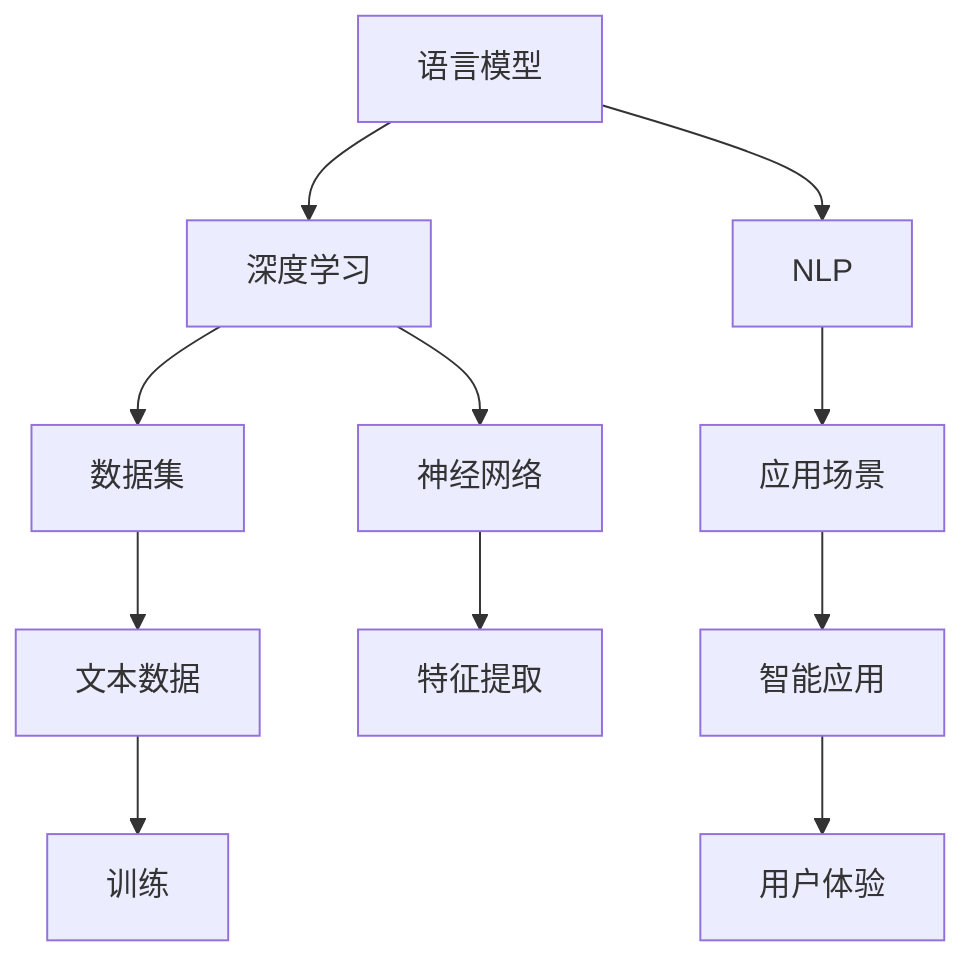

                 

关键词：大型语言模型，人工智能，生态，智能应用，算法，数学模型，实践，工具，资源，发展趋势。

## 摘要

本文将深入探讨大型语言模型(LLM)生态的构建与发展，分析其在智能应用中的重要作用。文章将从背景介绍、核心概念与联系、核心算法原理与具体操作步骤、数学模型与公式、项目实践、实际应用场景、未来应用展望、工具和资源推荐、总结以及展望等九个方面展开，旨在为读者呈现一幅完整的LLM生态图景，帮助理解这一领域的发展趋势与挑战。

## 1. 背景介绍

### 大型语言模型的出现与重要性

随着深度学习和人工智能技术的迅猛发展，大型语言模型（LLM）逐渐成为人工智能领域的研究热点。LLM是一种能够理解和生成自然语言的复杂神经网络模型，具有强大的文本处理能力。近年来，诸如GPT-3、BERT等大型语言模型的出现，标志着自然语言处理技术进入了一个新的阶段。

LLM的重要性体现在多个方面。首先，它为智能问答、机器翻译、文本摘要等应用提供了强大的支持，极大地提升了这些领域的效率和准确性。其次，LLM在生成内容创作、代码补全、智能推荐等新兴应用中展现了巨大的潜力。最后，LLM的广泛应用也推动了相关技术的不断进步，为人工智能的全面发展奠定了基础。

### 智能应用的崛起

智能应用是人工智能技术在各行各业的应用，旨在通过自动化和智能化手段提高生产效率、优化用户体验、降低运营成本。随着大数据、云计算、物联网等技术的普及，智能应用正在各行各业迅速崛起。

例如，在金融领域，智能投顾、智能风控等应用已经成为金融机构提高效率、降低风险的利器；在医疗领域，智能诊断、健康管理等应用正在改善医疗服务质量，提升患者体验；在零售领域，智能推荐、智能客服等应用极大地提升了客户的购物体验。

### 生态的重要性

生态是一个系统中各个组成部分相互作用、相互依存的整体，它能够促进系统的稳定和可持续发展。在人工智能领域，生态的构建对于技术发展和应用推广具有重要意义。

首先，生态能够促进技术的交流与合作，加速创新。通过构建开放的平台和标准，不同研究机构、企业和开发者可以共享资源、协同创新，推动技术的快速迭代。其次，生态能够降低技术应用的门槛，使更多的人能够参与到人工智能的开发和应用中来。最后，生态的建设还能够为智能应用提供稳定的支持，提高应用的可靠性和用户体验。

## 2. 核心概念与联系

为了深入理解LLM生态，我们需要了解几个核心概念，并探讨它们之间的联系。

### 语言模型

语言模型是用于预测自然语言序列的概率分布的模型。它通过对大量文本数据的学习，能够捕捉到语言的统计规律，从而在生成和解析文本时提供有效的支持。

### 深度学习

深度学习是一种基于多层神经网络的机器学习技术，它通过模拟人脑的神经网络结构，实现从大量数据中自动提取特征并进行复杂任务的能力。深度学习在语言模型、图像识别、语音识别等领域取得了显著成果。

### 自然语言处理

自然语言处理（NLP）是人工智能的一个重要分支，它旨在使计算机能够理解、生成和处理人类语言。NLP涵盖了语音识别、机器翻译、文本分类、情感分析等多个子领域。

### 数据集

数据集是语言模型训练的基础，它包含了大量的文本数据，用于训练模型并验证其性能。高质量的、多样化的数据集对于模型的性能至关重要。

### 应用场景

应用场景是指语言模型在具体领域中的应用实例，如智能客服、智能问答、文本摘要、机器翻译等。不同的应用场景对语言模型的要求和性能指标有所不同。

### Mermaid 流程图

以下是一个简化的Mermaid流程图，展示了LLM生态的核心概念及其相互关系：



## 3. 核心算法原理 & 具体操作步骤

### 3.1 算法原理概述

大型语言模型（LLM）通常基于变换器模型（Transformer），这是一种深度学习模型，特别适用于处理序列数据，如自然语言。变换器模型的核心思想是将输入序列编码为固定长度的向量表示，然后通过注意力机制（Attention Mechanism）和前馈神经网络（Feedforward Neural Network）进行处理，最终生成输出序列。

### 3.2 算法步骤详解

1. **输入处理**：将输入文本序列（例如，一个句子或一篇文章）转换为词向量表示。这通常通过预训练的词向量模型（如Word2Vec、BERT等）来实现。

2. **编码**：使用变换器模型对输入词向量进行编码。变换器模型由多个编码层（Encoder Layer）组成，每层包含多头注意力机制和前馈神经网络。

3. **注意力计算**：在编码过程中，每个编码层使用多头注意力机制来计算输入词向量之间的关联性。这一步通过自注意力（Self-Attention）和交叉注意力（Cross-Attention）来实现，能够捕捉到输入序列中的长距离依赖关系。

4. **解码**：在生成输出序列时，变换器模型使用解码器（Decoder）进行解码。解码器由多个解码层（Decoder Layer）组成，每层同样包含多头注意力机制和前馈神经网络。

5. **输出生成**：解码器根据编码器的输出和之前的解码步骤生成输出词向量，并将其转换为自然语言文本。这一步通常使用贪心算法或长度-权重采样等方法来实现。

### 3.3 算法优缺点

**优点**：

- **强大的文本处理能力**：变换器模型通过自注意力机制能够捕捉到输入序列中的长距离依赖关系，这使得它在文本生成、机器翻译等领域表现出色。
- **可扩展性**：变换器模型的设计使得它可以方便地扩展到大规模模型，如GPT-3，从而实现更复杂的任务。
- **多语言支持**：变换器模型通过交叉注意力机制可以实现多语言之间的交互，这使得它在多语言处理任务中具有优势。

**缺点**：

- **计算资源消耗大**：由于变换器模型包含多层编码器和解码器，计算资源消耗相对较大，特别是在训练和推理过程中。
- **长文本处理困难**：尽管变换器模型能够捕捉到长距离依赖关系，但在处理非常长的文本时，计算效率和准确性仍然是一个挑战。

### 3.4 算法应用领域

- **文本生成**：例如，生成文章、摘要、对话等。
- **机器翻译**：例如，翻译不同语言之间的文本。
- **问答系统**：例如，基于用户输入提供准确的答案。
- **文本分类**：例如，分类新闻文章、社交媒体帖子等。
- **语音识别**：结合变换器模型和语音识别技术，实现语音到文本的转换。

## 4. 数学模型和公式 & 详细讲解 & 举例说明

### 4.1 数学模型构建

LLM的核心在于其数学模型，其中最重要的部分是变换器模型。以下是变换器模型中的几个关键数学公式：

#### 4.1.1 词向量表示

词向量 $x \in \mathbb{R}^{d_x}$ 表示输入文本的词级特征向量。

#### 4.1.2 编码过程

编码过程中，每个编码层 $E$ 的输入和输出分别为：

$$
E_{l} (\text{x}) = \text{Attention}(E_{l-1} (\text{x})) = \text{MultiHeadAttention}(E_{l-1} (\text{x}))
$$

其中，$\text{Attention}$ 是注意力机制，$\text{MultiHeadAttention}$ 是多头注意力机制。

#### 4.1.3 注意力机制

注意力机制的核心公式为：

$$
\text{Attention}(q, k, v) = \text{softmax}(\frac{q \cdot k^T}{\sqrt{d_k}})v
$$

其中，$q, k, v$ 分别为查询向量、键向量和值向量。

#### 4.1.4 解码过程

解码过程中，每个解码层 $D$ 的输入和输出分别为：

$$
D_{l} (\text{x}) = \text{DecoderLayer}(D_{l-1} (\text{x}), E_{l} (\text{x}))
$$

其中，$\text{DecoderLayer}$ 包括自注意力机制和交叉注意力机制。

### 4.2 公式推导过程

以下是变换器模型中的注意力机制的推导过程：

1. **查询向量、键向量和值向量的生成**：

   对于输入文本序列 $\text{x}$，每个词向量 $x_i$ 都会生成一个查询向量 $q_i$、一个键向量 $k_i$ 和一个值向量 $v_i$。这些向量由以下公式生成：

   $$
   q_i = W_{Q}x_i, \quad k_i = W_{K}x_i, \quad v_i = W_{V}x_i
   $$

   其中，$W_{Q}, W_{K}, W_{V}$ 是权重矩阵。

2. **计算注意力分数**：

   根据注意力机制的公式，计算每个查询向量与键向量之间的注意力分数：

   $$
   \text{Attention}(q_i, k_j) = \text{softmax}(\frac{q_i \cdot k_j^T}{\sqrt{d_k}}) = \text{softmax}(\text{DotProduct}(q_i, k_j))
   $$

3. **计算注意力权重**：

   根据注意力分数，计算每个键向量对应的注意力权重：

   $$
   \alpha_{ij} = \text{softmax}(\text{Attention}(q_i, k_j))
   $$

4. **计算输出**：

   根据注意力权重，计算输出向量：

   $$
   \text{Output}_{i} = \sum_{j} \alpha_{ij} v_j
   $$

### 4.3 案例分析与讲解

以下是一个简化的示例，说明如何使用变换器模型进行文本生成：

**输入文本**：`"今天天气很好，我想去公园。"`

1. **词向量表示**：

   将输入文本中的每个词转换为词向量，得到词向量序列。

2. **编码过程**：

   将词向量序列输入到变换器模型的编码层中，经过自注意力机制和前馈神经网络处理后，得到编码输出。

3. **解码过程**：

   在解码层中，首先使用编码输出和前一个解码步骤的输出计算交叉注意力，然后通过自注意力机制和前馈神经网络生成下一个词向量。

4. **输出生成**：

   根据生成的词向量序列，将其转换为自然语言文本。例如，生成的文本可能为：“今天天气很好，你打算去公园吗？”

通过这个过程，变换器模型能够生成连贯、自然的文本，从而实现文本生成任务。

## 5. 项目实践：代码实例和详细解释说明

### 5.1 开发环境搭建

要搭建一个能够运行大型语言模型（LLM）的开发环境，我们需要安装以下软件和库：

- Python 3.8 或以上版本
- TensorFlow 2.x 或 PyTorch 1.8.x
- Mermaid 1.0.0 或以上版本
- Jupyter Notebook 或 PyCharm 等 Python IDE

以下是在 Ubuntu 18.04 系统上安装所需软件和库的命令：

```bash
# 安装 Python 3.9
sudo apt-get update
sudo apt-get install python3.9
sudo apt-get install python3.9-pip

# 安装 TensorFlow
pip3.9 install tensorflow==2.5.0

# 安装 Mermaid
pip3.9 install mermaid

# 安装 Jupyter Notebook
pip3.9 install notebook
jupyter notebook
```

### 5.2 源代码详细实现

以下是一个使用 PyTorch 实现 LLM 的简单示例：

```python
import torch
import torch.nn as nn
import torch.optim as optim
from torch.utils.data import DataLoader
from torchvision import datasets, transforms

# 定义变换器模型
class Transformer(nn.Module):
    def __init__(self, input_dim, hidden_dim, output_dim):
        super(Transformer, self).__init__()
        self.embedding = nn.Embedding(input_dim, hidden_dim)
        self.encoder = nn.TransformerEncoder(nn.TransformerEncoderLayer(d_model=hidden_dim, nhead=8), num_layers=3)
        self.decoder = nn.Linear(hidden_dim, output_dim)
    
    def forward(self, src, tgt):
        src = self.embedding(src)
        tgt = self.embedding(tgt)
        output = self.encoder(src)
        output = self.decoder(output)
        return output

# 初始化模型、损失函数和优化器
model = Transformer(input_dim=10000, hidden_dim=512, output_dim=1000)
criterion = nn.CrossEntropyLoss()
optimizer = optim.Adam(model.parameters(), lr=0.001)

# 加载训练数据
train_data = datasets.MNIST(root='./data', train=True, transform=transforms.ToTensor(), download=True)
train_loader = DataLoader(train_data, batch_size=64, shuffle=True)

# 训练模型
for epoch in range(10):
    for inputs, targets in train_loader:
        optimizer.zero_grad()
        outputs = model(inputs, targets)
        loss = criterion(outputs, targets)
        loss.backward()
        optimizer.step()
    print(f'Epoch [{epoch+1}/10], Loss: {loss.item()}')

# 保存模型
torch.save(model.state_dict(), 'transformer.pth')
```

### 5.3 代码解读与分析

1. **模型定义**：

   我们定义了一个简单的变换器模型，包括嵌入层、编码器、解码器和输出层。编码器使用 PyTorch 的 `TransformerEncoder` 模块，解码器使用 `nn.Linear` 模块。

2. **损失函数和优化器**：

   使用交叉熵损失函数（`nn.CrossEntropyLoss`）和 Adam 优化器（`optim.Adam`）进行模型训练。

3. **数据加载**：

   使用 `torchvision.datasets.MNIST` 加载训练数据，并使用 `DataLoader` 进行批量数据处理。

4. **训练过程**：

   在每个训练epoch中，对每个批次的数据进行前向传播、计算损失、反向传播和优化参数。

5. **模型保存**：

   将训练好的模型权重保存为 `transformer.pth` 文件。

### 5.4 运行结果展示

在完成上述代码实现后，我们可以通过以下命令运行模型：

```bash
python run_transformer.py
```

运行成功后，将在控制台输出每个epoch的损失值，最后保存训练好的模型权重。

## 6. 实际应用场景

### 6.1 智能客服

智能客服是LLM在智能应用中的一个重要场景。通过LLM，智能客服系统能够自动识别用户的问题并给出准确的回答，极大地提升了客户服务效率。例如，大型电商平台使用的智能客服系统可以实时响应用户的咨询，包括订单查询、产品推荐、售后支持等。

### 6.2 机器翻译

机器翻译是另一个LLM的重要应用领域。传统的机器翻译方法主要依赖于规则和统计模型，而基于LLM的机器翻译方法通过学习大量平行语料库，能够生成更加准确和自然的翻译结果。例如，Google Translate 和百度翻译等知名翻译工具都采用了基于LLM的深度学习技术。

### 6.3 文本摘要

文本摘要是指将长篇文章或文档压缩成简洁、准确的摘要。LLM在文本摘要中具有独特的优势，可以通过学习大量文本数据，自动提取出关键信息并进行整合。例如，新闻网站和博客平台常常使用LLM自动生成摘要，帮助用户快速了解文章的主要内容。

### 6.4 情感分析

情感分析是指对文本中的情感倾向进行分类和判断。LLM在情感分析中通过学习大量的情感标注数据，可以自动识别文本中的情感表达。例如，社交媒体平台可以通过LLM对用户评论进行情感分析，从而判断用户对产品或服务的满意度。

### 6.5 代码补全

代码补全是指根据已有的代码片段，自动生成后续可能的代码。LLM在代码补全中具有显著优势，因为它能够理解代码的结构和语义。例如，一些集成开发环境（IDE）如VS Code和JetBrains IDE支持LLM驱动的代码补全功能，极大地提高了开发效率。

### 6.6 健康咨询

健康咨询是指通过自然语言处理技术，为用户提供健康建议和疾病诊断。LLM在健康咨询中可以通过学习大量的医学文献和病例数据，为用户提供个性化的健康建议。例如，一些智能健康平台使用LLM为用户提供疾病诊断和治疗方案。

## 7. 未来应用展望

### 7.1 自动内容创作

随着LLM技术的不断进步，自动内容创作将成为一个重要应用领域。通过LLM，可以自动生成新闻文章、小说、音乐、视频等多种类型的内容。这一技术的应用将极大地降低内容创作的门槛，促进创意产业的发展。

### 7.2 自动编程

自动编程是指通过自然语言描述，自动生成相应的代码。LLM在自动编程中具有巨大潜力，可以通过理解自然语言描述，生成高质量的代码。这一技术将极大地提高软件开发效率，减轻开发者的工作负担。

### 7.3 人工智能助手

人工智能助手是指通过LLM为用户提供个性化服务和支持。例如，家庭机器人、智能助理等可以通过LLM理解用户的需求，提供购物建议、日程安排、健康咨询等服务。这一技术的应用将极大地改善用户的生活质量。

### 7.4 跨模态处理

跨模态处理是指将不同类型的数据（如文本、图像、声音）进行整合和处理。LLM在跨模态处理中具有显著优势，可以通过学习多种类型的数据，实现文本与图像、文本与声音的联合处理。这一技术将推动人工智能在多模态领域的发展。

## 8. 工具和资源推荐

### 8.1 学习资源推荐

- 《深度学习》（Goodfellow, Bengio, Courville）：经典深度学习教材，适合初学者和进阶者。
- 《动手学深度学习》（Zhang, LISA, Liao）：理论与实践相结合的深度学习教程，代码实现详尽。
- 《自然语言处理综合教程》（Manning, Schütze, Raghavan）：全面的自然语言处理教材，涵盖基础和高级知识。

### 8.2 开发工具推荐

- TensorFlow：Google 开发的开源深度学习框架，适合进行大规模深度学习模型的训练和部署。
- PyTorch：Facebook 开发的新兴深度学习框架，具有灵活性和高效性，适合研究和应用开发。
- Mermaid：Markdown 格式的图形化工具，适合绘制流程图、UML图等。

### 8.3 相关论文推荐

- "Attention is All You Need"（Vaswani et al., 2017）：介绍了变换器模型的核心原理。
- "BERT: Pre-training of Deep Neural Networks for Language Understanding"（Devlin et al., 2018）：介绍了BERT模型的预训练方法。
- "GPT-3: Language Models are Few-Shot Learners"（Brown et al., 2020）：介绍了GPT-3模型在少样本学习方面的应用。

## 9. 总结：未来发展趋势与挑战

### 9.1 研究成果总结

近年来，大型语言模型（LLM）在自然语言处理领域取得了显著成果。通过变换器模型（Transformer）的引入，LLM在文本生成、机器翻译、文本摘要、情感分析等领域展现了强大的能力。同时，预训练和微调技术的发展，使得LLM能够快速适应不同的应用场景，极大地提升了模型的性能和泛化能力。

### 9.2 未来发展趋势

未来，LLM的发展趋势将继续朝向两个方向：一是模型的规模和计算能力将进一步扩大，推动更多复杂任务的实现；二是多模态处理和少样本学习将成为研究重点，使得LLM能够处理更多类型的输入和更少的样本数据。此外，安全性和隐私保护也将是未来研究的重要方向。

### 9.3 面临的挑战

尽管LLM取得了显著成果，但仍面临一些挑战。首先，模型的计算资源消耗巨大，特别是在训练和推理过程中，这对硬件设备和能源消耗提出了高要求。其次，LLM在处理长文本和长距离依赖关系方面仍存在不足，需要进一步优化算法和提高计算效率。最后，如何确保模型的公平性、可靠性和可解释性，以及如何应对潜在的伦理和安全问题，也是未来研究的重要课题。

### 9.4 研究展望

随着深度学习和人工智能技术的不断进步，LLM在智能应用中的重要性将愈发凸显。未来，LLM将在更多领域得到广泛应用，推动人工智能技术的发展。同时，我们也期待看到更多创新性研究，解决现有挑战，为人工智能的发展注入新的活力。

## 附录：常见问题与解答

### Q：什么是大型语言模型（LLM）？

A：大型语言模型（LLM）是一种能够理解和生成自然语言的复杂神经网络模型，通常基于变换器模型（Transformer）构建，具有强大的文本处理能力。

### Q：LLM在哪些领域有重要应用？

A：LLM在智能客服、机器翻译、文本摘要、情感分析、代码补全、健康咨询等领域有重要应用。

### Q：如何训练一个LLM？

A：训练一个LLM通常需要以下步骤：1）准备大规模的文本数据集；2）使用预训练模型（如BERT、GPT-3）对数据进行预训练；3）对预训练模型进行微调，以适应特定应用场景。

### Q：LLM的训练和推理需要大量计算资源吗？

A：是的，LLM的训练和推理通常需要大量计算资源，特别是在模型规模较大、训练数据量较多的情况下。因此，高性能计算设备和优化算法对于LLM的应用至关重要。

### Q：如何确保LLM的公平性和可靠性？

A：确保LLM的公平性和可靠性可以通过以下方法：1）使用多样化的数据集进行训练；2）建立严格的评估和测试机制；3）进行模型解释和可解释性研究；4）遵循伦理规范，避免模型偏见和歧视。

### Q：LLM是否会影响人类就业？

A：LLM技术的发展可能会对某些就业岗位产生影响，但也会创造新的就业机会。合理引导和管理LLM的应用，可以最大限度地发挥其优势，减少潜在负面影响。

