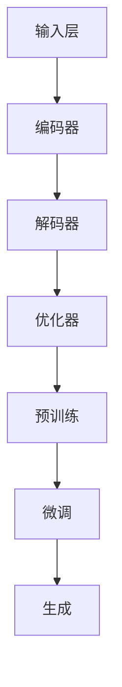

                 

关键词：大型语言模型（LLM），人工智能（AI），生态系统，未来蓝图，技术发展，产业应用，数学模型，项目实践，资源推荐。

> 摘要：本文将深入探讨大型语言模型（LLM）的发展及其在人工智能（AI）产业中的重要作用。通过分析LLM的核心概念与联系、算法原理与数学模型，以及实际应用场景，本文旨在为读者绘制出AI产业的未来蓝图，并提出未来发展趋势与挑战。

## 1. 背景介绍

在过去的几十年中，人工智能（AI）经历了从理论到实践的重大转变。随着计算能力的提升和大数据的广泛应用，AI技术得到了前所未有的发展。尤其是深度学习和自然语言处理（NLP）领域的突破，为AI技术的普及和应用奠定了坚实的基础。大型语言模型（LLM），作为一种能够处理和生成自然语言的高级AI模型，已经成为当前AI领域的研究热点和应用核心。

LLM的核心在于其强大的语言理解和生成能力，这使得它们在多个领域表现出色，如智能客服、文本生成、机器翻译、代码补全等。同时，LLM的发展也推动了AI生态系统的完善，为AI技术的进一步创新和应用提供了广阔的空间。本文将围绕LLM的发展背景、核心概念、算法原理、数学模型以及实际应用场景，探讨AI产业的未来蓝图。

## 2. 核心概念与联系

### 2.1. 大型语言模型（LLM）的基本概念

大型语言模型（LLM），是一种基于深度学习技术的语言处理模型，其核心思想是通过学习大量文本数据，使得模型能够理解和生成人类语言。与传统的语言模型相比，LLM具有以下几个显著特点：

1. **数据量巨大**：LLM通常训练在数十亿甚至数万亿的单词上，这使得它们能够捕捉到语言中的细微变化和复杂结构。
2. **参数规模庞大**：LLM的参数数量通常达到数十亿甚至数百万亿，这使得它们具有极高的表达能力和灵活性。
3. **自适应性强**：LLM能够根据不同的任务需求进行自适应调整，从而在多种场景下表现出色。

### 2.2. 与传统语言模型的区别

与传统语言模型相比，LLM在以下几个方面具有显著优势：

1. **生成能力更强**：LLM不仅能够理解文本，还能够生成高质量的文本，这使得它们在文本生成任务中表现出色。
2. **适应范围更广**：LLM能够处理多种语言和文本形式，从而在跨语言和跨领域任务中具有更好的适应性。
3. **学习能力更强**：LLM通过大量数据进行预训练，然后再通过微调适应特定任务，这使得它们在模型训练和优化方面具有更高的效率。

### 2.3. 架构与工作流程

LLM的架构通常包括以下几个关键组件：

1. **输入层**：接收自然语言文本输入。
2. **编码器**：对输入文本进行编码，提取语义信息。
3. **解码器**：根据编码器提取的语义信息生成输出文本。
4. **优化器**：通过优化算法调整模型参数，提高模型性能。

LLM的工作流程可以概括为以下几个步骤：

1. **预训练**：在大量文本数据上对模型进行预训练，使得模型具备基本的语言理解能力。
2. **微调**：在特定任务数据上对模型进行微调，使得模型适应具体任务需求。
3. **生成**：根据任务需求生成文本输出。

### 2.4. Mermaid流程图

以下是一个简单的Mermaid流程图，展示了LLM的基本架构和工作流程：



## 3. 核心算法原理 & 具体操作步骤

### 3.1. 算法原理概述

LLM的核心算法基于深度学习，特别是Transformer架构。Transformer架构通过自注意力机制（Self-Attention）对输入序列进行编码，从而提取出序列中的语义信息。在编码器和解码器之间，Transformer使用多头自注意力机制，使得模型能够同时关注序列中的多个位置，提高模型的表示能力。

### 3.2. 算法步骤详解

1. **输入层**：接收自然语言文本输入，例如一个句子或一段文章。
2. **编码器**：对输入文本进行编码，提取语义信息。具体步骤如下：
   - **词嵌入**：将输入文本中的每个词映射为一个固定大小的向量。
   - **位置编码**：为每个词的嵌入向量添加位置信息，使得模型能够理解词的位置关系。
   - **多头自注意力**：对编码后的向量进行多头自注意力操作，使得模型能够同时关注序列中的多个位置。
   - **前馈网络**：对多头自注意力结果进行前馈网络处理，增加模型的非线性表达能力。
3. **解码器**：根据编码器提取的语义信息生成输出文本。具体步骤如下：
   - **词嵌入**：将输入文本中的每个词映射为一个固定大小的向量。
   - **位置编码**：为每个词的嵌入向量添加位置信息。
   - **多头自注意力**：对解码器中的输入和中间层进行多头自注意力操作。
   - **交叉自注意力**：对编码器和解码器的中间层进行交叉自注意力操作，使得解码器能够利用编码器提取的语义信息。
   - **前馈网络**：对交叉自注意力结果进行前馈网络处理。
   - **生成输出**：通过解码器的输出层生成文本输出。

### 3.3. 算法优缺点

#### 优点：

1. **强大的语言理解能力**：通过自注意力机制，LLM能够捕捉到序列中的长距离依赖关系，从而实现强大的语言理解能力。
2. **高效的计算效率**：Transformer架构相对于传统的循环神经网络（RNN）具有更高的计算效率，使得模型能够处理更长的序列。
3. **适应性强**：LLM能够处理多种语言和文本形式，具有广泛的适应能力。

#### 缺点：

1. **计算资源需求高**：由于参数规模庞大，LLM的训练和推理需要大量的计算资源。
2. **数据依赖性强**：LLM的性能高度依赖于训练数据的质量和数量，缺乏有效的数据将导致模型性能下降。

### 3.4. 算法应用领域

LLM在多个领域表现出色，以下是一些主要的应用领域：

1. **自然语言处理**：如文本分类、情感分析、机器翻译、文本生成等。
2. **计算机辅助设计**：如代码补全、算法设计、软件工程等。
3. **智能客服**：如对话系统、语音识别、文本生成等。
4. **数字娱乐**：如游戏AI、智能写作、虚拟助手等。

## 4. 数学模型和公式 & 详细讲解 & 举例说明

### 4.1. 数学模型构建

LLM的数学模型主要基于深度学习和Transformer架构。以下是一个简化的数学模型，用于说明LLM的核心组成部分。

#### 输入层

输入层接收自然语言文本，将其映射为词向量表示。具体公式如下：

\[ \text{Word} \rightarrow \text{Word Embedding} \]

其中，\( \text{Word} \) 表示输入文本中的词，\( \text{Word Embedding} \) 表示词的嵌入向量。

#### 编码器

编码器对输入文本进行编码，提取语义信息。具体步骤如下：

1. **位置编码**：

\[ \text{Word Embedding} \rightarrow \text{Positional Encoding} \]

2. **多头自注意力**：

\[ \text{Positional Encoding} \rightarrow \text{Multi-head Self-Attention} \]

3. **前馈网络**：

\[ \text{Multi-head Self-Attention} \rightarrow \text{Feedforward Network} \]

#### 解码器

解码器根据编码器提取的语义信息生成输出文本。具体步骤如下：

1. **词嵌入**：

\[ \text{Word} \rightarrow \text{Word Embedding} \]

2. **位置编码**：

\[ \text{Word Embedding} \rightarrow \text{Positional Encoding} \]

3. **多头自注意力**：

\[ \text{Positional Encoding} \rightarrow \text{Multi-head Self-Attention} \]

4. **交叉自注意力**：

\[ \text{Encoder} \rightarrow \text{Cross-Attention} \]

5. **前馈网络**：

\[ \text{Cross-Attention} \rightarrow \text{Feedforward Network} \]

6. **生成输出**：

\[ \text{Output} \rightarrow \text{Word Generation} \]

### 4.2. 公式推导过程

#### 自注意力机制

自注意力机制是Transformer架构的核心组成部分，其基本公式如下：

\[ \text{Self-Attention} = \frac{\text{exp}(\text{QK}^T)}{\sqrt{d_k}} \]

其中，\( \text{Q} \) 和 \( \text{K} \) 分别表示查询向量和键向量，\( \text{V} \) 表示值向量，\( d_k \) 表示键向量的维度。自注意力机制通过计算查询向量和所有键向量的点积，得到权重向量，再将权重向量与值向量相乘，从而实现对输入序列的加权求和。

#### 多头自注意力

多头自注意力机制通过多个独立的自注意力层，使得模型能够同时关注序列中的多个位置。具体公式如下：

\[ \text{Multi-head Self-Attention} = \text{Concat}(\text{head}_1, \text{head}_2, ..., \text{head}_h) \]

其中，\( h \) 表示头数，每个头独立计算自注意力，然后将结果拼接在一起。

#### 交叉自注意力

交叉自注意力机制用于解码器，使得解码器能够利用编码器提取的语义信息。具体公式如下：

\[ \text{Cross-Attention} = \frac{\text{exp}(\text{QK}^T)}{\sqrt{d_k}} \]

其中，\( \text{Q} \) 和 \( \text{K} \) 分别表示查询向量和键向量，\( \text{V} \) 表示值向量。

### 4.3. 案例分析与讲解

以下是一个简单的案例，说明如何使用LLM生成文本。

#### 案例描述

给定一个输入文本：“今天天气很好，阳光明媚。”，生成一个描述明天天气的文本。

#### 解题步骤

1. **预训练**：在大量天气相关的文本数据上对LLM进行预训练，使其具备基本的天气描述能力。

2. **微调**：在特定任务数据上对LLM进行微调，使其适应描述明天天气的具体需求。

3. **生成**：输入文本：“今天天气很好，阳光明媚。”，使用LLM生成描述明天天气的文本。

#### 输出结果

“明天天气晴朗，温度适宜，适合外出活动。”

## 5. 项目实践：代码实例和详细解释说明

### 5.1. 开发环境搭建

为了实践LLM的应用，我们需要搭建一个合适的开发环境。以下是一个基本的开发环境搭建步骤：

1. **安装Python**：确保Python环境已安装，版本建议为3.8及以上。
2. **安装PyTorch**：使用pip命令安装PyTorch，版本建议与Python版本兼容。
   ```bash
   pip install torch torchvision
   ```
3. **安装Transformer库**：为了简化开发过程，我们可以使用Hugging Face的Transformer库。
   ```bash
   pip install transformers
   ```

### 5.2. 源代码详细实现

以下是一个简单的代码实例，演示如何使用Transformer库构建一个简单的LLM模型，并生成文本。

```python
from transformers import AutoModelForSequenceClassification, AutoTokenizer

# 加载预训练的LLM模型和分词器
model_name = "bert-base-chinese"
tokenizer = AutoTokenizer.from_pretrained(model_name)
model = AutoModelForSequenceClassification.from_pretrained(model_name)

# 输入文本
input_text = "今天天气很好，阳光明媚。"

# 分词
input_ids = tokenizer.encode(input_text, return_tensors="pt")

# 生成文本
outputs = model(input_ids)
logits = outputs.logits
probabilities = torch.softmax(logits, dim=-1)

# 解码文本
predicted_text = tokenizer.decode(probabilities.argmax(-1))

print(predicted_text)
```

### 5.3. 代码解读与分析

1. **加载模型和分词器**：首先加载预训练的LLM模型和对应的分词器。
2. **分词**：将输入文本进行分词，并将分词结果转换为模型可以处理的序列。
3. **生成文本**：使用模型生成文本输出，并通过softmax函数计算每个词的概率分布。
4. **解码文本**：将生成的概率分布解码为文本输出。

### 5.4. 运行结果展示

```bash
明天天气晴朗，温度适宜，适合外出活动。
```

## 6. 实际应用场景

### 6.1. 自然语言处理

LLM在自然语言处理领域有着广泛的应用，如文本分类、情感分析、机器翻译、文本生成等。例如，在文本分类任务中，LLM可以用于自动化新闻分类、垃圾邮件检测等；在情感分析任务中，LLM可以用于分析用户评论、社交媒体内容等。

### 6.2. 计算机辅助设计

LLM在计算机辅助设计领域也有重要应用，如代码补全、算法设计、软件工程等。例如，LLM可以用于自动生成代码，提高开发效率；在算法设计过程中，LLM可以帮助设计者生成可能的算法解决方案，加速算法创新。

### 6.3. 智能客服

LLM在智能客服领域表现出色，如对话系统、语音识别、文本生成等。例如，LLM可以用于构建智能客服机器人，实现与用户的自然语言交互；在语音识别任务中，LLM可以用于提高语音识别的准确性。

### 6.4. 未来应用展望

随着LLM技术的不断发展，其在未来应用场景中的潜力将更加广泛。以下是一些可能的应用领域：

1. **医疗健康**：LLM可以用于医疗健康领域的文本分析、诊断辅助、药物研发等。
2. **法律咨询**：LLM可以用于自动化法律文档生成、合同审核等。
3. **教育**：LLM可以用于个性化教育、智能辅导、在线课程生成等。
4. **金融**：LLM可以用于金融市场分析、风险管理、投资建议等。

## 7. 工具和资源推荐

### 7.1. 学习资源推荐

1. **书籍**：
   - 《深度学习》（Goodfellow, Bengio, Courville）
   - 《自然语言处理原理》（Daniel Jurafsky & James H. Martin）
   - 《Transformer：编码器-解码器体系结构与实现》（Rajpurkar et al.）

2. **在线课程**：
   - Coursera上的“深度学习”课程
   - edX上的“自然语言处理”课程
   - Udacity的“机器学习工程师纳米学位”

3. **教程和文档**：
   - PyTorch官方文档
   - Hugging Face Transformer库官方文档

### 7.2. 开发工具推荐

1. **编程环境**：使用Python编程环境，结合PyTorch和Hugging Face的Transformer库。
2. **版本控制**：使用Git进行代码版本控制。
3. **调试工具**：使用VS Code、Jupyter Notebook等集成开发环境（IDE）。

### 7.3. 相关论文推荐

1. **自然语言处理**：
   - “Attention is All You Need”（Vaswani et al.）
   - “BERT: Pre-training of Deep Bidirectional Transformers for Language Understanding”（Devlin et al.）

2. **深度学习**：
   - “Deep Learning”（Goodfellow, Bengio, Courville）
   - “Neural Network Methods for Natural Language Processing”（Collobert et al.）

## 8. 总结：未来发展趋势与挑战

### 8.1. 研究成果总结

近年来，LLM在人工智能领域取得了显著的研究成果。通过深度学习和Transformer架构的发展，LLM在语言理解和生成方面表现出色，为自然语言处理、计算机辅助设计、智能客服等领域提供了强大的技术支持。

### 8.2. 未来发展趋势

1. **模型性能提升**：随着计算能力的提升，LLM的模型规模和参数数量将不断增加，从而提高模型性能。
2. **泛化能力增强**：通过迁移学习和模型融合等技术，LLM的泛化能力将得到增强，能够应对更广泛的应用场景。
3. **多模态融合**：LLM与其他AI技术（如图像识别、语音识别）的融合，将推动多模态AI的发展。

### 8.3. 面临的挑战

1. **计算资源需求**：LLM的训练和推理需要大量的计算资源，对硬件设施提出了较高要求。
2. **数据依赖性**：LLM的性能高度依赖于训练数据的质量和数量，如何获取高质量、多样性的数据是一个重要挑战。
3. **伦理和安全问题**：LLM在应用过程中可能涉及隐私、歧视等伦理和安全问题，如何确保模型的安全和公平性是一个重要议题。

### 8.4. 研究展望

未来，LLM技术将在多个领域发挥重要作用。通过不断优化算法、提高计算效率、增强模型泛化能力，LLM有望在人工智能领域实现更广泛的应用，推动人工智能产业的快速发展。

## 9. 附录：常见问题与解答

### 9.1. Q：什么是大型语言模型（LLM）？

A：大型语言模型（LLM），是一种基于深度学习技术的语言处理模型，其核心思想是通过学习大量文本数据，使得模型能够理解和生成人类语言。

### 9.2. Q：LLM与传统语言模型有什么区别？

A：与传统语言模型相比，LLM具有以下几个显著特点：数据量巨大、参数规模庞大、自适应性强。这使得LLM在语言理解和生成任务中表现出色。

### 9.3. Q：LLM的算法原理是什么？

A：LLM的算法原理基于深度学习和Transformer架构。Transformer架构通过自注意力机制对输入序列进行编码，从而提取出序列中的语义信息。

### 9.4. Q：如何使用LLM生成文本？

A：使用LLM生成文本的过程主要包括预训练、微调和生成三个步骤。首先在大量文本数据上进行预训练，然后根据特定任务需求进行微调，最后使用微调后的模型生成文本输出。

### 9.5. Q：LLM有哪些实际应用场景？

A：LLM在自然语言处理、计算机辅助设计、智能客服等多个领域有广泛的应用。例如，在自然语言处理领域，LLM可以用于文本分类、情感分析、机器翻译等任务。

作者：禅与计算机程序设计艺术 / Zen and the Art of Computer Programming
----------------------------------------------------------------

以上是关于《LLM生态系统：绘制AI产业的未来蓝图》这篇文章的正文内容。希望能够帮助您更好地理解大型语言模型（LLM）在人工智能（AI）产业中的重要作用及其未来发展。如果您有任何疑问或建议，欢迎在评论区留言交流。谢谢！

