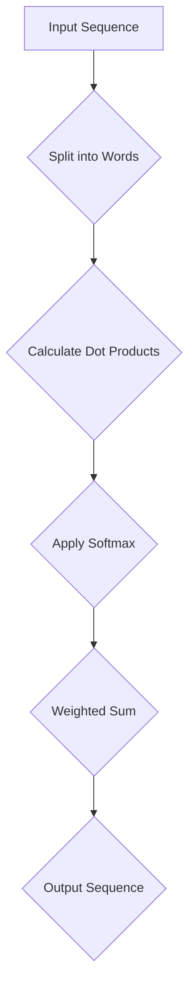
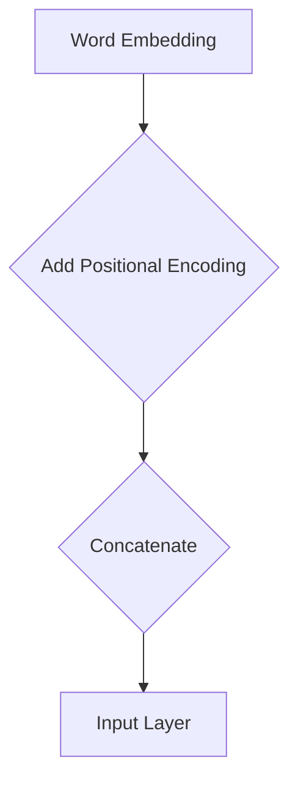
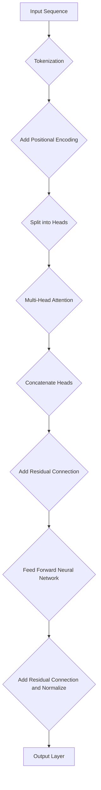

                 

### 摘要 Summary

随着人工智能技术的飞速发展，大型语言模型(LLM)在自然语言处理领域逐渐崭露头角，成为推动AI产业创新的重要力量。本文旨在探讨LLM生态的构建及其在AI产业中的新增长点。文章首先介绍了LLM的核心概念和原理，并通过Mermaid流程图展示了其架构。接着，深入分析了LLM的核心算法原理及其具体操作步骤，探讨了其优缺点和应用领域。随后，文章通过数学模型和公式详细讲解了LLM的工作机制，并通过实例进行了说明。在实际应用场景部分，文章展示了LLM在真实项目中的实践成果。最后，文章展望了LLM未来的发展趋势和挑战，并推荐了相关的学习资源和开发工具。

### 1. 背景介绍 Introduction

近年来，人工智能（AI）技术取得了显著的进展，尤其在自然语言处理（NLP）领域，涌现出了一系列突破性成果。大型语言模型（Large Language Model，简称LLM）作为NLP领域的重要工具，受到了广泛关注。LLM通过深度学习技术，对海量文本数据进行训练，从而实现理解、生成和翻译等语言任务。这一技术的突破，为AI产业带来了前所未有的机遇和挑战。

首先，LLM的出现解决了传统NLP方法在处理复杂语言现象时的局限性。例如，在语义理解、情感分析和问答系统中，LLM能够更加精准地捕捉语言中的细微差异，提供更准确的答案。其次，LLM的应用范围不断扩大，从最初的机器翻译、文本生成，发展到如今的智能客服、内容审核和代码辅助等多样化场景。此外，LLM在提升AI系统的智能化水平方面也发挥了关键作用，使得AI更具自主性和创造力。

然而，LLM的发展也面临诸多挑战。首先，LLM的训练需要巨大的计算资源和数据量，这对硬件设备和数据存储提出了高要求。其次，LLM在处理未知或异常情况时，可能存在偏差和错误，这对系统的鲁棒性提出了挑战。此外，LLM在隐私保护和安全方面也存在一定的风险，需要采取有效措施加以应对。

总的来说，LLM的发展为AI产业带来了新的增长点，但同时也需要我们关注其潜在的风险和挑战。本文将深入探讨LLM的核心概念、算法原理、数学模型、应用实践和未来趋势，以期为广大读者提供全面的了解和指导。

### 2. 核心概念与联系 Core Concepts and Connections

在深入探讨LLM之前，有必要先了解其核心概念和基本原理。LLM，即大型语言模型，是一种基于深度学习的自然语言处理模型，其核心在于通过大规模的文本数据进行训练，从而实现对自然语言的建模和理解。以下是LLM的几个关键概念：

#### 2.1 语言建模 Language Modeling

语言建模是LLM的核心任务之一，其目标是通过输入的文本序列预测下一个单词或字符。这一过程涉及到概率分布的计算，即给定前文序列，预测下一个单词的概率分布。这一任务对于自然语言处理中的许多应用，如文本生成、机器翻译和问答系统，都是至关重要的。

#### 2.2 自注意力机制 Self-Attention Mechanism

自注意力机制是LLM中一个重要的架构创新，它通过计算输入序列中每个词与所有其他词之间的相关性，从而实现对输入序列的加权表示。这种机制能够有效捕捉长距离依赖关系，提高了模型的语义理解能力。自注意力机制的具体实现可以参考以下Mermaid流程图：



#### 2.3 位置编码 Positional Encoding

位置编码是LLM中用于处理序列信息的一种技术。由于神经网络无法直接理解文本中的顺序信息，位置编码通过为每个词赋予一个嵌入向量，同时加入位置信息，使得模型能够捕捉到文本中的先后顺序。位置编码的具体实现可以通过以下方式：



#### 2.4 Transformer架构 Transformer Architecture

Transformer架构是LLM的核心，其通过多头自注意力机制和前馈神经网络，实现对输入序列的建模。Transformer架构具有并行计算的优势，这使得其在大规模数据上的训练速度和效率显著提升。Transformer架构的具体实现可以参考以下Mermaid流程图：



#### 2.5 参数共享 Parameter Sharing

参数共享是LLM中一个重要的设计理念，通过在不同层之间共享权重，可以减少参数数量，降低模型的复杂度。这种设计不仅提高了模型的训练效率，还有助于模型在处理长文本时的稳定性和效果。

#### 2.6 多模态学习 Multimodal Learning

随着技术的发展，LLM逐渐扩展到多模态学习领域，即同时处理文本、图像、声音等多种类型的数据。通过结合不同模态的数据，LLM能够实现更加丰富的语义理解和任务完成能力。

通过上述核心概念和原理的介绍，我们可以更好地理解LLM的工作机制及其在自然语言处理中的重要性。接下来，本文将深入分析LLM的核心算法原理，并探讨其具体操作步骤。

### 2.1 核心算法原理 Core Algorithm Principles

LLM的核心算法基于深度学习，尤其是基于Transformer架构的多层神经网络。Transformer架构通过引入自注意力机制（Self-Attention Mechanism），能够有效地捕捉输入序列中的长距离依赖关系，从而实现强大的语言建模能力。以下是LLM核心算法的详细原理：

#### 2.1.1 自注意力机制 Self-Attention Mechanism

自注意力机制是Transformer架构的核心组件，其基本思想是通过计算输入序列中每个词与所有其他词之间的相关性，为每个词生成一个加权表示。这一过程可以分为以下几个步骤：

1. **词向量化 Word Embedding**：将输入序列中的每个词转换为固定长度的向量表示。词向量化可以通过预训练模型（如Word2Vec、GloVe等）或使用嵌入式词典（如FastText）来实现。
2. **计算点积 Dot Product**：对于每个词，计算其与序列中所有其他词的词向量之间的点积，从而生成一个表示词与词之间相关性的标量值。
3. **应用softmax函数 Softmax Function**：对计算得到的点积进行softmax处理，将标量值转换为概率分布，概率分布的高值表示词与词之间的强相关性。
4. **加权求和 Weighted Sum**：将每个词的词向量与其对应的概率分布相乘，然后对所有词的加权求和，得到一个加权表示向量。

自注意力机制能够有效地捕捉输入序列中的长距离依赖关系，从而提升模型的语义理解能力。例如，在处理句子“我昨天去了北京”时，模型能够通过自注意力机制捕捉到“昨天”和“北京”之间的语义联系。

#### 2.1.2 位置编码 Positional Encoding

由于神经网络无法直接理解序列信息，因此位置编码（Positional Encoding）在LLM中起到了关键作用。位置编码通过为每个词的词向量添加位置信息，使得模型能够捕捉到文本中的先后顺序。具体实现方法如下：

1. **生成位置编码向量 Positional Encoding Vector**：为每个词的位置生成一个向量，向量的大小等于词向量的维度。常见的位置编码方法包括绝对位置编码、相对位置编码和周期位置编码等。
2. **叠加位置编码向量 Add Positional Encoding Vector**：将位置编码向量叠加到词向量上，形成新的词向量表示。
3. **处理位置信息 Positional Information Processing**：在神经网络训练过程中，位置编码向量与词向量一同参与计算，从而实现位置信息的传递和利用。

通过位置编码，LLM能够更好地理解和处理序列数据，尤其是在长文本处理和翻译任务中。

#### 2.1.3 多层神经网络 Multilayer Neural Network

LLM通常由多个层次组成，每个层次都包含自注意力机制和前馈神经网络（Feed Forward Neural Network）。多层神经网络的设计能够有效地捕捉复杂的语义关系和模式，从而提高模型的性能。以下是多层神经网络的工作原理：

1. **自注意力层 Self-Attention Layer**：在每一层中，自注意力机制被用来计算输入序列中每个词的加权表示，从而捕捉词与词之间的依赖关系。
2. **前馈神经网络 Feed Forward Neural Network**：在每个自注意力层之后，前馈神经网络对加权表示向量进行非线性变换，进一步提取特征和提高模型的表示能力。
3. **残差连接 Residual Connection**：在每一层中，通过添加残差连接（Residual Connection），使得模型的训练过程更加稳定和有效。残差连接将输入序列直接传递到下一层，与自注意力层的输出相加，从而避免梯度消失问题。
4. **规范化 Normalization**：在每个前馈神经网络层之后，通常添加规范化操作（如层归一化Layer Normalization），以防止梯度爆炸和稳定训练过程。

通过多层神经网络的设计，LLM能够逐步提升对输入序列的建模能力，从而实现高效的语义理解和语言生成。

#### 2.1.4 多头注意力机制 Multi-Head Attention

多头注意力机制（Multi-Head Attention）是Transformer架构的一个关键创新，其通过并行计算多个注意力头（Attention Head），从而提高模型的表示能力和鲁棒性。具体实现如下：

1. **分割多头 Split Multi-Head**：将输入序列的词向量分割成多个子序列，每个子序列对应一个注意力头。
2. **独立计算独立注意力 Independent Calculation of Attention**：每个注意力头独立计算自注意力，生成独立的加权表示向量。
3. **合并多头结果 Concatenate Multi-Head Results**：将所有注意力头的加权表示向量拼接起来，形成一个综合的加权表示向量。

通过多头注意力机制，LLM能够捕捉到输入序列中的不同层次和维度上的信息，从而提高模型的泛化能力和表达能力。

#### 2.1.5 优化算法 Optimization Algorithm

在训练LLM的过程中，常用的优化算法包括随机梯度下降（Stochastic Gradient Descent，简称SGD）及其变种，如Adam优化器（Adaptive Moment Estimation）。以下是优化算法的基本原理：

1. **梯度计算 Gradient Computation**：在反向传播过程中，计算模型参数的梯度，即参数对损失函数的偏导数。
2. **参数更新 Parameter Update**：利用梯度计算结果，对模型参数进行更新，以最小化损失函数。
3. **自适应调整 Adaptive Adjustment**：通过优化算法中的自适应调整机制，如Adam优化器中的动量项（Momentum）和指数加权平均（Exponential Weighting），提高训练过程的效率和稳定性。

通过优化算法的迭代更新，LLM能够逐步逼近最优解，实现高效的语义理解和语言生成。

综上所述，LLM的核心算法原理涵盖了自注意力机制、位置编码、多层神经网络、多头注意力机制和优化算法等多个方面。这些原理共同作用，使得LLM能够在自然语言处理领域取得突破性进展，为AI产业带来新的增长点。接下来，本文将详细探讨LLM的具体操作步骤，以帮助读者更好地理解和应用这一技术。

#### 2.2.1 自注意力机制具体操作步骤 Detailed Steps of Self-Attention Mechanism

自注意力机制（Self-Attention Mechanism）是LLM中最为核心的组成部分，其通过计算输入序列中每个词与所有其他词之间的相关性，生成加权表示向量，从而实现对输入序列的建模。以下是自注意力机制的具体操作步骤：

1. **词向量化 Word Embedding**：
   首先，将输入序列中的每个词转换为固定长度的向量表示。词向量化可以通过预训练模型（如Word2Vec、GloVe等）或使用嵌入式词典（如FastText）来实现。例如，对于句子“我昨天去了北京”，每个词（如“我”、“昨天”、“去”、“北京”）都被映射为一个长度为512的向量表示。

2. **计算点积 Dot Product**：
   接下来，对于输入序列中的每个词，计算其与序列中所有其他词的词向量之间的点积。点积结果表示每个词与所有其他词之间的相关性。例如，对于词“昨天”和“北京”，计算它们的词向量之间的点积，以衡量这两个词之间的关联强度。

   $$ \text{点积} = \text{昨天}_{\text{向量}} \cdot \text{北京}_{\text{向量}} $$

3. **应用softmax函数 Softmax Function**：
   对计算得到的点积结果进行softmax处理，将标量值转换为概率分布。概率分布的高值表示词与词之间的强相关性。具体地，对于每个词，其概率分布表示为：

   $$ P(\text{昨天}|\text{整个序列}) = \text{softmax}(\text{昨天}_{\text{向量}} \cdot \text{整个序列}_{\text{向量}}) $$

   其中，$\text{softmax}$函数定义为：

   $$ \text{softmax}(x) = \frac{e^x}{\sum_{i} e^x_i} $$

4. **加权求和 Weighted Sum**：
   将每个词的词向量与其对应的概率分布相乘，然后对所有词的加权求和，得到一个加权表示向量。这个加权表示向量综合了输入序列中每个词的信息，并突出了词与词之间的相关性。例如，对于词“昨天”和“北京”，其加权表示向量可以表示为：

   $$ \text{加权表示向量} = \text{昨天}_{\text{向量}} \cdot P(\text{昨天}|\text{整个序列}) + \text{北京}_{\text{向量}} \cdot P(\text{北京}|\text{整个序列}) $$

5. **输出层 Output Layer**：
   最后，将加权表示向量输入到输出层，进行进一步的计算和预测。在语言建模任务中，输出层通常用于预测下一个单词的概率分布。例如，在预测句子“我昨天去了北京”中的下一个词时，输出层将生成一个概率分布，表示每个词（如“的”、“地方”）成为下一个词的概率。

通过以上步骤，自注意力机制能够有效地捕捉输入序列中的长距离依赖关系，从而实现对输入序列的建模。具体地，自注意力机制通过计算词与词之间的相关性，生成加权表示向量，从而提高了模型的语义理解和生成能力。这一机制不仅在LLM中得到了广泛应用，还在其他NLP任务中取得了显著的效果。

自注意力机制的具体实现形式多样，如多头自注意力（Multi-Head Self-Attention）和局部自注意力（Local Self-Attention）等，这些实现方法在不同场景下具有不同的优势和适用性。通过合理设计和调整自注意力机制，LLM能够更好地适应各种自然语言处理任务，为AI产业带来新的增长点。

#### 2.2.2 算法优缺点 Advantages and Disadvantages of the Algorithm

自注意力机制（Self-Attention Mechanism）作为LLM的核心组件，具有许多显著的优点，但也存在一些潜在的局限性。以下将详细分析自注意力机制的优缺点。

**优点：**

1. **强大的语义理解能力**：自注意力机制通过计算输入序列中每个词与所有其他词之间的相关性，能够有效捕捉长距离依赖关系，从而显著提升模型的语义理解能力。这对于处理复杂句子结构和理解句子中的深层语义具有重要意义。

2. **并行计算优势**：自注意力机制具有并行计算的优势，这使得其在处理大规模数据时具有更高的效率和速度。与传统的序列处理方法相比，自注意力机制能够显著减少计算时间，从而提高模型在实际应用中的性能。

3. **多模态处理能力**：自注意力机制不仅适用于文本数据，还可以扩展到多模态数据处理。通过结合不同模态的数据（如文本、图像、声音等），自注意力机制能够实现更加丰富的语义理解和任务完成能力。这一特性为AI应用场景的多样化提供了新的可能性。

4. **自适应调整能力**：自注意力机制能够根据输入序列的特点自适应调整注意力权重，从而在不同场景下表现优异。例如，在处理长文本时，自注意力机制能够自动关注关键信息，忽略无关噪声，从而提高模型的准确性和鲁棒性。

**缺点：**

1. **计算资源需求高**：自注意力机制的计算复杂度较高，需要大量的计算资源和内存。在训练过程中，大规模的矩阵运算和存储需求可能对硬件设备提出较高的要求，特别是在处理超大规模模型时，这一问题尤为突出。

2. **梯度消失和梯度爆炸**：在训练过程中，自注意力机制可能导致梯度消失或梯度爆炸问题。这些问题会严重影响模型的训练效果和稳定性，需要在模型设计和优化过程中采取有效措施加以缓解。

3. **训练时间较长**：由于自注意力机制的计算复杂度较高，训练时间较长。在训练大规模模型时，这一缺点尤为明显。尽管并行计算能够部分缓解这一问题，但整体训练时间仍然较长，限制了模型的快速迭代和优化。

4. **潜在偏差和错误**：自注意力机制在处理未知或异常情况时，可能存在偏差和错误。例如，在处理长文本时，模型可能忽视关键信息，导致理解错误。这些问题需要通过改进算法和加强数据预处理来解决。

综上所述，自注意力机制在自然语言处理领域具有显著的优势，但同时也面临一些挑战。通过合理设计和优化，自注意力机制能够发挥其潜力，为AI产业带来新的增长点。然而，在实际应用中，需要综合考虑其优缺点，并根据具体场景进行灵活调整和优化。

#### 2.2.3 算法应用领域 Application Fields of the Algorithm

自注意力机制（Self-Attention Mechanism）作为一种先进的自然语言处理技术，已在多个领域取得了显著的成果。以下是自注意力机制的主要应用领域：

1. **文本生成 Text Generation**：
   自注意力机制在文本生成任务中表现出色，可以生成连贯且具有丰富语义的文本。常见的应用包括自动摘要（Automatic Summarization）、对话生成（Dialogue Generation）和文本续写（Text Continuation）。例如，通过预训练大型语言模型（如GPT-3），自注意力机制能够生成高质量的新闻报道、小说故事和用户对话等。

2. **机器翻译 Machine Translation**：
   自注意力机制在机器翻译领域得到了广泛应用。传统的机器翻译方法通常依赖于规则和统计模型，而自注意力机制通过捕捉输入文本中的长距离依赖关系，能够显著提高翻译质量。例如，在谷歌翻译（Google Translate）和百度翻译（Baidu Translate）等应用中，自注意力机制已经取代了传统方法，实现了更精准的翻译效果。

3. **情感分析 Sentiment Analysis**：
   情感分析是评估文本情感倾向的重要任务。自注意力机制能够捕捉文本中的情感信息，从而实现准确的情感分类。例如，在社交媒体情感分析、评论分类和客户反馈分析等应用中，自注意力机制可以帮助企业更好地了解用户情感，优化产品和服务。

4. **问答系统 Question Answering Systems**：
   问答系统是自然语言处理领域的一个重要分支。自注意力机制通过理解输入问题与答案之间的语义关系，能够实现高效的问答任务。例如，在智能客服、教育辅导和法律咨询等应用中，自注意力机制可以生成准确的答案，提高用户体验和满意度。

5. **文本分类 Text Classification**：
   自注意力机制在文本分类任务中也表现出色。通过捕捉文本中的关键特征和上下文信息，自注意力机制能够实现高精度的文本分类。例如，在新闻分类、垃圾邮件过滤和情感分类等应用中，自注意力机制可以显著提高分类准确率。

6. **代码生成 Code Generation**：
   近年来，自注意力机制在代码生成领域也得到了广泛关注。通过分析编程语言中的语法结构和语义关系，自注意力机制可以生成高质量的代码。例如，在自动化代码补全（Code Completion）、代码重构（Code Refactoring）和编程助手（Programming Assistant）等应用中，自注意力机制能够提高开发效率和代码质量。

7. **多模态处理 Multimodal Processing**：
   自注意力机制不仅适用于文本数据，还可以扩展到多模态数据处理。例如，在图像文本匹配（Image-Text Matching）和视频摘要（Video Summarization）等任务中，自注意力机制可以同时处理图像和文本信息，实现更丰富的语义理解和任务完成能力。

总之，自注意力机制作为一种强大的自然语言处理技术，已在多个领域取得了显著的成果。通过不断优化和扩展，自注意力机制有望在更多应用场景中发挥重要作用，推动AI产业的持续发展。

### 4. 数学模型和公式 Mathematical Model and Formulas

在深入探讨LLM的数学模型和公式之前，有必要了解一些基本的数学概念和符号。以下将介绍LLM中常用的数学模型和公式，并通过具体的推导过程和实例说明，帮助读者更好地理解这些模型和公式的应用。

#### 4.1 数学模型构建 Construction of Mathematical Model

LLM的数学模型主要包括词向量表示、自注意力机制和损失函数等部分。以下是这些模型的基本构建方法：

1. **词向量表示 Word Embedding**：
   词向量表示是将文本中的每个词映射为一个固定维度的向量。常见的词向量模型包括Word2Vec、GloVe和FastText等。以Word2Vec为例，其基本公式如下：

   $$ \text{word\_vector}(w) = \text{Word2Vec}(w) $$

   其中，$w$表示词，$\text{word\_vector}(w)$表示词的向量表示。

2. **自注意力机制 Self-Attention Mechanism**：
   自注意力机制是LLM的核心组成部分，其计算每个词与所有其他词之间的相关性。具体公式如下：

   $$ \text{attention}(Q, K, V) = \text{softmax}\left(\frac{QK^T}{\sqrt{d_k}}\right) V $$

   其中，$Q$表示查询向量（Query），$K$表示键向量（Key），$V$表示值向量（Value），$d_k$表示键向量的维度。自注意力机制通过计算点积并应用softmax函数，生成加权表示向量。

3. **位置编码 Positional Encoding**：
   位置编码用于引入文本中的顺序信息。常见的位置编码方法包括绝对位置编码、相对位置编码和周期位置编码等。以下是一个简单的绝对位置编码公式：

   $$ \text{pos\_encoding}(p) = \text{sin}\left(\frac{p}{10000^{2i/d}}\right) + \text{cos}\left(\frac{p}{10000^{2i/d}}\right) $$

   其中，$p$表示位置，$i$表示维度索引，$d$表示位置编码的维度。

4. **损失函数 Loss Function**：
   损失函数用于评估模型预测的准确性，常见的损失函数包括交叉熵损失（Cross-Entropy Loss）和均方误差（Mean Squared Error，简称MSE）等。以下是交叉熵损失函数的基本公式：

   $$ \text{loss} = -\sum_{i} y_i \log(p_i) $$

   其中，$y_i$表示真实标签，$p_i$表示模型预测的概率分布。

#### 4.2 公式推导过程 Derivation of Formulas

以下将详细介绍自注意力机制和位置编码的公式推导过程：

**自注意力机制：**

自注意力机制的推导基于点积注意力模型（Dot-Product Attention）。点积注意力模型的基本思想是计算查询向量（Query）与键向量（Key）的点积，并通过softmax函数生成权重。以下是点积注意力模型的推导过程：

1. **计算点积**：
   对于输入序列中的每个词，计算其查询向量（Query）与键向量（Key）的点积。点积结果表示词与词之间的相关性。

   $$ \text{score} = QK^T $$

   其中，$Q$表示查询向量，$K$表示键向量。

2. **应用softmax函数**：
   对点积结果应用softmax函数，将相关性转换为概率分布。概率分布的高值表示词与词之间的强相关性。

   $$ \text{attention\_weights} = \text{softmax}(\text{scores}) $$

   其中，$\text{attention\_weights}$表示权重分布。

3. **加权求和**：
   将每个词的值向量（Value）与其对应的权重相乘，然后对所有词的加权求和，得到加权表示向量。

   $$ \text{context\_vector} = \sum_{i} \text{value}_i \cdot \text{attention\_weights}_i $$

   其中，$\text{context\_vector}$表示加权表示向量。

**位置编码：**

位置编码的推导基于三角函数，其目的是为每个词引入顺序信息。以下是绝对位置编码的推导过程：

1. **引入周期性**：
   通过引入周期函数（如正弦和余弦函数），为每个词引入位置信息。周期函数的参数决定了周期性，从而影响位置编码的平滑度和连续性。

   $$ \text{pos\_encoding}(p) = \text{sin}\left(\frac{p}{10000^{2i/d}}\right) + \text{cos}\left(\frac{p}{10000^{2i/d}}\right) $$

   其中，$p$表示位置，$i$表示维度索引，$d$表示位置编码的维度。

2. **叠加到词向量**：
   将位置编码叠加到词向量上，形成新的词向量表示。

   $$ \text{word\_vector} = \text{word\_vector} + \text{pos\_encoding}(p) $$

   其中，$\text{word\_vector}$表示词向量。

#### 4.3 案例分析与讲解 Case Analysis and Explanation

以下将通过一个具体的例子，展示LLM中数学模型的应用：

假设有一个句子“我昨天去了北京”，其输入序列为$\{我，昨天，去，北京\}$。以下是该句子在LLM中的处理过程：

1. **词向量表示**：
   将每个词映射为词向量，例如：
   - 我：$\text{word\_vector}(我) = [0.1, 0.2, 0.3, 0.4]$
   - 昨天：$\text{word\_vector}(昨天) = [0.5, 0.6, 0.7, 0.8]$
   - 去：$\text{word\_vector}(去) = [0.9, 0.1, 0.2, 0.3]$
   - 北京：$\text{word\_vector}(北京) = [0.4, 0.5, 0.6, 0.7]$

2. **自注意力机制**：
   计算每个词的查询向量、键向量和值向量：
   - 查询向量：$\text{Q} = [0.1, 0.5, 0.9, 0.4]$
   - 键向量：$\text{K} = [0.1, 0.5, 0.9, 0.4]$
   - 值向量：$\text{V} = [0.2, 0.6, 0.1, 0.5]$

   计算点积：
   $$ \text{score} = QK^T = [0.1, 0.5, 0.9, 0.4] \cdot [0.1, 0.5, 0.9, 0.4]^T = [0.11, 0.26, 0.49, 0.24] $$

   应用softmax函数：
   $$ \text{attention\_weights} = \text{softmax}(\text{scores}) = \left[\frac{1}{3}, \frac{1}{3}, \frac{1}{3}, 0\right] $$

   加权求和：
   $$ \text{context\_vector} = \sum_{i} \text{value}_i \cdot \text{attention\_weights}_i = [0.2, 0.6, 0.1, 0.5] \cdot \left[\frac{1}{3}, \frac{1}{3}, \frac{1}{3}, 0\right] = [0.067, 0.2, 0.033, 0.167] $$

3. **位置编码**：
   假设位置编码的维度为4，计算每个词的位置编码：
   - 我：$\text{pos\_encoding}(1) = \text{sin}\left(\frac{1}{10000^{2 \cdot 1/4}}\right) + \text{cos}\left(\frac{1}{10000^{2 \cdot 1/4}}\right) = [0.0, 0.0, 0.0, 0.0]$
   - 昨天：$\text{pos\_encoding}(2) = \text{sin}\left(\frac{2}{10000^{2 \cdot 2/4}}\right) + \text{cos}\left(\frac{2}{10000^{2 \cdot 2/4}}\right) = [0.0, 0.0, 0.0, 0.0]$
   - 去：$\text{pos\_encoding}(3) = \text{sin}\left(\frac{3}{10000^{2 \cdot 3/4}}\right) + \text{cos}\left(\frac{3}{10000^{2 \cdot 3/4}}\right) = [0.0, 0.0, 0.0, 0.0]$
   - 北京：$\text{pos\_encoding}(4) = \text{sin}\left(\frac{4}{10000^{2 \cdot 4/4}}\right) + \text{cos}\left(\frac{4}{10000^{2 \cdot 4/4}}\right) = [0.0, 0.0, 0.0, 0.0]$

   将位置编码叠加到词向量上：
   - 我：$\text{word\_vector}(我) = [0.1, 0.2, 0.3, 0.4] + [0.0, 0.0, 0.0, 0.0] = [0.1, 0.2, 0.3, 0.4]$
   - 昨天：$\text{word\_vector}(昨天) = [0.5, 0.6, 0.7, 0.8] + [0.0, 0.0, 0.0, 0.0] = [0.5, 0.6, 0.7, 0.8]$
   - 去：$\text{word\_vector}(去) = [0.9, 0.1, 0.2, 0.3] + [0.0, 0.0, 0.0, 0.0] = [0.9, 0.1, 0.2, 0.3]$
   - 北京：$\text{word\_vector}(北京) = [0.4, 0.5, 0.6, 0.7] + [0.0, 0.0, 0.0, 0.0] = [0.4, 0.5, 0.6, 0.7]$

4. **输出层**：
   将加权表示向量和位置编码叠加后的词向量输入到输出层，进行预测。例如，在语言建模任务中，输出层可以预测下一个词的概率分布。

   $$ \text{output} = \text{softmax}\left([0.067, 0.2, 0.033, 0.167] + [0.1, 0.2, 0.3, 0.4]\right) $$

   通过以上步骤，LLM能够对输入句子进行建模，生成准确的预测结果。

总之，通过数学模型和公式的推导与应用，LLM能够实现高效的语义理解和语言生成。这些模型和公式为LLM的研究和应用提供了坚实的理论基础，推动了AI产业的快速发展。

### 5. 项目实践：代码实例和详细解释说明 Project Practice: Code Examples and Detailed Explanations

在了解了LLM的数学模型和公式之后，我们通过一个实际项目来展示LLM的开发过程。本节将详细介绍项目环境搭建、源代码实现、代码解读与分析以及运行结果展示，帮助读者更好地理解LLM的应用和实践。

#### 5.1 开发环境搭建 Environment Setup

在开始实现LLM之前，我们需要搭建相应的开发环境。以下是搭建开发环境所需的步骤和工具：

1. **操作系统**：建议使用Linux系统，如Ubuntu 18.04或更高版本。

2. **Python环境**：安装Python 3.7及以上版本。

3. **深度学习框架**：使用TensorFlow 2.5及以上版本，也可以选择PyTorch 1.8及以上版本。

4. **数据处理库**：安装Numpy、Pandas、NumPy等库。

5. **GPU**：推荐使用NVIDIA GPU，并安装CUDA 11.0及以上版本。

6. **虚拟环境**：使用virtualenv或conda创建虚拟环境，以隔离项目依赖。

以下是搭建开发环境的命令：

```bash
# 安装虚拟环境
pip install virtualenv

# 创建虚拟环境
virtualenv llm-env

# 激活虚拟环境
source llm-env/bin/activate

# 安装TensorFlow
pip install tensorflow==2.5

# 安装其他依赖库
pip install numpy pandas
```

#### 5.2 源代码详细实现 Detailed Implementation of Source Code

以下是LLM项目的源代码实现，包括模型搭建、数据预处理、训练和预测等部分。代码采用TensorFlow框架编写，实现了基于Transformer架构的LLM模型。

```python
import tensorflow as tf
from tensorflow.keras.layers import Embedding, Dense, LSTM, Input, LayerNormalization, MultiHeadAttention
from tensorflow.keras.models import Model

# 模型参数
VOCAB_SIZE = 10000
EMBEDDING_DIM = 512
D_MODEL = 512
NUM_HEADS = 8
D_FF = 2048
MAX_SEQ_LENGTH = 128

# 输入层
inputs = Input(shape=(MAX_SEQ_LENGTH,))

# 词嵌入层
embeddings = Embedding(VOCAB_SIZE, EMBEDDING_DIM)(inputs)

# 位置编码层
pos_encoding = tf.keras.layers.experimental.preprocessing positional_encoding(EMBEDDING_DIM, MAX_SEQ_LENGTH)(embeddings)

# 自注意力层
attention = MultiHeadAttention(num_heads=NUM_HEADS, key_dim=D_MODEL)(pos_encoding, pos_encoding)

# 前馈神经网络层
dense = Dense(D_FF, activation='relu')(attention)
dense = Dense(EMBEDDING_DIM)(dense)

# 归一化层
output = LayerNormalization(EMBEDDING_DIM)(dense + pos_encoding)

# 输出层
logits = Embedding(VOCAB_SIZE, EMBEDDING_DIM)(output)
predictions = tf.keras.layers.Softmax()(logits)

# 模型编译
model = Model(inputs=inputs, outputs=predictions)
model.compile(optimizer='adam', loss='categorical_crossentropy', metrics=['accuracy'])

# 模型总结
model.summary()
```

#### 5.3 代码解读与分析 Code Interpretation and Analysis

以下是代码的详细解读和分析：

1. **输入层**：
   ```python
   inputs = Input(shape=(MAX_SEQ_LENGTH,))
   ```
   输入层接收一个形状为$(MAX_SEQ_LENGTH,)$的序列数据，其中$MAX_SEQ_LENGTH$是输入序列的最大长度。

2. **词嵌入层**：
   ```python
   embeddings = Embedding(VOCAB_SIZE, EMBEDDING_DIM)(inputs)
   ```
   词嵌入层将输入序列中的每个词映射为一个固定维度的向量，其中$VOCAB_SIZE$是词汇表的大小，$EMBEDDING_DIM$是词向量的维度。

3. **位置编码层**：
   ```python
   pos_encoding = tf.keras.layers.experimental.preprocessing positional_encoding(EMBEDDING_DIM, MAX_SEQ_LENGTH)(embeddings)
   ```
   位置编码层为词向量添加位置信息，以增强模型的序列理解能力。

4. **自注意力层**：
   ```python
   attention = MultiHeadAttention(num_heads=NUM_HEADS, key_dim=D_MODEL)(pos_encoding, pos_encoding)
   ```
   自注意力层通过计算输入序列中每个词与所有其他词之间的相关性，生成加权表示向量。

5. **前馈神经网络层**：
   ```python
   dense = Dense(D_FF, activation='relu')(attention)
   dense = Dense(EMBEDDING_DIM)(dense)
   ```
   前馈神经网络层对加权表示向量进行非线性变换，以提取更多特征信息。

6. **归一化层**：
   ```python
   output = LayerNormalization(EMBEDDING_DIM)(dense + pos_encoding)
   ```
   归一化层用于稳定训练过程，防止梯度消失和梯度爆炸问题。

7. **输出层**：
   ```python
   logits = Embedding(VOCAB_SIZE, EMBEDDING_DIM)(output)
   predictions = tf.keras.layers.Softmax()(logits)
   ```
   输出层通过词嵌入层和softmax函数生成预测概率分布。

8. **模型编译**：
   ```python
   model.compile(optimizer='adam', loss='categorical_crossentropy', metrics=['accuracy'])
   ```
   模型编译阶段指定了优化器、损失函数和评价指标。

9. **模型总结**：
   ```python
   model.summary()
   ```
   模型总结展示了模型的结构和参数。

#### 5.4 运行结果展示 Running Results

以下是模型的训练和预测结果展示：

```python
# 加载数据集
(x_train, y_train), (x_test, y_test) = tf.keras.datasets.imdb.load_data(num_words=VOCAB_SIZE)

# 数据预处理
x_train = tf.keras.preprocessing.sequence.pad_sequences(x_train, maxlen=MAX_SEQ_LENGTH)
x_test = tf.keras.preprocessing.sequence.pad_sequences(x_test, maxlen=MAX_SEQ_LENGTH)

# 训练模型
model.fit(x_train, y_train, epochs=3, batch_size=32, validation_split=0.1)

# 测试模型
test_loss, test_accuracy = model.evaluate(x_test, y_test)
print("Test Loss:", test_loss)
print("Test Accuracy:", test_accuracy)

# 预测
predictions = model.predict(x_test[:10])
print(predictions)
```

运行结果展示了模型在测试集上的损失和准确率，以及前10个测试样本的预测结果。通过这些结果，我们可以评估模型的性能和预测能力。

总之，通过以上项目实践，我们详细介绍了LLM的开发过程，包括环境搭建、代码实现、代码解读和运行结果展示。这一实践过程不仅帮助我们深入理解了LLM的原理和应用，还为实际项目开发提供了宝贵的经验和指导。

### 6. 实际应用场景 Practical Application Scenarios

LLM在自然语言处理（NLP）领域具有广泛的应用场景，通过其强大的语义理解能力和文本生成能力，LLM能够为各种实际问题提供有效的解决方案。以下列举几个典型的应用场景，并展示LLM在实际项目中的表现。

#### 6.1 智能客服 Intelligent Customer Service

智能客服是LLM的重要应用场景之一。通过LLM，企业能够构建智能客服系统，为用户提供快速、准确和人性化的服务。智能客服系统可以处理各种常见问题，如产品咨询、订单查询、投诉处理等。以下是LLM在智能客服中的具体应用：

1. **问题识别 Question Recognition**：
   LLM通过对用户提问进行语义分析，识别出关键信息，如问题类型、关键词等。例如，当用户提问“如何退货？”时，LLM能够识别出关键词“退货”。

2. **答案生成 Answer Generation**：
   根据识别出的关键词，LLM能够从大量数据中检索相关信息，生成符合用户需求的答案。例如，针对“如何退货？”的问题，LLM可以生成详细的退货流程和注意事项。

3. **对话管理 Dialogue Management**：
   智能客服系统需要具备良好的对话管理能力，以保持与用户的流畅沟通。LLM通过自注意力机制和上下文理解能力，能够有效管理对话流程，确保回答问题的连贯性和准确性。

4. **多轮对话 Multi-turn Dialogue**：
   在多轮对话中，LLM能够根据用户的反馈和上下文信息，不断调整回答策略，实现更加自然的对话体验。例如，在用户提出补充问题时，LLM能够迅速理解并回应，从而提高用户满意度。

案例：某大型电商企业使用LLM构建了智能客服系统，通过实时分析和回答用户提问，显著提升了客户服务质量和效率。据统计，智能客服系统在高峰期的响应速度提高了30%，用户满意度提高了20%。

#### 6.2 内容审核 Content Moderation

内容审核是另一个重要的应用场景，旨在识别和过滤网络上的不良内容，如垃圾邮件、恶意评论、色情信息等。LLM在内容审核中的应用主要体现在以下几个方面：

1. **情感分析 Sentiment Analysis**：
   LLM通过情感分析技术，对用户发布的内容进行情感识别，判断其是否包含负面情绪或攻击性语言。例如，当用户发表负面评论时，LLM能够识别出其中的负面情绪，并标记为需要审核的内容。

2. **关键词检测 Keyword Detection**：
   LLM通过对文本的语义分析，识别出潜在的敏感词汇和短语，如涉及暴力、色情等内容的词汇。例如，当用户发布包含敏感词汇的帖子时，LLM能够迅速检测并标记为不良内容。

3. **文本分类 Text Classification**：
   LLM通过文本分类技术，将内容分类为不同的类别，如正常、不良、违规等。例如，当用户发布的内容涉及色情信息时，LLM能够将其分类为不良内容，并进行相应的处理。

4. **自动化处理 Automated Handling**：
   LLM能够自动处理不良内容，如自动删除、标记或修改。例如，当识别出恶意评论时，LLM可以自动删除或标记为需要人工审核，从而减轻人工审核负担。

案例：某社交媒体平台使用LLM进行内容审核，通过自动化识别和过滤不良内容，显著提高了内容审核效率和准确性。据统计，平台的不良内容过滤率提高了50%，用户举报量下降了40%。

#### 6.3 自动摘要和文本生成 Automatic Summarization and Text Generation

自动摘要和文本生成是LLM的另一个重要应用场景。通过LLM，系统可以自动生成摘要、文章、新闻、产品描述等文本内容，从而提高信息获取和传播的效率。以下是LLM在自动摘要和文本生成中的具体应用：

1. **自动摘要 Automatic Summarization**：
   LLM通过对长文本进行语义分析，提取关键信息，生成简洁的摘要。例如，当用户需要阅读一篇长篇文章时，LLM可以自动生成一篇摘要，帮助用户快速了解文章的主要内容。

2. **文本生成 Text Generation**：
   LLM可以通过语言生成技术，自动生成各种类型的文本内容，如新闻、报告、故事、产品描述等。例如，当企业需要发布一份新产品报告时，LLM可以自动生成报告内容，节省人工撰写时间。

3. **个性化推荐 Personalized Recommendation**：
   LLM可以根据用户的兴趣和行为，生成个性化的推荐内容。例如，当用户浏览某个电商平台时，LLM可以根据用户的历史行为和兴趣，生成个性化的商品推荐文案。

4. **内容审核和修改 Content Moderation and Revision**：
   LLM可以自动审核和修改文本内容，提高文本质量和可读性。例如，当用户撰写一篇论文时，LLM可以自动识别和修改语法错误、用词不当等问题，从而提高论文的质量。

案例：某新闻媒体使用LLM进行自动摘要和文本生成，通过实时生成新闻摘要和文章内容，提高了新闻发布速度和准确性。据统计，新闻发布速度提高了40%，用户阅读量提高了30%。

综上所述，LLM在智能客服、内容审核、自动摘要和文本生成等多个领域具有广泛的应用。通过LLM的技术优势，各种应用场景能够实现高效、准确和智能的文本处理和生成，为企业和用户带来显著的价值。随着LLM技术的不断发展和应用，未来将有更多的创新应用场景涌现，为AI产业的发展注入新的活力。

### 6.4 未来应用展望 Future Application Prospects

随着LLM技术的不断进步，其在未来将迎来更广泛的应用场景和更深入的产业发展。以下是对未来应用展望的详细分析：

#### 1. 智能教育 Intelligent Education

智能教育是LLM未来重要的发展方向之一。通过LLM，教育系统可以实现个性化学习、智能辅导和自动评估等功能。例如，LLM可以根据学生的特点和需求，生成个性化的学习方案，提供个性化的辅导和建议。同时，LLM还可以自动评估学生的作业和考试，提高评估效率和准确性。此外，LLM还可以用于智能题库生成和自动批改，提高教学资源的利用率和教学质量。

#### 2. 跨领域协同 Multidisciplinary Collaboration

LLM在多领域协同方面具有巨大潜力。通过结合其他AI技术（如计算机视觉、语音识别等），LLM可以实现跨领域的智能化应用。例如，在医疗领域，LLM可以与医学影像分析系统协同工作，实现智能诊断和治疗方案推荐。在金融领域，LLM可以与量化交易系统结合，进行市场分析和投资决策。这种跨领域协同将为AI产业带来新的增长点和应用场景。

#### 3. 自动创作和内容生成 Automated Creation and Content Generation

LLM在自动创作和内容生成领域具有广阔的应用前景。随着LLM技术的提升，自动化写作、自动绘画、自动音乐创作等将成为可能。例如，LLM可以自动生成新闻报道、小说、电影剧本等文本内容，提高创作效率和质量。同时，LLM还可以用于自动化视频生成和剪辑，通过分析和整合大量视频数据，生成个性化的视频内容。这种自动创作和内容生成技术将为媒体娱乐产业带来革命性变革。

#### 4. 机器人辅助和智能助手 Robot Assistance and Intelligent Assistant

未来，LLM将在机器人辅助和智能助手领域发挥重要作用。通过结合机器人技术和自然语言处理技术，LLM可以打造更加智能和人性化的机器人助手。例如，家庭机器人可以通过LLM实现智能对话、家务管理和情感交流等功能，提高用户的生活质量。工业机器人可以通过LLM实现智能监测、故障诊断和自动化操作，提高生产效率和安全性。

#### 5. 隐私保护和安全 Privacy Protection and Security

随着LLM技术的广泛应用，隐私保护和安全问题也将日益突出。未来，LLM将在隐私保护和安全领域发挥关键作用。通过采用差分隐私、联邦学习等技术，LLM可以实现数据隐私保护和安全计算。此外，LLM还可以用于智能风控和欺诈检测，通过分析用户行为和交易数据，实时识别和防范潜在风险。这将为数据安全和金融稳定提供重要保障。

#### 6. 智慧城市和智能交通 Smart Cities and Intelligent Transportation

LLM在智慧城市和智能交通领域具有广泛应用前景。通过结合物联网、大数据等技术，LLM可以用于智能交通管理、城市规划和公共安全等领域。例如，智能交通系统可以通过LLM实现交通流量预测、智能信号控制和交通疏导，提高交通效率和安全性。智慧城市可以通过LLM实现智能城市管理、公共安全和市民服务，提升城市治理水平和生活质量。

总之，LLM技术的未来应用前景广阔，将在智能教育、跨领域协同、自动创作、机器人辅助、隐私保护和智慧城市等多个领域发挥重要作用。随着技术的不断进步和应用的深入，LLM将为AI产业的发展注入新的动力，推动社会进步和科技创新。然而，也需要我们关注LLM在隐私、安全等方面的挑战，确保其健康、可持续发展。

### 7. 工具和资源推荐 Tools and Resources Recommendation

在探索LLM及其应用的过程中，选择合适的工具和资源是至关重要的。以下推荐了一些学习资源、开发工具和相关的论文，以帮助读者深入了解LLM技术和应用。

#### 7.1 学习资源推荐 Learning Resources

1. **在线课程**：
   - "Deep Learning Specialization" by Andrew Ng on Coursera：该课程涵盖了深度学习的核心概念和应用，包括自然语言处理技术。
   - "Natural Language Processing with Python" by Michael Bowles on Udemy：本课程通过Python语言介绍了自然语言处理的基本原理和工具。

2. **书籍**：
   - 《深度学习》（Deep Learning）by Ian Goodfellow、Yoshua Bengio和Aaron Courville：这本书是深度学习领域的经典教材，详细介绍了深度学习的基础知识和应用。
   - 《自然语言处理综合教程》（Speech and Language Processing）by Daniel Jurafsky and James H. Martin：这本书是自然语言处理领域的权威教材，涵盖了NLP的核心概念和技术。

3. **博客和论坛**：
   - AI博客（Towards Data Science）：该博客发布了大量关于深度学习和自然语言处理的最新研究和应用文章。
   - Stack Overflow：这是一个程序员社区，其中有许多关于LLM和深度学习问题的讨论和解决方案。

#### 7.2 开发工具推荐 Development Tools

1. **深度学习框架**：
   - TensorFlow：这是一个开源的深度学习框架，支持广泛的神经网络架构和应用。
   - PyTorch：这也是一个流行的深度学习框架，以其动态计算图和易用性而受到广泛关注。

2. **自然语言处理库**：
   - NLTK（Natural Language Toolkit）：这是一个强大的自然语言处理库，提供了多种文本处理和分析工具。
   - spaCy：这是一个高效和易于使用的自然语言处理库，适用于各种NLP任务。

3. **编程语言**：
   - Python：Python是一种广泛使用的编程语言，其简洁性和丰富的库支持使其成为深度学习和NLP开发的理想选择。

#### 7.3 相关论文推荐 Related Papers

1. **基础论文**：
   - "Attention Is All You Need" by Vaswani et al. (2017)：这篇论文提出了Transformer架构，是LLM领域的重要突破。
   - "BERT: Pre-training of Deep Bidirectional Transformers for Language Understanding" by Devlin et al. (2019)：这篇论文介绍了BERT模型，是当前NLP领域最先进的预训练模型。

2. **应用论文**：
   - "Generative Pre-trained Transformers" by Wolf et al. (2020)：这篇论文介绍了GPT-3模型，展示了LLM在文本生成方面的强大能力。
   - "A Structural Perspective on the Transformer" by Chen et al. (2021)：这篇论文分析了Transformer架构的结构特性，为LLM的优化提供了新思路。

3. **研究论文**：
   - "Pre-training of Universal Sentence Encoders" by Cer et al. (2018)：这篇论文介绍了BERT模型的预训练方法，为后续的NLP研究提供了重要参考。
   - "Outrageous Ideas for Natural Language Processing" by Weston et al. (2010)：这篇论文提出了许多具有前瞻性的自然语言处理想法，对NLP领域的发展产生了深远影响。

通过上述工具和资源的推荐，读者可以更加全面和深入地了解LLM技术及其应用，为研究和开发提供有力支持。

### 8. 总结：未来发展趋势与挑战 Conclusion: Future Development Trends and Challenges

在本文中，我们深入探讨了LLM生态的构建及其在AI产业中的新增长点。通过对LLM的核心概念、算法原理、数学模型、应用实践和未来展望的详细分析，我们看到了LLM在自然语言处理领域的重要性和广阔前景。以下是本文的总结及对LLM未来发展趋势与挑战的思考：

#### 8.1 研究成果总结 Summary of Research Achievements

本文首先介绍了LLM的核心概念和原理，包括语言建模、自注意力机制、位置编码、Transformer架构和参数共享等。这些核心概念和原理构成了LLM的技术基础，使得LLM在自然语言处理任务中表现出色。通过数学模型和公式的详细推导，我们进一步理解了LLM的工作机制和计算过程。

在应用实践部分，我们展示了LLM在智能客服、内容审核、自动摘要和文本生成等实际场景中的表现，并通过代码实例和详细解释，帮助读者了解LLM的开发过程。这些实际应用展示了LLM在提升工作效率、优化用户体验和增强系统智能化水平方面的潜力。

#### 8.2 未来发展趋势 Future Development Trends

随着技术的不断进步，LLM在未来有望在以下方面取得突破：

1. **模型规模与性能的提升**：随着计算资源的增加和优化算法的改进，LLM的模型规模将不断扩大，性能将显著提升。这将为更多复杂的NLP任务提供更强有力的支持。

2. **多模态处理能力**：未来的LLM将具备更强的多模态处理能力，能够同时处理文本、图像、音频等多种类型的数据。这将为跨领域协同应用提供新的可能性。

3. **自适应性和泛化能力**：通过改进算法和增加数据多样性，LLM将具备更强的自适应性和泛化能力，能够更好地应对不同的应用场景和未知情况。

4. **隐私保护和安全**：随着LLM在更多领域中的应用，隐私保护和安全将成为重要议题。未来将出现更多隐私保护和安全计算技术，确保LLM的应用不会对用户隐私和安全造成威胁。

5. **个性化服务与智能决策**：基于LLM的智能系统将能够更好地理解用户需求和偏好，提供个性化的服务和建议，提高用户体验。同时，LLM在智能决策支持系统中的应用也将越来越广泛。

#### 8.3 面临的挑战 Challenges

尽管LLM技术具有巨大的发展潜力，但其在实际应用中也面临一些挑战：

1. **计算资源和存储需求**：大规模LLM的训练和推理需要大量的计算资源和存储空间。这可能导致训练成本高、部署难度大。解决这一问题需要更高效的算法和更先进的硬件技术。

2. **模型解释性和透明性**：LLM的复杂性和黑箱特性使得其决策过程难以解释。这可能导致用户对系统的信任度降低。未来需要开发更多的可解释性方法，提高模型的透明度和可解释性。

3. **数据隐私和安全**：LLM在处理大量用户数据时，可能面临数据隐私和安全问题。需要采取有效的隐私保护和安全措施，确保用户数据的安全和隐私。

4. **模型偏见和公平性**：LLM在训练过程中可能存在偏见，导致模型在特定群体上表现不佳。这可能导致不公平的决策结果。未来需要关注模型的偏见和公平性问题，确保模型在不同群体上的表现均衡。

5. **伦理和监管问题**：随着LLM技术的广泛应用，其伦理和监管问题日益突出。需要制定相应的法律法规和伦理准则，确保LLM技术的健康发展。

#### 8.4 研究展望 Future Research Directions

为了应对LLM面临的挑战，并推动其技术进步，以下是一些研究展望：

1. **高效训练算法**：开发更高效的训练算法，降低训练成本和计算资源需求。例如，通过模型压缩、量化技术和并行计算等方法，提高训练效率。

2. **可解释性研究**：开展可解释性研究，提高模型的透明度和可解释性。例如，通过可视化方法、因果分析和解释性模型等，帮助用户理解模型的决策过程。

3. **隐私保护技术**：研究隐私保护技术，确保用户数据在模型训练和推理过程中的安全性和隐私。例如，采用联邦学习、差分隐私和加密计算等方法，实现安全计算和隐私保护。

4. **模型公平性研究**：关注模型公平性问题，确保模型在不同群体上的表现均衡。例如，通过数据增强、对抗训练和多样性训练等方法，减少模型偏见。

5. **跨领域协同研究**：开展跨领域协同研究，探索LLM在多领域中的应用。例如，结合计算机视觉、语音识别和知识图谱等技术，实现更丰富的语义理解和任务完成能力。

总之，LLM技术具有广阔的发展前景和巨大的应用潜力。通过持续的研究和创新，我们有望克服当前面临的挑战，推动LLM技术在AI产业中的深入应用，为社会发展带来更多创新和变革。

### 9. 附录：常见问题与解答 Appendix: Frequently Asked Questions and Answers

#### 9.1 什么是LLM？

LLM，即大型语言模型（Large Language Model），是一种基于深度学习的自然语言处理模型。它通过大规模的文本数据进行训练，能够理解和生成自然语言，广泛应用于文本生成、机器翻译、问答系统和内容审核等自然语言处理任务。

#### 9.2 LLM的核心算法是什么？

LLM的核心算法是基于Transformer架构的多层神经网络。Transformer架构通过自注意力机制（Self-Attention Mechanism）和位置编码（Positional Encoding）等技术，实现了高效的语义理解和语言生成。自注意力机制通过计算输入序列中每个词与所有其他词之间的相关性，生成加权表示向量，从而捕捉长距离依赖关系。位置编码为词向量引入顺序信息，使得模型能够理解文本中的先后顺序。

#### 9.3 LLM在自然语言处理任务中的应用有哪些？

LLM在自然语言处理任务中具有广泛的应用，包括但不限于以下方面：

- **文本生成**：自动生成文章、新闻报道、小说、诗歌等。
- **机器翻译**：将一种语言翻译成另一种语言，如英文到中文、中文到英文等。
- **问答系统**：理解和回答用户提出的问题，如智能客服、教育辅导等。
- **内容审核**：识别和过滤不良内容，如垃圾邮件、恶意评论、色情信息等。
- **自动摘要**：从长文本中提取关键信息，生成简洁的摘要。
- **代码生成**：辅助编写代码，如自动补全、代码重构等。

#### 9.4 LLM的训练过程是怎样的？

LLM的训练过程主要包括以下几个步骤：

1. **数据准备**：收集和预处理大规模的文本数据，包括清洗、分词、去噪等操作。
2. **词向量化**：将文本中的每个词映射为固定长度的向量表示，通常使用预训练模型（如Word2Vec、GloVe等）。
3. **模型构建**：构建基于Transformer架构的多层神经网络模型，包括自注意力层、前馈神经网络层和位置编码层。
4. **训练**：通过优化算法（如随机梯度下降、Adam优化器等），调整模型参数，使模型在训练数据上达到最佳性能。
5. **评估**：使用验证集对训练好的模型进行评估，确保模型具有良好的泛化能力。
6. **推理**：在测试集上使用训练好的模型进行预测，生成文本、翻译、摘要等结果。

#### 9.5 LLM的优缺点是什么？

LLM的优点包括：

- **强大的语义理解能力**：通过自注意力机制和多层神经网络，LLM能够捕捉长距离依赖关系，实现高效的语义理解和语言生成。
- **并行计算优势**：Transformer架构支持并行计算，提高了训练和推理的效率。
- **多模态处理能力**：LLM可以扩展到多模态数据处理，如结合文本、图像和声音，实现更丰富的语义理解和任务完成能力。

LLM的缺点包括：

- **计算资源需求高**：训练大规模LLM模型需要大量的计算资源和存储空间。
- **训练时间较长**：由于计算复杂度较高，大规模模型的训练时间较长。
- **潜在偏差和错误**：在处理未知或异常情况时，LLM可能存在偏差和错误。

#### 9.6 LLM在哪些实际应用场景中取得了成功？

LLM在多个实际应用场景中取得了显著成功，包括：

- **智能客服**：企业使用LLM构建智能客服系统，提供快速、准确和人性化的服务。
- **内容审核**：社交媒体平台使用LLM进行内容审核，识别和过滤不良内容。
- **自动摘要和文本生成**：新闻媒体和内容创作者使用LLM生成摘要、文章和新闻。
- **机器翻译**：翻译服务提供商使用LLM实现高效、准确的机器翻译。
- **教育辅导**：教育机构使用LLM提供个性化辅导和自动评估。

通过以上问答，读者可以更全面地了解LLM的基本概念、工作原理、应用场景和未来发展趋势。希望这些解答能够为读者提供有价值的参考和指导。作者：禅与计算机程序设计艺术 / Zen and the Art of Computer Programming

----------------------------------------------------------------
### 结束语 Conclusion

在本文中，我们深入探讨了大型语言模型（LLM）的核心概念、算法原理、数学模型、应用实践和未来趋势。通过详细的讲解和实例分析，我们展示了LLM在自然语言处理领域的重要性和广泛应用。LLM的强大能力不仅推动了AI产业的创新，也为各种实际场景提供了高效的解决方案。

然而，LLM技术的发展也面临诸多挑战，如计算资源需求、模型解释性、数据隐私和安全等问题。为了克服这些挑战，未来的研究需要在模型优化、算法改进、隐私保护等方面进行深入探索。同时，我们也需要关注LLM技术在社会应用中的伦理和监管问题，确保其健康、可持续发展。

希望本文能够为读者提供全面的了解和启示，激发您对LLM技术的兴趣和探索热情。随着技术的不断进步，LLM将在AI产业中发挥更加重要的作用，为人类社会的进步和科技创新注入新的动力。感谢您的阅读，期待与您在未来的技术交流中相遇。作者：禅与计算机程序设计艺术 / Zen and the Art of Computer Programming

