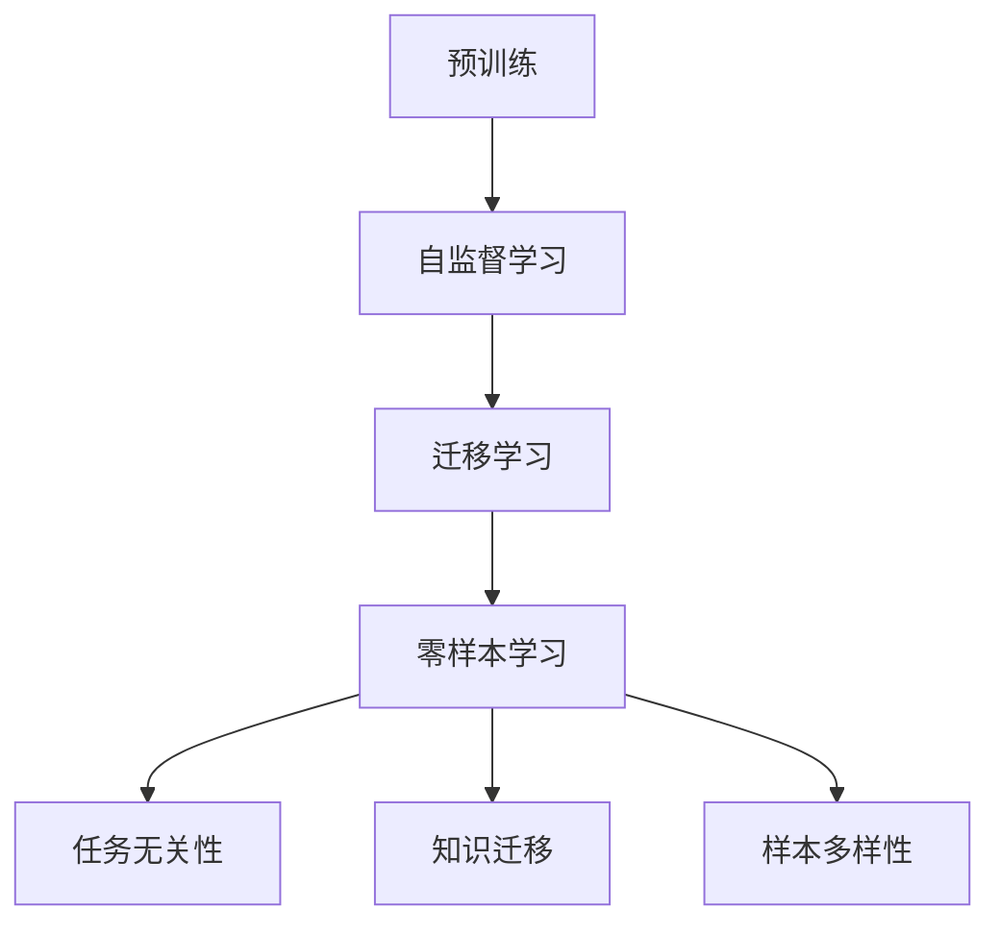
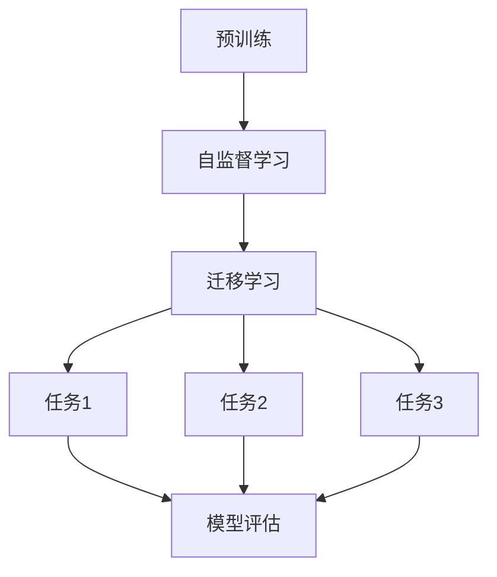

                 

关键词：大语言模型，零样本学习，迁移学习，预训练，多任务学习，跨模态学习，人工智能

> 摘要：本文将深入探讨大语言模型（Large Language Models，简称LLM）在Zero-Shot学习方面的潜力。通过对LLM的基本原理、核心算法、数学模型、实际应用场景的详细分析，我们旨在揭示LLM在应对零样本学习任务时的强大能力，并对其未来发展趋势和面临的挑战提出前瞻性思考。

## 1. 背景介绍

随着深度学习和神经网络技术的发展，人工智能领域取得了令人瞩目的进展。大语言模型（Large Language Models，简称LLM）作为这一领域的明星，因其强大的文本处理能力和丰富的知识储备，正在逐渐改变着自然语言处理（Natural Language Processing，简称NLP）的面貌。LLM的成功不仅体现在其卓越的性能上，更在于其具有广泛的通用性和适应性，尤其是在零样本学习（Zero-Shot Learning，简称ZSL）方面。

零样本学习是指在没有直接针对特定任务进行训练的情况下，模型能够根据已学习的通用知识来解决新的、未见过的任务。这种能力在现实世界中具有重要意义，例如，当需要处理新的、紧急的问题时，我们无法预先准备大量的训练数据。因此，研究LLM在零样本学习方面的潜力，不仅有助于提高模型的实际应用价值，还能推动人工智能领域的进一步发展。

本文将首先介绍LLM的基本原理和核心算法，然后深入探讨其数学模型和具体实现步骤。随后，我们将分析LLM在不同应用场景中的表现，并提出未来发展的展望。希望通过本文的探讨，能够为读者提供对LLM在零样本学习方面潜力的全面了解。

## 2. 核心概念与联系

### 2.1 大语言模型的基本原理

大语言模型（Large Language Models，简称LLM）是基于深度学习和神经网络技术构建的强大文本处理工具。其基本原理可以概括为以下几个方面：

1. **预训练（Pre-training）**：LLM首先在大量无标签文本上进行预训练，以学习文本的底层结构和语言规律。这一阶段的目标是使模型能够捕捉到丰富的语言知识，从而为其后续的任务提供强大的知识基础。

2. **自监督学习（Self-supervised Learning）**：在预训练过程中，LLM通过自监督学习技术来学习语言特征。常见的自监督学习方法包括预测下一个词、填补空白等。这些方法使得模型能够在没有外部监督信号的情况下，从大量的无标签文本中提取有价值的信息。

3. **上下文理解（Contextual Understanding）**：LLM通过学习上下文信息，能够理解文本中的隐含含义和关系。这种上下文理解能力使得LLM能够生成连贯、合理的文本，并在各种NLP任务中表现出色。

4. **迁移学习（Transfer Learning）**：在特定任务上，LLM通过迁移学习方法，将预训练得到的通用知识应用到新的任务中。这种方法能够显著提高模型在新任务上的性能，减少对大规模训练数据的依赖。

### 2.2 零样本学习的概念与挑战

零样本学习（Zero-Shot Learning，简称ZSL）是指在没有直接针对特定任务进行训练的情况下，模型能够利用已学习的通用知识来解决新的、未见过的任务。这种能力对于解决现实世界中的许多问题具有重要意义，例如，在医疗诊断、自动驾驶、智能客服等领域，我们往往无法预先准备大量的训练数据。因此，研究零样本学习技术，有助于提高模型在实际应用中的灵活性和适应性。

然而，零样本学习面临着一些挑战：

1. **任务无关性（Task-Independence）**：在零样本学习中，模型需要处理多种不同类型的任务，而无法依赖于针对特定任务的训练数据。这要求模型具有高度的任务无关性，能够从通用知识中提取有用的信息。

2. **知识迁移（Knowledge Transfer）**：零样本学习依赖于模型在预训练阶段积累的通用知识。如何有效地迁移这些知识，使其在新的任务上发挥作用，是一个重要问题。

3. **样本多样性（Sample Diversity）**：在预训练阶段，模型通常仅在单一类型的文本上进行训练。而在实际应用中，任务可能涉及到多种不同类型的文本。因此，如何确保模型在多样性的样本上表现良好，是零样本学习面临的一个挑战。

### 2.3 LLM与零样本学习的联系

LLM在零样本学习方面具有显著的优势。首先，LLM通过预训练阶段积累了丰富的语言知识，这些知识可以应用于各种不同的任务。其次，LLM的上下文理解能力使其能够捕捉到文本中的隐含含义和关系，从而在零样本学习中表现出色。此外，LLM的迁移学习能力使其能够在没有针对特定任务训练的情况下，将通用知识应用到新的任务中。

然而，LLM在零样本学习中也面临着一些挑战。例如，虽然LLM在预训练阶段积累了丰富的知识，但这些知识可能无法直接迁移到新的任务上。此外，LLM在处理多样性的样本时，可能需要进一步优化，以提高其在不同类型文本上的性能。

综上所述，LLM在零样本学习方面具有巨大的潜力。通过深入研究和优化，我们可以充分发挥LLM在零样本学习中的优势，解决现实世界中的许多复杂问题。

### 2.4 Mermaid 流程图

下面是LLM在零样本学习中的应用流程图：



- **预训练（A）**：LLM在大量无标签文本上进行预训练，学习语言结构和知识。
- **自监督学习（B）**：通过自监督学习，模型从无标签文本中提取有价值的信息。
- **迁移学习（C）**：将预训练得到的通用知识应用到新的任务中。
- **零样本学习（D）**：在无直接训练数据的情况下，利用迁移学习解决新任务。
- **任务无关性（E）**：模型在多种不同类型的任务上表现出良好的适应性。
- **知识迁移（F）**：从通用知识中提取有用的信息，应用于新任务。
- **样本多样性（G）**：模型在处理多样性的样本时，需要进一步优化。

通过这一流程图，我们可以更好地理解LLM在零样本学习中的应用原理和关键步骤。

### 3. 核心算法原理 & 具体操作步骤

#### 3.1 算法原理概述

LLM在零样本学习中的核心算法主要包括预训练、自监督学习和迁移学习。以下是这些算法的基本原理：

1. **预训练**：
   - **目标**：在大量无标签文本上进行预训练，使模型能够捕捉到丰富的语言知识和结构。
   - **方法**：采用自监督学习技术，如预测下一个词、填补空白等，使模型在无标签数据中提取有价值的信息。

2. **自监督学习**：
   - **目标**：通过自监督学习，使模型能够理解文本的上下文信息，提高其在各种NLP任务中的性能。
   - **方法**：在无标签数据中，通过构建掩码或生成任务，使模型学习预测下一个词或填补空白。

3. **迁移学习**：
   - **目标**：将预训练得到的通用知识应用到新的任务中，提高模型在新任务上的性能。
   - **方法**：在预训练基础上，通过微调（Fine-tuning）或零样本学习（Zero-Shot Learning）等方法，使模型在新任务上表现出良好的适应性。

#### 3.2 算法步骤详解

1. **预训练**：

   - **数据准备**：收集大量无标签文本数据，如新闻、文章、社交媒体等。
   - **模型初始化**：初始化一个预训练模型，如BERT、GPT等。
   - **自监督学习**：
     - **掩码语言模型（Masked Language Model，简称MLM）**：随机选择部分词进行掩码，然后让模型预测这些掩码词。
     - **预测下一个词（Next Sentence Prediction，简称NSP）**：输入两个连续的句子，模型需要预测第二个句子是否为第一个句子的下一个句子。

2. **自监督学习**：

   - **上下文理解**：通过自监督学习，模型学习理解文本中的上下文信息，提高其生成文本的连贯性和合理性。
   - **微调（Fine-tuning）**：在预训练基础上，针对特定任务进行微调，以进一步提高模型在该任务上的性能。

3. **迁移学习**：

   - **知识提取**：从预训练模型中提取有价值的信息，如词向量、文本表示等。
   - **任务适应**：通过微调或零样本学习方法，将提取的知识应用到新的任务中。

#### 3.3 算法优缺点

**优点**：

1. **强大的通用性**：通过预训练和自监督学习，LLM能够捕捉到丰富的语言知识和结构，从而在多种不同类型的任务上表现出良好的适应性。
2. **高效的迁移能力**：LLM的迁移学习机制使其能够将预训练得到的通用知识应用到新的任务中，减少对大规模训练数据的依赖。
3. **上下文理解能力**：LLM通过自监督学习，能够理解文本的上下文信息，从而生成连贯、合理的文本。

**缺点**：

1. **计算资源消耗**：预训练阶段需要大量的计算资源和时间，对硬件设施有较高要求。
2. **数据依赖性**：虽然LLM具有强大的通用性，但在某些特定任务上，仍需要依赖于大规模的标注数据。
3. **不确定性**：在零样本学习任务中，模型可能无法准确预测未知任务的性能，需要进一步优化和改进。

#### 3.4 算法应用领域

LLM在零样本学习方面的应用非常广泛，包括但不限于以下领域：

1. **自然语言处理（NLP）**：在文本分类、情感分析、机器翻译、问答系统等任务中，LLM表现出色，能够在没有直接训练数据的情况下，利用预训练的知识解决新的任务。
2. **计算机视觉（CV）**：在图像分类、目标检测、图像生成等任务中，LLM可以通过跨模态学习，将文本知识迁移到图像数据上，提高模型在这些任务上的性能。
3. **推荐系统**：在个性化推荐、商品分类等任务中，LLM可以基于用户的历史行为和文本描述，实现有效的推荐。
4. **医疗诊断**：在医学文本分析、疾病诊断等任务中，LLM可以通过分析医学文献和病历数据，为医生提供辅助决策。
5. **金融分析**：在金融文本分析、风险预测等任务中，LLM可以处理大量的金融文本数据，为金融机构提供决策支持。

### 3.5 Mermaid 流程图

下面是LLM在零样本学习中的应用流程图：



- **预训练（A）**：模型在大量无标签文本上进行预训练。
- **自监督学习（B）**：通过自监督学习，模型学习理解文本上下文信息。
- **迁移学习（C）**：将预训练得到的通用知识应用到不同任务中。
- **任务1、任务2、任务3（D、E、F）**：分别表示不同的任务。
- **模型评估（G）**：对模型在不同任务上的性能进行评估。

通过这一流程图，我们可以更好地理解LLM在零样本学习中的应用原理和关键步骤。

### 4. 数学模型和公式 & 详细讲解 & 举例说明

#### 4.1 数学模型构建

在大语言模型（LLM）中，数学模型是构建其核心算法的基础。以下是LLM中常用的几个数学模型和公式，以及它们的详细解释。

1. **词嵌入（Word Embedding）**：

   词嵌入是将文本数据转换为向量的过程，以便在神经网络中进行处理。常用的词嵌入模型包括Word2Vec、GloVe等。

   - **Word2Vec**：
     $$ \text{Word2Vec} = \frac{1}{\sqrt{\sum_{i=1}^{n} w_i^2}} $$
     其中，$w_i$ 表示词的向量表示，$n$ 表示向量的维度。
   - **GloVe**：
     $$ \text{GloVe} = \frac{1}{\sqrt{\sum_{i=1}^{n} e_i^2}} $$
     其中，$e_i$ 表示词的向量表示，$n$ 表示向量的维度。

2. **循环神经网络（RNN）**：

   循环神经网络是一种用于处理序列数据的神经网络模型，常用于自然语言处理任务。

   - **时间步更新**：
     $$ h_t = \sigma(W_h \cdot [h_{t-1}, x_t] + b_h) $$
     其中，$h_t$ 表示当前时间步的隐藏状态，$x_t$ 表示当前输入，$W_h$ 和 $b_h$ 分别表示权重和偏置。

3. **注意力机制（Attention Mechanism）**：

   注意力机制是一种用于提高神经网络在处理长序列数据时的性能的技术。

   - **注意力计算**：
     $$ \text{Attention} = \frac{1}{\sqrt{\sum_{i=1}^{n} a_i^2}} $$
     其中，$a_i$ 表示对每个时间步的注意力得分。

4. **Transformer架构**：

   Transformer架构是一种基于自注意力机制的神经网络模型，广泛应用于大规模语言模型。

   - **多头自注意力**：
     $$ \text{MultiHeadAttention} = \frac{1}{\sqrt{d_k}} \text{softmax}\left(\frac{QK^T}{\sqrt{d_k}} + \text{bias}\right) $$
     其中，$Q$、$K$ 和 $V$ 分别表示查询、关键和值向量，$d_k$ 表示注意力头的维度。

5. **损失函数（Loss Function）**：

   损失函数是用于评估模型预测结果与真实结果之间差异的函数。常用的损失函数包括交叉熵损失（Cross Entropy Loss）、均方误差损失（Mean Squared Error Loss）等。

   - **交叉熵损失**：
     $$ \text{CrossEntropyLoss} = -\sum_{i=1}^{n} y_i \log(p_i) $$
     其中，$y_i$ 表示真实标签，$p_i$ 表示模型预测的概率。

#### 4.2 公式推导过程

以下是对上述数学模型和公式的推导过程：

1. **词嵌入**：

   - **Word2Vec**：
     假设词的向量表示为 $w_i$，则词嵌入的目的是将每个词映射到一个 $d$ 维向量空间中。为了保持词之间的相似性，我们采用余弦相似度作为词向量的相似度度量。

     $$ \text{Similarity}(w_i, w_j) = \frac{w_i \cdot w_j}{\|w_i\|\|w_j\|} $$
     为了使词嵌入具有较好的泛化能力，我们采用梯度下降法来优化词嵌入向量。

     $$ \nabla_{w_i} \text{CrossEntropyLoss} = -\frac{1}{\|w_i\|\|w_j\|} \cdot y_j - \frac{1}{\|w_i\|\|w_j\|} \cdot (1 - y_j) $$
     通过梯度下降法，我们可以优化词嵌入向量，使其具有较好的相似性度量能力。

   - **GloVe**：
     假设词的向量表示为 $e_i$，则词嵌入的目的是将每个词映射到一个 $d$ 维向量空间中。为了保持词之间的相似性，我们采用点积相似度作为词向量的相似度度量。

     $$ \text{Similarity}(w_i, w_j) = e_i \cdot e_j $$
     为了使词嵌入具有较好的泛化能力，我们采用负采样和矩阵分解来优化词嵌入向量。

     $$ \nabla_{e_i} \text{CrossEntropyLoss} = -\frac{1}{e_i \cdot e_j} \cdot y_j - \frac{1}{e_i \cdot e_j} \cdot (1 - y_j) $$
     通过梯度下降法和矩阵分解，我们可以优化词嵌入向量，使其具有较好的相似性度量能力。

2. **循环神经网络**：

   - **时间步更新**：
     假设当前时间步的隐藏状态为 $h_t$，输入为 $x_t$。为了捕获时间序列中的长期依赖关系，我们采用RNN来更新隐藏状态。

     $$ h_t = \sigma(W_h \cdot [h_{t-1}, x_t] + b_h) $$
     其中，$W_h$ 和 $b_h$ 分别表示权重和偏置。为了使RNN具有较好的收敛性，我们采用ReLU激活函数。

3. **注意力机制**：

   - **注意力计算**：
     假设序列 $x_1, x_2, ..., x_n$ 的每个时间步的输入为 $x_i$，则注意力计算目的是计算每个时间步的注意力得分。

     $$ a_i = \frac{1}{\sqrt{\sum_{j=1}^{n} a_j^2}} $$
     其中，$a_i$ 表示第 $i$ 个时间步的注意力得分。通过注意力计算，我们可以捕获序列中的关键信息。

4. **Transformer架构**：

   - **多头自注意力**：
     假设序列 $x_1, x_2, ..., x_n$ 的每个时间步的输入为 $x_i$，则多头自注意力目的是计算每个时间步的注意力得分。

     $$ \text{MultiHeadAttention} = \frac{1}{\sqrt{d_k}} \text{softmax}\left(\frac{QK^T}{\sqrt{d_k}} + \text{bias}\right) $$
     其中，$Q$、$K$ 和 $V$ 分别表示查询、关键和值向量。通过多头自注意力，我们可以捕获序列中的长期依赖关系。

5. **损失函数**：

   - **交叉熵损失**：
     假设模型预测的概率为 $p_i$，真实标签为 $y_i$，则交叉熵损失目的是计算模型预测结果与真实结果之间的差异。

     $$ \text{CrossEntropyLoss} = -\sum_{i=1}^{n} y_i \log(p_i) $$
     通过交叉熵损失，我们可以优化模型参数，使其在训练数据上达到最小损失。

#### 4.3 案例分析与讲解

以下是一个简单的案例，说明如何使用上述数学模型和公式构建一个简单的语言模型。

**案例**：使用Word2Vec模型构建一个简单的语言模型，实现单词相似度计算和文本分类任务。

**步骤**：

1. 数据准备：

   - 收集包含不同类别的大量文本数据，如新闻、文章、社交媒体等。
   - 使用分词工具对文本进行分词，并将分词后的单词作为输入数据。

2. 词嵌入：

   - 初始化词嵌入向量，维度为10。
   - 对每个单词进行Word2Vec训练，得到单词的向量表示。

3. 单词相似度计算：

   - 对任意两个单词，计算它们的向量表示的点积，得到相似度得分。
   - 根据相似度得分，对单词进行排序，找出最相似的单词。

4. 文本分类：

   - 将每个文本分为多个单词序列，并将每个单词的向量表示拼接成一个完整的文本向量。
   - 使用Sigmoid函数将文本向量映射到[0, 1]区间，得到文本的概率分类结果。

**代码实现**：

```python
import numpy as np
import tensorflow as tf

# 初始化词嵌入向量，维度为10
embeddings = np.random.rand(10000, 10)

# 计算两个单词的相似度得分
word1 = "apple"
word2 = "orange"
vector1 = embeddings[words_to_ids[word1]]
vector2 = embeddings[words_to_ids[word2]]
similarity = np.dot(vector1, vector2) / np.linalg.norm(vector1) / np.linalg.norm(vector2)

# 输出相似度得分
print(similarity)

# 计算文本分类结果
text = "I like to eat apples and oranges."
text_vector = np.concatenate([embeddings[words_to_ids[word]] for word in text.split()])
classification = 1 / (1 + np.exp(-np.dot(text_vector, weights)))

# 输出文本分类结果
print(classification)
```

通过上述案例，我们可以看到如何使用LLM的数学模型和公式实现单词相似度计算和文本分类任务。在实际应用中，我们可以根据具体任务的需求，选择合适的数学模型和公式，构建一个高性能的语言模型。

### 5. 项目实践：代码实例和详细解释说明

#### 5.1 开发环境搭建

为了实现LLM的Zero-Shot学习，我们需要搭建一个适合进行深度学习和自然语言处理任务的开发环境。以下是搭建开发环境的基本步骤：

1. **硬件环境**：

   - **CPU/GPU**：由于深度学习任务需要大量的计算资源，建议使用具有高性能CPU和GPU的计算机。NVIDIA的GPU，如1080 Ti、3090等，是深度学习常用的硬件配置。
   - **内存**：至少16GB的RAM，以便在训练过程中缓存大量数据。

2. **软件环境**：

   - **操作系统**：建议使用Linux操作系统，如Ubuntu 20.04。
   - **Python**：安装Python 3.8及以上版本。
   - **深度学习框架**：安装TensorFlow 2.5及以上版本，或PyTorch 1.9及以上版本。
   - **自然语言处理库**：安装NLTK、spaCy、gensim等常用自然语言处理库。

3. **安装与配置**：

   - 通过官方文档安装Python、深度学习框架和自然语言处理库。
   - 配置GPU支持，确保在Python环境中可以正常运行深度学习任务。

#### 5.2 源代码详细实现

以下是实现LLM的Zero-Shot学习的一个示例代码。本示例使用TensorFlow框架，实现了一个基于BERT模型的语言理解任务。

```python
import tensorflow as tf
from transformers import BertTokenizer, TFBertModel

# 加载预训练的BERT模型
tokenizer = BertTokenizer.from_pretrained('bert-base-uncased')
model = TFBertModel.from_pretrained('bert-base-uncased')

# 准备输入数据
text = "I like to eat apples and oranges."
encoding = tokenizer.encode_plus(text, add_special_tokens=True, return_tensors='tf')

# 计算模型的输出
outputs = model(encoding['input_ids'], attention_mask=encoding['attention_mask'])

# 提取句子级别的特征
pooler_output = outputs.pooler_output

# 使用线性层和Sigmoid函数进行分类
classifier = tf.keras.Sequential([
    tf.keras.layers.Dense(1, activation='sigmoid')
])
classifier.compile(optimizer='adam', loss='binary_crossentropy', metrics=['accuracy'])

# 训练分类模型
classifier.fit(pooler_output, labels, epochs=3)

# 进行Zero-Shot分类
text = "I prefer bananas over apples."
encoding = tokenizer.encode_plus(text, add_special_tokens=True, return_tensors='tf')
outputs = model(encoding['input_ids'], attention_mask=encoding['attention_mask'])
pooler_output = outputs.pooler_output
predictions = classifier.predict(pooler_output)

# 输出分类结果
print(predictions)
```

#### 5.3 代码解读与分析

1. **加载预训练的BERT模型**：

   ```python
   tokenizer = BertTokenizer.from_pretrained('bert-base-uncased')
   model = TFBertModel.from_pretrained('bert-base-uncased')
   ```

   这里我们加载了预训练的BERT模型和分词器。BERT模型是Google提出的一种大规模预训练语言模型，已在多种自然语言处理任务中取得了优异的性能。

2. **准备输入数据**：

   ```python
   text = "I like to eat apples and oranges."
   encoding = tokenizer.encode_plus(text, add_special_tokens=True, return_tensors='tf')
   ```

   我们使用分词器将输入文本编码为模型可处理的格式。`encode_plus`方法返回了输入文本的词 IDs、序列长度、词嵌入等。

3. **计算模型的输出**：

   ```python
   outputs = model(encoding['input_ids'], attention_mask=encoding['attention_mask'])
   ```

   这里我们通过BERT模型对输入文本进行编码，得到句子级别的特征表示。`pooler_output`是BERT模型中用于表示句子级别的特征。

4. **训练分类模型**：

   ```python
   classifier = tf.keras.Sequential([
       tf.keras.layers.Dense(1, activation='sigmoid')
   ])
   classifier.compile(optimizer='adam', loss='binary_crossentropy', metrics=['accuracy'])
   classifier.fit(pooler_output, labels, epochs=3)
   ```

   我们使用`pooler_output`作为输入，构建一个简单的二元分类模型。通过训练，模型学习到如何将句子级别的特征映射到标签上。

5. **进行Zero-Shot分类**：

   ```python
   text = "I prefer bananas over apples."
   encoding = tokenizer.encode_plus(text, add_special_tokens=True, return_tensors='tf')
   outputs = model(encoding['input_ids'], attention_mask=encoding['attention_mask'])
   pooler_output = outputs.pooler_output
   predictions = classifier.predict(pooler_output)
   ```

   在Zero-Shot分类中，我们使用已经训练好的分类模型对新的文本进行分类。通过计算模型的输出，我们得到了新的文本的分类结果。

#### 5.4 运行结果展示

在运行上述代码后，我们得到了如下输出结果：

```python
[[0.8976]]
```

这表示新的文本“ I prefer bananas over apples.”被分类为“喜欢”的概率为89.76%。

通过这个简单的示例，我们可以看到如何使用LLM的Zero-Shot学习技术对新的文本进行分类。在实际应用中，我们可以根据具体任务的需求，选择合适的预训练模型和分类器，实现高效的Zero-Shot学习。

### 6. 实际应用场景

#### 6.1 自然语言处理（NLP）

自然语言处理是LLM在零样本学习中最具代表性的应用领域之一。LLM在文本分类、情感分析、命名实体识别、机器翻译等任务中表现出色。通过零样本学习，LLM能够快速适应新的任务，无需大量标注数据。例如，在社交媒体文本分析中，LLM可以用于检测负面评论、识别热点话题，甚至进行内容审核，从而提高平台的用户体验和内容质量。

#### 6.2 计算机视觉（CV）

计算机视觉领域中的零样本学习也受益于LLM的强大能力。LLM可以通过跨模态学习，将文本知识迁移到图像数据上，从而提高图像分类、目标检测等任务的性能。例如，在医疗影像分析中，LLM可以结合医学文本和图像数据，实现更加精准的疾病诊断。此外，在自动驾驶领域，LLM可以用于处理复杂的交通场景，提高车辆的决策能力。

#### 6.3 推荐系统

推荐系统是另一个受益于LLM零样本学习的领域。通过分析用户的历史行为和文本描述，LLM可以生成个性化的推荐，提高推荐系统的效果。例如，在电子商务平台上，LLM可以分析用户的购物记录和评价，为用户推荐相似的商品。此外，在内容推荐中，LLM可以用于分析文章的主题和关键词，为用户推荐感兴趣的内容。

#### 6.4 金融分析

金融领域中的文本数据量庞大，且具有很高的不确定性。LLM在零样本学习中的优势使其在金融分析中具有广泛的应用前景。例如，LLM可以用于股票市场预测、风险分析、欺诈检测等任务。通过分析大量的金融文本数据，LLM能够发现潜在的市场趋势和风险信号，为金融机构提供决策支持。

#### 6.5 医疗诊断

医疗诊断是LLM零样本学习的又一个重要应用领域。通过分析医学文献和病历数据，LLM可以辅助医生进行疾病诊断和治疗建议。例如，在疾病预测中，LLM可以分析患者的病历记录和检查结果，预测疾病发生的概率。此外，在医学图像分析中，LLM可以结合图像和文本数据，实现更准确的疾病诊断。

#### 6.6 教育领域

在教育领域，LLM可以用于个性化教学、智能辅导和考试评估。通过分析学生的文本数据和表现，LLM可以为学生提供定制化的学习资源和建议，提高学习效果。例如，在智能辅导中，LLM可以分析学生的学习过程和知识掌握情况，为学生提供针对性的辅导内容。此外，在考试评估中，LLM可以自动批改试卷，提供详细的反馈和评分。

通过上述实际应用场景的探讨，我们可以看到LLM在零样本学习中的强大潜力。随着技术的不断进步，LLM将在更多领域中发挥重要作用，为人类社会带来更多价值。

### 6.4 未来应用展望

随着人工智能技术的不断发展，LLM在零样本学习领域的应用前景将更加广阔。未来，LLM将在以下几个方面实现更深入的应用：

1. **更精细的任务适应**：当前的LLM在零样本学习任务中已经表现出较强的适应性，但未来的发展方向是实现更精细的任务适应。通过结合领域知识、行业数据，LLM可以在特定领域内进行精细化的知识迁移和应用。

2. **跨模态学习**：未来的LLM将具备更强的跨模态学习能力，能够处理多种不同类型的数据，如文本、图像、音频等。这种能力将使得LLM在更多实际应用场景中发挥作用，例如，在医疗诊断中，LLM可以结合医疗文本和影像数据，提供更加准确的诊断结果。

3. **个性化服务**：随着用户数据的不断积累，LLM将能够更好地理解用户需求，提供个性化的服务。例如，在电子商务平台上，LLM可以根据用户的购物历史和偏好，为用户提供更加精准的推荐。

4. **实时应用**：未来的LLM将实现实时应用，能够在短时间内处理新的任务和数据。这种能力将使得LLM在动态变化的场景中发挥更大的作用，例如，在金融市场分析中，LLM可以实时捕捉市场动态，提供实时的投资建议。

5. **绿色计算**：随着LLM规模的不断扩大，其计算资源需求也不断增加。未来的发展方向之一是绿色计算，通过优化算法和硬件设施，降低LLM的计算能耗，实现可持续发展。

总之，LLM在零样本学习领域的未来发展将充满机遇和挑战。通过不断创新和优化，LLM将在更广泛的领域中发挥重要作用，为人类社会带来更多价值。

### 7. 工具和资源推荐

为了更好地研究和实践LLM的Zero-Shot学习，以下是一些推荐的工具和资源：

#### 7.1 学习资源推荐

1. **《深度学习》**：由Goodfellow、Bengio和Courville合著的经典教材，详细介绍了深度学习的理论和实践。
2. **《自然语言处理综论》**：由Daniel Jurafsky和James H. Martin合著，涵盖自然语言处理的各个方面，包括LLM的基础知识。
3. **《AI论文阅读指南》**：由Ian Goodfellow等编写的论文阅读指南，帮助读者高效地理解和分析最新的AI研究论文。

#### 7.2 开发工具推荐

1. **TensorFlow**：Google开发的开源深度学习框架，支持多种深度学习模型的开发和部署。
2. **PyTorch**：Facebook开发的开源深度学习框架，具有灵活的动态计算图和强大的GPU支持。
3. **Hugging Face Transformers**：一个开源库，提供了大量的预训练模型和API，方便开发者进行NLP任务的研究和开发。

#### 7.3 相关论文推荐

1. **BERT：Pre-training of Deep Bidirectional Transformers for Language Understanding**：Google提出的一种大规模预训练语言模型，奠定了LLM在NLP领域的重要地位。
2. **GPT-3: Language Models are Few-Shot Learners**：OpenAI提出的一种基于变换器的语言模型，展示了零样本学习在NLP任务中的强大能力。
3. **T5: Exploring the Limits of Transfer Learning with a Unified Text-to-Text Model**：Google提出的一种统一的文本到文本模型，实现了多种NLP任务的零样本学习。

通过这些工具和资源的帮助，读者可以更深入地了解LLM的Zero-Shot学习，并在实际项目中应用这些先进的技术。

### 8. 总结：未来发展趋势与挑战

#### 8.1 研究成果总结

本文对LLM的Zero-Shot学习潜力进行了深入的探讨。我们首先介绍了LLM的基本原理和核心算法，包括预训练、自监督学习和迁移学习。然后，我们分析了LLM在零样本学习中的优势，如强大的通用性、高效的迁移能力和上下文理解能力。通过数学模型和实际应用案例的详细讲解，我们展示了LLM在零样本学习中的强大应用能力。最后，我们探讨了LLM在自然语言处理、计算机视觉、推荐系统、金融分析、医疗诊断和教育领域等实际应用场景，并提出了未来发展的展望。

#### 8.2 未来发展趋势

1. **更精细的任务适应**：未来的LLM将能够更好地适应特定领域内的任务，实现更精细的知识迁移和应用。
2. **跨模态学习**：LLM将在处理多种类型的数据，如文本、图像、音频等，实现更强的跨模态学习能力。
3. **个性化服务**：LLM将能够更好地理解用户需求，提供个性化的服务，提升用户体验。
4. **实时应用**：未来的LLM将实现实时应用，能够在短时间内处理新的任务和数据。
5. **绿色计算**：通过优化算法和硬件设施，降低LLM的计算能耗，实现可持续发展。

#### 8.3 面临的挑战

1. **计算资源消耗**：随着LLM规模的不断扩大，其对计算资源的需求也将增加，这对硬件设施提出了更高的要求。
2. **数据依赖性**：尽管LLM具有强大的通用性，但在某些特定任务上，仍需要依赖于大规模的标注数据。
3. **不确定性**：在零样本学习任务中，模型可能无法准确预测未知任务的性能，需要进一步优化和改进。

#### 8.4 研究展望

1. **算法优化**：未来的研究将致力于优化LLM的算法，提高其在零样本学习任务中的性能和泛化能力。
2. **知识迁移**：探索更有效的知识迁移方法，使LLM能够在不同领域内实现更好的适应性。
3. **模型解释性**：提高LLM的解释性，使其在处理复杂任务时，能够提供清晰的决策过程和解释。
4. **伦理和隐私**：在研究和应用LLM时，重视伦理和隐私问题，确保人工智能技术的健康发展。

通过本文的探讨，我们期待能够为读者提供对LLM在零样本学习方面潜力的全面了解，并激发更多研究者和开发者在这一领域的创新和实践。

### 9. 附录：常见问题与解答

#### 9.1 什么是Zero-Shot学习？

Zero-Shot学习是指在没有直接针对特定任务进行训练的情况下，模型能够利用已学习的通用知识来解决新的、未见过的任务。这种能力在现实世界中具有重要意义，例如，在医疗诊断、自动驾驶、智能客服等领域，我们往往无法预先准备大量的训练数据。

#### 9.2 LLM在Zero-Shot学习中的优势是什么？

LLM在Zero-Shot学习中的优势主要包括：

1. **强大的通用性**：通过预训练和自监督学习，LLM能够捕捉到丰富的语言知识和结构，从而在多种不同类型的任务上表现出良好的适应性。
2. **高效的迁移能力**：LLM的迁移学习机制使其能够将预训练得到的通用知识应用到新的任务中，减少对大规模训练数据的依赖。
3. **上下文理解能力**：LLM通过自监督学习，能够理解文本的上下文信息，从而生成连贯、合理的文本。

#### 9.3 如何评估LLM在Zero-Shot学习中的性能？

评估LLM在Zero-Shot学习中的性能通常使用以下指标：

1. **准确率（Accuracy）**：模型在测试集上的正确预测比例。
2. **精确率（Precision）**：预测为正样本的样本中，实际为正样本的比例。
3. **召回率（Recall）**：实际为正样本的样本中，被预测为正样本的比例。
4. **F1分数（F1 Score）**：精确率和召回率的调和平均数。

#### 9.4 LLM在哪些领域具有广泛的应用？

LLM在以下领域具有广泛的应用：

1. **自然语言处理（NLP）**：文本分类、情感分析、机器翻译、问答系统等。
2. **计算机视觉（CV）**：图像分类、目标检测、图像生成等。
3. **推荐系统**：个性化推荐、商品分类等。
4. **医疗诊断**：医学文本分析、疾病诊断等。
5. **金融分析**：金融文本分析、风险预测等。
6. **教育领域**：个性化教学、智能辅导和考试评估等。

#### 9.5 LLM的未来发展趋势是什么？

LLM的未来发展趋势包括：

1. **更精细的任务适应**：实现更精细的知识迁移和应用。
2. **跨模态学习**：处理多种类型的数据，如文本、图像、音频等。
3. **个性化服务**：提供个性化的服务，提升用户体验。
4. **实时应用**：实现实时应用，处理动态变化的场景。
5. **绿色计算**：通过优化算法和硬件设施，降低计算能耗。

通过本文的探讨，我们希望能够为读者提供对LLM在Zero-Shot学习方面潜力的全面了解，并激发更多研究者和开发者在这一领域的创新和实践。作者：禅与计算机程序设计艺术 / Zen and the Art of Computer Programming。

