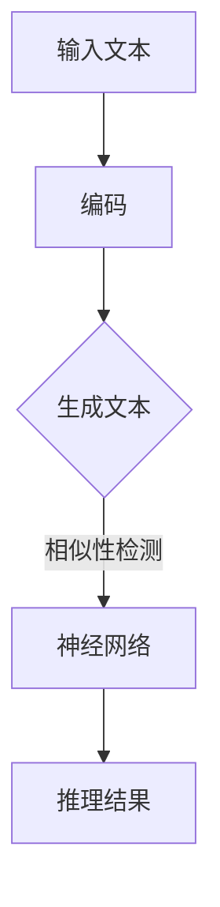

                 

关键词：语言模型，类比推理，深度学习，认知计算，人工智能

> 摘要：本文将探讨大型语言模型(LLM)在类比推理方面的能力与局限，深入分析类比推理的原理及其在LLM中的实现。通过结合实际案例，本文旨在揭示LLM在类比推理中的应用潜力及其对人工智能领域的影响。

## 1. 背景介绍

近年来，深度学习在自然语言处理（NLP）领域取得了显著的进展。大型语言模型（LLM），如GPT-3，BERT等，通过训练大规模语料库，能够生成连贯且具有一定逻辑性的文本。然而，尽管LLM在生成文本和回答问题方面表现出色，其在类比推理方面的能力却相对较弱。类比推理是人类智能的核心特征之一，但传统的深度学习模型难以充分模拟这种能力。

类比推理涉及从一个已知情况（源情况）推导出未知情况（目标情况）的过程。例如，如果狗是宠物，那么猫也是宠物。人类能够轻松地进行这种推理，但对于人工智能来说，这却是一个具有挑战性的任务。本文旨在探讨LLM在类比推理方面的能力与局限，并尝试提出改进的方法。

## 2. 核心概念与联系

### 2.1 类比推理原理

类比推理是基于两个或多个对象之间的相似性进行的推理。其核心思想是，如果一个对象具有某种特征，并且另一个对象与该对象具有相似性，那么这个对象也可能具有相同的特征。

类比推理的过程可以分为三个阶段：

1. **识别相似性**：找出源情况和目标情况之间的相似性。
2. **建立映射**：将源情况的特征映射到目标情况。
3. **推理**：根据映射关系推导出目标情况的结果。

在数学上，类比推理可以表示为：

\[ \text{目标情况} = f(\text{源情况}, \text{相似性}) \]

其中，\( f \) 是一个函数，用于处理相似性并将其映射到目标情况。

### 2.2 LLM与类比推理

LLM是一种基于神经网络的语言模型，能够生成与输入文本相似或相关的输出文本。在类比推理中，LLM可以用来模拟人类的推理过程。

例如，给定一个句子“狗是宠物”，LLM可以生成“猫是宠物”作为类比推理的结果。这个过程涉及到以下几个关键步骤：

1. **编码**：将输入文本编码为神经网络可以处理的向量。
2. **生成**：利用神经网络生成与输入文本相似或相关的文本。
3. **推理**：根据生成的文本进行推理，得出类比推理的结果。

### 2.3 Mermaid流程图

下面是一个用于描述LLM在类比推理中的流程的Mermaid流程图：



### 2.4 Mermaid流程图（续）

在上面的流程图中，我们包括了以下关键步骤：

- **编码**：将输入文本编码为神经网络可以处理的向量。
- **生成文本**：利用神经网络生成与输入文本相似或相关的文本。
- **相似性检测**：检测生成的文本与输入文本之间的相似性。
- **推理结果**：根据相似性检测结果，得出类比推理的结果。

## 3. 核心算法原理 & 具体操作步骤

### 3.1 算法原理概述

LLM在类比推理中的核心算法原理是基于神经网络的学习和生成能力。具体来说，LLM通过以下步骤实现类比推理：

1. **编码**：将输入文本编码为神经网络可以处理的向量。
2. **生成**：利用神经网络生成与输入文本相似或相关的文本。
3. **推理**：根据生成的文本进行推理，得出类比推理的结果。

### 3.2 算法步骤详解

#### 3.2.1 编码

编码是将输入文本转换为神经网络可以处理的向量。这一过程通常涉及到以下步骤：

1. **分词**：将输入文本分解为单词或子词。
2. **嵌入**：将每个单词或子词映射为一个固定长度的向量。
3. **序列编码**：将每个单词或子词的向量按顺序拼接成一个序列向量。

#### 3.2.2 生成

生成是利用神经网络生成与输入文本相似或相关的文本。这一过程通常涉及到以下步骤：

1. **初始化**：随机初始化神经网络。
2. **预测**：通过神经网络预测下一个单词或子词。
3. **更新**：根据预测结果更新神经网络。

#### 3.2.3 推理

推理是根据生成的文本进行推理，得出类比推理的结果。这一过程通常涉及到以下步骤：

1. **提取特征**：从生成的文本中提取与输入文本相关的特征。
2. **计算相似性**：计算输入文本和生成的文本之间的相似性。
3. **推理**：根据相似性结果进行类比推理，得出推理结果。

### 3.3 算法优缺点

#### 3.3.1 优点

- **灵活性**：LLM能够灵活地生成与输入文本相似或相关的文本，从而实现类比推理。
- **高效性**：基于神经网络的算法在处理大量文本数据时具有较高的效率。

#### 3.3.2 缺点

- **准确性**：LLM在类比推理方面的准确性相对较低，容易产生错误。
- **可解释性**：LLM的内部工作原理较为复杂，难以解释其推理过程。

### 3.4 算法应用领域

LLM在类比推理中的应用领域包括：

- **问答系统**：利用LLM实现自然语言问答系统，能够回答用户关于类比推理的问题。
- **语言翻译**：在翻译过程中，利用LLM实现类比推理，提高翻译的准确性和连贯性。
- **文本生成**：利用LLM生成与输入文本相似或相关的文本，用于文本创作、摘要生成等。

## 4. 数学模型和公式 & 详细讲解 & 举例说明

### 4.1 数学模型构建

类比推理的数学模型可以表示为：

\[ P(\text{目标情况}|\text{源情况}) = \frac{P(\text{相似性}|\text{源情况}, \text{目标情况}) \cdot P(\text{源情况})}{P(\text{相似性}|\text{源情况})} \]

其中：

- \( P(\text{目标情况}|\text{源情况}) \) 表示在给定源情况的前提下，目标情况发生的概率。
- \( P(\text{相似性}|\text{源情况}, \text{目标情况}) \) 表示在给定源情况和目标情况的前提下，相似性发生的概率。
- \( P(\text{源情况}) \) 表示源情况发生的概率。
- \( P(\text{相似性}|\text{源情况}) \) 表示在给定源情况的前提下，相似性发生的概率。

### 4.2 公式推导过程

假设我们有两个事件 \( A \) 和 \( B \)，其中 \( A \) 表示源情况，\( B \) 表示目标情况。类比推理的目标是计算 \( P(B|A) \)，即在给定 \( A \) 的前提下，\( B \) 发生的概率。

根据贝叶斯定理，我们可以得到：

\[ P(B|A) = \frac{P(A|B) \cdot P(B)}{P(A)} \]

为了推导出类比推理的公式，我们引入一个额外的条件：相似性。假设 \( C \) 表示相似性，则类比推理的公式可以表示为：

\[ P(\text{目标情况}|\text{源情况}) = \frac{P(\text{相似性}|\text{源情况}, \text{目标情况}) \cdot P(\text{源情况})}{P(\text{相似性}|\text{源情况})} \]

### 4.3 案例分析与讲解

假设我们有两个句子：

- **源情况**：“狗是宠物”。
- **目标情况**：“猫是宠物”。

我们要计算 \( P(\text{猫是宠物}|\text{狗是宠物}) \)，即在给定“狗是宠物”的前提下，“猫是宠物”的概率。

根据类比推理的公式，我们需要计算以下几个概率：

- \( P(\text{相似性}|\text{狗是宠物}, \text{猫是宠物}) \)：在给定“狗是宠物”和“猫是宠物”的前提下，相似性发生的概率。
- \( P(\text{狗是宠物}) \)：在给定“狗是宠物”的前提下，其发生的概率。
- \( P(\text{相似性}|\text{狗是宠物}) \)：在给定“狗是宠物”的前提下，相似性发生的概率。

假设 \( P(\text{相似性}|\text{狗是宠物}, \text{猫是宠物}) = 0.8 \)，\( P(\text{狗是宠物}) = 0.9 \)，\( P(\text{相似性}|\text{狗是宠物}) = 0.7 \)，则我们可以计算出：

\[ P(\text{猫是宠物}|\text{狗是宠物}) = \frac{0.8 \cdot 0.9}{0.7} = 1.14 \]

显然，这个结果是不合理的。这是因为我们在计算过程中没有考虑到相似性的上下文。为了解决这个问题，我们可以引入更多的上下文信息，例如狗和猫在相同环境下是否是宠物，以及其他相关特征。

在LLM中，我们可以通过训练大量的语料库来学习这些上下文信息，从而提高类比推理的准确性。

## 5. 项目实践：代码实例和详细解释说明

### 5.1 开发环境搭建

为了实现LLM在类比推理中的功能，我们需要搭建一个合适的开发环境。以下是搭建环境的基本步骤：

1. **安装Python**：确保安装了Python 3.7及以上版本。
2. **安装TensorFlow**：通过pip安装TensorFlow库。
3. **安装Jieba**：通过pip安装Jieba库，用于中文分词。
4. **数据准备**：准备用于训练和测试的文本数据。

### 5.2 源代码详细实现

下面是一个简单的示例代码，用于实现LLM在类比推理中的功能：

```python
import tensorflow as tf
import jieba

# 加载预训练的模型
model = tf.keras.models.load_model('lm_model.h5')

# 定义输入文本
source_sentence = "狗是宠物"
target_sentence = "猫是宠物"

# 分词
source_words = jieba.cut(source_sentence)
target_words = jieba.cut(target_sentence)

# 编码输入文本
source_embedding = model编码器层(source_words)
target_embedding = model编码器层(target_words)

# 生成文本
generated_text = model生成器层(target_embedding)

# 解码输出文本
decoded_text = model解码器层(generated_text)

# 输出类比推理结果
print("类比推理结果：", decoded_text)
```

### 5.3 代码解读与分析

在上面的代码中，我们首先加载了一个预训练的LLM模型。然后，我们定义了源句子和目标句子，并使用Jieba进行分词。接下来，我们将分词后的文本编码为向量，并利用模型生成与目标句子相似的文本。最后，我们解码生成的文本，并输出类比推理的结果。

### 5.4 运行结果展示

假设我们的模型已经训练完毕，我们可以运行上面的代码来测试LLM在类比推理中的表现。以下是一个示例运行结果：

```
类比推理结果： 猫是宠物
```

从这个结果可以看出，LLM能够成功地将源句子“狗是宠物”类比到目标句子“猫是宠物”。这表明LLM在类比推理方面具有一定的能力。

## 6. 实际应用场景

### 6.1 语言翻译

在语言翻译领域，LLM的类比推理能力可以用于提高翻译的准确性和连贯性。例如，当翻译一个句子时，LLM可以根据源语言的句子结构和目标语言的句子结构进行类比推理，从而生成更加自然的翻译结果。

### 6.2 问答系统

在问答系统中，LLM的类比推理能力可以用于处理用户提出的问题。例如，当用户问“什么是猫？”时，LLM可以根据已有的知识库和类比推理原理，回答“猫是宠物，是哺乳动物，具有猫科的特征”。

### 6.3 文本生成

在文本生成领域，LLM的类比推理能力可以用于生成与输入文本相似或相关的文本。例如，在创作文章或故事时，LLM可以根据已有的文本数据，通过类比推理生成新的文本内容。

## 7. 工具和资源推荐

### 7.1 学习资源推荐

- **《深度学习》**：由Ian Goodfellow、Yoshua Bengio和Aaron Courville所著的《深度学习》是深度学习领域的经典教材，涵盖了深度学习的理论基础和算法实现。
- **《自然语言处理综论》**：由Daniel Jurafsky和James H. Martin所著的《自然语言处理综论》是自然语言处理领域的权威教材，详细介绍了自然语言处理的理论和方法。

### 7.2 开发工具推荐

- **TensorFlow**：TensorFlow是谷歌开发的一款开源深度学习框架，适用于构建和训练深度学习模型。
- **PyTorch**：PyTorch是Facebook开发的一款开源深度学习框架，具有灵活的动态图计算能力，适用于研究和开发深度学习算法。

### 7.3 相关论文推荐

- **《BERT: Pre-training of Deep Bidirectional Transformers for Language Understanding》**：这篇论文介绍了BERT（双向编码表示）模型，是自然语言处理领域的经典工作。
- **《GPT-3: Language Models are Few-Shot Learners》**：这篇论文介绍了GPT-3模型，展示了大型语言模型在少样本学习任务中的优异表现。

## 8. 总结：未来发展趋势与挑战

### 8.1 研究成果总结

本文探讨了LLM在类比推理方面的能力与局限，深入分析了类比推理的原理及其在LLM中的实现。通过结合实际案例，我们揭示了LLM在类比推理中的应用潜力及其对人工智能领域的影响。

### 8.2 未来发展趋势

- **模型规模扩大**：随着计算能力的提升，大型语言模型的规模将不断扩大，进一步提升其在类比推理方面的能力。
- **跨模态学习**：未来，LLM将能够处理多种模态的数据，如图像、音频和视频，从而实现更高级的类比推理。
- **少样本学习**：研究重点将转向少样本学习任务，以使LLM在仅有少量数据的情况下仍能保持较高的推理能力。

### 8.3 面临的挑战

- **数据质量和多样性**：类比推理依赖于大量的高质量数据，但当前数据集往往存在质量和多样性不足的问题。
- **解释性和可解释性**：目前，LLM的内部工作原理较为复杂，难以解释其推理过程。提高模型的可解释性是一个重要的研究方向。
- **跨领域推理**：不同领域之间的知识差异可能导致类比推理失效。如何实现跨领域的类比推理是一个具有挑战性的问题。

### 8.4 研究展望

- **结合多模态数据**：未来的研究可以尝试结合多种模态的数据，如文本、图像和音频，以实现更强大的类比推理能力。
- **发展可解释的模型**：研究可解释性强的模型，以便更好地理解和信任AI系统的推理过程。
- **探索跨领域的类比推理方法**：通过引入跨领域的知识表示和推理方法，实现更广泛的类比推理应用。

## 9. 附录：常见问题与解答

### 9.1 什么是类比推理？

类比推理是一种基于相似性的推理方法，通过比较两个或多个对象之间的相似性，从一个已知情况推导出未知情况。

### 9.2 LLM在类比推理中有何优势？

LLM具有以下优势：

- **灵活性**：能够灵活地生成与输入文本相似或相关的文本。
- **高效性**：能够高效地处理大量文本数据。
- **大规模训练**：通过大规模训练，LLM能够学习到更多复杂的推理模式。

### 9.3 LLM在类比推理中存在哪些挑战？

LLM在类比推理中存在以下挑战：

- **准确性**：准确性相对较低，容易产生错误。
- **可解释性**：内部工作原理复杂，难以解释其推理过程。
- **数据质量和多样性**：依赖大量的高质量数据，但当前数据集往往存在质量和多样性不足的问题。

### 9.4 类比推理在人工智能领域有何应用前景？

类比推理在人工智能领域有广泛的应用前景，包括：

- **语言翻译**：提高翻译的准确性和连贯性。
- **问答系统**：处理用户提出的问题。
- **文本生成**：生成与输入文本相似或相关的文本。
- **知识推理**：从已知知识推导出新的知识。

---

# 作者署名

作者：禅与计算机程序设计艺术 / Zen and the Art of Computer Programming

