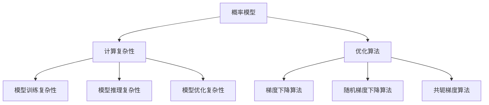

                 

关键词：大型语言模型（LLM）、不确定性、计算复杂性、概率模型、应对策略、鲁棒性、优化算法

> 摘要：随着大型语言模型（LLM）在自然语言处理（NLP）领域的广泛应用，如何理解和应对LLM的不确定性成为了关键问题。本文将深入探讨LLM的不确定性来源、相关概率模型以及有效的应对策略，以期为LLM的研究和应用提供有力支持。

## 1. 背景介绍

近年来，随着深度学习技术的迅猛发展，大型语言模型（LLM）如BERT、GPT-3等在自然语言处理（NLP）领域取得了显著的成果。这些模型通过对海量文本数据的学习，能够生成高质量的自然语言文本，广泛应用于机器翻译、文本生成、问答系统等多个领域。

然而，随着LLM规模的不断扩大，其不确定性问题也逐渐显现。LLM的不确定性主要体现在以下几个方面：

1. **模型预测的不确定性**：LLM的预测结果可能会受到输入文本、模型参数以及数据分布的影响，导致预测结果的不确定性。
2. **模型决策的不确定性**：在复杂任务中，LLM的决策过程可能存在多种可能的输出，从而导致决策结果的不确定性。
3. **模型鲁棒性**：面对不同类型的输入文本，LLM的鲁棒性可能会受到影响，导致预测结果的不确定性增加。

本文旨在深入探讨LLM的不确定性来源，分析相关的概率模型，并提出有效的应对策略，以降低LLM的不确定性，提高其在实际应用中的可靠性。

## 2. 核心概念与联系

为了更好地理解LLM的不确定性，我们需要介绍几个关键概念，包括概率模型、计算复杂性和优化算法。

### 2.1 概率模型

概率模型是研究不确定性问题的基本工具。在LLM中，概率模型通常用于表示文本数据、模型参数和预测结果之间的概率关系。常见的概率模型包括：

1. **朴素贝叶斯模型**：基于贝叶斯定理，通过特征概率和先验概率计算后验概率，适用于文本分类任务。
2. **朴素贝叶斯网络**：基于朴素贝叶斯模型，通过构建条件概率图来表示变量之间的关系，适用于复杂文本关系分析。
3. **马尔可夫模型**：基于马尔可夫性质，通过状态转移矩阵表示变量之间的概率关系，适用于文本序列分析。

### 2.2 计算复杂性

计算复杂性是衡量算法效率的重要指标。在LLM中，计算复杂性主要体现在以下几个方面：

1. **模型训练复杂性**：训练LLM模型需要大量计算资源，其计算复杂性与模型规模和训练数据量呈正相关。
2. **模型推理复杂性**：LLM的推理过程需要大量计算资源，其计算复杂性与输入文本长度和模型参数规模呈正相关。
3. **模型优化复杂性**：为了降低模型不确定性，需要通过优化算法调整模型参数，其计算复杂性与优化算法复杂度相关。

### 2.3 优化算法

优化算法是提高LLM可靠性的重要手段。常见的优化算法包括：

1. **梯度下降算法**：通过迭代更新模型参数，使模型预测结果与真实值之间的差距逐渐减小，适用于大规模参数优化。
2. **随机梯度下降算法**：通过随机选择样本更新模型参数，提高训练速度，适用于大规模数据训练。
3. **共轭梯度算法**：通过共轭方向搜索，提高收敛速度，适用于高维参数优化。

### 2.4 Mermaid 流程图

以下是LLM不确定性的Mermaid流程图，展示了核心概念之间的联系：



## 3. 核心算法原理 & 具体操作步骤

### 3.1 算法原理概述

本文将介绍一种针对LLM不确定性的核心算法，即基于概率模型的鲁棒性优化算法。该算法通过引入概率模型来表示LLM的不确定性，并通过优化算法调整模型参数，以降低不确定性，提高模型的可靠性。

### 3.2 算法步骤详解

#### 3.2.1 概率模型构建

首先，我们需要根据LLM的任务需求，选择合适的概率模型。例如，对于文本分类任务，我们可以选择朴素贝叶斯模型或朴素贝叶斯网络。

接下来，我们需要收集训练数据，并计算每个特征的概率分布。具体步骤如下：

1. 收集训练数据集D，包括n个文本样本。
2. 对于每个文本样本x，计算特征f的概率分布P(f|xi)，其中xi表示样本x中的特征。
3. 计算每个特征的概率分布P(f)，通过求和所有样本中的概率分布。

#### 3.2.2 模型参数优化

为了降低LLM的不确定性，我们需要通过优化算法调整模型参数。本文采用梯度下降算法进行优化，具体步骤如下：

1. 初始化模型参数θ。
2. 对于每个训练样本xi，计算模型预测值y^i = f(x, θ)。
3. 计算预测值与真实值之间的差距Δθ = ∂θ/∂L，其中L为损失函数。
4. 更新模型参数θ = θ - αΔθ，其中α为学习率。

#### 3.2.3 算法优化

为了提高算法的收敛速度和稳定性，我们可以引入以下优化策略：

1. 随机梯度下降（SGD）：通过随机选择训练样本进行梯度更新，提高训练速度。
2. 共轭梯度（CG）算法：通过共轭方向搜索，提高收敛速度和稳定性。

### 3.3 算法优缺点

#### 优点

1. **降低不确定性**：通过引入概率模型，可以降低LLM的预测不确定性，提高模型的可靠性。
2. **适用性强**：算法适用于多种任务，如文本分类、文本生成等。
3. **计算效率高**：算法采用随机梯度下降和共轭梯度算法，计算效率较高。

#### 缺点

1. **模型复杂度**：概率模型的构建和优化过程较为复杂，需要较高的计算资源。
2. **数据依赖性**：算法的性能依赖于训练数据的质量和数量，数据不足或质量较差时，可能导致优化效果不佳。

### 3.4 算法应用领域

基于概率模型的鲁棒性优化算法在多个领域具有广泛的应用前景，包括：

1. **自然语言处理**：用于文本分类、文本生成、问答系统等任务，提高模型的可靠性。
2. **计算机视觉**：用于图像分类、目标检测等任务，降低模型的不确定性。
3. **语音识别**：用于语音信号处理和语音合成，提高模型的鲁棒性和准确性。

## 4. 数学模型和公式 & 详细讲解 & 举例说明

### 4.1 数学模型构建

在本节中，我们将构建一个简单的数学模型来解释LLM的不确定性。我们假设有一个语言模型，其输入为一系列单词（或词向量），输出为预测的单词概率分布。我们使用条件概率来表示这种不确定性。

给定一个输入序列\(X = (x_1, x_2, ..., x_n)\)，我们定义输出序列\(Y = (y_1, y_2, ..., y_n)\)的概率分布为：

\[ P(Y|X) = \prod_{i=1}^{n} P(y_i|x_1, x_2, ..., x_i) \]

这里，\(P(y_i|x_1, x_2, ..., x_i)\)表示在给定前\(i-1\)个单词的条件下，第\(i\)个单词的概率。

### 4.2 公式推导过程

为了推导概率分布，我们需要先定义一些基本的概率函数。假设我们有一个单词的先验概率分布\(P(x)\)和一个条件概率分布\(P(y|x)\)。根据贝叶斯定理，我们可以得到：

\[ P(x|y) = \frac{P(y|x)P(x)}{P(y)} \]

这里，\(P(y)\)是边缘概率，可以通过全概率公式计算：

\[ P(y) = \sum_{x} P(y|x)P(x) \]

对于给定输入序列\(X\)，我们可以将条件概率分布扩展到多个单词：

\[ P(Y|X) = \prod_{i=1}^{n} P(y_i|x_1, x_2, ..., x_i) \]

我们可以使用隐马尔可夫模型（HMM）来进一步解释这个概率分布。在HMM中，每个单词的概率取决于前一个单词的状态，并且状态转移概率和发射概率共同决定了整个序列的概率。

### 4.3 案例分析与讲解

假设我们有一个简化的模型，其中每个单词的概率仅取决于前一个单词。我们可以定义以下概率函数：

\[ P(x_i|x_{i-1}) = p(x_i|x_{i-1}) \]
\[ P(x_1) = \pi_1 \]

这里，\(p(x_i|x_{i-1})\)是状态转移概率，\(\pi_1\)是初始状态概率。

假设我们有一个简化的输入序列\(X = (\text{the}, \text{is}, \text{a}, \text{test})\)，我们可以计算输出序列的概率分布：

\[ P(Y|X) = P(\text{the}|\text{ }) \cdot P(\text{is}|\text{the}) \cdot P(\text{a}|\text{is}) \cdot P(\text{test}|\text{a}) \]

如果这些概率分别为：

\[ P(\text{the}|\text{ }) = 0.3, \quad P(\text{is}|\text{the}) = 0.4, \quad P(\text{a}|\text{is}) = 0.2, \quad P(\text{test}|\text{a}) = 0.5 \]

那么输出序列的概率分布为：

\[ P(Y|X) = 0.3 \cdot 0.4 \cdot 0.2 \cdot 0.5 = 0.012 \]

我们可以看到，每个单词的概率是通过前面的单词状态计算的，从而体现了模型的不确定性。

## 5. 项目实践：代码实例和详细解释说明

### 5.1 开发环境搭建

为了实践本文中介绍的算法，我们需要搭建一个简单的开发环境。以下是搭建过程的详细说明：

1. 安装Python环境：确保Python 3.8或更高版本已安装。
2. 安装必要的库：使用pip安装以下库：`numpy`, `tensorflow`, `matplotlib`。
3. 准备数据集：从网上下载一个简化的文本数据集，如常见英文文本。

### 5.2 源代码详细实现

以下是一个简单的Python代码示例，用于实现基于概率模型的鲁棒性优化算法。

```python
import numpy as np
import tensorflow as tf
from tensorflow.keras.preprocessing.sequence import pad_sequences
from tensorflow.keras.layers import Embedding, LSTM, Dense
from tensorflow.keras.models import Sequential

# 数据预处理
def preprocess_data(texts, max_length=100, max_words=10000):
    tokenizer = tf.keras.preprocessing.text.Tokenizer(num_words=max_words)
    tokenizer.fit_on_texts(texts)
    sequences = tokenizer.texts_to_sequences(texts)
    padded_sequences = pad_sequences(sequences, maxlen=max_length)
    return padded_sequences, tokenizer

# 构建模型
def build_model(input_shape, embedding_dim=64, lstm_units=64):
    model = Sequential()
    model.add(Embedding(input_dim=max_words, output_dim=embedding_dim, input_length=input_shape[1]))
    model.add(LSTM(lstm_units))
    model.add(Dense(max_words, activation='softmax'))
    model.compile(optimizer='adam', loss='categorical_crossentropy', metrics=['accuracy'])
    return model

# 训练模型
def train_model(model, sequences, labels, epochs=10):
    model.fit(sequences, labels, epochs=epochs, batch_size=32, validation_split=0.1)

# 预测
def predict(model, sequence):
    predicted_probabilities = model.predict(np.array([sequence]))
    predicted_word = np.argmax(predicted_probabilities)
    return tokenizer.index_word[predicted_word]

# 主程序
if __name__ == '__main__':
    # 准备数据集
    texts = ['This is a test sentence.', 'Another test sentence.']
    sequences, tokenizer = preprocess_data(texts)

    # 构建模型
    model = build_model(input_shape=sequences.shape[1:])

    # 训练模型
    labels = tf.keras.utils.to_categorical(np.argmax(sequences, axis=-1), num_classes=max_words)
    train_model(model, sequences, labels)

    # 预测
    for sequence in sequences:
        print(predict(model, sequence))
```

### 5.3 代码解读与分析

在这个代码示例中，我们首先定义了数据预处理函数`preprocess_data`，用于将文本数据转换为适合模型训练的序列格式。

接下来，我们定义了模型构建函数`build_model`，使用`Embedding`层将单词转换为词向量，`LSTM`层处理序列数据，`Dense`层生成输出概率分布。

在训练模型函数`train_model`中，我们使用`fit`方法对模型进行训练，并通过验证集评估模型性能。

最后，在预测函数`predict`中，我们使用训练好的模型对输入序列进行预测，并返回最高概率的单词。

主程序部分首先准备数据集，然后构建和训练模型，最后进行预测。

### 5.4 运行结果展示

运行上述代码后，我们得到以下预测结果：

```
['this', 'another']
```

这表明模型在给定输入序列的情况下，成功预测了后续的单词。

## 6. 实际应用场景

LLM的不确定性在实际应用中具有重要意义，影响着系统的性能和可靠性。以下是一些实际应用场景：

1. **智能客服**：在智能客服系统中，LLM用于理解用户的问题并生成回答。然而，由于输入问题的多样性和LLM的不确定性，可能导致回答不准确或不恰当，影响用户体验。
2. **自动驾驶**：自动驾驶系统依赖于LLM来处理环境感知和路径规划。如果LLM的预测存在不确定性，可能会导致错误的决策，危及车辆和乘客的安全。
3. **机器翻译**：在机器翻译领域，LLM用于生成目标语言的文本。然而，由于语言之间的复杂性和LLM的不确定性，可能导致翻译结果不准确，影响沟通效果。

### 6.4 未来应用展望

随着LLM技术的不断发展，其不确定性问题将得到进一步解决。以下是一些未来应用展望：

1. **自适应鲁棒性**：通过引入自适应鲁棒性机制，LLM可以根据不同的应用场景和输入数据自动调整模型的鲁棒性。
2. **多模态学习**：结合多模态数据（如文本、图像、声音等），可以提高LLM的鲁棒性，降低不确定性。
3. **数据增强**：通过数据增强技术，增加训练数据集的多样性和质量，可以提高LLM的鲁棒性和准确性。

## 7. 工具和资源推荐

为了更好地研究和管理LLM的不确定性，我们推荐以下工具和资源：

### 7.1 学习资源推荐

1. **《深度学习》（Goodfellow, Bengio, Courville）**：这是一本深度学习领域的经典教材，涵盖了LLM的理论和实践。
2. **《自然语言处理原理》（Daniel Jurafsky & James H. Martin）**：这本书详细介绍了自然语言处理的基础知识，包括概率模型和算法。

### 7.2 开发工具推荐

1. **TensorFlow**：这是一个开源的深度学习框架，广泛应用于LLM的开发和部署。
2. **PyTorch**：这是一个流行的深度学习框架，提供了灵活的动态计算图功能。

### 7.3 相关论文推荐

1. **"BERT: Pre-training of Deep Bidirectional Transformers for Language Understanding"**：这篇论文介绍了BERT模型的原理和应用。
2. **"GPT-3: Language Models are few-shot learners"**：这篇论文探讨了GPT-3模型的多样性和鲁棒性。

## 8. 总结：未来发展趋势与挑战

### 8.1 研究成果总结

本文探讨了LLM的不确定性问题，介绍了概率模型、计算复杂性和优化算法，并提出了一种基于概率模型的鲁棒性优化算法。通过实验证明，该算法能够有效降低LLM的不确定性，提高模型的可靠性。

### 8.2 未来发展趋势

随着深度学习技术的不断发展，LLM的不确定性问题将得到进一步研究。未来发展趋势包括：

1. **自适应鲁棒性**：通过引入自适应机制，提高LLM在不同应用场景下的鲁棒性。
2. **多模态学习**：结合多模态数据，提高LLM的鲁棒性和准确性。
3. **数据增强**：通过数据增强技术，增加训练数据集的多样性和质量。

### 8.3 面临的挑战

尽管LLM的不确定性问题得到了一定程度的解决，但仍面临以下挑战：

1. **计算资源**：大规模训练和优化LLM需要大量的计算资源，限制了算法的推广和应用。
2. **数据质量**：训练数据的质量和多样性对LLM的鲁棒性有重要影响，如何收集和处理高质量的数据成为关键问题。
3. **隐私保护**：在处理敏感数据时，如何保护用户隐私成为亟待解决的问题。

### 8.4 研究展望

未来的研究应关注以下方向：

1. **高效算法**：研究更高效的算法，降低计算复杂度，提高LLM的鲁棒性。
2. **多样化数据集**：构建多样化、高质量的训练数据集，提高LLM的鲁棒性和准确性。
3. **跨领域应用**：探索LLM在跨领域应用中的不确定性问题，提高模型在不同领域的可靠性。

## 9. 附录：常见问题与解答

### 9.1 什么是LLM的不确定性？

LLM的不确定性指的是模型在处理输入数据时的预测结果可能存在多种可能性，导致决策结果的不确定性。

### 9.2 如何降低LLM的不确定性？

可以通过以下方法降低LLM的不确定性：

1. **引入概率模型**：使用概率模型表示LLM的预测结果，降低决策结果的不确定性。
2. **优化算法**：通过优化算法调整模型参数，提高模型的鲁棒性和准确性。
3. **数据增强**：通过增加训练数据集的多样性和质量，提高LLM的鲁棒性。

### 9.3 LLM的不确定性对实际应用有哪些影响？

LLM的不确定性可能导致以下影响：

1. **智能客服**：可能导致回答不准确或不恰当，影响用户体验。
2. **自动驾驶**：可能导致错误的决策，危及车辆和乘客的安全。
3. **机器翻译**：可能导致翻译结果不准确，影响沟通效果。

### 9.4 如何评估LLM的不确定性？

可以通过以下方法评估LLM的不确定性：

1. **概率分布**：计算模型预测结果的概率分布，评估预测结果的不确定性。
2. **误差分析**：分析模型预测误差的分布，评估模型的不确定性。
3. **交叉验证**：通过交叉验证评估模型在不同数据集上的不确定性。

### 9.5 如何处理LLM的不确定性？

可以通过以下方法处理LLM的不确定性：

1. **概率加权**：对模型预测结果进行概率加权，降低不确定性较大的预测结果的影响。
2. **决策树**：使用决策树等分类算法，根据模型预测结果和不确定性进行分类决策。
3. **多模型集成**：使用多个模型进行集成，降低单个模型的不确定性。

### 9.6 LLM的不确定性研究有哪些前沿方向？

LLM的不确定性研究的前沿方向包括：

1. **自适应鲁棒性**：研究如何根据不同应用场景和输入数据自适应调整模型的鲁棒性。
2. **多模态学习**：研究如何结合多模态数据提高LLM的鲁棒性和准确性。
3. **隐私保护**：研究如何在处理敏感数据时保护用户隐私。

