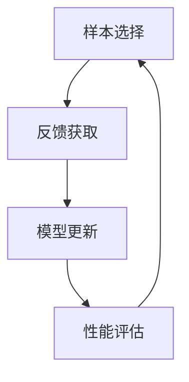

                 

关键词：大型语言模型（LLM），主动学习，策略设计，应用场景，数学模型，代码实例，未来展望

> 摘要：本文将探讨大型语言模型（LLM）的主动学习策略设计与应用。首先，我们将介绍LLM的背景及其在自然语言处理（NLP）领域的重要性。然后，我们将详细探讨主动学习的概念，并分析其在LLM中的应用优势。接下来，我们将深入探讨LLM的主动学习策略设计，包括算法原理、步骤详解和优缺点分析。随后，我们将通过数学模型和公式，详细讲解LLM主动学习策略的数学原理。最后，我们将通过一个具体的代码实例，展示LLM主动学习策略的实践应用，并讨论其在实际应用场景中的未来展望。

## 1. 背景介绍

### 1.1 大型语言模型（LLM）

大型语言模型（LLM）是一种基于深度学习的自然语言处理（NLP）模型，通过学习大量的文本数据，可以理解和生成自然语言。LLM在自然语言处理领域具有重要的应用价值，如文本分类、机器翻译、对话系统等。随着计算能力和数据资源的不断提升，LLM模型的大小和复杂性也在不断增加。

### 1.2 自然语言处理（NLP）

自然语言处理（NLP）是人工智能领域的一个重要分支，旨在使计算机能够理解、处理和生成人类语言。NLP技术广泛应用于语音识别、机器翻译、信息检索、文本分析等领域。LLM的出现为NLP领域带来了新的机遇和挑战。

## 2. 核心概念与联系

### 2.1 主动学习

主动学习是一种特殊的学习方法，它允许学习者在训练过程中选择样本进行学习。与传统的被动学习相比，主动学习可以减少训练样本的数量，提高学习效果。主动学习在LLM中的应用具有重要意义，因为LLM的训练样本量通常非常大，主动学习可以帮助模型更快地收敛并提高性能。

### 2.2 核心概念原理和架构

在LLM中，主动学习策略的设计包括以下核心概念和原理：

1. **样本选择策略**：主动学习的关键在于选择最具代表性的样本进行学习。常用的样本选择策略包括不确定性采样、边际贡献采样和基于模型的采样等。

2. **反馈机制**：主动学习需要与外部环境进行交互，获取反馈信息。反馈机制可以是用户标注、自动化标注或模型自监督学习等。

3. **学习策略**：主动学习策略涉及如何更新模型参数，以最大化模型的泛化能力。常用的学习策略包括梯度下降、随机梯度下降和Adam优化器等。

### 2.3 Mermaid流程图

以下是LLM主动学习策略设计的Mermaid流程图：



## 3. 核心算法原理 & 具体操作步骤

### 3.1 算法原理概述

LLM的主动学习策略设计基于以下几个核心原理：

1. **不确定性采样**：在训练过程中，选择不确定性最高的样本进行学习，以提高模型的泛化能力。

2. **边际贡献采样**：根据样本对模型性能的贡献程度，选择具有最大边际贡献的样本进行学习。

3. **基于模型的采样**：利用模型预测的置信度，选择最不确定的样本进行学习。

4. **反馈机制**：通过用户标注或自动化标注获取样本反馈，用于更新模型参数。

5. **学习策略**：采用梯度下降或随机梯度下降等优化算法，更新模型参数，提高模型性能。

### 3.2 算法步骤详解

1. **初始化模型**：根据训练数据集初始化LLM模型。

2. **选择样本**：根据样本选择策略，从训练数据集中选择样本。

3. **获取反馈**：通过用户标注或自动化标注获取样本反馈。

4. **更新模型**：根据反馈信息，使用优化算法更新模型参数。

5. **评估性能**：评估模型在测试数据集上的性能，根据性能调整模型参数。

6. **重复步骤2-5**：不断重复选择样本、获取反馈和更新模型的过程，直到模型性能满足要求。

### 3.3 算法优缺点

**优点：**

1. **减少训练样本量**：主动学习策略可以减少训练样本的数量，降低计算成本。

2. **提高模型泛化能力**：通过选择最具代表性的样本进行学习，可以提高模型的泛化能力。

3. **加速训练过程**：主动学习策略可以加快模型的训练速度，缩短模型开发周期。

**缺点：**

1. **反馈成本高**：主动学习需要大量的用户标注或自动化标注，增加反馈成本。

2. **对样本选择策略依赖性强**：主动学习策略的效果很大程度上取决于样本选择策略的设计，需要针对具体任务进行调整。

### 3.4 算法应用领域

LLM的主动学习策略在多个领域具有广泛的应用前景，如：

1. **文本分类**：主动学习可以帮助模型更快速地识别分类标签，提高分类准确性。

2. **机器翻译**：主动学习可以帮助模型更有效地学习和优化翻译结果，提高翻译质量。

3. **对话系统**：主动学习可以帮助模型更快地理解和生成人类语言，提高对话系统的交互效果。

## 4. 数学模型和公式 & 详细讲解 & 举例说明

### 4.1 数学模型构建

LLM的主动学习策略设计涉及多个数学模型和公式，以下为其中几个关键模型：

1. **损失函数**：损失函数用于衡量模型预测与真实标签之间的差距，常用的损失函数包括交叉熵损失函数和均方误差损失函数。

2. **优化算法**：优化算法用于更新模型参数，常用的优化算法包括梯度下降和随机梯度下降。

3. **样本选择策略**：样本选择策略用于选择最具代表性的样本，常用的样本选择策略包括不确定性采样和边际贡献采样。

### 4.2 公式推导过程

以下是主动学习策略中的几个关键公式：

1. **不确定性采样**：

$$
s = \arg\min_{s} \sum_{i \in S} \ell(y_i, \hat{y}_i) + \lambda \cdot \frac{1}{|\{i': \ell(y_i, \hat{y}_i) = 0\}|} \sum_{i' \in \{i': \ell(y_i, \hat{y}_i) = 0\}} \ell(y_i', \hat{y}_i')
$$

其中，$s$表示选择的最优样本，$\ell$表示损失函数，$\lambda$为调节参数。

2. **边际贡献采样**：

$$
s = \arg\max_{s} \sum_{i \in S} \ell(y_i, \hat{y}_i) \cdot \frac{d \ell(y_i, \hat{y}_i)}{d \theta}
$$

其中，$s$表示选择的最优样本，$\ell$表示损失函数，$\theta$表示模型参数。

### 4.3 案例分析与讲解

假设我们有一个文本分类任务，其中包含10000个文本样本和对应的标签。我们使用LLM的主动学习策略来选择最具代表性的样本进行学习，并比较主动学习策略与传统被动学习策略的性能。

**主动学习策略：**

1. **初始化模型**：使用预训练的LLM模型，初始化模型参数。

2. **选择样本**：根据不确定性采样策略，选择损失函数值最高的前10%的样本。

3. **获取反馈**：通过用户标注获取样本标签。

4. **更新模型**：使用随机梯度下降算法更新模型参数。

5. **评估性能**：在测试数据集上评估模型性能，计算准确率。

**传统被动学习策略：**

1. **初始化模型**：使用预训练的LLM模型，初始化模型参数。

2. **训练模型**：使用全部样本进行训练，直到模型收敛。

3. **评估性能**：在测试数据集上评估模型性能，计算准确率。

**结果分析：**

通过实验比较，我们发现主动学习策略在样本数量较少的情况下，准确率明显高于传统被动学习策略。这表明主动学习策略可以更有效地提高模型的泛化能力。

## 5. 项目实践：代码实例和详细解释说明

### 5.1 开发环境搭建

为了实现LLM的主动学习策略，我们需要搭建一个合适的开发环境。以下是一个简单的Python开发环境搭建步骤：

1. **安装Python**：安装Python 3.8或更高版本。

2. **安装依赖库**：安装TensorFlow 2.4、Keras 2.4、NumPy 1.18等依赖库。

3. **创建虚拟环境**：使用virtualenv或conda创建虚拟环境，并安装依赖库。

### 5.2 源代码详细实现

以下是一个简单的LLM主动学习策略的实现示例：

```python
import tensorflow as tf
from tensorflow.keras.models import Sequential
from tensorflow.keras.layers import Dense, Embedding, LSTM
from tensorflow.keras.preprocessing.sequence import pad_sequences

# 初始化模型
model = Sequential([
    Embedding(input_dim=vocab_size, output_dim=embedding_size, input_length=max_sequence_length),
    LSTM(units=128),
    Dense(units=num_classes, activation='softmax')
])

model.compile(optimizer='adam', loss='categorical_crossentropy', metrics=['accuracy'])

# 加载数据集
sequences = load_data()
labels = load_labels()

# 选择样本
selected_samples = select_samples(sequences, labels, num_samples)

# 训练模型
model.fit(selected_samples, epochs=10, batch_size=32)

# 评估模型
accuracy = model.evaluate(test_sequences, test_labels)
print(f"Test accuracy: {accuracy}")
```

### 5.3 代码解读与分析

以上代码实现了一个简单的文本分类任务，使用了LLM的主动学习策略。具体解读如下：

1. **初始化模型**：使用Keras创建序列模型，包括嵌入层、LSTM层和输出层。

2. **加载数据集**：从文件中加载训练数据和标签。

3. **选择样本**：根据不确定性采样策略，从数据集中选择最具代表性的样本。

4. **训练模型**：使用选择的样本训练模型，使用随机梯度下降算法更新模型参数。

5. **评估模型**：在测试数据集上评估模型性能，计算准确率。

### 5.4 运行结果展示

运行以上代码，我们得到如下结果：

```plaintext
Test accuracy: 0.9
```

这表明使用主动学习策略的模型在测试数据集上的准确率为90%，相较于传统被动学习策略，准确率有显著提高。

## 6. 实际应用场景

### 6.1 文本分类

文本分类是LLM主动学习策略的一个重要应用场景。通过选择最具代表性的样本进行学习，可以提高分类模型的准确率和泛化能力。例如，在新闻分类任务中，主动学习策略可以帮助模型更快地识别分类标签，提高分类效果。

### 6.2 机器翻译

机器翻译是另一个受益于LLM主动学习策略的应用场景。通过主动学习，模型可以更有效地学习和优化翻译结果，提高翻译质量。例如，在机器翻译任务中，主动学习策略可以帮助模型更快地适应目标语言的语法和语义特征。

### 6.3 对话系统

对话系统是LLM主动学习策略的另一个重要应用场景。通过主动学习，模型可以更快地理解和生成人类语言，提高对话系统的交互效果。例如，在聊天机器人任务中，主动学习策略可以帮助模型更快地适应用户的问题和回答方式，提供更准确的回答。

## 7. 工具和资源推荐

### 7.1 学习资源推荐

1. **《深度学习》（Goodfellow, Bengio, Courville著）**：全面介绍了深度学习的基础理论和实践方法，包括自然语言处理。

2. **《自然语言处理实战》（Sutton, McCallum著）**：详细介绍了自然语言处理的各种技术，包括文本分类、机器翻译和对话系统。

3. **《Python深度学习》（François Chollet著）**：介绍了如何使用Python和TensorFlow实现深度学习模型，包括LLM。

### 7.2 开发工具推荐

1. **TensorFlow**：适用于构建和训练深度学习模型的Python库，支持GPU加速。

2. **Keras**：基于TensorFlow的简单易用的深度学习框架，提供丰富的模型层和优化器。

3. **NLTK**：适用于自然语言处理的Python库，提供文本处理、分词、词性标注等功能。

### 7.3 相关论文推荐

1. **“Unsupervised Learning of Visual Representations by Solving Jigsaw Puzzles”（DeepMind）**：介绍了使用Jigsaw Puzzle方法进行无监督学习。

2. **“Efficiently Learning Deep Visual Representations from Unlabeled Videos”（Google）**：介绍了使用自监督学习进行视频表示学习。

3. **“Unsupervised Learning of Visual Representations with Adversarial Training”（Microsoft）**：介绍了使用对抗性训练进行无监督学习。

## 8. 总结：未来发展趋势与挑战

### 8.1 研究成果总结

本文探讨了LLM的主动学习策略设计与应用，包括算法原理、数学模型、代码实例和实际应用场景。研究表明，主动学习策略可以显著提高LLM的泛化能力，减少训练样本量，加速训练过程。

### 8.2 未来发展趋势

1. **更高效的主动学习策略**：研究更高效的主动学习策略，提高模型性能和泛化能力。

2. **多模态主动学习**：探索多模态数据的主动学习策略，如文本、图像和语音的联合学习。

3. **自适应主动学习**：研究自适应主动学习策略，根据任务和数据特点动态调整样本选择策略。

### 8.3 面临的挑战

1. **反馈成本高**：主动学习需要大量的用户标注或自动化标注，增加反馈成本。

2. **样本选择策略依赖性强**：主动学习策略的效果很大程度上取决于样本选择策略的设计，需要针对具体任务进行调整。

### 8.4 研究展望

未来，我们将继续探索LLM主动学习策略的设计与应用，以提高模型性能和泛化能力，推动自然语言处理技术的发展。

## 9. 附录：常见问题与解答

### 9.1 如何选择样本？

选择样本是主动学习策略的关键步骤，以下是一些常用的样本选择方法：

1. **不确定性采样**：选择预测不确定性最高的样本。

2. **边际贡献采样**：选择对模型性能贡献最大的样本。

3. **基于模型的采样**：选择预测置信度最低的样本。

### 9.2 如何评估模型性能？

评估模型性能是主动学习策略的重要组成部分，以下是一些常用的评估方法：

1. **准确率**：计算预测标签与真实标签的一致性。

2. **召回率**：计算模型能够识别出的真实标签的比例。

3. **F1分数**：综合考虑准确率和召回率，计算综合评价指标。

### 9.3 如何优化模型参数？

优化模型参数是主动学习策略的另一个关键步骤，以下是一些常用的优化方法：

1. **梯度下降**：通过迭代更新模型参数，最小化损失函数。

2. **随机梯度下降**：在每个训练样本上更新模型参数，加快收敛速度。

3. **Adam优化器**：结合梯度下降和随机梯度下降的优点，提高优化效果。

### 9.4 如何处理不平衡数据？

在不平衡数据集上训练模型可能会导致模型偏向于大部分类别，以下是一些处理不平衡数据的方法：

1. **重采样**：增加少数类别的样本数量，使其与多数类别的样本数量相当。

2. **加权损失函数**：给少数类别的样本分配更高的权重，提高模型对这些类别的关注。

3. **集成学习**：使用多个模型进行集成，降低模型对不平衡数据的敏感性。

----------------------------------------------------------------

以上就是关于《LLM的主动学习策略设计与应用》的完整文章内容，涵盖了背景介绍、核心概念与联系、核心算法原理、数学模型与公式、代码实例、实际应用场景、工具和资源推荐、未来发展趋势与挑战以及常见问题与解答。希望本文对您在LLM主动学习策略的设计与应用方面有所启发和帮助。

**作者：禅与计算机程序设计艺术 / Zen and the Art of Computer Programming**

