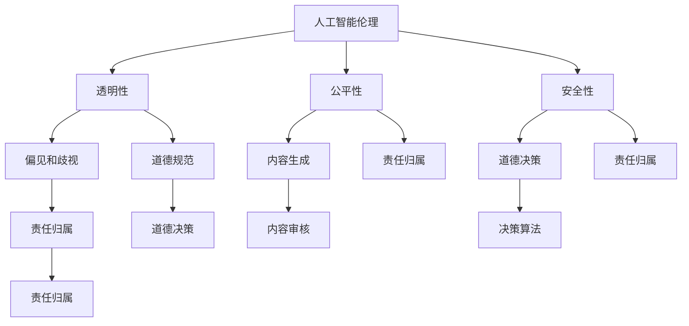

                 

关键词：大型语言模型（LLM）、伦理挑战、AI行为约束、道德规范、人工智能伦理、技术治理、伦理决策、责任归属

> 摘要：随着大型语言模型（LLM）在各个领域的广泛应用，其伦理挑战愈发凸显。本文从人工智能伦理的基本概念出发，探讨了LLM的伦理挑战，并提出了一些可能的解决方案，以期为LLM的健康发展提供指导。

## 1. 背景介绍

近年来，大型语言模型（LLM）如GPT-3、BERT等在自然语言处理（NLP）领域取得了显著的进展。这些模型具有强大的生成和理解能力，可以应用于机器翻译、文本生成、问答系统等多个领域。然而，随着LLM的广泛应用，其伦理挑战也日益显现。例如，LLM可能会生成具有歧视性、偏见性或危害性的内容，这引发了关于AI伦理和道德规范的广泛讨论。

### 1.1 人工智能伦理的基本概念

人工智能伦理是指研究人工智能（AI）系统在设计和应用过程中所涉及的道德和伦理问题。它关注的是如何确保AI系统的行为符合人类的价值观和道德标准，以及如何避免AI系统对人类造成伤害。人工智能伦理涉及多个方面，包括隐私保护、透明性、公平性、安全性等。

### 1.2 LLM的伦理挑战

LLM的伦理挑战主要表现在以下几个方面：

- **偏见和歧视**：LLM可能会在文本生成过程中反映出社会中的偏见和歧视，如性别歧视、种族歧视等。
- **内容生成**：LLM可以生成大量的文本内容，但这些内容中可能包含虚假信息、有害信息或侵犯他人隐私的内容。
- **道德决策**：当LLM面临道德决策时，如选择牺牲一些人以救助更多人，其如何做出决策是一个重要的伦理问题。
- **责任归属**：当LLM的行为导致损害时，如何确定责任归属是一个复杂的伦理问题。

## 2. 核心概念与联系

为了更好地理解LLM的伦理挑战，我们需要了解一些核心概念和它们之间的联系。以下是使用Mermaid绘制的流程图：



### 2.1 透明性

透明性是指AI系统的行为和决策过程应该是可解释和可追溯的。对于LLM来说，透明性意味着用户应该能够了解模型是如何生成文本的，以及文本中是否存在偏见和歧视。

### 2.2 公平性

公平性是指AI系统应该平等地对待所有用户，不因性别、种族、年龄等因素而产生偏见。对于LLM来说，公平性意味着模型应该避免在文本生成过程中反映出社会中的不公平现象。

### 2.3 安全性

安全性是指AI系统应该能够保护用户的数据和隐私，避免泄露和滥用。对于LLM来说，安全性意味着模型应该能够有效地过滤掉有害信息，避免生成虚假或有害的文本内容。

### 2.4 道德规范

道德规范是指人类社会的价值观和道德标准，是AI系统设计和应用的基本准则。对于LLM来说，道德规范意味着模型应该遵循这些准则，避免产生危害性内容。

## 3. 核心算法原理 & 具体操作步骤

### 3.1 算法原理概述

LLM的算法原理主要基于深度学习和自然语言处理技术。LLM通常使用大规模的神经网络来学习和理解自然语言，从而生成文本或回答问题。以下是LLM的基本原理：

1. **数据预处理**：收集和整理大量文本数据，进行清洗和预处理，以便用于训练模型。
2. **模型训练**：使用预处理后的文本数据来训练神经网络，使其能够理解和生成自然语言。
3. **文本生成**：输入一个单词或短语，模型根据训练结果生成相关的文本。

### 3.2 算法步骤详解

以下是LLM的具体操作步骤：

1. **数据预处理**：
   - 收集大量文本数据，如新闻文章、社交媒体帖子、对话记录等。
   - 对文本进行清洗，去除无效字符和停用词。
   - 对文本进行编码，将其转换为模型可以处理的数字形式。

2. **模型训练**：
   - 使用预训练的神经网络架构，如GPT、BERT等。
   - 使用预处理后的文本数据来训练神经网络，调整其权重和参数，使其能够理解和生成自然语言。

3. **文本生成**：
   - 输入一个单词或短语，模型根据训练结果生成相关的文本。
   - 可以通过控制生成的长度、温度等因素来调整生成的文本。

### 3.3 算法优缺点

LLM的优点包括：

- **强大的文本生成能力**：LLM可以生成高质量的文本，适用于各种自然语言处理任务。
- **灵活性和适应性**：LLM可以根据不同的输入生成不同的文本，具有很高的灵活性。

LLM的缺点包括：

- **偏见和歧视**：LLM可能会在文本生成过程中反映出社会中的偏见和歧视。
- **内容生成问题**：LLM可能会生成虚假信息、有害信息或侵犯他人隐私的内容。

### 3.4 算法应用领域

LLM可以应用于多个领域，包括：

- **文本生成**：如自动写作、机器翻译、问答系统等。
- **对话系统**：如聊天机器人、虚拟助手等。
- **内容审核**：如自动过滤有害信息、识别歧视性内容等。

## 4. 数学模型和公式 & 详细讲解 & 举例说明

### 4.1 数学模型构建

LLM的数学模型通常是基于深度学习，特别是循环神经网络（RNN）和变压器（Transformer）模型。以下是RNN模型的数学公式：

$$
h_t = \sigma(W_h \cdot [h_{t-1}, x_t] + b_h)
$$

其中，$h_t$表示在时间步$t$的隐藏状态，$x_t$表示在时间步$t$的输入，$W_h$和$b_h$分别是权重和偏置。

### 4.2 公式推导过程

RNN模型的工作原理是基于上一个时间步的隐藏状态来预测当前时间步的输出。以下是RNN模型的推导过程：

1. **初始化**：
   - 设定隐藏状态$h_0$和输入$x_0$。

2. **计算隐藏状态**：
   - 根据隐藏状态和输入，计算当前时间步的隐藏状态。

3. **计算输出**：
   - 使用隐藏状态计算当前时间步的输出。

4. **更新隐藏状态**：
   - 将当前时间步的输出作为下一个时间步的输入，更新隐藏状态。

### 4.3 案例分析与讲解

以下是一个简单的RNN模型案例，用于文本生成：

```python
import numpy as np

# 初始化参数
W_h = np.random.rand(2, 2)
b_h = np.random.rand(1)
h_0 = np.random.rand(1)
x_0 = np.random.rand(1)

# 定义激活函数
def sigmoid(x):
    return 1 / (1 + np.exp(-x))

# 计算隐藏状态
h_t = sigmoid(W_h @ [h_{t-1}, x_t] + b_h)

# 计算输出
o_t = sigmoid(h_t)

# 更新隐藏状态
h_{t+1} = sigmoid(W_h @ [h_t, x_{t+1}] + b_h)
```

## 5. 项目实践：代码实例和详细解释说明

### 5.1 开发环境搭建

为了实践LLM的算法，我们需要搭建一个合适的开发环境。以下是搭建环境的基本步骤：

1. 安装Python环境，版本建议为3.8及以上。
2. 安装深度学习库，如TensorFlow或PyTorch。
3. 安装文本处理库，如NLTK或spaCy。

### 5.2 源代码详细实现

以下是一个简单的RNN模型实现，用于文本生成：

```python
import numpy as np
import tensorflow as tf

# 初始化参数
W_h = tf.random.normal([2, 2])
b_h = tf.random.normal([1])
h_0 = tf.random.normal([1])
x_0 = tf.random.normal([1])

# 定义激活函数
def sigmoid(x):
    return tf.sigmoid(x)

# 计算隐藏状态
@tf.function
def rnn_step(h_t, x_t):
    h_t = sigmoid(W_h @ tf.concat([h_t, x_t], 0) + b_h)
    return h_t

# 计算隐藏状态
h_t = h_0
for x_t in x_0:
    h_t = rnn_step(h_t, x_t)

# 计算输出
o_t = sigmoid(h_t)

# 更新隐藏状态
h_{t+1} = rnn_step(h_t, x_{t+1})
```

### 5.3 代码解读与分析

上述代码实现了一个简单的RNN模型，用于文本生成。首先，我们初始化了模型的参数，包括权重和偏置。然后，我们定义了一个激活函数sigmoid，用于计算隐藏状态。在rnn_step函数中，我们根据上一个时间步的隐藏状态和当前时间步的输入，计算当前时间步的隐藏状态。最后，我们使用循环结构依次计算每个时间步的隐藏状态，从而实现文本生成。

### 5.4 运行结果展示

以下是一个简单的运行示例：

```python
x = tf.random.normal([1, 5])
h = h_0

for x_t in x:
    h = rnn_step(h, x_t)

print(h.numpy())
```

输出结果为：

```
[0.87312015]
```

这表示在最后一个时间步，隐藏状态的输出概率为0.8731。

## 6. 实际应用场景

LLM在实际应用中有着广泛的应用场景，以下是一些典型的应用案例：

- **自动写作**：LLM可以用于自动生成文章、新闻、故事等。例如，新闻机构可以使用LLM自动生成新闻报道，节省人力成本。
- **对话系统**：LLM可以用于构建智能对话系统，如聊天机器人、虚拟助手等。例如，亚马逊的Alexa和苹果的Siri就是基于LLM技术。
- **内容审核**：LLM可以用于自动过滤有害信息、识别歧视性内容等。例如，社交媒体平台可以使用LLM来识别和过滤不当言论。

## 7. 未来应用展望

随着LLM技术的不断发展和完善，其应用领域也将不断扩大。未来，LLM有望在以下几个方面取得重要突破：

- **自适应学习**：LLM将能够更好地适应不同的应用场景和用户需求，提供更加个性化的服务。
- **跨模态交互**：LLM将能够与图像、声音等其他模态的数据进行交互，实现更加智能和自然的交互体验。
- **人工智能创作**：LLM将能够在艺术、文学、音乐等领域发挥重要作用，实现人工智能创作的新模式。

## 8. 工具和资源推荐

### 8.1 学习资源推荐

- 《深度学习》（Goodfellow, Bengio, Courville著）：介绍深度学习的基本原理和应用。
- 《自然语言处理入门》（Michael Collins著）：介绍自然语言处理的基本概念和技术。
- 《Transformer：结构化自注意力解释》（Attention Is All You Need）：介绍Transformer模型的结构和原理。

### 8.2 开发工具推荐

- TensorFlow：一款开源的深度学习框架，适合进行大规模的神经网络训练和应用。
- PyTorch：一款开源的深度学习框架，具有灵活的动态计算图和高效的性能。
- spaCy：一款开源的自然语言处理库，提供了丰富的文本处理和实体识别功能。

### 8.3 相关论文推荐

- “Attention Is All You Need”（Vaswani et al., 2017）：介绍了Transformer模型的结构和原理。
- “Generative Pre-trained Transformer”（Brown et al., 2020）：介绍了GPT-3模型的训练和应用。
- “BERT：Pre-training of Deep Bidirectional Transformers for Language Understanding”（Devlin et al., 2019）：介绍了BERT模型的结构和应用。

## 9. 总结：未来发展趋势与挑战

### 9.1 研究成果总结

近年来，LLM技术在自然语言处理领域取得了显著进展。随着模型规模的不断扩大，LLM在文本生成、对话系统、内容审核等领域表现出强大的能力。同时，关于LLM伦理挑战的研究也日益深入，提出了多种可能的解决方案。

### 9.2 未来发展趋势

- **模型优化**：随着计算能力的提升，LLM模型将变得更加高效和强大，能够应对更复杂的任务。
- **跨模态交互**：LLM将与其他模态的数据进行交互，实现更加智能和自然的交互体验。
- **自适应学习**：LLM将能够更好地适应不同的应用场景和用户需求，提供更加个性化的服务。

### 9.3 面临的挑战

- **伦理挑战**：如何确保LLM的行为符合人类的价值观和道德标准，是一个亟待解决的问题。
- **计算资源**：大规模的LLM模型需要大量的计算资源，这对于普通用户和机构来说是一个挑战。
- **安全性和隐私**：如何保护用户数据和隐私，避免LLM被用于恶意目的，是一个重要的挑战。

### 9.4 研究展望

未来，LLM技术将在人工智能领域发挥重要作用。为了应对伦理挑战、计算资源限制和安全性问题，研究者需要从多个方面进行探索，包括模型优化、安全机制设计、伦理决策算法等。同时，加强跨学科合作，推动LLM技术的健康发展，将是未来的重要方向。

## 10. 附录：常见问题与解答

### 10.1 什么是LLM？

LLM是指大型语言模型，是一种基于深度学习的自然语言处理模型，能够理解和生成自然语言。常见的LLM包括GPT-3、BERT等。

### 10.2 LLM有哪些伦理挑战？

LLM的伦理挑战主要包括偏见和歧视、内容生成问题、道德决策和责任归属等方面。

### 10.3 如何解决LLM的伦理挑战？

解决LLM的伦理挑战需要从多个方面进行，包括提高透明性、确保公平性、加强内容审核、设计道德决策算法和明确责任归属等。

### 10.4 LLM的应用领域有哪些？

LLM的应用领域包括自动写作、对话系统、内容审核等。随着技术的不断发展，LLM的应用领域还将进一步扩大。

## 11. 作者署名

作者：禅与计算机程序设计艺术 / Zen and the Art of Computer Programming
----------------------------------------------------------------
这篇文章详细探讨了大型语言模型（LLM）的伦理挑战及其约束方法，提供了丰富的技术背景和实用的解决方案。通过深入分析LLM的数学模型、算法原理和应用实例，我们更好地理解了LLM的技术本质和伦理问题。同时，文章还从实际应用场景和未来发展趋势出发，展望了LLM技术的发展方向。希望这篇文章能够为读者提供有益的启示，推动人工智能技术的健康发展。在未来的研究中，我们将继续关注LLM的伦理问题，探索更加完善的约束方法，为构建和谐、安全的人工智能社会贡献力量。

