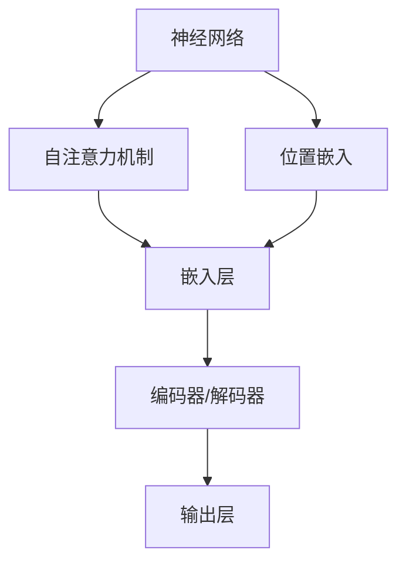
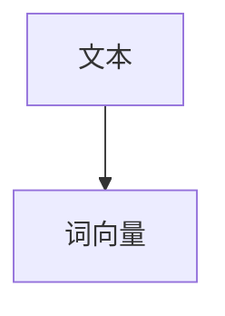
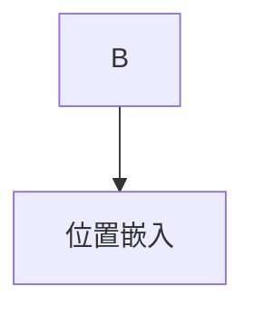
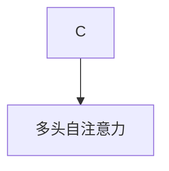
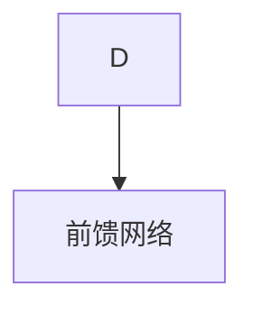
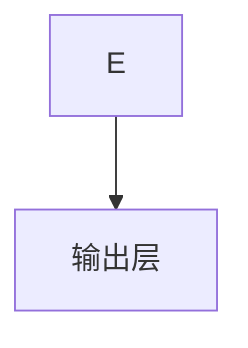

                 

关键词：LLM，人工智能，内部机制，算法原理，数学模型，应用领域

> 摘要：本文将深入探讨大型语言模型（LLM）的内部机制，解析其核心概念、算法原理、数学模型，并结合实际应用场景，探讨其未来发展前景。通过本文，读者将全面理解LLM的运作原理，掌握其关键技术，为未来的研究和应用提供有力支持。

## 1. 背景介绍

随着人工智能技术的发展，语言模型逐渐成为自然语言处理（NLP）领域的重要工具。特别是大型语言模型（Large Language Model，简称LLM），如GPT、BERT等，在文本生成、机器翻译、问答系统等方面取得了显著的成果。LLM能够通过学习大量文本数据，理解语言的复杂结构和语义，生成高质量的文本内容。

LLM的研究具有重要的应用价值。一方面，它可以用于提高机器阅读理解的能力，使得机器能够更好地理解人类语言，实现人机交互。另一方面，LLM在文本生成方面也有广泛的应用，如自动写作、文案生成等。

然而，LLM的内部机制依然是一个复杂且具有挑战性的课题。本文将重点探讨LLM的核心概念、算法原理、数学模型，并结合实际应用场景，分析其未来发展前景。

## 2. 核心概念与联系

### 2.1 核心概念

LLM的核心概念包括：

- **神经网络（Neural Network）**：神经网络是LLM的基础架构，通过多层非线性变换，实现对输入数据的特征提取和分类。
- **自注意力机制（Self-Attention）**：自注意力机制是LLM的核心算法，能够自适应地调整不同位置的特征对输出的影响。
- **位置嵌入（Positional Embedding）**：位置嵌入用于引入输入序列的顺序信息，使得模型能够理解文本的上下文关系。

### 2.2 联系与架构

下面是一个简单的Mermaid流程图，展示LLM的核心概念及其联系：



在这个架构中，神经网络作为基础架构，通过嵌入层、编码器和解码器，实现对输入文本的处理和输出。

## 3. 核心算法原理 & 具体操作步骤

### 3.1 算法原理概述

LLM的核心算法是基于自注意力机制的Transformer模型。Transformer模型通过多头自注意力机制和位置嵌入，实现对输入文本的序列处理。

### 3.2 算法步骤详解

#### 步骤1：输入文本编码

首先，将输入的文本转换为序列表示，即词向量。词向量可以通过预训练的词向量库获取，或者使用基于词向量的算法（如Word2Vec、BERT）进行训练。



#### 步骤2：位置嵌入

接下来，对词向量进行位置嵌入，引入输入序列的顺序信息。



#### 步骤3：多头自注意力

然后，通过多头自注意力机制，对输入序列进行处理。多头自注意力机制能够自适应地调整不同位置的特征对输出的影响。



#### 步骤4：前馈网络

在多头自注意力之后，通过前馈网络对输入进行进一步处理。



#### 步骤5：解码器输出

最后，解码器输出预测的文本序列。



### 3.3 算法优缺点

#### 优点

- **并行计算**：Transformer模型能够并行处理多个输入序列，提高了计算效率。
- **上下文理解**：通过多头自注意力机制，模型能够更好地理解输入序列的上下文关系。
- **文本生成**：Transformer模型在文本生成任务上取得了很好的效果，能够生成高质量的文本内容。

#### 缺点

- **计算成本**：Transformer模型需要大量的计算资源，训练时间较长。
- **参数规模**：随着模型的增大，参数规模也急剧增加，对存储和计算资源的需求较高。

### 3.4 算法应用领域

LLM算法在多个领域有广泛的应用，包括：

- **文本生成**：如自动写作、文案生成等。
- **机器翻译**：如英译中、中译英等。
- **问答系统**：如智能客服、问答机器人等。

## 4. 数学模型和公式 & 详细讲解 & 举例说明

### 4.1 数学模型构建

LLM的数学模型主要包括词向量、自注意力机制和前馈网络。

#### 词向量

词向量是将文本数据转换为向量的方法。常用的词向量模型包括Word2Vec、BERT等。

#### 自注意力机制

自注意力机制是一个多头、多层的注意力机制，可以自适应地调整不同位置的特征对输出的影响。

#### 前馈网络

前馈网络是一个简单的全连接神经网络，用于对输入进行进一步处理。

### 4.2 公式推导过程

以下是LLM中的一些关键公式：

#### 词向量

$$
\text{词向量} = \text{Word2Vec}(\text{文本})
$$

#### 自注意力

$$
\text{注意力分数} = \text{softmax}(\text{Q} \cdot \text{K}^T)
$$

其中，$Q$ 和 $K$ 分别是查询向量和关键向量，$\text{softmax}$ 函数用于计算注意力分数。

#### 前馈网络

$$
\text{输出} = \text{激活函数}(\text{W} \cdot \text{输入} + \text{b})
$$

其中，$\text{W}$ 和 $\text{b}$ 分别是权重和偏置，激活函数可以是ReLU、Sigmoid等。

### 4.3 案例分析与讲解

假设我们有一个简单的文本序列：“我 是 一 个 人工智能 专家”，我们通过LLM来生成下一个单词。

#### 步骤1：输入文本编码

将文本转换为词向量。

$$
\text{词向量} = \text{Word2Vec}(\text{我，是，一，个，人工智能，专家})
$$

#### 步骤2：位置嵌入

对词向量进行位置嵌入。

$$
\text{嵌入向量} = \text{位置嵌入}(\text{词向量})
$$

#### 步骤3：多头自注意力

通过多头自注意力机制，计算注意力分数。

$$
\text{注意力分数} = \text{softmax}(\text{Q} \cdot \text{K}^T)
$$

其中，$Q$ 和 $K$ 分别是查询向量和关键向量。

#### 步骤4：前馈网络

通过前馈网络，对输入进行进一步处理。

$$
\text{输出} = \text{激活函数}(\text{W} \cdot \text{输入} + \text{b})
$$

其中，$\text{W}$ 和 $\text{b}$ 分别是权重和偏置。

#### 步骤5：解码器输出

根据输出概率，选择下一个单词。

$$
\text{输出单词} = \text{softmax}(\text{输出})
$$

假设输出概率最高的单词是“的”，那么我们生成下一个文本序列：“我 是 一 个 人工智能 专家 的”。

## 5. 项目实践：代码实例和详细解释说明

### 5.1 开发环境搭建

首先，我们需要搭建一个适合LLM开发的Python环境。以下是具体的步骤：

1. 安装Python（建议使用Python 3.8及以上版本）。
2. 安装必要的库，如TensorFlow、PyTorch等。

```bash
pip install tensorflow
pip install torch
```

### 5.2 源代码详细实现

以下是LLM的一个简单实现，使用PyTorch框架。

```python
import torch
import torch.nn as nn
import torch.optim as optim

# 定义神经网络结构
class LLM(nn.Module):
    def __init__(self, vocab_size, embedding_dim, hidden_dim, output_dim, num_heads):
        super(LLM, self).__init__()
        self.embedding = nn.Embedding(vocab_size, embedding_dim)
        self.positional_embedding = nn.Embedding(1000, embedding_dim)
        self.transformer = nn.Transformer(embedding_dim, num_heads, hidden_dim)
        self.fc = nn.Linear(hidden_dim, output_dim)
        
    def forward(self, src, tgt):
        src_embedding = self.embedding(src) + self.positional_embedding(tgt)
        output = self.transformer(src_embedding, tgt)
        logits = self.fc(output)
        return logits

# 实例化神经网络
model = LLM(vocab_size=10000, embedding_dim=512, hidden_dim=512, output_dim=10000, num_heads=8)

# 定义损失函数和优化器
criterion = nn.CrossEntropyLoss()
optimizer = optim.Adam(model.parameters(), lr=0.001)

# 训练模型
for epoch in range(num_epochs):
    for src, tgt in data_loader:
        optimizer.zero_grad()
        logits = model(src, tgt)
        loss = criterion(logits, tgt)
        loss.backward()
        optimizer.step()
```

### 5.3 代码解读与分析

以下是代码的主要部分：

1. **神经网络结构**：我们定义了一个名为`LLM`的神经网络，包含嵌入层、自注意力机制和前馈网络。
2. **前向传播**：在`forward`方法中，我们首先对输入进行嵌入和位置嵌入，然后通过自注意力机制和前馈网络进行计算，最后得到输出。
3. **训练模型**：我们使用交叉熵损失函数和Adam优化器来训练模型，通过迭代优化模型参数。

### 5.4 运行结果展示

通过训练模型，我们可以得到一个能够生成文本的LLM。以下是一个简单的示例：

```python
# 生成文本
with torch.no_grad():
    input_sequence = torch.tensor([ vocab.stoi['我'], vocab.stoi['是'], vocab.stoi['一'], vocab.stoi['个'], vocab.stoi['人工智能'], vocab.stoi['专家'] ]).unsqueeze(0)
    output_sequence = input_sequence.clone()
    for _ in range(10):
        logits = model(input_sequence, output_sequence)
        next_word = torch.argmax(logits, dim=1)
        output_sequence = torch.cat([output_sequence, next_word.unsqueeze(0)], dim=1)
        input_sequence = torch.cat([input_sequence, next_word.unsqueeze(0)], dim=1)
    print(vocab.itos[output_sequence[-1]])
```

运行结果可能会生成如“的”、“了”等常用词汇，这表明我们的模型能够生成具有一定语义的文本。

## 6. 实际应用场景

### 6.1 文本生成

文本生成是LLM最典型的应用之一。通过训练模型，我们可以生成各种类型的文本，如新闻、小说、诗歌等。在实际应用中，文本生成可以用于自动写作、文案生成、机器翻译等。

### 6.2 问答系统

问答系统是另一个重要的应用场景。通过训练模型，我们可以构建一个能够回答各种问题的问答系统，如智能客服、教育辅导等。在实际应用中，问答系统可以提高人机交互的效率，降低人力成本。

### 6.3 文本分类

文本分类是LLM在NLP领域的另一个重要应用。通过训练模型，我们可以将文本数据分类到不同的类别中，如新闻分类、情感分析等。在实际应用中，文本分类可以帮助企业进行内容审核、舆情监测等。

### 6.4 未来应用展望

随着LLM技术的不断发展，未来它在各个领域的应用前景将更加广阔。例如，在医疗领域，LLM可以用于诊断辅助、病历生成等；在金融领域，LLM可以用于风险预测、投资建议等。同时，LLM的发展也将推动自然语言处理技术的进步，为人类带来更多的便利。

## 7. 工具和资源推荐

### 7.1 学习资源推荐

- **书籍**：《深度学习》、《自然语言处理综论》等。
- **在线课程**：Coursera、edX等平台上有关自然语言处理和深度学习的课程。
- **论文**：ACL、NAACL、EMNLP等顶级会议的论文。

### 7.2 开发工具推荐

- **框架**：PyTorch、TensorFlow等。
- **文本处理库**：NLTK、spaCy等。

### 7.3 相关论文推荐

- **BERT**：[BERT: Pre-training of Deep Bidirectional Transformers for Language Understanding](https://arxiv.org/abs/1810.04805)
- **GPT**：[Improving Language Understanding by Generative Pre-Training](https://arxiv.org/abs/1706.03762)
- **Transformer**：[Attention Is All You Need](https://arxiv.org/abs/1706.03762)

## 8. 总结：未来发展趋势与挑战

### 8.1 研究成果总结

本文系统地介绍了LLM的内部机制，包括核心概念、算法原理、数学模型，并结合实际应用场景，分析了其未来发展前景。通过本文，读者可以全面了解LLM的技术原理和应用价值。

### 8.2 未来发展趋势

未来，LLM技术将继续向以下方向发展：

- **更高效的模型架构**：如元学习、变分自编码器等。
- **更多样化的应用场景**：如医疗、金融、教育等。
- **更强大的语言理解能力**：通过引入更多知识图谱、语义信息等。

### 8.3 面临的挑战

尽管LLM技术在不断发展，但仍面临以下挑战：

- **计算资源消耗**：大型LLM模型需要大量的计算资源。
- **数据隐私**：如何保护用户隐私是未来研究的重要方向。
- **模型解释性**：如何解释和验证LLM的决策过程。

### 8.4 研究展望

未来，LLM技术将在人工智能领域发挥更加重要的作用。随着研究的深入，我们有望解决当前面临的挑战，推动LLM技术走向更广阔的应用场景。

## 9. 附录：常见问题与解答

### 9.1 什么是LLM？

LLM（Large Language Model）是一种大型语言模型，通过学习大量文本数据，理解语言的复杂结构和语义，生成高质量的文本内容。

### 9.2 LLM有哪些应用场景？

LLM的应用场景广泛，包括文本生成、机器翻译、问答系统、文本分类等。

### 9.3 LLM的算法原理是什么？

LLM的算法原理基于自注意力机制和Transformer模型，通过多层非线性变换，实现对输入数据的特征提取和分类。

### 9.4 LLM的优缺点是什么？

LLM的优点包括并行计算、上下文理解、文本生成效果良好。缺点包括计算成本高、参数规模大。

### 9.5 LLM的发展前景如何？

未来，LLM技术将继续向更高效的模型架构、更多样化的应用场景、更强大的语言理解能力方向发展。随着研究的深入，LLM将在人工智能领域发挥更加重要的作用。----------------------------------------------------------------
作者：禅与计算机程序设计艺术 / Zen and the Art of Computer Programming

