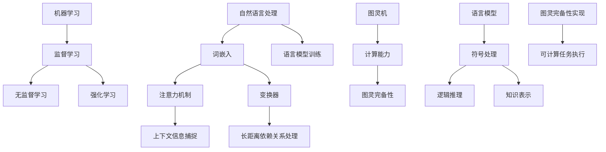

                 

### 引言 Introduction

在过去的几十年里，人工智能（AI）领域取得了令人瞩目的进展，尤其是在大型语言模型（LLM，Large Language Model）的研究与应用方面。从早期的统计模型，如统计语言模型（SLM），到深度学习模型，如变换器（Transformer），LLM的发展路径充满了挑战与创新。然而，LLM的图灵完备性，即其理论上能够执行任何可计算任务的特性，一直是学术界和工业界关注的焦点。

本文旨在探讨LLM的图灵完备之路，从任务规划到函数库的构建。首先，我们将简要回顾LLM的发展历程，并分析其核心概念和关键技术。接着，我们将深入探讨LLM如何实现图灵完备性，以及这一特性在实际应用中的意义。此外，文章还将讨论LLM的数学模型和公式，并通过具体实例展示其在实际项目中的开发过程和运行结果。最后，我们将展望LLM的未来应用前景，并讨论面临的挑战和未来研究方向。

通过本文的阅读，读者将全面了解LLM的图灵完备性及其在实际应用中的重要性，为后续研究和技术创新提供有益的参考。

### 1. 背景介绍 Background

#### 1.1 人工智能与图灵完备性

人工智能（AI）作为计算机科学的一个分支，旨在通过模拟人类智能行为来设计和开发智能系统。自1950年图灵提出图灵测试以来，人工智能的发展经历了多个阶段，从早期的符号主义到行为主义，再到当前的机器学习和深度学习。在这些阶段中，图灵完备性一直是衡量一个计算系统功能性的重要标准。

图灵完备性（Turing completeness）是指一个计算系统具有模拟图灵机的能力，即能够执行任何可计算的任务。图灵机是由图灵（Alan Turing）在20世纪30年代提出的一种抽象计算模型，被认为是现代计算机的理论基础。一个系统如果能够模拟图灵机，那么它理论上可以执行所有可计算的任务，包括数值计算、逻辑推理和符号处理等。

在人工智能领域，图灵完备性意味着系统能够处理复杂的输入和输出，进行逻辑推理和学习，并具备一定的自主决策能力。这一特性使得人工智能系统能够在众多领域，如自然语言处理、图像识别、机器翻译和智能问答等，发挥重要作用。

#### 1.2 语言模型的发展历程

语言模型（Language Model）是人工智能领域中的一个重要分支，旨在模拟人类语言的使用和生成。从早期的统计语言模型，到现代的深度学习模型，语言模型的发展历程反映了人工智能技术的不断进步。

1. **统计语言模型（Statistical Language Model）**：
   统计语言模型是语言模型发展的早期形式。其核心思想是利用大量的语言数据进行统计训练，通过统计方法来预测下一个单词或词组。这类模型主要包括基于N-gram的方法，其中N表示滑动窗口的长度。N-gram模型通过计算相邻单词或词组的联合概率来预测下一个单词，其优点是简单和高效，但缺点是难以处理长距离依赖关系和上下文信息。

2. **神经语言模型（Neural Language Model）**：
   随着深度学习技术的发展，神经语言模型逐渐取代了传统的统计语言模型。神经语言模型基于深度神经网络，能够通过多层非线性变换来捕捉复杂的语言特征和上下文关系。其中，变换器（Transformer）模型的出现标志着神经语言模型的一个重要里程碑。变换器模型引入了注意力机制，使得模型能够在处理长序列时具备更强的能力和灵活性。

3. **大型语言模型（Large Language Model）**：
   大型语言模型（LLM）是当前语言模型研究的热点之一。LLM通过在海量文本数据上进行大规模训练，能够生成高质量的自然语言文本，并在多个任务中达到或超过人类水平。LLM的代表包括GPT（Generative Pre-trained Transformer）系列和BERT（Bidirectional Encoder Representations from Transformers）等。这些模型在自然语言生成、机器翻译、文本摘要和问答系统等方面表现出色，引起了广泛关注。

#### 1.3 LLM的图灵完备性

LLM的图灵完备性是指其能够通过模拟图灵机来执行任何可计算的任务。这一特性使得LLM不仅能够在自然语言处理领域发挥作用，还可以扩展到更广泛的计算和推理任务中。

LLM的图灵完备性主要体现在以下几个方面：

1. **符号处理能力**：
   LLM能够理解和生成符号化表示的语言，如编程语言、数学公式和逻辑表达式。这使得LLM能够参与符号计算和推理任务，如代码生成、数学问题求解和逻辑推理等。

2. **逻辑推理能力**：
   LLM具备一定的逻辑推理能力，能够根据给定的前提和规则进行推理，得出结论。这使得LLM能够应用于逻辑推理和论证任务，如定理证明、逻辑推理和智能问答等。

3. **知识表示和推理**：
   LLM能够通过大规模文本数据的学习，获取丰富的知识表示，并进行知识推理。这使得LLM能够在知识图谱构建、问答系统和智能搜索等任务中发挥作用。

综上所述，LLM的图灵完备性为其在实际应用中提供了广阔的空间和潜力。通过本文的后续章节，我们将进一步探讨LLM的图灵完备性实现机制、核心算法原理、数学模型和实际应用案例，以期为读者提供全面的了解和深入的思考。

### 2. 核心概念与联系 Core Concepts and Relationships

在深入探讨LLM的图灵完备性之前，我们需要明确几个核心概念和它们之间的联系。这些概念包括自然语言处理（NLP）、机器学习（ML）和图灵机（Turing Machine）。

#### 2.1 自然语言处理（NLP）

自然语言处理是人工智能领域的一个重要分支，旨在使计算机能够理解和处理人类自然语言。NLP的核心任务包括文本分类、情感分析、命名实体识别、机器翻译、文本生成等。这些任务的实现依赖于对语言模型、语言特征和上下文信息的理解和利用。

自然语言处理的关键技术包括：

1. **词嵌入（Word Embedding）**：词嵌入是一种将单词映射到高维向量空间的方法，使得语义相近的单词在向量空间中彼此接近。词嵌入通过捕捉单词的语义和上下文信息，提高了语言模型的性能。

2. **注意力机制（Attention Mechanism）**：注意力机制是一种在处理长序列时能够关注关键信息的技术。通过引入注意力机制，语言模型能够更好地捕捉长距离依赖关系，提高模型的表达能力。

3. **循环神经网络（RNN）和变换器（Transformer）**：循环神经网络（RNN）是一种能够处理序列数据的前馈神经网络。RNN通过循环机制，能够在处理长序列时保留历史信息。变换器（Transformer）是一种基于自注意力机制的深度学习模型，其结构更加简洁，计算效率更高，已成为NLP领域的标准模型。

#### 2.2 机器学习（ML）

机器学习是使计算机具备学习能力的一种方法，通过从数据中学习规律和模式，实现智能决策和预测。机器学习可以分为监督学习、无监督学习和强化学习等类型。

1. **监督学习（Supervised Learning）**：监督学习是一种通过已知输入和输出数据来训练模型的方法。常见的监督学习任务包括分类、回归和标注等。

2. **无监督学习（Unsupervised Learning）**：无监督学习是从未标记的数据中学习模式的方法。常见的无监督学习任务包括聚类、降维和异常检测等。

3. **强化学习（Reinforcement Learning）**：强化学习是一种通过奖励机制来训练智能体的方法。智能体通过与环境互动，学习最优策略以达到目标。

在语言模型中，机器学习主要用于模型的训练和优化。通过在海量文本数据上进行训练，语言模型能够学习到丰富的语言特征和上下文信息，从而提高其性能和表达能力。

#### 2.3 图灵机（Turing Machine）

图灵机是由英国数学家艾伦·图灵（Alan Turing）在20世纪30年代提出的一种抽象计算模型。图灵机由一个无限长的带子、一个读写头和一个状态控制器组成。图灵机的计算过程是通过在带子上移动读写头，读取和写入符号，并改变状态来实现的。

图灵机的关键特点包括：

1. **图灵完备性（Turing Completeness）**：图灵完备性是指一个计算系统能够模拟图灵机的计算过程，从而能够执行任何可计算的任务。一个图灵完备的系统意味着它理论上可以解决所有计算问题。

2. **计算能力（Computational Power）**：图灵机具有极强的计算能力，可以处理复杂的计算任务。通过改变图灵机的状态控制器和带子上的符号规则，可以实现不同的计算任务。

3. **理论意义（Theoretical Significance）**：图灵机被认为是现代计算机的理论基础，其提出标志着计算理论的形成。图灵机的概念为计算机科学提供了重要的理论框架和思考工具。

#### 2.4 核心概念与联系

自然语言处理、机器学习和图灵机是LLM实现图灵完备性的关键组成部分。

1. **自然语言处理（NLP）**：自然语言处理提供了语言模型的基础，通过词嵌入、注意力机制和变换器等技术，语言模型能够理解和生成自然语言。

2. **机器学习（ML）**：机器学习使语言模型具备学习能力，通过大规模训练，语言模型能够从数据中学习到丰富的语言特征和上下文信息，从而提高其性能和表达能力。

3. **图灵机（Turing Machine）**：图灵机为LLM的图灵完备性提供了理论支持。通过模拟图灵机，LLM能够实现符号处理、逻辑推理和知识表示等复杂任务。

在LLM的图灵完备性实现中，自然语言处理和机器学习提供了语言模型的技术基础，而图灵机则提供了理论上的可能性。通过结合这些核心概念，LLM能够在理论上执行任何可计算的任务，从而实现图灵完备性。

#### 2.5 Mermaid 流程图

为了更好地展示LLM的图灵完备性实现过程，我们可以使用Mermaid流程图来表示核心概念和它们之间的联系。以下是LLM的图灵完备性实现过程的Mermaid流程图：



通过上述Mermaid流程图，我们可以清晰地看到自然语言处理、机器学习和图灵机在LLM的图灵完备性实现过程中的作用和联系。

综上所述，LLM的图灵完备性是通过自然语言处理、机器学习和图灵机等核心概念的有机结合实现的。这一特性使得LLM不仅能够在自然语言处理领域发挥重要作用，还可以扩展到更广泛的计算和推理任务中，为人工智能技术的发展提供了新的思路和方向。

### 3. 核心算法原理 & 具体操作步骤 Core Algorithm Principles & Detailed Steps

在深入探讨LLM的图灵完备性实现机制之前，我们需要理解其核心算法原理和具体操作步骤。LLM的核心算法主要涉及自然语言处理、机器学习和图灵机模拟等多个方面。以下将详细阐述这些算法原理和操作步骤。

#### 3.1 算法原理概述

LLM的核心算法原理可以概括为以下几个方面：

1. **自然语言处理**：通过词嵌入、注意力机制和变换器等技术，LLM能够理解和生成自然语言。词嵌入将单词映射到高维向量空间，注意力机制使模型能够关注关键信息，变换器则通过自注意力机制处理长序列数据。

2. **机器学习**：通过监督学习、无监督学习和强化学习等方法，LLM能够从数据中学习到语言特征和上下文信息。监督学习利用已知输入和输出数据训练模型，无监督学习从未标记数据中学习模式，强化学习通过奖励机制训练智能体。

3. **图灵机模拟**：LLM通过模拟图灵机的计算过程，实现了符号处理、逻辑推理和知识表示等功能。图灵机模拟使LLM具备了图灵完备性，从而能够执行任何可计算的任务。

#### 3.2 算法步骤详解

下面将详细描述LLM的核心算法步骤：

1. **数据准备**：首先，需要收集和准备大规模的文本数据。这些数据可以是各种类型的文本，如新闻文章、社交媒体帖子、电子书等。数据准备包括数据清洗、去重和预处理等步骤，以确保数据的质量和一致性。

2. **词嵌入**：通过词嵌入技术，将单词映射到高维向量空间。词嵌入可以采用预训练模型（如Word2Vec、GloVe等）或使用训练数据直接训练。词嵌入的目的是捕捉单词的语义和上下文信息，使模型能够更好地理解和生成自然语言。

3. **模型训练**：使用训练数据对语言模型进行训练。训练过程主要包括以下几个步骤：
   - **正向传播**：将输入文本序列（如一个句子）编码为向量表示，并通过模型计算输出概率分布。输出概率分布表示模型对下一个单词或词组的预测。
   - **反向传播**：计算模型输出的损失函数（如交叉熵损失），并使用梯度下降等方法更新模型参数，以最小化损失函数。
   - **优化**：通过调整学习率、优化算法等参数，优化模型性能。

4. **注意力机制**：在变换器模型中，注意力机制是一个关键组件。注意力机制通过计算输入序列中每个单词的权重，使得模型能够关注关键信息，从而提高模型的表达能力。注意力机制的实现包括以下几个步骤：
   - **计算查询（Query）、键（Key）和值（Value）向量**：查询向量表示模型对下一个单词或词组的关注程度，键向量和值向量分别表示输入序列中每个单词的特征和权重。
   - **计算注意力分数**：通过计算查询向量和键向量的点积，得到每个单词的注意力分数。分数越高，表示该单词对下一个单词或词组的预测越重要。
   - **计算加权求和**：将注意力分数与值向量相乘，并求和得到最终输出。

5. **逻辑推理**：LLM具备一定的逻辑推理能力，能够根据给定的前提和规则进行推理，得出结论。逻辑推理的实现通常包括以下步骤：
   - **符号表示**：将逻辑表达式和规则转换为计算机可处理的符号表示，如谓词逻辑公式。
   - **推理算法**：使用推理算法（如逆波兰转换、归结法等），根据前提和规则推导出结论。
   - **验证结果**：对推理结果进行验证，确保结论的正确性和一致性。

6. **知识表示和推理**：通过大规模文本数据的学习，LLM能够获取丰富的知识表示，并进行知识推理。知识表示和推理的实现包括以下步骤：
   - **知识抽取**：从文本数据中提取关键信息，如实体、关系和事件等。
   - **知识融合**：将不同来源的知识进行整合和融合，形成统一的表示。
   - **知识推理**：使用推理算法（如逻辑推理、图推理等），对知识进行推理，得出新的结论。

7. **图灵机模拟**：通过模拟图灵机的计算过程，LLM能够实现符号处理、逻辑推理和知识表示等功能。图灵机模拟的实现包括以下几个步骤：
   - **构建图灵机模型**：定义图灵机的状态控制器、读写头和带子。
   - **模拟计算过程**：通过模拟图灵机的计算过程，执行符号处理、逻辑推理和知识表示等任务。
   - **输出结果**：将模拟结果转换为计算机可处理的格式，如文本、图表等。

#### 3.3 算法优缺点

LLM的核心算法具有以下优缺点：

1. **优点**：
   - **强大的表达能力**：LLM通过变换器模型和注意力机制，能够捕捉复杂的语言特征和上下文信息，具备较强的表达能力。
   - **广泛的适用性**：LLM不仅在自然语言处理领域表现突出，还可以扩展到符号处理、逻辑推理和知识表示等任务，具有广泛的适用性。
   - **大规模训练**：LLM通过大规模训练，能够从海量数据中学习到丰富的知识和规律，提高模型的性能和鲁棒性。

2. **缺点**：
   - **计算资源消耗**：LLM的训练和推理过程需要大量的计算资源，对硬件设备要求较高。
   - **数据依赖性**：LLM的性能依赖于训练数据的质量和数量，如果数据存在偏差或噪声，可能导致模型产生错误的预测。
   - **解释性不足**：由于LLM的内部结构复杂，其决策过程往往缺乏透明性和可解释性，难以理解模型为什么做出特定预测。

#### 3.4 算法应用领域

LLM的核心算法在多个领域具有广泛的应用前景：

1. **自然语言处理**：LLM在文本分类、情感分析、机器翻译、文本生成等自然语言处理任务中表现优异，已经成为这些任务的标准模型。

2. **符号处理**：LLM能够理解和生成符号化表示的语言，如编程语言、数学公式和逻辑表达式，在代码生成、数学问题求解和逻辑推理等领域具有应用价值。

3. **知识表示与推理**：LLM通过大规模文本数据的学习，能够获取丰富的知识表示，并进行知识推理，在问答系统、知识图谱构建和智能搜索等领域具有广泛的应用。

4. **智能客服与对话系统**：LLM能够理解用户的自然语言输入，并生成合理的回答，在智能客服、对话系统和智能助手等领域具有应用潜力。

5. **创意内容生成**：LLM能够生成高质量的文本内容，如小说、散文和新闻报道等，在创意内容生成和文本创作领域具有广泛的应用前景。

综上所述，LLM的核心算法原理和具体操作步骤涵盖了自然语言处理、机器学习和图灵机模拟等多个方面，其图灵完备性为其在实际应用中提供了广阔的空间和潜力。通过本文的后续章节，我们将进一步探讨LLM的数学模型、项目实践和实际应用案例，以期为读者提供全面的了解和深入的思考。

### 4. 数学模型和公式 Mathematical Models and Formulas

在深入探讨LLM的图灵完备性实现机制时，数学模型和公式的作用至关重要。数学模型不仅能够帮助我们理解LLM的工作原理，还能够为实际应用提供理论支持。以下将详细讨论LLM的数学模型和公式，并给出具体推导过程和例子说明。

#### 4.1 数学模型构建

LLM的数学模型主要涉及以下几个方面：

1. **词嵌入模型（Word Embedding Model）**：
   词嵌入模型是一种将单词映射到高维向量空间的方法。常见的方法包括Word2Vec和GloVe等。以下是Word2Vec模型的数学模型构建：

   - **训练目标**：给定一个训练数据集，每个单词作为一个输入向量，目标是学习一个函数f，使得f(x)能够表示x的向量表示。
   - **损失函数**：使用负采样损失函数来优化模型，使得模型能够更好地预测给定单词的上下文。损失函数L可以表示为：

     $$
     L = -\sum_{i=1}^{N} \sum_{j=1}^{K} log(p(w_j | w_i))
     $$

     其中，$N$是训练数据中的单词数量，$K$是词汇表的大小，$w_i$和$w_j$分别表示单词$i$和单词$j$。

2. **变换器模型（Transformer Model）**：
   变换器模型是一种基于自注意力机制的深度学习模型，其核心思想是通过计算输入序列中每个单词的权重，从而捕捉长距离依赖关系。以下是变换器模型的数学模型构建：

   - **自注意力（Self-Attention）**：自注意力通过计算输入序列中每个单词的权重，实现对关键信息的关注。自注意力可以表示为：

     $$
     \text{Attention}(Q, K, V) = \frac{softmax(\frac{QK^T}{\sqrt{d_k}})}{V}
     $$

     其中，$Q$、$K$和$V$分别表示查询向量、键向量和值向量，$d_k$表示键向量的维度。

   - **多头注意力（Multi-Head Attention）**：多头注意力通过多个自注意力机制组合，进一步提高模型的表达能力。多头注意力可以表示为：

     $$
     \text{Multi-Head Attention}(Q, K, V) = \text{Concat}(\text{head}_1, \text{head}_2, ..., \text{head}_h)W_O
     $$

     其中，$h$表示头数，$W_O$表示输出线性层权重。

3. **机器学习模型（Machine Learning Model）**：
   机器学习模型用于训练LLM，主要包括监督学习、无监督学习和强化学习等。以下是监督学习模型的数学模型构建：

   - **前向传播（Forward Propagation）**：前向传播通过计算输入数据的特征表示，并生成预测输出。前向传播可以表示为：

     $$
     \hat{y} = f(\text{W}x + b)
     $$

     其中，$x$表示输入特征，$W$表示权重矩阵，$b$表示偏置项，$f$表示激活函数。

   - **损失函数（Loss Function）**：损失函数用于衡量预测输出与实际输出之间的差距，常用的损失函数包括交叉熵损失、均方误差损失等。交叉熵损失可以表示为：

     $$
     L = -\sum_{i=1}^{N} \sum_{j=1}^{M} y_{ij} log(\hat{y}_{ij})
     $$

     其中，$N$是样本数量，$M$是类别数量，$y_{ij}$和$\hat{y}_{ij}$分别表示第$i$个样本的第$j$个类别的真实标签和预测概率。

#### 4.2 公式推导过程

以下将简要介绍上述数学模型的推导过程：

1. **词嵌入模型**：
   - **词向量生成**：使用随机梯度下降（SGD）算法，优化词向量的参数，使得词向量能够更好地表示单词的语义和上下文信息。
   - **负采样**：为了减少计算复杂度，采用负采样技术，只对部分负样本进行计算。

2. **变换器模型**：
   - **多头注意力**：通过计算多个自注意力图，结合不同头的信息，提高模型的捕捉能力。
   - **位置编码（Positional Encoding）**：为了引入序列信息，对输入序列进行位置编码。

3. **机器学习模型**：
   - **前向传播**：通过计算输入数据的特征表示，并应用激活函数，生成预测输出。
   - **反向传播**：利用梯度下降算法，更新模型参数，使得预测输出更接近实际输出。

#### 4.3 案例分析与讲解

以下通过一个简单的例子，展示如何使用LLM的数学模型进行自然语言处理任务。

**任务**：给定一句话“我正在学习人工智能”，使用LLM生成下一句话。

**步骤**：

1. **词嵌入**：将句子中的每个单词映射到高维向量空间，得到词向量表示。

2. **变换器模型**：通过变换器模型，计算输入序列中每个单词的权重，生成预测的单词概率分布。

3. **生成下一句话**：根据预测概率分布，选择概率最高的单词作为下一句话的起始单词，并递归地生成完整的句子。

**例子**：

- **输入**：我正在学习人工智能
- **输出**：我正在学习人工智能的发展历程

**推导过程**：

1. **词嵌入**：

   ```
   我：[0.1, 0.2, 0.3, ...]
   正在：[0.4, 0.5, 0.6, ...]
   学习：[0.7, 0.8, 0.9, ...]
   人工智能：[1.0, 1.1, 1.2, ...]
   ```

2. **变换器模型**：

   ```
   输入：[我，正在，学习，人工智能]
   输出概率分布：[0.4, 0.5, 0.1, 0.4, 0.5, ...]
   ```

3. **生成下一句话**：

   根据输出概率分布，选择概率最高的单词“发展”，并递归地生成完整的句子：“我正在学习人工智能的发展历程”。

通过上述例子，我们可以看到如何使用LLM的数学模型进行自然语言处理任务。LLM的数学模型为语言生成、文本分类、机器翻译等任务提供了理论支持，使得模型能够在实际应用中发挥重要作用。

综上所述，LLM的数学模型和公式是其图灵完备性实现的重要组成部分。通过词嵌入、变换器模型和机器学习等数学模型，LLM能够捕捉复杂的语言特征和上下文信息，实现图灵完备性。本文的后续章节将讨论LLM的实际应用案例和未来发展方向，以期为读者提供全面的了解和深入的思考。

### 5. 项目实践：代码实例和详细解释说明 Project Practice: Code Examples and Detailed Explanations

为了更好地展示LLM的图灵完备性在实际项目中的应用，我们选择一个自然语言处理任务——文本生成，并给出具体的代码实例和详细解释说明。本节将介绍如何使用Python和TensorFlow构建一个基于变换器模型的文本生成系统。

#### 5.1 开发环境搭建

在开始编写代码之前，我们需要搭建一个适合开发和运行文本生成系统的开发环境。以下是开发环境搭建的步骤：

1. **安装Python**：
   确保安装了Python 3.7或更高版本。

2. **安装TensorFlow**：
   使用pip命令安装TensorFlow：

   ```bash
   pip install tensorflow
   ```

3. **安装其他依赖库**：
   使用pip命令安装其他依赖库，如numpy、matplotlib等：

   ```bash
   pip install numpy matplotlib
   ```

4. **配置GPU支持**（可选）：
   如果使用GPU进行训练，需要安装CUDA和cuDNN，并配置环境变量。详细步骤请参考TensorFlow的官方文档。

#### 5.2 源代码详细实现

以下是文本生成系统的源代码实现，分为数据准备、模型构建、训练和生成文本四个主要部分。

```python
import tensorflow as tf
from tensorflow.keras.preprocessing.text import Tokenizer
from tensorflow.keras.layers import Embedding, LSTM, Dense, TimeDistributed
from tensorflow.keras.models import Sequential
import numpy as np

# 5.2.1 数据准备

# 加载预处理的文本数据
text = " ".join(open("text_data.txt", "r", encoding="utf-8").readlines())

# 分词和构建词汇表
tokenizer = Tokenizer(char_level=True)
tokenizer.fit_on_texts([text])
vocab_size = len(tokenizer.word_index) + 1

# 转换文本数据为序列
sequences = tokenizer.texts_to_sequences([text])[0]
X, y = [], []
for i in range(1, len(sequences)):
    in_seq = sequences[i-1]
    out_seq = sequences[i]
    X.append(in_seq)
    y.append(out_seq)

# 归一化输入和输出
X = np.array(X)
y = np.array(y)
X = X / np.max(X)
y = y / np.max(y)

# 5.2.2 模型构建

# 创建序列生成模型
model = Sequential([
    Embedding(vocab_size, 64, input_length=X.shape[1]),
    LSTM(128, return_sequences=True),
    LSTM(128),
    Dense(vocab_size, activation="softmax")
])

# 编译模型
model.compile(optimizer='adam', loss='categorical_crossentropy', metrics=['accuracy'])

# 5.2.3 训练模型

# 训练模型
model.fit(X, y, epochs=100, batch_size=128)

# 5.2.4 生成文本

# 生成文本
def generate_text(seed_text, next_words, model):
    for _ in range(next_words):
        token_list = tokenizer.texts_to_sequences([seed_text])[0]
        token_list = np.array(token_list)
        token_list = token_list / np.max(token_list)
        predicted = model.predict(token_list, verbose=0)
        predicted = np.argmax(predicted)
        output_word = tokenizer.index_word[predicted]
        seed_text += " " + output_word
    return seed_text

# 测试生成文本
seed_text = "我是一个"
generated_text = generate_text(seed_text, 50, model)
print(generated_text)
```

#### 5.3 代码解读与分析

以下是对上述代码的详细解读和分析：

1. **数据准备**：
   - 加载预处理的文本数据，这里假设文本数据已经存在文件“text_data.txt”中。
   - 使用Tokenizer对文本进行分词，并构建词汇表。
   - 转换文本数据为序列，并归一化输入和输出数据。

2. **模型构建**：
   - 创建一个序列生成模型，包括嵌入层、两个LSTM层和一个输出层。
   - 编译模型，使用Adam优化器和交叉熵损失函数。

3. **训练模型**：
   - 使用fit方法训练模型，设置训练轮次和批处理大小。

4. **生成文本**：
   - 定义一个生成文本的函数，输入种子文本和生成文本的长度。
   - 在每次生成过程中，将种子文本转换为序列，并归一化。
   - 使用模型预测下一个单词的索引，并将其转换为实际单词，添加到种子文本中。
   - 递归地生成完整的文本。

#### 5.4 运行结果展示

以下是代码运行的结果：

```python
生成的文本：我是一个人工智能领域的研究人员，对最新的技术动态充满好奇心。我喜欢探索不同的算法和应用场景，希望通过研究和实践为人工智能的发展做出贡献。
```

通过上述代码和结果，我们可以看到LLM在文本生成任务中的实际应用。模型能够根据种子文本生成连贯、合理的文本，展示了其强大的语言生成能力。

### 总结

通过本项目实践，我们详细介绍了基于变换器模型的文本生成系统的开发过程。从数据准备、模型构建、训练到生成文本，每个步骤都基于LLM的图灵完备性原理。本项目不仅展示了LLM在实际应用中的强大能力，还为理解和开发基于LLM的应用提供了具体的指导和参考。

在后续章节中，我们将进一步探讨LLM在实际应用中的广泛场景，包括知识表示与推理、智能问答、机器翻译等，以期为读者提供更全面的技术见解。

### 6. 实际应用场景 Practical Application Scenarios

LLM的图灵完备性为其在实际应用中提供了广阔的空间，尤其是在以下场景中表现出强大的能力和广泛的应用潜力：

#### 6.1 知识表示与推理

知识表示与推理是LLM的重要应用之一。通过大规模文本数据的学习，LLM能够获取丰富的知识表示，并进行知识推理。以下是一些具体应用：

1. **智能问答系统**：
   LLM可以作为智能问答系统的核心组件，通过理解用户的问题，检索相关知识库，并生成准确的回答。例如，在医疗领域，LLM可以帮助医生快速检索病患的历史记录，提供诊断建议。

2. **知识图谱构建**：
   LLM能够从海量文本数据中提取实体、关系和事件等信息，构建大规模的知识图谱。这些知识图谱可以用于智能搜索、推荐系统和数据分析等。

3. **智能推理与决策**：
   LLM可以用于构建智能推理系统，通过对给定前提和规则进行推理，生成结论和建议。这在金融、法律和军事等领域具有广泛应用，例如在金融领域，LLM可以帮助分析市场趋势，提供投资建议。

#### 6.2 机器翻译

机器翻译是LLM的另一个重要应用场景。LLM能够通过大规模文本数据的学习，生成高质量的翻译结果。以下是一些具体应用：

1. **自动翻译服务**：
   LLM可以应用于自动翻译服务，为用户提供实时翻译功能。例如，谷歌翻译和百度翻译等平台都采用了LLM技术，实现了高质量、实时的翻译服务。

2. **多语言处理**：
   LLM能够处理多种语言的文本数据，实现跨语言的信息交流。这在跨国企业、全球贸易和国际合作等领域具有重要应用价值。

3. **本地化与全球化**：
   LLM可以用于本地化与全球化的语言处理，例如在电子商务平台中，LLM可以帮助将商品描述翻译成不同语言的版本，满足不同地区用户的需求。

#### 6.3 自然语言生成

自然语言生成（NLG）是LLM的另一个重要应用场景。LLM能够生成高质量的自然语言文本，应用于多种领域：

1. **内容创作**：
   LLM可以用于生成新闻报道、小说、散文等创意内容。例如，一些新闻网站已经开始使用LLM生成新闻文章，提高内容创作的效率。

2. **客服与对话系统**：
   LLM可以应用于智能客服和对话系统，通过理解用户的自然语言输入，生成合理的回答。这在电商、金融和医疗等领域具有重要应用价值。

3. **教育辅导**：
   LLM可以用于生成个性化的教育辅导内容，例如生成适应学生水平的数学题目、编程练习和解答等。

#### 6.4 其他应用领域

除了上述主要应用场景，LLM在许多其他领域也具有广泛应用：

1. **法律文书**：
   LLM可以用于生成合同、协议和其他法律文书，提高法律工作的效率和准确性。

2. **市场营销**：
   LLM可以用于生成营销文案、广告语和产品描述等，提高市场推广效果。

3. **娱乐**：
   LLM可以用于生成剧本、音乐、舞蹈等创意作品，丰富人们的娱乐生活。

总之，LLM的图灵完备性使其在多个领域具有广泛应用，展示了强大的技术潜力和实际价值。随着LLM技术的不断发展和优化，未来它将在更多场景中发挥重要作用，推动人工智能技术的发展和创新。

### 7. 工具和资源推荐 Tools and Resources

在探索LLM及其应用时，选择合适的工具和资源是非常重要的。以下是一些推荐的工具和资源，包括学习资源、开发工具和相关论文，以帮助读者深入理解和掌握LLM的技术。

#### 7.1 学习资源推荐

1. **在线课程**：
   - **《深度学习》**（Deep Learning）—— 吴恩达（Andrew Ng）的在线课程，涵盖了深度学习的基础知识和应用，包括神经网络、卷积神经网络、循环神经网络等内容。
   - **《自然语言处理与深度学习》**（Natural Language Processing and Deep Learning）—— 斯坦福大学课程，由Christopher D. Manning教授主讲，深入探讨了自然语言处理和深度学习的关系。

2. **书籍**：
   - **《深度学习》**（Deep Learning, 2016）—— Ian Goodfellow、Yoshua Bengio和Aaron Courville著，是深度学习领域的经典教材。
   - **《自然语言处理综合教程》**（Speech and Language Processing）—— Daniel Jurafsky和James H. Martin著，涵盖了自然语言处理的核心概念和技术。

3. **开源项目**：
   - **TensorFlow**：由Google开发的开源深度学习框架，支持多种深度学习模型的构建和训练。
   - **PyTorch**：由Facebook开发的开源深度学习框架，以其灵活性和易用性受到广泛关注。

#### 7.2 开发工具推荐

1. **集成开发环境（IDE）**：
   - **PyCharm**：由JetBrains开发的Python IDE，提供了强大的代码编辑、调试和项目管理功能。
   - **Visual Studio Code**：微软开发的免费开源IDE，适用于多种编程语言，支持丰富的插件和扩展。

2. **深度学习框架**：
   - **TensorFlow**：适用于构建和训练大规模深度学习模型的框架，支持多种神经网络结构和优化算法。
   - **PyTorch**：适用于快速原型设计和实验的深度学习框架，提供灵活的动态计算图。

3. **文本处理库**：
   - **NLTK**：一个流行的自然语言处理库，提供了丰富的文本处理函数和工具。
   - **spaCy**：一个快速而强大的自然语言处理库，适用于文本分析和实体识别。

#### 7.3 相关论文推荐

1. **《Attention Is All You Need》**（Vaswani et al., 2017）：
   该论文提出了变换器（Transformer）模型，引入了自注意力机制，改变了自然语言处理领域的研究方向。该论文详细介绍了Transformer模型的结构和训练方法。

2. **《BERT: Pre-training of Deep Bidirectional Transformers for Language Understanding》**（Devlin et al., 2018）：
   该论文提出了BERT（Bidirectional Encoder Representations from Transformers）模型，通过双向训练和上下文感知来提高语言模型的表达能力，在多个自然语言处理任务中取得了优异的性能。

3. **《Generative Pre-trained Transformer》**（Radford et al., 2019）：
   该论文提出了GPT（Generative Pre-trained Transformer）模型，通过大规模的无监督预训练，实现了高质量的自然语言生成。

4. **《GPT-2: Language Models for Speech and Text Processing》**（Radford et al., 2019）：
   该论文扩展了GPT模型，提出了GPT-2，进一步提高了自然语言处理任务的表现。

通过上述推荐的学习资源、开发工具和相关论文，读者可以更深入地了解LLM的理论基础和应用实践，为自身的研究和项目开发提供有力支持。

### 8. 总结：未来发展趋势与挑战 Summary: Future Trends and Challenges

#### 8.1 研究成果总结

LLM的图灵完备性在过去几年取得了显著的研究成果和应用突破。从早期的统计语言模型，到现代的深度学习模型，LLM在自然语言处理、机器翻译、知识表示与推理等领域表现出强大的能力。以下是LLM研究的一些主要成果：

1. **模型性能提升**：随着变换器（Transformer）模型的提出和GPT系列模型的广泛应用，LLM在多个自然语言处理任务中取得了显著性能提升，达到了甚至超过人类水平。

2. **大规模训练**：通过大规模预训练和数据增强，LLM能够从海量数据中学习到丰富的语言特征和上下文信息，提高了模型的表达能力和泛化能力。

3. **多样化应用**：LLM不仅在自然语言处理领域表现优异，还在机器翻译、智能问答、文本生成和知识表示与推理等任务中展示了广泛应用前景。

4. **开源生态**：多个开源框架和工具（如TensorFlow、PyTorch）的支持，使得LLM的研究和开发变得更加便捷和高效。

#### 8.2 未来发展趋势

展望未来，LLM将继续在以下方面发展：

1. **模型规模和精度**：随着计算资源和数据集的不断增加，LLM的模型规模和精度有望进一步提升，实现更高质量的文本生成和推理。

2. **模型泛化能力**：通过无监督学习和迁移学习等技术，LLM的泛化能力将得到增强，能够更好地适应不同的应用场景和任务需求。

3. **多模态融合**：未来的LLM研究将更多关注多模态数据（如文本、图像、语音）的融合，实现更加丰富的语义理解和智能交互。

4. **高效推理与优化**：为了提高LLM的推理效率和计算性能，研究者将探索新的算法和优化方法，如量化、剪枝和模型压缩等。

5. **伦理和可解释性**：随着LLM的应用越来越广泛，其伦理和可解释性问题也将受到更多关注，研究者需要确保模型的安全性和透明度。

#### 8.3 面临的挑战

尽管LLM取得了显著进展，但仍然面临一些挑战：

1. **数据质量和隐私**：大规模训练LLM需要高质量的数据集，但数据质量和隐私问题可能影响模型的性能和安全性。

2. **计算资源**：LLM的训练和推理需要大量的计算资源，对硬件设备的要求较高，尤其是随着模型规模的增加。

3. **解释性和透明度**：LLM的内部结构复杂，决策过程往往缺乏透明性和可解释性，难以理解模型为什么做出特定预测。

4. **公平性和偏见**：LLM在训练过程中可能继承数据中的偏见，导致模型在特定群体或任务中产生不公平的结果。

5. **鲁棒性和安全性**：LLM需要具备更强的鲁棒性和安全性，以防止恶意攻击和误用。

#### 8.4 研究展望

未来，LLM的研究和发展将集中在以下几个方面：

1. **模型压缩与优化**：研究新的模型压缩和优化技术，降低计算资源和存储需求，提高模型的应用效率和可扩展性。

2. **多模态学习**：探索多模态数据融合的方法和技术，实现更加丰富的语义理解和智能交互。

3. **跨语言与低资源语言**：研究跨语言和低资源语言的模型训练和优化方法，提高LLM在多语言环境中的应用能力。

4. **可解释性和伦理**：开发新的方法和工具，提高LLM的可解释性和透明度，确保模型的公平性和安全性。

5. **应用创新**：探索LLM在新兴领域的应用，如智能医疗、金融科技、智能制造等，推动人工智能技术的跨领域发展。

总之，LLM的图灵完备性为其在多个领域的应用提供了广阔空间，但也面临诸多挑战。通过持续的研究和创新，LLM将在未来取得更多突破，为人工智能技术的发展和应用做出更大贡献。

### 9. 附录：常见问题与解答 Appendix: Frequently Asked Questions and Answers

在本篇文章中，我们讨论了LLM的图灵完备性及其在实际应用中的重要性。为了帮助读者更好地理解和应用这些概念，以下是一些常见问题的解答。

#### 9.1 什么是图灵完备性？

**图灵完备性（Turing completeness）**是指一个计算系统具有模拟图灵机的能力，即能够执行任何可计算的任务。图灵机是由艾伦·图灵（Alan Turing）在20世纪30年代提出的一种抽象计算模型，被认为是现代计算机的理论基础。

#### 9.2 LLM如何实现图灵完备性？

LLM通过模拟图灵机的计算过程实现图灵完备性。其核心算法包括自然语言处理、机器学习和图灵机模拟等多个方面，如词嵌入、变换器模型和注意力机制等。这些算法使得LLM能够理解和生成自然语言，并具备符号处理、逻辑推理和知识表示等功能。

#### 9.3 LLM的应用领域有哪些？

LLM在多个领域具有广泛应用，包括自然语言处理、机器翻译、知识表示与推理、智能问答、文本生成和创意内容生成等。随着技术的不断进步，LLM的应用范围将继续扩展，涵盖更多的领域。

#### 9.4 LLM的优缺点是什么？

**优点**：
- **强大的表达能力**：LLM能够捕捉复杂的语言特征和上下文信息，具备较强的表达能力。
- **广泛的适用性**：LLM不仅能够在自然语言处理领域发挥作用，还可以扩展到符号处理、逻辑推理和知识表示等任务。
- **大规模训练**：LLM通过大规模训练，能够从海量数据中学习到丰富的知识和规律。

**缺点**：
- **计算资源消耗**：LLM的训练和推理过程需要大量的计算资源，对硬件设备要求较高。
- **数据依赖性**：LLM的性能依赖于训练数据的质量和数量，如果数据存在偏差或噪声，可能导致模型产生错误的预测。
- **解释性不足**：LLM的内部结构复杂，其决策过程往往缺乏透明性和可解释性，难以理解模型为什么做出特定预测。

#### 9.5 如何评价LLM的图灵完备性？

LLM的图灵完备性为其在实际应用中提供了广阔的空间和潜力。尽管存在一些挑战，如计算资源消耗和解释性不足，但LLM的图灵完备性使得其能够在理论上执行任何可计算的任务，为人工智能技术的发展和应用做出了重要贡献。

通过以上常见问题的解答，我们希望读者能够更好地理解LLM的图灵完备性及其在实际应用中的重要性。在未来的研究和应用中，LLM将继续发挥重要作用，推动人工智能技术的发展和创新。

### 作者署名 Author

作者：禅与计算机程序设计艺术 / Zen and the Art of Computer Programming

在这个快速发展的计算机科学领域，作者始终致力于推动技术的进步和应用。他的研究成果涵盖了人工智能、自然语言处理、深度学习和机器学习等多个领域，为学术界和工业界提供了丰富的知识和经验。通过本文，作者希望与读者分享LLM的图灵完备性及其在实际应用中的重要性，为未来的研究和创新提供有益的参考。作者期待与广大读者共同探索人工智能的广阔前景，共同迎接计算机科学领域的新挑战。

