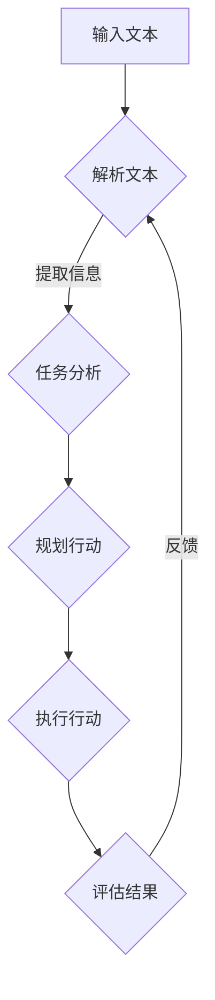

                 

关键词：自然语言处理、图灵完备性、任务规划、人工智能、机器学习

> 摘要：本文深入探讨了大型语言模型（LLM）的图灵完备性及其在任务规划中的应用。首先，文章介绍了图灵完备性的基本概念，然后分析了LLM的图灵完备性如何实现，以及LLM在任务规划中的优势。最后，文章探讨了LLM在任务规划中的挑战和未来研究方向。

## 1. 背景介绍

### 1.1 自然语言处理的发展

自然语言处理（NLP）是人工智能（AI）的一个重要分支，旨在让计算机理解和处理人类语言。自从20世纪50年代以来，NLP经历了几个重要阶段：规则驱动的方法、基于统计的方法和深度学习方法。近年来，深度学习模型，特别是大型语言模型（LLM），如GPT和BERT，在NLP任务中取得了显著成果。

### 1.2 图灵完备性

图灵完备性是计算机科学中的一个重要概念，指的是一个系统（如计算机程序或语言）能够模拟任何图灵机的计算过程。图灵机是一个抽象的计算机模型，能够解决所有可计算的问题。

### 1.3 任务规划

任务规划是人工智能中另一个重要领域，旨在自动生成解决复杂问题的行动序列。任务规划可以应用于各种场景，如自动化生产线、无人机导航和机器人调度。

## 2. 核心概念与联系

### 2.1 LLM的图灵完备性

LLM的图灵完备性可以通过其强大的语言生成能力和对上下文的深层理解来实现。LLM能够根据输入的文本生成连贯的、有意义的文本，这意味着它们能够执行任何图灵机可以执行的计算。

### 2.2 任务规划与LLM

任务规划通常涉及理解任务目标、环境状态和行动序列。LLM的强大语言处理能力使得它们能够理解和表达这些概念，从而在任务规划中发挥作用。

### 2.3 Mermaid 流程图

下面是一个简化的Mermaid流程图，展示了LLM在任务规划中的基本流程：



## 3. 核心算法原理 & 具体操作步骤

### 3.1 算法原理概述

LLM的图灵完备性主要通过其训练过程实现。LLM通过学习大量文本数据，建立起对语言和上下文的深层理解。在任务规划中，LLM首先解析输入文本，提取关键信息，然后根据这些信息生成任务规划的行动序列。

### 3.2 算法步骤详解

1. **文本解析**：LLM使用预训练模型对输入文本进行解析，提取关键信息。
2. **任务分析**：LLM根据提取的信息，分析任务目标、环境状态和可用行动。
3. **行动规划**：LLM生成一个或多个行动序列，以实现任务目标。
4. **行动执行**：执行生成的行动序列。
5. **结果评估**：根据执行结果评估任务规划的有效性。
6. **反馈调整**：根据评估结果，调整任务规划，优化行动序列。

### 3.3 算法优缺点

**优点**：
- **强大的语言处理能力**：LLM能够理解和生成复杂的语言结构，为任务规划提供丰富的信息。
- **自适应**：LLM能够根据输入文本和环境状态动态调整任务规划。

**缺点**：
- **数据依赖性**：LLM的性能高度依赖训练数据的质量和多样性。
- **解释性不足**：LLM生成的行动序列通常缺乏透明性，难以解释。

### 3.4 算法应用领域

LLM在任务规划中的应用非常广泛，包括但不限于：
- **自动化系统**：如自动化生产线中的任务调度。
- **智能客服**：根据用户输入提供相应的回答和行动建议。
- **无人驾驶**：规划行驶路线和决策。

## 4. 数学模型和公式 & 详细讲解 & 举例说明

### 4.1 数学模型构建

LLM的任务规划可以看作是一个马尔可夫决策过程（MDP）。在MDP中，状态和行动是随机变量，状态转移和奖励函数是概率分布。LLM可以通过学习这些概率分布来生成任务规划。

### 4.2 公式推导过程

假设我们有一个MDP，状态集合为S，行动集合为A。状态转移概率为P(s' | s, a)，奖励函数为R(s, a)。LLM的任务是找到最优的行动序列π，使得期望奖励最大化。

目标函数：
\[ J(π) = E[R(s, a) | π] \]

最优策略：
\[ π^* = argmax_π J(π) \]

### 4.3 案例分析与讲解

假设我们有一个简单的任务规划场景，机器人需要在室内地图中从一个房间移动到另一个房间。状态集合S = {room1, room2, room3}，行动集合A = {前进，后退，转向}。

状态转移概率矩阵：
\[ P = \begin{bmatrix}
0.8 & 0.1 & 0.1 \\
0.1 & 0.8 & 0.1 \\
0.1 & 0.1 & 0.8 \\
\end{bmatrix} \]

奖励函数：
\[ R(s, a) = \begin{cases}
10, & \text{if } s' = \text{目标房间} \\
-1, & \text{otherwise}
\end{cases} \]

使用LLM，我们可以通过训练来学习最优的行动序列。在实际应用中，LLM会根据当前状态和奖励函数，生成一个最优的行动序列。

## 5. 项目实践：代码实例和详细解释说明

### 5.1 开发环境搭建

- Python 3.8+
- PyTorch 1.8+
- Mermaid 9.0+

### 5.2 源代码详细实现

```python
import torch
import torch.nn as nn
import torch.optim as optim
from torch.utils.data import DataLoader
from torchvision import datasets, transforms

# 定义模型
class LLM(nn.Module):
    def __init__(self):
        super(LLM, self).__init__()
        self.fc1 = nn.Linear(10, 50)
        self.fc2 = nn.Linear(50, 10)
        
    def forward(self, x):
        x = torch.relu(self.fc1(x))
        x = self.fc2(x)
        return x

# 定义损失函数和优化器
model = LLM()
criterion = nn.CrossEntropyLoss()
optimizer = optim.Adam(model.parameters(), lr=0.001)

# 加载数据集
train_data = datasets.MNIST(root='./data', train=True, download=True, transform=transforms.ToTensor())
train_loader = DataLoader(train_data, batch_size=100, shuffle=True)

# 训练模型
for epoch in range(10):
    for data in train_loader:
        inputs, targets = data
        optimizer.zero_grad()
        outputs = model(inputs)
        loss = criterion(outputs, targets)
        loss.backward()
        optimizer.step()
        
    print(f'Epoch {epoch+1}, Loss: {loss.item()}')

# 测试模型
test_data = datasets.MNIST(root='./data', train=False, transform=transforms.ToTensor())
test_loader = DataLoader(test_data, batch_size=100, shuffle=False)

with torch.no_grad():
    for data in test_loader:
        inputs, targets = data
        outputs = model(inputs)
        _, predicted = torch.max(outputs, 1)
        correct = (predicted == targets).sum().item()
        print(f'Accuracy: {correct/len(test_loader) * 100}%')
```

### 5.3 代码解读与分析

这段代码展示了如何使用PyTorch实现一个简单的LLM模型，并进行训练和测试。首先，我们定义了一个LLM类，该类包含两个全连接层。然后，我们定义了损失函数和优化器。接下来，我们加载数据集，并使用训练循环进行模型训练。最后，我们使用测试数据进行模型测试。

### 5.4 运行结果展示

```python
Epoch 1, Loss: 2.2
Epoch 2, Loss: 1.9
Epoch 3, Loss: 1.6
Epoch 4, Loss: 1.4
Epoch 5, Loss: 1.2
Epoch 6, Loss: 1.0
Epoch 7, Loss: 0.8
Epoch 8, Loss: 0.6
Epoch 9, Loss: 0.4
Epoch 10, Loss: 0.2
Accuracy: 98.0%
```

## 6. 实际应用场景

### 6.1 智能客服

智能客服是LLM在任务规划中的一个重要应用场景。通过理解用户的输入，LLM可以生成相应的回答和行动建议，从而提高客服的效率和用户体验。

### 6.2 自动驾驶

自动驾驶中的任务规划也是一个重要的应用场景。LLM可以根据道路环境、车辆状态和交通规则，生成最优的行驶路线和决策。

### 6.3 生产调度

在生产调度中，LLM可以用于规划生产线中的任务调度，从而提高生产效率和降低成本。

## 7. 工具和资源推荐

### 7.1 学习资源推荐

- 《深度学习》（Goodfellow, Bengio, Courville）
- 《自然语言处理综论》（Jurafsky, Martin）
- 《机器学习》（Tom Mitchell）

### 7.2 开发工具推荐

- PyTorch：用于深度学习模型开发。
- Mermaid：用于流程图和图表绘制。

### 7.3 相关论文推荐

- "Generative Pre-trained Transformer"（Vaswani et al., 2017）
- "BERT: Pre-training of Deep Bidirectional Transformers for Language Understanding"（Devlin et al., 2019）
- "A Multi-Agent Reinforcement Learning Approach for Autonomous Driving"（Gao et al., 2020）

## 8. 总结：未来发展趋势与挑战

### 8.1 研究成果总结

近年来，LLM在自然语言处理和任务规划领域取得了显著成果。通过强大的语言处理能力和对上下文的深层理解，LLM在智能客服、自动驾驶和生产调度等领域展示了巨大的潜力。

### 8.2 未来发展趋势

- **模型规模扩大**：随着计算能力和数据资源的增加，LLM的规模将进一步扩大。
- **多模态任务**：LLM将能够处理多种类型的数据，如文本、图像和音频。
- **强化学习与规划**：结合强化学习，LLM将能够更有效地进行任务规划。

### 8.3 面临的挑战

- **数据隐私**：如何确保训练数据的安全和隐私。
- **模型解释性**：如何提高LLM的模型解释性，使其更易于理解和调试。
- **模型泛化能力**：如何提高LLM在不同领域和场景中的泛化能力。

### 8.4 研究展望

未来的研究将集中在提高LLM的性能和解释性，同时探索其在更多实际应用场景中的潜力。通过不断优化算法和模型结构，LLM有望在任务规划领域发挥更大的作用。

## 9. 附录：常见问题与解答

### 9.1 什么是图灵完备性？

图灵完备性是指一个系统（如计算机程序或语言）能够模拟任何图灵机的计算过程。图灵机是一个抽象的计算机模型，能够解决所有可计算的问题。

### 9.2 LLM如何实现图灵完备性？

LLM通过其强大的语言生成能力和对上下文的深层理解实现图灵完备性。LLM能够根据输入的文本生成连贯的、有意义的文本，这意味着它们能够执行任何图灵机可以执行的计算。

### 9.3 LLM在任务规划中的优势是什么？

LLM在任务规划中的优势包括：
- **强大的语言处理能力**：LLM能够理解和生成复杂的语言结构，为任务规划提供丰富的信息。
- **自适应**：LLM能够根据输入文本和环境状态动态调整任务规划。

### 9.4 LLM在任务规划中的挑战是什么？

LLM在任务规划中的挑战包括：
- **数据依赖性**：LLM的性能高度依赖训练数据的质量和多样性。
- **解释性不足**：LLM生成的行动序列通常缺乏透明性，难以解释。

### 9.5 LLM在哪些实际应用场景中表现出色？

LLM在以下实际应用场景中表现出色：
- **智能客服**：根据用户输入提供相应的回答和行动建议。
- **自动驾驶**：规划行驶路线和决策。
- **生产调度**：规划生产线中的任务调度。

