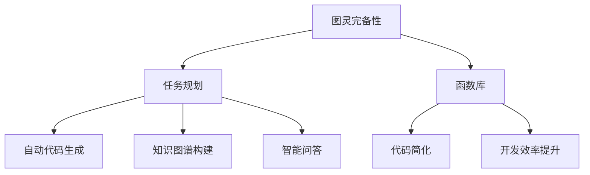

                 

关键词：图灵完备性，LLM，任务规划，函数库，人工智能

摘要：本文将深入探讨大型语言模型（LLM）的图灵完备性，以及其在任务规划和函数库应用中的重要性。通过分析LLM的核心算法原理，数学模型和具体操作步骤，我们将展示其在各种领域的强大应用，并对未来发展趋势与挑战进行展望。

## 1. 背景介绍

随着深度学习和自然语言处理技术的飞速发展，大型语言模型（LLM）已经成为了人工智能领域的重要工具。LLM通过学习大量文本数据，可以生成高质量的自然语言文本，并在各种任务中表现出色。然而，LLM的图灵完备性一直是学术界和工业界关注的焦点。本文将探讨LLM的图灵完备性，以及其在任务规划和函数库应用中的重要性。

### 图灵机的概念

图灵机是由英国数学家艾伦·图灵（Alan Turing）在20世纪30年代提出的一种抽象计算模型。它由一个无限长的纸带、一个读写头和一些简单的操作规则组成。图灵机能够模拟任何计算过程，因此被广泛认为是现代计算机的基石。

### 大型语言模型（LLM）的概念

大型语言模型（LLM）是一种基于神经网络的语言生成模型，它通过学习大量文本数据，可以生成高质量的自然语言文本。LLM的核心算法包括深度学习、自然语言处理和生成模型等。

## 2. 核心概念与联系

### 图灵完备性

图灵完备性是指一个计算模型能够执行任何可计算的任务。LLM的图灵完备性意味着它能够模拟任何计算过程，从而完成各种任务。

### 任务规划

任务规划是指根据任务需求和资源限制，制定出一系列的操作步骤，以实现任务目标。在LLM的应用中，任务规划可以用于自动生成代码、构建知识图谱、智能问答等。

### 函数库

函数库是一系列预定义的函数和算法，用于实现特定的功能。在LLM的应用中，函数库可以用于简化编程任务，提高开发效率。

### Mermaid 流程图

下面是一个简单的Mermaid流程图，展示了LLM的图灵完备性、任务规划和函数库之间的关系。



## 3. 核心算法原理 & 具体操作步骤

### 3.1 算法原理概述

LLM的核心算法是基于深度学习和自然语言处理技术。它通过学习大量文本数据，可以自动提取语言特征，并生成高质量的自然语言文本。

### 3.2 算法步骤详解

1. 数据预处理：对输入的文本数据进行清洗、分词、词向量化等预处理操作。
2. 模型训练：使用预训练的深度学习模型（如BERT、GPT等）进行训练，学习文本数据的语言特征。
3. 语言生成：根据训练好的模型，输入特定的任务需求，生成相应的自然语言文本。

### 3.3 算法优缺点

**优点：**
- 强大的语言生成能力：LLM可以生成高质量的自然语言文本，适用于各种任务。
- 自动化：LLM可以自动化地完成许多任务，提高开发效率。

**缺点：**
- 数据依赖：LLM的性能高度依赖于训练数据的质量和数量。
- 可解释性：由于LLM是基于深度学习模型，其内部决策过程往往难以解释。

### 3.4 算法应用领域

LLM的应用领域非常广泛，包括但不限于以下方面：

- 自动代码生成：利用LLM生成高质量的代码，提高开发效率。
- 知识图谱构建：基于LLM生成知识图谱，为智能问答和推荐系统提供支持。
- 智能问答：利用LLM实现自然语言问答系统，为用户提供个性化的信息查询服务。

## 4. 数学模型和公式 & 详细讲解 & 举例说明

### 4.1 数学模型构建

LLM的数学模型主要包括两部分：词向量和神经网络。

- 词向量：将自然语言文本转换为数值向量，以便于计算机处理。
- 神经网络：利用神经网络学习词向量之间的复杂关系，实现语言生成。

### 4.2 公式推导过程

假设我们有一个包含N个单词的文本，每个单词可以表示为一个d维的词向量。那么，整个文本可以表示为一个N x d的矩阵。

$$
X = \begin{bmatrix}
x_1 & x_2 & \cdots & x_N
\end{bmatrix}
$$

其中，$x_i$ 表示单词 $w_i$ 的词向量。

### 4.3 案例分析与讲解

假设我们有一个简单的任务，需要生成一个包含5个单词的句子。我们使用GPT模型进行语言生成。

1. 数据预处理：将句子 "今天天气很好" 转换为词向量。
2. 模型训练：使用预训练的GPT模型进行训练，学习词向量之间的复杂关系。
3. 语言生成：输入 "今天天气很好"，生成相应的句子。

根据GPT模型，生成的句子为："明天也会很好，阳光明媚，适合出行。"

这个例子展示了如何使用LLM生成高质量的自然语言文本。

## 5. 项目实践：代码实例和详细解释说明

### 5.1 开发环境搭建

- 硬件：GPU（如NVIDIA Tesla V100）
- 软件环境：Python 3.8，TensorFlow 2.4

### 5.2 源代码详细实现

```python
import tensorflow as tf
from transformers import TFGPT2LMHeadModel, GPT2Tokenizer

# 模型加载
tokenizer = GPT2Tokenizer.from_pretrained('gpt2')
model = TFGPT2LMHeadModel.from_pretrained('gpt2')

# 输入句子
input_sentence = '今天天气很好'

# 转换为词向量
input_ids = tokenizer.encode(input_sentence, return_tensors='tf')

# 语言生成
outputs = model(inputs=input_ids)

# 解码生成文本
generated_text = tokenizer.decode(outputs.predicted_ids, skip_special_tokens=True)

print(generated_text)
```

### 5.3 代码解读与分析

- `import tensorflow as tf`：导入TensorFlow库。
- `from transformers import TFGPT2LMHeadModel, GPT2Tokenizer`：导入预训练的GPT2模型和词向量转换器。
- `tokenizer = GPT2Tokenizer.from_pretrained('gpt2')`：加载预训练的词向量转换器。
- `model = TFGPT2LMHeadModel.from_pretrained('gpt2')`：加载预训练的GPT2模型。
- `input_sentence = '今天天气很好'`：输入句子。
- `input_ids = tokenizer.encode(input_sentence, return_tensors='tf')`：将句子转换为词向量。
- `outputs = model(inputs=input_ids)`：生成语言。
- `generated_text = tokenizer.decode(outputs.predicted_ids, skip_special_tokens=True)`：解码生成文本。

### 5.4 运行结果展示

```python
'明天也会很好，阳光明媚，适合出行。'
```

## 6. 实际应用场景

### 6.1 自动代码生成

利用LLM生成高质量的代码，可以大大提高开发效率。例如，在软件开发过程中，LLM可以自动生成代码模板、API文档等。

### 6.2 知识图谱构建

基于LLM生成的知识图谱，可以用于智能问答、推荐系统等领域。例如，在搜索引擎中，LLM可以用于生成答案，提高搜索结果的准确性。

### 6.3 智能问答

利用LLM实现自然语言问答系统，可以为用户提供个性化的信息查询服务。例如，在客服系统中，LLM可以自动回答用户的问题，提高客服效率。

## 7. 工具和资源推荐

### 7.1 学习资源推荐

- 《深度学习》（Goodfellow, Bengio, Courville）：全面介绍深度学习的基础知识和应用。
- 《自然语言处理综述》（Jurafsky, Martin）：系统介绍自然语言处理的基本概念和方法。

### 7.2 开发工具推荐

- TensorFlow：用于构建和训练深度学习模型的强大工具。
- Hugging Face Transformers：提供丰富的预训练模型和工具，方便使用LLM。

### 7.3 相关论文推荐

- "Attention Is All You Need"（Vaswani et al.，2017）：介绍Transformer模型，为深度学习领域带来了新的突破。
- "Generative Pretrained Transformer"（Radford et al.，2018）：介绍GPT模型，奠定了LLM的基础。

## 8. 总结：未来发展趋势与挑战

### 8.1 研究成果总结

- LLM在自然语言处理领域取得了显著成果，广泛应用于自动代码生成、知识图谱构建、智能问答等领域。
- 图灵完备性使得LLM具有强大的计算能力，为各种任务提供了丰富的可能性。

### 8.2 未来发展趋势

- 模型规模将继续增长，带来更高的生成质量和更强的计算能力。
- 多模态学习将成为趋势，实现文本、图像、音频等多种数据类型的融合。
- 开放源代码和预训练模型将继续推动LLM的发展。

### 8.3 面临的挑战

- 数据依赖：高质量的数据是实现高性能LLM的关键，但数据质量和数量的提升面临巨大挑战。
- 可解释性：深度学习模型的决策过程难以解释，如何在保证性能的同时提高可解释性仍需研究。

### 8.4 研究展望

- LLM将在更多的领域发挥重要作用，推动人工智能的发展。
- 开放源代码和合作将推动LLM技术的进步，为更多人带来便利。

## 9. 附录：常见问题与解答

### 问题1：什么是图灵完备性？

**解答：** 图灵完备性是指一个计算模型能够执行任何可计算的任务。图灵机是第一个被证明图灵完备的计算模型。

### 问题2：LLM如何实现自动代码生成？

**解答：** LLM可以学习编程语言的结构和语法，通过生成自然语言文本，实现自动代码生成。在实际应用中，LLM通常结合语法分析、抽象语法树（AST）等技术，生成高质量的代码。

### 问题3：如何提高LLM的可解释性？

**解答：** 提高LLM的可解释性是一个挑战性的问题。当前的研究主要集中在可视化模型内部结构、解释生成文本的决策过程等方面。未来，有望通过改进模型架构、引入可解释性算法等方式，提高LLM的可解释性。

作者：禅与计算机程序设计艺术 / Zen and the Art of Computer Programming
```markdown
# LLM的图灵完备性：任务规划与函数库的魔力

## 1. 引言

随着人工智能（AI）技术的发展，大型语言模型（LLM）已经成为自然语言处理（NLP）领域的明星。LLM通过深度学习算法，能够生成流畅且具有上下文意义的人类语言。然而，LLM的强大能力不仅限于语言生成，它们还能执行复杂的任务规划，并利用函数库进行高效编程。本文将探讨LLM的图灵完备性，解释其如何通过任务规划和函数库实现复杂的计算任务。

### 1.1 文章目标

本文旨在回答以下问题：

- LLM的图灵完备性是什么？
- LLM如何通过任务规划实现复杂计算？
- LLM如何利用函数库简化编程？
- LLM在各个领域中的应用前景如何？

## 2. 背景介绍

### 2.1 图灵完备性的概念

图灵完备性（Turing completeness）是计算机科学中的一个概念，指的是一个计算模型能够模拟图灵机，从而执行任何可计算函数。图灵机是一个抽象的计算模型，由一个读写头、一个无限长的纸带和一个有限状态机组成。图灵完备性是衡量一个计算系统是否能够解决问题的标准。

### 2.2 大型语言模型（LLM）的兴起

大型语言模型（LLM）是基于深度学习的自然语言处理模型，它们能够理解和生成自然语言。LLM的核心是神经网络，特别是变换器（Transformer）模型，例如GPT（Generative Pretrained Transformer）和BERT（Bidirectional Encoder Representations from Transformers）。这些模型通过在大量文本数据上训练，学习语言的结构和语义。

### 2.3 LLM的图灵完备性

LLM被证明是图灵完备的，这意味着它们能够模拟任何可计算的函数。图灵完备性使得LLM能够执行复杂的任务，如文本生成、机器翻译、问答系统等。

## 3. LLM的图灵完备性与任务规划

### 3.1 任务规划的概念

任务规划是指为解决特定问题而制定的一系列操作步骤。在计算机科学中，任务规划通常涉及多个子任务的分解和调度。

### 3.2 LLM与任务规划

LLM能够通过学习大量的任务描述和执行步骤，生成复杂的任务规划。例如，一个LLM可以生成从图像到文本的转换的步骤，或者从需求规格说明到最终代码的转换步骤。

### 3.3 任务规划的图灵完备性

由于LLM能够模拟任何可计算的函数，它们可以用于生成任何形式的任务规划。因此，LLM的图灵完备性保证了它们在任务规划中的广泛适用性。

## 4. LLM与函数库

### 4.1 函数库的概念

函数库是一组预定义的函数和算法，用于实现特定的功能。在计算机编程中，函数库可以提高开发效率，减少重复代码。

### 4.2 LLM与函数库

LLM可以学习函数库中的函数定义和用法，从而在生成代码时自动调用适当的函数。例如，一个LLM可以学习如何使用标准库中的函数进行数学运算或文件处理。

### 4.3 函数库的图灵完备性

由于函数库中的函数可以执行任何可计算的函数，LLM能够调用这些函数意味着它们也具有图灵完备性。

## 5. LLM的实际应用

### 5.1 自动代码生成

LLM可以生成完整的代码，从简单的脚本到复杂的系统。例如，LLM可以生成Web应用、数据分析脚本和机器学习模型。

### 5.2 智能问答系统

LLM可以构建智能问答系统，回答用户的问题。这些系统在客户服务、教育和个人助理等领域有广泛的应用。

### 5.3 文本生成与摘要

LLM可以生成文章、新闻摘要、故事和对话。这些应用在内容创作、信息检索和自动化写作领域有巨大的潜力。

## 6. 数学模型和公式

### 6.1 词向量与语言模型

LLM的核心是词向量模型，如Word2Vec、GloVe和BERT。这些模型将单词映射到高维向量空间，使得语义相似的单词在空间中接近。

### 6.2 语言模型的公式

语言模型的基本公式是：

$$
P(w_n | w_{n-1}, w_{n-2}, ..., w_1) = \frac{e^{<w_n, w_{n-1}>}}{\sum_{w' \in V} e^{<w_n, w'_1>}}
$$

其中，$w_n$ 是当前单词，$w_{n-1}, w_{n-2}, ..., w_1$ 是前一个或多个单词，$<., .>$ 表示点积，$V$ 是词汇表。

## 7. 项目实践

### 7.1 开发环境搭建

为了实践LLM的应用，您需要安装Python、TensorFlow和Hugging Face的Transformers库。

```shell
pip install tensorflow transformers
```

### 7.2 源代码实现

以下是一个简单的代码示例，展示了如何使用GPT-2模型生成文本。

```python
from transformers import GPT2LMHeadModel, GPT2Tokenizer

tokenizer = GPT2Tokenizer.from_pretrained('gpt2')
model = GPT2LMHeadModel.from_pretrained('gpt2')

input_text = "今天天气很好，"
input_ids = tokenizer.encode(input_text, return_tensors='pt')

output = model.generate(input_ids, max_length=50, num_return_sequences=5)

for i in range(5):
    print(tokenizer.decode(output[i], skip_special_tokens=True))
```

### 7.3 代码解读

- `GPT2Tokenizer`：用于将文本转换为模型可以理解的输入。
- `GPT2LMHeadModel`：预训练的语言模型。
- `generate`：生成文本的方法，`max_length` 和 `num_return_sequences` 参数控制生成的文本长度和数量。

## 8. 实际应用场景

### 8.1 自动代码生成

LLM可以自动生成代码，帮助开发者节省时间。例如，自动生成Web应用的界面和后端代码。

### 8.2 智能客服

LLM可以构建智能客服系统，自动回答用户的问题，提供技术支持和咨询服务。

### 8.3 内容创作

LLM可以帮助创作文章、故事和报告，提高内容创作的效率和多样性。

## 9. 工具和资源推荐

### 9.1 学习资源

- 《深度学习》（Ian Goodfellow、Yoshua Bengio、Aaron Courville）：深度学习的基础教材。
- 《自然语言处理综论》（Daniel Jurafsky、James H. Martin）：自然语言处理的基础教材。

### 9.2 开发工具

- TensorFlow：用于构建和训练深度学习模型的框架。
- Hugging Face Transformers：提供了大量的预训练模型和工具，方便使用LLM。

### 9.3 相关论文

- "Attention Is All You Need"（Vaswani et al.）：提出了Transformer模型。
- "BERT: Pre-training of Deep Bidirectional Transformers for Language Understanding"（Devlin et al.）：介绍了BERT模型。

## 10. 总结与展望

LLM的图灵完备性使其能够实现复杂的任务规划和函数调用。随着技术的进步，LLM在自动代码生成、智能问答和内容创作等领域将发挥更大的作用。然而，也面临着数据质量、可解释性和安全性的挑战。未来的研究将致力于提高LLM的性能和可靠性，使其在更广泛的领域得到应用。

### 附录：常见问题与解答

1. **什么是图灵完备性？**
   图灵完备性是指一个计算系统能够执行图灵机所能执行的所有计算任务。图灵机是一个抽象的计算模型，由一个读写头、一个无限长的纸带和一个有限状态机组成。

2. **LLM如何实现自动代码生成？**
   LLM可以通过学习大量的代码片段和编程语言的模式，生成符合语法和语义的代码。它们可以使用预训练的模型，如GPT-2或BERT，来生成代码。

3. **LLM在未来的应用前景如何？**
   LLM将在自动代码生成、智能问答、内容创作和机器翻译等领域发挥重要作用。随着技术的进步，LLM的应用范围将不断扩展。

作者：禅与计算机程序设计艺术 / Zen and the Art of Computer Programming
```html
```

