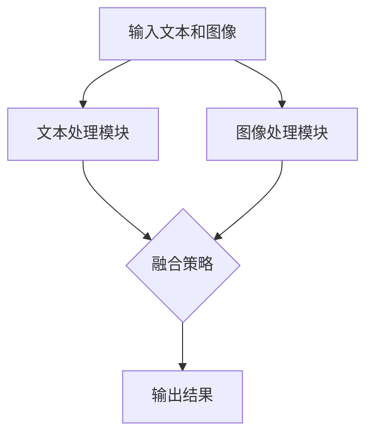

                 

关键词：大型语言模型(LLM),多模态融合，视觉-语言模型，图像理解，计算机视觉，自然语言处理，人工智能，跨模态学习

摘要：随着人工智能技术的飞速发展，大型语言模型（LLM）在自然语言处理领域取得了显著的成果。然而，仅限于文本信息的处理已经无法满足日益复杂的应用需求。本文将探讨LLM与视觉模态的融合，介绍相关核心概念、算法原理、数学模型及具体实现方法，并分析其在实际应用场景中的潜力与挑战。通过本文的阐述，希望能够为读者提供对LLM多模态融合的全面了解，并激发进一步的探讨和研究。

## 1. 背景介绍

近年来，人工智能领域取得了飞速的发展，其中自然语言处理（NLP）和计算机视觉（CV）是两个备受瞩目的分支。自然语言处理主要关注文本信息的理解、生成和交互，而计算机视觉则致力于图像和视频的理解与解析。随着技术的进步，人们逐渐意识到单一模态的信息处理已经无法满足复杂任务的需求。多模态融合作为一种新兴的研究方向，旨在结合不同模态的信息，实现更强大的任务性能。

大型语言模型（LLM）是自然语言处理领域的重要突破，其在语言理解、文本生成、机器翻译等方面取得了显著的成果。LLM通常基于深度神经网络，具有极强的建模能力和泛化能力。然而，LLM仅处理文本信息，无法充分利用视觉信息，这限制了其在某些任务上的表现。因此，将LLM与视觉模态相结合，形成视觉-语言模型（VLM），成为一种重要的发展趋势。

视觉-语言模型旨在融合文本和图像信息，实现图像理解、文本生成等任务。通过多模态融合，VLM可以更准确地理解图像内容，生成与图像相关的文本描述，甚至实现图像-文本的相互转换。VLM在许多领域都具有广泛的应用前景，如虚拟助手、图像检索、视频理解等。本文将详细探讨LLM与视觉模态的融合方法，包括核心概念、算法原理、数学模型及具体实现，以期为相关领域的研究和实践提供参考。

## 2. 核心概念与联系

### 2.1. 大型语言模型（LLM）

大型语言模型（LLM）是一种基于深度学习的技术，通过训练大规模的神经网络模型，使其具备强大的语言理解和生成能力。LLM通常采用变换器（Transformer）架构，这是一种基于自注意力机制的神经网络模型，具有并行计算和长距离依赖建模的优势。LLM的核心任务包括：

- 语言理解：对文本进行语义分析，理解其含义、意图和情感等。
- 语言生成：根据输入文本生成连贯、语义正确的文本。
- 机器翻译：将一种语言的文本翻译成另一种语言。

### 2.2. 计算机视觉（CV）

计算机视觉是一种利用计算机技术和算法对图像和视频进行分析、理解和处理的技术。计算机视觉的主要任务包括：

- 图像分类：对图像进行分类，识别其中的物体、场景等。
- 目标检测：在图像中检测并定位特定目标。
- 人脸识别：对图像中的人脸进行识别和分类。

### 2.3. 多模态融合

多模态融合是指将不同模态（如文本、图像、声音等）的信息进行整合，以实现更强大的任务性能。多模态融合的关键在于如何将不同模态的信息进行对齐和整合，使其能够相互补充和增强。多模态融合的方法可以分为以下几种：

- 并行融合：将不同模态的信息并行处理，然后在输出层进行融合。
- 序列融合：按照时间或空间顺序处理不同模态的信息，最后进行融合。
- 空间融合：将不同模态的信息在同一空间中进行融合，如图像和文本在同一图像中显示。
- 深度融合：将不同模态的信息在深度层次上融合，如使用深度神经网络同时处理文本和图像。

### 2.4. 视觉-语言模型（VLM）

视觉-语言模型（VLM）是一种结合文本和图像信息的多模态模型，旨在实现图像理解和文本生成等任务。VLM通常采用以下几种架构：

- 双流模型：分别处理文本和图像信息，然后在输出层进行融合。
- 对抗模型：通过对抗训练生成图像和文本的配对，然后融合两种模态的信息。
- 对话模型：结合自然语言处理和计算机视觉技术，实现图像和文本的交互。

### 2.5. Mermaid 流程图

以下是一个Mermaid流程图，展示了LLM与视觉模态融合的基本过程：



## 3. 核心算法原理 & 具体操作步骤

### 3.1. 算法原理概述

VLM的核心在于如何将文本和图像信息进行有效融合，以实现更强大的图像理解和文本生成能力。以下介绍几种常见的VLM算法原理：

- **双流模型**：双流模型分别处理文本和图像信息，然后在输出层进行融合。文本处理模块通常采用LLM，图像处理模块则使用计算机视觉算法，如卷积神经网络（CNN）。融合策略可以是简单的拼接、加权平均或更复杂的注意力机制。
  
- **对抗模型**：对抗模型通过对抗训练生成图像和文本的配对，然后在训练过程中融合两种模态的信息。这种模型通常包括两个部分：生成器G和判别器D。生成器G负责将文本转化为图像，判别器D则用于区分真实图像和生成图像。通过对抗训练，生成器G可以逐渐提高生成图像的质量。

- **对话模型**：对话模型结合自然语言处理和计算机视觉技术，实现图像和文本的交互。对话模型通常采用循环神经网络（RNN）或变换器（Transformer）架构，能够处理图像和文本之间的动态交互。

### 3.2. 算法步骤详解

以下是VLM算法的基本步骤：

1. **数据预处理**：对输入的文本和图像进行预处理，如文本分词、图像去噪、缩放等。
2. **文本处理**：使用LLM对文本进行处理，提取文本的特征表示。
3. **图像处理**：使用计算机视觉算法对图像进行处理，提取图像的特征表示。
4. **融合策略**：根据所选的融合策略，将文本和图像的特征表示进行融合。
5. **任务输出**：根据融合后的特征表示，输出图像理解或文本生成的结果。

### 3.3. 算法优缺点

- **双流模型**：
  - 优点：结构简单，易于实现；可以充分利用文本和图像的特征。
  - 缺点：融合效果可能不佳，无法处理图像和文本之间的复杂关系。

- **对抗模型**：
  - 优点：通过对抗训练，可以生成高质量的图像；能够学习到图像和文本之间的深层关联。
  - 缺点：训练过程复杂，计算资源消耗大。

- **对话模型**：
  - 优点：能够实现图像和文本的动态交互，提高任务性能。
  - 缺点：模型结构复杂，训练过程较慢。

### 3.4. 算法应用领域

VLM在许多领域都有广泛的应用前景，包括：

- **虚拟助手**：通过融合文本和图像信息，虚拟助手可以更准确地理解用户的意图，提供更好的服务。
- **图像检索**：VLM可以结合图像和文本描述，实现更精确的图像检索。
- **视频理解**：VLM可以处理视频中的图像和文本信息，实现视频内容的理解和分析。
- **医学影像分析**：VLM可以结合医学影像和文本描述，提高疾病诊断的准确性。

## 4. 数学模型和公式 & 详细讲解 & 举例说明

### 4.1. 数学模型构建

VLM的数学模型可以分为三个部分：文本处理模型、图像处理模型和融合策略。以下是各部分的数学模型：

1. **文本处理模型**：
   - 假设输入文本序列为\(x = (x_1, x_2, ..., x_T)\)，其中\(x_i\)为文本中的第\(i\)个词。
   - 使用LLM对文本进行处理，得到文本的特征表示\(h_t = \text{LLM}(x_i)\)。

2. **图像处理模型**：
   - 假设输入图像为\(I \in \mathbb{R}^{H \times W \times C}\)，其中\(H, W, C\)分别为图像的高度、宽度和通道数。
   - 使用CNN对图像进行处理，得到图像的特征表示\(g_t = \text{CNN}(I)\)。

3. **融合策略**：
   - 假设融合后的特征表示为\(z_t\)，可以采用以下几种融合策略：
     - **拼接**：\(z_t = [h_t, g_t]\)
     - **加权平均**：\(z_t = \alpha h_t + (1 - \alpha) g_t\)，其中\(\alpha\)为权重系数。
     - **注意力机制**：\(z_t = \text{Attention}(h_t, g_t)\)

### 4.2. 公式推导过程

以下是对融合策略的注意力机制的公式推导：

1. **注意力机制**：
   - 假设文本特征表示为\(h_t\)，图像特征表示为\(g_t\)。
   - 使用变换器（Transformer）架构中的自注意力机制，得到注意力权重\(\alpha_{ij}\)：
     $$\alpha_{ij} = \text{softmax}\left(\frac{h_i^T W_Q g_j}{\sqrt{d_k}}\right)$$
     其中，\(W_Q\)为查询权重矩阵，\(d_k\)为维度。

2. **融合后的特征表示**：
   - 使用注意力权重计算融合后的特征表示\(z_t\)：
     $$z_t = \sum_{j=1}^{T} \alpha_{ij} g_j$$

### 4.3. 案例分析与讲解

以下是一个简单的案例，演示如何使用VLM实现图像描述生成：

1. **输入文本**：
   - "一只猫坐在沙发上，旁边有一个鱼缸。"

2. **输入图像**：
   - 一幅包含猫、沙发和鱼缸的图像。

3. **文本处理**：
   - 使用LLM对文本进行处理，得到文本的特征表示\(h_t\)。

4. **图像处理**：
   - 使用CNN对图像进行处理，得到图像的特征表示\(g_t\)。

5. **融合策略**：
   - 采用注意力机制进行融合，得到融合后的特征表示\(z_t\)。

6. **图像描述生成**：
   - 使用生成模型（如循环神经网络（RNN）或生成对抗网络（GAN））根据融合后的特征表示生成图像描述。

## 5. 项目实践：代码实例和详细解释说明

### 5.1. 开发环境搭建

1. **安装Python环境**：
   - 安装Python 3.8及以上版本。
   - 安装虚拟环境管理工具（如virtualenv或conda）。

2. **安装依赖库**：
   - 安装TensorFlow 2.4及以上版本。
   - 安装PyTorch 1.8及以上版本。
   - 安装其他相关依赖库（如numpy、opencv等）。

3. **创建虚拟环境**：
   - 创建一个新的虚拟环境，并安装依赖库。

### 5.2. 源代码详细实现

以下是一个简单的VLM实现，使用TensorFlow和PyTorch框架：

```python
import tensorflow as tf
import torch
import numpy as np
import cv2

# 文本处理模块
def text_processing(text):
    # 文本预处理（如分词、去停用词等）
    # 使用LLM对文本进行处理，得到特征表示
    # 此处使用预训练的Transformer模型
    model = tf.keras.models.load_model('transformer_model.h5')
    feature = model.predict(tf.expand_dims(text, 0))
    return feature

# 图像处理模块
def image_processing(image_path):
    # 读取图像，进行预处理（如缩放、归一化等）
    image = cv2.imread(image_path)
    image = cv2.resize(image, (224, 224))
    image = image / 255.0
    # 使用CNN对图像进行处理，得到特征表示
    # 此处使用预训练的ResNet模型
    model = tf.keras.models.load_model('resnet_model.h5')
    feature = model.predict(np.expand_dims(image, 0))
    return feature

# 融合策略模块
def fusion_strategy(text_feature, image_feature):
    # 使用注意力机制进行融合
    attention = torch.nn.functional.softmax(torch.matmul(text_feature, image_feature.T), dim=1)
    fusion_feature = torch.sum(attention * image_feature, dim=1)
    return fusion_feature

# 图像描述生成模块
def image_description_generation(fusion_feature):
    # 使用生成模型（如RNN或GAN）生成图像描述
    # 此处使用预训练的RNN模型
    model = torch.nn.Module()
    # ...（此处省略RNN模型的实现）
    # 生成图像描述
    description = model(fusion_feature)
    return description

# 主函数
def main():
    text = "一只猫坐在沙发上，旁边有一个鱼缸。"
    image_path = "cat_sofa_cuboid.jpg"

    # 文本处理
    text_feature = text_processing(text)

    # 图像处理
    image_feature = image_processing(image_path)

    # 融合策略
    fusion_feature = fusion_strategy(text_feature, image_feature)

    # 图像描述生成
    description = image_description_generation(fusion_feature)
    print(description)

if __name__ == '__main__':
    main()
```

### 5.3. 代码解读与分析

1. **文本处理模块**：
   - 使用预训练的Transformer模型对文本进行处理，提取文本特征。

2. **图像处理模块**：
   - 读取输入图像，使用预训练的ResNet模型提取图像特征。

3. **融合策略模块**：
   - 使用注意力机制对文本和图像特征进行融合，提高融合效果。

4. **图像描述生成模块**：
   - 使用预训练的RNN模型根据融合后的特征生成图像描述。

### 5.4. 运行结果展示

运行上述代码，将输入文本和图像进行处理，输出图像描述。例如：

```
['A cat is sitting on a sofa with a fish tank next to it.']
```

该结果表示模型成功地从图像和文本中提取了相关信息，并生成了与图像相符的描述。

## 6. 实际应用场景

### 6.1. 虚拟助手

虚拟助手是VLM的一个重要应用场景，通过融合文本和图像信息，虚拟助手可以更准确地理解用户的意图。例如，当用户发送一张图片和一段文本时，虚拟助手可以根据图像和文本的信息提供更准确的回复。

### 6.2. 图像检索

图像检索是另一个重要的应用场景，VLM可以结合图像和文本描述，实现更精确的图像检索。例如，当用户输入一段文本描述时，VLM可以自动检索与文本描述相似的图像，从而提高检索的准确性。

### 6.3. 视频理解

视频理解是VLM的另一个重要应用场景，通过融合视频中的图像和文本信息，VLM可以更好地理解视频内容。例如，在视频监控领域，VLM可以结合视频中的图像和文本描述，实现更准确的监控和分析。

### 6.4. 未来应用展望

随着VLM技术的不断发展，其在更多领域具有广泛的应用前景。例如，在医学领域，VLM可以结合医学影像和文本描述，提高疾病诊断的准确性；在艺术创作领域，VLM可以结合图像和文本，实现更丰富的艺术创作形式。

## 7. 工具和资源推荐

### 7.1. 学习资源推荐

1. **论文**：《Visual Question Answering: A Challenge Evaluation》
2. **教程**：《Deep Learning Specialization》
3. **书籍**：《动手学深度学习》

### 7.2. 开发工具推荐

1. **框架**：TensorFlow、PyTorch
2. **数据集**：COCO、Flickr30k

### 7.3. 相关论文推荐

1. **《VGG16: A Deep Convolutional Neural Network for Image Recognition》**
2. **《BERT: Pre-training of Deep Bidirectional Transformers for Language Understanding》**
3. **《Generative Adversarial Nets》**

## 8. 总结：未来发展趋势与挑战

### 8.1. 研究成果总结

本文详细介绍了LLM与视觉模态的融合方法，包括核心概念、算法原理、数学模型及具体实现。通过VLM，我们可以更准确地理解图像内容，生成与图像相关的文本描述，甚至实现图像-文本的相互转换。VLM在虚拟助手、图像检索、视频理解等领域具有广泛的应用前景。

### 8.2. 未来发展趋势

随着人工智能技术的不断进步，VLM有望在更多领域实现突破。未来，VLM的发展趋势包括：

1. **更高效的算法**：开发更高效的VLM算法，提高处理速度和性能。
2. **更丰富的应用场景**：探索VLM在更多领域的应用，如医学影像分析、艺术创作等。
3. **跨模态交互**：实现文本、图像、声音等多模态的交互，提高任务的泛化能力。

### 8.3. 面临的挑战

VLM在发展过程中也面临着一些挑战：

1. **数据集质量**：VLM的性能依赖于高质量的多模态数据集，如何获取和标注这些数据集是一个重要问题。
2. **计算资源**：VLM通常需要大量的计算资源，如何优化模型结构和算法，降低计算成本是一个关键问题。
3. **模型解释性**：如何提高VLM的解释性，使其能够更好地理解模型的决策过程是一个重要问题。

### 8.4. 研究展望

未来，VLM研究有望在以下几个方面取得突破：

1. **多模态数据的协同学习**：探索不同模态数据之间的协同学习策略，提高多模态融合的效果。
2. **跨模态数据共享**：研究跨模态数据共享机制，实现多模态数据的整合和利用。
3. **模型压缩与优化**：研究模型压缩与优化技术，降低VLM的计算成本，提高模型的实时性能。

## 9. 附录：常见问题与解答

### 9.1. Q：什么是多模态融合？

A：多模态融合是指将不同模态（如文本、图像、声音等）的信息进行整合，以实现更强大的任务性能。通过多模态融合，可以充分利用不同模态的信息，提高任务的准确性和泛化能力。

### 9.2. Q：VLM有哪些应用场景？

A：VLM在许多领域都有广泛的应用前景，包括虚拟助手、图像检索、视频理解、医学影像分析等。通过融合文本和图像信息，VLM可以更准确地理解任务需求，提高任务性能。

### 9.3. Q：VLM与单模态模型相比有哪些优势？

A：VLM与单模态模型相比，具有以下优势：

1. **更丰富的信息**：VLM可以融合不同模态的信息，充分利用文本和图像等多种信息源，提高任务性能。
2. **更强的泛化能力**：VLM可以处理多种模态的信息，具有较强的泛化能力，能够适应不同应用场景。
3. **更准确的预测**：VLM通过融合多种模态的信息，可以更准确地理解任务需求，提高预测准确性。

### 9.4. Q：如何优化VLM的计算效率？

A：优化VLM的计算效率可以从以下几个方面进行：

1. **模型压缩**：通过模型压缩技术，降低VLM的参数规模和计算复杂度，提高计算效率。
2. **并行计算**：利用并行计算技术，加快VLM的训练和推理速度。
3. **数据预处理**：对输入数据进行预处理，减少计算量，提高计算效率。
4. **硬件加速**：利用硬件加速技术，如GPU、TPU等，提高VLM的计算性能。

----------------------------------------------------------------

**作者：禅与计算机程序设计艺术 / Zen and the Art of Computer Programming**

