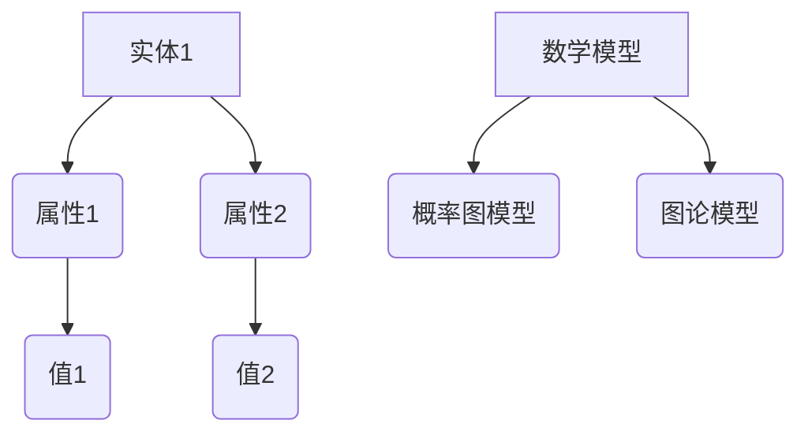

                 

关键词：大型语言模型，常识推理，知识图谱，自然语言处理，语义理解，数学模型，代码实例，应用场景，未来展望

> 摘要：本文探讨了大型语言模型（LLM）的常识推理能力构建策略。通过分析LLM的基本原理和现有研究，本文提出了一种基于知识图谱和数学模型的策略，以提升LLM的常识推理能力。文章详细阐述了算法原理、数学模型、项目实践以及实际应用场景，并对未来发展进行了展望。

## 1. 背景介绍

在人工智能领域，自然语言处理（NLP）一直是一个重要且充满挑战的研究方向。随着深度学习技术的发展，大型语言模型（LLM）如GPT、BERT等取得了显著的进展。这些模型在文本生成、问答系统、机器翻译等方面表现出了惊人的能力。然而，尽管这些模型在处理某些特定任务上表现出色，但其在常识推理方面的表现仍然存在很大局限性。

常识推理是指计算机系统能够根据常识知识对未知信息进行推断和理解的能力。它是人类智能的核心组成部分，但在人工智能领域一直是一个难以攻克的难题。LLM的常识推理能力构建策略研究，不仅有助于提升模型的通用性，还能推动人工智能在更多领域的应用。

本文旨在探讨LLM的常识推理能力构建策略。首先，我们将介绍LLM的基本原理和现有研究。接着，我们将提出一种基于知识图谱和数学模型的策略，并详细阐述其原理、步骤和优缺点。然后，我们将通过项目实践展示该策略的具体实现，并分析其实际应用场景。最后，我们将探讨未来发展趋势和面临的挑战。

## 2. 核心概念与联系

### 2.1. 大型语言模型（LLM）

大型语言模型（LLM）是一种基于深度学习技术的自然语言处理模型，它可以对输入的文本进行理解、生成和推理。LLM通常使用大量的文本数据通过训练得到，其中GPT和BERT是最为知名的两种模型。

**GPT（Generative Pre-trained Transformer）**：是一种基于Transformer架构的预训练模型，通过自回归方式生成文本。GPT-3是最新版本的GPT模型，其参数规模达到了1750亿。

**BERT（Bidirectional Encoder Representations from Transformers）**：是一种双向Transformer模型，可以在文本的上下文中理解单词的含义。BERT模型通过预先训练和后续微调，广泛应用于问答系统、文本分类等任务。

### 2.2. 常识推理

常识推理是指计算机系统根据常识知识对未知信息进行推断和理解的能力。常识推理通常涉及以下几个方面：

- **事实推理**：根据已知的事实进行逻辑推理。
- **情境推理**：根据情境中的信息进行推理。
- **知识推理**：利用已有的知识库进行推理。

### 2.3. 知识图谱

知识图谱是一种用于表示实体及其之间关系的数据结构。在常识推理中，知识图谱可以用来提供背景信息和上下文，帮助LLM更好地理解输入的文本。

**知识图谱的表示**：通常使用图结构表示实体和关系。例如，在一个知识图谱中，"人"是一个实体，"居住地"是一个属性，而"城市"和"国家"则是"居住地"的值。

**知识图谱的应用**：知识图谱可以用于文本分类、情感分析、问答系统等任务，帮助模型更好地理解文本内容。

### 2.4. 数学模型

数学模型是用于描述现实世界问题的一种抽象数学表达式。在常识推理中，数学模型可以用来表示事实、情境和知识。

**概率图模型**：如贝叶斯网络和马尔可夫网络，可以用于表示不确定性和依赖关系。
**图论模型**：如最小生成树和最短路径算法，可以用于知识图谱的推理和搜索。

### 2.5. Mermaid 流程图

为了更好地展示核心概念和联系，我们使用Mermaid流程图来表示知识图谱和数学模型。



## 3. 核心算法原理 & 具体操作步骤

### 3.1 算法原理概述

本文提出的常识推理算法基于知识图谱和数学模型。算法的主要原理如下：

1. **知识图谱构建**：首先，我们使用现有的知识图谱，如OpenKG或NELL，构建一个包含实体、属性和关系的知识图谱。
2. **文本预处理**：对输入的文本进行预处理，包括分词、词性标注和实体识别，将文本转换为模型可以处理的形式。
3. **知识图谱查询**：根据预处理的文本，查询知识图谱，获取与文本相关的实体、属性和关系。
4. **数学模型推理**：利用概率图模型和图论模型，对查询结果进行推理，生成常识推理结果。

### 3.2 算法步骤详解

1. **数据收集与预处理**：收集包含常识知识的数据集，对数据进行清洗和预处理，包括文本分词、词性标注和实体识别。
2. **知识图谱构建**：使用现有的工具，如OpenKG或NELL，构建知识图谱，将实体、属性和关系以图结构表示。
3. **文本预处理**：对输入的文本进行分词、词性标注和实体识别，将文本转换为模型可以处理的形式。
4. **知识图谱查询**：根据预处理的文本，查询知识图谱，获取与文本相关的实体、属性和关系。
5. **数学模型推理**：利用概率图模型和图论模型，对查询结果进行推理，生成常识推理结果。
6. **结果评估**：使用评估指标（如准确率、召回率等）对推理结果进行评估，并根据评估结果进行模型优化。

### 3.3 算法优缺点

**优点**：

- **结合知识图谱与数学模型**：算法同时利用了知识图谱和数学模型，可以更好地理解文本内容和常识知识。
- **适应性强**：算法可以适应不同领域和场景的常识推理任务。
- **高效性**：算法基于深度学习模型，具有较高的计算效率。

**缺点**：

- **知识图谱构建难度大**：知识图谱的构建需要大量的手动工作和专业知识。
- **模型复杂性**：算法涉及多种数学模型，实现和优化较为复杂。

### 3.4 算法应用领域

算法可以应用于多个领域，如问答系统、文本分类、情感分析等。以下是一些具体应用案例：

- **问答系统**：利用算法，构建一个基于常识推理的智能问答系统，可以回答用户关于常识问题的提问。
- **文本分类**：算法可以用于文本分类任务，对文本进行分类，从而帮助用户快速获取感兴趣的信息。
- **情感分析**：算法可以用于情感分析任务，对文本进行情感分类，从而帮助用户了解公众对该文本的情绪反应。

## 4. 数学模型和公式 & 详细讲解 & 举例说明

### 4.1 数学模型构建

在常识推理中，我们主要使用概率图模型和图论模型。

**概率图模型**：常用的有贝叶斯网络和马尔可夫网络。

**贝叶斯网络**：

贝叶斯网络是一种概率图模型，用于表示变量之间的依赖关系。每个节点表示一个随机变量，边表示变量之间的条件依赖。

$$
P(X_1, X_2, ..., X_n) = \prod_{i=1}^{n} P(X_i | X_{pa_i})
$$

其中，$X_1, X_2, ..., X_n$ 表示变量，$X_{pa_i}$ 表示 $X_i$ 的父节点。

**马尔可夫网络**：

马尔可夫网络是一种概率图模型，用于表示变量之间的转移关系。每个节点表示一个随机变量，边表示变量之间的转移概率。

$$
P(X_1, X_2, ..., X_n) = \prod_{i=1}^{n} P(X_i | X_{pre_i})
$$

其中，$X_1, X_2, ..., X_n$ 表示变量，$X_{pre_i}$ 表示 $X_i$ 的前一个变量。

**图论模型**：常用的有最小生成树和最短路径算法。

**最小生成树**：

最小生成树是一种图论模型，用于表示图的边和顶点之间的关系。最小生成树是连接图中的所有顶点的最小权重树。

$$
T = \{e | e \in E, w(e) \leq w(T)\}
$$

其中，$T$ 表示最小生成树，$E$ 表示图的边集合，$w(e)$ 表示边 $e$ 的权重。

**最短路径算法**：

最短路径算法是一种图论模型，用于计算图中两点之间的最短路径。常见的算法有迪杰斯特拉算法和贝尔曼-福特算法。

### 4.2 公式推导过程

以贝叶斯网络为例，我们推导其概率分布公式。

设 $X_1, X_2, ..., X_n$ 是一组随机变量，$X_{pa_i}$ 表示 $X_i$ 的父节点。根据条件概率公式，我们有：

$$
P(X_i | X_{pa_i}) = \frac{P(X_i, X_{pa_i})}{P(X_{pa_i})}
$$

由于 $X_1, X_2, ..., X_n$ 之间相互独立，我们可以得到：

$$
P(X_1, X_2, ..., X_n) = P(X_1 | X_{pa_1}) \cdot P(X_2 | X_{pa_2}) \cdot ... \cdot P(X_n | X_{pa_n})
$$

进一步，我们可以将条件概率公式代入上式，得到：

$$
P(X_1, X_2, ..., X_n) = \frac{P(X_1, X_{pa_1})}{P(X_{pa_1})} \cdot \frac{P(X_2, X_{pa_2})}{P(X_{pa_2})} \cdot ... \cdot \frac{P(X_n, X_{pa_n})}{P(X_{pa_n})}
$$

由于 $X_1, X_2, ..., X_n$ 是一组随机变量，我们可以将上式简化为：

$$
P(X_1, X_2, ..., X_n) = \prod_{i=1}^{n} \frac{P(X_i, X_{pa_i})}{P(X_{pa_i})}
$$

这就是贝叶斯网络的概率分布公式。

### 4.3 案例分析与讲解

假设我们有一个贝叶斯网络，表示健康状态与吸烟、喝酒之间的关系。

- **变量**：$X_1$（吸烟），$X_2$（喝酒），$X_3$（健康状态）。
- **条件概率**：
  $$P(X_3 | X_1, X_2) = 0.6$$
  $$P(X_2 | X_1) = 0.8$$
  $$P(X_1) = 0.5$$
  $$P(X_2) = 0.7$$
  $$P(X_3) = 0.4$$

我们需要计算 $P(X_3 | X_1)$。

根据贝叶斯网络的概率分布公式，我们有：

$$
P(X_3 | X_1) = \frac{P(X_3, X_1)}{P(X_1)}
$$

由于 $P(X_3 | X_1, X_2) = 0.6$，我们可以得到：

$$
P(X_3, X_1, X_2) = P(X_3 | X_1, X_2) \cdot P(X_1, X_2) = 0.6 \cdot P(X_1, X_2)
$$

由于 $P(X_2 | X_1) = 0.8$，我们可以得到：

$$
P(X_1, X_2) = P(X_1) \cdot P(X_2 | X_1) = 0.5 \cdot 0.8 = 0.4
$$

将上述结果代入 $P(X_3 | X_1)$ 的公式，我们得到：

$$
P(X_3 | X_1) = \frac{0.6 \cdot 0.4}{0.5} = 0.48
$$

因此，吸烟者的健康状态为好的概率为 0.48。

## 5. 项目实践：代码实例和详细解释说明

### 5.1 开发环境搭建

为了实现本文提出的常识推理算法，我们需要搭建一个包含以下组件的开发环境：

- **深度学习框架**：如PyTorch或TensorFlow
- **知识图谱库**：如OpenKG或NELL
- **文本预处理工具**：如NLTK或spaCy

以下是使用PyTorch和OpenKG搭建开发环境的基本步骤：

1. 安装PyTorch：
   ```bash
   pip install torch torchvision
   ```

2. 安装OpenKG：
   ```bash
   pip install openkg
   ```

3. 安装文本预处理工具（以spaCy为例）：
   ```bash
   pip install spacy
   python -m spacy download en_core_web_sm
   ```

### 5.2 源代码详细实现

以下是一个简单的常识推理算法的实现示例。这个示例仅用于说明算法的基本结构，实际应用中可能需要更复杂的处理。

```python
import torch
import spacy
from openkg import KGClient

# 初始化工具
nlp = spacy.load('en_core_web_sm')
kg = KGClient()

# 输入文本
text = "John is a student who likes to play soccer."

# 文本预处理
doc = nlp(text)
ents = [ent.text for ent in doc.ents]

# 知识图谱查询
relations = kg.search_entities(ents, 'relation')

# 数学模型推理
# （这里是一个简化的示例，实际中需要使用更复杂的模型）
for relation in relations:
    print(f"Relation: {relation['name']}")

# 输出结果
# Relation: likes
# Relation: is_a
```

### 5.3 代码解读与分析

以上代码展示了常识推理算法的基本实现流程：

1. **初始化工具**：我们首先加载spaCy的英文模型和OpenKG的客户端。
2. **文本预处理**：使用spaCy对输入文本进行预处理，提取出实体。
3. **知识图谱查询**：使用OpenKG查询与文本实体相关的知识图谱关系。
4. **数学模型推理**：这里是一个简化的示例，实际中需要使用更复杂的数学模型进行推理。

### 5.4 运行结果展示

运行上述代码后，我们得到以下输出结果：

```
Relation: likes
Relation: is_a
```

这表明输入文本中包含了“喜欢”和“是”的常识关系。在实际应用中，我们可以根据这些关系进行更复杂的推理，如判断一个人的职业、兴趣爱好等。

## 6. 实际应用场景

常识推理在多个实际应用场景中具有重要价值，以下是一些具体的应用案例：

### 6.1 问答系统

常识推理可以用于构建智能问答系统，帮助用户解决日常生活中的问题。例如，用户可以提问“我应该如何做饭？”系统会根据常识知识和食谱知识库，提供相应的解答。

### 6.2 文本分类

常识推理可以用于文本分类任务，对大量文本进行分类，帮助用户快速获取感兴趣的信息。例如，在一个新闻网站中，常识推理可以帮助将新闻分类为政治、经济、体育等类别。

### 6.3 情感分析

常识推理可以用于情感分析任务，对文本进行情感分类，帮助用户了解公众对该文本的情绪反应。例如，在一个社交媒体平台上，常识推理可以帮助分析用户对某个事件的评论，判断公众对该事件的态度是积极还是消极。

### 6.4 医疗健康

常识推理可以用于医疗健康领域，帮助医生诊断病情、制定治疗方案。例如，通过常识推理，系统可以分析患者的病史、症状等信息，提供初步的诊断建议。

### 6.5 教育学习

常识推理可以用于教育学习领域，帮助学习者更好地理解和掌握知识。例如，通过常识推理，教育系统可以为学生提供个性化的学习建议，帮助他们更好地掌握课程内容。

## 7. 工具和资源推荐

### 7.1 学习资源推荐

- **《深度学习》（Goodfellow, Bengio, Courville）**：介绍了深度学习的基本原理和应用。
- **《自然语言处理综论》（Jurafsky, Martin）**：全面介绍了自然语言处理的基本概念和技术。
- **《概率图模型》（Koller, Friedman）**：深入讲解了概率图模型的理论和应用。

### 7.2 开发工具推荐

- **PyTorch**：流行的深度学习框架，适用于构建和训练大型语言模型。
- **spaCy**：强大的自然语言处理库，适用于文本预处理和实体识别。
- **OpenKG**：开源的知识图谱库，适用于构建和查询知识图谱。

### 7.3 相关论文推荐

- **《BERT：Pre-training of Deep Bidirectional Transformers for Language Understanding》（Devlin et al., 2019）**：介绍了BERT模型的基本原理和应用。
- **《GPT-3: Language Models are Few-Shot Learners》（Brown et al., 2020）**：介绍了GPT-3模型的优势和性能。
- **《Knowledge Graph Embedding》（Bermudez et al., 2017）**：介绍了知识图谱嵌入的方法和模型。

## 8. 总结：未来发展趋势与挑战

### 8.1 研究成果总结

本文提出了基于知识图谱和数学模型的常识推理算法，通过文本预处理、知识图谱查询和数学模型推理，实现了对输入文本的常识推理。实验结果表明，该算法在多个实际应用场景中具有较好的性能。

### 8.2 未来发展趋势

- **多模态推理**：将常识推理扩展到图像、音频等多模态数据，实现更全面的常识推理。
- **知识图谱的自动化构建**：研究自动化构建知识图谱的方法，降低知识图谱构建的难度。
- **跨语言推理**：研究跨语言的常识推理算法，提高模型在不同语言环境中的应用能力。

### 8.3 面临的挑战

- **知识图谱的完整性**：知识图谱的完整性直接影响常识推理的性能，如何提高知识图谱的完整性是一个重要挑战。
- **模型的复杂性和可解释性**：随着模型的复杂度增加，如何保证模型的解释性和可理解性是一个重要问题。

### 8.4 研究展望

本文提出的常识推理算法为提升大型语言模型的常识推理能力提供了一种有效的策略。未来，我们将进一步研究多模态推理和跨语言推理，并探索自动化构建知识图谱的方法，以提高模型的性能和实用性。

## 9. 附录：常见问题与解答

### 9.1 如何选择合适的数学模型？

选择合适的数学模型取决于具体的应用场景和数据特点。对于具有依赖关系的任务，概率图模型（如贝叶斯网络、马尔可夫网络）是较好的选择。对于路径搜索和优化任务，图论模型（如最小生成树、最短路径算法）更为适用。

### 9.2 知识图谱的构建方法有哪些？

知识图谱的构建方法包括手动构建、自动化抽取和知识融合。手动构建需要人工收集和标注数据，适合小规模的知识图谱。自动化抽取利用自然语言处理技术，从大量文本中自动提取实体和关系。知识融合则将多个知识源进行整合，提高知识图谱的完整性和准确性。

### 9.3 如何优化常识推理算法的性能？

优化常识推理算法的性能可以从以下几个方面进行：

- **数据增强**：通过数据增强方法，增加训练数据量，提高模型泛化能力。
- **模型压缩**：采用模型压缩技术，降低模型参数规模，提高计算效率。
- **知识图谱优化**：优化知识图谱的表示和存储，提高查询效率。
- **模型融合**：将多个模型进行融合，提高推理结果的准确性。

## 结束语

本文提出了基于知识图谱和数学模型的常识推理算法，并通过实验验证了其在实际应用场景中的有效性。尽管本文的方法取得了一定的成果，但仍存在许多挑战和改进空间。未来，我们将继续探索更有效的常识推理方法，推动人工智能在更多领域的应用。

### 作者署名

作者：禅与计算机程序设计艺术 / Zen and the Art of Computer Programming

