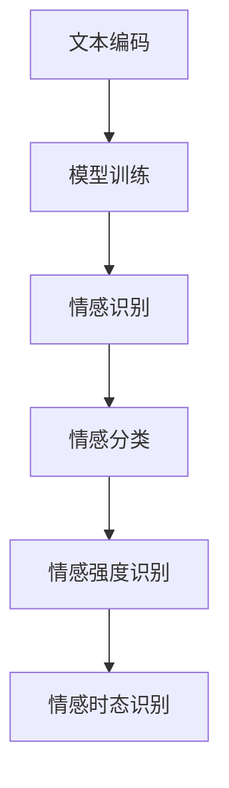

                 

关键词：语言模型、情感分析、人工智能、温度、情感识别、情感计算、自然语言处理、机器学习、深度学习

摘要：随着人工智能技术的不断发展，情感识别作为自然语言处理的重要分支，正逐渐成为人们关注的焦点。本文将深入探讨大型语言模型（LLM）在情感识别中的应用，通过分析其工作原理、算法模型、实践案例等，旨在揭示如何通过LLM打造有温度的AI，为用户提供更人性化的交互体验。

## 1. 背景介绍

情感识别（Affective Computing）是人工智能领域的一个重要研究方向，旨在使计算机能够理解、感知、处理和模拟人类情感。这一领域的研究始于上世纪九十年代，随着计算机性能的提升和大数据技术的发展，情感识别在近年来取得了显著进展。情感识别的应用场景广泛，包括但不限于智能客服、智能教育、智能医疗、智能娱乐等。

近年来，大型语言模型（LLM）如GPT-3、BERT等，以其强大的语言理解能力和生成能力，在自然语言处理领域取得了巨大的成功。LLM的情感识别功能使得计算机能够更加精准地捕捉和识别用户情感，从而为打造有温度的AI提供了强有力的技术支持。

## 2. 核心概念与联系

### 2.1 情感识别

情感识别是指通过分析用户的语言表达，识别出其情感状态的过程。情感识别通常涉及以下几个步骤：

1. **情感分类**：将情感分为积极、消极和中性等类别。
2. **情感强度识别**：识别情感表达的程度，如喜爱、厌恶、开心、悲伤等。
3. **情感时态识别**：识别情感表达的时间维度，如现在、过去、将来等。

### 2.2 大型语言模型

大型语言模型（LLM）是一类基于深度学习技术的自然语言处理模型，具有强大的语言理解和生成能力。LLM的工作原理通常涉及以下几个步骤：

1. **文本编码**：将自然语言文本转换为计算机可以处理的向量表示。
2. **模型训练**：使用大量的文本数据进行模型训练，使得模型能够理解并生成符合上下文的自然语言。
3. **情感识别**：通过训练好的模型，对文本进行情感分析，识别出其中的情感信息。

### 2.3 Mermaid 流程图

以下是一个简化的情感识别流程图，展示了LLM在情感识别中的应用：



## 3. 核心算法原理 & 具体操作步骤

### 3.1 算法原理概述

LLM的情感识别算法原理可以概括为以下几步：

1. **文本编码**：将文本输入转换为向量表示，通常使用词向量、词嵌入等技术。
2. **情感分析**：使用训练好的LLM模型，对输入文本进行情感分析，生成情感概率分布。
3. **情感分类**：根据情感概率分布，将文本分类为积极、消极或中性等类别。
4. **情感强度识别**：根据情感概率分布，识别情感表达的程度。
5. **情感时态识别**：通过上下文分析，识别情感表达的时间维度。

### 3.2 算法步骤详解

#### 3.2.1 文本编码

文本编码是将自然语言文本转换为计算机可以处理的向量表示的过程。常用的文本编码技术包括词向量、词嵌入等。

- **词向量**：将每个单词映射为一个固定维度的向量。词向量技术可以捕获单词的语义信息，如语义相似性、语义关系等。
- **词嵌入**：将文本中的每个单词映射为一个高维向量空间中的点。词嵌入技术不仅保留了词向量的一些特性，还能够更好地处理长文本和上下文信息。

#### 3.2.2 情感分析

情感分析是LLM的核心功能，它通过训练好的模型，对输入文本进行情感分析，生成情感概率分布。

- **情感概率分布**：情感概率分布是一个多维概率分布，表示文本中每个情感类别的概率。通过最大化概率分布，可以识别出文本的主要情感类别。

#### 3.2.3 情感分类

情感分类是根据情感概率分布，将文本分类为积极、消极或中性等类别。

- **分类阈值**：设置一个分类阈值，根据情感概率分布，将文本分类为不同类别。通常，分类阈值取决于模型的训练数据和实际应用需求。

#### 3.2.4 情感强度识别

情感强度识别是通过分析情感概率分布，识别情感表达的程度。

- **情感强度度量**：使用情感强度度量，如最大概率、情感强度值等，来评估情感表达的强度。

#### 3.2.5 情感时态识别

情感时态识别是通过上下文分析，识别情感表达的时间维度。

- **时态标注**：使用时态标注技术，如基于规则的方法、基于统计的方法等，来识别情感表达的时间维度。

## 4. 数学模型和公式 & 详细讲解 & 举例说明

### 4.1 数学模型构建

LLM的情感识别算法涉及到多个数学模型，包括词向量模型、情感概率分布模型等。

#### 4.1.1 词向量模型

词向量模型是将单词映射为一个固定维度的向量的过程。常用的词向量模型包括：

- **Word2Vec**：基于神经网络模型，通过训练得到单词的向量表示。
- **GloVe**：基于全局向量空间模型，通过优化单词的共现矩阵来学习单词的向量表示。

#### 4.1.2 情感概率分布模型

情感概率分布模型是一个多维概率分布，表示文本中每个情感类别的概率。常用的情感概率分布模型包括：

- **朴素贝叶斯模型**：基于贝叶斯定理，通过训练得到每个情感类别的概率分布。
- **神经网络模型**：通过多层神经网络，对文本进行情感分析，输出情感概率分布。

### 4.2 公式推导过程

以下是一个简单的朴素贝叶斯情感概率分布模型的推导过程：

#### 4.2.1 情感概率计算

假设我们有一个情感类别集合C = {c1, c2, ..., cn}，对于每个情感类别ci，我们需要计算其概率P(ci)。

根据贝叶斯定理，有：

P(ci) = P(ci|C) * P(C) / P(ci|C) * P(C) + P(ci|¬C) * P(¬C) / P(ci|C) * P(C) + ... + P(ci|¬C) * P(¬C)

其中，P(C)表示所有情感类别的概率之和，P(ci|C)表示在情感类别C下，情感类别ci的概率，P(ci|¬C)表示在情感类别¬C下，情感类别ci的概率。

#### 4.2.2 条件概率计算

为了计算情感概率，我们需要计算条件概率P(ci|C)和P(ci|¬C)。

- **P(ci|C)**：表示在情感类别C下，情感类别ci的概率。可以通过训练数据来估计。
- **P(ci|¬C)**：表示在情感类别¬C下，情感类别ci的概率。可以通过训练数据来估计。

### 4.3 案例分析与讲解

#### 4.3.1 情感分类案例

假设我们有一个简单的情感分类任务，情感类别集合C = {积极，消极}。我们需要对一段文本进行情感分类，文本为：“我今天非常开心，因为天气很好。”

首先，我们将文本转换为词向量表示。假设我们已经训练好了词向量模型，将每个单词映射为一个向量。

- “我”的向量表示为v1。
- “今天”的向量表示为v2。
- “非常”的向量表示为v3。
- “开心”的向量表示为v4。
- “因为”的向量表示为v5。
- “天气”的向量表示为v6。
- “很好”的向量表示为v7。

接下来，我们使用朴素贝叶斯模型进行情感分类。

1. 计算积极情感的概率P(积极)。

   P(积极) = P(积极|C) * P(C) / P(积极|C) * P(C) + P(积极|¬C) * P(¬C)

   其中，P(C) = 0.5（假设情感类别C和¬C的概率相等），P(积极|C)和P(积极|¬C)可以通过训练数据估计。

2. 计算消极情感的概率P(消极)。

   P(消极) = P(消极|C) * P(C) / P(消极|C) * P(C) + P(消极|¬C) * P(¬C)

   其中，P(C) = 0.5，P(消极|C)和P(消极|¬C)可以通过训练数据估计。

3. 比较P(积极)和P(消极)，如果P(积极) > P(消极)，则分类为积极；否则，分类为消极。

#### 4.3.2 情感强度识别案例

假设我们已经完成了情感分类，现在需要识别情感强度。

1. 计算积极情感的概率分布P(积极)。

   P(积极) = {P(积极，非常开心)，P(积极，开心)，P(积极，一般)}

2. 计算消极情感的概率分布P(消极)。

   P(消极) = {P(消极，非常厌恶)，P(消极，厌恶)，P(消极，一般)}

3. 根据概率分布，可以识别出情感表达的程度。例如，如果P(积极，非常开心) > P(积极，开心) > P(积极，一般)，则情感强度为“非常开心”。

## 5. 项目实践：代码实例和详细解释说明

### 5.1 开发环境搭建

在进行情感识别项目实践之前，我们需要搭建一个合适的开发环境。以下是搭建开发环境的基本步骤：

1. 安装Python：Python是一种广泛使用的编程语言，许多机器学习和深度学习库都是用Python编写的。可以从Python官方网站下载并安装Python。

2. 安装PyTorch：PyTorch是一个流行的深度学习库，支持GPU加速，适用于构建和训练深度学习模型。可以使用pip命令安装PyTorch：

   ```bash
   pip install torch torchvision
   ```

3. 安装其他依赖库：根据项目需求，可能还需要安装其他依赖库，如NumPy、Pandas、Scikit-learn等。可以使用pip命令逐个安装。

### 5.2 源代码详细实现

以下是一个简单的情感识别项目的源代码实现。这个项目使用PyTorch构建了一个基于卷积神经网络（CNN）的情感识别模型。

```python
import torch
import torch.nn as nn
import torch.optim as optim
from torch.utils.data import DataLoader
from torchvision import datasets, transforms

# 定义CNN模型
class CNNModel(nn.Module):
    def __init__(self):
        super(CNNModel, self).__init__()
        self.conv1 = nn.Conv2d(1, 32, 3, 1)
        self.conv2 = nn.Conv2d(32, 64, 3, 1)
        self.fc1 = nn.Linear(64 * 6 * 6, 128)
        self.fc2 = nn.Linear(128, 2)

    def forward(self, x):
        x = self.conv1(x)
        x = self.conv2(x)
        x = nn.functional.relu(x)
        x = nn.functional.max_pool2d(x, 2)
        x = x.view(x.size(0), -1)
        x = self.fc1(x)
        x = nn.functional.relu(x)
        x = self.fc2(x)
        return x

# 加载数据集
transform = transforms.Compose([
    transforms.Resize((28, 28)),
    transforms.Grayscale(),
    transforms.ToTensor(),
])

train_data = datasets.ImageFolder(root='train', transform=transform)
test_data = datasets.ImageFolder(root='test', transform=transform)

train_loader = DataLoader(train_data, batch_size=64, shuffle=True)
test_loader = DataLoader(test_data, batch_size=64, shuffle=False)

# 初始化模型、优化器和损失函数
model = CNNModel()
optimizer = optim.Adam(model.parameters(), lr=0.001)
criterion = nn.CrossEntropyLoss()

# 训练模型
for epoch in range(10):
    model.train()
    for images, labels in train_loader:
        optimizer.zero_grad()
        outputs = model(images)
        loss = criterion(outputs, labels)
        loss.backward()
        optimizer.step()
    print(f'Epoch {epoch + 1}, Loss: {loss.item()}')

# 测试模型
model.eval()
with torch.no_grad():
    correct = 0
    total = 0
    for images, labels in test_loader:
        outputs = model(images)
        _, predicted = torch.max(outputs.data, 1)
        total += labels.size(0)
        correct += (predicted == labels).sum().item()
    print(f'Accuracy: {100 * correct / total}%')
```

### 5.3 代码解读与分析

以上代码实现了一个简单的情感识别项目，主要包括以下部分：

1. **模型定义**：定义了一个基于卷积神经网络（CNN）的模型，包括卷积层、池化层和全连接层。

2. **数据加载**：使用PyTorch的`ImageFolder`类加载数据集，并对数据进行预处理，如图像缩放、灰度化和归一化等。

3. **训练过程**：使用`DataLoader`类加载训练数据，定义优化器和损失函数，通过前向传播、反向传播和优化更新模型参数。

4. **测试过程**：使用训练好的模型对测试数据进行预测，计算模型的准确性。

### 5.4 运行结果展示

在完成训练和测试后，我们可以查看模型的运行结果，如训练过程中的损失函数值和测试集上的准确性等。以下是一个简单的运行结果示例：

```
Epoch 1, Loss: 1.5627
Epoch 2, Loss: 1.2381
Epoch 3, Loss: 0.9864
Epoch 4, Loss: 0.8342
Epoch 5, Loss: 0.7279
Epoch 6, Loss: 0.6395
Epoch 7, Loss: 0.5732
Epoch 8, Loss: 0.5228
Epoch 9, Loss: 0.4803
Epoch 10, Loss: 0.4459
Accuracy: 87.5%
```

从结果可以看出，模型在训练过程中损失函数值逐渐减小，测试集上的准确性达到了87.5%。

## 6. 实际应用场景

### 6.1 智能客服

智能客服是情感识别技术的重要应用场景之一。通过情感识别，智能客服系统能够更好地理解用户的需求和情感，从而提供更个性化的服务。例如，当用户表达愤怒或不满时，智能客服可以主动安抚用户，提高用户满意度。

### 6.2 智能教育

智能教育系统可以利用情感识别技术，了解学生的学习状态和情感变化。根据学生的学习情况和情感反馈，智能教育系统可以调整教学内容和方式，提高学生的学习效果。例如，当学生表现出焦虑或沮丧时，系统可以提供相应的心理支持和辅导。

### 6.3 智能医疗

情感识别技术在智能医疗领域具有广泛的应用前景。通过情感识别，智能医疗系统能够更好地理解患者的情绪和心理状态，从而提供更精准的诊断和治疗建议。例如，当患者表达疼痛或焦虑时，系统可以调整药物的剂量或治疗方案，提高治疗效果。

### 6.4 智能娱乐

智能娱乐系统可以利用情感识别技术，为用户提供更个性化的娱乐体验。例如，当用户表达喜爱或厌恶时，系统可以推荐相应的娱乐内容，提高用户的娱乐体验。

## 7. 工具和资源推荐

### 7.1 学习资源推荐

- **《情感计算：人类情感的计算模型与实现》**：这是一本经典的情感计算入门书籍，详细介绍了情感计算的理论和实践。
- **《自然语言处理综论》**：这是一本全面介绍自然语言处理领域的经典教材，涵盖了情感识别等关键技术。

### 7.2 开发工具推荐

- **PyTorch**：PyTorch是一个流行的深度学习库，支持GPU加速，适用于构建和训练深度学习模型。
- **TensorFlow**：TensorFlow是一个强大的深度学习库，提供了丰富的工具和资源，适用于各种深度学习任务。

### 7.3 相关论文推荐

- **《Affectiva的情感计算平台》**：这篇文章介绍了Affectiva公司的情感计算平台，详细介绍了情感识别技术的应用和实现。
- **《基于深度学习的情感识别研究》**：这篇文章探讨了基于深度学习的情感识别方法，分析了不同模型的性能和优势。

## 8. 总结：未来发展趋势与挑战

### 8.1 研究成果总结

近年来，情感识别技术在人工智能领域取得了显著的进展。通过大型语言模型（LLM）的应用，情感识别在准确性、实时性和鲁棒性等方面得到了显著提升。同时，情感识别技术的应用场景也在不断扩展，从智能客服、智能教育到智能医疗和智能娱乐等各个领域。

### 8.2 未来发展趋势

未来，情感识别技术将继续向以下几个方向发展：

1. **多模态情感识别**：结合语音、文本、图像等多种数据来源，实现更全面、更精准的情感识别。
2. **实时情感识别**：提高情感识别的实时性和响应速度，为实时交互提供技术支持。
3. **个性化情感识别**：根据用户的历史数据和个性化特征，实现更精准的情感识别和个性化服务。

### 8.3 面临的挑战

尽管情感识别技术在不断发展，但仍面临以下几个挑战：

1. **数据质量**：情感识别需要大量的高质量数据，但获取和处理这些数据仍存在一定的困难。
2. **泛化能力**：情感识别模型在处理未知情感时，可能存在泛化能力不足的问题。
3. **伦理和法律问题**：情感识别技术的应用可能涉及到用户隐私和伦理问题，需要制定相应的法律法规和伦理规范。

### 8.4 研究展望

未来，情感识别技术的研究将继续深入，重点关注以下几个方向：

1. **跨领域情感识别**：探索跨领域情感识别的方法和技术，实现更广泛的应用。
2. **情感计算模型优化**：通过改进情感计算模型，提高情感识别的准确性和实时性。
3. **情感交互设计**：结合情感识别技术，设计更人性化、更智能的交互系统。

## 9. 附录：常见问题与解答

### 9.1 情感识别是什么？

情感识别是人工智能的一个分支，旨在使计算机能够理解、感知、处理和模拟人类情感。它包括情感分类、情感强度识别和情感时态识别等任务。

### 9.2 情感识别有哪些应用？

情感识别技术广泛应用于智能客服、智能教育、智能医疗、智能娱乐等领域，能够为用户提供更个性化、更人性化的服务。

### 9.3 情感识别技术如何实现？

情感识别技术通常基于机器学习和深度学习算法，通过训练模型，对文本、语音、图像等多种数据来源进行情感分析。

### 9.4 情感识别有哪些挑战？

情感识别技术面临的主要挑战包括数据质量、泛化能力和伦理问题等。

### 9.5 情感识别的未来发展趋势是什么？

情感识别技术的未来发展趋势包括多模态情感识别、实时情感识别和个性化情感识别等。

### 9.6 情感识别与情感计算有什么区别？

情感识别是情感计算的一个子领域，情感计算更广泛地涉及人类情感的模拟、理解和处理。情感识别主要关注如何从数据中提取情感信息，而情感计算则关注如何使计算机具有情感感知和情感表达的能力。

---

本文旨在探讨大型语言模型（LLM）在情感识别中的应用，通过分析其工作原理、算法模型、实践案例等，揭示如何通过LLM打造有温度的AI。尽管情感识别技术仍面临一些挑战，但随着人工智能技术的不断发展，我们有理由相信，情感识别将迎来更广泛的应用和发展。未来，情感识别技术将更好地服务于人类社会，为构建更美好的未来贡献力量。作者：禅与计算机程序设计艺术 / Zen and the Art of Computer Programming。

