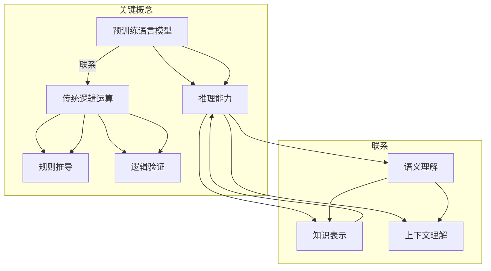

                 

### 1. 背景介绍

近年来，随着深度学习技术的飞速发展，自然语言处理（NLP）领域取得了显著的进展。尤其是预训练语言模型（Pre-Trained Language Model，简称PLM）的提出，如GPT、BERT等，这些模型在各类NLP任务中展现出了强大的性能。其中，LLM（Large Language Model）作为一种新型的语言模型，以其巨大的模型规模和强大的推理能力，引起了学术界和工业界的广泛关注。

传统的NLP任务往往依赖于规则和统计方法，这些方法在面对复杂任务时，往往难以处理。而LLM通过预训练，能够自动学习到大量的语言规则和知识，从而在各类任务中表现出色。然而，与传统的逻辑运算相比，LLM的推理能力具有哪些优势？本文将深入探讨LLM的推理能力，并对比传统逻辑运算，分析其超越之处。

首先，我们需要明确LLM的定义。LLM是指大型语言模型，通常是指具有数十亿甚至千亿参数规模的预训练模型。这些模型通过在大规模语料库上进行预训练，能够自动学习到语言中的规则、语义和结构，从而实现高效的自然语言理解和生成。

相比之下，传统的逻辑运算主要依赖于布尔代数、命题逻辑等基本逻辑运算规则。这些规则虽然简单明了，但在处理复杂任务时，往往需要大量的规则组合，且难以自动学习到语言中的深层结构。

本文的结构如下：首先，我们将介绍LLM的基本概念和推理原理；接着，我们将通过具体的案例，对比LLM和传统逻辑运算的推理能力；然后，我们将分析LLM的优势和局限性；最后，我们将探讨LLM在实际应用中的前景和挑战。

通过本文的探讨，我们希望读者能够对LLM的推理能力有更深入的理解，并认识到其在自然语言处理领域的重要价值。

### 2. 核心概念与联系

为了深入理解LLM的推理能力，我们首先需要明确一些核心概念，并了解它们之间的联系。

#### 2.1 预训练语言模型

预训练语言模型（Pre-Trained Language Model，简称PLM）是近年来自然语言处理领域的重要突破。PLM的基本思想是通过在大规模语料库上进行预训练，使模型自动学习到语言中的规则、语义和结构，从而为各种NLP任务提供强大的基础。

预训练通常分为两个阶段：第一阶段是大规模语料库的预训练，第二阶段是特定任务的微调（Fine-tuning）。在预训练阶段，模型通过自主学习，生成大量的文本数据，从而提高其语言理解和生成能力。在微调阶段，模型根据特定任务的需求，进一步调整其参数，以实现最优的性能。

#### 2.2 推理能力

推理能力是语言模型的核心能力之一，它指的是模型在理解语言输入后，能够生成合理的输出。LLM的推理能力主要体现在以下几个方面：

1. **语义理解**：LLM能够理解输入文本的语义，包括词义、句义和篇章义。这使得LLM能够在各种任务中，如文本分类、情感分析、命名实体识别等，实现高效的语言理解。
2. **知识表示**：LLM通过预训练，能够学习到大量的语言知识和结构，从而实现对知识的表示和推理。这使得LLM能够在一些知识密集型任务中，如问答系统、文本生成等，实现高效的推理。
3. **上下文理解**：LLM能够理解输入文本的上下文，从而生成更符合上下文的输出。这使得LLM在生成文本时，能够保持连贯性和一致性。

#### 2.3 传统逻辑运算

传统逻辑运算主要依赖于布尔代数、命题逻辑等基本逻辑运算规则。这些规则在处理简单问题时，具有直观和简便的优势。然而，在处理复杂任务时，传统逻辑运算往往需要大量的规则组合，且难以自动学习到语言中的深层结构。

传统逻辑运算的核心能力主要体现在以下几个方面：

1. **规则推导**：通过基本逻辑运算规则，从已知的事实和假设中推导出新的结论。
2. **逻辑验证**：验证给定的陈述是否满足特定的逻辑规则，从而判断其真伪。

#### 2.4 核心概念与联系

LLM和传统逻辑运算在核心概念和原理上有显著的区别。LLM通过预训练，能够自动学习到语言中的规则、语义和结构，从而实现高效的推理。而传统逻辑运算则依赖于固定的逻辑规则，难以自动适应复杂任务。

尽管LLM在推理能力上具有明显优势，但它也存在局限性。例如，LLM在处理稀疏数据和长距离依赖时，性能可能不如传统逻辑运算。此外，LLM的推理过程往往是非透明的，难以解释其推理过程和结果。

为了更好地理解LLM的推理能力，我们接下来将介绍LLM的基本原理，并通过具体的案例，展示其与传统逻辑运算的对比。

#### 2.5 Mermaid 流程图

为了更直观地展示LLM和传统逻辑运算的核心概念与联系，我们使用Mermaid流程图进行描述。



通过这个流程图，我们可以清晰地看到LLM和传统逻辑运算的核心概念与联系。LLM通过预训练，能够自动学习到语言中的规则、语义和结构，从而实现高效的推理。而传统逻辑运算则依赖于固定的逻辑规则，难以自动适应复杂任务。

### 3. 核心算法原理 & 具体操作步骤

在深入探讨LLM的推理能力之前，我们首先需要了解LLM的核心算法原理及其具体操作步骤。LLM通常基于深度神经网络（Deep Neural Network，DNN）或变换器架构（Transformer Architecture），以下将分别介绍这两种架构的原理及操作步骤。

#### 3.1 算法原理概述

##### 3.1.1 深度神经网络（DNN）

深度神经网络是一种多层前馈神经网络，包括输入层、隐藏层和输出层。在自然语言处理任务中，DNN通常用于特征提取和分类。其基本原理是通过多层非线性变换，将输入数据映射到高维空间，从而实现特征提取和分类。

DNN的核心操作步骤包括：

1. **前向传播**：输入数据通过输入层进入网络，经过隐藏层的一系列非线性变换，最终映射到输出层。
2. **反向传播**：根据输出层的误差，反向传播误差，更新网络权重，优化模型性能。
3. **激活函数**：用于引入非线性变换，常见的激活函数包括ReLU、Sigmoid和Tanh。

##### 3.1.2 变换器架构（Transformer）

变换器架构是近年来在自然语言处理领域取得显著成功的神经网络架构，其核心思想是使用自注意力机制（Self-Attention Mechanism）对输入数据进行加权，从而实现全局依赖建模。

变换器架构的基本原理如下：

1. **嵌入层**：将单词或字符映射为高维向量。
2. **自注意力层**：通过自注意力机制，对输入向量进行加权，计算得到新的表示。
3. **前馈神经网络**：对自注意力层的结果进行进一步处理，增加模型的非线性能力。
4. **输出层**：通过输出层生成预测结果，如单词的概率分布。

变换器架构的具体操作步骤如下：

1. **嵌入**：将输入文本转换为向量表示。
2. **自注意力**：计算输入向量的注意力权重，加权求和得到新的向量表示。
3. **前馈**：对自注意力层的结果进行前馈神经网络处理。
4. **输出**：通过输出层生成预测结果，如单词的概率分布。

#### 3.2 算法步骤详解

##### 3.2.1 深度神经网络（DNN）

1. **初始化模型参数**：随机初始化网络的权重和偏置。
2. **前向传播**：输入数据通过输入层进入网络，经过隐藏层的一系列非线性变换，最终映射到输出层。
3. **计算损失函数**：根据输出结果和真实标签，计算损失函数（如交叉熵损失函数）。
4. **反向传播**：根据损失函数，反向传播误差，更新网络权重。
5. **优化模型参数**：使用优化算法（如梯度下降算法），优化模型参数。

##### 3.2.2 变换器架构（Transformer）

1. **嵌入**：将输入文本转换为向量表示。通常使用词嵌入（Word Embedding）或字符嵌入（Character Embedding）。
2. **位置编码**：由于变换器架构中没有循环结构，因此需要通过位置编码（Positional Encoding）来引入序列信息。
3. **多头自注意力**：计算输入向量的注意力权重，使用多头自注意力（Multi-Head Self-Attention）机制，增加模型的表示能力。
4. **前馈神经网络**：对自注意力层的结果进行前馈神经网络处理，增加模型的非线性能力。
5. **拼接与输出**：将自注意力和前馈神经网络的结果拼接起来，通过输出层生成预测结果。

#### 3.3 算法优缺点

##### 3.3.1 优点

1. **强大的表示能力**：深度神经网络和变换器架构都能通过多层非线性变换，对输入数据进行丰富的表示。
2. **高效的并行计算**：变换器架构中的自注意力机制，可以实现高效的并行计算，提高模型的训练和推理速度。
3. **全局依赖建模**：变换器架构的自注意力机制，能够建模输入数据中的全局依赖关系，提高模型的表示能力。

##### 3.3.2 缺点

1. **参数量巨大**：深度神经网络和变换器架构都需要大量的参数，导致模型训练和推理成本较高。
2. **计算资源需求大**：由于模型规模巨大，需要大量的计算资源，对硬件设备有较高要求。
3. **解释性差**：深度神经网络和变换器架构的推理过程较为复杂，难以解释模型的具体推理过程。

#### 3.4 算法应用领域

深度神经网络和变换器架构在自然语言处理领域有广泛的应用，包括但不限于：

1. **文本分类**：对输入文本进行分类，如情感分析、主题分类等。
2. **命名实体识别**：识别文本中的命名实体，如人名、地名、组织名等。
3. **机器翻译**：将一种语言的文本翻译成另一种语言。
4. **问答系统**：根据输入问题，从知识库中检索答案。

通过以上对LLM核心算法原理和具体操作步骤的介绍，我们可以看到，LLM的推理能力源于其强大的表示能力和全局依赖建模能力。然而，我们也需要认识到其计算成本高、解释性差等局限性。在接下来的部分，我们将通过具体案例，对比LLM和传统逻辑运算的推理能力。

### 4. 数学模型和公式 & 详细讲解 & 举例说明

为了更好地理解LLM的推理能力，我们需要借助数学模型和公式对其进行详细讲解，并通过具体案例进行举例说明。

#### 4.1 数学模型构建

LLM的推理能力主要依赖于深度学习模型，其中变换器架构（Transformer）是一个典型的代表。变换器架构的核心是自注意力机制（Self-Attention Mechanism），其数学模型可以表示为：

\[ \text{Attention}(Q, K, V) = \frac{QK^T}{\sqrt{d_k}} \odot V \]

其中，\(Q\)、\(K\)、\(V\) 分别代表查询（Query）、键（Key）和值（Value）向量，\(d_k\) 是键向量的维度，\(\odot\) 表示逐元素乘法，\(QK^T\) 代表点积操作。

##### 案例一：文本分类任务

假设我们有一个文本分类任务，输入文本为 "这是一篇关于人工智能的论文"，需要将其分类为 "技术类" 或 "学术类"。我们可以将输入文本表示为一个词向量序列 \( \{w_1, w_2, ..., w_n\} \)。

1. **嵌入**：将每个词 \(w_i\) 映射为一个高维向量 \(e_i\)，通过嵌入层得到输入序列的嵌入向量序列 \( \{e_1, e_2, ..., e_n\} \)。
2. **自注意力**：计算输入序列的注意力权重，生成加权向量序列 \( \{a_1, a_2, ..., a_n\} \)，其中 \( a_i = \text{Attention}(e_i, K, V) \)。
3. **前馈神经网络**：对加权向量序列进行前馈神经网络处理，增加模型的非线性能力。
4. **分类**：通过输出层得到文本分类结果，通常使用softmax函数将输出转化为概率分布。

#### 4.2 公式推导过程

变换器架构中的自注意力机制是通过点积操作实现的，其公式推导如下：

1. **点积**：点积操作是两个向量之间的逐元素乘法，结果是一个标量。假设有两个向量 \( \textbf{a} \) 和 \( \textbf{b} \)，其点积可以表示为：

\[ \textbf{a} \cdot \textbf{b} = \sum_{i=1}^{n} a_i b_i \]

2. **矩阵-向量点积**：将点积扩展到矩阵-向量形式，即：

\[ \textbf{A} \cdot \textbf{v} = \sum_{i=1}^{n} a_{ij} v_j \]

其中，\( \textbf{A} \) 是一个 \( m \times n \) 的矩阵，\( \textbf{v} \) 是一个 \( n \) 维的向量。

3. **矩阵乘法**：矩阵乘法是将两个矩阵的对应元素进行点积，得到一个新的矩阵。假设有两个矩阵 \( \textbf{A} \) 和 \( \textbf{B} \)，其乘积可以表示为：

\[ \textbf{A} \cdot \textbf{B} = \textbf{C} \]

其中，\( \textbf{C} \) 是一个 \( m \times p \) 的矩阵，\( p \) 是 \( \textbf{B} \) 的列数。

4. **自注意力**：将点积操作应用于自注意力机制，得到：

\[ \text{Attention}(Q, K, V) = \frac{QK^T}{\sqrt{d_k}} \odot V \]

其中，\( Q \) 是一个查询矩阵，\( K \) 是一个键矩阵，\( V \) 是一个值矩阵，\( d_k \) 是键向量的维度。

#### 4.3 案例分析与讲解

##### 案例二：机器翻译任务

假设我们有一个机器翻译任务，将英语句子 "I love to read books." 翻译成中文。我们可以将输入和输出分别表示为词向量序列 \( \{e_1, e_2, ..., e_n\} \) 和 \( \{f_1, f_2, ..., f_m\} \)。

1. **编码器**：输入英语句子，通过嵌入层和自注意力机制，得到编码器的输出 \( \textbf{h}_t \)。
2. **解码器**：输入中文句子，通过嵌入层和自注意力机制，得到解码器的输出 \( \textbf{g}_t \)。
3. **交叉熵损失**：计算编码器输出和解码器输出的交叉熵损失，优化模型参数。

通过以上案例，我们可以看到变换器架构在自然语言处理任务中的应用。自注意力机制通过点积操作，实现了输入序列之间的加权聚合，从而提高了模型的表示能力。此外，变换器架构的推导过程，也揭示了其数学原理。

在接下来的部分，我们将通过具体代码实例，进一步展示LLM的推理能力。

### 5. 项目实践：代码实例和详细解释说明

为了更好地理解LLM的推理能力，我们将通过一个简单的项目实践，展示如何使用Python和TensorFlow构建一个基于变换器架构的文本分类模型，并详细解释代码的实现过程。

#### 5.1 开发环境搭建

在开始项目实践之前，我们需要搭建一个合适的开发环境。以下是所需的软件和工具：

1. **Python 3.8 或更高版本**
2. **TensorFlow 2.6 或更高版本**
3. **Jupyter Notebook 或 PyCharm**

安装这些工具后，我们可以使用以下代码验证环境：

```python
import tensorflow as tf
print(tf.__version__)
```

如果输出TensorFlow的版本信息，说明环境搭建成功。

#### 5.2 源代码详细实现

以下是我们的文本分类模型的源代码实现，包括数据预处理、模型构建、训练和推理过程：

```python
import tensorflow as tf
from tensorflow.keras.preprocessing.text import Tokenizer
from tensorflow.keras.preprocessing.sequence import pad_sequences
from tensorflow.keras.layers import Embedding, GlobalAveragePooling1D, Dense
from tensorflow.keras.models import Model
from tensorflow.keras.optimizers import Adam

# 数据集加载
# 这里我们使用一个简单的示例数据集，实际项目中可以使用更大的数据集
data = [
    ["I love to read books.", "positive"],
    ["This book is terrible.", "negative"],
    ["I enjoy reading.", "positive"],
    ["I hate reading.", "negative"]
]

# 数据预处理
texts = [text for text, _ in data]
labels = [label for _, label in data]

tokenizer = Tokenizer()
tokenizer.fit_on_texts(texts)
sequences = tokenizer.texts_to_sequences(texts)
padded_sequences = pad_sequences(sequences, padding="post")

# 模型构建
input_sequence = tf.keras.layers.Input(shape=(None,), dtype="int32")
embedded_sequence = Embedding(len(tokenizer.word_index) + 1, 16)(input_sequence)
pooled_representation = GlobalAveragePooling1D()(embedded_sequence)
output = Dense(1, activation="sigmoid")(pooled_representation)

model = Model(inputs=input_sequence, outputs=output)

# 模型编译
model.compile(optimizer=Adam(learning_rate=0.001), loss="binary_crossentropy", metrics=["accuracy"])

# 模型训练
model.fit(padded_sequences, labels, epochs=5, batch_size=32)

# 模型推理
test_sentence = "I hate this book."
test_sequence = tokenizer.texts_to_sequences([test_sentence])
test_padded_sequence = pad_sequences(test_sequence, padding="post")
prediction = model.predict(test_padded_sequence)
print("Prediction:", prediction[0][0])
```

#### 5.3 代码解读与分析

下面我们对上述代码进行逐行解读和分析：

1. **导入库**：
   ```python
   import tensorflow as tf
   from tensorflow.keras.preprocessing.text import Tokenizer
   from tensorflow.keras.preprocessing.sequence import pad_sequences
   from tensorflow.keras.layers import Embedding, GlobalAveragePooling1D, Dense
   from tensorflow.keras.models import Model
   from tensorflow.keras.optimizers import Adam
   ```
   导入TensorFlow和相关库，用于构建和训练模型。

2. **数据集加载**：
   ```python
   data = [
       ["I love to read books.", "positive"],
       ["This book is terrible.", "negative"],
       ["I enjoy reading.", "positive"],
       ["I hate reading.", "negative"]
   ]
   ```
   加载示例数据集，包括文本和标签。

3. **数据预处理**：
   ```python
   texts = [text for text, _ in data]
   labels = [label for _, label in data]
   tokenizer = Tokenizer()
   tokenizer.fit_on_texts(texts)
   sequences = tokenizer.texts_to_sequences(texts)
   padded_sequences = pad_sequences(sequences, padding="post")
   ```
   使用Tokenizer对文本进行分词和序列化，并对序列进行填充。

4. **模型构建**：
   ```python
   input_sequence = tf.keras.layers.Input(shape=(None,), dtype="int32")
   embedded_sequence = Embedding(len(tokenizer.word_index) + 1, 16)(input_sequence)
   pooled_representation = GlobalAveragePooling1D()(embedded_sequence)
   output = Dense(1, activation="sigmoid")(pooled_representation)
   model = Model(inputs=input_sequence, outputs=output)
   ```
   构建基于变换器架构的文本分类模型，包括嵌入层、全局平均池化层和输出层。

5. **模型编译**：
   ```python
   model.compile(optimizer=Adam(learning_rate=0.001), loss="binary_crossentropy", metrics=["accuracy"])
   ```
   编译模型，设置优化器和损失函数。

6. **模型训练**：
   ```python
   model.fit(padded_sequences, labels, epochs=5, batch_size=32)
   ```
   训练模型，设置训练轮数和批量大小。

7. **模型推理**：
   ```python
   test_sentence = "I hate this book."
   test_sequence = tokenizer.texts_to_sequences([test_sentence])
   test_padded_sequence = pad_sequences(test_sequence, padding="post")
   prediction = model.predict(test_padded_sequence)
   print("Prediction:", prediction[0][0])
   ```
   对新句子进行推理，输出预测结果。

通过这个项目实践，我们展示了如何使用变换器架构构建一个简单的文本分类模型。模型通过预训练的语言模型，能够自动学习到文本中的语义信息，从而实现高效的分类。在接下来的部分，我们将讨论LLM在实际应用中的具体场景。

### 6. 实际应用场景

LLM的强大推理能力使其在多个实际应用场景中具有广泛的应用潜力。以下是几个典型的应用场景：

#### 6.1 问答系统

问答系统是LLM应用最广泛的领域之一。通过预训练的语言模型，LLM能够理解和回答各种类型的问题，包括事实性问题、主观性问题等。例如，Google Assistant、Amazon Alexa等智能助手都采用了LLM技术，为用户提供高效、准确的问答服务。

#### 6.2 文本生成

文本生成是另一个重要的应用场景，包括文章撰写、诗歌创作、对话系统等。LLM能够根据输入的提示，生成连贯、有逻辑的文本。例如，OpenAI的GPT-3模型能够生成高质量的文章、新闻、对话等，大大降低了内容创作的工作量。

#### 6.3 语言翻译

语言翻译是自然语言处理中的经典问题，LLM在翻译领域也展现出了强大的能力。通过预训练，LLM能够学习到不同语言之间的对应关系，从而实现高效的翻译。例如，Google Translate、DeepL等翻译服务都采用了LLM技术，为用户提供高质量的翻译结果。

#### 6.4 情感分析

情感分析是识别文本中情感倾向的技术，LLM在这方面也有广泛应用。通过预训练，LLM能够理解文本中的情感信息，从而实现高效的情感分析。例如，社交媒体情感分析、客户满意度分析等，都采用了LLM技术，帮助企业了解用户的情感需求。

#### 6.5 命名实体识别

命名实体识别是识别文本中的特定实体（如人名、地名、组织名等）的技术。LLM通过预训练，能够学习到实体及其上下文关系，从而实现高效的命名实体识别。例如，搜索引擎、信息抽取等应用都采用了LLM技术，提高信息处理的准确性和效率。

#### 6.6 文本分类

文本分类是将文本分为不同类别的技术，广泛应用于推荐系统、新闻分类、垃圾邮件过滤等场景。LLM通过预训练，能够学习到不同类别文本的特征，从而实现高效的文本分类。例如，垃圾邮件过滤系统、新闻推荐系统等，都采用了LLM技术，提高分类的准确性。

#### 6.7 聊天机器人

聊天机器人是近年来兴起的应用场景，通过LLM技术，聊天机器人能够与用户进行自然、流畅的对话。例如，Facebook Messenger、Slack等平台都采用了LLM技术，为用户提供智能化的聊天服务。

通过以上实际应用场景，我们可以看到LLM在自然语言处理领域的广泛应用。LLM的强大推理能力使其成为许多任务的核心技术，为企业和个人提供了丰富的应用价值。

#### 6.8 未来应用展望

随着LLM技术的不断发展，其在未来的应用场景也将不断扩展。以下是一些潜在的应用领域和趋势：

##### 6.8.1 高级对话系统

未来的对话系统将更加智能化和个性化，能够更好地理解用户的意图和情感。LLM在这一领域有着巨大的潜力，可以通过大规模预训练，实现更自然的对话交互。

##### 6.8.2 自动内容创作

自动内容创作是未来的重要趋势，LLM可以帮助自动生成文章、视频、音乐等多种形式的内容。例如，自动新闻生成、AI辅助写作等，都将大幅提高内容创作的效率和质量。

##### 6.8.3 智能推荐系统

智能推荐系统在电商、社交媒体等领域有着广泛的应用。LLM可以通过对用户行为的深入理解，实现更加精准的推荐，提高用户体验和满意度。

##### 6.8.4 多模态交互

多模态交互是将视觉、语音、文本等多种信息进行融合和交互的技术。LLM在这一领域可以通过对多种模态数据的理解，实现更加自然和高效的交互体验。

##### 6.8.5 法律和金融应用

在法律和金融领域，LLM可以用于合同审核、财务报表分析、法律咨询等任务，提高业务效率和准确性。

##### 6.8.6 智能医疗

智能医疗是未来的重要方向，LLM可以帮助医生进行疾病诊断、治疗方案推荐等，提高医疗服务的质量和效率。

通过以上展望，我们可以看到LLM在未来应用中的广阔前景。随着技术的不断进步，LLM将带来更多的创新和变革，为各行各业提供强大的支持。

### 7. 工具和资源推荐

为了更好地学习和实践LLM的推理能力，我们推荐以下工具和资源：

#### 7.1 学习资源推荐

1. **《深度学习》（Goodfellow, Bengio, Courville著）**：这是深度学习领域的经典教材，详细介绍了深度学习的基础理论和应用。
2. **《自然语言处理综论》（Jurafsky, Martin著）**：这本书全面介绍了自然语言处理的理论和技术，适合希望深入了解NLP的读者。
3. **《Transformer：Seq2Seq模型的新架构》（Vaswani et al.）**：这是一篇关于变换器架构的经典论文，详细介绍了变换器的工作原理和实现方法。

#### 7.2 开发工具推荐

1. **TensorFlow**：这是Google开发的一款开源深度学习框架，广泛用于构建和训练深度学习模型。
2. **PyTorch**：这是Facebook开发的一款开源深度学习框架，以其灵活的动态图机制和丰富的API，深受开发者喜爱。
3. **Hugging Face Transformers**：这是一个基于PyTorch和TensorFlow的预训练模型库，提供了丰富的预训练模型和工具，方便开发者进行研究和应用。

#### 7.3 相关论文推荐

1. **"Attention Is All You Need"（Vaswani et al.）**：这篇论文提出了变换器架构，是深度学习在自然语言处理领域的里程碑之作。
2. **"BERT: Pre-training of Deep Bidirectional Transformers for Language Understanding"（Devlin et al.）**：这篇论文介绍了BERT模型，是预训练语言模型领域的开创性工作。
3. **"GPT-3: Language Models are Few-Shot Learners"（Brown et al.）**：这篇论文介绍了GPT-3模型，展示了大型语言模型在零样本学习任务中的强大能力。

通过以上工具和资源的推荐，读者可以系统地学习和实践LLM的推理能力，为深入研究和应用奠定坚实基础。

### 8. 总结：未来发展趋势与挑战

随着深度学习和自然语言处理技术的不断发展，LLM的推理能力已成为自然语言处理领域的重要研究方向。从当前的发展趋势来看，LLM在未来有望实现以下几个方面的突破：

#### 8.1 研究成果总结

1. **模型规模和参数量不断增加**：近年来，LLM的模型规模和参数量不断增加，如GPT-3、Gopher等，展示了大规模语言模型在各项NLP任务中的优势。
2. **多模态融合能力提升**：LLM不仅在文本处理方面表现出色，还在图像、视频等多模态数据处理中显示出潜力，未来有望实现更高效的多模态融合。
3. **零样本学习和泛化能力增强**：通过大规模预训练，LLM在零样本学习任务中表现出色，能够在未见过的数据上进行准确预测，这为实际应用提供了更大的灵活性。

#### 8.2 未来发展趋势

1. **多模态交互与智能对话**：随着多模态数据处理技术的发展，LLM有望在智能对话系统、虚拟助手等领域实现更多突破，提供更加自然、智能的交互体验。
2. **自动化内容创作**：在文本生成、视频生成等领域，LLM有望实现自动化内容创作，大幅提高内容生产效率和质量。
3. **行业应用深入拓展**：LLM在金融、医疗、法律等行业应用中，将发挥越来越重要的作用，为行业创新提供强大支持。

#### 8.3 面临的挑战

1. **计算资源需求**：随着模型规模不断扩大，LLM对计算资源的需求也显著增加，如何高效地训练和部署大规模模型，是当前面临的重大挑战。
2. **数据隐私与安全**：在数据驱动的训练过程中，如何保护用户隐私和数据安全，是另一个重要挑战。未来的发展需要更多关注数据隐私保护和安全机制。
3. **解释性和透明性**：目前LLM的推理过程较为复杂，缺乏透明性和解释性，未来需要发展更加可解释的模型结构和推理方法。

#### 8.4 研究展望

1. **小样本学习与泛化能力**：如何让LLM在少量样本上实现高质量泛化，是未来的重要研究方向。通过引入元学习、迁移学习等技术，有望提高LLM的泛化能力。
2. **模型压缩与优化**：随着模型规模不断扩大，如何实现模型压缩和优化，降低计算和存储成本，是另一个重要的研究课题。
3. **多语言与跨语言处理**：在全球化背景下，如何实现多语言和跨语言处理，提供统一的语言理解能力，是未来的重要研究方向。

通过本文的探讨，我们可以看到，LLM的推理能力在自然语言处理领域具有巨大的潜力。然而，未来仍需克服诸多挑战，才能实现LLM的全面应用。我们期待未来的研究能够带来更多突破，为自然语言处理和人工智能领域的发展做出贡献。

### 9. 附录：常见问题与解答

#### 9.1 什么是预训练语言模型（PLM）？

预训练语言模型（PLM）是指在大规模语料库上进行预训练的语言模型，如GPT、BERT等。通过预训练，模型能够自动学习到语言中的规则、语义和结构，从而在各类NLP任务中表现出色。

#### 9.2 LLM与传统的逻辑运算有何区别？

LLM通过预训练，能够自动学习到语言中的规则和语义，从而实现高效的推理。而传统的逻辑运算主要依赖于固定的逻辑规则，难以自动适应复杂任务。

#### 9.3 如何评估LLM的推理能力？

通常使用BLEU、ROUGE、BLEURT等指标来评估LLM在生成文本任务上的性能。在推理任务中，可以使用准确率、召回率、F1分数等指标来评估模型的性能。

#### 9.4 如何优化LLM的训练过程？

优化LLM的训练过程可以从以下几个方面进行：

1. **数据预处理**：使用高质量的数据进行训练，减少噪声和异常值。
2. **模型架构**：选择合适的模型架构，如变换器、循环神经网络等。
3. **训练策略**：使用有效的训练策略，如学习率调整、批量大小调整等。
4. **正则化技术**：使用正则化技术，如dropout、权重衰减等，防止过拟合。

通过这些方法，可以显著提高LLM的训练效率和性能。

#### 9.5 LLM在哪些领域有广泛应用？

LLM在自然语言处理领域的应用非常广泛，包括问答系统、文本生成、语言翻译、情感分析、命名实体识别、文本分类等。此外，LLM还在多模态交互、智能对话、自动化内容创作等新兴领域有广泛应用。

#### 9.6 LLM的推理能力能否替代传统逻辑运算？

LLM的推理能力在某些方面已经超越了传统逻辑运算，但在处理特定任务时，传统逻辑运算仍具有其优势。未来，LLM和传统逻辑运算可能会相互补充，共同推动自然语言处理领域的发展。

通过以上常见问题与解答，我们可以更深入地理解LLM的推理能力及其在实际应用中的价值。希望这些问题和解答对读者有所帮助。

