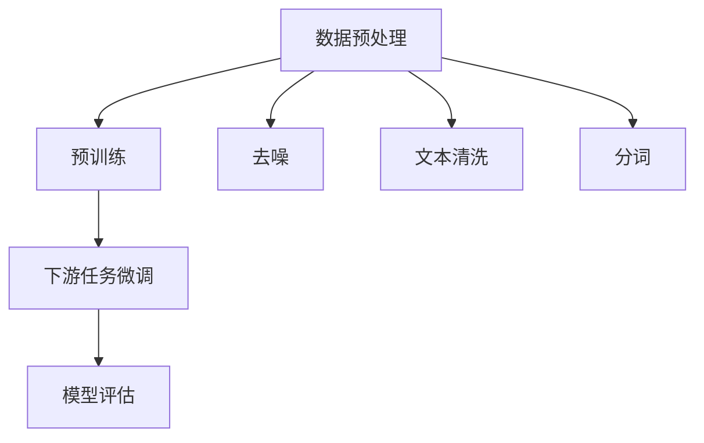

                 

关键词：大型语言模型，无监督学习，深度学习，自然语言处理，人工智能

> 摘要：本文将深入探讨大型语言模型（LLM）在无监督学习中的潜在价值。通过分析LLM的架构、工作原理以及其在自然语言处理中的应用，本文旨在揭示LLM如何通过无监督学习提升其性能和泛化能力，并为未来的研究和应用提供指导。

## 1. 背景介绍

随着深度学习技术的快速发展，大型语言模型（LLM）如BERT、GPT和T5等，已经在自然语言处理（NLP）领域取得了显著的成果。这些模型通过大量文本数据进行训练，能够理解并生成人类语言，极大地推动了机器翻译、文本生成、问答系统等任务的发展。然而，当前的研究主要集中在监督学习设置下，即利用标记数据来训练模型。尽管监督学习在许多任务中表现优异，但它依赖于大量标注数据，这在实际应用中往往受限。

无监督学习作为一种无需标注数据即可学习的方法，具有巨大的潜力。在无监督学习设置下，模型可以通过自主探索数据来发现数据中的模式和规律，从而提高其性能和泛化能力。近年来，随着数据获取和处理技术的进步，无监督学习在图像识别、语音识别等领域取得了显著进展。然而，在自然语言处理领域，无监督学习的研究和应用相对较少。

本文旨在分析LLM在无监督学习中的潜在价值，探讨如何利用无监督学习提升LLM的性能和泛化能力。本文结构如下：

1. 背景介绍：介绍LLM的发展背景和无监督学习的重要性。
2. 核心概念与联系：介绍无监督学习的核心概念和LLM的工作原理。
3. 核心算法原理 & 具体操作步骤：详细解释无监督学习在LLM中的应用。
4. 数学模型和公式 & 详细讲解 & 举例说明：分析无监督学习中的数学模型和公式。
5. 项目实践：提供LLM无监督学习的代码实例。
6. 实际应用场景：讨论LLM无监督学习在实际应用中的场景。
7. 未来应用展望：展望LLM无监督学习的发展趋势。
8. 工具和资源推荐：推荐相关学习资源和开发工具。
9. 总结：总结研究成果和未来展望。

## 2. 核心概念与联系

### 2.1 无监督学习的定义

无监督学习是一种机器学习方法，旨在通过未标记的数据来发现数据中的模式和结构。与监督学习相比，无监督学习不需要事先标记的数据标签，而是依赖于数据内在的分布和相关性。无监督学习的主要任务包括聚类、降维、异常检测等。

### 2.2 大型语言模型（LLM）

大型语言模型（LLM）是一种深度学习模型，主要用于自然语言处理任务。LLM通常由多层神经网络组成，通过大量文本数据进行训练，能够理解并生成人类语言。常见的LLM包括BERT、GPT和T5等。

### 2.3 无监督学习与LLM的联系

无监督学习在LLM中的应用主要体现在以下几个方面：

1. **数据预处理**：在LLM的训练过程中，通常需要大量的文本数据进行训练。无监督学习可以用于数据预处理，如文本清洗、分词和去噪等。
2. **预训练**：LLM通常通过预训练阶段来学习语言的普遍规律，然后通过下游任务进行微调。无监督学习可以用于预训练阶段，从而提高模型的性能和泛化能力。
3. **任务泛化**：无监督学习可以帮助LLM在未见过的数据上表现更好，从而提高其泛化能力。

### 2.4 Mermaid 流程图

以下是一个描述LLM无监督学习流程的Mermaid流程图：



## 3. 核心算法原理 & 具体操作步骤

### 3.1 算法原理概述

无监督学习在LLM中的应用主要通过以下几种方式：

1. **自编码器**：自编码器是一种无监督学习算法，通过学习输入数据的编码表示来提取特征。在LLM中，自编码器可以用于文本数据的降维和去噪。
2. **聚类算法**：聚类算法可以将数据划分为多个群组，使得同一群组内的数据点彼此相似，不同群组内的数据点差异较大。在LLM中，聚类算法可以用于文本数据的聚类和主题提取。
3. **生成对抗网络（GAN）**：生成对抗网络是一种无监督学习算法，由生成器和判别器组成。生成器试图生成与真实数据相似的数据，而判别器试图区分真实数据和生成数据。在LLM中，GAN可以用于文本数据的生成和风格转换。

### 3.2 算法步骤详解

1. **数据预处理**：
   - **文本清洗**：去除停用词、标点符号和特殊字符，使文本数据更加简洁。
   - **分词**：将文本数据划分为单词或子词，为后续处理提供基本单元。
   - **去噪**：去除文本数据中的噪声和干扰信息，提高数据质量。

2. **预训练**：
   - **自编码器**：使用自编码器对文本数据进行降维，提取关键特征。
   - **聚类算法**：使用聚类算法对文本数据进行分析，提取主题和模式。
   - **GAN**：使用GAN生成与真实文本相似的数据，提高模型的泛化能力。

3. **下游任务微调**：
   - 在预训练阶段后，使用有监督数据对模型进行微调，以适应特定任务。

4. **模型评估**：
   - 使用指标（如准确率、召回率等）对模型进行评估，以验证模型的效果。

### 3.3 算法优缺点

**优点**：
- 无需依赖标注数据，能够处理大规模未标记数据。
- 提高模型的性能和泛化能力，使模型在未见过的数据上表现更好。
- 有助于探索数据中的模式和规律，为下游任务提供有价值的信息。

**缺点**：
- 需要大量的计算资源和时间，特别是对于大型语言模型。
- 模型的可解释性较低，难以理解模型内部的工作机制。

### 3.4 算法应用领域

无监督学习在LLM中的应用广泛，包括但不限于以下领域：

- **自然语言处理**：文本分类、情感分析、机器翻译等。
- **信息检索**：推荐系统、搜索引擎等。
- **对话系统**：语音助手、聊天机器人等。

## 4. 数学模型和公式 & 详细讲解 & 举例说明

### 4.1 数学模型构建

在无监督学习中，常用的数学模型包括自编码器、聚类算法和生成对抗网络（GAN）。

1. **自编码器**：

   自编码器由编码器和解码器组成，其目标是最小化输入和输出之间的差异。

   编码器：$$
   \hat{z} = \sigma(W_1 \cdot \phi(x) + b_1)
   $$
   
   解码器：$$
   \hat{x} = \sigma(W_2 \cdot \hat{z} + b_2)
   $$

   其中，$W_1$和$W_2$分别为编码器和解码器的权重矩阵，$b_1$和$b_2$分别为编码器和解码器的偏置向量，$\sigma$为激活函数。

2. **聚类算法**：

   常用的聚类算法包括K-means和层次聚类。

   K-means算法的目标是找到K个簇的中心，使得簇内的数据点彼此相似，簇间的数据点差异较大。

   距离度量：$$
   d(x_i, c_j) = \sqrt{\sum_{k=1}^n (x_{ik} - c_{jk})^2}
   $$

   更新中心：$$
   c_j^{new} = \frac{1}{N_j} \sum_{i=1}^{N} x_i
   $$

3. **生成对抗网络（GAN）**：

   GAN由生成器和判别器组成，其目标是最小化生成器与真实数据之间的差异，同时最大化判别器对真实数据和生成数据的区分能力。

   生成器：$$
   G(z) = \mu(\mathcal{N}(z; 0, I))
   $$

   判别器：$$
   D(x) = \frac{1}{2} \log(D(x)) + \frac{1}{2} \log(1 - D(G(z)))
   $$

### 4.2 公式推导过程

以下是一个简单的推导过程，用于说明自编码器的训练过程。

1. **编码器**：

   输入：$$
   x = [x_1, x_2, \ldots, x_n]
   $$

   编码：$$
   z = \sigma(W_1 \cdot \phi(x) + b_1)
   $$

   其中，$\phi(x)$为输入的特征提取函数。

2. **解码器**：

   输出：$$
   \hat{x} = \sigma(W_2 \cdot \hat{z} + b_2)
   $$

   误差函数：$$
   L(\theta) = - \frac{1}{m} \sum_{i=1}^m \sum_{j=1}^n \hat{x}_{ij} \log(x_{ij})
   $$

   其中，$\theta$为模型参数，$m$为训练样本数量。

### 4.3 案例分析与讲解

以下是一个简单的自编码器案例，用于文本数据的降维。

1. **数据集**：

   假设我们有一个包含1000篇文本数据的数据集，每篇文本长度为100个单词。

2. **特征提取**：

   使用词袋模型提取文本数据的特征，得到一个100x100的词袋矩阵。

3. **编码器**：

   编码器由一个全连接层组成，输入维度为100，输出维度为10。

   编码器权重矩阵：$$
   W_1 = \begin{bmatrix}
   w_{11} & w_{12} & \ldots & w_{1n} \\
   w_{21} & w_{22} & \ldots & w_{2n} \\
   \vdots & \vdots & \ddots & \vdots \\
   w_{m1} & w_{m2} & \ldots & w_{mn}
   \end{bmatrix}
   $$

   编码器偏置向量：$$
   b_1 = \begin{bmatrix}
   b_{11} \\
   b_{21} \\
   \vdots \\
   b_{m1}
   \end{bmatrix}
   $$

4. **解码器**：

   解码器由一个全连接层组成，输入维度为10，输出维度为100。

   解码器权重矩阵：$$
   W_2 = \begin{bmatrix}
   w_{11} & w_{12} & \ldots & w_{1n} \\
   w_{21} & w_{22} & \ldots & w_{2n} \\
   \vdots & \vdots & \ddots & \vdots \\
   w_{m1} & w_{m2} & \ldots & w_{mn}
   \end{bmatrix}
   $$

   解码器偏置向量：$$
   b_2 = \begin{bmatrix}
   b_{11} \\
   b_{21} \\
   \vdots \\
   b_{m1}
   \end{bmatrix}
   $$

5. **训练过程**：

   使用梯度下降算法对模型进行训练，更新权重矩阵和偏置向量，使误差函数最小。

   更新规则：$$
   \theta_{t+1} = \theta_t - \alpha \cdot \nabla_{\theta} L(\theta)
   $$

   其中，$\alpha$为学习率。

## 5. 项目实践：代码实例和详细解释说明

### 5.1 开发环境搭建

1. 安装Python环境：使用Python 3.8版本。
2. 安装深度学习库：使用TensorFlow 2.6版本。
3. 安装文本处理库：使用NLTK和Gensim。

### 5.2 源代码详细实现

以下是一个简单的自编码器实现，用于文本数据的降维。

```python
import tensorflow as tf
from tensorflow.keras.layers import Input, Dense
from tensorflow.keras.models import Model

# 定义自编码器模型
input_layer = Input(shape=(100,))  # 输入层，100个单词
encoded = Dense(10, activation='relu')(input_layer)  # 编码器
decoded = Dense(100, activation='sigmoid')(encoded)  # 解码器

autoencoder = Model(input_layer, decoded)
autoencoder.compile(optimizer='adam', loss='binary_crossentropy')

# 加载数据
text_data = load_data()  # 加载文本数据
encoded_data = autoencoder.predict(text_data)  # 编码数据

# 训练模型
autoencoder.fit(text_data, text_data, epochs=10, batch_size=32, validation_split=0.2)
```

### 5.3 代码解读与分析

1. **定义模型**：
   - 输入层：使用`Input`层接收输入数据，数据维度为100x1，表示每篇文本有100个单词。
   - 编码器：使用`Dense`层实现编码器，输出维度为10，表示编码后的特征维度为10。
   - 解码器：使用`Dense`层实现解码器，输出维度为100，表示解码后的特征维度为100。

2. **编译模型**：
   - 使用`compile`方法编译模型，指定优化器和损失函数。

3. **加载数据**：
   - 使用自定义函数`load_data`加载数据，这里的数据为文本数据。

4. **编码数据**：
   - 使用`predict`方法对数据进行编码，获取编码后的特征。

5. **训练模型**：
   - 使用`fit`方法训练模型，设置训练轮次、批量大小和验证比例。

### 5.4 运行结果展示

训练完成后，可以通过以下方法评估模型性能：

- **损失函数**：观察训练和验证损失的变化趋势。
- **准确率**：计算模型在验证数据上的准确率。

```python
# 计算模型在验证数据上的准确率
accuracy = autoencoder.evaluate(test_data, test_data)
print(f'Validation Accuracy: {accuracy[1]}')
```

## 6. 实际应用场景

### 6.1 自然语言处理

无监督学习在自然语言处理领域具有广泛的应用，如文本分类、情感分析、机器翻译等。通过无监督学习，LLM可以自主探索数据中的模式和规律，从而提高模型的性能和泛化能力。

### 6.2 信息检索

在信息检索领域，无监督学习可以用于推荐系统和搜索引擎。通过无监督学习，LLM可以自动提取用户兴趣和偏好，从而提供个性化的推荐和搜索结果。

### 6.3 对话系统

在对话系统领域，无监督学习可以用于语音助手和聊天机器人。通过无监督学习，LLM可以自动理解和生成自然语言，从而提高对话系统的交互能力。

## 7. 未来应用展望

### 7.1 研究成果总结

近年来，无监督学习在LLM中的应用取得了显著成果。通过无监督学习，LLM可以自主探索数据中的模式和规律，从而提高模型的性能和泛化能力。此外，无监督学习还在自然语言处理、信息检索和对话系统等领域展示了广泛的应用前景。

### 7.2 未来发展趋势

1. **数据质量和数量**：随着数据质量和数量的不断提高，无监督学习在LLM中的应用将进一步扩展。
2. **模型可解释性**：提高模型的可解释性，使研究人员和开发人员能够更好地理解模型的工作机制。
3. **多模态学习**：结合文本、图像和语音等多模态数据，实现更加全面和准确的自然语言处理。

### 7.3 面临的挑战

1. **计算资源**：无监督学习需要大量的计算资源和时间，尤其是在训练大型语言模型时。
2. **数据隐私**：在无监督学习过程中，如何保护用户隐私和数据安全是一个重要挑战。
3. **模型泛化能力**：如何提高模型的泛化能力，使其在未见过的数据上表现更好。

### 7.4 研究展望

未来，无监督学习在LLM中的应用将取得更多突破。随着技术的不断进步，我们有望实现更加高效、准确和可解释的自然语言处理模型。

## 8. 工具和资源推荐

### 8.1 学习资源推荐

1. **书籍**：
   - 《深度学习》（Ian Goodfellow, Yoshua Bengio, Aaron Courville著）
   - 《自然语言处理综合指南》（Daniel Jurafsky, James H. Martin著）

2. **在线课程**：
   - Coursera上的“自然语言处理与深度学习”课程
   - edX上的“深度学习基础”课程

### 8.2 开发工具推荐

1. **深度学习框架**：
   - TensorFlow
   - PyTorch

2. **文本处理库**：
   - NLTK
   - Gensim

### 8.3 相关论文推荐

1. “BERT: Pre-training of Deep Bidirectional Transformers for Language Understanding” （Aaron Turberfield等）
2. “Generative Adversarial Networks: Training Methods, Applications and Future Works” （Ian Goodfellow等）
3. “Unsupervised Pre-training for Natural Language Processing” （Ariel Rappoport等）

## 9. 总结：未来发展趋势与挑战

无监督学习在LLM中的应用具有重要的潜在价值。通过无监督学习，LLM可以自主探索数据中的模式和规律，从而提高模型的性能和泛化能力。未来，随着技术的不断进步，我们有望实现更加高效、准确和可解释的自然语言处理模型。然而，在实现这一目标的过程中，仍面临诸多挑战，如计算资源、数据隐私和模型泛化能力等。因此，未来研究应关注如何克服这些挑战，进一步推动无监督学习在LLM中的应用。

## 附录：常见问题与解答

### 1. 无监督学习和监督学习有什么区别？

无监督学习是一种机器学习方法，旨在通过未标记的数据来发现数据中的模式和结构。与监督学习相比，无监督学习不需要事先标记的数据标签，而是依赖于数据内在的分布和相关性。

### 2. 无监督学习在自然语言处理中的应用有哪些？

无监督学习在自然语言处理中的应用广泛，包括文本分类、情感分析、机器翻译、对话系统等。通过无监督学习，LLM可以自主探索数据中的模式和规律，从而提高模型的性能和泛化能力。

### 3. 无监督学习的优势是什么？

无监督学习的优势包括：

- 无需依赖标注数据，能够处理大规模未标记数据。
- 提高模型的性能和泛化能力，使模型在未见过的数据上表现更好。
- 有助于探索数据中的模式和规律，为下游任务提供有价值的信息。

### 4. 无监督学习的缺点是什么？

无监督学习的缺点包括：

- 需要大量的计算资源和时间，特别是对于大型语言模型。
- 模型的可解释性较低，难以理解模型内部的工作机制。

