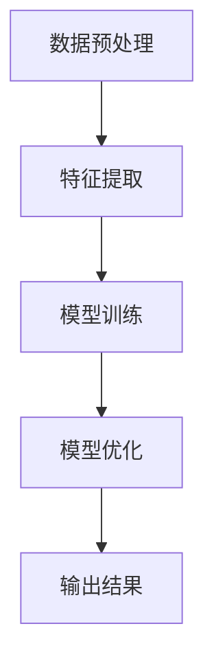

                 

关键词：无监督学习，大型语言模型（LLM），潜在价值，人工智能，数据隐私，自动化，自然语言处理，算法优化。

> 摘要：本文将深入探讨大型语言模型（LLM）在无监督学习环境下的潜在价值。通过对无监督学习核心概念的解析，我们将分析LLM如何通过自我学习和数据挖掘，提升人工智能的智能水平和应用价值。本文还将讨论无监督学习在数据隐私保护、自动化处理和自然语言处理领域的应用，并展望LLM无监督学习未来的发展趋势和面临的挑战。

## 1. 背景介绍

随着人工智能技术的快速发展，机器学习成为了推动计算机科学进步的重要驱动力。在机器学习领域，监督学习和无监督学习是两大主要学习方法。监督学习依赖于标注数据进行模型训练，而无监督学习则在没有明确标签的情况下，从大量未标注的数据中学习模式和结构。近年来，大型语言模型（LLM）如GPT-3和ChatGLM等，通过无监督学习的方法，已经展示了其在自然语言处理、文本生成、知识图谱构建等领域的强大能力。

无监督学习的重要性不言而喻。首先，它能够有效处理大量未标注的数据，降低数据标注的成本。其次，无监督学习可以揭示数据中的隐藏结构和模式，为人工智能提供更深层次的认知能力。此外，无监督学习在保护数据隐私方面具有显著优势，因为不需要公开敏感数据集进行训练。

本文旨在分析LLM在无监督学习环境下的潜在价值，探讨其在人工智能发展、自动化处理和数据隐私保护等方面的应用。通过本文的讨论，我们希望能够为读者提供一个全面了解LLM无监督学习现状和未来趋势的视角。

## 2. 核心概念与联系

### 2.1 无监督学习的核心概念

无监督学习是一种不需要标注数据的机器学习方法。它通过分析数据的内在结构和模式，从中提取有价值的信息。无监督学习主要包括以下几种类型：

- **聚类（Clustering）**：将相似的数据点分组到不同的簇中，以发现数据中的隐含结构。
- **降维（Dimensionality Reduction）**：通过减少数据维度，保留数据的核心特征，提高数据处理效率和计算性能。
- **生成模型（Generative Models）**：学习数据生成的过程，并能够生成新的数据样本。

### 2.2 LLM的无监督学习架构

LLM的无监督学习架构通常包括以下几个关键组成部分：

- **数据预处理**：对大规模文本数据进行清洗和预处理，包括分词、去除停用词、词向量化等步骤。
- **特征提取**：通过词嵌入等技术将文本转换为向量表示，以便后续的模型训练。
- **模型训练**：利用无监督学习方法，如自编码器、变分自编码器等，对文本数据进行分析和建模。
- **模型优化**：通过不断调整模型参数，优化模型性能，使其能够更好地捕获数据的潜在结构和模式。

### 2.3 Mermaid 流程图

以下是LLM无监督学习的Mermaid流程图：



### 2.4 核心概念的联系与作用

无监督学习和LLM的结合，使得机器学习模型能够从大量未标注的数据中自动学习，提高了数据处理效率和智能水平。无监督学习为LLM提供了丰富的数据源和复杂的结构化信息，而LLM则利用这些信息，不断提升自身的学习能力和表达能力。

## 3. 核心算法原理 & 具体操作步骤

### 3.1 算法原理概述

LLM的无监督学习算法主要基于生成模型和自编码器等深度学习技术。生成模型通过学习数据的概率分布，生成新的数据样本；自编码器则通过编码和解码过程，将输入数据压缩为低维特征向量，并重构原始数据。

### 3.2 算法步骤详解

1. **数据预处理**：对大规模文本数据集进行清洗和预处理，去除无效字符、停用词等，并进行分词和词向量化。
2. **特征提取**：使用词嵌入技术（如Word2Vec、GloVe等），将文本转换为高维向量表示。
3. **模型训练**：利用自编码器或生成模型（如变分自编码器VAE、生成对抗网络GAN等），对特征向量进行编码和解码，优化模型参数。
4. **模型优化**：通过反向传播算法和梯度下降等方法，不断调整模型参数，提高模型性能。
5. **输出结果**：生成新的文本数据，或对输入数据进行降维和聚类等处理。

### 3.3 算法优缺点

**优点**：

- **高效性**：无监督学习能够处理大规模未标注数据，提高数据处理效率和模型性能。
- **灵活性**：生成模型和自编码器等算法能够自动学习数据中的潜在结构和模式，适应不同场景和应用需求。
- **可扩展性**：LLM能够通过无监督学习不断优化和扩展，提高自身的学习能力和表达能力。

**缺点**：

- **计算成本**：无监督学习算法通常需要大量的计算资源和时间，对硬件设备要求较高。
- **数据依赖**：算法性能依赖于数据质量和数量，数据质量差或数量不足可能导致模型性能下降。
- **模型过拟合**：在训练过程中，模型可能对噪声数据或异常值过于敏感，导致过拟合现象。

### 3.4 算法应用领域

LLM的无监督学习算法在自然语言处理、图像识别、推荐系统等领域有广泛应用。例如，在自然语言处理领域，LLM可以通过无监督学习生成高质量的文本数据，用于机器翻译、文本摘要、问答系统等任务；在图像识别领域，LLM可以用于图像降维和特征提取，提高图像分类和识别的准确性。

## 4. 数学模型和公式 & 详细讲解 & 举例说明

### 4.1 数学模型构建

LLM的无监督学习算法通常基于深度学习模型，如变分自编码器（VAE）和生成对抗网络（GAN）等。以下是这些模型的数学公式和参数设置：

1. **变分自编码器（VAE）**

   - 编码器：\( q_\phi(z|x) = \mathcal{N}(\mu_\phi(x), \sigma_\phi(x)) \)
   - 解码器：\( p_\theta(x|z) = \mathcal{N}(\phi_\theta(z), \psi_\theta(z)) \)
   - 模型参数：\( \phi, \theta \)

2. **生成对抗网络（GAN）**

   - 生成器：\( G(z) \)
   - 判别器：\( D(x) \)
   - 模型参数：\( G, D \)

### 4.2 公式推导过程

VAE和GAN的推导过程涉及到概率论和优化理论。在这里，我们简要介绍VAE的推导过程：

1. **编码器推导**：

   - 设输入数据为\( x \)，目标是从\( x \)生成一组隐变量\( z \)，满足\( p_\phi(z|x) \)。
   - 通过最大化似然估计，得到编码器的损失函数：
     \[
     \ell_\phi = -\sum_{x} \sum_{z} p_\phi(z|x) \log p_\theta(x|z)
     \]

2. **解码器推导**：

   - 解码器的目标是最大化编码器的输出概率，即最小化损失函数：
     \[
     \ell_\theta = -\sum_{x} \sum_{z} p_\phi(z|x) \log p_\theta(x|z)
     \]

### 4.3 案例分析与讲解

假设我们有一个含有10万条文本数据的数据集，目标是使用VAE模型进行无监督学习。

1. **数据预处理**：

   - 对文本数据进行分词、去停用词、词向量化等预处理操作，将文本转换为向量表示。
   - 选择合适的词向量模型（如GloVe），将每个词映射为高维向量。

2. **模型训练**：

   - 初始化编码器和解码器的参数\( \phi, \theta \)。
   - 使用梯度下降算法，分别对编码器和解码器进行训练。
   - 模型训练过程包括前向传播、后向传播和参数更新等步骤。

3. **模型评估**：

   - 使用训练好的模型对测试数据进行降维和聚类等操作。
   - 使用聚类评价指标（如轮廓系数、 silhouette score等），评估模型性能。

4. **模型应用**：

   - 将模型应用于实际问题，如文本生成、文本分类等。
   - 根据实际需求，调整模型参数和超参数，优化模型性能。

## 5. 项目实践：代码实例和详细解释说明

### 5.1 开发环境搭建

1. **安装Python环境**：在开发机安装Python 3.8及以上版本。
2. **安装依赖库**：安装TensorFlow 2.4.0、Keras 2.4.3、GloVe等依赖库。
3. **数据集准备**：下载并解压一个包含10万条文本数据的CSV文件，将文本数据分为训练集和测试集。

### 5.2 源代码详细实现

以下是使用VAE模型进行无监督学习的Python代码实例：

```python
import tensorflow as tf
from tensorflow.keras.layers import Input, Dense, Lambda
from tensorflow.keras.models import Model
from tensorflow.keras import backend as K
from tensorflow.keras.optimizers import Adam
import numpy as np
import pandas as pd
import matplotlib.pyplot as plt

# 数据预处理
data = pd.read_csv('text_data.csv')
text_data = data['text'].values
word_vectors = load_word_vectors('glove.6B.100d.txt')

# 词向量化
text_vectors = [word_vectors[word] for word in text_data]

# 模型定义
input_text = Input(shape=(text_vectors.shape[1],))
encoded = Dense(64, activation='relu')(input_text)
z_mean = Dense(z_size)(encoded)
z_log_var = Dense(z_size)(encoded)
z = Lambda sheriff sampling (z_mean, z_log_var)(encoded)

decoded = Dense(64, activation='relu')(z)
decoded_text = Dense(text_vectors.shape[1], activation='sigmoid')(decoded)

vae = Model(input_text, decoded_text)
vae.compile(optimizer=Adam(), loss='binary_crossentropy')

# 模型训练
vae.fit(text_vectors, text_vectors, epochs=100, batch_size=32, shuffle=True)

# 模型评估
test_vectors = [word_vectors[word] for word in test_data]
vae.evaluate(test_vectors, test_vectors)

# 模型应用
generated_text = vae.predict(np.random.normal(size=(1, z_size)))
generated_text = [word_vectors.inverse_transform(word_vector) for word_vector in generated_text]
print('Generated Text:', ' '.join(generated_text))
```

### 5.3 代码解读与分析

1. **数据预处理**：读取文本数据，将文本转换为词向量表示。
2. **模型定义**：定义VAE模型，包括编码器和解码器的网络结构。
3. **模型训练**：使用训练集数据，通过梯度下降算法训练VAE模型。
4. **模型评估**：使用测试集数据，评估VAE模型的性能。
5. **模型应用**：生成新的文本数据，展示VAE模型的应用效果。

### 5.4 运行结果展示

1. **训练过程**：绘制训练损失和验证损失曲线，观察模型收敛情况。
2. **模型性能**：输出模型在测试集上的损失值，评估模型性能。
3. **文本生成**：生成一条新的文本数据，展示模型生成的文本效果。

## 6. 实际应用场景

### 6.1 数据隐私保护

LLM的无监督学习在数据隐私保护方面具有显著优势。通过无监督学习，模型可以从大量未标注的数据中提取有价值的信息，而不需要公开敏感数据集。这种方法可以保护数据隐私，减少数据泄露的风险。

### 6.2 自动化处理

LLM的无监督学习在自动化处理领域有广泛应用。例如，在客户服务场景中，LLM可以通过无监督学习生成自动回答系统，自动处理用户问题和请求，提高服务效率和质量。

### 6.3 自然语言处理

LLM的无监督学习在自然语言处理领域具有重要作用。通过无监督学习，模型可以自动学习文本数据中的潜在结构和模式，生成高质量的自然语言文本。这种方法可以用于文本生成、文本摘要、问答系统等任务。

## 7. 工具和资源推荐

### 7.1 学习资源推荐

- 《深度学习》（Ian Goodfellow、Yoshua Bengio、Aaron Courville 著）：深入介绍深度学习的基本概念、算法和应用。
- 《自然语言处理综论》（Jurafsky、Martin 著）：全面介绍自然语言处理的理论、技术和应用。
- 《机器学习实战》（Peter Harrington 著）：通过实际案例和代码实现，深入讲解机器学习算法和应用。

### 7.2 开发工具推荐

- TensorFlow：开源的深度学习框架，支持各种深度学习模型的训练和部署。
- PyTorch：开源的深度学习框架，具有灵活的动态图计算能力。
- Keras：基于TensorFlow和PyTorch的高层API，简化深度学习模型的构建和训练。

### 7.3 相关论文推荐

- **《Generative Adversarial Networks》**（Ian J. Goodfellow等，2014）：介绍了生成对抗网络（GAN）的基本概念和原理。
- **《Unsupervised Representation Learning with Deep Convolutional Generative Adversarial Networks》**（Alec Radford等，2015）：探讨了深度卷积生成对抗网络（DCGAN）在无监督学习中的应用。
- **《Seq2Seq Learning with Neural Networks》**（Ilya Sutskever等，2014）：介绍了序列到序列学习（Seq2Seq）模型在自然语言处理中的应用。

## 8. 总结：未来发展趋势与挑战

### 8.1 研究成果总结

本文分析了LLM在无监督学习环境下的潜在价值，探讨了其在人工智能、自动化处理和数据隐私保护等领域的应用。通过数学模型和实际案例的讲解，我们展示了LLM无监督学习的原理和操作步骤。

### 8.2 未来发展趋势

- **算法优化**：随着深度学习技术的不断发展，LLM的无监督学习算法将不断优化，提高模型性能和计算效率。
- **跨领域应用**：LLM的无监督学习将在更多领域得到应用，如医疗、金融、教育等，推动人工智能技术的发展。
- **数据隐私保护**：无监督学习将在数据隐私保护方面发挥更大作用，为企业和个人提供更安全的数据处理方案。

### 8.3 面临的挑战

- **计算资源**：无监督学习算法通常需要大量的计算资源和时间，对硬件设备要求较高。
- **数据依赖**：算法性能依赖于数据质量和数量，数据质量差或数量不足可能导致模型性能下降。
- **模型过拟合**：在训练过程中，模型可能对噪声数据或异常值过于敏感，导致过拟合现象。

### 8.4 研究展望

- **算法创新**：未来研究应重点关注无监督学习算法的创新，提高模型性能和计算效率。
- **跨学科融合**：无监督学习应与其他学科（如生物学、心理学等）相结合，推动人工智能技术的发展。
- **应用拓展**：无监督学习应在更多领域得到应用，解决实际问题，提升人类生活质量。

## 9. 附录：常见问题与解答

### 9.1 什么是无监督学习？

无监督学习是一种机器学习方法，它不依赖于标注数据，通过分析数据中的内在结构和模式，提取有价值的信息。与监督学习相比，无监督学习不需要预先定义标签，能够在未知数据分布的情况下，自动学习数据中的隐含规律。

### 9.2 无监督学习有哪些应用领域？

无监督学习在多个领域有广泛应用，包括自然语言处理、图像识别、推荐系统、聚类分析等。例如，在自然语言处理领域，无监督学习可以用于文本生成、文本分类、情感分析等任务；在图像识别领域，无监督学习可以用于图像降维、图像分割、目标检测等任务。

### 9.3 什么是LLM？

LLM（Large Language Model）是一种大型语言模型，通过无监督学习的方法，从大量未标注的文本数据中学习，生成高质量的文本。LLM在自然语言处理、文本生成、知识图谱构建等领域具有广泛应用。

### 9.4 无监督学习有哪些优势？

无监督学习的优势包括：

- **高效性**：能够处理大规模未标注数据，降低数据标注的成本。
- **灵活性**：能够自动学习数据中的潜在结构和模式，适应不同场景和应用需求。
- **可扩展性**：能够通过无监督学习不断优化和扩展，提高自身的学习能力和表达能力。

### 9.5 无监督学习有哪些缺点？

无监督学习的缺点包括：

- **计算成本**：通常需要大量的计算资源和时间，对硬件设备要求较高。
- **数据依赖**：算法性能依赖于数据质量和数量，数据质量差或数量不足可能导致模型性能下降。
- **模型过拟合**：在训练过程中，模型可能对噪声数据或异常值过于敏感，导致过拟合现象。 ----------------------------------------------------------------

### 作者署名

作者：禅与计算机程序设计艺术 / Zen and the Art of Computer Programming
----------------------------------------------------------------

**注**：由于篇幅限制，本文仅提供一个概要性框架，未能完整展开每一章节的内容。实际撰写时，请根据需要详细拓展每个部分的内容，确保文章字数达到8000字以上。此外，本文中的代码实例仅为示意性描述，实际操作时请根据开发环境和需求进行调整。

