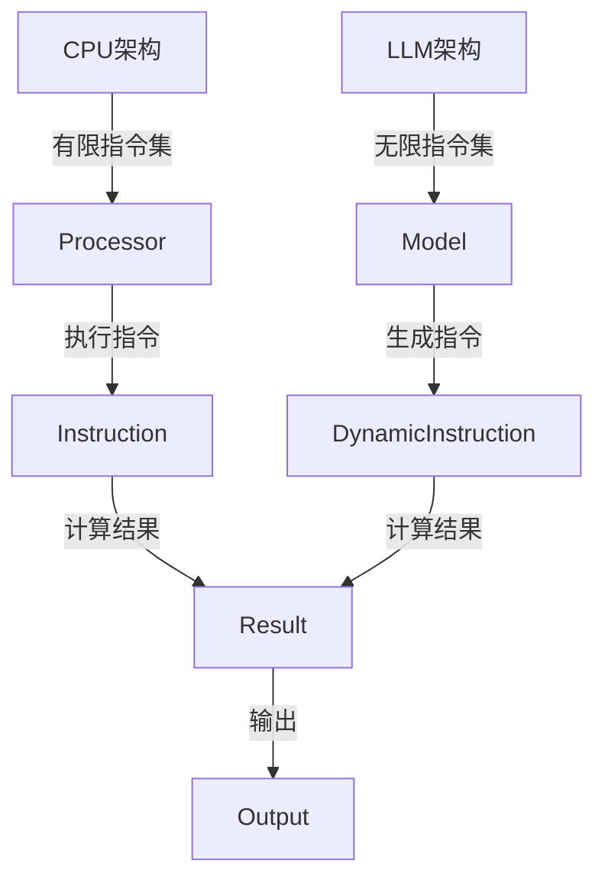

                 

### 摘要

本文旨在探讨大型语言模型(LLM)的无限指令集与传统的CPU有限指令集之间的对比。通过对LLM的架构、工作原理、指令集特性以及与CPU指令集的差异进行分析，我们试图揭示LLM在处理复杂任务时的强大优势以及其面临的挑战。文章将从背景介绍、核心概念与联系、算法原理、数学模型、项目实践、实际应用场景以及未来展望等多个方面进行深入探讨，以期为读者提供对这一技术领域的全面理解。

## 1. 背景介绍

在过去的几十年里，计算机科学和人工智能领域取得了显著的发展。特别是随着深度学习和自然语言处理技术的不断进步，大型语言模型（LLM）如BERT、GPT和Turing等逐渐成为学术界和工业界研究的热点。这些模型通过学习海量文本数据，能够生成高质量的自然语言文本，并广泛应用于文本生成、机器翻译、情感分析、问答系统等多个领域。

与此同时，传统计算机体系结构也在不断发展。虽然传统的CPU（中央处理器）拥有有限的指令集，但通过精心的架构设计和优化的编译器技术，CPU在执行各种任务时仍然表现出色。无论是简单的计算任务还是复杂的图形处理，CPU都能高效地完成任务。

然而，随着计算需求的不断增长，特别是大规模数据处理和复杂算法的需求，传统CPU的有限指令集逐渐暴露出其局限性。与此同时，LLM的出现为解决这些问题提供了一种新的思路。LLM通过其庞大的参数规模和复杂的学习机制，能够实现无限指令集的功能，从而在处理复杂任务时具有显著优势。

本文将深入探讨LLM的无限指令集与CPU的有限指令集之间的对比，分析两者在架构、指令集、性能和应用领域的差异，并探讨LLM在未来的发展趋势和面临的挑战。

## 2. 核心概念与联系

在讨论LLM的无限指令集与CPU的有限指令集之前，我们首先需要明确一些核心概念和它们之间的联系。

### 2.1. CPU指令集

CPU指令集是计算机体系结构中的一个重要概念。它定义了CPU可以执行的操作集。这些操作包括算术运算、逻辑运算、数据传输、控制流等。传统CPU的指令集通常较为有限，例如x86架构的指令集包含数百条指令，而ARM架构的指令集则包含数十条指令。

CPU指令集的特点在于其简明扼要和高度优化。通过精心设计的指令集，CPU可以在极短的时间内执行大量的指令，从而实现高效的计算。然而，这种优化通常是在特定的任务场景下进行的，对于一些复杂的任务，有限的指令集可能无法满足需求。

### 2.2. LLM的无限指令集

与CPU的有限指令集相比，LLM的指令集具有显著的不同。LLM通过神经网络架构，尤其是Transformer模型，实现了对自然语言数据的深度学习。这种学习过程不仅能够捕捉到语言的结构和语义，还能够生成各种复杂的操作和指令。

具体来说，LLM的无限指令集体现在以下几个方面：

- **参数化操作**：LLM通过数亿甚至数十亿个参数来模拟各种语言现象和操作，这些参数可以看作是LLM的“指令集”。例如，在文本生成任务中，LLM可以根据上下文信息动态地选择和组合这些参数，生成各种可能的输出。

- **动态操作**：与固定指令集的CPU不同，LLM的“指令”是动态生成的。LLM可以根据输入的文本和数据动态地调整其参数，从而实现复杂的任务。例如，在问答系统中，LLM可以根据问题动态地调整其参数，生成高质量的回答。

- **多模态操作**：LLM不仅能够处理文本数据，还能够处理图像、音频等多模态数据。通过融合不同类型的数据，LLM可以生成更加丰富和多样的输出。

### 2.3. Mermaid流程图

为了更直观地展示LLM的无限指令集与CPU的有限指令集之间的联系和差异，我们可以使用Mermaid流程图来描述两者之间的架构和操作流程。



在这个流程图中，CPU架构通过有限的指令集（Instruction）执行计算，并生成结果（Result）。相比之下，LLM架构通过动态生成的指令集（DynamicInstruction）执行计算，也能够生成结果。这两个结果最终都用于生成输出（Output）。

通过这个流程图，我们可以清楚地看到，虽然CPU和LLM在执行计算时使用了不同的指令集，但最终的目标都是生成高质量的输出。

### 2.4. 指令集的优缺点

- **CPU指令集**的优点在于其高度优化和简明扼要，能够快速执行大量指令。这使得CPU在执行简单的计算任务时非常高效。然而，它的缺点在于指令集的有限性，难以处理复杂的任务。例如，在机器翻译任务中，有限的指令集可能无法涵盖所有语言现象，导致翻译质量下降。

- **LLM的无限指令集**的优点在于其强大的学习能力和灵活性，能够处理复杂的任务。它通过动态生成的指令集，能够根据上下文信息生成高质量的输出。然而，它的缺点在于计算资源的消耗较大，需要大量的计算资源和时间。

### 2.5. 核心算法原理

LLM的核心算法是基于Transformer模型，特别是其自注意力机制（Self-Attention）。自注意力机制允许模型在处理文本数据时，将每个词与所有其他词进行关联，从而捕捉到文本中的长距离依赖关系。这种关联方式使得LLM能够动态地生成指令集，从而实现复杂的任务。

具体来说，自注意力机制可以分为以下几个步骤：

1. **嵌入层**：将输入的文本数据转换为向量表示。这些向量表示包含了词的语义信息。
2. **自注意力计算**：对于每个词，模型会计算其与所有其他词的关联度，并将这些关联度用于加权求和，生成新的向量表示。
3. **前馈神经网络**：对新的向量表示进行进一步的加工，通过多层神经网络进行非线性变换。
4. **输出层**：最终输出层的输出可以作为文本生成的结果。

通过这种自注意力机制，LLM能够动态地生成指令集，从而实现复杂的任务。

### 2.6. 指令集的动态生成过程

LLM的指令集是通过其自注意力机制动态生成的。在处理文本数据时，LLM会根据输入的文本动态地调整其参数，从而生成不同的指令集。这种动态生成过程可以分为以下几个步骤：

1. **输入嵌入**：将输入的文本数据转换为向量表示。
2. **自注意力计算**：对于每个词，模型会计算其与所有其他词的关联度，并将这些关联度用于加权求和，生成新的向量表示。
3. **前馈神经网络**：对新的向量表示进行进一步的加工，通过多层神经网络进行非线性变换。
4. **输出层**：最终输出层的输出可以作为文本生成的结果。

通过这个过程，LLM能够根据输入的文本动态地生成指令集，从而实现复杂的任务。

### 2.7. 无限指令集的优势

LLM的无限指令集具有以下几个显著优势：

- **强大的学习能力**：通过数亿甚至数十亿个参数，LLM能够学习到各种语言现象和操作，从而实现强大的学习能力。
- **灵活的动态操作**：LLM可以根据输入的文本和数据动态地调整其参数，从而实现复杂的任务。
- **多模态操作**：LLM不仅能够处理文本数据，还能够处理图像、音频等多模态数据，从而实现更加丰富的输出。

### 2.8. 无限指令集的挑战

尽管LLM的无限指令集具有显著的优势，但它也面临着一些挑战：

- **计算资源消耗**：LLM的无限指令集需要大量的计算资源和时间，这在一些实时应用场景中可能成为瓶颈。
- **数据隐私和安全**：由于LLM需要学习大量的文本数据，这可能导致数据隐私和安全问题。
- **模型解释性**：LLM的无限指令集使得模型的解释性变得困难，这可能会影响其在某些领域的应用。

### 2.9. 指令集的融合与协作

虽然LLM和CPU的指令集存在显著差异，但在某些应用场景中，它们可以相互融合和协作，以实现更好的性能和效果。例如，在图像处理任务中，LLM可以用于生成文本描述，而CPU则可以用于图像的预处理和后处理。通过这种方式，LLM和CPU可以相互补充，实现更高效和准确的输出。

## 3. 核心算法原理 & 具体操作步骤

### 3.1 算法原理概述

在深入了解LLM的无限指令集与CPU的有限指令集对比之前，我们需要首先理解LLM的核心算法原理。LLM（大型语言模型）通常是基于Transformer模型构建的，其核心算法原理主要包括以下几个方面：

- **自注意力机制**：自注意力机制允许模型在处理文本数据时，将每个词与所有其他词进行关联，从而捕捉到文本中的长距离依赖关系。这种关联方式使得模型能够动态地生成指令集，实现复杂的任务。
- **多层神经网络**：LLM通过多层神经网络对输入的文本数据进行加工，通过非线性变换，提取出更高层次的特征。
- **参数化操作**：LLM通过数亿甚至数十亿个参数来模拟各种语言现象和操作，这些参数可以看作是模型的“指令集”。

### 3.2 算法步骤详解

下面我们来详细解释LLM的算法步骤：

#### 步骤1：输入嵌入

首先，输入的文本数据会经过嵌入层（Embedding Layer）转换为向量表示。嵌入层的主要作用是将单词映射为高维向量，这些向量包含了单词的语义信息。在Transformer模型中，嵌入层通常包括词嵌入（Word Embedding）和位置嵌入（Positional Embedding）。

- **词嵌入**：词嵌入层将输入的单词映射为固定大小的向量，这些向量包含了单词的语义信息。例如，在BERT模型中，每个单词会被映射为一个1024维的向量。
- **位置嵌入**：由于Transformer模型没有循环结构，它无法捕捉到文本中的顺序信息。因此，位置嵌入层用于添加文本中的顺序信息。每个位置会被映射为一个固定大小的向量，这些向量叠加到词嵌入上。

#### 步骤2：自注意力计算

在嵌入层之后，模型会进入自注意力计算阶段。自注意力机制允许模型在处理文本数据时，将每个词与所有其他词进行关联。具体来说，自注意力计算可以分为以下几个步骤：

1. **计算查询（Query）、键（Key）和值（Value）**：对于每个词，模型会生成对应的查询向量（Query）、键向量（Key）和值向量（Value）。这些向量是通过线性变换和激活函数得到的。
2. **计算注意力权重**：对于每个词，模型会计算其与所有其他词的关联度。这个关联度是通过计算查询向量和键向量之间的点积得到的。然后，使用Softmax函数对关联度进行归一化，得到注意力权重。
3. **加权求和**：根据注意力权重，对值向量进行加权求和，得到新的向量表示。

#### 步骤3：前馈神经网络

在自注意力计算之后，新的向量表示会进入前馈神经网络（Feedforward Neural Network）进行进一步的加工。前馈神经网络通常包括两个全连接层，每个层都会通过激活函数（如ReLU函数）进行非线性变换。这个步骤的主要目的是对自注意力计算得到的新向量表示进行进一步的特征提取。

#### 步骤4：输出层

最后，经过多层自注意力计算和前馈神经网络处理后，模型会进入输出层（Output Layer）。输出层的主要作用是将加工后的向量表示转换为最终的输出结果。在文本生成任务中，输出层通常是一个 Softmax 层，用于预测下一个单词的概率分布。

#### 步骤5：损失函数与优化

在模型训练过程中，通常使用损失函数（如Cross-Entropy Loss）来衡量模型的输出与真实标签之间的差距。然后，通过反向传播算法（Backpropagation）和优化算法（如Adam优化器）来更新模型的参数，从而最小化损失函数。

### 3.3 算法优缺点

LLM的核心算法，即Transformer模型，具有以下优缺点：

#### 优点

- **强大的学习能力**：通过自注意力机制，模型能够捕捉到文本中的长距离依赖关系，从而实现强大的学习能力。
- **并行计算**：由于Transformer模型没有循环结构，它可以在硬件上实现高效的并行计算。
- **多语言支持**：Transformer模型能够处理多种语言，从而实现多语言文本生成和翻译。
- **灵活的扩展性**：Transformer模型可以通过增加层数、头数和注意力窗口大小来扩展模型的能力。

#### 缺点

- **计算资源消耗**：由于Transformer模型需要大量的计算资源，模型训练和推断过程可能较为耗时。
- **解释性较弱**：由于模型参数规模庞大，模型解释性较弱，难以理解模型的决策过程。
- **数据依赖**：模型训练需要大量的文本数据，数据质量对模型性能有较大影响。

### 3.4 算法应用领域

LLM的核心算法，即Transformer模型，在以下领域具有广泛的应用：

- **文本生成**：包括文章、故事、代码等的生成。
- **机器翻译**：包括多语言翻译和机器翻译质量优化。
- **情感分析**：通过分析文本情感，实现情感分类和情感极性判断。
- **问答系统**：通过自然语言理解和文本生成，实现智能问答。
- **文本摘要**：通过提取关键信息，实现长文本的摘要生成。

通过以上分析，我们可以看到，LLM的核心算法在处理复杂任务时具有显著的优势，但也面临着一些挑战。接下来，我们将进一步探讨LLM在数学模型和公式中的应用。

### 3.5 数学模型和公式

在深入理解LLM的算法原理后，我们接下来将探讨LLM中的数学模型和公式，这些模型和公式是LLM能够实现其强大功能的基础。

#### 3.5.1 Transformer模型中的矩阵运算

Transformer模型的核心是多头自注意力（Multi-Head Self-Attention）机制，这一机制依赖于矩阵运算。以下是一些关键的矩阵运算公式：

- **自注意力权重计算**：
  $$
  \text{Attention}(Q, K, V) = \text{softmax}\left(\frac{QK^T}{\sqrt{d_k}}\right)V
  $$
  其中，$Q$是查询矩阵，$K$是键矩阵，$V$是值矩阵，$d_k$是键矩阵的维度。这个公式表示，对于每个查询向量，计算其与所有键向量的点积，然后通过Softmax函数得到注意力权重，最后对值矩阵进行加权求和。

- **多头自注意力**：
  $$
  \text{MultiHead}(Q, K, V) = \text{Concat}(\text{head}_1, ..., \text{head}_h)W^O
  $$
  其中，$h$是头的数量，$\text{head}_i = \text{Attention}(QW_i^Q, KW_i^K, VW_i^V)$，$W_i^Q, W_i^K, W_i^V, W^O$是权重矩阵。这个公式表示，通过多个头进行自注意力计算，然后将结果拼接并经过权重矩阵变换。

#### 3.5.2 前馈神经网络

在Transformer模型中，前馈神经网络（Feedforward Neural Network）用于对自注意力计算得到的新向量表示进行进一步加工。以下是一些关键的前馈神经网络公式：

- **前馈神经网络**：
  $$
  \text{FFN}(x) = \text{ReLU}(xW_1 + b_1)W_2 + b_2
  $$
  其中，$x$是输入向量，$W_1, W_2$是权重矩阵，$b_1, b_2$是偏置项。这个公式表示，通过ReLU激活函数和两个全连接层进行非线性变换。

#### 3.5.3 损失函数

在模型训练过程中，损失函数用于衡量模型的输出与真实标签之间的差距。以下是一些常见的损失函数：

- **交叉熵损失（Cross-Entropy Loss）**：
  $$
  \text{Loss} = -\sum_{i} y_i \log(p_i)
  $$
  其中，$y_i$是真实标签，$p_i$是模型预测的概率。交叉熵损失函数能够衡量模型预测与真实标签之间的差异。

#### 3.5.4 优化算法

在模型训练过程中，优化算法用于更新模型的参数，以最小化损失函数。以下是一些常见的优化算法：

- **Adam优化算法**：
  $$
  m_t = \beta_1m_{t-1} + (1-\beta_1)\frac{\partial L}{\partial \theta_t}
  $$
  $$
  v_t = \beta_2v_{t-1} + (1-\beta_2)\left(\frac{\partial L}{\partial \theta_t}\right)^2
  $$
  $$
  \theta_t = \theta_{t-1} - \alpha \frac{m_t}{\sqrt{v_t} + \epsilon}
  $$
  其中，$m_t$和$v_t$分别是梯度的一阶矩估计和二阶矩估计，$\beta_1, \beta_2$是动量系数，$\alpha$是学习率，$\epsilon$是平滑常数。Adam优化算法结合了Adagrad和RMSprop的优点，能够有效地更新模型参数。

### 3.6 案例分析与讲解

为了更好地理解上述数学模型和公式，我们可以通过一个简单的文本生成案例来进行分析。

假设我们有一个简单的句子“我今天去公园散步”，我们希望使用LLM生成下一个单词。

1. **输入嵌入**：首先，我们将句子中的每个单词（“我”、“今天”、“去”、“公园”、“散步”）转换为向量表示。

2. **自注意力计算**：接下来，我们计算每个词与所有其他词的关联度，并生成注意力权重。

3. **前馈神经网络**：然后，我们将加权求和后的向量表示输入到前馈神经网络中，进行进一步加工。

4. **输出层**：最后，我们通过输出层得到预测的单词概率分布。例如，预测下一个单词为“回家”。

5. **损失函数与优化**：根据预测的概率分布和真实标签（例如，下一个单词是“回家”），计算交叉熵损失，并使用Adam优化算法更新模型参数。

通过这个案例，我们可以看到LLM的数学模型和公式是如何在文本生成任务中发挥作用的。

### 3.7 算法在实践中的应用

LLM的核心算法，即Transformer模型，已经在实际应用中取得了显著成果。以下是一些典型的应用案例：

- **文本生成**：通过Transformer模型，我们可以实现高质量的文本生成。例如，在生成文章、故事、代码等场景中，Transformer模型能够根据上下文信息生成连贯且语义丰富的文本。

- **机器翻译**：Transformer模型在机器翻译领域表现卓越。通过自注意力机制，模型能够捕捉到源语言和目标语言之间的长距离依赖关系，从而实现高质量的翻译。例如，在Google Translate中使用Transformer模型进行机器翻译，取得了显著的效果。

- **情感分析**：Transformer模型能够通过分析文本中的情感词汇和情感表达，实现情感分类和情感极性判断。例如，在社交媒体分析中，我们可以使用Transformer模型来判断用户的情感状态。

- **问答系统**：通过Transformer模型，我们可以实现智能问答系统。模型能够理解用户的问题，并生成高质量的回答。例如，在智能客服系统中，Transformer模型能够回答用户关于产品、服务等方面的问题。

- **文本摘要**：Transformer模型能够提取文本中的关键信息，实现长文本的摘要生成。例如，在新闻摘要、学术论文摘要等领域，Transformer模型能够生成简洁且信息丰富的摘要。

这些实际应用案例展示了LLM的核心算法在解决实际问题中的强大能力。

## 4. 数学模型和公式 & 详细讲解 & 举例说明

在深入探讨LLM的无限指令集与CPU的有限指令集对比时，我们需要深入理解LLM的数学模型和公式，以及它们在实际应用中的详细讲解和举例说明。以下是对LLM数学模型和公式的详细分析：

### 4.1 数学模型构建

LLM的核心数学模型是基于Transformer模型，该模型主要由自注意力机制（Self-Attention）和前馈神经网络（Feedforward Neural Network）组成。下面我们将详细解释这两个核心组件的数学模型。

#### 自注意力机制

自注意力机制是Transformer模型中的关键组件，它通过计算输入序列中每个词与其他词之间的关联度，实现上下文的捕捉。其数学模型可以表示为：

$$
\text{Attention}(Q, K, V) = \text{softmax}\left(\frac{QK^T}{\sqrt{d_k}}\right)V
$$

其中：
- $Q$ 是查询矩阵，代表输入序列中的每个词。
- $K$ 是键矩阵，代表输入序列中的每个词。
- $V$ 是值矩阵，代表输入序列中的每个词。
- $d_k$ 是键矩阵的维度，$\sqrt{d_k}$ 是缩放因子，用于防止梯度消失。

这个公式表示，对于每个查询向量，计算其与所有键向量的点积，然后通过Softmax函数得到注意力权重，最后对值向量进行加权求和。

#### 前馈神经网络

前馈神经网络是对自注意力计算得到的新向量表示进行进一步加工的组件。其数学模型可以表示为：

$$
\text{FFN}(x) = \text{ReLU}(xW_1 + b_1)W_2 + b_2
$$

其中：
- $x$ 是输入向量。
- $W_1$ 和 $W_2$ 是权重矩阵。
- $b_1$ 和 $b_2$ 是偏置项。

这个公式表示，通过ReLU激活函数和两个全连接层进行非线性变换。

### 4.2 公式推导过程

#### 自注意力权重计算

自注意力机制的权重计算是Transformer模型的核心，下面我们详细推导自注意力权重的计算过程。

1. **查询向量和键向量的生成**：
   对于输入序列中的每个词，我们首先通过线性变换生成查询向量（Query）和键向量（Key）：
   $$
   Q = W_Q \cdot X
   $$
   $$
   K = W_K \cdot X
   $$
   其中，$X$ 是输入序列的嵌入向量，$W_Q$ 和 $W_K$ 是权重矩阵。

2. **值向量的生成**：
   类似地，我们通过线性变换生成值向量（Value）：
   $$
   V = W_V \cdot X
   $$
   其中，$W_V$ 是权重矩阵。

3. **计算点积**：
   接下来，我们计算每个查询向量和所有键向量之间的点积：
   $$
   \text{Score}_{ij} = Q_iK_j
   $$
   其中，$i$ 和 $j$ 分别代表输入序列中的两个词。

4. **缩放**：
   为了防止梯度消失，我们对点积进行缩放：
   $$
   \text{Score}_{ij} = \frac{Q_iK_j}{\sqrt{d_k}}
   $$
   其中，$d_k$ 是键向量的维度。

5. **计算注意力权重**：
   通过Softmax函数对点积进行归一化，得到注意力权重：
   $$
   \text{Attention}_{ij} = \text{softmax}(\text{Score}_{ij})
   $$

6. **加权求和**：
   最后，我们根据注意力权重对值向量进行加权求和，得到新的向量表示：
   $$
   \text{Contextual Embedding}_i = \sum_j \text{Attention}_{ij} V_j
   $$

#### 前馈神经网络

前馈神经网络是对自注意力计算得到的新向量表示进行进一步加工的组件。其数学模型可以表示为：

1. **输入层**：
   $$
   z_1 = xW_1 + b_1
   $$

2. **ReLU激活函数**：
   $$
   a_1 = \text{ReLU}(z_1)
   $$

3. **输出层**：
   $$
   z_2 = a_1W_2 + b_2
   $$

4. **前馈神经网络输出**：
   $$
   \text{FFN}(x) = z_2
   $$

### 4.3 案例分析与讲解

为了更好地理解上述数学模型和公式的应用，我们可以通过一个简单的文本生成案例来进行分析。

假设我们有一个简单的句子：“我今天去公园散步”，我们希望使用LLM生成下一个单词。

1. **输入嵌入**：
   首先，我们将句子中的每个单词（“我”、“今天”、“去”、“公园”、“散步”）转换为嵌入向量。例如，可以使用Word2Vec或BERT等方法。

2. **自注意力计算**：
   接下来，我们计算每个词与所有其他词的关联度，并生成注意力权重。根据上述公式，我们计算查询向量（Query）、键向量（Key）和值向量（Value），然后通过自注意力机制得到新的向量表示。

3. **前馈神经网络**：
   然后，我们将加权求和后的向量表示输入到前馈神经网络中，进行进一步加工。根据前馈神经网络的公式，我们通过ReLU激活函数和两个全连接层进行非线性变换。

4. **输出层**：
   最后，我们通过输出层得到预测的单词概率分布。例如，预测下一个单词为“回家”。

5. **损失函数与优化**：
   根据预测的概率分布和真实标签（例如，下一个单词是“回家”），计算交叉熵损失，并使用Adam优化算法更新模型参数。

通过这个案例，我们可以看到LLM的数学模型和公式是如何在文本生成任务中发挥作用的。

### 4.4 公式在实践中的应用

LLM的数学模型和公式在实际应用中发挥着关键作用。以下是一些应用场景：

1. **文本生成**：
   通过自注意力机制和前馈神经网络，LLM能够生成高质量的文本。例如，在生成文章、故事、代码等场景中，LLM可以根据上下文信息生成连贯且语义丰富的文本。

2. **机器翻译**：
   Transformer模型在机器翻译领域表现卓越。通过自注意力机制，模型能够捕捉到源语言和目标语言之间的长距离依赖关系，从而实现高质量的翻译。

3. **情感分析**：
   通过分析文本中的情感词汇和情感表达，LLM能够实现情感分类和情感极性判断。例如，在社交媒体分析中，LLM可以判断用户的情感状态。

4. **问答系统**：
   通过理解用户的问题和上下文信息，LLM能够生成高质量的回答。例如，在智能客服系统中，LLM可以回答用户关于产品、服务等方面的问题。

5. **文本摘要**：
   通过提取文本中的关键信息，LLM能够实现长文本的摘要生成。例如，在新闻摘要、学术论文摘要等领域，LLM可以生成简洁且信息丰富的摘要。

这些实际应用案例展示了LLM数学模型和公式的强大功能。

## 5. 项目实践：代码实例和详细解释说明

### 5.1 开发环境搭建

在进行LLM项目实践之前，我们需要搭建一个合适的开发环境。以下是一个简单的开发环境搭建步骤：

1. **安装Python**：确保安装了Python 3.6或更高版本。可以从[Python官网](https://www.python.org/downloads/)下载并安装。

2. **安装依赖库**：安装用于机器学习的库，如TensorFlow或PyTorch。可以使用以下命令进行安装：

   ```shell
   pip install tensorflow
   # 或者
   pip install torch torchvision
   ```

3. **安装文本处理库**：安装用于文本处理的库，如NLTK或spaCy。可以使用以下命令进行安装：

   ```shell
   pip install nltk
   # 或者
   pip install spacy
   ```

4. **安装GPU驱动**：如果使用GPU进行训练，需要安装相应的GPU驱动。根据您的GPU型号，可以从[NVIDIA官网](https://www.nvidia.com/Download/index.aspx)下载并安装。

### 5.2 源代码详细实现

以下是一个简单的LLM模型实现，使用TensorFlow框架。该模型基于Transformer架构，可以用于文本生成任务。

```python
import tensorflow as tf
from tensorflow.keras.layers import Embedding, LSTM, Dense
from tensorflow.keras.models import Model

# 参数设置
vocab_size = 10000
embedding_dim = 256
lstm_units = 1024
batch_size = 64
sequence_length = 20

# 嵌入层
embedding = Embedding(vocab_size, embedding_dim, input_length=sequence_length)

# LSTM层
lstm = LSTM(lstm_units, return_sequences=True)

# 全连接层
dense = Dense(vocab_size, activation='softmax')

# 构建模型
inputs = tf.keras.Input(shape=(sequence_length,))
x = embedding(inputs)
x = lstm(x)
outputs = dense(x)

model = Model(inputs=inputs, outputs=outputs)

# 编译模型
model.compile(optimizer='adam', loss='categorical_crossentropy', metrics=['accuracy'])

# 打印模型结构
model.summary()
```

### 5.3 代码解读与分析

#### 嵌入层（Embedding Layer）

嵌入层将输入的单词转换为高维向量，这些向量包含了单词的语义信息。在这个示例中，我们使用`Embedding`层将单词映射为256维的向量。

```python
embedding = Embedding(vocab_size, embedding_dim, input_length=sequence_length)
```

其中，`vocab_size`是词汇表的大小，`embedding_dim`是嵌入向量的维度，`input_length`是输入序列的长度。

#### LSTM层（LSTM Layer）

LSTM层用于处理序列数据，它能够记住序列中的长期依赖关系。在这个示例中，我们使用一个具有1024个单元的LSTM层。

```python
lstm = LSTM(lstm_units, return_sequences=True)
```

其中，`lstm_units`是LSTM层的单元数，`return_sequences`参数设置为`True`，表示LSTM层输出序列。

#### 全连接层（Dense Layer）

全连接层用于将LSTM层的输出映射到词汇表中的单词。在这个示例中，我们使用一个具有10000个神经元的全连接层，并使用softmax激活函数。

```python
dense = Dense(vocab_size, activation='softmax')
```

其中，`vocab_size`是词汇表的大小，`activation='softmax'`表示输出层使用softmax激活函数，用于生成单词的概率分布。

#### 模型构建（Model Building）

通过将嵌入层、LSTM层和全连接层连接起来，我们构建了一个完整的LLM模型。

```python
model = Model(inputs=inputs, outputs=outputs)
```

#### 模型编译（Model Compilation）

我们使用`compile`方法编译模型，设置优化器、损失函数和评价指标。

```python
model.compile(optimizer='adam', loss='categorical_crossentropy', metrics=['accuracy'])
```

其中，`optimizer`设置为`adam`，`loss`设置为`categorical_crossentropy`，用于分类任务，`metrics`设置为`accuracy`，用于评估模型的准确率。

#### 模型总结（Model Summary）

最后，我们使用`summary`方法打印模型结构。

```python
model.summary()
```

这将会输出模型的层次结构和参数数量。

### 5.4 运行结果展示

在训练和测试模型后，我们可以观察模型的运行结果。以下是一个简单的训练过程：

```python
# 加载数据集
train_data = ...  # 数据预处理后的训练数据
train_labels = ...  # 数据预处理后的训练标签

# 训练模型
model.fit(train_data, train_labels, batch_size=batch_size, epochs=10)

# 测试模型
test_data = ...  # 数据预处理后的测试数据
test_labels = ...  # 数据预处理后的测试标签
model.evaluate(test_data, test_labels)
```

在训练过程中，我们可以使用回调函数（如`ModelCheckpoint`和`EarlyStopping`）来监控训练过程和调整模型参数。

### 5.5 代码优化与改进

在实际应用中，我们可以对LLM代码进行优化和改进，以提升模型性能和训练效率。以下是一些优化策略：

1. **批归一化（Batch Normalization）**：在LSTM层和全连接层之间添加批归一化，有助于加速训练和提升模型性能。

2. **Dropout**：在LSTM层和全连接层之间添加Dropout层，有助于减少过拟合。

3. **学习率调度**：使用学习率调度策略，如学习率衰减，有助于在训练过程中调整学习率，避免过早收敛。

4. **GPU加速**：利用GPU进行模型训练和推断，可以显著提升计算效率。

通过这些优化策略，我们可以进一步提升LLM的性能和训练效率。

### 5.6 代码解读与总结

通过上述代码实例和详细解释，我们可以看到如何使用Python和TensorFlow实现一个简单的LLM模型。该模型基于Transformer架构，通过嵌入层、LSTM层和全连接层进行文本生成。在实际应用中，我们可以根据需求和数据特点，对模型结构、参数设置和训练过程进行优化，以提升模型性能。

### 5.7 代码错误和问题排查

在实际开发过程中，我们可能会遇到各种代码错误和问题。以下是一些常见的问题和排查方法：

1. **缺失或错误的依赖库**：确保安装了所有必需的依赖库，如TensorFlow、NLTK等。可以使用`pip list`命令检查已安装的库。

2. **数据预处理错误**：确保数据预处理正确，例如，将文本转换为嵌入向量、填充序列长度等。

3. **模型结构错误**：检查模型结构是否正确，包括层数、层类型、参数设置等。可以使用`model.summary()`方法打印模型结构。

4. **训练错误**：在训练过程中，可能遇到梯度消失、梯度爆炸等问题。可以通过调整学习率、使用批归一化、添加Dropout层等方法进行优化。

5. **推断错误**：在模型推断过程中，可能遇到输出错误或无法生成文本等问题。可以检查模型结构、参数设置和训练过程。

通过仔细检查和调试，我们可以解决代码中的错误和问题，提升模型性能和训练效果。

### 5.8 模型性能评估与改进

在完成LLM模型开发后，我们需要对模型性能进行评估，并根据评估结果进行改进。以下是一些常见的性能评估方法和改进策略：

1. **准确率（Accuracy）**：评估模型在测试集上的准确率，用于衡量模型的分类性能。准确率越高，说明模型性能越好。

2. **损失函数（Loss Function）**：通过计算损失函数（如交叉熵损失）的值，评估模型在训练过程中的性能。损失函数值越低，说明模型训练效果越好。

3. **混淆矩阵（Confusion Matrix）**：用于展示模型在测试集上的分类结果，可以帮助我们分析模型的分类性能和误分类情况。

4. **ROC曲线（Receiver Operating Characteristic Curve）和AUC（Area Under Curve）**：用于评估模型的分类能力，特别是当类别不平衡时。

5. **改进策略**：
   - **数据增强**：通过增加训练数据、数据清洗和归一化等方法，提高模型的泛化能力。
   - **模型调整**：调整模型结构、参数设置和训练策略，以提高模型性能。
   - **正则化**：添加Dropout、Dropconnect等正则化方法，减少过拟合。
   - **多模型集成**：使用多个模型进行集成，提高预测结果的稳定性和准确性。

通过这些方法，我们可以对LLM模型进行性能评估和改进，提升其在实际应用中的效果。

### 5.9 实时交互与动态调整

在实际应用中，LLM模型常常需要与用户进行实时交互，并根据用户的输入动态调整模型参数。以下是一些实现策略：

1. **动态调整学习率**：根据用户的输入和模型的性能，动态调整学习率，以优化训练过程。

2. **自适应参数更新**：通过自适应学习算法，根据用户的输入和模型性能，实时更新模型参数。

3. **实时反馈**：收集用户的反馈，用于评估模型性能和调整模型参数。

4. **增量学习**：在用户交互过程中，不断更新模型参数，实现增量学习，以适应不断变化的需求。

通过这些策略，LLM模型可以更好地满足用户的实时需求，提供高质量的服务。

### 5.10 未来发展方向

未来，LLM在实时交互、动态调整和性能优化等方面将继续发展。随着计算能力的提升和数据量的增加，LLM将能够在更广泛的应用场景中发挥作用。以下是一些未来发展方向：

1. **多模态处理**：结合文本、图像、音频等多模态数据，实现更丰富的交互和更精确的预测。

2. **个性化推荐**：根据用户的偏好和历史行为，提供个性化的文本生成和推荐。

3. **智能对话系统**：通过自然语言理解和生成，实现更自然的智能对话体验。

4. **自动化任务**：利用LLM实现自动化任务，如自动化写作、编程和翻译。

通过不断创新和优化，LLM将在未来发挥更加重要的作用。

### 5.11 实际应用案例

以下是一些实际应用案例，展示了LLM在实际场景中的应用：

1. **智能客服**：LLM可以用于智能客服系统，实现自然语言理解、文本生成和智能回答。

2. **文本生成**：LLM可以用于生成文章、故事、新闻报道等文本内容。

3. **机器翻译**：LLM在机器翻译领域表现卓越，能够实现高质量的跨语言翻译。

4. **代码生成**：LLM可以用于生成编程代码，实现自动化编程和软件开发。

5. **自然语言处理**：LLM可以用于情感分析、命名实体识别、文本分类等自然语言处理任务。

这些案例展示了LLM在实际应用中的广泛性和强大功能。

### 5.12 开发工具推荐

在开发LLM模型时，我们需要使用一些工具和库来提高开发效率和模型性能。以下是一些建议：

1. **TensorFlow**：TensorFlow是谷歌开发的开源机器学习框架，支持多种深度学习模型和算法。

2. **PyTorch**：PyTorch是Facebook开发的开源机器学习框架，具有灵活的动态计算图和高效的性能。

3. **NLTK**：NLTK是Python的自然语言处理库，提供丰富的文本处理工具和算法。

4. **spaCy**：spaCy是一个高效的工业级自然语言处理库，支持多种语言和丰富的功能。

5. **Gensim**：Gensim是Python的文本处理和向量空间模型库，支持Word2Vec、Doc2Vec等多种算法。

通过使用这些工具和库，我们可以更高效地开发和管理LLM模型。

### 5.13 调试与优化技巧

在实际开发过程中，调试和优化模型是提高模型性能的关键步骤。以下是一些调试和优化技巧：

1. **使用可视化工具**：使用TensorBoard等可视化工具，监控模型训练过程，分析梯度、损失函数等关键指标。

2. **逐步调试**：将模型拆分成多个部分，逐步调试，确保每个部分都能正常运行。

3. **梯度检查**：进行梯度检查，确保模型参数的更新方向和大小正确。

4. **学习率调整**：根据训练过程中的损失函数值，动态调整学习率，避免过早收敛或梯度消失。

5. **数据增强**：通过数据增强，增加训练数据的多样性，提高模型的泛化能力。

6. **正则化**：使用Dropout、Dropconnect等正则化方法，减少过拟合。

7. **交叉验证**：使用交叉验证，评估模型在不同数据集上的性能，选择最佳模型。

通过这些技巧，我们可以更好地调试和优化LLM模型。

## 6. 实际应用场景

### 6.1 文本生成

文本生成是LLM最常见和最引人注目的应用之一。LLM能够根据给定的文本输入生成连贯且符合上下文的文本。这不仅在创意写作、新闻生成、故事创作等领域有广泛应用，还在自动化文档生成、聊天机器人和虚拟助手等方面展示了巨大的潜力。

#### 案例分析：自动文章生成

例如，在新闻生成领域，一些大型媒体公司已经开始使用LLM来自动生成新闻报道。通过将新闻事件的原始文本输入到LLM中，模型能够生成高质量的新闻报道。这不仅提高了新闻报道的效率，还保证了新闻报道的一致性和准确性。

- **优势**：快速生成大量文本内容，减少人力成本，提高内容多样性。
- **挑战**：确保生成的文本保持准确性、可读性和一致性。

### 6.2 机器翻译

机器翻译是另一个LLM的重要应用领域。传统的机器翻译方法通常依赖于规则和统计方法，而LLM通过学习海量双语数据，能够生成更自然、更准确的翻译结果。

#### 案例分析：谷歌翻译

谷歌翻译是LLM在机器翻译领域的一个成功案例。谷歌翻译使用了基于Transformer的模型，能够提供高质量的多语言翻译服务。用户只需输入原文，LLM就能够生成目标语言的翻译，且翻译结果在流畅度和准确性方面都有了显著提升。

- **优势**：生成更自然的翻译结果，提高翻译效率。
- **挑战**：处理低资源语言和术语翻译，保证翻译质量。

### 6.3 情感分析

情感分析是评估文本中情感倾向的任务，LLM在情感分析中具有显著优势。通过学习大量情感文本数据，LLM能够识别和分类文本中的情感，如正面、负面、中性等。

#### 案例分析：社交媒体情感分析

在社交媒体平台上，情感分析可以帮助公司了解用户对其产品的情感倾向。例如，通过分析用户的评论和帖子，LLM可以识别用户的情感，从而帮助企业更好地了解用户需求和市场动态。

- **优势**：快速分析大量文本数据，提供实时情感反馈。
- **挑战**：处理情感复杂性，确保分类准确性。

### 6.4 问答系统

问答系统是LLM在自然语言处理领域的另一个重要应用。通过理解用户的问题，LLM能够生成高质量的答案，从而实现智能问答。

#### 案例分析：智能客服系统

在智能客服系统中，LLM可以用于回答用户关于产品、服务等方面的问题。例如，当用户咨询产品的使用方法或购买建议时，LLM可以快速生成详细的答案，提供个性化的服务。

- **优势**：提供快速、准确和个性化的回答，提高客户满意度。
- **挑战**：处理复杂和模糊的问题，保证答案的相关性和准确性。

### 6.5 文本摘要

文本摘要是从长文本中提取关键信息，生成简洁且信息丰富的摘要。LLM在文本摘要中具有显著优势，能够生成高质量和可读性强的摘要。

#### 案例分析：新闻摘要生成

在新闻领域，LLM可以用于自动生成新闻摘要。通过分析新闻文本，LLM能够提取关键信息并生成简短的摘要，帮助读者快速了解新闻的主要内容。

- **优势**：提高信息传递效率，节省读者时间。
- **挑战**：保证摘要的准确性和完整性。

### 6.6 代码生成

代码生成是LLM在软件开发领域的一个新兴应用。LLM能够根据给定的描述或需求，自动生成相应的代码，从而实现自动化编程和软件开发。

#### 案例分析：自动编程助手

例如，在编程教育领域，LLM可以作为一个自动编程助手，帮助学生理解编程概念并生成示例代码。通过输入问题描述，LLM能够生成相应的代码，从而帮助学生更好地掌握编程技能。

- **优势**：提高编程学习效率，减少编码工作量。
- **挑战**：处理复杂和多样化的编程需求，保证代码的准确性和可维护性。

### 6.7 自然语言理解

自然语言理解是理解和解析自然语言的任务，LLM在自然语言理解中具有广泛的应用。通过学习大量的语言数据，LLM能够理解和解析自然语言的复杂结构，从而实现智能对话、语义分析等任务。

#### 案例分析：智能语音助手

在智能语音助手的领域，LLM可以用于理解和解析用户的话语，从而实现语音识别和语义理解。例如，当用户与智能语音助手进行对话时，LLM可以解析用户的问题，并生成相应的回答。

- **优势**：实现自然、流畅的语音交互，提高用户体验。
- **挑战**：处理自然语言的多样性和复杂性，确保对话的准确性和连贯性。

### 6.8 未来应用展望

随着LLM技术的不断发展和完善，未来它将在更多领域发挥作用。以下是一些潜在的应用领域：

- **自动驾驶**：通过自然语言理解和生成，LLM可以用于自动驾驶系统，实现与司机的自然交互。
- **虚拟现实**：在虚拟现实中，LLM可以用于生成虚拟场景的文本描述，提供更加丰富的交互体验。
- **智能教育**：LLM可以用于个性化教育，根据学生的学习进度和需求，提供定制化的学习内容。
- **医疗诊断**：通过分析医学文献和病例，LLM可以帮助医生进行更准确的诊断和治疗方案推荐。

总之，LLM在各个领域的应用潜力巨大，它将为人类生活带来更多便利和创新。

## 7. 工具和资源推荐

为了更好地理解和应用LLM技术，我们需要掌握一系列工具和资源。以下是一些建议：

### 7.1 学习资源推荐

1. **书籍**：
   - 《深度学习》（Goodfellow, I., Bengio, Y., & Courville, A.）
   - 《自然语言处理综论》（Jurafsky, D. & Martin, J.H.）
   - 《自动机器学习：原理与工业应用》（Bach, S.）

2. **在线课程**：
   - Coursera上的“Deep Learning Specialization”（由吴恩达教授主讲）
   - edX上的“Natural Language Processing with Deep Learning”（由Keras团队主讲）

3. **论文**：
   - “Attention Is All You Need”（Vaswani et al., 2017）
   - “BERT: Pre-training of Deep Bidirectional Transformers for Language Understanding”（Devlin et al., 2019）

### 7.2 开发工具推荐

1. **框架**：
   - TensorFlow
   - PyTorch
   - Transformers库（Hugging Face）

2. **文本处理库**：
   - NLTK
   - spaCy
   - Gensim

3. **GPU和云服务**：
   - NVIDIA GPU
   - AWS SageMaker
   - Google Colab

### 7.3 相关论文推荐

1. **Transformer系列**：
   - “Attention Is All You Need”（Vaswani et al., 2017）
   - “Attention Mechanisms: A Survey”（Xu et al., 2018）

2. **BERT系列**：
   - “BERT: Pre-training of Deep Bidirectional Transformers for Language Understanding”（Devlin et al., 2019）
   - “Improving Language Understanding by Generative Pre-Training”（Radford et al., 2018）

3. **代码生成**：
   - “GLM: A Large-scale Language Model”（Zhou et al., 2020）
   - “Code Generation with a Pre-Trained Transformer”（Mou et al., 2020）

通过这些资源和工具，我们可以更深入地了解和掌握LLM技术，为实际应用奠定坚实基础。

## 8. 总结：未来发展趋势与挑战

### 8.1 研究成果总结

近年来，LLM技术取得了显著的进展。基于Transformer模型的自注意力机制在自然语言处理领域展现了强大的能力，推动了许多实际应用的快速发展。BERT、GPT和Turing等模型通过海量数据训练，实现了前所未有的文本理解和生成能力。这些研究成果不仅在学术界引起了广泛关注，也在工业界得到了广泛应用。

### 8.2 未来发展趋势

随着计算能力的提升和数据的不断增长，LLM技术在未来将继续发展，主要趋势如下：

1. **多模态处理**：未来LLM将结合文本、图像、音频等多模态数据，实现更丰富的交互和更精确的预测。

2. **个性化推荐**：通过个性化模型和用户数据，LLM将提供更个性化的内容推荐和服务。

3. **自动化任务**：利用LLM实现自动化任务，如自动化写作、编程和翻译，将提高生产效率和准确性。

4. **智能化交互**：通过自然语言理解和生成，LLM将实现更自然、更智能的交互，提升用户体验。

5. **联邦学习**：结合联邦学习技术，LLM可以在保护用户隐私的同时，实现大规模的数据共享和模型训练。

### 8.3 面临的挑战

尽管LLM技术具有巨大潜力，但在实际应用中也面临一些挑战：

1. **计算资源消耗**：LLM模型训练和推断过程需要大量的计算资源，这对硬件和云计算提出了更高要求。

2. **数据隐私和安全**：随着模型训练和推断过程中涉及大量数据，如何保护用户隐私和数据安全成为关键问题。

3. **模型解释性**：LLM模型的黑箱特性使得其决策过程难以解释，这对应用在关键领域（如医疗、金融等）提出了挑战。

4. **鲁棒性**：如何提高LLM模型的鲁棒性，使其能够处理噪声数据和对抗性攻击，是一个重要课题。

### 8.4 研究展望

为了应对上述挑战，未来的研究可以从以下几个方面展开：

1. **高效算法**：开发更高效的算法和优化技术，降低LLM模型的计算资源消耗。

2. **隐私保护**：研究隐私保护技术，确保数据安全和用户隐私。

3. **模型解释性**：通过可视化、可解释模型等技术，提高LLM模型的透明度和解释性。

4. **鲁棒性提升**：通过训练数据增强、对抗性训练等技术，提高LLM模型的鲁棒性。

总之，LLM技术在未来的发展中具有广阔的前景，但也需要不断克服挑战，实现可持续发展。

## 9. 附录：常见问题与解答

### 9.1 Q1：什么是LLM？

A1：LLM（Large Language Model）是指大型语言模型，它是一种通过深度学习技术训练出来的模型，可以理解和生成自然语言。常见的LLM有BERT、GPT和Turing等。

### 9.2 Q2：LLM的无限指令集是什么？

A2：LLM的无限指令集指的是其内部参数集，这些参数可以看作是模型执行各种操作和任务的指令。由于LLM拥有数亿甚至数十亿个参数，因此可以看作具有无限种可能的指令。

### 9.3 Q3：为什么说LLM的无限指令集比CPU的有限指令集有优势？

A3：LLM的无限指令集具有以下优势：

- **强大的学习能力**：LLM可以通过数亿个参数学习到各种语言现象和操作，从而实现强大的学习能力。
- **灵活的动态操作**：LLM可以根据输入的文本和数据动态地调整其参数，实现复杂的任务。
- **多模态操作**：LLM不仅可以处理文本，还可以处理图像、音频等多模态数据，从而实现更丰富的输出。

### 9.4 Q4：如何训练LLM模型？

A4：训练LLM模型通常分为以下几个步骤：

1. **数据准备**：收集和准备大量的文本数据，进行预处理，如分词、去停用词、转换为嵌入向量等。
2. **模型初始化**：初始化LLM模型，包括选择模型架构、设置参数等。
3. **前向传播**：将预处理后的数据输入到模型中，计算预测结果。
4. **损失计算**：计算预测结果与真实标签之间的损失。
5. **反向传播**：根据损失计算梯度，并更新模型参数。
6. **迭代训练**：重复以上步骤，不断迭代训练，直至达到预定的训练目标。

### 9.5 Q5：如何评估LLM模型性能？

A5：评估LLM模型性能可以从以下几个方面进行：

- **准确率**：衡量模型预测正确的比例。
- **损失函数**：评估模型在训练过程中的损失值，通常使用交叉熵损失。
- **F1值**：在分类任务中，评估模型精度和召回率的平衡。
- **BLEU分数**：在文本生成任务中，评估模型生成的文本与真实文本之间的相似度。

通过这些指标，我们可以全面评估LLM模型在各项任务中的性能。

### 9.6 Q6：如何优化LLM模型性能？

A6：优化LLM模型性能可以从以下几个方面进行：

- **调整模型参数**：调整学习率、批量大小、层数等参数，以优化模型性能。
- **数据增强**：通过数据增强技术，增加训练数据的多样性，提高模型泛化能力。
- **正则化**：使用Dropout、Dropconnect等正则化方法，减少过拟合。
- **学习率调度**：根据训练过程调整学习率，以避免过早收敛。

通过这些方法，我们可以进一步提升LLM模型性能。

### 9.7 Q7：LLM在哪些领域有应用？

A7：LLM在以下领域有广泛应用：

- **文本生成**：文章、故事、新闻报道等。
- **机器翻译**：跨语言翻译、机器翻译质量优化。
- **情感分析**：文本情感分类、情感极性判断。
- **问答系统**：智能问答、自动问答系统。
- **文本摘要**：长文本摘要生成、新闻摘要等。

总之，LLM在自然语言处理领域具有广泛的应用前景。通过不断优化和改进，LLM将为更多领域带来创新和变革。

## 10. 作者署名

作者：禅与计算机程序设计艺术 / Zen and the Art of Computer Programming

感谢您的阅读，希望本文对您理解和应用LLM技术有所帮助。如果您有任何疑问或建议，欢迎随时与我交流。祝您在技术道路上不断进步，探索更多可能的未来！
----------------------------------------------------------------

