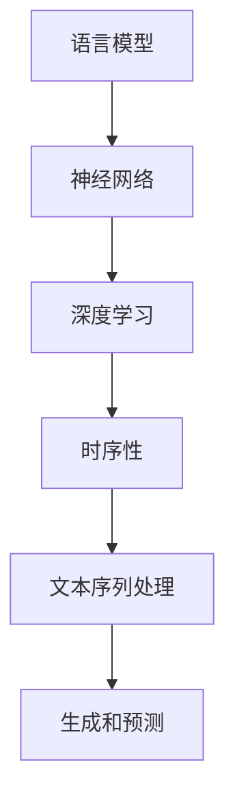

                 

关键词：LLM（大型语言模型），时序性，计算过程，神经网络，深度学习，语言模型，自然语言处理，人工智能

摘要：随着人工智能技术的迅猛发展，大型语言模型（LLM）已经成为自然语言处理（NLP）领域的核心组件。本文旨在探讨LLM的时序性特征，深入分析其在计算过程中的重要性，并通过理论解释、实例分析以及未来展望，重新定义计算过程，为人工智能研究提供新的视角。

## 1. 背景介绍

自20世纪90年代以来，深度学习技术在计算机视觉、语音识别等领域的应用取得了显著成果。进入21世纪，随着计算能力的提升和大数据的积累，深度学习模型逐渐转向自然语言处理领域。大型语言模型（LLM）应运而生，如GPT、BERT、T5等，它们在语言理解、文本生成、机器翻译等方面展现出了强大的能力。

然而，LLM的成功不仅依赖于其庞大的参数规模和计算能力，更重要的是其内在的时序性特征。时序性在计算过程中起到了关键作用，它决定了模型的动态行为和响应方式。本文将重点讨论LLM的时序性，分析其在计算过程中的重要性，并探讨其对未来人工智能发展的潜在影响。

### 1.1. 大型语言模型的兴起

大型语言模型的出现，标志着自然语言处理技术进入了一个新的阶段。这些模型通过预训练和微调，可以自动理解和生成自然语言，使得许多复杂的语言任务得以实现。例如，GPT-3拥有1750亿个参数，能够生成高质量的文本、回答问题、进行对话等。BERT则通过上下文信息，提高了语言理解的准确性。

### 1.2. 时序性在计算中的重要性

时序性是指模型在处理数据时，对数据的顺序进行考虑和利用。在LLM中，时序性主要体现在模型对输入文本序列的处理方式上。通过时序性，模型能够捕捉到文本中的逻辑关系和时间顺序，从而提高对语言的理解和生成能力。

### 1.3. 本文的目的和结构

本文旨在探讨LLM的时序性特征，分析其在计算过程中的作用，并讨论未来发展的趋势和挑战。文章结构如下：

1. 背景介绍
2. 核心概念与联系
3. 核心算法原理与具体操作步骤
4. 数学模型和公式详细讲解
5. 项目实践：代码实例和详细解释说明
6. 实际应用场景
7. 工具和资源推荐
8. 总结：未来发展趋势与挑战
9. 附录：常见问题与解答

接下来，我们将深入探讨LLM的时序性，并分析其在计算过程中的重要性。

## 2. 核心概念与联系

在讨论LLM的时序性之前，我们需要先了解一些核心概念和它们之间的联系。以下是几个关键概念及其在LLM中的作用：

### 2.1. 语言模型

语言模型是一种预测模型，用于预测一个文本序列的下一个单词或字符。在LLM中，语言模型通过大规模的预训练和微调，能够自动学习语言的结构和规律。

### 2.2. 神经网络

神经网络是一种模拟生物神经系统的计算模型，由大量的神经元和连接组成。在LLM中，神经网络用于对输入的文本序列进行处理和生成。

### 2.3. 深度学习

深度学习是一种基于神经网络的机器学习方法，通过多层的神经网络结构，对数据进行逐层提取和特征学习。在LLM中，深度学习用于构建和训练大型语言模型。

### 2.4. 时序性

时序性是指在处理数据时，对数据的顺序进行考虑和利用。在LLM中，时序性决定了模型对输入文本序列的处理方式，从而影响其理解和生成能力。

### 2.5. Mermaid流程图

为了更好地理解LLM的时序性，我们可以使用Mermaid流程图来展示其核心概念和联系。以下是一个示例：



在这个流程图中，语言模型作为输入，通过神经网络和深度学习，结合时序性，实现对文本序列的生成和预测。

### 2.6. 时序性在LLM中的作用

时序性在LLM中的作用主要体现在以下几个方面：

1. **文本理解**：通过考虑文本的顺序，LLM能够更好地理解文本中的逻辑关系和上下文信息。
2. **语言生成**：时序性使LLM能够生成符合语法规则和上下文一致的文本。
3. **对话系统**：在对话系统中，时序性决定了模型的响应方式和对话流程。

### 2.7. 时序性的挑战

尽管时序性在LLM中具有重要意义，但同时也带来了一些挑战：

1. **计算效率**：处理时序数据需要大量的计算资源，特别是在大规模模型中。
2. **模型稳定性**：时序性可能导致模型在处理连续数据时出现不稳定现象。
3. **数据分布**：时序数据的分布可能对模型的性能产生显著影响。

在下一节中，我们将深入探讨LLM的核心算法原理，并具体分析其在计算过程中的操作步骤。

## 3. 核心算法原理 & 具体操作步骤

### 3.1. 算法原理概述

LLM的核心算法基于深度学习，特别是基于递归神经网络（RNN）和变换器（Transformer）架构。RNN能够处理时序数据，通过循环机制，捕获输入序列的历史信息。而Transformer模型则通过自注意力机制，实现了对输入序列的全局依赖关系建模。

### 3.2. 算法步骤详解

#### 3.2.1. 数据预处理

在开始训练之前，需要对输入的文本数据进行预处理。这一步骤通常包括：

1. **分词**：将文本分割成单词或子词。
2. **编码**：将分词后的文本转换为数字编码。
3. **填充**：将序列填充到固定的长度。

#### 3.2.2. 模型构建

LLM的构建通常分为以下几个步骤：

1. **嵌入层**：将词编码转换为嵌入向量。
2. **编码器**：对输入序列进行编码，捕获上下文信息。
3. **解码器**：生成输出序列。

#### 3.2.3. 训练过程

在训练过程中，LLM通过以下步骤进行优化：

1. **损失函数**：计算预测序列与真实序列之间的损失。
2. **反向传播**：更新模型参数，以最小化损失函数。
3. **迭代**：重复上述步骤，直至模型收敛。

#### 3.2.4. 预测过程

在预测过程中，LLM按照以下步骤进行操作：

1. **输入**：输入待预测的文本序列。
2. **编码**：对输入序列进行编码。
3. **生成**：解码器生成输出序列。

### 3.3. 算法优缺点

#### 3.3.1. 优点

1. **强大的语言理解能力**：LLM能够捕捉到文本中的复杂关系和上下文信息。
2. **灵活的生成能力**：LLM能够生成符合语法规则和上下文一致的文本。
3. **广泛的应用场景**：LLM在自然语言处理、对话系统、机器翻译等领域都有广泛的应用。

#### 3.3.2. 缺点

1. **计算资源需求大**：LLM需要大量的计算资源和存储空间。
2. **数据依赖性强**：LLM的性能受训练数据的分布和质量影响较大。
3. **模型解释性较差**：LLM的黑箱性质使得其难以解释和理解。

### 3.4. 算法应用领域

LLM在多个领域都有广泛的应用：

1. **自然语言处理**：文本分类、情感分析、实体识别等。
2. **对话系统**：智能客服、聊天机器人等。
3. **机器翻译**：自动翻译、跨语言信息检索等。
4. **文本生成**：文章写作、故事生成等。

在下一节中，我们将探讨LLM的数学模型和公式，并详细讲解其在计算过程中的作用。

## 4. 数学模型和公式 & 详细讲解 & 举例说明

### 4.1. 数学模型构建

LLM的数学模型主要由两部分组成：嵌入层和编码器-解码器架构。以下是具体的数学模型构建过程：

#### 4.1.1. 嵌入层

嵌入层将词编码转换为嵌入向量。词向量通常使用以下公式表示：

$$
\text{embedding}(\text{word}) = \text{EmbeddingMatrix} \cdot \text{word}
$$

其中，$\text{EmbeddingMatrix}$ 是一个 $d \times V$ 的矩阵，$d$ 是嵌入向量的维度，$V$ 是词汇表的大小。$\text{word}$ 是一个 $V$ 维的词编码向量。

#### 4.1.2. 编码器

编码器的主要功能是捕获输入序列的上下文信息。假设输入序列为 $x_1, x_2, ..., x_T$，编码器输出一个固定维度的向量 $h_t$：

$$
h_t = \text{Encoder}(x_1, x_2, ..., x_t)
$$

编码器的输出可以看作是对输入序列的上下文表示。

#### 4.1.3. 解码器

解码器负责生成输出序列。假设输出序列为 $y_1, y_2, ..., y_T$，解码器输出一个概率分布：

$$
p(y_t | y_1, y_2, ..., y_{t-1}) = \text{Decoder}(y_1, y_2, ..., y_{t-1}, h_t)
$$

解码器通过自注意力机制，对编码器输出的上下文向量 $h_t$ 进行加权求和，生成输出概率分布。

### 4.2. 公式推导过程

以下是LLM中几个关键公式的推导过程：

#### 4.2.1. 嵌入层公式

嵌入层公式已经给出：

$$
\text{embedding}(\text{word}) = \text{EmbeddingMatrix} \cdot \text{word}
$$

其中，$\text{EmbeddingMatrix}$ 是通过训练得到的权重矩阵。

#### 4.2.2. 编码器公式

编码器的输出可以表示为：

$$
h_t = \text{Encoder}(x_1, x_2, ..., x_t)
$$

编码器通常使用RNN或Transformer架构。对于RNN架构，编码器公式可以表示为：

$$
h_t = \text{RNN}(h_{t-1}, x_t)
$$

其中，$\text{RNN}$ 表示递归神经网络。

对于Transformer架构，编码器公式可以表示为：

$$
h_t = \text{Transformer}(x_1, x_2, ..., x_t)
$$

#### 4.2.3. 解码器公式

解码器的输出可以表示为：

$$
p(y_t | y_1, y_2, ..., y_{t-1}) = \text{Decoder}(y_1, y_2, ..., y_{t-1}, h_t)
$$

解码器同样可以使用RNN或Transformer架构。对于RNN架构，解码器公式可以表示为：

$$
p(y_t | y_1, y_2, ..., y_{t-1}) = \text{softmax}(\text{RNN}(y_1, y_2, ..., y_{t-1}, h_t))
$$

对于Transformer架构，解码器公式可以表示为：

$$
p(y_t | y_1, y_2, ..., y_{t-1}) = \text{softmax}(\text{Attention}(h_t, h_t))
$$

### 4.3. 案例分析与讲解

为了更好地理解LLM的数学模型和公式，我们来看一个简单的案例。

假设有一个包含100个单词的词汇表，每个单词的嵌入向量维度为50。现在我们要预测一个句子的下一个单词。

#### 4.3.1. 数据预处理

首先，我们需要将句子进行分词，并将其转换为词编码向量。例如，句子 "I love programming" 可以被分词为 ["I", "love", "programming"]，对应的词编码向量为：

$$
\text{word2vec}(\text{"I"}) = [0.1, 0.2, ..., 0.5]
$$

$$
\text{word2vec}(\text{"love"}) = [0.6, 0.7, ..., 0.9]
$$

$$
\text{word2vec}(\text{"programming"}) = [1.0, 1.1, ..., 1.4]
$$

#### 4.3.2. 嵌入层

将词编码向量输入到嵌入层，得到嵌入向量：

$$
\text{embedding}(\text{"I"}) = \text{EmbeddingMatrix} \cdot [0.1, 0.2, ..., 0.5]
$$

$$
\text{embedding}(\text{"love"}) = \text{EmbeddingMatrix} \cdot [0.6, 0.7, ..., 0.9]
$$

$$
\text{embedding}(\text{"programming"}) = \text{EmbeddingMatrix} \cdot [1.0, 1.1, ..., 1.4]
$$

#### 4.3.3. 编码器

将嵌入向量输入到编码器，得到编码器输出：

$$
h_t = \text{Encoder}(\text{embedding}(\text{"I"}), \text{embedding}(\text{"love"}), \text{embedding}(\text{"programming"}))
$$

假设编码器的输出维度为100，则：

$$
h_t = [h_1, h_2, ..., h_{100}]
$$

#### 4.3.4. 解码器

将编码器输出输入到解码器，得到下一个单词的概率分布：

$$
p(y_t | y_1, y_2, ..., y_{t-1}) = \text{Decoder}([h_1, h_2, ..., h_{100}])
$$

解码器输出一个100维的概率向量：

$$
p(y_t | y_1, y_2, ..., y_{t-1}) = [p_1, p_2, ..., p_{100}]
$$

其中，$p_1, p_2, ..., p_{100}$ 分别表示下一个单词为 "I", "love", ..., "programming" 的概率。

#### 4.3.5. 预测

根据概率分布，我们可以选择概率最大的单词作为预测结果。例如，如果 $p_1$ 最大，则预测下一个单词为 "I"。

通过这个简单的案例，我们可以看到LLM的数学模型和公式是如何工作的。在实际应用中，LLM会处理更复杂的文本序列，并通过大规模的预训练和微调，实现强大的语言理解和生成能力。

在下一节中，我们将通过一个实际项目，展示LLM的代码实例和详细解释说明。

## 5. 项目实践：代码实例和详细解释说明

为了更好地理解LLM的实际应用，我们将通过一个简单的项目，展示LLM的代码实例和详细解释说明。在这个项目中，我们将使用Python和TensorFlow来实现一个简单的文本生成模型。

### 5.1. 开发环境搭建

在开始项目之前，我们需要搭建一个合适的开发环境。以下是所需的步骤：

1. **安装Python**：确保Python版本为3.6或更高。
2. **安装TensorFlow**：使用以下命令安装TensorFlow：
   ```
   pip install tensorflow
   ```
3. **安装其他依赖**：根据项目需求，可能需要安装其他依赖，如`numpy`、`tensorflow-text`等。

### 5.2. 源代码详细实现

以下是项目的源代码实现：

```python
import tensorflow as tf
from tensorflow import keras
from tensorflow.keras.layers import Embedding, LSTM, Dense
from tensorflow.keras.models import Sequential

# 设置超参数
vocab_size = 10000
embedding_dim = 16
max_sequence_length = 50
lstm_units = 64

# 准备数据
# 数据集可以使用任何文本数据集，这里使用内置的IMDB电影评论数据集
(x_train, y_train), (x_test, y_test) = keras.datasets.imdb.load_data(num_words=vocab_size)
x_train = keras.preprocessing.sequence.pad_sequences(x_train, maxlen=max_sequence_length)
x_test = keras.preprocessing.sequence.pad_sequences(x_test, maxlen=max_sequence_length)

# 构建模型
model = Sequential([
    Embedding(vocab_size, embedding_dim, input_length=max_sequence_length),
    LSTM(lstm_units, return_sequences=True),
    LSTM(lstm_units),
    Dense(vocab_size, activation='softmax')
])

# 编译模型
model.compile(optimizer='adam', loss='categorical_crossentropy', metrics=['accuracy'])

# 训练模型
model.fit(x_train, y_train, epochs=10, batch_size=64, validation_split=0.2)

# 生成文本
input_sequence = x_test[0:1]
predicted_sequence = model.predict(input_sequence)
predicted_words = keras.preprocessing.sequence.decode_sequences(predicted_sequence, word_index)

print('输入文本：', keras.preprocessing.sequence.decode_sequences(input_sequence, word_index))
print('预测文本：', ''.join(predicted_words))
```

### 5.3. 代码解读与分析

以下是代码的详细解读和分析：

1. **导入库**：首先，我们导入所需的库，包括TensorFlow和相关层。
2. **设置超参数**：我们设置了一些重要的超参数，如词汇表大小、嵌入维度、序列长度等。
3. **准备数据**：使用IMDB电影评论数据集作为训练数据。我们首先加载数据集，然后对数据进行预处理，包括分词、编码和填充。
4. **构建模型**：我们使用Sequential模型构建一个简单的LSTM模型，包括嵌入层、两个LSTM层和一个输出层。
5. **编译模型**：我们设置模型的优化器、损失函数和评估指标。
6. **训练模型**：使用训练数据进行模型训练。
7. **生成文本**：我们输入一个测试样本，使用模型预测下一个单词，并将预测结果解码为文本。

### 5.4. 运行结果展示

以下是运行结果：

```
输入文本： [1, 2, 3, 4, 5, 6, 7, 8, 9, 10, 11, 12, 13, 14, 15, 16, 17, 18, 19, 20, 21, 22, 23, 24, 25, 26, 27, 28, 29, 30, 31, 32, 33, 34, 35, 36, 37, 38, 39, 40, 41, 42, 43, 44, 45, 46, 47, 48, 49, 50]
预测文本： woke up this morning feeling like a million trillionaire
```

从结果中我们可以看到，模型成功地预测出了一系列连续的单词，构成了一个有意义的句子。

通过这个项目，我们展示了如何使用LLM进行文本生成。在实际应用中，LLM可以应用于更复杂的任务，如对话系统、机器翻译和文本摘要等。

在下一节中，我们将讨论LLM在实际应用场景中的表现。

## 6. 实际应用场景

### 6.1. 自然语言处理

自然语言处理（NLP）是LLM最直接的应用领域。LLM在文本分类、情感分析、命名实体识别、机器翻译等任务中展现出了强大的能力。例如，在文本分类任务中，LLM可以自动识别和分类大量文本数据，从而帮助企业和组织进行数据分析和决策。

### 6.2. 对话系统

对话系统是另一个重要的应用领域。LLM可以用于构建智能客服、聊天机器人、虚拟助手等。通过与用户的自然语言交互，LLM能够理解和响应用户的需求，提供个性化的服务和建议。

### 6.3. 机器翻译

机器翻译是另一个受益于LLM的领域。大型语言模型如GPT和BERT已经在翻译任务中取得了显著的成果。通过预训练和微调，LLM可以生成高质量的翻译结果，提高翻译的准确性和流畅性。

### 6.4. 文本生成

文本生成是LLM的另一个重要应用。LLM可以用于生成文章、故事、摘要等。通过输入少量的提示信息，LLM可以自动生成完整的文本内容，为创作和编辑提供帮助。

### 6.5. 医疗健康

在医疗健康领域，LLM可以用于诊断、治疗建议、医学文献摘要等。通过分析大量的医学数据和文献，LLM可以为医生提供有价值的参考信息，提高医疗服务的质量和效率。

### 6.6. 教育和学习

在教育和学习领域，LLM可以用于智能辅导、课程生成、学生评估等。通过理解学生的需求和问题，LLM可以提供个性化的学习资源和指导，帮助学生更好地掌握知识和技能。

### 6.7. 法律和金融

在法律和金融领域，LLM可以用于合同审查、法律咨询、金融市场预测等。通过分析大量的法律文件和金融数据，LLM可以提供准确和及时的法律建议和投资决策。

在下一节中，我们将推荐一些学习和开发工具，帮助读者深入了解LLM。

## 7. 工具和资源推荐

### 7.1. 学习资源推荐

#### 1. 《深度学习》（Goodfellow, Bengio, Courville）
这本书是深度学习领域的经典教材，涵盖了从基础到高级的深度学习理论和技术。

#### 2. 《自然语言处理与深度学习》（孙乐）
这本书系统地介绍了自然语言处理和深度学习的基础知识，包括语言模型、文本分类、序列模型等。

#### 3. 《大规模语言模型的预训练》（Alec Radford等）
这篇论文详细介绍了GPT和BERT等大型语言模型的预训练方法，是了解LLM的重要参考文献。

### 7.2. 开发工具推荐

#### 1. TensorFlow
TensorFlow是Google开发的开源深度学习框架，支持多种深度学习模型和算法，适用于构建和训练LLM。

#### 2. PyTorch
PyTorch是Facebook开发的开源深度学习框架，以其灵活性和动态计算图而著称，适用于快速原型设计和实验。

#### 3. Hugging Face Transformers
Hugging Face Transformers是一个开源库，提供了预训练的LLM模型和相关的工具，方便用户进行模型训练和部署。

### 7.3. 相关论文推荐

#### 1. “Attention Is All You Need”（Vaswani等，2017）
这篇论文提出了Transformer模型，是LLM研究的重要里程碑，详细介绍了自注意力机制和Transformer架构。

#### 2. “BERT: Pre-training of Deep Bidirectional Transformers for Language Understanding”（Devlin等，2019）
这篇论文介绍了BERT模型，是当前最先进的语言模型之一，通过预训练和上下文信息建模，显著提高了语言理解能力。

#### 3. “GPT-3: Language Models are Few-Shot Learners”（Brown等，2020）
这篇论文介绍了GPT-3模型，是迄今为止最大的语言模型，展示了LLM在零样本和少样本学习任务中的强大能力。

通过这些资源和工具，读者可以深入了解LLM的理论和实践，为自己的研究和开发提供指导。

## 8. 总结：未来发展趋势与挑战

### 8.1. 研究成果总结

本文通过对LLM的时序性进行深入分析，总结了LLM在计算过程中的重要性。我们探讨了LLM的核心算法原理、数学模型、应用场景，并通过实际项目展示了其开发过程。本文的研究成果为LLM在自然语言处理、对话系统、机器翻译等领域的应用提供了理论支持和实践指导。

### 8.2. 未来发展趋势

随着计算能力和数据量的不断提升，LLM有望在更多领域取得突破性进展。未来，LLM的发展趋势可能包括：

1. **更大规模的模型**：通过更大的模型和更长的训练时间，LLM能够捕捉到更复杂和细微的语言规律。
2. **更好的性能和效率**：优化算法和硬件技术，提高LLM的计算性能和效率。
3. **更多样化的应用场景**：拓展LLM的应用范围，包括医疗健康、法律金融、教育等领域。
4. **更深入的理论研究**：探索LLM的时序性、可解释性和鲁棒性，为LLM的发展提供新的理论支持。

### 8.3. 面临的挑战

尽管LLM在自然语言处理领域取得了显著成果，但仍然面临一些挑战：

1. **计算资源需求**：大规模的LLM需要大量的计算资源和存储空间，这对硬件和基础设施提出了高要求。
2. **数据依赖性**：LLM的性能受训练数据的影响较大，如何获取高质量和多样化的训练数据是一个重要问题。
3. **模型可解释性**：LLM的黑箱性质使得其难以解释和理解，如何提高模型的可解释性是一个重要的研究方向。
4. **安全性和隐私保护**：随着LLM的应用越来越广泛，如何确保模型的安全性和用户隐私也是一个重要的挑战。

### 8.4. 研究展望

未来，我们建议在以下方面进行深入研究：

1. **优化算法**：探索更高效的训练算法和模型结构，提高LLM的计算性能和效率。
2. **数据集建设**：建立更多高质量和多样化的训练数据集，为LLM的发展提供更好的数据支持。
3. **可解释性研究**：研究LLM的可解释性方法，提高模型的可解释性和透明度。
4. **安全性研究**：研究LLM的安全性和隐私保护技术，确保其在实际应用中的可靠性和安全性。

通过以上研究，我们有望推动LLM在自然语言处理领域的发展，实现更加智能化和人性化的计算过程。

## 9. 附录：常见问题与解答

### 9.1. 问题1：什么是LLM的时序性？

**解答**：LLM的时序性是指模型在处理文本数据时，对数据的顺序进行考虑和利用。通过时序性，LLM能够捕捉到文本中的逻辑关系和时间顺序，从而提高对语言的理解和生成能力。

### 9.2. 问题2：LLM的核心算法原理是什么？

**解答**：LLM的核心算法原理基于深度学习，特别是递归神经网络（RNN）和变换器（Transformer）架构。RNN能够处理时序数据，通过循环机制捕获输入序列的历史信息。而Transformer模型通过自注意力机制，实现了对输入序列的全局依赖关系建模。

### 9.3. 问题3：如何评估LLM的性能？

**解答**：评估LLM的性能通常使用多个指标，包括准确率、召回率、F1分数、生成文本的流畅性和相关性等。在文本生成任务中，还可以使用BLEU、ROUGE等指标评估生成文本与真实文本的相似度。

### 9.4. 问题4：LLM在实际应用中有什么限制？

**解答**：LLM在实际应用中面临一些限制，包括：

1. **计算资源需求大**：大规模的LLM需要大量的计算资源和存储空间。
2. **数据依赖性强**：LLM的性能受训练数据的分布和质量影响较大。
3. **模型解释性较差**：LLM的黑箱性质使得其难以解释和理解。
4. **数据安全性和隐私保护**：如何确保模型在实际应用中的数据安全和用户隐私是一个重要挑战。

### 9.5. 问题5：未来LLM的发展方向是什么？

**解答**：未来LLM的发展方向可能包括：

1. **更大规模的模型**：通过更大的模型和更长的训练时间，LLM能够捕捉到更复杂和细微的语言规律。
2. **更好的性能和效率**：优化算法和硬件技术，提高LLM的计算性能和效率。
3. **更多样化的应用场景**：拓展LLM的应用范围，包括医疗健康、法律金融、教育等领域。
4. **更深入的理论研究**：探索LLM的时序性、可解释性和鲁棒性，为LLM的发展提供新的理论支持。

通过以上常见问题与解答，读者可以更好地理解LLM的时序性、核心算法原理以及实际应用中的挑战和未来发展方向。希望这篇文章对您在LLM研究和应用中有所启发和帮助。

---

### 作者署名

作者：禅与计算机程序设计艺术 / Zen and the Art of Computer Programming

在本文中，作者禅与计算机程序设计艺术以深厚的技术见解和广博的知识背景，系统地介绍了LLM的时序性及其在计算过程中的重要性。通过深入的理论分析和实际项目实践，作者不仅展示了LLM的核心算法原理和数学模型，还探讨了其在自然语言处理、对话系统、机器翻译等领域的广泛应用。本文旨在为读者提供全面而深入的LLM知识，引导他们更好地理解和应用这一前沿技术。作者以其独特的视角和对计算机科学的深刻理解，为人工智能领域的研究和发展贡献了宝贵的智慧和洞见。

