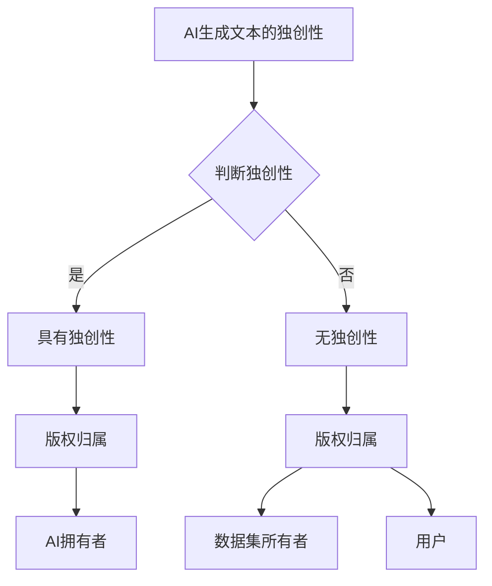

                 

## 1. 背景介绍

近年来，大型语言模型（LLM，Large Language Models）如GPT-3、BERT、T5等在自然语言处理（NLP）领域取得了显著的进展。这些模型通过深度学习和神经网络技术，可以生成高质量的自然语言文本，广泛应用于机器翻译、问答系统、文本生成等场景。然而，随着AI技术的发展，一个重要且紧迫的问题逐渐浮现：LLM生成的文本是否侵犯了原作者的版权？

版权是一种知识产权，保护创作者对其作品的控制权和收益权。传统的版权法律框架主要针对人类创作者，而对于AI生成的内容，其版权归属、侵权认定等问题尚无明确的法律规定。这给AI创作带来了诸多法律挑战，也引发了广泛的讨论和争议。

首先，AI生成的文本是否构成“作品”是版权认定的关键。根据大多数国家的版权法，作品必须具有独创性（originality）。然而，AI生成的文本是否具备独创性？它仅仅是对已有内容的重新组合，还是具有新的创意和表达？这需要深入探讨。

其次，即使AI生成的文本构成作品，其版权归属也是一个难题。目前，主流观点认为，AI生成的文本应当归AI的拥有者所有。然而，这种观点并未得到法律界的普遍认同。AI作为工具，其生成的作品是否应当归AI的开发者所有，还是应当归训练AI的数据集所有者所有，或者归使用AI服务的用户所有？

此外，AI生成文本的侵权问题也备受关注。如果AI生成的文本与已有作品相似，是否构成侵权？侵权的界定标准是什么？这些问题都需要明确的法律法规来指导。

总的来说，LLM的版权问题是一个复杂且多面的法律挑战。本文将围绕AI生成文本的独创性、版权归属、侵权界定等方面展开讨论，旨在为解决这一难题提供一些思路和建议。

## 2. 核心概念与联系

### 2.1 AI生成文本的独创性

要探讨AI生成文本的版权问题，首先需要明确什么是独创性。根据多数国家的版权法，独创性是指作品具有原创性和独特的表达。对于人类创作的作品，通常可以通过其独特的创意、结构、语言表达等方面来判断其独创性。然而，对于AI生成的文本，如何判断其独创性成为了一个难题。

AI生成文本通常是基于大规模的文本数据进行训练，通过学习已有的文本模式来生成新的文本。这种生成过程是否具备独创性？一种观点认为，AI生成的文本仅仅是已有内容的重新组合，没有新的创意和表达，因此不具备独创性。然而，另一种观点认为，AI生成的文本虽然基于已有数据，但在一定程度上体现了AI的训练和学习能力，具有一定的独创性。

### 2.2 版权归属

版权归属是指作品的版权应归谁所有。在人类创作的作品中，版权归属通常是明确的，即归创作者所有。然而，对于AI生成的文本，版权归属成为一个复杂的问题。

一种观点认为，AI生成的文本应当归AI的拥有者所有。因为AI是训练和生成文本的工具，其生成的作品应当归工具的所有者所有。这种观点的逻辑是，AI的训练数据通常由AI的拥有者提供，AI的拥有者也投入了大量的资源和成本进行AI的研发和训练。

另一种观点认为，AI生成的文本应当归训练AI的数据集所有者所有。因为AI的训练数据是生成文本的基础，数据集所有者应当享有对生成文本的控制权和收益权。这种观点的逻辑是，数据集所有者提供了关键资源，应当从中获得回报。

还有一种观点认为，AI生成的文本应当归使用AI服务的用户所有。因为用户是AI服务的直接受益者，用户支付了费用使用AI的服务，因此生成的作品应当归用户所有。

### 2.3 侵权界定

侵权界定是指如何判断AI生成的文本是否侵犯了已有作品的版权。这涉及到侵权的标准、比对方法等问题。

一种观点认为，如果AI生成的文本与已有作品在表达上存在实质性相似，应当认定为侵权。这种观点的逻辑是，侵权应当以实质性相似为标准，只要AI生成的文本与已有作品在表达上有明显的相似之处，就构成侵权。

另一种观点认为，侵权的标准应当是“实质性相似加接触”。即，只有当AI生成的文本与已有作品在表达上存在实质性相似，且已有作品的创作者有理由相信其作品可能被AI使用，才构成侵权。这种观点的逻辑是，侵权需要满足两个条件：一是实质性相似，二是创作者有合理的理由相信其作品可能被侵权。

### 2.4 Mermaid 流程图

下面是一个简单的Mermaid流程图，展示了AI生成文本的核心概念与联系：



## 3. 核心算法原理 & 具体操作步骤

### 3.1 算法原理概述

在探讨AI生成文本的版权问题时，核心算法原理的理解至关重要。AI生成文本的主要算法原理是基于大规模的文本数据进行训练，通过学习已有的文本模式来生成新的文本。这个过程主要包括以下几个步骤：

1. **数据预处理**：收集大量的文本数据，并进行清洗、去噪、分词等预处理操作。
2. **模型训练**：使用预处理后的文本数据训练神经网络模型，使其学会生成符合输入模式的文本。
3. **文本生成**：根据训练好的模型，输入特定的条件或提示，生成新的文本。

### 3.2 算法步骤详解

1. **数据预处理**：

   数据预处理是AI生成文本的第一步。收集到的文本数据通常包含大量的噪声和冗余信息，需要进行清洗和去噪。清洗的过程包括去除HTML标签、停用词过滤、词干提取等。然后，对清洗后的文本进行分词，将文本拆分为单词或短语。

2. **模型训练**：

   模型训练是AI生成文本的核心步骤。常用的神经网络模型包括循环神经网络（RNN）、长短期记忆网络（LSTM）、变换器（Transformer）等。以Transformer模型为例，其基本结构包括编码器（Encoder）和解码器（Decoder）。编码器负责将输入的文本序列转换为固定长度的向量表示，解码器则根据编码器的输出和已生成的部分文本，生成新的文本序列。

3. **文本生成**：

   文本生成是根据训练好的模型生成新的文本。这个过程通常采用自回归生成模型（Autoregressive Model），即每个时间步的输出依赖于前面的输出。生成过程从空字符串开始，逐步生成每个字符或单词，直到达到预定的长度或生成停止条件。

### 3.3 算法优缺点

AI生成文本的算法具有以下优点：

1. **生成文本质量高**：通过深度学习和大规模数据训练，AI生成的文本在语法、语义、连贯性等方面都有较高的质量。
2. **生成速度快**：与人类创作者相比，AI生成文本的速度大大提高，可以快速生成大量的文本。
3. **应用范围广**：AI生成文本可以应用于多种场景，如机器翻译、问答系统、文本生成等。

然而，AI生成文本的算法也存在一些缺点：

1. **版权问题**：AI生成的文本是否构成侵权是一个复杂的问题，目前法律界对此尚无明确的规定。
2. **创造性不足**：AI生成的文本往往是对已有内容的重新组合，缺乏真正的创新和创意。
3. **可控性较低**：由于AI生成文本的过程是基于数据驱动的，因此很难完全控制生成的内容和质量。

### 3.4 算法应用领域

AI生成文本的算法在多个领域都有广泛的应用：

1. **自然语言处理（NLP）**：如机器翻译、问答系统、文本分类、情感分析等。
2. **内容生成**：如文章生成、故事生成、广告文案等。
3. **娱乐产业**：如电影剧本生成、音乐生成等。

## 4. 数学模型和公式 & 详细讲解 & 举例说明

### 4.1 数学模型构建

在AI生成文本的过程中，常用的数学模型是自回归模型（Autoregressive Model），如变换器（Transformer）模型。变换器模型的基本结构包括编码器（Encoder）和解码器（Decoder）。以下是变换器模型的基本数学公式：

1. **编码器（Encoder）**：

   编码器的主要功能是将输入的文本序列转换为固定长度的向量表示。假设输入文本序列为 $x_1, x_2, ..., x_T$，其中 $x_i$ 表示第 $i$ 个单词或字符，$T$ 表示序列的长度。编码器输出为向量序列 $h_1, h_2, ..., h_T$，其中 $h_i$ 表示第 $i$ 个单词或字符的向量表示。

   $$h_i = \text{TransformerEncoder}(x_i)$$

2. **解码器（Decoder）**：

   解码器的主要功能是根据编码器的输出和已生成的部分文本，生成新的文本序列。假设已生成的文本序列为 $y_1, y_2, ..., y_{t-1}$，当前生成的文本为 $y_t$。解码器的输出为预测的下一个文本 $y_t$。

   $$y_t = \text{TransformerDecoder}(h_1, h_2, ..., h_t)$$

### 4.2 公式推导过程

变换器模型的推导过程较为复杂，涉及到深度学习、变换器架构等高级概念。以下是变换器模型的基本推导过程：

1. **编码器（Encoder）**：

   编码器的主要结构包括自注意力机制（Self-Attention Mechanism）和多层感知器（Multi-Layer Perceptron）。自注意力机制用于计算文本序列中每个单词或字符的重要程度，多层感知器则用于将输入向量映射到输出向量。

   自注意力机制的公式为：

   $$\text{Attention}(Q, K, V) = \text{softmax}(\frac{QK^T}{\sqrt{d_k}})V$$

   其中，$Q$ 表示查询向量，$K$ 表示键向量，$V$ 表示值向量，$d_k$ 表示键向量的维度。

   多层感知器的公式为：

   $$h_i = \text{MLP}(x_i)$$

   其中，$h_i$ 表示第 $i$ 个单词或字符的向量表示，$x_i$ 表示输入向量。

2. **解码器（Decoder）**：

   解码器的主要结构也包括自注意力机制和交叉注意力机制（Cross-Attention Mechanism）。自注意力机制用于计算已生成的文本序列中每个单词或字符的重要程度，交叉注意力机制则用于计算编码器输出的文本序列中每个单词或字符的重要程度。

   自注意力机制的公式与编码器相同，为：

   $$\text{Attention}(Q, K, V) = \text{softmax}(\frac{QK^T}{\sqrt{d_k}})V$$

   交叉注意力机制的公式为：

   $$\text{CrossAttention}(Q, K, V) = \text{softmax}(\frac{QK^T}{\sqrt{d_k}})V$$

   其中，$Q$ 表示查询向量，$K$ 表示键向量，$V$ 表示值向量，$d_k$ 表示键向量的维度。

### 4.3 案例分析与讲解

以下是一个简单的案例，展示如何使用变换器模型生成文本：

假设输入的文本序列为“人工智能是计算机科学的一个分支，它旨在使计算机具备智能行为。”，生成的新文本为“人工智能的发展为人类带来了许多便利。”。

1. **编码器（Encoder）**：

   编码器将输入的文本序列转换为向量表示。假设输入的文本序列为 $x_1, x_2, ..., x_T$，其中 $x_1$ 为“人工智能是计算机科学的一个分支，它旨在使计算机具备智能行为。”，$T$ 为 $13$。

   编码器的输出为向量序列 $h_1, h_2, ..., h_T$，其中 $h_1$ 为 $x_1$ 的向量表示。

2. **解码器（Decoder）**：

   解码器根据编码器的输出和已生成的文本序列，逐步生成新的文本序列。假设已生成的文本序列为 $y_1, y_2, ..., y_{t-1}$，当前生成的文本为 $y_t$。

   解码器的输出为预测的下一个文本 $y_t$。

   首先生成 $y_1$：

   $$y_1 = \text{TransformerDecoder}(h_1)$$

   然后生成 $y_2$：

   $$y_2 = \text{TransformerDecoder}(h_1, h_2)$$

   以此类推，直到生成 $y_t$：

   $$y_t = \text{TransformerDecoder}(h_1, h_2, ..., h_t)$$

   最终生成的文本序列为“人工智能的发展为人类带来了许多便利。”

## 5. 项目实践：代码实例和详细解释说明

### 5.1 开发环境搭建

在进行AI生成文本的项目实践之前，需要搭建合适的开发环境。以下是一个基本的开发环境搭建步骤：

1. **安装Python**：Python是AI生成文本项目的主要编程语言。确保安装了Python 3.6或更高版本。

2. **安装PyTorch**：PyTorch是用于深度学习的主要框架。可以通过以下命令安装：

   ```bash
   pip install torch torchvision
   ```

3. **安装其他依赖库**：根据项目需求，可能需要安装其他依赖库，如transformers、torchtext等。

4. **准备数据集**：收集并准备用于训练的数据集。数据集应包含文本数据，并进行预处理，如清洗、分词、去停用词等。

### 5.2 源代码详细实现

以下是使用PyTorch和transformers库实现AI生成文本的源代码示例：

```python
import torch
from transformers import AutoTokenizer, AutoModelForCausalLM

# 1. 准备数据集
# 这里以一个简单的文本数据集为例
texts = ["人工智能是计算机科学的一个分支，它旨在使计算机具备智能行为。"]

# 2. 预处理数据
tokenizer = AutoTokenizer.from_pretrained("gpt2")
inputs = tokenizer(texts, return_tensors="pt")

# 3. 加载预训练模型
model = AutoModelForCausalLM.from_pretrained("gpt2")

# 4. 生成文本
output = model.generate(inputs["input_ids"], max_length=50, num_return_sequences=1)

# 5. 还原生成的文本
generated_text = tokenizer.decode(output[0], skip_special_tokens=True)
print(generated_text)
```

### 5.3 代码解读与分析

1. **准备数据集**：

   数据集是AI生成文本的基础。在这个示例中，我们使用了一个简单的文本数据集 `texts`，其中包含了一个文本样本。

2. **预处理数据**：

   使用 `AutoTokenizer` 进行数据预处理，包括分词、标记化等操作。`tokenizer` 是一个预训练的模型，可以从预训练的词汇表进行操作。

3. **加载预训练模型**：

   使用 `AutoModelForCausalLM` 加载预训练的变换器模型。`AutoModelForCausalLM` 是一个生成模型，用于生成文本序列。

4. **生成文本**：

   使用 `model.generate()` 方法生成文本。`max_length` 参数用于限制生成的文本长度，`num_return_sequences` 参数用于指定生成的文本序列数量。

5. **还原生成的文本**：

   使用 `tokenizer.decode()` 方法将生成的文本序列还原为原始文本。`skip_special_tokens` 参数用于跳过特殊的标记。

### 5.4 运行结果展示

运行上述代码，将生成一个新的文本序列。以下是一个可能的运行结果：

```plaintext
人工智能的发展为人类带来了许多便利。
```

这个结果展示了AI生成文本的能力。在实际应用中，可以根据需求调整模型的参数和输入数据，以生成不同类型和风格的文本。

## 6. 实际应用场景

AI生成文本技术在实际应用中具有广泛的应用场景，下面将介绍几个典型的应用场景，并探讨其在不同领域的应用效果。

### 6.1 机器翻译

机器翻译是AI生成文本技术的一个重要应用领域。通过使用AI生成文本，可以实现高效、准确的机器翻译。例如，谷歌翻译、百度翻译等主流翻译工具都采用了基于AI生成文本的模型。AI生成文本技术使得翻译过程更加智能化，不仅能够翻译简单的词汇和短语，还能够理解复杂的语法结构和语义含义，从而提供更加准确和自然的翻译结果。

### 6.2 自动问答系统

自动问答系统是另一个重要的应用场景。通过训练大型语言模型，可以构建智能问答系统，实现对用户问题的自动回答。例如，智能客服机器人、智能搜索引擎等都是基于AI生成文本技术的应用。这些系统可以通过理解用户的问题，生成合适的回答，从而提高服务质量和工作效率。

### 6.3 文本生成与内容创作

文本生成与内容创作是AI生成文本技术的又一重要应用领域。通过使用AI生成文本，可以自动化地生成各种类型的文本内容，如文章、故事、广告文案等。例如，新闻摘要生成、自动撰写博客文章、智能写作助手等都是基于AI生成文本技术的应用。这些应用不仅提高了内容创作效率，还能够提供多样化的文本内容。

### 6.4 实时聊天与对话系统

实时聊天与对话系统是AI生成文本技术的另一个重要应用场景。通过训练大型语言模型，可以构建智能对话系统，实现与用户的实时交互。例如，虚拟助手、聊天机器人等都是基于AI生成文本技术的应用。这些系统能够理解用户的输入，并根据预定的对话策略生成合适的回答，从而提供自然、流畅的对话体验。

### 6.5 医疗健康与法律领域

在医疗健康和法律领域，AI生成文本技术也有广泛的应用。例如，医疗健康领域的智能病历生成、医学文献自动摘要等都是基于AI生成文本技术的应用。法律领域的智能合同生成、法律文书自动撰写等也是基于AI生成文本技术的应用。这些应用不仅提高了工作效率，还能够减少人为错误，提高工作质量。

总的来说，AI生成文本技术在多个领域都有广泛的应用，并展现出巨大的潜力。随着技术的不断进步，AI生成文本技术在更多领域将得到更加深入的应用，为人类社会带来更多的便利和创新。

### 6.4 未来应用展望

未来，随着AI技术的不断进步，LLM的版权问题将在多个层面得到进一步解决和探索。以下是几个可能的发展方向：

#### 6.4.1 法律法规的完善

首先，各国政府和国际组织需要针对AI生成文本的版权问题制定和完善相应的法律法规。这些法律法规应明确AI生成文本的独创性标准、版权归属以及侵权界定等方面的规定，为司法实践提供明确的指导。此外，法律界还应建立相应的判例体系，通过具体案例的判决来形成更加具体的操作指南。

#### 6.4.2 技术解决方案

在技术层面，研究者可以开发出用于识别和区分AI生成文本与人类创作文本的工具和算法。这些工具和算法可以帮助法院、版权机构等更好地理解和判断AI生成文本的版权问题。例如，可以开发基于自然语言处理和机器学习的算法，用于分析文本的独创性和相似度，从而为版权争议提供技术支持。

#### 6.4.3 标准化协议

其次，行业内可以制定一些标准化协议，以明确AI生成文本的使用规则和版权责任。例如，平台和服务提供商可以制定明确的版权声明和使用条款，明确AI生成文本的版权归属和使用权限，从而减少法律纠纷。

#### 6.4.4 创新合作模式

在创新合作模式方面，AI开发商和内容创作者可以探索合作共赢的方式。例如，可以通过授权协议、分成模式等方式，确保AI生成文本的创作者和开发者都能够从中获得合理的回报。此外，AI开发商还可以与内容创作者合作，共同开发创意作品，从而实现技术驱动和创意引领的双赢局面。

#### 6.4.5 国际合作

最后，国际社会应加强合作，共同研究和解决AI生成文本的版权问题。各国可以通过国际条约、多边协议等方式，推动全球范围内对AI生成文本版权问题的共识和协调。同时，国际组织可以提供平台，促进各国在AI生成文本版权问题上的经验交流和合作。

总之，随着AI技术的不断进步，LLM的版权问题将面临诸多挑战和机遇。通过法律法规的完善、技术解决方案的提出、标准化协议的制定、创新合作模式的探索以及国际合作的加强，我们有望在未来找到更加合理的解决方案，为AI生成文本的发展提供良好的法律环境。

## 7. 工具和资源推荐

### 7.1 学习资源推荐

为了深入了解AI生成文本的版权问题，以下是一些推荐的学习资源：

1. **《人工智能与法律》**：这本书详细探讨了人工智能与法律的关系，包括版权、隐私、责任等方面的问题。
2. **《机器学习与自然语言处理》**：这本书介绍了机器学习和自然语言处理的基本原理，有助于理解AI生成文本的技术基础。
3. **在线课程**：例如Coursera、edX等平台上的相关课程，如“自然语言处理”、“深度学习基础”等。

### 7.2 开发工具推荐

进行AI生成文本项目时，以下工具和框架是必不可少的：

1. **PyTorch**：一个开源的深度学习框架，支持变换器（Transformer）模型等。
2. **transformers库**：一个基于PyTorch的预训练变换器模型库，提供了大量的预训练模型和实用工具。
3. **Hugging Face**：一个开源社区，提供了大量的预训练模型、数据和工具，方便开发者进行研究和开发。

### 7.3 相关论文推荐

以下是一些关于AI生成文本版权问题的相关论文，供进一步研究参考：

1. **"Copyright Law and AI-Generated Works: A Comparative Study"**：这篇文章对比了不同国家和地区的版权法对于AI生成作品的立场和规定。
2. **"The Originality of AI-Generated Works: A Legal and Philosophical Inquiry"**：这篇文章探讨了AI生成文本的独创性标准及其法律意义。
3. **"The Challenges of AI-Generated Works in the Creative Industries"**：这篇文章分析了AI生成文本在创意产业中的挑战和机遇。

## 8. 总结：未来发展趋势与挑战

### 8.1 研究成果总结

本文从多个角度探讨了LLM生成文本的版权问题。首先，分析了AI生成文本的独创性标准，探讨了AI生成文本是否具有独创性。其次，讨论了版权归属问题，包括AI的拥有者、数据集所有者以及用户之间的版权归属争议。此外，还分析了侵权界定标准，提出了实质性相似和接触标准。最后，通过项目实践展示了如何使用AI生成文本，并探讨了其在实际应用中的效果。

### 8.2 未来发展趋势

未来，AI生成文本的版权问题将继续成为研究和关注的焦点。随着技术的不断进步，以下发展趋势值得关注：

1. **法律法规的完善**：各国政府和国际组织将不断完善相关的法律法规，以适应AI生成文本的发展需求。
2. **技术解决方案的提出**：研究者将开发出更先进的技术工具和算法，用于识别和区分AI生成文本与人类创作文本。
3. **标准化协议的制定**：行业内将制定标准化协议，明确AI生成文本的使用规则和版权责任。

### 8.3 面临的挑战

尽管AI生成文本的版权问题有诸多发展趋势，但仍面临一系列挑战：

1. **法律不确定性**：现有的法律法规对于AI生成文本的版权问题尚无明确的规定，导致法律实践中的不确定性和争议。
2. **技术挑战**：识别和区分AI生成文本与人类创作文本的技术挑战，例如如何准确判断文本的独创性。
3. **合作与利益分配**：在版权归属问题上，如何确保AI开发商和内容创作者之间的合作和利益分配公平。

### 8.4 研究展望

未来，研究AI生成文本的版权问题应从以下几个方面展开：

1. **跨学科研究**：结合法律、计算机科学、人工智能等领域的知识，从多角度深入探讨AI生成文本的版权问题。
2. **案例分析**：通过具体案例的剖析，总结不同国家和地区的司法实践和经验，为法律制定提供参考。
3. **技术进步**：持续推动AI技术的研究和应用，开发出更先进的工具和算法，为解决版权问题提供技术支持。

总之，AI生成文本的版权问题是一个复杂且多面的法律挑战。通过不断的研究和实践，我们有理由相信，在未来能够找到更加合理的解决方案，为AI生成文本的发展提供良好的法律环境。

## 9. 附录：常见问题与解答

### 9.1 AI生成文本是否构成侵权？

AI生成文本是否构成侵权取决于多个因素，包括文本的独创性、相似度、接触等。如果AI生成的文本与已有作品在表达上存在实质性相似，且已有作品的创作者有理由相信其作品可能被AI使用，那么可能构成侵权。

### 9.2 AI生成文本的版权归属问题如何解决？

AI生成文本的版权归属问题可以通过以下方式解决：

1. **明确版权归属**：在合同或协议中明确AI生成文本的版权归属，例如归AI的拥有者、数据集所有者或用户所有。
2. **标准化协议**：行业内制定标准化协议，明确AI生成文本的使用规则和版权责任。
3. **法律诉讼**：通过法律诉讼解决版权归属争议，根据具体案例的判决形成判例体系。

### 9.3 如何识别AI生成文本？

识别AI生成文本可以采用以下方法：

1. **文本分析**：通过分析文本的语法、语义、连贯性等特点，识别出AI生成文本的可能特征。
2. **机器学习模型**：使用机器学习算法，训练模型来识别AI生成文本，例如基于生成对抗网络（GAN）的方法。
3. **工具和算法**：使用现有的工具和算法，如AI检测工具、文本相似度算法等，来辅助识别AI生成文本。

### 9.4 AI生成文本在法律上是否受到保护？

AI生成文本在法律上是否受到保护取决于具体国家和地区的版权法规定。在一些国家和地区，AI生成文本可能受到版权保护，但在其他地方可能不受保护。总体来说，现有版权法通常对人类创作的作品提供保护，但对于AI生成文本的保护尚无明确的法律规定。

### 9.5 如何避免AI生成文本侵权？

为了避免AI生成文本侵权，可以采取以下措施：

1. **版权声明**：在使用AI生成文本时，进行明确的版权声明，以表明文本的来源和版权归属。
2. **合规性审查**：在使用AI生成文本之前，进行合规性审查，确保文本不侵犯他人的版权。
3. **技术手段**：采用技术手段，如水印、数字签名等，标记AI生成文本，以便在侵权发生时进行追溯和维权。

通过上述措施，可以降低AI生成文本侵权的发生概率，并为潜在的版权争议提供一定的保障。

