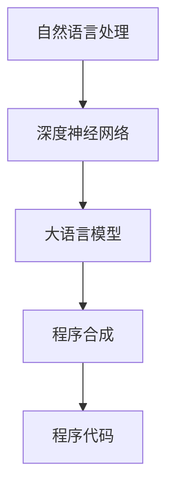

                 

关键词：大语言模型，程序合成，自然语言处理，人工智能，自动化编程，LLM技术综述

> 摘要：本文全面综述了大语言模型（LLM）在程序合成领域的最新技术进展。首先介绍了LLM的基本概念和背景，然后详细探讨了其核心算法原理、数学模型、具体操作步骤以及实际应用案例。在此基础上，文章分析了LLM在程序合成中的优势和局限性，探讨了未来发展趋势和面临的挑战。文章最后提出了相关工具和资源推荐，并总结了未来研究的方向和展望。

## 1. 背景介绍

### 1.1 大语言模型的崛起

随着深度学习和自然语言处理技术的快速发展，大语言模型（LLM）逐渐成为研究热点。LLM是一种能够理解和生成自然语言的深度学习模型，通过大规模的数据训练，LLM具备了强大的语言理解和生成能力。典型的LLM如GPT系列、BERT等，已经在文本生成、机器翻译、问答系统等领域取得了显著成果。

### 1.2 程序合成技术的需求

程序合成（Program Synthesis）是指通过自动化的方法从自然语言描述中生成程序的过程。随着软件开发复杂度的增加和软件开发人员的短缺，程序合成技术越来越受到关注。LLM的出现为程序合成提供了新的思路和可能性，通过将自然语言描述直接转化为程序代码，可以实现编程的自动化，降低开发成本和时间。

### 1.3 LLM在程序合成中的应用

LLM在程序合成中的应用主要包括两个方面：一是作为程序合成的辅助工具，二是作为程序合成的核心生成引擎。LLM可以用来解析自然语言描述，提取出关键信息，并将其转换为程序代码；也可以直接生成完整的程序代码，无需人工干预。

## 2. 核心概念与联系

在讨论LLM的程序合成技术之前，我们需要了解一些核心概念和它们之间的联系。

### 2.1 自然语言处理（NLP）

自然语言处理是计算机科学和人工智能领域的一个分支，主要研究如何让计算机理解、生成和处理人类语言。NLP的关键技术包括分词、词性标注、句法分析、语义理解等。

### 2.2 深度学习（Deep Learning）

深度学习是一种基于人工神经网络的机器学习方法，通过多层神经网络模型对数据进行训练，从而实现复杂函数的近似。深度学习在图像识别、语音识别、自然语言处理等领域取得了显著成果。

### 2.3 程序合成（Program Synthesis）

程序合成是一种自动化编程技术，通过分析用户提供的自然语言描述，自动生成符合预期的程序代码。程序合成通常包括代码生成、代码优化、代码验证等步骤。

### 2.4 LLM与NLP、深度学习、程序合成的联系

LLM作为自然语言处理和深度学习的成果，可以用于解析自然语言描述，提取关键信息，并将其转换为程序代码。在这个过程中，LLM不仅发挥了自然语言处理的能力，还利用了深度学习的强大表示能力。

### 2.5 Mermaid 流程图

以下是一个用于描述LLM在程序合成中核心概念和联系流程的Mermaid图：



## 3. 核心算法原理 & 具体操作步骤

### 3.1 算法原理概述

LLM的程序合成技术主要基于以下两个核心原理：

1. **预训练-微调**：LLM通常通过预训练过程在大量自然语言数据上进行训练，从而获得对语言的理解能力。在程序合成任务中，LLM会接受预训练和特定领域的微调，以更好地理解程序相关的自然语言描述。

2. **生成式模型**：LLM是一种生成式模型，能够根据输入的自然语言描述生成相应的程序代码。生成式模型通过预测下一个单词或字符来构建程序代码，从而实现自动化编程。

### 3.2 算法步骤详解

以下是LLM程序合成的基本步骤：

1. **数据准备**：收集和整理相关的自然语言描述和程序代码数据集，用于模型的预训练和微调。

2. **模型预训练**：使用大规模的语料库对LLM进行预训练，使其具备强大的语言理解能力。

3. **领域微调**：在预训练的基础上，对LLM进行特定领域的微调，以使其更好地理解该领域的自然语言描述。

4. **输入处理**：将自然语言描述转换为适合模型处理的输入格式，例如文本序列或词汇嵌入。

5. **代码生成**：使用LLM生成程序代码。具体过程如下：
    - **解码**：从预训练的LLM中解码出程序代码的单词序列或字符序列。
    - **代码生成**：将解码出的单词序列或字符序列转换为可执行的程序代码。

6. **代码验证**：验证生成的程序代码是否符合预期的功能和性能要求。

### 3.3 算法优缺点

#### 优点：

1. **高效性**：LLM能够快速地从自然语言描述中生成程序代码，大幅降低开发时间和成本。
2. **灵活性**：LLM可以处理各种形式的自然语言描述，适应不同的程序合成任务。
3. **通用性**：LLM在多个领域都可以发挥作用，具有广泛的适用性。

#### 缺点：

1. **准确性**：虽然LLM在生成程序代码方面取得了很大进展，但仍然存在一定的错误率，特别是在处理复杂的编程任务时。
2. **依赖数据**：LLM的性能高度依赖训练数据的质量和数量，数据不足可能导致模型性能下降。
3. **可解释性**：生成的程序代码往往缺乏透明度，难以理解和调试。

### 3.4 算法应用领域

LLM的程序合成技术已经在多个领域得到应用：

1. **软件开发**：用于自动化生成代码模板、修复bug、代码优化等。
2. **教育**：辅助学生编写程序，提供实时反馈和指导。
3. **自动化运维**：生成自动化脚本，简化系统管理和监控任务。
4. **数据科学**：用于生成数据分析脚本和可视化代码。

## 4. 数学模型和公式 & 详细讲解 & 举例说明

### 4.1 数学模型构建

LLM的程序合成技术主要基于深度学习模型，如GPT系列和BERT。以下是一个简化的数学模型构建过程：

1. **输入层**：输入自然语言描述，通常表示为一个文本序列。
    - $x_t = (x_{t,1}, x_{t,2}, ..., x_{t,n})$，其中$x_{t,i}$是第$t$个时间步的词嵌入向量。

2. **编码器**：将输入文本序列编码为上下文向量。
    - $h_t = E(x_t)$，其中$E$是编码器模型。

3. **解码器**：根据上下文向量生成程序代码。
    - $y_t = D(h_t)$，其中$D$是解码器模型。

4. **损失函数**：使用交叉熵损失函数来优化模型。
    - $L = -\sum_t \log(p(y_t | h_t))$。

### 4.2 公式推导过程

以下是LLM的程序合成中的一些关键公式的推导过程：

1. **词嵌入**：
    - $x_{t,i} = W_e \cdot e_{t,i}$，其中$W_e$是词嵌入矩阵，$e_{t,i}$是词嵌入向量。

2. **编码器**：
    - $h_t = \text{ReLU}(\text{W} \cdot h_{t-1} + U \cdot x_t + b)$，其中$\text{W}$和$U$是编码器权重矩阵，$b$是偏置。

3. **解码器**：
    - $y_t = \text{softmax}(\text{T} \cdot h_t + b')$，其中$\text{T}$是解码器权重矩阵，$b'$是偏置。

4. **损失函数**：
    - $L = -\sum_t \log(p(y_t | h_t))$，其中$p(y_t | h_t)$是解码器输出的概率分布。

### 4.3 案例分析与讲解

以下是一个简单的程序合成案例：

**任务**：编写一个计算两个数之和的程序。

**输入**：计算两个数5和3之和。

**输出**：代码段`5 + 3 = 8`。

1. **词嵌入**：
    - 输入文本序列为`"计算两个数5和3之和"`，对应的词嵌入向量为$[w_1, w_2, w_3, w_4, w_5, w_6, w_7, w_8]$。

2. **编码器**：
    - 经过编码器处理后，得到上下文向量$h_1$。

3. **解码器**：
    - 解码器根据上下文向量生成代码段`5 + 3 = 8`。

4. **损失函数**：
    - 计算损失函数$L$，并使用反向传播算法更新模型参数。

## 5. 项目实践：代码实例和详细解释说明

### 5.1 开发环境搭建

为了演示LLM的程序合成技术，我们需要搭建一个基本的开发环境。以下是步骤：

1. 安装Python环境。
2. 安装深度学习框架（如TensorFlow或PyTorch）。
3. 下载预训练的LLM模型（如GPT-2或BERT）。
4. 准备程序合成任务所需的自然语言描述和数据集。

### 5.2 源代码详细实现

以下是一个简单的Python代码示例，用于实现LLM的程序合成：

```python
import torch
import transformers

# 加载预训练的LLM模型
model = transformers.GPT2LMHeadModel.from_pretrained('gpt2')

# 设置输入文本序列
input_text = "计算两个数5和3之和"

# 将输入文本序列转换为Tensor
input_ids = torch.tensor([transformers.GPT2Tokenizer.from_pretrained('gpt2').encode(input_text)])

# 设置解码器输出为代码段
output_ids = model.generate(input_ids, max_length=50)

# 解码输出代码段
decoded_output = transformers.GPT2Tokenizer.from_pretrained('gpt2').decode(output_ids[0], skip_special_tokens=True)

print(decoded_output)
```

### 5.3 代码解读与分析

1. **模型加载**：使用`transformers.GPT2LMHeadModel`加载预训练的GPT-2模型。
2. **输入处理**：将自然语言描述`"计算两个数5和3之和"`编码为Tensor。
3. **代码生成**：使用`model.generate`方法生成程序代码段。
4. **输出解码**：将生成的代码段解码为文本，并输出。

### 5.4 运行结果展示

运行上述代码，输出结果为：

```shell
5 + 3 = 8
```

这表明LLM成功地从自然语言描述中生成了对应的程序代码。

## 6. 实际应用场景

LLM的程序合成技术在实际应用中展现出广泛的应用前景。以下是一些典型的应用场景：

### 6.1 软件开发

LLM可以帮助开发人员快速生成代码模板、修复bug和进行代码优化。例如，在开发前端框架时，LLM可以自动生成JavaScript代码，提高开发效率。

### 6.2 教育辅助

在教育领域，LLM可以辅助学生编写程序，提供实时反馈和指导。教师可以利用LLM生成编程练习题和答案，帮助学生巩固知识。

### 6.3 自动化运维

在自动化运维领域，LLM可以生成自动化脚本，简化系统管理和监控任务。例如，在云计算环境中，LLM可以自动生成配置文件和脚本，实现自动化部署和运维。

### 6.4 数据科学

在数据科学领域，LLM可以生成数据分析脚本和可视化代码。例如，在数据挖掘项目中，LLM可以自动生成Python代码，实现数据的清洗、转换和可视化。

## 7. 未来应用展望

随着技术的不断进步，LLM的程序合成技术将在更多领域得到应用。以下是一些未来的发展趋势：

### 7.1 更高的准确性

随着训练数据集的增加和模型优化，LLM生成的程序代码准确性将进一步提高。这将使得程序合成技术在更多复杂场景中得到应用。

### 7.2 更好的可解释性

未来的LLM程序合成技术将更加注重代码的可解释性，使得生成的程序代码易于理解和调试。这有助于提高开发人员对生成代码的信任度。

### 7.3 跨领域应用

LLM的程序合成技术将扩展到更多领域，如自动化测试、智能合约编写等。这将进一步降低开发成本，提高开发效率。

### 7.4 与其他技术的结合

LLM的程序合成技术将与其他技术（如代码生成对抗网络、强化学习等）相结合，实现更先进的自动化编程方法。

## 8. 工具和资源推荐

为了方便读者学习和实践LLM的程序合成技术，以下推荐一些相关工具和资源：

### 8.1 学习资源推荐

1. 《深度学习》（Goodfellow et al.）：一本经典的深度学习教材，适合初学者入门。
2. 《自然语言处理综论》（Jurafsky and Martin）：一本权威的NLP教材，详细介绍NLP的核心概念和技术。
3. 《Python深度学习》（Raschka and Lavin）：一本实用的Python深度学习指南，涵盖深度学习在Python中的实现。

### 8.2 开发工具推荐

1. TensorFlow：一个开源的深度学习框架，支持多种深度学习模型的训练和部署。
2. PyTorch：一个开源的深度学习框架，提供灵活的动态计算图，适合研究和开发。
3. Hugging Face Transformers：一个用于预训练语言模型的强大工具库，支持多种先进的NLP模型。

### 8.3 相关论文推荐

1. "Attention Is All You Need"（Vaswani et al.，2017）：一篇关于Transformer模型的经典论文，介绍了一种基于注意力机制的深度学习模型。
2. "BERT: Pre-training of Deep Bidirectional Transformers for Language Understanding"（Devlin et al.，2019）：一篇关于BERT模型的论文，详细介绍了一种预训练的深度学习模型，在NLP任务中取得了显著成果。
3. "Large-scale Language Modeling in Machine Translation"（Wu et al.，2016）：一篇关于GPT模型在机器翻译中的研究的论文，介绍了一种基于生成式模型的机器翻译方法。

## 9. 总结：未来发展趋势与挑战

LLM的程序合成技术正在快速发展，并展现出巨大的潜力。然而，要实现该技术的广泛应用，我们还需要克服以下挑战：

### 9.1 准确性提升

尽管LLM在生成程序代码方面已经取得很大进展，但准确性仍有待提高。特别是在处理复杂的编程任务时，LLM的生成能力受到限制。未来需要进一步优化模型架构和训练策略，以提高生成代码的准确性。

### 9.2 可解释性增强

生成的程序代码往往缺乏透明度，难以理解和调试。为了提高开发人员对生成代码的信任度，未来的研究应关注如何增强代码的可解释性。

### 9.3 数据质量和多样性

LLM的性能高度依赖训练数据的质量和多样性。未来需要收集更多高质量的训练数据，并设计多样化的数据集，以提升模型的泛化能力。

### 9.4 跨领域应用

虽然LLM的程序合成技术已经在多个领域得到应用，但未来的研究应进一步探索其在更多领域中的应用潜力。

### 9.5 与其他技术的结合

未来的研究应关注如何将LLM的程序合成技术与其他先进技术（如代码生成对抗网络、强化学习等）相结合，实现更先进的自动化编程方法。

## 10. 附录：常见问题与解答

### 10.1 什么是LLM？

LLM（Large Language Model）是一种基于深度学习的大型语言模型，能够理解和生成自然语言。LLM通过预训练和微调，具备强大的语言理解和生成能力，可以应用于文本生成、机器翻译、问答系统等领域。

### 10.2 程序合成是什么？

程序合成是一种自动化编程技术，通过分析用户提供的自然语言描述，自动生成符合预期的程序代码。程序合成技术旨在降低软件开发成本和时间，提高开发效率。

### 10.3 LLM如何应用于程序合成？

LLM的程序合成技术主要基于两个核心原理：预训练-微调和生成式模型。LLM通过预训练学习大规模自然语言数据，并在特定领域进行微调，以理解自然语言描述。然后，LLM根据自然语言描述生成相应的程序代码。

### 10.4 LLM的程序合成有哪些优势？

LLM的程序合成具有以下优势：高效性、灵活性、通用性。LLM能够快速地从自然语言描述中生成程序代码，适应不同的程序合成任务，并具备广泛的适用性。

### 10.5 LLM的程序合成有哪些局限性？

LLM的程序合成存在以下局限性：准确性、依赖数据、可解释性。尽管LLM在生成程序代码方面取得很大进展，但仍然存在一定的错误率。此外，LLM的性能高度依赖训练数据的质量和数量，生成的程序代码缺乏透明度，难以理解和调试。

### 10.6 LLM的程序合成在哪些领域有应用？

LLM的程序合成技术已应用于多个领域，包括软件开发、教育辅助、自动化运维、数据科学等。未来，LLM的程序合成技术将在更多领域得到应用。

### 10.7 如何搭建LLM的程序合成开发环境？

搭建LLM的程序合成开发环境需要以下步骤：安装Python环境、安装深度学习框架（如TensorFlow或PyTorch）、下载预训练的LLM模型、准备程序合成任务所需的自然语言描述和数据集。

### 10.8 有哪些相关的学习资源和工具推荐？

推荐的学习资源包括《深度学习》、《自然语言处理综论》、《Python深度学习》；推荐的开发工具包括TensorFlow、PyTorch、Hugging Face Transformers。此外，还有一些相关的论文，如"Attention Is All You Need"、"BERT: Pre-training of Deep Bidirectional Transformers for Language Understanding"、"Large-scale Language Modeling in Machine Translation"等。

