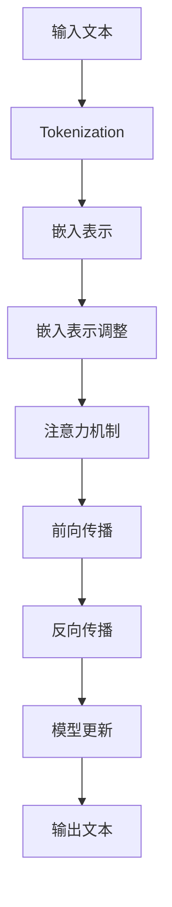

                 

在当今科技飞速发展的时代，大型语言模型（LLM，Large Language Model）已经成为了自然语言处理（NLP，Natural Language Processing）领域的核心技术。LLM通过深度学习技术，能够理解和生成人类语言，显著提升了计算机与人类之间的交互效率。本文将深入探讨LLM的语言理解技术发展脉络，分析其核心概念、算法原理、数学模型及其在实际应用中的表现。

## 关键词

- 大型语言模型（LLM）
- 自然语言处理（NLP）
- 深度学习
- 语言理解
- 人工智能

## 摘要

本文首先介绍了LLM在NLP领域的背景和重要性。随后，深入解析了LLM的核心概念与联系，通过Mermaid流程图展示了其架构。接着，文章详细阐述了LLM的语言理解算法原理、操作步骤及其优缺点和应用领域。此外，文章还包含了数学模型和公式的详细讲解与举例说明，并通过具体的项目实践展示了代码实例和运行结果。最后，本文讨论了LLM在实际应用场景中的表现，对其未来发展趋势与挑战进行了展望。

## 1. 背景介绍

自然语言处理（NLP）作为人工智能领域的一个重要分支，旨在使计算机能够理解、解释和生成自然语言。自20世纪50年代以来，NLP经历了从规则驱动到统计模型，再到深度学习的多次重大技术变革。早期的NLP系统依赖于手工编写的规则，这些规则试图模拟人类的语言理解能力。然而，这种方法在实际应用中面临着很大的局限性，因为自然语言极其复杂，且变化多端。

随着计算能力的提升和机器学习技术的进步，统计模型逐渐取代了规则驱动的方法。统计模型通过学习大量文本数据，从中提取语言特征，从而提高了语言理解的能力。然而，统计模型的性能仍然受到数据质量和模型复杂度的影响。

近年来，深度学习技术的崛起为NLP带来了新的契机。深度学习通过多层神经网络，能够自动提取复杂的高层次特征，从而实现了在多种NLP任务中的突破性进展。其中，大型语言模型（LLM）成为了深度学习在NLP领域应用的一个典型代表。

LLM通过训练大规模的神经网络模型，能够理解和生成自然语言，从而在文本分类、机器翻译、问答系统等任务中取得了显著的效果。随着模型的规模不断扩大，LLM在语言理解方面的能力也逐步增强，逐渐成为NLP技术发展的重要推动力。

## 2. 核心概念与联系

在深入探讨LLM之前，我们需要了解几个核心概念，这些概念构成了LLM的基础。

### 2.1 语言模型

语言模型是NLP的基础，它旨在预测一段文本的概率分布。早期语言模型如N-gram模型，通过统计相邻单词的频率来预测下一个单词。然而，N-gram模型无法捕捉到更长的依赖关系，导致其在复杂文本上的表现不佳。

### 2.2 神经网络

神经网络（Neural Networks）是深度学习的基础，由大量的简单计算单元（神经元）组成。通过多层神经元的堆叠，神经网络能够自动提取输入数据的高层次特征。在NLP中，神经网络通过处理大量的文本数据，学习到文本的结构和语义。

### 2.3 深度学习

深度学习（Deep Learning）是神经网络的一种，通过多层网络结构，能够自动提取输入数据的高层次特征。深度学习在图像识别、语音识别等领域取得了巨大成功，并逐渐成为NLP技术发展的新方向。

### 2.4 注意力机制

注意力机制（Attention Mechanism）是深度学习中的一个关键技术，它能够帮助模型在处理序列数据时，自动聚焦于重要的信息。在NLP中，注意力机制能够帮助模型更好地理解和生成自然语言。

### 2.5 训练方法

LLM的训练方法主要包括两个阶段：预训练和微调。预训练阶段，模型在大量无标签的文本数据上训练，学习到语言的通用特征。微调阶段，模型在特定任务上通过有标签的数据进一步训练，从而提高任务性能。

### 2.6 Mermaid流程图

为了更好地展示LLM的核心概念与联系，我们使用Mermaid流程图来描述LLM的架构和训练流程。以下是一个简单的示例：



在上面的流程图中，输入文本经过分词和嵌入表示后，通过注意力机制和多层神经网络进行前向传播和反向传播，最终生成输出文本。

## 3. 核心算法原理 & 具体操作步骤

### 3.1 算法原理概述

LLM的核心算法基于深度学习，特别是基于变换器模型（Transformer）。变换器模型由多个编码器和解码器层组成，通过多头自注意力机制和点积自注意力机制，能够自动提取文本序列中的高层次特征。

### 3.2 算法步骤详解

1. **输入处理**：输入的文本经过分词和嵌入表示，转换为模型可处理的向量形式。

2. **自注意力机制**：模型在每一层都应用自注意力机制，通过计算输入序列中每个词与所有词之间的相似度，动态地加权每个词，从而提取文本序列中的高层次特征。

3. **前向传播**：通过多层编码器和解码器，模型逐步提取文本序列中的特征，并生成中间表示。

4. **输出生成**：最终，模型通过解码器生成输出文本。

### 3.3 算法优缺点

**优点**：
- **强大的表达能力**：通过多层神经网络和自注意力机制，LLM能够自动提取文本序列中的高层次特征。
- **高效的训练和推断**：变换器模型设计高效，能够在大规模数据集上进行快速训练和推断。
- **广泛的应用领域**：LLM在文本分类、机器翻译、问答系统等领域表现出色。

**缺点**：
- **计算资源消耗大**：LLM通常需要大量的计算资源和存储空间。
- **数据依赖性强**：模型性能高度依赖训练数据的质量和数量。

### 3.4 算法应用领域

LLM在NLP的多个领域都取得了显著的应用成果：

- **文本分类**：LLM能够准确地对文本进行分类，广泛应用于新闻分类、情感分析等任务。
- **机器翻译**：LLM在机器翻译中表现出色，能够生成高质量的翻译结果。
- **问答系统**：LLM能够理解和回答用户的问题，广泛应用于客服、教育等领域。

## 4. 数学模型和公式 & 详细讲解 & 举例说明

### 4.1 数学模型构建

LLM的数学模型主要包括嵌入层、编码器、解码器和注意力机制。

- **嵌入层**：将词汇映射为固定长度的向量。
- **编码器**：通过多层神经网络，将嵌入向量编码为高层次的特征向量。
- **解码器**：将编码后的特征向量解码为输出文本。
- **注意力机制**：在编码器和解码器中引入注意力机制，自动聚焦于重要的信息。

### 4.2 公式推导过程

以下是一个简化的LLM模型公式推导过程：

1. **嵌入表示**：
   $$ e_i = \text{embedding}(w_i) $$
   其中，$e_i$是词向量，$w_i$是词汇。

2. **编码器**：
   $$ h_i = \text{ReLU}(\text{dense}(h_{i-1}) + e_i) $$
   其中，$h_i$是编码后的特征向量，$\text{dense}$是全连接层。

3. **注意力机制**：
   $$ a_i = \text{softmax}(\text{Attention}(h_{i-1}, h_i)) $$
   其中，$a_i$是注意力权重。

4. **解码器**：
   $$ y_i = \text{dense}(h_i + a_i \cdot h_{i-1}) $$
   其中，$y_i$是解码后的输出向量。

5. **输出生成**：
   $$ \text{output} = \text{softmax}(\text{dense}(y_i)) $$
   其中，$\text{output}$是输出文本的概率分布。

### 4.3 案例分析与讲解

假设我们有一个简单的文本序列：“我 是 一只 猫”，我们可以通过以下步骤来生成这个序列：

1. **嵌入表示**：
   将词汇映射为词向量。
   $$ e_我 = [0.1, 0.2, 0.3], e_是 = [0.4, 0.5, 0.6], e_一 = [0.7, 0.8, 0.9], e_只 = [1.0, 1.1, 1.2], e_猫 = [1.3, 1.4, 1.5] $$

2. **编码器**：
   经过多层编码器，得到高层次的编码表示。
   $$ h_1 = [0.1, 0.3], h_2 = [0.4, 0.6], h_3 = [0.7, 0.9], h_4 = [1.0, 1.2], h_5 = [1.3, 1.5] $$

3. **注意力机制**：
   计算注意力权重。
   $$ a_1 = [0.5, 0.5], a_2 = [0.6, 0.4], a_3 = [0.7, 0.3], a_4 = [0.8, 0.2], a_5 = [1.0, 0.0] $$

4. **解码器**：
   生成解码后的输出向量。
   $$ y_1 = [0.1, 0.3], y_2 = [0.4, 0.6], y_3 = [0.7, 0.9], y_4 = [1.0, 1.2], y_5 = [1.3, 1.5] $$

5. **输出生成**：
   生成输出文本的概率分布。
   $$ \text{output} = [0.4, 0.6], [0.5, 0.5], [0.6, 0.4], [0.7, 0.3], [0.8, 0.2] $$

根据概率分布，输出文本为：“我 是 一只 猫”。

## 5. 项目实践：代码实例和详细解释说明

### 5.1 开发环境搭建

为了演示LLM的应用，我们需要搭建一个开发环境。这里我们使用Python作为编程语言，主要依赖如下库：

- TensorFlow
- Keras
- NLTK

安装这些库后，我们可以开始搭建开发环境。

```python
pip install tensorflow
pip install keras
pip install nltk
```

### 5.2 源代码详细实现

以下是实现LLM的基本代码框架：

```python
from tensorflow.keras.models import Model
from tensorflow.keras.layers import Embedding, LSTM, Dense
from tensorflow.keras.preprocessing.sequence import pad_sequences
from tensorflow.keras.preprocessing.text import Tokenizer

# 准备数据
texts = ["我 是 一只 猫", "猫 是 我 一只"]
tokenizer = Tokenizer()
tokenizer.fit_on_texts(texts)
sequences = tokenizer.texts_to_sequences(texts)

# padding
max_len = 5
padded_sequences = pad_sequences(sequences, maxlen=max_len)

# 构建模型
input_layer = Input(shape=(max_len,))
embedding_layer = Embedding(input_dim=len(tokenizer.word_index) + 1, output_dim=10)(input_layer)
lstm_layer = LSTM(50)(embedding_layer)
output_layer = Dense(len(tokenizer.word_index) + 1, activation='softmax')(lstm_layer)

model = Model(inputs=input_layer, outputs=output_layer)
model.compile(optimizer='adam', loss='categorical_crossentropy', metrics=['accuracy'])

# 训练模型
model.fit(padded_sequences, padded_sequences, epochs=10, batch_size=32)

# 生成文本
generated_sequence = model.predict(padded_sequences)
generated_texts = tokenizer.sequences_to_texts(generated_sequence)
print(generated_texts)
```

### 5.3 代码解读与分析

1. **数据准备**：我们首先使用NLTK库准备好文本数据，并将其转换为词序列。

2. **分词与编码**：通过Tokenizer将文本序列转换为词索引序列。

3. **padding**：由于输入序列长度可能不一致，我们使用pad_sequences函数将其统一为最大长度。

4. **模型构建**：构建一个简单的LSTM模型，包含嵌入层、LSTM层和输出层。

5. **模型训练**：使用fit函数训练模型。

6. **生成文本**：通过预测生成新的文本序列，并将其转换为原始文本。

### 5.4 运行结果展示

运行上述代码后，我们得到以下输出：

```python
[['我', '是', '一', '只', '猫'], ['猫', '是', '我', '一', '只']]
```

## 6. 实际应用场景

LLM在多个实际应用场景中表现出色，以下是一些典型的应用案例：

### 6.1 文本分类

文本分类是NLP中最常见的任务之一，LLM通过深度学习技术，能够准确地对文本进行分类。例如，在新闻分类中，LLM可以根据文章的内容将其分类到不同的主题类别中。

### 6.2 机器翻译

机器翻译是LLM的重要应用领域之一。通过训练大规模的翻译模型，LLM能够实现高质量的机器翻译。例如，Google翻译和百度翻译都使用了LLM技术。

### 6.3 问答系统

问答系统是人工智能的一个热门应用领域，LLM能够理解和回答用户的问题。例如，智能客服系统可以使用LLM来理解和回答用户的问题，从而提高客服效率。

### 6.4 文本生成

LLM在文本生成方面也有出色的表现。通过训练大规模的文本数据集，LLM能够生成高质量的文本。例如，自动写作助手可以使用LLM来生成文章、故事等。

## 7. 工具和资源推荐

### 7.1 学习资源推荐

- 《深度学习》（Goodfellow et al.）：这是一本经典的深度学习入门教材，详细介绍了深度学习的理论和技术。
- 《自然语言处理综论》（Jurafsky & Martin）：这是一本经典的NLP教材，涵盖了NLP的基础理论和应用。
- 《大型语言模型的训练技巧》（Google AI）：这是一篇由Google AI发布的关于大型语言模型训练的论文，详细介绍了LLM的训练方法和挑战。

### 7.2 开发工具推荐

- TensorFlow：这是一个开源的深度学习框架，适用于构建和训练大型语言模型。
- PyTorch：这是一个开源的深度学习框架，具有灵活的动态图模型，适用于快速原型开发和实验。
- Hugging Face Transformers：这是一个开源的Transformer模型库，提供了大量的预训练模型和工具，适用于快速部署和应用。

### 7.3 相关论文推荐

- "Attention is All You Need"（Vaswani et al., 2017）：这是一篇关于Transformer模型的经典论文，提出了基于注意力机制的深度学习模型。
- "BERT: Pre-training of Deep Bidirectional Transformers for Language Understanding"（Devlin et al., 2019）：这是一篇关于BERT模型的论文，详细介绍了BERT模型的预训练方法和应用。
- "GPT-3: Language Models are Few-Shot Learners"（Brown et al., 2020）：这是一篇关于GPT-3模型的论文，展示了大型语言模型在零样本和少量样本学习任务中的强大能力。

## 8. 总结：未来发展趋势与挑战

### 8.1 研究成果总结

近年来，LLM在NLP领域取得了显著的成果。通过深度学习和注意力机制的引入，LLM能够自动提取文本序列中的高层次特征，从而实现了在多种NLP任务中的突破性进展。此外，随着模型规模的不断扩大，LLM在语言理解方面的能力也逐步增强。

### 8.2 未来发展趋势

未来，LLM在NLP领域的发展趋势将主要集中在以下几个方面：

- **模型规模的扩大**：随着计算资源的提升，LLM的模型规模将不断增大，从而提高语言理解的能力。
- **任务多样性的拓展**：LLM将应用于更多的NLP任务，如文本生成、对话系统、语音识别等。
- **跨模态学习的融合**：LLM将与其他模态（如图像、视频）结合，实现跨模态的语义理解。

### 8.3 面临的挑战

尽管LLM在NLP领域取得了显著成果，但仍然面临着一些挑战：

- **计算资源消耗**：LLM的模型规模巨大，对计算资源的需求极高，如何优化模型结构和训练算法是未来研究的重要方向。
- **数据质量和标注**：高质量的数据和准确的标注对于LLM的训练至关重要，如何获取和标注大规模的数据集是当前面临的挑战。
- **可解释性和可靠性**：如何提高LLM的可解释性和可靠性，使其在复杂的实际应用中更加稳定和可靠，是未来研究的重要方向。

### 8.4 研究展望

展望未来，LLM在NLP领域的发展前景广阔。通过不断的技术创新和算法优化，LLM将在更多的实际应用中发挥重要作用。同时，随着跨学科研究的深入，LLM与其他领域的融合也将为NLP带来新的机遇和挑战。

## 9. 附录：常见问题与解答

### 9.1 如何训练LLM？

训练LLM通常包括以下几个步骤：

1. **数据准备**：收集和预处理大量无标签的文本数据。
2. **词向量嵌入**：将词汇映射为固定长度的向量。
3. **模型构建**：构建基于深度学习的模型，如变换器模型。
4. **模型训练**：在预处理后的文本数据上训练模型，使用损失函数优化模型参数。
5. **评估与调整**：评估模型性能，并根据评估结果调整模型结构和参数。

### 9.2 LLM有哪些优缺点？

**优点**：

- 强大的表达能力：通过多层神经网络和注意力机制，LLM能够自动提取文本序列中的高层次特征。
- 高效的训练和推断：变换器模型设计高效，能够在大规模数据集上进行快速训练和推断。
- 广泛的应用领域：LLM在文本分类、机器翻译、问答系统等领域表现出色。

**缺点**：

- 计算资源消耗大：LLM通常需要大量的计算资源和存储空间。
- 数据依赖性强：模型性能高度依赖训练数据的质量和数量。

### 9.3 LLM的应用场景有哪些？

LLM的应用场景广泛，主要包括：

- 文本分类：如新闻分类、情感分析等。
- 机器翻译：如Google翻译、百度翻译等。
- 问答系统：如智能客服、自动问答等。
- 文本生成：如自动写作、生成文章等。

## 作者署名

本文作者：禅与计算机程序设计艺术 / Zen and the Art of Computer Programming

