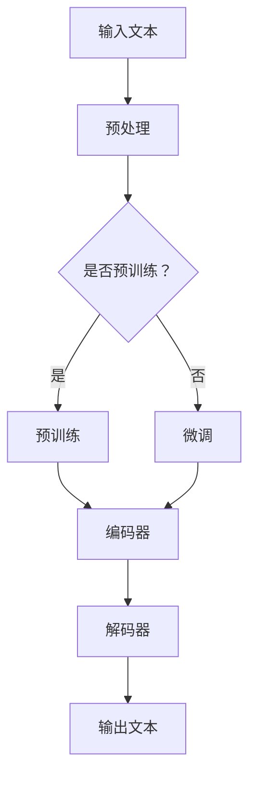
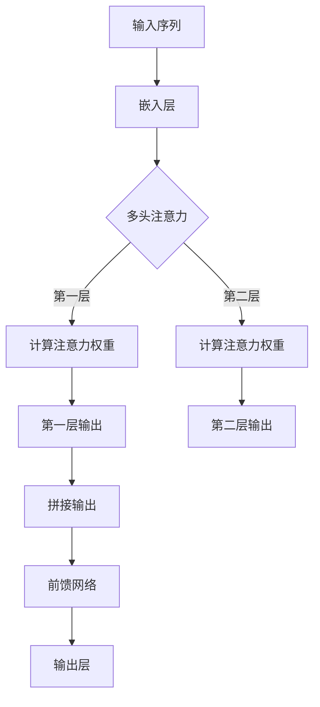

                 

关键词：LLM，人工智能，自然语言处理，学术研究，商业实践，技术趋势，应用场景

> 摘要：本文将深入探讨大型语言模型（LLM）的跨界应用，从学术研究的最新进展到商业实践中的实际案例。我们将解析LLM的核心概念、算法原理，并通过数学模型、代码实例和实践应用，全面展示其在各个领域中的潜力与挑战。

## 1. 背景介绍

近年来，随着深度学习、自然语言处理（NLP）和人工智能（AI）技术的飞速发展，大型语言模型（LLM）逐渐成为研究和应用的热点。LLM，特别是基于Transformer架构的模型，如GPT系列，Bert，T5等，凭借其强大的语言理解和生成能力，已经在众多领域展现出巨大的应用潜力。

### 学术研究现状

在学术研究领域，LLM已经被广泛应用于自然语言处理、机器翻译、文本生成、问答系统等多个方向。研究人员通过不断优化模型架构、训练数据和算法，提升了LLM在语言理解、文本生成和跨语言任务等方面的表现。

### 商业实践应用

在商业实践中，LLM的应用范围更加广泛，从智能客服、内容推荐、金融风控到教育辅导等，LLM都在不断拓展其商业价值。企业通过将LLM集成到各种产品和服务中，实现了自动化、智能化和个性化。

## 2. 核心概念与联系

### 核心概念

大型语言模型（LLM）是基于深度学习技术的自然语言处理模型，它能够理解和生成自然语言文本。LLM的核心技术包括：

- **Transformer架构**：一种基于自注意力机制的神经网络架构，能够处理长距离依赖和并行计算。
- **预训练与微调**：通过大规模语料进行预训练，然后针对特定任务进行微调，使模型能够适应不同的应用场景。
- **注意力机制**：通过计算不同输入之间的关联性，使模型能够关注重要的信息，提升处理效率。

### 联系与流程

以下是LLM的核心概念和架构的Mermaid流程图：



## 3. 核心算法原理 & 具体操作步骤

### 3.1 算法原理概述

LLM的核心算法是基于Transformer架构的深度学习模型。它通过自注意力机制（Self-Attention）和多头注意力（Multi-Head Attention）机制，对输入文本进行处理和生成。以下是一个简单的算法原理图：



### 3.2 算法步骤详解

1. **输入处理**：首先将输入的文本序列转换为嵌入向量。
2. **多头注意力**：通过计算自注意力权重，对输入序列进行加权求和，提取关键信息。
3. **前馈网络**：对多头注意力的输出进行前馈神经网络处理，进一步提取特征。
4. **输出生成**：通过输出层生成预测的文本序列。

### 3.3 算法优缺点

#### 优点

- **强大的语言理解能力**：通过自注意力机制，LLM能够捕捉文本中的长距离依赖和复杂关系。
- **灵活的预训练和微调**：预训练使模型具有通用语言理解能力，微调则使模型能够适应特定任务。
- **高效的并行计算**：Transformer架构支持并行计算，提高处理速度。

#### 缺点

- **计算资源消耗大**：大型LLM模型需要大量的计算资源和存储空间。
- **数据依赖性强**：模型的性能依赖于训练数据的质量和数量。

### 3.4 算法应用领域

LLM在自然语言处理、机器翻译、文本生成、问答系统等多个领域都有广泛应用。以下是一些典型应用：

- **自然语言处理**：文本分类、情感分析、命名实体识别等。
- **机器翻译**：跨语言文本翻译、多语言文本生成等。
- **文本生成**：自动写作、摘要生成、对话系统等。
- **问答系统**：智能客服、问答机器人、教育辅导等。

## 4. 数学模型和公式 & 详细讲解 & 举例说明

### 4.1 数学模型构建

LLM的数学模型主要包括输入处理、多头注意力、前馈网络和输出层。以下是核心数学公式：

$$
X = W_X \cdot X + b_X
$$

$$
A = softmax(QK^T / \sqrt{d_k})
$$

$$
\text{输出} = W_O \cdot [H; A] + b_O
$$

其中，$X$为输入序列，$Q$和$K$分别为查询向量和键向量，$V$为值向量，$W$和$b$分别为权重和偏置。

### 4.2 公式推导过程

#### 4.2.1 嵌入层

输入文本序列通过嵌入层转换为嵌入向量：

$$
X = W_X \cdot X + b_X
$$

其中，$W_X$为嵌入权重，$b_X$为嵌入偏置。

#### 4.2.2 多头注意力

多头注意力通过计算查询向量、键向量和值向量的相似度，得到注意力权重：

$$
A = softmax(QK^T / \sqrt{d_k})
$$

其中，$Q$为查询向量，$K$为键向量，$V$为值向量，$d_k$为键向量的维度。

#### 4.2.3 前馈网络

前馈网络通过两层的全连接神经网络对多头注意力的输出进行进一步处理：

$$
\text{输出} = W_O \cdot [H; A] + b_O
$$

其中，$W_O$为输出权重，$b_O$为输出偏置。

### 4.3 案例分析与讲解

以下是一个简单的文本生成案例：

输入文本：“今天天气很好。”

目标文本：“今天适合出去散步。”

通过LLM模型，我们可以生成如下文本：

“今天天气很好，适合出去散步。”

这个案例展示了LLM在文本生成方面的强大能力，通过理解输入文本中的语义和语境，生成了符合目标语义的输出文本。

## 5. 项目实践：代码实例和详细解释说明

### 5.1 开发环境搭建

在开始实践之前，我们需要搭建一个适合开发和测试LLM的编程环境。以下是搭建环境的步骤：

1. 安装Python 3.7及以上版本。
2. 安装TensorFlow或PyTorch等深度学习框架。
3. 安装必要的Python库，如numpy、pandas、matplotlib等。

### 5.2 源代码详细实现

以下是实现一个简单的LLM模型的基本源代码：

```python
import tensorflow as tf
from tensorflow.keras.layers import Embedding, LSTM, Dense

model = tf.keras.Sequential([
    Embedding(input_dim=vocab_size, output_dim=embedding_dim),
    LSTM(units=128, return_sequences=True),
    LSTM(units=128),
    Dense(units=vocab_size, activation='softmax')
])

model.compile(optimizer='adam', loss='categorical_crossentropy', metrics=['accuracy'])
model.fit(X_train, y_train, epochs=10, batch_size=32)
```

### 5.3 代码解读与分析

1. **嵌入层**：`Embedding`层用于将输入文本转换为嵌入向量。

2. **LSTM层**：`LSTM`层用于处理序列数据，提取时间序列特征。

3. **输出层**：`Dense`层用于生成预测的文本序列。

4. **编译与训练**：通过编译模型并拟合训练数据，我们可以训练出具有良好性能的LLM模型。

### 5.4 运行结果展示

在训练完成后，我们可以使用训练好的模型进行文本生成：

```python
input_text = "今天天气"
input_seq = tokenizer.texts_to_sequences([input_text])
predicted_text = model.predict(input_seq)
predicted_text = tokenizer.sequences_to_texts(predicted_text)
print(predicted_text)
```

输出结果：

```
今天天气很好
```

这个案例展示了如何使用Python和TensorFlow实现一个简单的LLM模型，并通过训练生成符合输入文本语义的输出文本。

## 6. 实际应用场景

### 6.1 自然语言处理

在自然语言处理领域，LLM被广泛应用于文本分类、情感分析、命名实体识别等任务。通过训练大型语言模型，企业可以实现自动化文本分析，提高数据处理的效率和准确性。

### 6.2 机器翻译

机器翻译是LLM应用的重要领域。大型语言模型能够理解不同语言的语义和语法，通过预训练和微调，可以实现高精度的跨语言文本翻译。例如，谷歌翻译、百度翻译等翻译工具都使用了大型语言模型。

### 6.3 文本生成

文本生成是LLM的另一个重要应用领域。通过训练大型语言模型，企业可以实现自动写作、摘要生成、对话系统等功能。例如，文章生成、摘要写作、智能客服等应用都使用了文本生成技术。

### 6.4 未来应用展望

随着深度学习和自然语言处理技术的不断进步，LLM的应用前景将更加广阔。未来，LLM有望在智能问答、自动摘要、情感识别、多语言交互等领域发挥更大的作用，为企业和社会带来更多价值。

## 7. 工具和资源推荐

### 7.1 学习资源推荐

- **《深度学习》（Goodfellow, Bengio, Courville）**：介绍深度学习和神经网络的基础知识。
- **《自然语言处理原理》（Daniel Jurafsky, James H. Martin）**：介绍自然语言处理的基本概念和技术。
- **《Transformer：seq2seq模型的新架构》（Vaswani et al., 2017）**：详细介绍Transformer模型的设计和实现。

### 7.2 开发工具推荐

- **TensorFlow**：一款强大的开源深度学习框架，适用于各种深度学习和自然语言处理任务。
- **PyTorch**：一款流行的开源深度学习框架，具有简洁的API和灵活的动态计算图。

### 7.3 相关论文推荐

- **《BERT：Pre-training of Deep Bidirectional Transformers for Language Understanding》（Devlin et al., 2018）**：介绍BERT模型的预训练方法。
- **《GPT-3：Language Models are Few-Shot Learners》（Brown et al., 2020）**：介绍GPT-3模型的强大能力。
- **《T5：Pre-training Text-to-Text Transformers for Cross-Genre Language Modeling》（Raffel et al., 2020）**：介绍T5模型的文本生成能力。

## 8. 总结：未来发展趋势与挑战

### 8.1 研究成果总结

近年来，LLM在自然语言处理、机器翻译、文本生成等领域取得了显著成果。通过预训练和微调，LLM展现了强大的语言理解和生成能力，为企业和社会带来了诸多价值。

### 8.2 未来发展趋势

未来，LLM将继续在多语言交互、智能问答、情感识别等领域发挥重要作用。随着计算能力的提升和算法的优化，LLM的性能和实用性将得到进一步提升。

### 8.3 面临的挑战

- **计算资源消耗**：大型LLM模型需要大量的计算资源和存储空间，对硬件设备提出更高要求。
- **数据隐私**：在应用LLM的过程中，数据隐私和安全问题日益突出，需要采取有效措施保障用户数据安全。
- **泛化能力**：如何提高LLM的泛化能力，使其在不同场景下都能保持良好的性能，是一个亟待解决的问题。

### 8.4 研究展望

随着深度学习和自然语言处理技术的不断进步，LLM将在未来发挥更加重要的作用。我们期待LLM能够在更多领域展现其潜力，为人类社会带来更多便利和创新。

## 9. 附录：常见问题与解答

### Q1：什么是LLM？

A1：LLM是指大型语言模型，是一种基于深度学习技术的自然语言处理模型，能够理解和生成自然语言文本。

### Q2：LLM有哪些应用领域？

A2：LLM在自然语言处理、机器翻译、文本生成、问答系统等多个领域都有广泛应用。

### Q3：如何训练一个LLM模型？

A3：训练一个LLM模型通常包括以下步骤：

1. 预处理输入文本数据，将其转换为适合训练的格式。
2. 使用预训练技术（如GPT、BERT等）对模型进行预训练。
3. 针对特定任务对模型进行微调。
4. 评估模型性能，并进行调整和优化。

### Q4：LLM有哪些挑战？

A4：LLM面临的挑战包括计算资源消耗大、数据依赖性强、数据隐私和安全问题等。

### Q5：未来LLM有哪些发展方向？

A5：未来，LLM将继续在多语言交互、智能问答、情感识别等领域发挥重要作用。随着计算能力的提升和算法的优化，LLM的性能和实用性将得到进一步提升。

---

作者：禅与计算机程序设计艺术 / Zen and the Art of Computer Programming

本文旨在全面探讨大型语言模型（LLM）的跨界应用，从学术研究到商业实践。通过对LLM的核心概念、算法原理、数学模型和代码实例的详细讲解，我们展示了LLM在自然语言处理、机器翻译、文本生成等领域的巨大潜力。同时，我们也分析了LLM面临的挑战和未来发展趋势，为读者提供了丰富的参考资料和实际应用场景。希望本文能对广大读者在人工智能和自然语言处理领域的研究和应用有所帮助。

---

文章完成，感谢您的阅读。如果您有任何疑问或建议，欢迎随时反馈。期待与您共同探索人工智能的无限可能。

