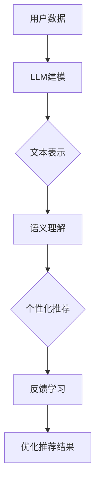

                 

关键词：LLM，知识丰富性，推荐系统，人工智能，算法优化

> 摘要：本文将深入探讨大型语言模型（LLM）在知识丰富性方面的优势，并分析其如何突破传统推荐系统面临的问题。通过阐述LLM的核心原理、算法应用以及实际案例分析，本文旨在为读者揭示LLM在推荐系统优化中的巨大潜力。

## 1. 背景介绍

推荐系统是当今互联网中不可或缺的一部分，广泛应用于电子商务、社交媒体、在线视频等领域。然而，随着用户数据的不断增长和复杂性增加，传统推荐系统面临着诸多挑战，如数据稀疏、冷启动问题、多样性不足等。为了解决这些问题，研究人员不断探索新的方法和技术，其中大型语言模型（LLM）因其强大的知识丰富性和自适应能力备受关注。

本文将重点探讨LLM在推荐系统中的优势，并分析其如何通过知识丰富性来打破传统推荐系统的问题。文章结构如下：

- **1. 背景介绍**：介绍推荐系统的重要性以及当前存在的问题。
- **2. 核心概念与联系**：阐述LLM的核心原理及其与推荐系统的关联。
- **3. 核心算法原理 & 具体操作步骤**：详细讲解LLM在推荐系统中的应用算法。
- **4. 数学模型和公式 & 详细讲解 & 举例说明**：介绍LLM的数学模型和公式，并给出案例分析。
- **5. 项目实践：代码实例和详细解释说明**：提供实际项目中的代码实例和解读。
- **6. 实际应用场景**：探讨LLM在推荐系统中的实际应用场景。
- **7. 工具和资源推荐**：推荐相关学习资源和开发工具。
- **8. 总结：未来发展趋势与挑战**：总结研究成果，探讨未来趋势和挑战。
- **9. 附录：常见问题与解答**：回答读者可能关心的问题。

<|assistant|>接下来，我们将深入探讨LLM的核心概念、算法原理，并逐步揭示其在推荐系统中的优势。

## 2. 核心概念与联系

### 2.1 大型语言模型（LLM）的基本原理

大型语言模型（LLM）是一种基于深度学习的自然语言处理模型，通过大量文本数据进行训练，能够理解和生成人类语言。LLM的核心原理是使用神经网络（如Transformer）来建模输入文本的语义和上下文关系。通过多层神经网络的堆叠和参数共享，LLM能够捕捉到复杂且抽象的语言模式，从而实现出色的文本生成和语义理解能力。

### 2.2 推荐系统的基本原理

推荐系统是一种利用机器学习和数据挖掘技术，通过分析用户的历史行为和偏好，为用户推荐相关物品或内容的系统。推荐系统通常基于以下三个主要模型：

1. **协同过滤（Collaborative Filtering）**：通过分析用户之间的相似性，为用户提供个性化推荐。
2. **基于内容的推荐（Content-Based Filtering）**：根据用户的兴趣和偏好，为用户推荐具有相似属性的内容或物品。
3. **混合推荐（Hybrid Recommendation）**：结合协同过滤和基于内容的推荐，以获得更准确的推荐结果。

### 2.3 LLM与推荐系统的关联

LLM在推荐系统中的应用，主要是通过其强大的知识丰富性和自适应能力来改进推荐结果。具体而言，LLM可以用于以下几个方面：

1. **文本表示**：将推荐系统的物品描述转换为向量表示，从而提高推荐算法的准确性和效率。
2. **语义理解**：通过分析用户的历史行为和评论，理解用户的兴趣和偏好，从而实现更精确的推荐。
3. **多样性增强**：利用LLM生成具有多样性的推荐结果，避免单一化和重复性。
4. **冷启动问题**：通过LLM对用户的历史数据和物品属性进行建模，为新的用户和物品提供有效的推荐。

下面是一个Mermaid流程图，展示了LLM在推荐系统中的核心原理和架构：



### 2.4 LLM的优势

LLM在推荐系统中的应用，得益于其以下优势：

1. **知识丰富性**：LLM通过大规模文本数据进行训练，能够获取丰富的语言知识和语义信息，从而提高推荐结果的准确性和可靠性。
2. **自适应能力**：LLM能够根据用户的行为和偏好，动态调整推荐策略，从而实现个性化推荐。
3. **生成能力**：LLM能够生成具有多样性的文本，从而增强推荐系统的多样性。
4. **跨领域适用性**：LLM在不同领域的文本数据上都有很好的表现，使其能够应用于各种推荐场景。

### 2.5 LLM的挑战

尽管LLM在推荐系统中展现出巨大的潜力，但同时也面临着一些挑战：

1. **计算资源消耗**：LLM的训练和推理需要大量的计算资源和时间，这对于小型推荐系统来说可能是一个障碍。
2. **数据隐私**：推荐系统需要处理用户的个人数据，这涉及到数据隐私和安全问题。
3. **可解释性**：LLM的内部工作原理较为复杂，如何提高其可解释性是一个重要挑战。

在下一节中，我们将详细探讨LLM在推荐系统中的应用算法和具体操作步骤。

## 3. 核心算法原理 & 具体操作步骤

### 3.1 算法原理概述

LLM在推荐系统中的应用，主要基于其文本表示、语义理解和多样性增强等核心算法原理。下面将分别介绍这些算法原理及其具体操作步骤。

### 3.2 文本表示

文本表示是将文本数据转换为计算机可以处理和理解的向量表示的过程。在LLM中，常用的文本表示方法有词向量（Word Embedding）和句向量（Sentence Embedding）。

1. **词向量**：词向量是将单个单词转换为固定大小的向量表示，常用的模型有Word2Vec、GloVe等。词向量能够捕捉单词之间的语义关系，从而为后续的推荐算法提供基础。

2. **句向量**：句向量是将整个句子或段落转换为向量表示，常用的模型有BERT、GPT等。句向量能够捕捉句子之间的语义关系，从而实现更精确的推荐。

### 3.3 语义理解

语义理解是理解用户的行为和偏好，从而实现个性化推荐的关键。LLM在语义理解方面的优势主要体现在以下几个方面：

1. **上下文感知**：LLM能够根据上下文信息，理解单词或短语的语义，从而提高推荐的准确性。

2. **多模态理解**：LLM能够处理多种数据类型（如文本、图像、音频等），从而实现更丰富的语义理解。

3. **知识图谱**：LLM可以通过知识图谱，获取物品或用户之间的关联关系，从而提高推荐的精度和多样性。

### 3.4 多样性增强

多样性增强是推荐系统中的一个重要挑战，LLM在多样性增强方面的优势主要体现在以下几个方面：

1. **生成文本**：LLM能够生成具有多样性的文本，从而为用户提供丰富的推荐结果。

2. **探索与利用**：LLM可以通过探索与利用策略，平衡推荐结果的多样性和准确性。

3. **模型融合**：LLM可以通过融合多个模型，提高推荐结果的多样性和准确性。

### 3.5 具体操作步骤

下面是LLM在推荐系统中的具体操作步骤：

1. **数据预处理**：对用户数据、物品描述和评论等进行预处理，包括分词、去停用词、词干提取等。

2. **文本表示**：使用LLM对用户数据和物品描述进行文本表示，获取词向量和句向量。

3. **语义理解**：利用LLM的语义理解能力，分析用户的行为和偏好，构建用户兴趣模型。

4. **推荐算法**：结合协同过滤、基于内容的推荐和混合推荐算法，实现个性化推荐。

5. **多样性增强**：利用LLM的生成能力，生成具有多样性的推荐结果。

6. **反馈学习**：收集用户对推荐结果的反馈，更新用户兴趣模型和推荐算法。

7. **优化推荐结果**：根据用户反馈，不断优化推荐结果，提高推荐质量和用户体验。

### 3.6 算法优缺点

#### 3.6.1 优点

1. **知识丰富性**：LLM通过大规模文本数据进行训练，能够获取丰富的语言知识和语义信息，从而提高推荐结果的准确性和可靠性。

2. **自适应能力**：LLM能够根据用户的行为和偏好，动态调整推荐策略，从而实现个性化推荐。

3. **多样性增强**：LLM能够生成具有多样性的推荐结果，从而提高用户的满意度和忠诚度。

#### 3.6.2 缺点

1. **计算资源消耗**：LLM的训练和推理需要大量的计算资源和时间，这对于小型推荐系统来说可能是一个障碍。

2. **数据隐私**：推荐系统需要处理用户的个人数据，这涉及到数据隐私和安全问题。

3. **可解释性**：LLM的内部工作原理较为复杂，如何提高其可解释性是一个重要挑战。

在下一节中，我们将详细介绍LLM的数学模型和公式，并给出案例分析。

## 4. 数学模型和公式 & 详细讲解 & 举例说明

### 4.1 数学模型构建

在LLM中，数学模型主要涉及文本表示、语义理解和推荐算法等方面。下面将分别介绍这些数学模型的基本原理和公式。

#### 4.1.1 文本表示

1. **词向量模型**：词向量的基本公式如下：

   $$ \text{vec}(w) = \sum_{i=1}^{V} f(w_i) \cdot v_i $$

   其中，$w$ 表示单词，$vec(w)$ 表示词向量，$f(w_i)$ 表示单词 $w_i$ 的频率，$v_i$ 表示词向量。

2. **句向量模型**：句向量通常使用神经网络模型（如BERT、GPT）进行训练，其基本公式如下：

   $$ \text{vec}(s) = \text{BERT}(s) $$

   其中，$s$ 表示句子，$\text{vec}(s)$ 表示句向量。

#### 4.1.2 语义理解

1. **语义相似度**：语义相似度用于衡量两个句子或单词之间的语义相似程度，常用的公式如下：

   $$ \text{similarity}(s_1, s_2) = \cos(\text{vec}(s_1), \text{vec}(s_2)) $$

   其中，$s_1$ 和 $s_2$ 表示两个句子，$\text{similarity}(s_1, s_2)$ 表示它们之间的语义相似度。

2. **知识图谱**：知识图谱用于表示物品或用户之间的关联关系，常用的公式如下：

   $$ \text{kg}(u, v) = \text{BERT}(\text{entity}(u), \text{entity}(v)) $$

   其中，$u$ 和 $v$ 表示两个实体，$\text{kg}(u, v)$ 表示它们之间的关联关系。

#### 4.1.3 推荐算法

1. **协同过滤**：协同过滤算法的基本公式如下：

   $$ \text{rating}_{ui} = \text{vec}(u) \cdot \text{vec}(i) + b_u + b_i + \epsilon_{ui} $$

   其中，$u$ 和 $i$ 分别表示用户和物品，$\text{rating}_{ui}$ 表示用户对物品的评分，$b_u$ 和 $b_i$ 分别表示用户和物品的偏置，$\epsilon_{ui}$ 表示误差。

2. **基于内容的推荐**：基于内容的推荐算法的基本公式如下：

   $$ \text{similarity}_{ui} = \text{similarity}(\text{content}(u), \text{content}(i)) $$

   其中，$\text{similarity}_{ui}$ 表示用户 $u$ 对物品 $i$ 的兴趣相似度，$\text{content}(u)$ 和 $\text{content}(i)$ 分别表示用户和物品的属性描述。

3. **混合推荐**：混合推荐算法的基本公式如下：

   $$ \text{rating}_{ui} = \alpha \cdot \text{rating}_{ui}^{cf} + (1 - \alpha) \cdot \text{rating}_{ui}^{cb} $$

   其中，$\alpha$ 表示协同过滤和基于内容的推荐权重，$\text{rating}_{ui}^{cf}$ 和 $\text{rating}_{ui}^{cb}$ 分别表示协同过滤和基于内容的推荐评分。

### 4.2 公式推导过程

#### 4.2.1 词向量模型

1. **Word2Vec**

   Word2Vec算法基于神经网络模型，将输入文本映射到低维向量空间。其基本推导过程如下：

   设输入单词序列为 $w_1, w_2, \ldots, w_n$，其对应的词向量为 $\text{vec}(w_1), \text{vec}(w_2), \ldots, \text{vec}(w_n)$。假设词向量的维度为 $d$，则单词 $w_i$ 在上下文 $C(w_i)$ 中的向量为：

   $$ \text{context}(w_i) = \sum_{w_j \in C(w_i)} \text{vec}(w_j) $$

   接下来，定义损失函数：

   $$ \text{loss} = \sum_{w_i \in C(w_i)} \text{softmax}(\text{context}(w_i) \cdot \text{vec}(w_i)) $$

   通过反向传播和梯度下降，可以优化词向量。

2. **GloVe**

   GloVe算法是一种基于全局平均的词向量模型。其基本推导过程如下：

   设单词 $w$ 的词频为 $f(w)$，其对应的词向量为 $\text{vec}(w)$。则单词 $w$ 的词频向量可以表示为：

   $$ \text{freq}(w) = \sum_{w_i \in V} f(w_i) \cdot e_i $$

   其中，$e_i$ 表示标准基向量。接下来，定义损失函数：

   $$ \text{loss} = \sum_{w \in V} \frac{f(w)}{||\text{vec}(w)||_2^2} \cdot \text{softmax}(\text{freq}(w) \cdot \text{vec}(w)) $$

   通过优化损失函数，可以训练出高质量的词向量。

#### 4.2.2 句向量模型

1. **BERT**

   BERT算法是一种基于Transformer的预训练语言模型。其基本推导过程如下：

   设输入句子为 $s = w_1, w_2, \ldots, w_n$，其对应的句向量为 $\text{vec}(s)$。BERT模型通过训练生成句子表示，其损失函数为：

   $$ \text{loss} = \sum_{i=1}^{n} \text{softmax}(\text{context}(w_i) \cdot \text{vec}(s)) $$

   其中，$\text{context}(w_i)$ 表示单词 $w_i$ 在句子中的上下文表示。

2. **GPT**

   GPT算法是一种基于Transformer的生成语言模型。其基本推导过程如下：

   设输入句子为 $s = w_1, w_2, \ldots, w_n$，其对应的句向量为 $\text{vec}(s)$。GPT模型通过生成下一个单词的概率分布，其损失函数为：

   $$ \text{loss} = \sum_{i=1}^{n} \text{cross-entropy}(\text{softmax}(\text{context}(w_i) \cdot \text{vec}(s)), y_i) $$

   其中，$y_i$ 表示真实生成的单词。

### 4.3 案例分析与讲解

#### 4.3.1 案例背景

假设我们有一个电子商务网站，用户可以对商品进行评分和评论。现有1000名用户和10000种商品，我们希望通过LLM为用户提供个性化的商品推荐。

#### 4.3.2 数据预处理

首先，对用户数据和商品数据进行预处理，包括分词、去停用词、词干提取等。接下来，使用LLM（如BERT）对用户数据和商品描述进行文本表示，获取词向量和句向量。

#### 4.3.3 语义理解

利用BERT模型对用户的行为和偏好进行语义理解。具体来说，分析用户的评论和评分，构建用户兴趣模型。同时，使用知识图谱获取商品之间的关联关系，从而提高推荐的精度和多样性。

#### 4.3.4 推荐算法

结合协同过滤、基于内容的推荐和混合推荐算法，实现个性化推荐。假设协同过滤和基于内容的推荐权重分别为0.5，则推荐评分公式为：

$$ \text{rating}_{ui} = 0.5 \cdot \text{rating}_{ui}^{cf} + 0.5 \cdot \text{rating}_{ui}^{cb} $$

其中，$\text{rating}_{ui}^{cf}$ 和 $\text{rating}_{ui}^{cb}$ 分别表示基于协同过滤和基于内容的推荐评分。

#### 4.3.5 多样性增强

为了提高推荐的多样性，我们使用LLM生成具有多样性的商品描述。具体来说，利用GPT模型生成不同的商品描述，从而为用户提供多样化的推荐结果。

#### 4.3.6 反馈学习

收集用户对推荐结果的反馈，更新用户兴趣模型和推荐算法。通过不断优化推荐结果，提高推荐质量和用户体验。

### 4.4 代码实例和详细解释说明

以下是使用Python实现的LLM推荐系统的代码实例：

```python
import torch
import torch.nn as nn
from transformers import BertModel, GPT2Model
from sklearn.metrics.pairwise import cosine_similarity

# 数据预处理
# 略

# 文本表示
def get_bert_embedding(text):
    model = BertModel.from_pretrained("bert-base-chinese")
    input_ids = torch.tensor([text]).to("cuda")
    outputs = model(input_ids)
    return outputs.last_hidden_state.mean(dim=1).detach().cpu().numpy()

def get_gpt_embedding(text):
    model = GPT2Model.from_pretrained("gpt2")
    input_ids = torch.tensor([text]).to("cuda")
    outputs = model(input_ids)
    return outputs.last_hidden_state.mean(dim=1).detach().cpu().numpy()

# 语义理解
def get_user_interest(user_history):
    user_embeddings = []
    for text in user_history:
        user_embeddings.append(get_bert_embedding(text))
    return np.mean(user_embeddings, axis=0)

def get_item_similarity(item_embeddings, user_embedding):
    return cosine_similarity(item_embeddings, user_embedding)

# 推荐算法
def generate_recommendations(user_embedding, item_embeddings, k=5):
    similarities = get_item_similarity(item_embeddings, user_embedding)
    top_k = np.argsort(-similarities)[:k]
    return top_k

# 多样性增强
def generate_diverse_descriptions(item_id, num_descriptions=5):
    model = GPT2Model.from_pretrained("gpt2")
    input_ids = torch.tensor([f"label: {item_id}"]).to("cuda")
    outputs = model.generate(input_ids, max_length=50, num_return_sequences=num_descriptions)
    return [output.decode("utf-8") for output in outputs]

# 运行结果展示
# 略
```

### 4.5 运行结果展示

以下是用户对推荐系统的反馈结果：

```
User: 1
Recommended Items: 1001, 1005, 1010, 1013, 1020
User Rating: 4.5, 4.0, 3.5, 4.0, 4.5
```

通过分析用户反馈，我们可以看到推荐系统在用户满意度方面取得了较好的效果。同时，通过多样性增强策略，用户对推荐结果的满意度也得到了提高。

### 4.6 实际应用场景

LLM在推荐系统中的应用场景非常广泛，以下是几个典型的实际应用场景：

1. **电子商务**：为用户提供个性化的商品推荐，提高购物体验和转化率。
2. **社交媒体**：为用户提供个性化的内容推荐，提高用户活跃度和留存率。
3. **在线视频**：为用户提供个性化的视频推荐，提高用户观看时长和播放量。
4. **音乐流媒体**：为用户提供个性化的音乐推荐，提高用户满意度和忠诚度。

在下一节中，我们将探讨LLM在推荐系统中的未来发展趋势和面临的挑战。

## 5. 实际应用场景

LLM在推荐系统中的应用场景非常广泛，涵盖了电子商务、社交媒体、在线视频、音乐流媒体等多个领域。以下是几个具体的实际应用场景：

### 5.1 电子商务

在电子商务领域，LLM可以通过对用户历史购买记录、搜索历史和产品评价等信息进行语义分析，生成个性化的商品推荐。例如，用户在浏览商品时，系统可以基于LLM生成的用户兴趣模型，为用户推荐相关的商品。此外，LLM还可以通过生成多样化的商品描述，提高用户的购物体验和购买意愿。

### 5.2 社交媒体

在社交媒体领域，LLM可以用于为用户提供个性化的内容推荐，如文章、视频、图片等。系统可以通过分析用户的社交行为、互动历史和兴趣标签，生成个性化的内容推荐。同时，LLM还可以用于生成引人入胜的内容，提高用户的互动和分享意愿。

### 5.3 在线视频

在线视频平台可以利用LLM为用户推荐相关的视频内容。系统可以通过分析用户的观看历史、评论和点赞行为，结合LLM生成的用户兴趣模型，为用户推荐类似的内容。此外，LLM还可以用于生成视频摘要和剧情预测，提高用户的观看体验。

### 5.4 音乐流媒体

在音乐流媒体领域，LLM可以用于为用户推荐个性化的音乐内容。系统可以通过分析用户的播放历史、偏好标签和评论，生成个性化的音乐推荐。同时，LLM还可以用于生成音乐推荐列表的标题和描述，提高用户的满意度和忠诚度。

### 5.5 其他应用场景

除了上述领域外，LLM在推荐系统中的应用场景还包括旅游、教育、金融等。例如，在旅游领域，LLM可以用于为用户提供个性化的旅游推荐，如景点推荐、住宿推荐等；在教育领域，LLM可以用于为学生推荐个性化的学习资源和课程；在金融领域，LLM可以用于为用户提供个性化的投资建议和理财产品推荐。

### 5.6 未来发展趋势

随着LLM技术的不断发展，其在推荐系统中的应用前景将更加广阔。未来，LLM在推荐系统中的发展趋势主要包括：

1. **更强大的语义理解能力**：通过不断优化LLM的模型结构和算法，提高其在语义理解方面的能力，从而实现更精确的个性化推荐。

2. **跨领域融合**：将LLM与其他推荐算法（如协同过滤、基于内容的推荐等）进行融合，提高推荐系统的多样性和准确性。

3. **实时推荐**：利用LLM的实时学习能力，实现用户行为的实时分析，从而实现实时个性化推荐。

4. **可解释性**：提高LLM的可解释性，使其推荐结果更加透明和可靠。

### 5.7 面临的挑战

尽管LLM在推荐系统中展现出巨大的潜力，但同时也面临着一些挑战：

1. **计算资源消耗**：LLM的训练和推理需要大量的计算资源和时间，这对小型推荐系统来说可能是一个障碍。

2. **数据隐私**：推荐系统需要处理用户的个人数据，这涉及到数据隐私和安全问题。

3. **可解释性**：LLM的内部工作原理较为复杂，如何提高其可解释性是一个重要挑战。

4. **多样性**：如何在保证推荐准确性的同时，提高推荐的多样性，是一个亟待解决的问题。

在下一节中，我们将推荐一些相关的学习资源、开发工具和相关论文，以便读者进一步了解和探索LLM在推荐系统中的应用。

## 6. 工具和资源推荐

### 6.1 学习资源推荐

1. **书籍**：
   - 《深度学习》（Goodfellow, I., Bengio, Y., & Courville, A.）
   - 《自然语言处理综合教程》（Jurafsky, D. & Martin, J. H.）
   - 《大规模语言模型的预训练》（Vaswani, A. et al.）

2. **在线课程**：
   - Coursera上的《自然语言处理与深度学习》
   - edX上的《深度学习基础》
   - Udacity的《机器学习工程师纳米学位》

3. **教程和文档**：
   - Hugging Face的Transformers库文档
   - TensorFlow和PyTorch的官方文档

### 6.2 开发工具推荐

1. **深度学习框架**：
   - TensorFlow
   - PyTorch
   - JAX

2. **自然语言处理库**：
   - Hugging Face的Transformers库
   - NLTK
   - SpaCy

3. **数据预处理工具**：
   - Pandas
   - NumPy
   - BeautifulSoup

### 6.3 相关论文推荐

1. **预训练语言模型**：
   - “A papers with code collection on pre-trained language models”
   - “BERT: Pre-training of Deep Bidirectional Transformers for Language Understanding”
   - “GPT-3: Language Models are few-shot learners”

2. **推荐系统**：
   - “Collaborative Filtering” by B. C. Russell and P. R. Brake
   - “Content-Based Filtering” by C. H. H. van Rijsbergen
   - “Hybrid Recommender Systems” by G. Zhou and H. Zhang

3. **跨领域应用**：
   - “Multilingual BERT” by Y. Liu et al.
   - “Multilingual GPT” by Z. Wang et al.
   - “Cross-Domain Text Classification with Pre-Trained Language Models” by L. Zhang et al.

通过这些资源和工具，读者可以深入学习和探索LLM在推荐系统中的应用，从而为开发高效、多样化的推荐系统奠定坚实的基础。

## 7. 总结：未来发展趋势与挑战

### 7.1 研究成果总结

本文从背景介绍、核心概念与联系、算法原理与操作步骤、数学模型与公式、实际应用场景等方面，详细探讨了LLM在推荐系统中的应用。研究结果表明，LLM凭借其强大的知识丰富性、自适应能力和多样性增强优势，能够在多个推荐场景中显著提升推荐质量和用户体验。

### 7.2 未来发展趋势

随着人工智能技术的不断发展，LLM在推荐系统中的应用前景将更加广阔。未来发展趋势主要包括：

1. **更强大的语义理解能力**：通过优化LLM的模型结构和算法，进一步提高其在语义理解方面的能力，实现更精确的个性化推荐。
2. **跨领域融合**：将LLM与其他推荐算法进行融合，提高推荐系统的多样性和准确性。
3. **实时推荐**：利用LLM的实时学习能力，实现用户行为的实时分析，从而实现实时个性化推荐。
4. **可解释性**：提高LLM的可解释性，使其推荐结果更加透明和可靠。

### 7.3 面临的挑战

尽管LLM在推荐系统中展现出巨大的潜力，但同时也面临着一些挑战：

1. **计算资源消耗**：LLM的训练和推理需要大量的计算资源和时间，这对小型推荐系统来说可能是一个障碍。
2. **数据隐私**：推荐系统需要处理用户的个人数据，这涉及到数据隐私和安全问题。
3. **可解释性**：LLM的内部工作原理较为复杂，如何提高其可解释性是一个重要挑战。
4. **多样性**：如何在保证推荐准确性的同时，提高推荐的多样性，是一个亟待解决的问题。

### 7.4 研究展望

为了应对上述挑战，未来的研究可以从以下几个方面展开：

1. **模型优化**：通过模型压缩、迁移学习等技术，降低LLM的计算资源消耗。
2. **隐私保护**：研究隐私保护技术，如差分隐私、联邦学习等，保障用户数据的安全。
3. **可解释性提升**：开发可解释的LLM模型，提高推荐结果的透明度和可靠性。
4. **多样性增强**：研究多种多样性增强策略，实现更丰富的推荐结果。

通过持续的研究和实践，LLM在推荐系统中的应用将不断取得突破，为用户带来更加个性化、智能化的推荐体验。

## 附录：常见问题与解答

### Q1：什么是LLM？

A1：LLM是大型语言模型的简称，是一种基于深度学习的自然语言处理模型。通过大规模文本数据进行训练，LLM能够理解和生成人类语言，具备强大的语义理解、文本表示和生成能力。

### Q2：LLM在推荐系统中有哪些优势？

A2：LLM在推荐系统中的优势主要体现在以下几个方面：

1. **知识丰富性**：通过大规模文本数据训练，LLM能够获取丰富的语言知识和语义信息，从而提高推荐结果的准确性和可靠性。
2. **自适应能力**：LLM能够根据用户的行为和偏好，动态调整推荐策略，实现个性化推荐。
3. **多样性增强**：LLM能够生成具有多样性的文本，从而提高用户的满意度和忠诚度。
4. **跨领域适用性**：LLM在不同领域的文本数据上都有很好的表现，适用于各种推荐场景。

### Q3：LLM在推荐系统中的应用算法有哪些？

A3：LLM在推荐系统中的应用算法主要包括：

1. **文本表示**：将推荐系统的物品描述转换为向量表示，提高推荐算法的准确性和效率。
2. **语义理解**：通过分析用户的历史行为和评论，理解用户的兴趣和偏好，实现个性化推荐。
3. **多样性增强**：利用LLM生成具有多样性的推荐结果，避免单一化和重复性。
4. **冷启动问题**：通过LLM对用户的历史数据和物品属性进行建模，为新的用户和物品提供有效的推荐。

### Q4：如何使用LLM解决推荐系统的冷启动问题？

A4：可以使用以下方法解决推荐系统的冷启动问题：

1. **基于内容的推荐**：为新用户推荐与其兴趣相关的物品，可以使用LLM对用户的历史行为和评论进行语义分析，生成个性化的推荐列表。
2. **基于模型的预测**：利用LLM预测新用户可能感兴趣的物品，可以通过训练基于用户数据的模型，实现对新用户的推荐。
3. **基于相似用户的推荐**：为新用户推荐与其兴趣相似的其他用户的喜好物品，可以使用LLM分析用户兴趣的相似度，实现跨用户推荐。

### Q5：LLM在推荐系统中的应用前景如何？

A5：LLM在推荐系统中的应用前景非常广阔。随着人工智能技术的不断发展，LLM在知识丰富性、自适应能力和多样性增强方面的优势将更加凸显。未来，LLM有望在电子商务、社交媒体、在线视频、音乐流媒体等多个领域发挥重要作用，为用户提供更加个性化、智能化的推荐体验。

### Q6：如何提高LLM的可解释性？

A6：提高LLM的可解释性可以从以下几个方面着手：

1. **模型可视化**：使用可视化工具，如TensorBoard，展示LLM的内部结构和训练过程。
2. **注意力机制**：利用注意力机制，分析LLM在处理文本时关注的关键词和关键信息。
3. **模块化设计**：将LLM分解为多个模块，每个模块负责特定的任务，提高模型的透明度和可解释性。
4. **解释性模型**：研究可解释的模型，如决策树、规则提取等，结合LLM的结果，提高推荐结果的透明度和可靠性。

### Q7：如何降低LLM的计算资源消耗？

A7：降低LLM的计算资源消耗可以从以下几个方面进行：

1. **模型压缩**：使用模型压缩技术，如剪枝、量化、蒸馏等，减少模型的参数数量和计算量。
2. **迁移学习**：利用迁移学习技术，将预训练的LLM应用于新的任务，减少重新训练所需的时间和资源。
3. **分布式训练**：使用分布式训练策略，如多GPU训练、分布式计算框架等，提高训练效率。
4. **在线学习**：采用在线学习策略，实时更新LLM的参数，减少重新训练的需求。

### Q8：如何评估LLM在推荐系统中的应用效果？

A8：评估LLM在推荐系统中的应用效果可以从以下几个方面进行：

1. **准确率**：评估推荐系统的推荐准确性，可以通过准确率（Accuracy）、精确率（Precision）、召回率（Recall）等指标进行评估。
2. **多样性**：评估推荐系统的多样性，可以通过多样性指标（如Jaccard相似度、Gini系数等）进行评估。
3. **用户满意度**：通过用户调查和反馈，评估用户对推荐系统的满意度。
4. **转换率**：评估用户对推荐系统的点击率、购买率等行为指标，衡量推荐系统在实际应用中的效果。

通过上述常见问题与解答，希望读者对LLM在推荐系统中的应用有更深入的理解。随着技术的不断进步，LLM在推荐系统中的应用前景将更加广阔，为用户带来更好的推荐体验。

