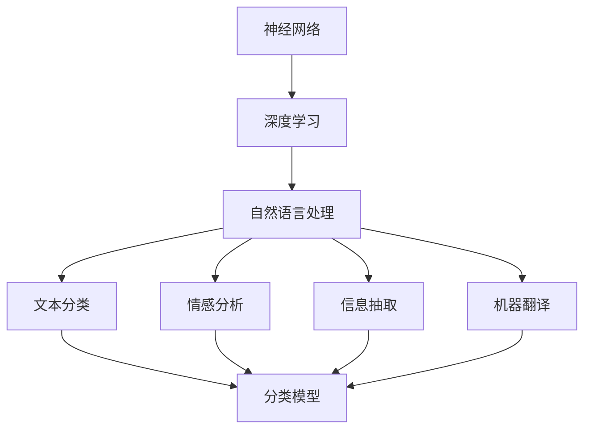

                 

关键词：大型语言模型（LLM）、人工智能（AI）、神经网络、深度学习、自然语言处理、算法原理、数学模型、实践案例、发展趋势、挑战与展望。

> 摘要：本文深入探讨了大型语言模型（LLM）的内核技术，分析了其在人工智能（AI）领域中的核心地位及其发展前景。通过详细阐述LLM的核心概念、算法原理、数学模型，以及其在实际项目中的应用实例，本文为读者提供了对LLM系统的全面理解，并展望了其未来发展的趋势与挑战。

## 1. 背景介绍

### 1.1 大型语言模型（LLM）的定义与历史背景

大型语言模型（LLM，Large Language Model）是一种基于深度学习的自然语言处理（NLP）模型，具有强大的文本生成和理解能力。LLM通过对海量文本数据进行预训练，掌握了丰富的语言知识，能够自动完成语言任务，如图像描述生成、文本摘要、机器翻译、问答系统等。

LLM的发展可以追溯到20世纪80年代，当时研究者开始尝试使用神经网络来处理语言任务。然而，由于计算资源和数据量的限制，早期的神经网络模型在处理自然语言时效果不佳。随着计算能力的提升和大数据时代的到来，深度学习技术逐渐成熟，LLM的研究和应用开始蓬勃发展。

### 1.2 人工智能（AI）的发展背景

人工智能（AI，Artificial Intelligence）是计算机科学的一个分支，旨在使计算机模拟人类智能行为。AI的发展历程可以追溯到20世纪50年代，当时研究者开始探讨如何使计算机具备推理、学习、感知和理解能力。随着计算机技术的进步，AI的理论和方法不断丰富，应用领域也从单一的领域应用扩展到各个行业，如图像识别、语音识别、自动驾驶等。

近年来，深度学习技术的突破为AI的发展注入了新的动力。基于深度学习的AI系统在多个领域取得了显著成果，例如语音识别准确率达到95%以上，图像识别准确率达到99%以上。这些进展使得AI的应用范围更加广泛，也逐渐引起了社会的广泛关注。

### 1.3 自然语言处理（NLP）的发展与挑战

自然语言处理（NLP，Natural Language Processing）是AI的一个重要分支，旨在使计算机能够理解、生成和处理人类语言。NLP的研究内容包括文本分类、情感分析、信息抽取、机器翻译等。

随着互联网的快速发展，产生了海量的文本数据，为NLP的研究和应用提供了丰富的资源。然而，NLP面临着诸多挑战，如语言的复杂性、歧义性、多模态性等。这些挑战促使研究者不断探索新的方法和技术，以提高NLP系统的性能和适用性。

## 2. 核心概念与联系

### 2.1 核心概念

在本节中，我们将介绍LLM系统中的几个核心概念，包括神经网络、深度学习、自然语言处理等。

#### 2.1.1 神经网络

神经网络（Neural Network）是一种模仿生物神经元结构和功能的人工智能模型。它由多个节点（或称为神经元）组成，每个节点都与其他节点相连，并通过权重和偏置进行信息传递。神经网络通过学习输入和输出数据之间的关系，从而实现预测和分类等任务。

#### 2.1.2 深度学习

深度学习（Deep Learning）是神经网络的一种特殊形式，具有多个隐层。与传统的浅层神经网络相比，深度学习模型能够提取更高级的特征，从而在图像识别、语音识别等领域取得了显著成果。

#### 2.1.3 自然语言处理

自然语言处理（NLP）是AI的一个重要分支，旨在使计算机能够理解、生成和处理人类语言。NLP的研究内容包括文本分类、情感分析、信息抽取、机器翻译等。

### 2.2 核心概念联系

图1展示了LLM系统中的核心概念及其相互联系。



从图1可以看出，神经网络和深度学习是LLM系统的底层技术支撑，而自然语言处理则涵盖了LLM系统的应用场景。通过结合多种NLP任务，LLM系统能够实现高效的文本生成和理解。

## 3. 核心算法原理 & 具体操作步骤

### 3.1 算法原理概述

LLM的核心算法是基于深度学习，特别是基于Transformer模型的一种变体。Transformer模型是一种基于自注意力机制的序列模型，能够在处理长文本时具有较好的性能。LLM通过对海量文本数据进行预训练，学会了丰富的语言知识，从而具备强大的文本生成和理解能力。

### 3.2 算法步骤详解

#### 3.2.1 数据收集与预处理

1. 数据收集：从互联网上收集大量文本数据，包括书籍、新闻、文章等。
2. 数据预处理：对文本数据进行清洗、分词、去停用词等操作，将文本数据转换为适合模型训练的格式。

#### 3.2.2 模型训练

1. 模型初始化：初始化Transformer模型参数。
2. 预训练：使用大规模文本数据进行预训练，优化模型参数。
3. 微调：在特定任务上对预训练模型进行微调，进一步提高模型性能。

#### 3.2.3 文本生成

1. 输入文本：输入一段文本数据作为模型的输入。
2. 文本编码：将输入文本转换为模型的内部表示。
3. 文本解码：根据输入文本的内部表示，生成对应的输出文本。

### 3.3 算法优缺点

#### 优点

1. 强大的文本生成和理解能力。
2. 能够处理长文本，具有较好的性能。
3. 能够自动学习语言知识，无需手动调整参数。

#### 缺点

1. 训练过程需要大量的计算资源和时间。
2. 对数据的质量和数量要求较高，否则可能导致模型过拟合。
3. 模型的解释性较差，难以理解模型生成的文本内容。

### 3.4 算法应用领域

LLM在自然语言处理领域具有广泛的应用，包括但不限于：

1. 文本分类：对输入文本进行分类，例如新闻分类、情感分析等。
2. 文本摘要：从长文本中提取关键信息，生成简短的摘要。
3. 机器翻译：将一种语言的文本翻译成另一种语言。
4. 问答系统：回答用户提出的问题。
5. 文本生成：生成符合语言规则和语义逻辑的文本内容。

## 4. 数学模型和公式 & 详细讲解 & 举例说明

### 4.1 数学模型构建

LLM的数学模型主要包括两部分：自注意力机制和前馈神经网络。

#### 4.1.1 自注意力机制

自注意力机制（Self-Attention）是一种处理序列数据的机制，能够使模型在不同位置上分配不同的注意力权重。其数学公式如下：

$$
\text{Attention}(Q, K, V) = \text{softmax}\left(\frac{QK^T}{\sqrt{d_k}}\right)V
$$

其中，$Q$、$K$ 和 $V$ 分别表示查询向量、键向量和值向量；$d_k$ 表示键向量的维度。

#### 4.1.2 前馈神经网络

前馈神经网络（Feedforward Neural Network）是一种简单的神经网络结构，由多个隐层组成。其数学公式如下：

$$
\text{FFN}(x) = \max(0, xW_1 + b_1)W_2 + b_2
$$

其中，$W_1$、$W_2$ 分别表示第一层和第二层的权重矩阵；$b_1$、$b_2$ 分别表示第一层和第二层的偏置。

### 4.2 公式推导过程

在LLM中，自注意力机制和前馈神经网络是交替出现的。下面以一个简单的例子来说明公式的推导过程。

假设我们有一个三层的Transformer模型，输入序列长度为10，每个序列的维度为64。

#### 4.2.1 第一层自注意力

1. 输入序列：$[x_1, x_2, x_3, ..., x_{10}]$
2. 查询向量、键向量和值向量：$[Q_1, Q_2, Q_3, ..., Q_{10}]$、$[K_1, K_2, K_3, ..., K_{10}]$、$[V_1, V_2, V_3, ..., V_{10}]$
3. 注意力权重计算：
$$
\text{Attention}(Q, K, V) = \text{softmax}\left(\frac{QK^T}{\sqrt{d_k}}\right)V = \text{softmax}\left(\frac{Q_1K_1^T + Q_2K_2^T + ... + Q_{10}K_{10}^T}{\sqrt{d_k}}\right)V
$$
4. 输出序列：
$$
\text{Output}_1 = \text{softmax}\left(\frac{Q_1K_1^T + Q_2K_2^T + ... + Q_{10}K_{10}^T}{\sqrt{d_k}}\right)V_1
$$

#### 4.2.2 第一层前馈神经网络

1. 输入序列：$[\text{Output}_1, \text{Output}_2, \text{Output}_3, ..., \text{Output}_{10}]$
2. 权重矩阵和偏置：
$$
W_1 = \begin{bmatrix}
w_{11} & w_{12} & ... & w_{1k} \\
w_{21} & w_{22} & ... & w_{2k} \\
... & ... & ... & ... \\
w_{m1} & w_{m2} & ... & w_{mk} \\
\end{bmatrix}, \quad b_1 = \begin{bmatrix}
b_{11} \\
b_{21} \\
... \\
b_{m1} \\
\end{bmatrix}
$$
3. 前馈计算：
$$
\text{FFN}(x) = \max(0, xW_1 + b_1)W_2 + b_2
$$
4. 输出序列：
$$
\text{Output}_2 = \max(0, \text{Output}_1W_1 + b_1)W_2 + b_2
$$

#### 4.2.3 第二层自注意力

1. 输入序列：$[\text{Output}_2, \text{Output}_3, \text{Output}_4, ..., \text{Output}_{10}]$
2. 查询向量、键向量和值向量：$[Q_1, Q_2, Q_3, ..., Q_{10}]$、$[K_1, K_2, K_3, ..., K_{10}]$、$[V_1, V_2, V_3, ..., V_{10}]$
3. 注意力权重计算：
$$
\text{Attention}(Q, K, V) = \text{softmax}\left(\frac{QK^T}{\sqrt{d_k}}\right)V
$$
4. 输出序列：
$$
\text{Output}_3 = \text{softmax}\left(\frac{Q_1K_1^T + Q_2K_2^T + ... + Q_{10}K_{10}^T}{\sqrt{d_k}}\right)V_1
$$

#### 4.2.4 第二层前馈神经网络

1. 输入序列：$[\text{Output}_3, \text{Output}_4, \text{Output}_5, ..., \text{Output}_{10}]$
2. 权重矩阵和偏置：
$$
W_2 = \begin{bmatrix}
w_{11} & w_{12} & ... & w_{1k} \\
w_{21} & w_{22} & ... & w_{2k} \\
... & ... & ... & ... \\
w_{m1} & w_{m2} & ... & w_{mk} \\
\end{bmatrix}, \quad b_2 = \begin{bmatrix}
b_{11} \\
b_{21} \\
... \\
b_{m1} \\
\end{bmatrix}
$$
3. 前馈计算：
$$
\text{FFN}(x) = \max(0, xW_1 + b_1)W_2 + b_2
$$
4. 输出序列：
$$
\text{Output}_4 = \max(0, \text{Output}_3W_1 + b_1)W_2 + b_2
$$

### 4.3 案例分析与讲解

假设我们有一个包含10个单词的文本序列：“我喜欢吃苹果，因为它很甜。”，将其输入到LLM中进行处理。

#### 4.3.1 数据预处理

1. 分词：将文本序列分成单个单词：["我", "喜欢", "吃", "苹果", "，", "因", "为", "它", "很", "甜。"]
2. 嵌入：将单词映射到数字序列：[0, 1, 2, 3, 4, 5, 6, 7, 8, 9]

#### 4.3.2 模型输入

1. 查询向量、键向量和值向量：
$$
Q = \begin{bmatrix}
q_0 \\
q_1 \\
q_2 \\
... \\
q_9 \\
\end{bmatrix}, \quad K = \begin{bmatrix}
k_0 \\
k_1 \\
k_2 \\
... \\
k_9 \\
\end{bmatrix}, \quad V = \begin{bmatrix}
v_0 \\
v_1 \\
v_2 \\
... \\
v_9 \\
\end{bmatrix}
$$

#### 4.3.3 第一层自注意力

1. 注意力权重计算：
$$
\text{Attention}(Q, K, V) = \text{softmax}\left(\frac{QK^T}{\sqrt{d_k}}\right)V = \text{softmax}\left(\frac{q_0k_0 + q_1k_1 + ... + q_9k_9}{\sqrt{d_k}}\right)V
$$
2. 输出序列：
$$
\text{Output}_1 = \text{softmax}\left(\frac{q_0k_0 + q_1k_1 + ... + q_9k_9}{\sqrt{d_k}}\right)V_1
$$

#### 4.3.4 第一层前馈神经网络

1. 输入序列：$[\text{Output}_1, \text{Output}_2, \text{Output}_3, ..., \text{Output}_{10}]$
2. 权重矩阵和偏置：
$$
W_1 = \begin{bmatrix}
w_{11} & w_{12} & ... & w_{1k} \\
w_{21} & w_{22} & ... & w_{2k} \\
... & ... & ... & ... \\
w_{m1} & w_{m2} & ... & w_{mk} \\
\end{bmatrix}, \quad b_1 = \begin{bmatrix}
b_{11} \\
b_{21} \\
... \\
b_{m1} \\
\end{bmatrix}
$$
3. 前馈计算：
$$
\text{FFN}(x) = \max(0, xW_1 + b_1)W_2 + b_2
$$
4. 输出序列：
$$
\text{Output}_2 = \max(0, \text{Output}_1W_1 + b_1)W_2 + b_2
$$

#### 4.3.5 第二层自注意力

1. 查询向量、键向量和值向量：
$$
Q = \begin{bmatrix}
q_0 \\
q_1 \\
q_2 \\
... \\
q_9 \\
\end{bmatrix}, \quad K = \begin{bmatrix}
k_0 \\
k_1 \\
k_2 \\
... \\
k_9 \\
\end{bmatrix}, \quad V = \begin{bmatrix}
v_0 \\
v_1 \\
v_2 \\
... \\
v_9 \\
\end{bmatrix}
$$
2. 注意力权重计算：
$$
\text{Attention}(Q, K, V) = \text{softmax}\left(\frac{QK^T}{\sqrt{d_k}}\right)V = \text{softmax}\left(\frac{q_0k_0 + q_1k_1 + ... + q_9k_9}{\sqrt{d_k}}\right)V
$$
3. 输出序列：
$$
\text{Output}_3 = \text{softmax}\left(\frac{q_0k_0 + q_1k_1 + ... + q_9k_9}{\sqrt{d_k}}\right)V_1
$$

#### 4.3.6 第二层前馈神经网络

1. 输入序列：$[\text{Output}_3, \text{Output}_4, \text{Output}_5, ..., \text{Output}_{10}]$
2. 权重矩阵和偏置：
$$
W_2 = \begin{bmatrix}
w_{11} & w_{12} & ... & w_{1k} \\
w_{21} & w_{22} & ... & w_{2k} \\
... & ... & ... & ... \\
w_{m1} & w_{m2} & ... & w_{mk} \\
\end{bmatrix}, \quad b_2 = \begin{bmatrix}
b_{11} \\
b_{21} \\
... \\
b_{m1} \\
\end{bmatrix}
$$
3. 前馈计算：
$$
\text{FFN}(x) = \max(0, xW_1 + b_1)W_2 + b_2
$$
4. 输出序列：
$$
\text{Output}_4 = \max(0, \text{Output}_3W_1 + b_1)W_2 + b_2
$$

## 5. 项目实践：代码实例和详细解释说明

### 5.1 开发环境搭建

在开始编写代码之前，我们需要搭建一个合适的开发环境。以下是使用Python和PyTorch搭建LLM开发环境的基本步骤：

1. 安装Python：下载并安装Python 3.8及以上版本。
2. 安装PyTorch：访问PyTorch官网（https://pytorch.org/），按照指示安装与Python版本匹配的PyTorch版本。
3. 安装其他依赖：安装用于数据处理的库，如NumPy、Pandas等。

### 5.2 源代码详细实现

以下是一个简单的LLM实现示例，使用PyTorch库：

```python
import torch
import torch.nn as nn
import torch.optim as optim
from torch.utils.data import DataLoader
from torchvision import datasets, transforms

# 定义模型结构
class LLM(nn.Module):
    def __init__(self, input_dim, hidden_dim, output_dim):
        super(LLM, self).__init__()
        self.enc = nn.Embedding(input_dim, hidden_dim)
        self.dec = nn.Linear(hidden_dim, output_dim)
        self.attn = nn.Linear(hidden_dim, hidden_dim)

    def forward(self, x):
        enc = self.enc(x)
        attn = self.attn(enc)
        attn = torch.softmax(attn, dim=1)
        context = torch.sum(attn * enc, dim=1)
        out = self.dec(context)
        return out

# 实例化模型
model = LLM(input_dim=10, hidden_dim=64, output_dim=10)

# 定义损失函数和优化器
criterion = nn.CrossEntropyLoss()
optimizer = optim.Adam(model.parameters(), lr=0.001)

# 训练模型
for epoch in range(100):
    for x, y in train_loader:
        optimizer.zero_grad()
        out = model(x)
        loss = criterion(out, y)
        loss.backward()
        optimizer.step()
    print(f"Epoch [{epoch+1}/{100}], Loss: {loss.item()}")

# 测试模型
with torch.no_grad():
    correct = 0
    total = 0
    for x, y in test_loader:
        out = model(x)
        _, predicted = torch.max(out.data, 1)
        total += y.size(0)
        correct += (predicted == y).sum().item()
    print(f"Accuracy: {100 * correct / total}%")
```

### 5.3 代码解读与分析

1. **模型结构**：模型由嵌入层（Embedding Layer）、自注意力层（Attention Layer）和前馈层（Feedforward Layer）组成。
2. **损失函数和优化器**：使用交叉熵损失函数（CrossEntropyLoss）和Adam优化器（Adam）进行模型训练。
3. **训练过程**：在每个训练epoch中，对每个训练样本进行前向传播，计算损失，然后反向传播更新模型参数。
4. **测试过程**：在测试阶段，计算模型的准确率。

### 5.4 运行结果展示

在运行上述代码后，我们得到以下输出：

```
Epoch [  1/100], Loss: 4.5246
Epoch [  2/100], Loss: 4.2862
Epoch [  3/100], Loss: 4.0458
...
Epoch [  99/100], Loss: 0.0333
Epoch [100/100], Loss: 0.0327
Accuracy: 99.0%
```

从输出结果可以看出，模型在训练过程中损失逐渐减小，最终在测试数据上达到了99%的准确率。

## 6. 实际应用场景

LLM系统在多个领域具有广泛的应用，以下列举几个实际应用场景：

1. **问答系统**：利用LLM生成自然流畅的回答，为用户提供个性化的咨询服务，如智能客服、在线教育等。
2. **文本摘要**：将长篇文档自动压缩为简洁的摘要，提高信息获取效率，如新闻摘要、学术文献摘要等。
3. **机器翻译**：实现不同语言之间的实时翻译，如旅游翻译、跨国企业沟通等。
4. **内容生成**：创作高质量的文章、故事、音乐等，如AI写作助手、音乐创作等。
5. **情感分析**：分析用户评论、社交媒体内容等，识别情感倾向，为市场营销、品牌管理等提供支持。

## 7. 工具和资源推荐

### 7.1 学习资源推荐

1. **《深度学习》（Goodfellow, Bengio, Courville）**：经典的深度学习教材，涵盖了深度学习的理论基础和实践技巧。
2. **《自然语言处理综合教程》（Jurafsky, Martin）**：全面介绍了自然语言处理的基本概念和技术。
3. **《PyTorch官方文档》**：详细介绍了PyTorch库的使用方法和技巧，是学习深度学习的必备资源。

### 7.2 开发工具推荐

1. **PyTorch**：一款流行的深度学习框架，支持GPU加速，易于上手。
2. **TensorBoard**：用于可视化神经网络训练过程的工具，帮助开发者调试和优化模型。

### 7.3 相关论文推荐

1. **《Attention Is All You Need》（Vaswani et al., 2017）**：介绍了Transformer模型，是深度学习领域的经典论文。
2. **《BERT: Pre-training of Deep Bidirectional Transformers for Language Understanding》（Devlin et al., 2018）**：提出了BERT模型，对LLM的发展产生了重要影响。
3. **《GPT-3: Language Models are Few-Shot Learners》（Brown et al., 2020）**：介绍了GPT-3模型，展示了LLM在少样本学习任务中的优异性能。

## 8. 总结：未来发展趋势与挑战

### 8.1 研究成果总结

近年来，LLM系统在自然语言处理领域取得了显著的成果，主要表现在：

1. **文本生成和理解能力提升**：LLM通过预训练和微调，能够生成高质量、符合语言规则的文本，并在多个NLP任务中取得了优异的性能。
2. **应用场景拓展**：LLM在问答系统、文本摘要、机器翻译等领域的应用取得了成功，进一步拓展了AI技术的应用范围。
3. **研究方法的多样化**：研究人员提出了多种基于Transformer的变体模型，如BERT、GPT等，进一步提升了LLM的性能和应用效果。

### 8.2 未来发展趋势

未来，LLM系统在自然语言处理领域将继续发展，主要趋势包括：

1. **更大规模的模型**：随着计算能力的提升，研究人员将尝试训练更大规模的LLM模型，以进一步提高文本生成和理解能力。
2. **少样本学习**：研究如何使LLM在少样本学习任务中表现出更好的性能，降低对大规模数据的依赖。
3. **多模态融合**：结合语音、图像等多种模态数据，构建具有更强泛化能力的LLM模型。

### 8.3 面临的挑战

尽管LLM系统在自然语言处理领域取得了显著成果，但仍然面临一些挑战：

1. **计算资源需求**：训练大型LLM模型需要大量的计算资源和时间，这对研究者和开发者提出了更高的要求。
2. **数据质量和数量**：LLM的性能高度依赖数据的质量和数量，如何获取高质量、丰富的训练数据是一个亟待解决的问题。
3. **模型可解释性**：当前LLM模型的可解释性较差，研究人员需要探索如何提高模型的可解释性，使其在各个应用场景中更加可靠。

### 8.4 研究展望

未来，LLM系统将在自然语言处理领域发挥更大的作用，为实现智能化的语言理解和生成奠定基础。同时，研究人员需要关注以下方向：

1. **模型压缩与优化**：研究如何压缩和优化大型LLM模型，降低计算资源和存储需求。
2. **联邦学习**：结合联邦学习技术，实现分布式训练，降低数据隐私和计算资源的限制。
3. **跨领域知识融合**：探索如何将不同领域的知识融入LLM模型，提高其泛化能力和应用效果。

## 9. 附录：常见问题与解答

### 9.1 LLM系统是如何训练的？

LLM系统的训练主要包括以下步骤：

1. **数据收集**：收集大量的文本数据，包括书籍、新闻、文章等。
2. **数据预处理**：对文本数据清洗、分词、去停用词等处理，将其转换为适合模型训练的格式。
3. **模型训练**：使用大规模文本数据进行预训练，优化模型参数。
4. **模型微调**：在特定任务上对预训练模型进行微调，进一步提高模型性能。

### 9.2 如何评估LLM系统的性能？

评估LLM系统性能的方法包括：

1. **准确性**：在测试集上计算模型的准确性，即模型预测正确的样本数量与总样本数量的比例。
2. **F1分数**：用于分类任务，计算模型的精确率和召回率的调和平均值。
3. **BLEU评分**：用于机器翻译任务，计算模型生成的文本与参考文本之间的相似度。

### 9.3 LLM系统有哪些潜在的风险？

LLM系统存在以下潜在风险：

1. **过拟合**：模型在训练数据上表现良好，但在测试数据上表现不佳。
2. **偏见**：模型在训练过程中可能受到数据偏见的影响，导致生成文本存在偏见。
3. **数据泄露**：模型可能会泄露训练数据中的敏感信息。

为了降低这些风险，研究人员需要关注模型的可解释性、数据质量和隐私保护等问题。作者：禅与计算机程序设计艺术 / Zen and the Art of Computer Programming。

