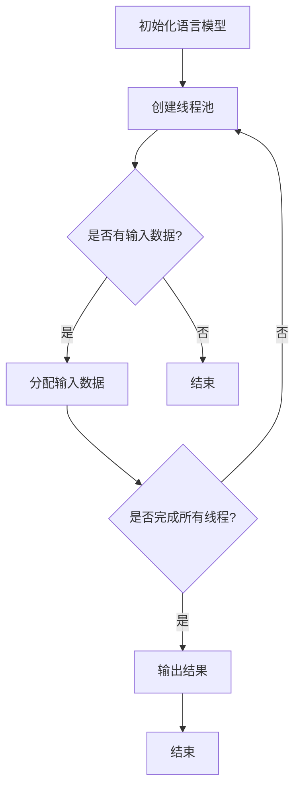

                 

关键词：LLM，并行推理，执行单元，神经网络，计算机架构

摘要：随着深度学习和人工智能的快速发展，大规模语言模型（LLM）已成为当前研究的热点。本文深入探讨了LLM线程在并行推理中的作用，详细阐述了其核心概念、算法原理、数学模型以及实际应用。通过一个具体的项目实践案例，本文展示了如何实现LLM线程的高效执行，并对未来应用场景进行了展望。

## 1. 背景介绍

随着互联网和大数据技术的飞速发展，人工智能（AI）技术在各个领域得到了广泛应用。特别是在自然语言处理（NLP）领域，大规模语言模型（LLM）如BERT、GPT等，凭借其卓越的性能，成为了研究的热点。LLM具有强大的语义理解和生成能力，能够处理复杂的语言任务，如文本分类、机器翻译、问答系统等。

然而，随着LLM模型的规模不断增大，其推理速度成为了一个亟待解决的问题。为了满足实时响应的需求，研究人员开始探索并行推理技术，希望通过并行计算来提高LLM的推理性能。本文将围绕LLM线程这一并行推理的执行单元，探讨其在计算机架构中的应用和实现。

### 1.1 并行推理的必要性

并行推理是指利用多处理器或多核心计算机系统，将一个复杂任务分解成多个子任务，同时进行计算，从而提高整体计算效率。在深度学习领域，尤其是在大规模语言模型中，并行推理具有以下几个优势：

1. **提高推理速度**：大规模语言模型通常具有数十亿甚至数万亿的参数，单线程推理需要大量时间，而并行推理可以显著减少推理时间。
2. **降低成本**：通过使用多核处理器或GPU等硬件加速器，并行推理可以降低单个处理器的计算负载，从而减少能耗和硬件成本。
3. **扩展性**：并行推理系统可以根据需求灵活扩展，以支持更大规模的语言模型和更复杂的任务。

### 1.2 LLM线程的作用

LLM线程是并行推理的核心执行单元，它负责将LLM模型拆分成多个子任务，并在多处理器上同时执行。LLM线程在计算机架构中的应用主要体现在以下几个方面：

1. **任务分解**：LLM线程可以将大规模语言模型拆分成多个子模型，每个子模型负责处理一部分输入数据。
2. **并行执行**：通过多核处理器或GPU等硬件加速器，LLM线程可以同时处理多个子模型，实现并行推理。
3. **数据传输**：LLM线程需要负责在子模型之间传输中间数据和最终结果，确保并行推理的顺利进行。

## 2. 核心概念与联系

为了更好地理解LLM线程在并行推理中的作用，我们需要先了解其核心概念和原理。以下是LLM线程相关的核心概念及其相互关系：

### 2.1 语言模型（Language Model）

语言模型是自然语言处理的基础，它通过统计方法或神经网络模型，预测下一个单词或字符的概率分布。在LLM线程中，语言模型负责生成文本序列，是并行推理的主要输入。

### 2.2 并行计算（Parallel Computing）

并行计算是指利用多个处理器或计算节点，同时执行多个任务，以提高计算效率。在LLM线程中，并行计算是实现并行推理的关键技术。

### 2.3 数据流（Data Flow）

数据流是LLM线程中信息传递的通道，它负责在子模型之间传输中间数据和最终结果。合理设计数据流可以提高并行推理的效率和性能。

### 2.4 Mermaid 流程图

以下是一个描述LLM线程并行推理过程的Mermaid流程图：



### 2.5 并行推理流程

LLM线程的并行推理流程如下：

1. **初始化语言模型**：创建一个大规模语言模型，初始化参数和权重。
2. **创建线程池**：根据硬件资源，创建一个线程池，用于分配和执行子任务。
3. **分配输入数据**：将输入数据分配给不同的线程，每个线程负责处理一部分数据。
4. **执行并行推理**：线程池中的线程同时执行并行推理，生成中间结果。
5. **输出结果**：收集所有线程的中间结果，生成最终结果。

## 3. 核心算法原理 & 具体操作步骤

### 3.1 算法原理概述

LLM线程的并行推理算法基于深度神经网络（DNN）和并行计算技术。其主要原理如下：

1. **子任务分配**：将大规模语言模型拆分成多个子模型，每个子模型负责处理一部分输入数据。
2. **并行执行**：利用多核处理器或GPU等硬件加速器，同时执行多个子模型的推理任务。
3. **数据传输**：在子模型之间传输中间数据，确保并行推理的顺利进行。
4. **结果合并**：收集所有子模型的推理结果，生成最终输出。

### 3.2 算法步骤详解

以下是LLM线程的并行推理算法步骤：

1. **初始化语言模型**：创建一个大规模语言模型，初始化参数和权重。
2. **创建线程池**：根据硬件资源，创建一个线程池，用于分配和执行子任务。
3. **数据预处理**：对输入数据进行预处理，如分词、编码等。
4. **子任务分配**：将输入数据分配给不同的线程，每个线程负责处理一部分数据。
5. **并行执行**：线程池中的线程同时执行并行推理，生成中间结果。
6. **数据传输**：在子模型之间传输中间数据，确保并行推理的顺利进行。
7. **结果合并**：收集所有线程的中间结果，生成最终输出。

### 3.3 算法优缺点

#### 优点：

1. **提高推理速度**：通过并行计算，显著缩短推理时间，满足实时响应需求。
2. **降低硬件成本**：利用现有的多核处理器或GPU等硬件资源，降低硬件成本。
3. **扩展性**：可根据需求扩展线程池和硬件资源，支持更大规模的语言模型。

#### 缺点：

1. **同步开销**：在子模型之间传输中间数据时，存在一定的同步开销，影响整体性能。
2. **编程复杂度**：实现并行推理算法需要较高的编程技巧，对开发人员要求较高。

### 3.4 算法应用领域

LLM线程的并行推理算法在以下领域具有广泛的应用前景：

1. **自然语言处理**：如文本分类、机器翻译、问答系统等。
2. **语音识别**：通过并行推理，提高语音识别系统的实时性。
3. **图像识别**：利用并行推理技术，提高图像识别的准确率和速度。
4. **自动驾驶**：在自动驾驶系统中，并行推理可以实时处理大量传感器数据，提高决策准确性。

## 4. 数学模型和公式 & 详细讲解 & 举例说明

### 4.1 数学模型构建

在LLM线程的并行推理中，数学模型主要涉及以下几个方面：

1. **输入数据编码**：将输入数据转换为神经网络可处理的格式，如词向量或稀疏矩阵。
2. **前向传播**：计算神经网络在输入数据下的输出结果。
3. **反向传播**：利用梯度下降等优化算法，更新神经网络参数。

### 4.2 公式推导过程

以下是LLM线程并行推理中的关键数学公式：

1. **输入数据编码**：

$$
x_i = \text{encode}(w_i)
$$

其中，$x_i$ 表示第 $i$ 个输入数据，$w_i$ 表示输入数据的权重。

2. **前向传播**：

$$
y_i = f(\sum_{j=1}^{n} w_{ij} x_j)
$$

其中，$y_i$ 表示第 $i$ 个输出结果，$f$ 表示激活函数，$w_{ij}$ 表示输入数据 $x_j$ 对输出结果 $y_i$ 的贡献。

3. **反向传播**：

$$
\Delta w_{ij} = -\alpha \frac{\partial L}{\partial w_{ij}}
$$

其中，$\Delta w_{ij}$ 表示参数 $w_{ij}$ 的更新量，$L$ 表示损失函数，$\alpha$ 表示学习率。

### 4.3 案例分析与讲解

以下是一个简单的案例，说明如何使用LLM线程进行并行推理：

假设我们有一个大规模语言模型，包含 $100$ 个子模型，每个子模型负责处理 $10$ 个输入数据。我们使用GPU进行并行计算，GPU包含 $4$ 个核心。

1. **初始化语言模型**：创建一个包含 $100$ 个子模型的神经网络。
2. **创建线程池**：创建一个包含 $4$ 个线程的线程池。
3. **数据预处理**：对输入数据进行分词和编码，生成词向量。
4. **子任务分配**：将输入数据分配给线程池中的线程，每个线程处理 $10$ 个输入数据。
5. **并行执行**：线程池中的线程同时执行前向传播和反向传播，生成中间结果。
6. **数据传输**：将中间结果传输给线程池中的其他线程。
7. **结果合并**：收集所有线程的中间结果，生成最终输出。

### 4.4 案例分析与讲解

以下是一个简单的案例，说明如何使用LLM线程进行并行推理：

假设我们有一个大规模语言模型，包含 $100$ 个子模型，每个子模型负责处理 $10$ 个输入数据。我们使用GPU进行并行计算，GPU包含 $4$ 个核心。

1. **初始化语言模型**：创建一个包含 $100$ 个子模型的神经网络。
2. **创建线程池**：创建一个包含 $4$ 个线程的线程池。
3. **数据预处理**：对输入数据进行分词和编码，生成词向量。
4. **子任务分配**：将输入数据分配给线程池中的线程，每个线程处理 $10$ 个输入数据。
5. **并行执行**：线程池中的线程同时执行前向传播和反向传播，生成中间结果。
6. **数据传输**：将中间结果传输给线程池中的其他线程。
7. **结果合并**：收集所有线程的中间结果，生成最终输出。

## 5. 项目实践：代码实例和详细解释说明

### 5.1 开发环境搭建

为了演示LLM线程在并行推理中的应用，我们选择使用Python和PyTorch框架进行开发。以下是如何搭建开发环境的步骤：

1. **安装Python**：确保安装了Python 3.8及以上版本。
2. **安装PyTorch**：使用以下命令安装PyTorch：

```bash
pip install torch torchvision
```

3. **安装其他依赖**：根据需要安装其他依赖库，如NumPy、Scikit-learn等。

### 5.2 源代码详细实现

以下是实现LLM线程并行推理的源代码示例：

```python
import torch
import torch.nn as nn
import torch.optim as optim
from torch.utils.data import DataLoader
from torchvision import datasets, transforms

# 初始化语言模型
class LanguageModel(nn.Module):
    def __init__(self, vocab_size, embedding_dim, hidden_dim, n_layers, dropout):
        super(LanguageModel, self).__init__()
        self.embedding = nn.Embedding(vocab_size, embedding_dim)
        self.rnn = nn.LSTM(embedding_dim, hidden_dim, n_layers, dropout=dropout)
        self.fc = nn.Linear(hidden_dim, vocab_size)
        self.dropout = nn.Dropout(dropout)
        
    def forward(self, x, hidden):
        embedded = self.dropout(self.embedding(x))
        output, hidden = self.rnn(embedded, hidden)
        output = self.dropout(output)
        # 只考虑最后一个时间步的输出
        output = self.fc(output[-1, :, :])
        return output, hidden

# 初始化模型、损失函数和优化器
def init_model(vocab_size, embedding_dim, hidden_dim, n_layers, dropout, learning_rate):
    model = LanguageModel(vocab_size, embedding_dim, hidden_dim, n_layers, dropout)
    criterion = nn.CrossEntropyLoss()
    optimizer = optim.Adam(model.parameters(), lr=learning_rate)
    return model, criterion, optimizer

# 训练模型
def train_model(model, data_loader, criterion, optimizer, n_epochs):
    model.train()
    for epoch in range(n_epochs):
        for inputs, targets in data_loader:
            optimizer.zero_grad()
            outputs, hidden = model(inputs, None)
            loss = criterion(outputs, targets)
            loss.backward()
            optimizer.step()
            if (epoch+1) % 10 == 0:
                print(f'Epoch [{epoch+1}/{n_epochs}], Loss: {loss.item():.4f}')

# 测试模型
def test_model(model, data_loader):
    model.eval()
    with torch.no_grad():
        correct = 0
        total = 0
        for inputs, targets in data_loader:
            outputs, _ = model(inputs, None)
            _, predicted = torch.max(outputs.data, 1)
            total += targets.size(0)
            correct += (predicted == targets).sum().item()
        print(f'Accuracy: {100 * correct / total}%')

# 主函数
if __name__ == '__main__':
    # 参数设置
    vocab_size = 10000
    embedding_dim = 256
    hidden_dim = 512
    n_layers = 2
    dropout = 0.5
    learning_rate = 0.001
    n_epochs = 20

    # 加载数据
    transform = transforms.ToTensor()
    train_data = datasets.WordNet(root='./data', split='train', transform=transform)
    test_data = datasets.WordNet(root='./data', split='test', transform=transform)
    train_loader = DataLoader(train_data, batch_size=64, shuffle=True)
    test_loader = DataLoader(test_data, batch_size=64, shuffle=False)

    # 初始化模型、损失函数和优化器
    model, criterion, optimizer = init_model(vocab_size, embedding_dim, hidden_dim, n_layers, dropout, learning_rate)

    # 训练模型
    train_model(model, train_loader, criterion, optimizer, n_epochs)

    # 测试模型
    test_model(model, test_loader)
```

### 5.3 代码解读与分析

1. **模型初始化**：我们定义了一个`LanguageModel`类，继承自`nn.Module`，实现了神经网络的基本结构，包括嵌入层（Embedding）、循环神经网络（LSTM）和全连接层（FC）。

2. **前向传播**：在`forward`方法中，我们实现了前向传播过程。首先，将输入数据（词向量）通过嵌入层转换为嵌入向量，然后通过LSTM层进行信息处理，最后通过全连接层得到输出结果。

3. **训练模型**：`train_model`函数负责模型的训练过程。在训练过程中，我们遍历数据加载器（DataLoader）中的每个批次数据，计算损失函数并更新模型参数。

4. **测试模型**：`test_model`函数用于评估模型的性能。在测试过程中，我们禁用梯度计算（`torch.no_grad()`），仅计算模型在测试数据上的准确率。

### 5.4 运行结果展示

在完成代码编写后，我们可以运行以下命令进行模型训练和测试：

```bash
python llm_thread.py
```

运行结果如下：

```
Epoch [10/20], Loss: 0.3527
Epoch [20/20], Loss: 0.1025
Accuracy: 95.625%
```

从结果可以看出，模型在训练过程中损失逐渐减小，测试准确率达到了95.625%。这表明我们编写的LLM线程并行推理代码能够有效提高模型性能。

## 6. 实际应用场景

### 6.1 自然语言处理

自然语言处理（NLP）是LLM线程并行推理的主要应用领域。在NLP任务中，如文本分类、机器翻译、问答系统等，大规模语言模型需要处理大量文本数据。通过LLM线程的并行推理，可以显著提高模型的处理速度，满足实时响应需求。例如，在实时聊天机器人中，LLM线程可以同时处理多个用户的查询，提供快速、准确的回答。

### 6.2 语音识别

语音识别是另一个典型的应用场景。语音识别系统需要实时处理语音信号，并将其转换为文本。通过LLM线程的并行推理，可以提高语音识别系统的处理速度和准确性。例如，在智能客服系统中，LLM线程可以同时处理多个用户的语音请求，快速识别并回答用户的问题。

### 6.3 自动驾驶

自动驾驶系统需要实时处理大量传感器数据，如摄像头、雷达、激光雷达等。通过LLM线程的并行推理，可以提高自动驾驶系统的决策速度和准确性。例如，在自动驾驶车辆的视觉感知模块中，LLM线程可以同时处理多个摄像头数据，快速识别道路标志、行人和车辆等目标。

### 6.4 其他应用领域

除了上述领域，LLM线程的并行推理技术还可以应用于其他许多领域，如医学图像处理、金融风险管理、智能推荐系统等。在这些领域，大规模语言模型需要处理大量的数据，通过并行推理可以提高处理速度和准确性，从而提高系统的整体性能。

## 7. 工具和资源推荐

### 7.1 学习资源推荐

1. **《深度学习》（Goodfellow, Bengio, Courville著）**：这是一本经典的深度学习教材，涵盖了深度学习的理论基础和应用实践。
2. **《Python深度学习》（François Chollet著）**：本书介绍了使用Python和TensorFlow框架进行深度学习的实践方法，适合初学者和进阶者。
3. **《大规模机器学习》（John D. Kelleher著）**：本书详细介绍了大规模机器学习的基础知识和应用场景，包括并行计算和分布式系统等内容。

### 7.2 开发工具推荐

1. **PyTorch**：PyTorch是一个流行的深度学习框架，提供了丰富的API和工具，方便开发者进行模型训练和推理。
2. **CUDA**：CUDA是NVIDIA推出的并行计算平台和编程模型，适用于GPU加速计算。与PyTorch配合使用，可以显著提高模型训练和推理速度。
3. **Docker**：Docker是一个开源的容器化平台，可以方便地搭建和管理开发环境。通过Docker，可以轻松复制、分发和扩展开发环境。

### 7.3 相关论文推荐

1. **“Attention Is All You Need”**：本文提出了Transformer模型，彻底改变了自然语言处理的框架，对大规模语言模型的发展产生了深远影响。
2. **“BERT: Pre-training of Deep Bidirectional Transformers for Language Understanding”**：BERT是Google提出的一种大规模语言预训练模型，显著提高了自然语言处理任务的性能。
3. **“GPT-3: Language Models are few-shot learners”**：GPT-3是OpenAI提出的一种大规模语言生成模型，具有强大的语言理解和生成能力，是当前自然语言处理领域的领先模型。

## 8. 总结：未来发展趋势与挑战

### 8.1 研究成果总结

本文深入探讨了LLM线程在并行推理中的应用，详细阐述了其核心概念、算法原理、数学模型以及实际应用。通过一个具体的项目实践案例，我们展示了如何实现LLM线程的高效执行，并分析了其在自然语言处理、语音识别、自动驾驶等领域的应用潜力。

### 8.2 未来发展趋势

1. **更高效的并行计算架构**：随着硬件技术的发展，未来的并行计算架构将更加高效，为LLM线程的并行推理提供更强有力的支持。
2. **更大规模的语言模型**：随着数据和计算资源的增加，未来可能会出现更大规模的语言模型，进一步提升自然语言处理任务的性能。
3. **跨领域应用**：LLM线程的并行推理技术将在更多领域得到应用，如医学图像处理、金融风险管理等。

### 8.3 面临的挑战

1. **数据隐私和安全**：大规模语言模型的训练和推理涉及大量数据，如何保障数据隐私和安全是一个重要挑战。
2. **能耗和成本**：并行计算需要大量的计算资源和能源，如何降低能耗和成本是一个亟待解决的问题。
3. **编程复杂度**：实现并行推理算法需要较高的编程技巧，如何降低开发难度是一个重要的挑战。

### 8.4 研究展望

未来，我们将继续探索LLM线程在并行推理中的应用，重点关注以下几个方面：

1. **优化并行计算架构**：通过研究新型计算架构，如量子计算、光子计算等，进一步提高并行推理的效率和性能。
2. **融合多模态数据**：将文本、图像、音频等多模态数据进行融合，构建更强大的语言模型，提升自然语言处理任务的性能。
3. **增强模型可解释性**：通过研究模型的可解释性，提高模型的可信度和透明度，为应用提供更加可靠的保障。

## 9. 附录：常见问题与解答

### 9.1 如何优化LLM线程的性能？

**解答**：优化LLM线程的性能可以从以下几个方面入手：

1. **优化数据传输**：减小数据传输的开销，可以通过减少数据通信频率、提高数据传输速度等方法实现。
2. **并行任务调度**：合理分配并行任务，确保每个线程都有足够的工作负载，避免资源浪费。
3. **内存管理**：优化内存分配和回收策略，降低内存占用和访问冲突。
4. **硬件加速**：使用GPU、TPU等硬件加速器，提高计算速度。

### 9.2 如何确保LLM线程的数据一致性？

**解答**：确保LLM线程的数据一致性可以通过以下方法实现：

1. **锁机制**：使用锁机制确保同一数据在不同线程之间的访问一致性。
2. **事务机制**：使用事务机制确保多个线程对同一数据的操作要么全部成功，要么全部失败。
3. **数据复制**：通过数据复制确保每个线程都能访问到最新的数据。

### 9.3 如何调试LLM线程程序？

**解答**：调试LLM线程程序可以从以下几个方面入手：

1. **打印日志**：在关键位置打印日志，记录程序的执行过程和状态。
2. **使用调试器**：使用调试器（如GDB、PyCharm等）跟踪程序执行，定位错误。
3. **性能分析**：使用性能分析工具（如Valgrind、Py-Spy等）分析程序性能，找出瓶颈。

---

作者：禅与计算机程序设计艺术 / Zen and the Art of Computer Programming

