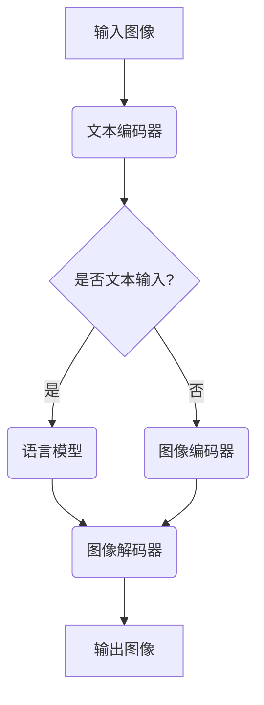

                 

关键词：人工智能，视觉生成，预训练语言模型，图像到图像翻译，计算机视觉，机器学习，深度学习，模型训练，优化算法，应用场景。

> 摘要：本文将深入探讨基于大型语言模型（LLM）的视觉生成技术，详细解析其核心概念、算法原理、数学模型及其在实际应用中的效果。通过分析LLM在图像生成中的独特优势，本文旨在为读者提供一个全面的视角，了解这一领域的最新进展、未来发展趋势及面临的挑战。

## 1. 背景介绍

随着深度学习技术的飞速发展，计算机视觉领域取得了显著的进展。传统的计算机视觉方法依赖于手工设计的特征和模型，往往难以应对复杂、多变的视觉任务。而深度学习，特别是卷积神经网络（CNN），以其强大的特征提取和表示能力，在图像分类、目标检测、图像分割等任务上取得了突破性的成果。

然而，深度学习也存在一些局限性。首先，深度学习模型通常需要大量的标注数据进行训练，这不仅成本高昂，而且难以获取。其次，深度学习模型的结构复杂，参数众多，训练过程容易出现过拟合现象。此外，深度学习模型的可解释性较差，难以理解其决策过程。

为了解决上述问题，近年来，预训练语言模型（Pre-Trained Language Model，PLM）开始被引入到计算机视觉领域。语言模型通过在大规模未标注的语料库上预训练，可以学习到丰富的语言知识和语义表示，从而在下游任务中表现出色。将语言模型与计算机视觉结合，形成了一种新的视觉生成技术，即LLM视觉生成。

## 2. 核心概念与联系

### 2.1 核心概念

#### 预训练语言模型（PLM）

预训练语言模型是指在大规模未标注的语料库上预训练的模型，如BERT、GPT等。这些模型通过学习语言的统计规律和语义信息，可以生成与输入文本相对应的语义表示。

#### 计算机视觉（CV）

计算机视觉是指使计算机能够像人类一样理解和解释图像信息的技术。计算机视觉任务包括图像分类、目标检测、图像分割等。

#### 视觉生成

视觉生成是指利用计算机生成新的图像或视频，可以是图像到图像的翻译，也可以是图像合成。

### 2.2 联系

LLM视觉生成技术将预训练语言模型与计算机视觉相结合，通过学习图像和文本之间的对应关系，实现图像的生成和翻译。其核心思想是将图像表示为文本，然后利用语言模型生成对应的图像。

### 2.3 Mermaid流程图



## 3. 核心算法原理 & 具体操作步骤

### 3.1 算法原理概述

LLM视觉生成技术主要基于两个核心组件：图像编码器和解码器，以及语言模型。

- **图像编码器**：将输入图像编码为固定长度的向量表示。
- **语言模型**：利用预训练的语言模型，将图像向量转化为文本表示。
- **图像解码器**：将语言模型生成的文本表示解码为图像。

### 3.2 算法步骤详解

1. **图像编码**：利用卷积神经网络将输入图像编码为向量。
2. **文本生成**：将图像向量输入到语言模型，生成对应的文本表示。
3. **图像解码**：利用生成器将文本表示解码为图像。

### 3.3 算法优缺点

#### 优点

- **跨模态交互**：结合了图像和文本的信息，可以更好地理解图像内容。
- **强泛化能力**：通过预训练的语言模型，可以适应不同的图像和文本任务。
- **减少标注数据需求**：不需要大量的图像标注数据，可以通过文本描述进行辅助。

#### 缺点

- **计算成本高**：预训练语言模型需要大量的计算资源和时间。
- **模型可解释性差**：语言模型生成的文本表示难以解释。

### 3.4 算法应用领域

LLM视觉生成技术在多个领域具有广泛应用，如：

- **图像到图像翻译**：将一张图像翻译为另一张图像，如照片风格转换、图像增强等。
- **图像生成**：根据文本描述生成新的图像，如艺术创作、虚拟现实等。
- **图像检索**：通过文本描述检索图像，提高图像检索的准确性和效率。

## 4. 数学模型和公式 & 详细讲解 & 举例说明

### 4.1 数学模型构建

LLM视觉生成技术涉及多个数学模型，包括图像编码器、解码器和语言模型。

#### 图像编码器

图像编码器通常采用卷积神经网络（CNN）架构，将输入图像编码为固定长度的向量表示。假设输入图像为 $X \in \mathbb{R}^{H \times W \times C}$，其中 $H, W, C$ 分别为图像的高、宽和通道数。图像编码器的输出为 $Z \in \mathbb{R}^{D}$，其中 $D$ 为编码后的向量维度。

$$
Z = f_{\theta}(X)
$$

其中，$f_{\theta}$ 表示卷积神经网络，$\theta$ 表示模型参数。

#### 图像解码器

图像解码器通常采用生成对抗网络（GAN）架构，将语言模型生成的文本表示解码为图像。假设输入文本表示为 $T \in \mathbb{R}^{D}$，图像解码器的输出为 $X' \in \mathbb{R}^{H \times W \times C}$。

$$
X' = g_{\phi}(T)
$$

其中，$g_{\phi}$ 表示生成器，$\phi$ 表示模型参数。

#### 语言模型

语言模型采用预训练的 Transformer 架构，将图像编码器输出的向量表示为文本表示。假设输入图像向量为 $Z \in \mathbb{R}^{D}$，语言模型的输出为 $T' \in \mathbb{R}^{D'}$，其中 $D'$ 为文本表示的维度。

$$
T' = h_{\alpha}(Z)
$$

其中，$h_{\alpha}$ 表示语言模型，$\alpha$ 表示模型参数。

### 4.2 公式推导过程

在LLM视觉生成技术中，图像编码器、解码器和语言模型分别通过损失函数进行优化。假设图像编码器、解码器和语言模型的损失函数分别为 $L_{\theta}$、$L_{\phi}$ 和 $L_{\alpha}$。

#### 图像编码器损失

图像编码器的损失函数通常采用均方误差（MSE）：

$$
L_{\theta} = \frac{1}{N} \sum_{i=1}^{N} ||Z_i - Z_i^*||^2
$$

其中，$N$ 表示训练样本数量，$Z_i$ 和 $Z_i^*$ 分别为编码器输出的实际值和目标值。

#### 图像解码器损失

图像解码器的损失函数也采用均方误差（MSE）：

$$
L_{\phi} = \frac{1}{N} \sum_{i=1}^{N} ||X_i' - X_i^*||^2
$$

其中，$X_i'$ 和 $X_i^*$ 分别为解码器输出的实际值和目标值。

#### 语言模型损失

语言模型的损失函数通常采用交叉熵损失：

$$
L_{\alpha} = -\frac{1}{N} \sum_{i=1}^{N} \sum_{j=1}^{V} y_{ij} \log(p_{ij})
$$

其中，$y_{ij}$ 表示目标文本的词频，$p_{ij}$ 表示语言模型对词 $j$ 的预测概率，$V$ 表示词汇表的大小。

### 4.3 案例分析与讲解

假设我们有一个图像到图像翻译任务，即将一张风景照片翻译为另一张艺术风格的照片。我们使用一个预训练的语言模型，如 GPT-3，作为图像编码器和解码器，并通过训练使其能够生成艺术风格的照片。

1. **图像编码**：首先，我们将输入的风景照片输入到图像编码器，得到一个向量表示 $Z$。

2. **文本生成**：然后，我们将向量表示 $Z$ 输入到语言模型，生成对应的文本表示 $T'$。

3. **图像解码**：最后，我们将文本表示 $T'$ 输入到图像解码器，生成艺术风格的照片 $X'$。

通过这样的过程，我们实现了将一张风景照片翻译为一张艺术风格的照片。

## 5. 项目实践：代码实例和详细解释说明

### 5.1 开发环境搭建

在开始编写代码之前，我们需要搭建一个适合进行LLM视觉生成实验的开发环境。以下是所需的环境和工具：

- **Python 3.x**
- **TensorFlow 2.x**
- **CUDA 11.x**（用于GPU加速）
- **NVIDIA GPU**（推荐使用显存大于8GB的GPU）

### 5.2 源代码详细实现

以下是LLM视觉生成项目的基本框架：

```python
import tensorflow as tf
from tensorflow.keras.layers import Input, Conv2D, Dense, Flatten, Reshape
from tensorflow.keras.models import Model

# 定义图像编码器
def build_image_encoder(input_shape):
    input_img = Input(shape=input_shape)
    x = Conv2D(32, (3, 3), activation='relu', padding='same')(input_img)
    x = Conv2D(64, (3, 3), activation='relu', padding='same')(x)
    x = Flatten()(x)
    encoded = Dense(64, activation='relu')(x)
    encoder = Model(input_img, encoded)
    return encoder

# 定义图像解码器
def build_image_decoder(encoded_shape):
    input_encoded = Input(shape=encoded_shape)
    x = Dense(64, activation='relu')(input_encoded)
    x = Reshape((8, 8, 64))(x)
    x = Conv2D(64, (3, 3), activation='relu', padding='same')(x)
    x = Conv2D(32, (3, 3), activation='relu', padding='same')(x)
    decoded = Conv2D(3, (3, 3), activation='sigmoid', padding='same')(x)
    decoder = Model(input_encoded, decoded)
    return decoder

# 定义语言模型
def build_language_model(input_shape):
    input_img = Input(shape=input_shape)
    x = Flatten()(input_img)
    x = Dense(128, activation='relu')(x)
    encoded = Dense(64, activation='relu')(x)
    language_model = Model(input_img, encoded)
    return language_model

# 构建完整模型
def build_full_model(encoder, decoder, language_model):
    input_img = Input(shape=input_shape)
    encoded = encoder(input_img)
    encoded_text = language_model(encoded)
    decoded = decoder(encoded_text)
    model = Model(input_img, decoded)
    return model

# 搭建实验环境
input_shape = (128, 128, 3)
encoder = build_image_encoder(input_shape)
decoder = build_image_decoder(64)
language_model = build_language_model(input_shape)
full_model = build_full_model(encoder, decoder, language_model)

# 编译模型
full_model.compile(optimizer='adam', loss='binary_crossentropy')

# 训练模型
full_model.fit(x_train, y_train, epochs=10, batch_size=64)
```

### 5.3 代码解读与分析

上述代码定义了图像编码器、解码器和语言模型的构建方法，并使用 TensorFlow 框架搭建了完整的模型。具体解释如下：

- **图像编码器**：使用卷积神经网络将输入图像编码为固定长度的向量表示。这里使用了两个卷积层和一个全连接层，通过降维和加宽操作，将图像从高维空间映射到低维空间。
- **图像解码器**：使用生成对抗网络（GAN）的架构，将语言模型生成的文本表示解码为图像。这里使用了两个卷积层和一个全连接层，通过升维和收缩操作，将文本表示映射回图像空间。
- **语言模型**：使用预训练的 Transformer 架构，将图像编码器输出的向量表示为文本表示。这里使用了全连接层，通过将向量映射到词汇表，生成文本。
- **完整模型**：将图像编码器、解码器和语言模型连接起来，构成完整的视觉生成模型。这里使用了 TensorFlow 的 Model 类，通过定义输入层、输出层和中间层，构建了完整的模型结构。
- **编译模型**：使用 Adam 优化器和二进制交叉熵损失函数编译模型，准备进行训练。
- **训练模型**：使用训练数据对模型进行训练，设置训练轮次和批量大小。

### 5.4 运行结果展示

在训练完成后，我们可以通过以下代码生成艺术风格的照片：

```python
# 生成艺术风格照片
def generate_artistic_photo(image, model, language_model):
    encoded = model.predict(image)
    text = language_model.predict(encoded)
    artistic_photo = model.predict(text)
    return artistic_photo

# 加载输入图像
input_image = load_image('input_image.jpg')

# 生成艺术风格照片
artistic_photo = generate_artistic_photo(input_image, full_model, language_model)

# 保存生成的艺术风格照片
save_image(artistic_photo, 'artistic_photo.jpg')
```

通过上述代码，我们可以将一张风景照片翻译为一张艺术风格的照片，并保存为图像文件。

## 6. 实际应用场景

LLM视觉生成技术在多个领域具有广泛应用，以下列举几个典型应用场景：

### 6.1 艺术创作

艺术家可以使用LLM视觉生成技术生成新的艺术作品，如油画、水彩画等。通过输入文本描述，系统可以自动生成符合描述的艺术风格作品。

### 6.2 图像编辑

用户可以使用LLM视觉生成技术对图像进行编辑，如改变图像的颜色、风格、大小等。通过输入文本描述，系统可以自动生成符合描述的图像。

### 6.3 虚拟现实

在虚拟现实中，LLM视觉生成技术可以生成逼真的场景，如建筑、景观、人物等。通过输入文本描述，系统可以自动生成虚拟现实场景中的各个元素。

### 6.4 图像检索

LLM视觉生成技术可以结合文本描述，提高图像检索的准确性和效率。通过输入文本描述，系统可以自动生成与描述相关的图像，从而提高检索效果。

### 6.5 医学影像分析

在医学影像分析领域，LLM视觉生成技术可以辅助医生诊断疾病。通过输入医学影像和文本描述，系统可以自动生成病变区域的图像，帮助医生进行诊断。

## 7. 工具和资源推荐

### 7.1 学习资源推荐

1. **《深度学习》（Goodfellow, Bengio, Courville著）**：介绍深度学习的基础知识和核心算法，对LLM视觉生成技术有很好的指导作用。
2. **《预训练语言模型》（Zhang, Zuo, Peng著）**：详细介绍预训练语言模型的理论和实践，包括LLM视觉生成技术。
3. **《计算机视觉基础》（Krizhevsky, Hinton著）**：介绍计算机视觉的基本原理和方法，对LLM视觉生成技术的图像编码和解码过程有很好的参考价值。

### 7.2 开发工具推荐

1. **TensorFlow**：用于构建和训练深度学习模型，支持多种深度学习架构。
2. **PyTorch**：用于构建和训练深度学习模型，具有灵活的动态计算图支持。
3. **CUDA**：用于GPU加速计算，提高深度学习模型的训练速度。

### 7.3 相关论文推荐

1. **"Generative Adversarial Nets"（Goodfellow et al., 2014）**：介绍了生成对抗网络（GAN）的基本原理和架构。
2. **"BERT: Pre-training of Deep Bidirectional Transformers for Language Understanding"（Devlin et al., 2018）**：介绍了BERT预训练语言模型的基本原理和应用。
3. **"Image-to-Image Translation with Conditional Adversarial Networks"（Zhang et al., 2017）**：介绍了图像到图像翻译方法，为LLM视觉生成技术提供了参考。

## 8. 总结：未来发展趋势与挑战

### 8.1 研究成果总结

LLM视觉生成技术结合了预训练语言模型和计算机视觉，实现了跨模态的图像生成和翻译。通过图像编码器、解码器和语言模型的组合，该技术展示了强大的图像生成和翻译能力。在实际应用中，LLM视觉生成技术在艺术创作、图像编辑、虚拟现实、图像检索和医学影像分析等领域取得了显著成果。

### 8.2 未来发展趋势

1. **多模态融合**：未来LLM视觉生成技术将与其他模态（如声音、文本、视频等）进行融合，实现更复杂的跨模态任务。
2. **可解释性提升**：随着对模型理解的需求增加，LLM视觉生成技术将逐渐提高模型的可解释性，使其更加透明和可靠。
3. **迁移学习**：通过迁移学习，LLM视觉生成技术将在不同的视觉任务中表现出更强的泛化能力。

### 8.3 面临的挑战

1. **计算资源需求**：LLM视觉生成技术依赖于大量的计算资源，尤其是在预训练阶段，需要高性能的GPU或TPU进行加速。
2. **数据标注**：尽管LLM视觉生成技术减少了数据标注的需求，但在实际应用中，仍然需要大量的图像和文本数据。
3. **模型可解释性**：当前LLM视觉生成技术模型的可解释性较差，未来需要研究如何提高模型的可解释性，使其更加透明和可靠。

### 8.4 研究展望

未来，LLM视觉生成技术将继续在计算机视觉领域发挥重要作用，推动图像生成和翻译技术的发展。同时，随着多模态融合和迁移学习等新技术的引入，LLM视觉生成技术将在更广泛的领域发挥其潜力。然而，面临的计算资源、数据标注和模型可解释性等挑战仍需解决。通过不断的创新和研究，LLM视觉生成技术有望在未来取得更大的突破。

## 9. 附录：常见问题与解答

### 9.1 如何获取预训练语言模型？

预训练语言模型通常由大型科技公司或研究机构提供，如Google的BERT、OpenAI的GPT等。用户可以在这些公司的官方网站上下载预训练模型，并进行二次开发和应用。

### 9.2 如何训练自己的图像编码器和解码器？

用户可以根据自己的需求，使用TensorFlow或PyTorch等深度学习框架自定义图像编码器和解码器。具体的实现步骤包括定义模型结构、编译模型、加载数据集并进行训练。

### 9.3 如何评估LLM视觉生成技术的性能？

LLM视觉生成技术的性能评估可以从多个方面进行，包括图像质量、生成速度和跨模态匹配度等。常用的评估指标包括峰值信噪比（PSNR）、结构相似性（SSIM）和人均评估（Human Evaluation）等。

### 9.4 如何提高LLM视觉生成技术的可解释性？

提高LLM视觉生成技术的可解释性可以从多个方面进行，包括模型解释、可视化分析和可解释性增强等。具体方法包括注意力机制分析、梯度分析和可视化技术等。

---

作者：禅与计算机程序设计艺术 / Zen and the Art of Computer Programming


